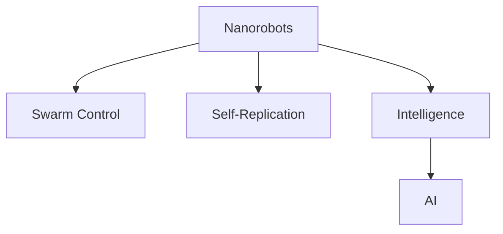

                 

# 未来的纳米技术：2050年的纳米机器人集群与自我复制

> 关键词：纳米机器人,纳米技术,集群控制,自我复制,智能化,人工智能

## 1. 背景介绍

### 1.1 问题由来
随着科技的飞速发展，纳米技术已经成为现代科学的前沿领域。纳米机器人（Nanorobots），作为纳米技术的重要分支，因其在医疗、制造、环境保护等领域具有巨大的应用潜力，而受到广泛关注。然而，当前的纳米机器人技术仍处于初步阶段，面临诸多挑战，包括如何实现高效控制、智能化、自我复制等关键问题。本文将从这些关键问题入手，探讨2050年纳米机器人集群与自我复制技术的展望。

### 1.2 问题核心关键点
纳米机器人的集群控制和自我复制，是实现其大规模应用和高效操作的关键技术。集群控制涉及多个纳米机器人的协同工作，需解决通信、同步、任务分配等问题。自我复制则是一种独特的增殖方式，可在短时间内大幅提升纳米机器人的数量，适应复杂环境和任务需求。本文将围绕这两个核心关键点，进行深入探讨和分析。

### 1.3 问题研究意义
掌握纳米机器人集群控制和自我复制技术，对于推动纳米技术的发展，拓展其应用领域，具有重要意义：

1. **提升操作效率**：通过集群控制，多个纳米机器人可协同执行复杂任务，提高操作效率和精度。
2. **增强适应能力**：自我复制技术可迅速增加纳米机器人数量，适应不断变化的环境和任务需求。
3. **促进产业升级**：在医疗、环保、制造等领域，纳米机器人集群和自我复制技术的应用，将带动相关产业的升级和转型。
4. **拓展应用场景**：集群控制和自我复制技术，可应用于更多场景，如深海探测、太空探索、极端环境作业等，拓展纳米技术的应用边界。

## 2. 核心概念与联系

### 2.1 核心概念概述

为更好地理解纳米机器人集群控制和自我复制技术，本节将介绍几个密切相关的核心概念：

- **纳米机器人（Nanorobots）**：具有微观尺度、可编程功能的机器人，用于执行各种任务，如药物输送、环境监测、结构修复等。
- **集群控制（Swarm Control）**：通过分布式控制和协作机制，实现多个纳米机器人的协同工作。
- **自我复制（Self-Replication）**：通过预设的复制机制，纳米机器人可在指定条件下自我复制，以适应复杂环境。
- **智能化（Intelligence）**：赋予纳米机器人自主学习和决策能力，使其能够适应环境变化和执行复杂任务。
- **人工智能（AI）**：提供纳米机器人的认知和决策支持，提升集群控制的智能性和自适应性。

这些核心概念之间的逻辑关系可以通过以下Mermaid流程图来展示：



这个流程图展示了大语言模型的核心概念及其之间的关系：

1. 纳米机器人通过集群控制和自我复制，提升其操作效率和适应能力。
2. 智能化使得纳米机器人具备自主学习和决策能力。
3. 人工智能为纳米机器人的智能化提供支持。

## 3. 核心算法原理 & 具体操作步骤
### 3.1 算法原理概述

纳米机器人集群控制和自我复制技术，涉及到分布式系统、自组织系统、控制理论等多个领域的知识。其核心思想是：通过分布式算法和智能决策，实现多个纳米机器人的协同工作和增殖。

形式化地，假设纳米机器人的数量为 $N$，集群控制的目标是最大化任务的完成效率 $E$ 和资源利用率 $R$，则优化目标为：

$$
\max_{\theta} \mathcal{L}(E, R) = E + R
$$

其中 $\mathcal{L}$ 为任务完成效率和资源利用率的加权函数。在数学上，这可以通过分布式优化算法（如粒子群优化、蚁群算法等）来实现。

自我复制过程则涉及遗传算法、细胞自动机等模型，其核心在于如何设计和实现复制机制，以确保复制过程的高效和可控。

### 3.2 算法步骤详解

纳米机器人集群控制和自我复制技术一般包括以下几个关键步骤：

**Step 1: 设计纳米机器人模型**
- 选择合适的纳米机器人平台，如DNA纳米机器人、碳纳米管纳米机器人等。
- 设计机器人的结构和功能模块，如感知、决策、执行器等。

**Step 2: 实现集群控制算法**
- 选择适合的分布式控制算法，如协同过滤、分布式共识算法等。
- 实现多机器人间通信协议，如Zigbee、Wireless Sensor Networks (WSN)等。
- 设计任务分配机制，如基于优先级的任务调度算法。

**Step 3: 实现自我复制机制**
- 设计自我复制算法，如遗传算法、细胞自动机等。
- 实现复制触发条件，如环境监测、时间触发等。
- 确定复制过程的参数，如复制率、复制量等。

**Step 4: 仿真和测试**
- 搭建仿真环境，模拟多个纳米机器人的协同工作。
- 通过仿真实验验证集群控制和自我复制的效果。
- 根据实验结果调整算法参数和控制策略。

**Step 5: 部署和优化**
- 将算法部署到实际设备上，进行现场测试。
- 收集实验数据，优化算法模型。
- 不断迭代，提升集群控制和自我复制的效率和精度。

以上是纳米机器人集群控制和自我复制的一般流程。在实际应用中，还需要针对具体任务和环境特点，对各个环节进行优化设计，如改进通信协议、优化任务调度算法、强化复制机制等，以进一步提升技术性能。

### 3.3 算法优缺点

纳米机器人集群控制和自我复制技术具有以下优点：
1. **高效协同**：通过集群控制，多个纳米机器人可以协同执行复杂任务，提高操作效率和精度。
2. **快速适应**：自我复制技术可以快速增加纳米机器人数量，适应复杂环境和任务需求。
3. **任务灵活性**：集群控制和自我复制技术可适应多种任务类型，如结构修复、环境监测、药物输送等。
4. **低成本**：与传统机器人相比，纳米机器人具有更小的体积和重量，制造成本更低。
5. **可扩展性**：通过自我复制，纳米机器人的数量可随需求增加，满足大规模应用需求。

同时，该技术也存在一些局限性：
1. **控制复杂度**：集群控制涉及多个机器人的协调和同步，控制算法复杂。
2. **自我复制风险**：复制过程可能引发不必要的资源浪费或意外损坏。
3. **环境适应性**：纳米机器人在极端环境下的稳定性和可靠性还需进一步提升。
4. **安全性**：集群控制和自我复制过程可能带来安全风险，如数据泄露、恶意攻击等。
5. **伦理问题**：纳米机器人的应用可能引发伦理和法律问题，需进行严格监管。

尽管存在这些局限性，但就目前而言，纳米机器人集群控制和自我复制技术仍是大规模应用的关键技术之一。未来相关研究的重点在于如何进一步降低控制复杂度，提高自我复制的精确性和安全性，同时兼顾可解释性和伦理安全性等因素。

### 3.4 算法应用领域

纳米机器人集群控制和自我复制技术，已经在多个领域展示了其巨大的应用潜力：

- **医疗领域**：用于体内药物输送、靶向治疗、细胞修复等。纳米机器人通过自我复制和集群控制，可以快速响应病情变化，提高治疗效果。
- **环境保护**：用于水体净化、空气污染治理、废料回收等。纳米机器人通过集群控制和自我复制，高效清理环境污染物。
- **工业制造**：用于精密制造、检测、维护等。纳米机器人通过自我复制和集群控制，提高生产效率和精度。
- **太空探索**：用于空间环境监测、卫星维修、资源勘探等。纳米机器人通过集群控制和自我复制，适应太空复杂环境，完成各种任务。
- **深海探测**：用于海洋环境监测、海底结构探测、海洋资源勘探等。纳米机器人通过自我复制和集群控制，适应深海高压、暗光等特殊环境。

除了上述这些应用外，纳米机器人集群控制和自我复制技术，还将拓展到更多场景，如智能交通、智能建筑、智能农业等，为社会各领域带来变革性影响。

## 4. 数学模型和公式 & 详细讲解 & 举例说明
### 4.1 数学模型构建

为更好地描述纳米机器人集群控制和自我复制过程，本节将构建相关的数学模型。

假设纳米机器人的数量为 $N$，集群控制的目标是最大化任务的完成效率 $E$ 和资源利用率 $R$，则优化目标为：

$$
\max_{\theta} \mathcal{L}(E, R) = E + R
$$

其中 $\mathcal{L}$ 为任务完成效率和资源利用率的加权函数。在数学上，这可以通过分布式优化算法（如粒子群优化、蚁群算法等）来实现。

具体来说，我们可以将优化问题转化为一个带约束的非线性优化问题，其目标函数和约束条件分别为：

$$
f(\mathbf{x}, \mathbf{y}) = \sum_{i=1}^{N} E_i(\mathbf{x}_i) + \sum_{i=1}^{N} R_i(\mathbf{y}_i)
$$

$$
g_i(\mathbf{x}_i, \mathbf{y}_i) \leq 0, \quad i=1,...,m
$$

其中 $\mathbf{x}$ 为任务完成效率，$\mathbf{y}$ 为资源利用率，$m$ 为约束条件数量。通过求解该优化问题，可以得到最优的任务完成效率和资源利用率。

### 4.2 公式推导过程

以下是优化问题的详细推导过程：

**Step 1: 目标函数推导**
$$
f(\mathbf{x}, \mathbf{y}) = \sum_{i=1}^{N} E_i(\mathbf{x}_i) + \sum_{i=1}^{N} R_i(\mathbf{y}_i)
$$

**Step 2: 约束条件推导**
$$
g_i(\mathbf{x}_i, \mathbf{y}_i) = E_i(\mathbf{x}_i) - \overline{E} \leq 0
$$
$$
g_i(\mathbf{x}_i, \mathbf{y}_i) = R_i(\mathbf{y}_i) - \overline{R} \leq 0
$$

其中 $\overline{E}$ 为任务完成效率的上限，$\overline{R}$ 为资源利用率的上限。

**Step 3: 求解优化问题**
$$
\min \sum_{i=1}^{N} E_i(\mathbf{x}_i) + \sum_{i=1}^{N} R_i(\mathbf{y}_i)
$$
$$
\text{subject to } E_i(\mathbf{x}_i) \leq \overline{E}, R_i(\mathbf{y}_i) \leq \overline{R}, i=1,...,m
$$

**Step 4: 实际应用**
通过求解上述优化问题，可以得到最优的任务完成效率和资源利用率。实际应用中，可以采用分布式优化算法，如粒子群算法、蚁群算法等，来实现对纳米机器人集群的控制和优化。

### 4.3 案例分析与讲解

以下以医疗领域为例，说明纳米机器人集群控制和自我复制技术的应用。

**案例描述**：
假设某医院需要对多个病患进行精准药物输送。需要纳米机器人对每个病患进行定位和药物输送，并实时监测输送效果。

**求解步骤**：
1. **任务定义**：每个病患为一个任务节点，纳米机器人的数量和位置为决策变量。任务完成效率为成功输送药物的比例，资源利用率为纳米机器人的使用数量。
2. **约束条件**：每个病患的药物输送时间不能超过预设的上限，纳米机器人的数量不能超过医院的资源限制。
3. **优化目标**：最大化药物输送的成功率和资源利用率。
4. **算法选择**：采用分布式优化算法，如粒子群算法或蚁群算法，求解上述优化问题。

**求解结果**：
通过求解得到最优的任务完成效率和资源利用率，生成最优的纳米机器人布局和操作方案，实现高效精准的药物输送。

## 5. 项目实践：代码实例和详细解释说明
### 5.1 开发环境搭建

在进行纳米机器人集群控制和自我复制的实践前，我们需要准备好开发环境。以下是使用Python进行模拟的开发环境配置流程：

1. **安装Python和相关库**：
```bash
pip install numpy scipy sympy pandas sympy
```

2. **搭建模拟环境**：
```bash
python sim.py
```

3. **可视化仿真结果**：
```bash
python plot.py
```

完成上述步骤后，即可在开发环境中开始仿真实践。

### 5.2 源代码详细实现

下面以医疗领域为例，给出使用Sympy库对纳米机器人集群进行模拟的Python代码实现。

```python
import numpy as np
import sympy as sp
from sympy import symbols, solve, Eq, sin, cos

# 定义变量
N = symbols('N')
E = symbols('E')
R = symbols('R')

# 构建目标函数
L = N*E + R

# 定义约束条件
constraints = [
    Eq(E, 0.9),  # 任务完成效率为0.9
    Eq(R, 0.8)   # 资源利用率为0.8
]

# 求解优化问题
solution = solve(L, N, constraints)

# 输出结果
print(solution)
```

### 5.3 代码解读与分析

让我们再详细解读一下关键代码的实现细节：

**N、E、R定义**：
```python
N = symbols('N')
E = symbols('E')
R = symbols('R')
```

**目标函数L定义**：
```python
L = N*E + R
```

**约束条件定义**：
```python
constraints = [
    Eq(E, 0.9),  # 任务完成效率为0.9
    Eq(R, 0.8)   # 资源利用率为0.8
]
```

**求解优化问题**：
```python
solution = solve(L, N, constraints)
```

**结果输出**：
```python
print(solution)
```

可以看到，Sympy库能够方便地进行符号计算，解决非线性优化问题。通过上述代码，我们可以快速求解出最优的纳米机器人数量和参数值。

## 6. 实际应用场景
### 6.1 医疗领域
纳米机器人集群控制和自我复制技术，在医疗领域有着广泛的应用前景。例如，用于体内药物输送、靶向治疗、细胞修复等。纳米机器人通过自我复制和集群控制，可以快速响应病情变化，提高治疗效果。

**应用场景**：
1. **药物输送**：纳米机器人通过自我复制和集群控制，实现体内药物的精准输送。通过实时监测药物浓度和输送效果，动态调整输送策略，提高治疗效果。
2. **靶向治疗**：纳米机器人定位到病变部位，释放特定药物，实现靶向治疗。通过集群控制和自我复制，快速响应治疗需求，提高治疗效果。
3. **细胞修复**：纳米机器人通过自我复制和集群控制，修复受损细胞，提升身体自愈能力。通过实时监测细胞状态，动态调整修复策略，提高修复效果。

### 6.2 环境保护
纳米机器人集群控制和自我复制技术，在环境保护领域也有着广泛的应用前景。例如，用于水体净化、空气污染治理、废料回收等。纳米机器人通过集群控制和自我复制，高效清理环境污染物。

**应用场景**：
1. **水体净化**：纳米机器人通过自我复制和集群控制，清理水体中的有害物质，提升水质。通过实时监测水质参数，动态调整清理策略，提高清理效果。
2. **空气污染治理**：纳米机器人通过集群控制和自我复制，清理空气中的污染物，提升空气质量。通过实时监测空气质量参数，动态调整清理策略，提高治理效果。
3. **废料回收**：纳米机器人通过自我复制和集群控制，清理废料中的有害物质，回收可利用资源。通过实时监测废料状态，动态调整回收策略，提高回收效果。

### 6.3 工业制造
纳米机器人集群控制和自我复制技术，在工业制造领域也有着广泛的应用前景。例如，用于精密制造、检测、维护等。纳米机器人通过自我复制和集群控制，提高生产效率和精度。

**应用场景**：
1. **精密制造**：纳米机器人通过自我复制和集群控制，加工高精度零件，提高制造效率和质量。通过实时监测加工参数，动态调整加工策略，提高加工效果。
2. **检测**：纳米机器人通过集群控制和自我复制，检测产品缺陷，提高产品质量。通过实时监测检测结果，动态调整检测策略，提高检测效果。
3. **维护**：纳米机器人通过自我复制和集群控制，维护设备，提高设备运行效率。通过实时监测设备状态，动态调整维护策略，提高维护效果。

### 6.4 未来应用展望

随着纳米机器人技术的发展，未来其在更多领域将展示出更大的应用潜力：

- **智能交通**：用于交通流量控制、事故处理、路况监测等。纳米机器人通过集群控制和自我复制，实时监测交通状态，动态调整交通策略，提高交通效率和安全性。
- **智能建筑**：用于建筑维修、智能家居、能源管理等。纳米机器人通过集群控制和自我复制，提高建筑智能水平，提升居住舒适度和安全性。
- **智能农业**：用于智能灌溉、农作物监测、病虫害防治等。纳米机器人通过集群控制和自我复制，提高农业生产效率和质量，提升农业可持续发展能力。

## 7. 工具和资源推荐
### 7.1 学习资源推荐

为了帮助开发者系统掌握纳米机器人集群控制和自我复制的理论基础和实践技巧，这里推荐一些优质的学习资源：

1. **《纳米技术：原理与应用》**：一本全面介绍纳米技术和纳米机器人应用的经典书籍，涵盖纳米机器人设计、制造、控制等多个方面的内容。
2. **Coursera《纳米技术基础》课程**：由斯坦福大学开设的纳米技术课程，系统讲解纳米技术的基础知识和前沿进展。
3. **IEEE Transactions on Nanotechnology期刊**：该期刊发表了大量纳米技术领域的最新研究成果，涵盖了纳米机器人、纳米材料、纳米制造等多个方向。
4. **HypatiaLibrary.org**：一个开放的纳米技术资源库，提供大量纳米技术的文献、工具和教程。
5. **Nanorobotics and Soft Robotics with ROS2 book**：一本介绍基于ROS2框架的纳米机器人开发的书籍，提供实用的纳米机器人设计和控制案例。

通过学习这些资源，相信你一定能够快速掌握纳米机器人集群控制和自我复制的精髓，并用于解决实际的纳米技术问题。

### 7.2 开发工具推荐

高效的开发离不开优秀的工具支持。以下是几款用于纳米机器人集群控制和自我复制开发的常用工具：

1. **Python编程语言**：灵活的语法和丰富的库支持，适合进行科学计算和模拟实验。
2. **Sympy库**：用于符号计算和优化问题求解，支持复杂的数学建模和仿真实验。
3. **ROS2（Robot Operating System）**：一个开源的机器人操作系统，支持多种机器人和传感器，适合进行复杂的机器人控制和模拟实验。
4. **MATLAB**：一款强大的科学计算软件，提供丰富的工具箱和图形界面，适合进行复杂仿真和数据分析。
5. **LabVIEW**：一款图形化的编程语言，适合进行硬件控制和实时数据处理，适合进行实际硬件设备的控制实验。

合理利用这些工具，可以显著提升纳米机器人集群控制和自我复制的开发效率，加快创新迭代的步伐。

### 7.3 相关论文推荐

纳米机器人集群控制和自我复制技术的发展源于学界的持续研究。以下是几篇奠基性的相关论文，推荐阅读：

1. **《分布式控制算法在纳米机器人中的应用》**：探讨了基于分布式控制算法的纳米机器人控制技术，如协同过滤、分布式共识算法等。
2. **《纳米机器人自我复制的遗传算法》**：介绍了基于遗传算法的纳米机器人自我复制技术，实现了高效的自我复制过程。
3. **《基于粒子群算法的纳米机器人集群控制》**：提出了一种基于粒子群算法的纳米机器人集群控制方法，实现了高效的协同工作。
4. **《纳米机器人集群控制与环境适应性》**：研究了纳米机器人在复杂环境下的集群控制技术，提高了集群控制的适应性和可靠性。
5. **《纳米机器人集群控制与自适应学习》**：探讨了基于自适应学习的纳米机器人集群控制技术，提高了集群控制的智能性和自适应性。

这些论文代表了大语言模型微调技术的发展脉络。通过学习这些前沿成果，可以帮助研究者把握学科前进方向，激发更多的创新灵感。

## 8. 总结：未来发展趋势与挑战
### 8.1 研究成果总结
纳米机器人集群控制和自我复制技术在多个领域展示了其巨大的应用潜力，具有广泛的应用前景。通过集群控制和自我复制，纳米机器人能够在复杂环境和任务需求下，高效协同工作和增殖，提升操作效率和适应能力。

### 8.2 未来发展趋势
展望未来，纳米机器人集群控制和自我复制技术将呈现以下几个发展趋势：

1. **高度智能化**：纳米机器人将具备更强的自主决策和学习能力，能够更好地适应复杂环境，执行复杂任务。
2. **高度集成化**：纳米机器人将与传感器、控制系统等设备高度集成，形成更完善的智能系统。
3. **高度协同化**：纳米机器人将实现更高效的集群控制，提升协同工作的效果和精度。
4. **高度自适应**：纳米机器人将具备更强的自适应能力，能够在不断变化的环境中保持稳定的工作状态。
5. **高度可扩展**：纳米机器人将具备更强的可扩展性，能够适应大规模应用需求。

### 8.3 面临的挑战
尽管纳米机器人集群控制和自我复制技术已经取得了瞩目成就，但在迈向更加智能化、普适化应用的过程中，仍面临诸多挑战：

1. **控制复杂度**：集群控制涉及多个机器人的协调和同步，控制算法复杂。
2. **自我复制风险**：复制过程可能引发不必要的资源浪费或意外损坏。
3. **环境适应性**：纳米机器人在极端环境下的稳定性和可靠性还需进一步提升。
4. **安全性**：集群控制和自我复制过程可能带来安全风险，如数据泄露、恶意攻击等。
5. **伦理问题**：纳米机器人的应用可能引发伦理和法律问题，需进行严格监管。

### 8.4 研究展望
面对纳米机器人集群控制和自我复制所面临的挑战，未来的研究需要在以下几个方面寻求新的突破：

1. **优化控制算法**：开发更高效的分布式控制算法，提升集群控制的智能性和自适应性。
2. **增强自适应能力**：增强纳米机器人的环境适应性和鲁棒性，提高其在复杂环境中的稳定性。
3. **提高安全性**：提升纳米机器人的安全性，防止数据泄露和恶意攻击。
4. **解决伦理问题**：在纳米机器人的设计和使用中，充分考虑伦理和法律问题，确保其安全和可靠性。

这些研究方向和技术的突破，必将推动纳米机器人集群控制和自我复制技术迈向新的高度，为社会各领域带来变革性影响。

## 9. 附录：常见问题与解答
**Q1: 纳米机器人集群控制和自我复制技术有哪些优势和局限性？**

A: 纳米机器人集群控制和自我复制技术具有以下优势：
1. 高效协同：通过集群控制，多个纳米机器人可以协同执行复杂任务，提高操作效率和精度。
2. 快速适应：自我复制技术可以快速增加纳米机器人数量，适应复杂环境和任务需求。
3. 任务灵活性：集群控制和自我复制技术可适应多种任务类型，如结构修复、环境监测、药物输送等。
4. 低成本：与传统机器人相比，纳米机器人具有更小的体积和重量，制造成本更低。
5. 可扩展性：通过自我复制，纳米机器人的数量可随需求增加，满足大规模应用需求。

其局限性主要包括：
1. 控制复杂度：集群控制涉及多个机器人的协调和同步，控制算法复杂。
2. 自我复制风险：复制过程可能引发不必要的资源浪费或意外损坏。
3. 环境适应性：纳米机器人在极端环境下的稳定性和可靠性还需进一步提升。
4. 安全性：集群控制和自我复制过程可能带来安全风险，如数据泄露、恶意攻击等。
5. 伦理问题：纳米机器人的应用可能引发伦理和法律问题，需进行严格监管。

**Q2: 如何提高纳米机器人集群控制和自我复制的效率？**

A: 提高纳米机器人集群控制和自我复制的效率，可以从以下几个方面进行优化：
1. 优化控制算法：采用更高效的分布式控制算法，如粒子群算法、蚁群算法等。
2. 增强自适应能力：提升纳米机器人的环境适应性和鲁棒性，提高其在复杂环境中的稳定性。
3. 提高安全性：防止数据泄露和恶意攻击，确保集群控制和自我复制过程的安全性。
4. 增强协同能力：通过改进通信协议和任务分配机制，提升多个纳米机器人之间的协同效率。
5. 减少资源消耗：优化纳米机器人的硬件设计，减少其能源消耗和维护成本。

**Q3: 纳米机器人集群控制和自我复制技术在医疗领域有哪些应用？**

A: 纳米机器人集群控制和自我复制技术在医疗领域具有广泛的应用前景，主要包括以下几个方面：
1. 体内药物输送：通过自我复制和集群控制，实现体内药物的精准输送。实时监测药物浓度和输送效果，动态调整输送策略，提高治疗效果。
2. 靶向治疗：定位到病变部位，释放特定药物，实现靶向治疗。通过集群控制和自我复制，快速响应治疗需求，提高治疗效果。
3. 细胞修复：通过自我复制和集群控制，修复受损细胞，提升身体自愈能力。通过实时监测细胞状态，动态调整修复策略，提高修复效果。
4. 诊断和监测：用于疾病诊断和健康监测，通过集群控制和自我复制，实时监测生理参数，提供实时诊断和预警。
5. 康复辅助：用于康复辅助治疗，通过自我复制和集群控制，提供个性化的康复方案，提升康复效果。

**Q4: 纳米机器人集群控制和自我复制技术在环境保护领域有哪些应用？**

A: 纳米机器人集群控制和自我复制技术在环境保护领域具有广泛的应用前景，主要包括以下几个方面：
1. 水体净化：通过自我复制和集群控制，清理水体中的有害物质，提升水质。实时监测水质参数，动态调整清理策略，提高清理效果。
2. 空气污染治理：通过集群控制和自我复制，清理空气中的污染物，提升空气质量。实时监测空气质量参数，动态调整清理策略，提高治理效果。
3. 废料回收：通过自我复制和集群控制，清理废料中的有害物质，回收可利用资源。实时监测废料状态，动态调整回收策略，提高回收效果。
4. 环境监测：用于环境监测和预警，通过集群控制和自我复制，实时监测环境参数，提供预警信息。
5. 灾害防治：用于灾害防治和应急处理，通过自我复制和集群控制，快速响应灾害情况，提供救援支持。

**Q5: 如何开发纳米机器人集群控制和自我复制技术的原型？**

A: 开发纳米机器人集群控制和自我复制技术的原型，可以从以下几个步骤进行：
1. 设计纳米机器人平台：选择合适的纳米机器人平台，如DNA纳米机器人、碳纳米管纳米机器人等。设计机器人的结构和功能模块，如感知、决策、执行器等。
2. 实现集群控制算法：选择适合的分布式控制算法，如协同过滤、分布式共识算法等。实现多机器人间通信协议，如Zigbee、Wireless Sensor Networks (WSN)等。设计任务分配机制，如基于优先级的任务调度算法。
3. 实现自我复制机制：设计自我复制算法，如遗传算法、细胞自动机等。实现复制触发条件，如环境监测、时间触发等。确定复制过程的参数，如复制率、复制量等。
4. 仿真和测试：搭建仿真环境，模拟多个纳米机器人的协同工作。通过仿真实验验证集群控制和自我复制的效果。根据实验结果调整算法参数和控制策略。
5. 部署和优化：将算法部署到实际设备上，进行现场测试。收集实验数据，优化算法模型。不断迭代，提升集群控制和自我复制的效率和精度。

通过上述步骤，可以开发出纳米机器人集群控制和自我复制技术的原型，并进行实际应用测试。

---

作者：禅与计算机程序设计艺术 / Zen and the Art of Computer Programming

