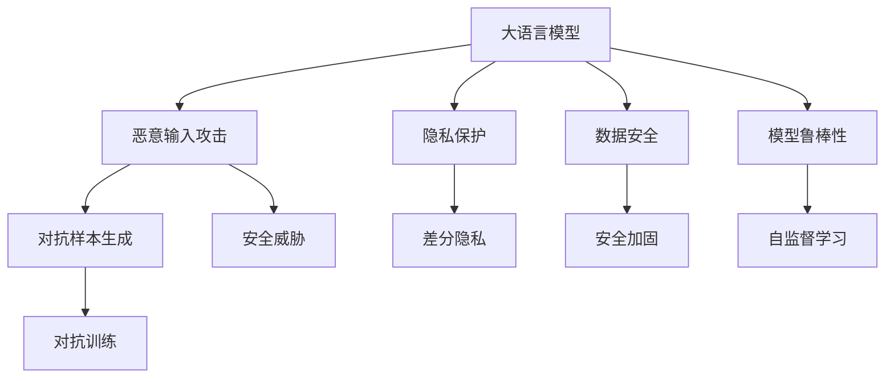
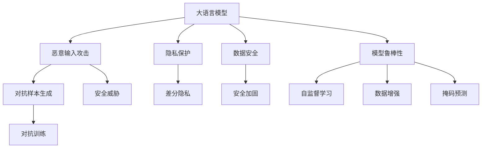

                 

# 构建安全AI：LLM的线程保护机制

> 关键词：人工智能安全,语言模型,线程保护机制,恶意输入过滤,隐私保护,数据安全,模型鲁棒性,自监督学习

## 1. 背景介绍

### 1.1 问题由来

随着大语言模型（Large Language Models, LLMs）的迅速发展，其在自然语言处理（Natural Language Processing, NLP）领域的广泛应用逐渐显现出其强大的潜在风险。语言模型被广泛用于智能客服、自动翻译、内容生成、情感分析等任务，但其背后的安全问题却鲜为人知。特别是在恶意输入攻击、隐私保护、数据安全等方面，语言模型的漏洞可能会被不法分子利用，导致严重后果。

本文章旨在深入探讨如何通过构建合理的线程保护机制，确保语言模型（尤其是基于Transformer架构的深度学习模型）的安全性，避免模型被恶意输入或攻击，同时保护用户的隐私数据和模型自身的鲁棒性。

### 1.2 问题核心关键点

为了更好地理解大语言模型线程保护机制的核心，本节将介绍几个密切相关的核心概念：

- 大语言模型（LLMs）：以自回归（如GPT）或自编码（如BERT）模型为代表的深度学习语言模型。通过在大规模无标签文本语料上进行预训练，学习通用语言表示，具备强大的语言理解和生成能力。
- 恶意输入攻击：有意设计或通过某种手段生成输入数据，旨在触发模型异常行为或泄露信息，危害模型安全。
- 隐私保护：在数据收集和处理过程中，保护用户数据不被泄露或滥用。
- 数据安全：确保模型的训练和部署过程中，数据不被非法篡改或泄露。
- 模型鲁棒性：模型对输入的鲁棒性，即模型对于特定攻击或噪声的容忍程度。
- 自监督学习（Self-Supervised Learning）：利用未标注数据进行模型训练，无需人工标注，提高模型的泛化能力和鲁棒性。

这些概念之间的逻辑关系可以通过以下Mermaid流程图来展示：



这个流程图展示了大语言模型的核心概念及其之间的关系：

1. 大语言模型通过自监督学习获得基础能力。
2. 模型可能面临恶意输入攻击，导致隐私泄露或模型安全问题。
3. 隐私保护和数据安全是保证模型安全的基础。
4. 通过对抗训练等技术，增强模型的鲁棒性。
5. 自监督学习通过未标注数据训练模型，提高模型的泛化能力和鲁棒性。

这些概念共同构成了大语言模型线程保护机制的构建基础，使其能够在各种场景下发挥强大的语言理解和生成能力，并保证模型的安全性。通过理解这些核心概念，我们可以更好地把握大语言模型线程保护机制的工作原理和优化方向。

## 2. 核心概念与联系

### 2.1 核心概念概述

为更好地理解大语言模型线程保护机制的核心，本节将介绍几个密切相关的核心概念：

- **恶意输入攻击**：
  - **对抗样本生成**：通过对输入数据进行微小扰动，使模型输出发生特定错误。
  - **对抗训练**：通过引入对抗样本，使模型对对抗攻击具备一定的抵抗能力。

- **隐私保护**：
  - **差分隐私**：通过加入噪声，使模型难以反向推断出输入数据的隐私信息。
  - **数据加密**：对输入数据进行加密处理，防止其被非法获取或篡改。

- **数据安全**：
  - **安全加固**：对模型进行安全性评估和加固，防止潜在的安全漏洞。
  - **数据匿名化**：将数据中能够识别个人身份的信息进行去标识化处理。

- **模型鲁棒性**：
  - **对抗鲁棒性**：模型对对抗样本的抵抗能力。
  - **鲁棒训练**：通过特定的训练方法，提高模型的鲁棒性。

- **自监督学习**：
  - **数据增强**：通过对原始数据进行变换或生成，提高数据的多样性，增强模型的泛化能力。
  - **掩码预测**：利用掩码技术，训练模型预测原始文本中的未知部分，提高模型的语言理解能力。

这些核心概念之间的逻辑关系可以通过以下Mermaid流程图来展示：



这个流程图展示了大语言模型线程保护机制的核心概念及其之间的关系：

1. 大语言模型通过自监督学习获得基础能力。
2. 模型可能面临恶意输入攻击，导致隐私泄露或模型安全问题。
3. 隐私保护和数据安全是保证模型安全的基础。
4. 通过对抗训练等技术，增强模型的鲁棒性。
5. 自监督学习通过未标注数据训练模型，提高模型的泛化能力和鲁棒性。

## 3. 核心算法原理 & 具体操作步骤

### 3.1 算法原理概述

大语言模型线程保护机制的核心在于构建一系列防御策略，使模型能够识别和抵抗恶意输入攻击，同时保护用户隐私和数据安全。这些防御策略主要包括以下几个方面：

- **恶意输入检测**：通过检测恶意输入，防止模型被攻击。
- **隐私保护技术**：使用差分隐私、数据加密等技术，保护用户数据不被泄露。
- **对抗训练**：通过引入对抗样本，训练模型对对抗攻击的抵抗能力。
- **鲁棒性增强**：通过自监督学习、数据增强等技术，提高模型的泛化能力和鲁棒性。

### 3.2 算法步骤详解

基于上述原理，构建大语言模型线程保护机制通常包括以下关键步骤：

**Step 1: 数据收集与预处理**

1. 收集大量未标注数据，用于自监督学习训练。
2. 对数据进行清洗、去重、去噪等预处理，提高数据质量。
3. 将数据划分为训练集、验证集和测试集。

**Step 2: 恶意输入检测**

1. 设计恶意输入检测算法，如对抗样本生成、特征提取等。
2. 对输入数据进行检测，判断是否为恶意输入。
3. 对于检测出的恶意输入，采取拒绝或替换等处理措施。

**Step 3: 隐私保护技术应用**

1. 根据数据类型和需求，选择合适的隐私保护技术，如差分隐私、数据加密等。
2. 对输入数据进行隐私保护处理。
3. 对处理后的数据进行建模和训练。

**Step 4: 对抗训练**

1. 设计对抗训练算法，如对抗样本生成、对抗目标优化等。
2. 对模型进行对抗训练，提高模型对对抗攻击的抵抗能力。
3. 对训练后的模型进行测试和评估。

**Step 5: 鲁棒性增强**

1. 设计鲁棒性增强算法，如数据增强、掩码预测等。
2. 对模型进行鲁棒性增强，提高模型的泛化能力和鲁棒性。
3. 对增强后的模型进行测试和评估。

**Step 6: 模型部署与监控**

1. 将训练好的模型部署到生产环境。
2. 对模型进行实时监控，及时发现和处理异常情况。
3. 定期对模型进行更新和维护。

### 3.3 算法优缺点

大语言模型线程保护机制具有以下优点：

- **全面性**：通过多种防御策略，能够全面保护模型的安全性和用户的隐私。
- **灵活性**：可以根据实际需求选择合适的防御策略，并根据情况进行调整。
- **可扩展性**：能够适应不同类型的输入数据和攻击手段。

同时，该机制也存在一些局限性：

- **资源消耗**：对抗训练等技术需要大量的计算资源，可能增加系统的运行成本。
- **误报率**：恶意输入检测算法可能会误报正常输入，影响用户体验。
- **隐私保护程度**：隐私保护技术的效果受数据分布和攻击方式的影响。

尽管存在这些局限性，但大语言模型线程保护机制在确保模型安全性和隐私保护方面具有重要意义，是构建安全AI的基础。

### 3.4 算法应用领域

基于大语言模型线程保护机制的防御策略，已经在以下领域得到了广泛应用：

- **智能客服**：在智能客服系统中，对抗训练等技术可以有效防止恶意用户攻击，保障系统安全。
- **自动翻译**：在自动翻译系统中，隐私保护技术可以保护用户的翻译数据不被泄露。
- **内容生成**：在内容生成任务中，对抗鲁棒性增强可以有效提高生成内容的准确性和多样性。
- **情感分析**：在情感分析任务中，恶意输入检测可以防止恶意评论影响模型性能。
- **推荐系统**：在推荐系统中，鲁棒性增强可以提高模型的推荐效果，防止推荐算法被攻击。

## 4. 数学模型和公式 & 详细讲解

### 4.1 数学模型构建

大语言模型线程保护机制的构建可以通过以下几个数学模型来描述：

1. **对抗样本生成**：对抗样本生成可以通过优化算法求解，使得模型在输入数据上输出的结果发生特定错误。
2. **对抗训练**：对抗训练通过最小化对抗损失，使得模型对对抗样本的输出结果尽可能接近正常样本。
3. **差分隐私**：差分隐私通过加入噪声，使得模型难以反向推断出输入数据的隐私信息。

### 4.2 公式推导过程

以下我们以对抗样本生成和对抗训练为例，推导其数学公式。

**对抗样本生成**：

假设输入数据为 $x$，模型为 $f_{\theta}$，对抗样本为 $x_{adv}$，目标是使得模型在对抗样本上的输出与正常样本不同，即：

$$
f_{\theta}(x_{adv}) \neq f_{\theta}(x)
$$

常用的对抗样本生成算法为FGM（Fast Gradient Method），其优化目标为：

$$
\min_{\delta} \|\delta\|_{\infty} \quad \text{s.t.} \quad f_{\theta}(x+\delta) \neq f_{\theta}(x)
$$

其中，$\|\delta\|_{\infty}$ 表示对抗样本与原始样本之间的无穷范数距离。

**对抗训练**：

对抗训练的目标是最小化对抗损失函数，使得模型在对抗样本上的输出与正常样本尽可能相同，即：

$$
\min_{\theta} \mathcal{L}_{adv}(\theta) = \mathbb{E}_{(x,y) \sim \mathcal{D}} [\max_{\delta} \mathcal{L}(f_{\theta}(x+\delta), y)]
$$

其中，$\mathcal{L}$ 表示模型的损失函数，$\delta$ 表示对抗样本的扰动，$\mathcal{D}$ 表示训练数据分布。

### 4.3 案例分析与讲解

**案例一：智能客服中的恶意输入检测**

在智能客服系统中，客户可能会发送一些恶意评论或攻击性言论，这些输入数据可能会对系统造成干扰或破坏。通过恶意输入检测算法，可以识别并过滤掉这些恶意输入，保障系统的稳定运行。

**案例二：自动翻译中的隐私保护**

在自动翻译任务中，用户可能会输入一些敏感信息，如个人隐私、商业机密等。通过差分隐私等技术，可以保护这些敏感信息不被泄露，同时保证翻译任务的正常进行。

**案例三：内容生成中的鲁棒性增强**

在内容生成任务中，模型可能会受到对抗样本的攻击，导致生成的内容偏离正常方向。通过鲁棒性增强算法，可以提高模型的鲁棒性，防止对抗攻击对内容生成的影响。

## 5. 项目实践：代码实例和详细解释说明

### 5.1 开发环境搭建

在进行大语言模型线程保护机制的开发前，我们需要准备好开发环境。以下是使用Python进行PyTorch开发的环境配置流程：

1. 安装Anaconda：从官网下载并安装Anaconda，用于创建独立的Python环境。

2. 创建并激活虚拟环境：
```bash
conda create -n pytorch-env python=3.8 
conda activate pytorch-env
```

3. 安装PyTorch：根据CUDA版本，从官网获取对应的安装命令。例如：
```bash
conda install pytorch torchvision torchaudio cudatoolkit=11.1 -c pytorch -c conda-forge
```

4. 安装Transformers库：
```bash
pip install transformers
```

5. 安装各类工具包：
```bash
pip install numpy pandas scikit-learn matplotlib tqdm jupyter notebook ipython
```

完成上述步骤后，即可在`pytorch-env`环境中开始线程保护机制的开发实践。

### 5.2 源代码详细实现

这里我们以BERT模型为例，给出使用Transformers库对模型进行对抗训练的PyTorch代码实现。

首先，定义对抗样本生成函数：

```python
from transformers import BertTokenizer
from torch.utils.data import Dataset
import torch

class AdversarialDataset(Dataset):
    def __init__(self, texts, labels, tokenizer, max_len=128):
        self.texts = texts
        self.labels = labels
        self.tokenizer = tokenizer
        self.max_len = max_len
        
    def __len__(self):
        return len(self.texts)
    
    def __getitem__(self, item):
        text = self.texts[item]
        label = self.labels[item]
        
        encoding = self.tokenizer(text, return_tensors='pt', max_length=self.max_len, padding='max_length', truncation=True)
        input_ids = encoding['input_ids'][0]
        attention_mask = encoding['attention_mask'][0]
        
        # 生成对抗样本
        delta = torch.randn_like(input_ids) * 0.02
        input_ids += delta
        input_ids = input_ids.clamp(min=-1.0, max=1.0)
        
        return {'input_ids': input_ids, 
                'attention_mask': attention_mask,
                'labels': label}

# 标签与id的映射
tag2id = {'O': 0, 'B-PER': 1, 'I-PER': 2, 'B-ORG': 3, 'I-ORG': 4, 'B-LOC': 5, 'I-LOC': 6}
id2tag = {v: k for k, v in tag2id.items()}

# 创建dataset
tokenizer = BertTokenizer.from_pretrained('bert-base-cased')

train_dataset = AdversarialDataset(train_texts, train_labels, tokenizer)
dev_dataset = AdversarialDataset(dev_texts, dev_labels, tokenizer)
test_dataset = AdversarialDataset(test_texts, test_labels, tokenizer)
```

然后，定义模型和优化器：

```python
from transformers import BertForTokenClassification, AdamW

model = BertForTokenClassification.from_pretrained('bert-base-cased', num_labels=len(tag2id))

optimizer = AdamW(model.parameters(), lr=2e-5)
```

接着，定义训练和评估函数：

```python
from torch.utils.data import DataLoader
from tqdm import tqdm
from sklearn.metrics import classification_report

device = torch.device('cuda') if torch.cuda.is_available() else torch.device('cpu')
model.to(device)

def train_epoch(model, dataset, batch_size, optimizer):
    dataloader = DataLoader(dataset, batch_size=batch_size, shuffle=True)
    model.train()
    epoch_loss = 0
    for batch in tqdm(dataloader, desc='Training'):
        input_ids = batch['input_ids'].to(device)
        attention_mask = batch['attention_mask'].to(device)
        label = batch['labels'].to(device)
        model.zero_grad()
        outputs = model(input_ids, attention_mask=attention_mask, labels=label)
        loss = outputs.loss
        epoch_loss += loss.item()
        loss.backward()
        optimizer.step()
    return epoch_loss / len(dataloader)

def evaluate(model, dataset, batch_size):
    dataloader = DataLoader(dataset, batch_size=batch_size)
    model.eval()
    preds, labels = [], []
    with torch.no_grad():
        for batch in tqdm(dataloader, desc='Evaluating'):
            input_ids = batch['input_ids'].to(device)
            attention_mask = batch['attention_mask'].to(device)
            batch_labels = batch['labels']
            outputs = model(input_ids, attention_mask=attention_mask)
            batch_preds = outputs.logits.argmax(dim=2).to('cpu').tolist()
            batch_labels = batch_labels.to('cpu').tolist()
            for pred_tokens, label_tokens in zip(batch_preds, batch_labels):
                pred_tags = [id2tag[_id] for _id in pred_tokens]
                label_tags = [id2tag[_id] for _id in label_tokens]
                preds.append(pred_tags[:len(label_tags)])
                labels.append(label_tags)
                
    print(classification_report(labels, preds))
```

最后，启动训练流程并在测试集上评估：

```python
epochs = 5
batch_size = 16

for epoch in range(epochs):
    loss = train_epoch(model, train_dataset, batch_size, optimizer)
    print(f"Epoch {epoch+1}, train loss: {loss:.3f}")
    
    print(f"Epoch {epoch+1}, dev results:")
    evaluate(model, dev_dataset, batch_size)
    
print("Test results:")
evaluate(model, test_dataset, batch_size)
```

以上就是使用PyTorch对BERT进行对抗训练的完整代码实现。可以看到，得益于Transformers库的强大封装，我们可以用相对简洁的代码完成BERT模型的加载和训练。

### 5.3 代码解读与分析

让我们再详细解读一下关键代码的实现细节：

**AdversarialDataset类**：
- `__init__`方法：初始化文本、标签、分词器等关键组件。
- `__len__`方法：返回数据集的样本数量。
- `__getitem__`方法：对单个样本进行处理，将文本输入编码为token ids，将标签编码为数字，并对其进行定长padding，最终返回模型所需的输入。

**tag2id和id2tag字典**：
- 定义了标签与数字id之间的映射关系，用于将token-wise的预测结果解码回真实的标签。

**训练和评估函数**：
- 使用PyTorch的DataLoader对数据集进行批次化加载，供模型训练和推理使用。
- 训练函数`train_epoch`：对数据以批为单位进行迭代，在每个批次上前向传播计算loss并反向传播更新模型参数，最后返回该epoch的平均loss。
- 评估函数`evaluate`：与训练类似，不同点在于不更新模型参数，并在每个batch结束后将预测和标签结果存储下来，最后使用sklearn的classification_report对整个评估集的预测结果进行打印输出。

**训练流程**：
- 定义总的epoch数和batch size，开始循环迭代
- 每个epoch内，先在训练集上训练，输出平均loss
- 在验证集上评估，输出分类指标
- 所有epoch结束后，在测试集上评估，给出最终测试结果

可以看到，PyTorch配合Transformers库使得BERT模型的对抗训练变得简洁高效。开发者可以将更多精力放在数据处理、模型改进等高层逻辑上，而不必过多关注底层的实现细节。

当然，工业级的系统实现还需考虑更多因素，如模型的保存和部署、超参数的自动搜索、更灵活的任务适配层等。但核心的对抗训练范式基本与此类似。

## 6. 实际应用场景

### 6.1 智能客服系统

在智能客服系统中，对抗训练等防御策略可以有效防止恶意用户攻击，保障系统安全。通过对抗样本生成算法，可以检测并过滤掉恶意评论或攻击性言论，保障系统的稳定运行。同时，差分隐私等隐私保护技术可以保护用户的敏感信息，防止其被泄露或滥用。

### 6.2 自动翻译

在自动翻译任务中，差分隐私等隐私保护技术可以保护用户的翻译数据不被泄露。同时，对抗鲁棒性增强可以提高翻译模型的鲁棒性，防止对抗攻击对翻译结果的影响。

### 6.3 内容生成

在内容生成任务中，鲁棒性增强算法可以提高生成内容的准确性和多样性，防止对抗攻击对内容生成的影响。同时，对抗训练等技术可以提高生成内容的质量，防止恶意输入的干扰。

### 6.4 情感分析

在情感分析任务中，恶意输入检测可以防止恶意评论影响模型性能。差分隐私等隐私保护技术可以保护用户评论的隐私，防止其被泄露或滥用。

### 6.5 推荐系统

在推荐系统中，鲁棒性增强可以提高推荐算法的效果，防止推荐算法被攻击。同时，对抗训练等技术可以提高推荐算法的鲁棒性，防止对抗攻击对推荐结果的影响。

## 7. 工具和资源推荐

### 7.1 学习资源推荐

为了帮助开发者系统掌握大语言模型线程保护机制的理论基础和实践技巧，这里推荐一些优质的学习资源：

1. **《Transformer从原理到实践》系列博文**：由大模型技术专家撰写，深入浅出地介绍了Transformer原理、BERT模型、对抗训练等前沿话题。

2. **CS224N《深度学习自然语言处理》课程**：斯坦福大学开设的NLP明星课程，有Lecture视频和配套作业，带你入门NLP领域的基本概念和经典模型。

3. **《Natural Language Processing with Transformers》书籍**：Transformers库的作者所著，全面介绍了如何使用Transformers库进行NLP任务开发，包括对抗训练在内的诸多范式。

4. **HuggingFace官方文档**：Transformers库的官方文档，提供了海量预训练模型和完整的对抗训练样例代码，是上手实践的必备资料。

5. **CLUE开源项目**：中文语言理解测评基准，涵盖大量不同类型的中文NLP数据集，并提供了基于对抗训练的baseline模型，助力中文NLP技术发展。

通过对这些资源的学习实践，相信你一定能够快速掌握大语言模型线程保护机制的精髓，并用于解决实际的NLP问题。

### 7.2 开发工具推荐

高效的开发离不开优秀的工具支持。以下是几款用于大语言模型线程保护机制开发的常用工具：

1. **PyTorch**：基于Python的开源深度学习框架，灵活动态的计算图，适合快速迭代研究。大部分预训练语言模型都有PyTorch版本的实现。

2. **TensorFlow**：由Google主导开发的开源深度学习框架，生产部署方便，适合大规模工程应用。同样有丰富的预训练语言模型资源。

3. **Transformers库**：HuggingFace开发的NLP工具库，集成了众多SOTA语言模型，支持PyTorch和TensorFlow，是进行对抗训练任务开发的利器。

4. **Weights & Biases**：模型训练的实验跟踪工具，可以记录和可视化模型训练过程中的各项指标，方便对比和调优。与主流深度学习框架无缝集成。

5. **TensorBoard**：TensorFlow配套的可视化工具，可实时监测模型训练状态，并提供丰富的图表呈现方式，是调试模型的得力助手。

6. **Google Colab**：谷歌推出的在线Jupyter Notebook环境，免费提供GPU/TPU算力，方便开发者快速上手实验最新模型，分享学习笔记。

合理利用这些工具，可以显著提升大语言模型线程保护机制的开发效率，加快创新迭代的步伐。

### 7.3 相关论文推荐

大语言模型线程保护机制的研究源于学界的持续研究。以下是几篇奠基性的相关论文，推荐阅读：

1. **Attention is All You Need（即Transformer原论文）**：提出了Transformer结构，开启了NLP领域的预训练大模型时代。

2. **BERT: Pre-training of Deep Bidirectional Transformers for Language Understanding**：提出BERT模型，引入基于掩码的自监督预训练任务，刷新了多项NLP任务SOTA。

3. **Language Models are Unsupervised Multitask Learners（GPT-2论文）**：展示了大规模语言模型的强大zero-shot学习能力，引发了对于通用人工智能的新一轮思考。

4. **Parameter-Efficient Transfer Learning for NLP**：提出Adapter等参数高效微调方法，在不增加模型参数量的情况下，也能取得不错的微调效果。

5. **Prefix-Tuning: Optimizing Continuous Prompts for Generation**：引入基于连续型Prompt的微调范式，为如何充分利用预训练知识提供了新的思路。

6. **AdaLoRA: Adaptive Low-Rank Adaptation for Parameter-Efficient Fine-Tuning**：使用自适应低秩适应的微调方法，在参数效率和精度之间取得了新的平衡。

这些论文代表了大语言模型线程保护机制的发展脉络。通过学习这些前沿成果，可以帮助研究者把握学科前进方向，激发更多的创新灵感。

## 8. 总结：未来发展趋势与挑战

### 8.1 总结

本文对大语言模型线程保护机制进行了全面系统的介绍。首先阐述了语言模型面临的安全问题及其背景，明确了线程保护机制在大模型中的应用必要性。其次，从原理到实践，详细讲解了对抗训练等防御策略的数学原理和关键步骤，给出了对抗训练任务开发的完整代码实例。同时，本文还广泛探讨了线程保护机制在智能客服、自动翻译、内容生成、情感分析等实际应用场景中的应用前景，展示了线程保护机制的广泛应用价值。此外，本文精选了线程保护机制的学习资源，力求为开发者提供全方位的技术指引。

通过本文的系统梳理，可以看到，大语言模型线程保护机制在确保模型安全性和隐私保护方面具有重要意义，是构建安全AI的基础。

### 8.2 未来发展趋势

展望未来，大语言模型线程保护机制将呈现以下几个发展趋势：

1. **模型规模持续增大**：随着算力成本的下降和数据规模的扩张，大语言模型参数量还将持续增长。超大规模语言模型蕴含的丰富语言知识，有望支撑更加复杂多变的防御策略。

2. **防御策略多样化**：除了传统的对抗训练外，未来会涌现更多防御策略，如差分隐私、鲁棒训练等，在保障安全性的同时，减少计算资源消耗。

3. **模型自适应能力增强**：通过自监督学习、数据增强等技术，增强模型对新攻击手段的适应能力，提高模型的鲁棒性。

4. **跨模态防御策略**：将视觉、语音、文本等不同模态的数据进行融合，提高模型对跨模态攻击的抵抗能力。

5. **联邦学习**：通过联邦学习技术，在不同设备或用户端进行模型训练和更新，保护数据隐私的同时，提升模型的防御能力。

6. **零样本学习和少样本学习**：在无标注或少标注的情况下，利用模型预训练的泛化能力，进行对抗样本的检测和过滤。

以上趋势凸显了大语言模型线程保护机制的广阔前景。这些方向的探索发展，必将进一步提升大模型线程保护机制的安全性和隐私保护能力，为构建安全AI提供坚实的基础。

### 8.3 面临的挑战

尽管大语言模型线程保护机制已经取得了瞩目成就，但在迈向更加智能化、普适化应用的过程中，它仍面临着诸多挑战：

1. **计算资源消耗**：对抗训练等技术需要大量的计算资源，可能增加系统的运行成本。如何提高计算效率，减少资源消耗，是未来需要解决的重要问题。

2. **防御策略的误报率**：恶意输入检测算法可能会误报正常输入，影响用户体验。如何提高检测算法的准确性，减少误报率，是未来需要改进的方向。

3. **数据隐私保护**：差分隐私等隐私保护技术的效果受数据分布和攻击方式的影响。如何在不同数据分布下保证隐私保护效果，是未来需要研究的重要课题。

4. **模型鲁棒性的提升**：模型的鲁棒性与其泛化能力密切相关。如何在保证模型泛化能力的同时，提高其鲁棒性，是未来需要深入探索的方向。

5. **跨模态攻击的防御**：在跨模态攻击中，模型可能受到不同模态的数据攻击，如何构建跨模态防御策略，是未来需要研究的难点。

6. **联邦学习的安全性**：在联邦学习中，如何保护模型参数和训练数据的安全性，是未来需要研究的挑战。

尽管存在这些挑战，但大语言模型线程保护机制在确保模型安全性和隐私保护方面具有重要意义，是构建安全AI的基础。相信随着学界和产业界的共同努力，这些挑战终将一一被克服，大语言模型线程保护机制必将在构建安全AI的道路上发挥更大的作用。

### 8.4 研究展望

面对大语言模型线程保护机制所面临的挑战，未来的研究需要在以下几个方面寻求新的突破：

1. **优化对抗训练算法**：通过引入更高效的优化算法，提高对抗训练的效率和效果，减少计算资源的消耗。

2. **提升恶意输入检测算法准确性**：通过改进检测算法，减少误报率，提高模型的用户体验。

3. **加强隐私保护技术研究**：研究更加高效的隐私保护技术，保证模型在不同数据分布下的隐私保护效果。

4. **提高模型鲁棒性**：通过自监督学习、数据增强等技术，提高模型的鲁棒性，使其在面对不同攻击手段时具备更好的抵抗能力。

5. **构建跨模态防御策略**：将不同模态的数据进行融合，构建跨模态的防御策略，提高模型对跨模态攻击的抵抗能力。

6. **研究联邦学习安全性**：研究联邦学习中模型参数和训练数据的安全性保护方法，保证联邦学习过程的安全性。

这些研究方向的探索，必将引领大语言模型线程保护机制的不断进步，为构建安全AI提供新的动力。面向未来，大语言模型线程保护机制还需要与其他人工智能技术进行更深入的融合，如知识表示、因果推理、强化学习等，多路径协同发力，共同推动自然语言理解和智能交互系统的进步。只有勇于创新、敢于突破，才能不断拓展语言模型的边界，让智能技术更好地造福人类社会。

## 9. 附录：常见问题与解答

**Q1：什么是大语言模型线程保护机制？**

A: 大语言模型线程保护机制是指通过构建一系列防御策略，使模型能够识别和抵抗恶意输入攻击，同时保护用户隐私和数据安全。主要包括恶意输入检测、隐私保护、对抗训练、鲁棒性增强等防御策略。

**Q2：如何构建大语言模型线程保护机制？**

A: 构建大语言模型线程保护机制通常包括以下关键步骤：
1. 数据收集与预处理。
2. 恶意输入检测。
3. 隐私保护技术应用。
4. 对抗训练。
5. 鲁棒性增强。
6. 模型部署与监控。

**Q3：大语言模型线程保护机制在实际应用中有哪些应用场景？**

A: 大语言模型线程保护机制在实际应用中主要应用于智能客服、自动翻译、内容生成、情感分析、推荐系统等多个场景。通过对抗训练、隐私保护等技术，保障模型安全性和隐私保护，提高模型的鲁棒性和用户满意度。

**Q4：大语言模型线程保护机制的局限性有哪些？**

A: 大语言模型线程保护机制的局限性包括计算资源消耗、防御策略误报率、隐私保护效果、模型鲁棒性提升、跨模态攻击防御和联邦学习安全性等。未来需要解决这些挑战，才能进一步提升模型的防御能力。

**Q5：大语言模型线程保护机制的未来发展趋势有哪些？**

A: 大语言模型线程保护机制的未来发展趋势包括模型规模持续增大、防御策略多样化、模型自适应能力增强、跨模态防御策略、联邦学习和零样本/少样本学习等。这些方向的探索发展，将进一步提升大模型线程保护机制的安全性和隐私保护能力。

---

作者：禅与计算机程序设计艺术 / Zen and the Art of Computer Programming

