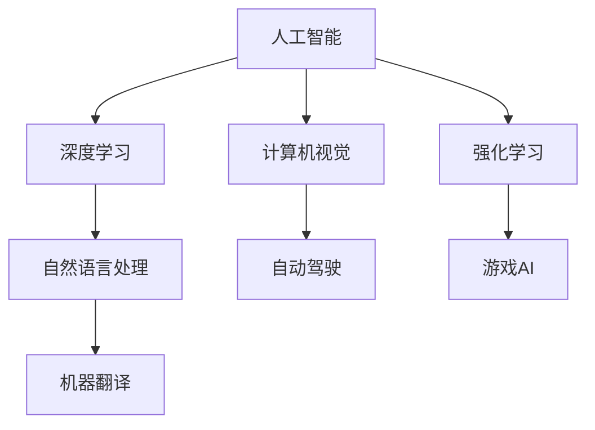

                 

## 1. 背景介绍

### 1.1 问题由来

随着人工智能技术的飞速发展，特别是深度学习技术的突破，人工智能（AI）已经在多个领域展示了巨大的潜力。从自动驾驶到医疗诊断，从金融交易到教育培训，AI正在迅速改变我们的生活方式和工作方式。然而，尽管AI技术取得了显著的进展，但这些技术的广泛应用仍然面临着诸多挑战，包括数据隐私、伦理道德、计算效率、可解释性等。

### 1.2 问题核心关键点

这些问题涉及多个领域，包括但不限于：

- **数据隐私**：如何在保护个人隐私的同时，充分利用数据进行模型训练。
- **伦理道德**：如何在AI决策中确保公正、透明和可解释性。
- **计算效率**：如何在有限的计算资源下，最大化AI系统的性能。
- **可解释性**：如何使AI系统的决策过程变得透明和可解释，以便于人类理解和监督。

这些问题相互交织，限制了AI技术的广泛应用。因此，构建一个更智能、更安全、更可解释的世界，成为当前人工智能领域的热点研究方向。

## 2. 核心概念与联系

### 2.1 核心概念概述

为了更好地理解如何构建更智能的世界，本文将介绍几个核心概念及其相互联系：

- **人工智能（AI）**：通过计算机模拟人类的智能行为，包括学习、推理、感知等能力。AI分为弱人工智能和强人工智能，前者只能执行特定任务，后者具备通用智能。
- **深度学习（DL）**：一种基于神经网络的机器学习技术，通过多层次的神经网络学习数据中的复杂特征。深度学习在图像识别、自然语言处理等领域取得了突破性进展。
- **自然语言处理（NLP）**：使计算机能够理解、处理和生成人类语言的技术。NLP在机器翻译、情感分析、对话系统等领域有广泛应用。
- **计算机视觉（CV）**：使计算机能够识别、理解和解释图像、视频中的对象和场景。CV在自动驾驶、人脸识别等领域有重要应用。
- **强化学习（RL）**：一种基于奖励和惩罚的机器学习技术，通过不断尝试和调整，使智能体在环境中学习最优策略。RL在游戏、机器人等领域有广泛应用。

这些核心概念构成了人工智能技术的基石，通过它们的相互结合和应用，可以实现各种智能系统的构建和优化。

### 2.2 核心概念原理和架构的 Mermaid 流程图



这个流程图展示了人工智能技术的核心概念及其相互关系。深度学习、自然语言处理、计算机视觉和强化学习等技术，相互结合，共同推动了人工智能的发展，并应用于各种实际场景中。

## 3. 核心算法原理 & 具体操作步骤

### 3.1 算法原理概述

构建更智能的世界，离不开高效、可解释、可扩展的算法支持。本文将介绍几种核心算法原理：

- **深度神经网络（DNN）**：通过多层神经元模拟人类大脑的工作原理，能够学习复杂的非线性关系。DNN在图像识别、语音识别等领域有广泛应用。
- **卷积神经网络（CNN）**：专门用于处理图像和视频数据的神经网络，通过卷积操作提取局部特征，具有平移不变性。CNN在图像分类、目标检测等领域有重要应用。
- **循环神经网络（RNN）**：通过时间依赖的神经元结构，能够处理序列数据，如自然语言、时间序列数据等。RNN在语言建模、文本生成等领域有重要应用。
- **生成对抗网络（GAN）**：由生成器和判别器两个神经网络组成，通过对抗训练生成高质量的图像、音频等数据。GAN在图像生成、风格迁移等领域有广泛应用。
- **强化学习（RL）**：通过奖励和惩罚机制，智能体在环境中学习最优策略，广泛应用于机器人、游戏等领域。

### 3.2 算法步骤详解

构建一个智能系统通常包括以下步骤：

1. **数据收集与预处理**：收集并清洗数据，去除噪声和异常值，确保数据的质量和可用性。
2. **模型训练**：选择合适的算法和模型架构，利用训练数据进行模型训练，优化模型参数。
3. **模型评估**：在验证数据集上评估模型的性能，选择最优模型进行应用。
4. **模型部署**：将训练好的模型部署到实际应用中，进行实时推理和预测。
5. **模型监控与优化**：实时监控模型性能，根据实际应用反馈进行模型优化和迭代。

### 3.3 算法优缺点

各种算法和模型各有优缺点，需要根据具体应用场景进行选择：

- **深度神经网络（DNN）**：优点在于强大的特征提取能力和泛化能力，但需要大量计算资源和数据。
- **卷积神经网络（CNN）**：优点在于处理图像和视频数据的高效性，但需要调整卷积核大小和数量。
- **循环神经网络（RNN）**：优点在于处理序列数据的能力，但容易陷入梯度消失和梯度爆炸问题。
- **生成对抗网络（GAN）**：优点在于生成高质量的数据，但训练过程不稳定，容易产生模式崩溃。
- **强化学习（RL）**：优点在于能够适应动态环境，但需要大量实验数据和计算资源。

### 3.4 算法应用领域

各种算法和模型在实际应用中有着广泛的应用领域：

- **深度神经网络（DNN）**：广泛应用于图像识别、语音识别、自然语言处理等领域。
- **卷积神经网络（CNN）**：主要应用于图像分类、目标检测、人脸识别等领域。
- **循环神经网络（RNN）**：广泛应用于语言建模、机器翻译、文本生成等领域。
- **生成对抗网络（GAN）**：主要应用于图像生成、风格迁移、图像修复等领域。
- **强化学习（RL）**：主要应用于机器人控制、游戏AI、自动驾驶等领域。

## 4. 数学模型和公式 & 详细讲解 & 举例说明

### 4.1 数学模型构建

构建智能系统的核心是数学模型的构建。以下是几种常见的数学模型及其构建方法：

- **线性回归模型**：用于处理线性关系的数据，通过最小二乘法求解最优参数。
- **逻辑回归模型**：用于处理二分类问题，通过最大化似然函数求解最优参数。
- **支持向量机（SVM）**：用于处理分类和回归问题，通过最大化边界距离求解最优超平面。
- **随机森林（RF）**：用于处理分类和回归问题，通过组合多个决策树进行预测。
- **神经网络模型**：通过多层神经元模拟人类大脑的工作原理，能够学习复杂的非线性关系。

### 4.2 公式推导过程

以线性回归模型为例，其公式推导过程如下：

1. **目标函数**：最小化预测值与真实值之间的平方误差。
2. **梯度下降**：通过梯度下降法求解目标函数的最小值，得到最优参数。
3. **正则化**：通过引入L2正则化，防止模型过拟合，优化模型泛化能力。

### 4.3 案例分析与讲解

以图像分类为例，通过卷积神经网络（CNN）进行模型构建和训练：

1. **数据准备**：收集图像数据，并进行预处理，如归一化、缩放等。
2. **模型构建**：选择卷积层、池化层、全连接层等组成CNN模型。
3. **模型训练**：利用训练数据进行模型训练，调整网络参数。
4. **模型评估**：在验证数据集上评估模型性能，选择最优模型。
5. **模型部署**：将训练好的模型部署到实际应用中，进行实时推理和预测。

## 5. 项目实践：代码实例和详细解释说明

### 5.1 开发环境搭建

构建智能系统的开发环境通常包括以下步骤：

1. **环境安装**：安装Python、TensorFlow、PyTorch等开发工具。
2. **数据准备**：收集并预处理数据，确保数据的质量和可用性。
3. **模型构建**：选择适当的算法和模型架构，构建智能模型。
4. **模型训练**：利用训练数据进行模型训练，优化模型参数。
5. **模型评估**：在验证数据集上评估模型性能，选择最优模型。
6. **模型部署**：将训练好的模型部署到实际应用中，进行实时推理和预测。

### 5.2 源代码详细实现

以下是一个简单的图像分类项目，使用卷积神经网络（CNN）进行模型训练和推理：

```python
import tensorflow as tf
from tensorflow.keras import layers

# 定义模型结构
model = tf.keras.Sequential([
    layers.Conv2D(32, (3, 3), activation='relu', input_shape=(28, 28, 1)),
    layers.MaxPooling2D((2, 2)),
    layers.Flatten(),
    layers.Dense(10, activation='softmax')
])

# 编译模型
model.compile(optimizer='adam', loss='sparse_categorical_crossentropy', metrics=['accuracy'])

# 加载数据集
(x_train, y_train), (x_test, y_test) = tf.keras.datasets.mnist.load_data()

# 数据预处理
x_train = x_train / 255.0
x_test = x_test / 255.0

# 模型训练
model.fit(x_train, y_train, epochs=10, validation_data=(x_test, y_test))

# 模型评估
model.evaluate(x_test, y_test)

# 模型推理
predictions = model.predict(x_test[:10])
print(predictions)
```

### 5.3 代码解读与分析

以上代码实现了基本的图像分类任务。具体步骤如下：

1. **模型构建**：使用Sequential模型，添加卷积层、池化层、全连接层等组成CNN模型。
2. **模型编译**：选择合适的优化器、损失函数和评估指标，编译模型。
3. **数据加载**：加载MNIST数据集，并进行归一化预处理。
4. **模型训练**：利用训练数据进行模型训练，调整网络参数。
5. **模型评估**：在验证数据集上评估模型性能，选择最优模型。
6. **模型推理**：对测试集进行推理，输出预测结果。

## 6. 实际应用场景

### 6.1 智能交通系统

智能交通系统是未来城市交通管理的重要方向。通过智能交通系统，可以实时监测交通流量、优化红绿灯控制、提供实时导航等信息。

1. **数据收集**：通过摄像头、传感器等设备收集交通数据。
2. **模型训练**：利用交通数据训练预测模型，优化红绿灯控制策略。
3. **模型部署**：将训练好的模型部署到交通系统中，实时监测和控制交通流量。
4. **系统优化**：根据实时反馈，优化交通控制策略，提高交通效率。

### 6.2 智慧医疗系统

智慧医疗系统通过人工智能技术，提高医疗诊断和处理的效率和准确性。

1. **数据收集**：收集患者的病历、影像、基因等数据。
2. **模型训练**：利用医疗数据训练诊断模型，如CT影像分类、癌症检测等。
3. **模型部署**：将训练好的模型部署到医疗系统中，实时辅助医生诊断。
4. **系统优化**：根据医生反馈，优化诊断模型，提高诊断准确性。

### 6.3 金融风险控制系统

金融风险控制系统通过人工智能技术，预测和控制金融市场的风险。

1. **数据收集**：收集金融市场的历史数据和实时数据。
2. **模型训练**：利用金融数据训练预测模型，如股票价格预测、风险评估等。
3. **模型部署**：将训练好的模型部署到金融系统中，实时监测和控制市场风险。
4. **系统优化**：根据市场反馈，优化预测模型，提高风险控制能力。

### 6.4 未来应用展望

未来，随着人工智能技术的不断进步，智能系统将更广泛地应用于各个领域：

- **智慧城市**：通过智能交通、智能安防、智能能源等系统，提高城市管理效率，提升居民生活质量。
- **智慧医疗**：通过智能诊断、智能手术、智能护理等系统，提高医疗水平，减少医疗成本。
- **智能制造**：通过智能生产、智能质量控制、智能维护等系统，提高生产效率，降低生产成本。
- **智能农业**：通过智能种植、智能灌溉、智能施肥等系统，提高农业生产效率，保障食品安全。

## 7. 工具和资源推荐

### 7.1 学习资源推荐

为了掌握人工智能技术的核心知识和前沿进展，以下是一些优质的学习资源：

- **《深度学习》课程**：斯坦福大学开设的深度学习课程，涵盖深度学习的基本概念和算法。
- **《机器学习实战》书籍**：由Peter Harrington编写，涵盖机器学习的实用技术和案例。
- **Kaggle竞赛平台**：提供大量数据集和竞赛任务，可以锻炼实际数据处理和模型训练能力。
- **GitHub开源项目**：可以学习优秀的开源代码和项目，掌握最新的技术趋势和实践经验。

### 7.2 开发工具推荐

以下是一些常用的开发工具，可以加速人工智能项目的开发和部署：

- **Jupyter Notebook**：支持Python、R等语言，提供交互式编程环境。
- **PyTorch**：由Facebook开发的深度学习框架，支持动态计算图，适合快速原型开发。
- **TensorFlow**：由Google开发的深度学习框架，支持静态计算图，适合大规模生产部署。
- **OpenCV**：开源计算机视觉库，提供丰富的图像处理和识别功能。
- **TensorBoard**：TensorFlow的可视化工具，可以实时监测模型训练过程和性能。

### 7.3 相关论文推荐

以下是一些关于人工智能技术的经典论文，可以深入理解其核心原理和应用：

- **《ImageNet大规模视觉识别挑战赛》**：提出了大规模视觉识别任务和挑战赛，推动了计算机视觉技术的突破。
- **《深度学习》论文**：提出了深度神经网络的架构和训练方法，奠定了深度学习的基础。
- **《TensorFlow: A System for Large-Scale Machine Learning》**：介绍了TensorFlow的架构和设计原则，适合大规模生产部署。
- **《强化学习》论文**：介绍了强化学习的基本概念和算法，适合机器人、游戏等领域的应用。

## 8. 总结：未来发展趋势与挑战

### 8.1 研究成果总结

本文介绍了人工智能技术的核心概念、算法原理和应用场景，涵盖了深度学习、计算机视觉、自然语言处理、强化学习等多个领域。通过这些技术，可以实现智能交通、智慧医疗、金融风险控制等多种智能系统的构建。

### 8.2 未来发展趋势

未来，人工智能技术将向着以下几个方向发展：

- **深度强化学习**：结合深度学习和强化学习，解决更加复杂的任务，如自动驾驶、机器人控制等。
- **自监督学习**：利用无监督学习技术，提高模型泛化能力和数据利用率。
- **跨模态学习**：结合视觉、听觉、语言等多种模态数据，提高模型的感知和推理能力。
- **联邦学习**：通过分布式计算和隐私保护技术，实现模型在多个设备上的联合训练。
- **可解释性AI**：通过可视化、解释器等技术，提高AI系统的可解释性和可信任度。

### 8.3 面临的挑战

尽管人工智能技术取得了显著进展，但在实际应用中仍然面临诸多挑战：

- **数据隐私**：如何在保护用户隐私的同时，充分利用数据进行模型训练。
- **伦理道德**：如何在AI决策中确保公正、透明和可解释性。
- **计算效率**：如何在有限的计算资源下，最大化AI系统的性能。
- **可解释性**：如何使AI系统的决策过程变得透明和可解释。

### 8.4 研究展望

为了应对这些挑战，未来需要在以下几个方面进行深入研究：

- **隐私保护技术**：开发隐私保护技术，如差分隐私、联邦学习等，保护用户数据隐私。
- **公平性和透明性**：通过公平性约束和可解释性技术，提高AI系统的公平性和透明性。
- **计算资源优化**：优化计算图和模型结构，提高计算效率，支持大规模生产部署。
- **可解释性AI**：开发可视化、解释器等技术，提高AI系统的可解释性和可信任度。

## 9. 附录：常见问题与解答

**Q1：人工智能技术有哪些优势和劣势？**

A: 人工智能技术的优势在于其强大的数据处理能力和自学习能力，能够快速适应和解决复杂的任务。其劣势在于需要大量数据和计算资源，对模型的训练和优化要求较高，容易出现数据过拟合和泛化能力不足等问题。

**Q2：如何在保护用户隐私的同时，充分利用数据进行模型训练？**

A: 可以采用差分隐私、联邦学习等隐私保护技术，保护用户数据隐私，同时利用分布式计算提高数据利用率。

**Q3：如何在AI决策中确保公正、透明和可解释性？**

A: 可以采用公平性约束和可解释性技术，如公平性约束、透明性指标、可解释性算法等，确保AI决策的公正性和透明性。

**Q4：如何优化计算资源，提高AI系统的性能？**

A: 可以采用优化计算图、模型压缩、剪枝等技术，提高计算效率，支持大规模生产部署。

**Q5：如何提高AI系统的可解释性和可信任度？**

A: 可以采用可视化、解释器等技术，提高AI系统的可解释性和可信任度，确保用户和监管机构的理解和信任。

---

作者：禅与计算机程序设计艺术 / Zen and the Art of Computer Programming

