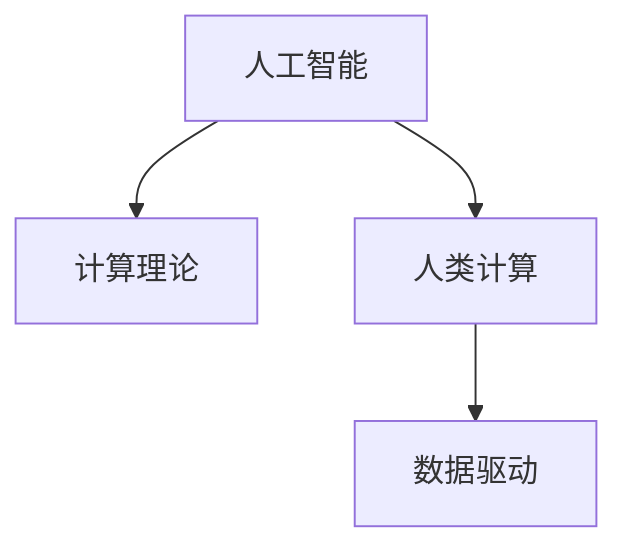

                 

# 构建更智能的世界：人类计算的应用场景

> 关键词：人工智能,计算理论,应用场景,未来发展,数据驱动

## 1. 背景介绍

### 1.1 问题由来
随着计算技术的迅猛发展，人工智能（AI）已经成为推动社会进步和经济发展的重要驱动力。特别是在大数据和深度学习的驱动下，AI技术在各个领域的应用日益广泛，从自动驾驶、智能医疗、到智慧城市、智能制造，AI正以前所未有的速度改变着我们的生活和工作方式。

然而，尽管AI技术取得了显著的进展，但仍然存在一些深层次的挑战和问题。一方面，AI系统的智能程度仍然有限，尤其是在复杂的现实场景中，AI往往难以理解复杂的因果关系和上下文信息，导致决策不准确、鲁棒性不足。另一方面，现有的AI系统往往依赖于大规模的数据训练和计算资源，使得其在部署和应用过程中面临诸多限制。

## 2. 核心概念与联系

### 2.1 核心概念概述

为更好地理解AI技术在现实应用场景中的具体应用，本节将介绍几个关键概念：

- 人工智能(AI)：利用计算机模拟人类智能活动的技术。主要包含机器学习、深度学习、自然语言处理等子领域。
- 计算理论(Computational Theory)：研究如何用计算机实现复杂计算任务的基础理论。如NP完备性、复杂度理论等。
- 人类计算(Human Computation)：借助人类特有的认知能力和计算模型，解决复杂计算问题的技术。如众包、人机协同计算等。
- 数据驱动(Data-Driven)：基于数据和统计方法，进行预测、决策和优化的方法。如强化学习、深度学习等。

这些核心概念之间的逻辑关系可以通过以下Mermaid流程图来展示：

这个流程图展示了人工智能、计算理论和人类计算之间的联系：

1. 人工智能依赖计算理论的基础，用于实现复杂的算法模型。
2. 人类计算可以与人工智能协同工作，通过人类的认知优势弥补机器智能的不足。
3. 数据驱动则是AI和人类计算的重要驱动力，通过海量数据训练模型，优化计算过程。

这些概念共同构成了现代AI技术的基础框架，推动了其在各个领域的应用。

## 3. 核心算法原理 & 具体操作步骤

### 3.1 算法原理概述

AI技术的应用场景多种多样，涉及领域广泛，从计算机视觉、自然语言处理到机器人、智能推荐等。以下是几个典型的应用场景及其算法原理：

1. **计算机视觉**：利用图像和视频数据，通过卷积神经网络（CNN）等深度学习模型，实现图像识别、目标检测、图像生成等任务。
2. **自然语言处理**：通过对文本数据进行语言建模、序列到序列（Seq2Seq）等深度学习模型，实现文本分类、情感分析、机器翻译等任务。
3. **机器人**：结合计算机视觉和自然语言处理技术，通过强化学习等方法，实现机器人的导航、语音识别、行为决策等功能。
4. **智能推荐**：通过协同过滤、深度学习等方法，对用户行为和商品特征进行建模，实现个性化推荐。

这些场景中的核心算法原理主要包括：

- 深度学习：利用多层神经网络，对数据进行特征提取和模式识别，从而实现各种任务。
- 强化学习：通过与环境的交互，不断优化决策策略，提升系统的智能程度。
- 自然语言处理：通过对文本数据的语言模型建模，实现语义理解和生成。
- 计算机视觉：通过卷积神经网络等模型，对图像和视频数据进行特征提取和分类。

### 3.2 算法步骤详解

以自然语言处理为例，介绍其核心算法步骤：

1. **数据准备**：收集标注好的文本数据，作为模型训练的输入。
2. **模型构建**：选择适合的深度学习模型，如RNN、LSTM、Transformer等，并进行初始化。
3. **模型训练**：将数据分成训练集和验证集，利用优化器（如Adam、SGD等）进行模型训练，不断调整模型参数，最小化损失函数。
4. **模型评估**：在测试集上评估模型性能，如精度、召回率、F1值等。
5. **模型应用**：将训练好的模型应用于实际场景，进行文本分类、情感分析、机器翻译等任务。

### 3.3 算法优缺点

**深度学习**：

- 优点：在大规模数据集上表现出色，能够自动提取复杂特征，泛化能力较强。
- 缺点：模型复杂度高，计算资源消耗大，对数据质量要求高。

**强化学习**：

- 优点：能够通过与环境的交互，逐步优化决策策略，适用于不确定性环境。
- 缺点：模型训练时间较长，需要大量计算资源，难以处理高维状态空间。

**自然语言处理**：

- 优点：处理文本数据能力强，能够实现复杂的语义理解。
- 缺点：模型复杂度高，对标注数据依赖大，难以处理长文本和复杂的语义结构。

**计算机视觉**：

- 优点：能够处理图像和视频数据，实现高精度的目标检测和分类。
- 缺点：模型复杂度高，计算资源消耗大，对标注数据依赖大。

### 3.4 算法应用领域

基于AI技术的各种算法，在多个领域得到了广泛应用。以下是几个典型的应用领域及其算法应用场景：

1. **医疗**：利用AI技术进行医学影像分析、疾病诊断、个性化治疗方案设计等。
2. **金融**：通过AI技术进行风险评估、股票预测、智能投顾等。
3. **制造业**：利用AI技术进行智能制造、质量检测、设备维护等。
4. **零售**：通过AI技术进行客户分析、个性化推荐、库存管理等。
5. **交通运输**：利用AI技术进行交通流量预测、自动驾驶、智能调度等。

## 4. 数学模型和公式 & 详细讲解 & 举例说明

### 4.1 数学模型构建

以自然语言处理中的词向量模型为例，介绍其数学模型构建过程：

1. **词向量表示**：将每个词映射到一个高维向量空间，通过学习词向量空间中每个词的表示，实现词与词之间的相似度计算。
2. **词向量训练**：利用大量标注数据，通过神经网络模型进行训练，最小化词向量表示与真实标签之间的差异。
3. **词向量应用**：将训练好的词向量应用于各种NLP任务，如文本分类、情感分析、机器翻译等。

### 4.2 公式推导过程

以神经网络模型中的反向传播算法为例，介绍其公式推导过程：

1. **前向传播**：将输入数据通过多层神经网络，得到模型输出。
2. **计算损失函数**：将模型输出与真实标签进行对比，计算损失函数。
3. **反向传播**：根据损失函数梯度，反向传播计算每个参数的梯度，更新模型参数。

### 4.3 案例分析与讲解

以计算机视觉中的目标检测为例，介绍其算法实现过程：

1. **数据准备**：收集标注好的图像数据，将目标物体进行分类并标注位置。
2. **模型构建**：选择适合的卷积神经网络模型，如Faster R-CNN、YOLO等。
3. **模型训练**：将数据分成训练集和验证集，利用优化器进行模型训练，最小化损失函数。
4. **模型评估**：在测试集上评估模型性能，如精确度、召回率、mAP等。
5. **模型应用**：将训练好的模型应用于实际场景，进行目标检测、图像分类等任务。

## 5. 项目实践：代码实例和详细解释说明

### 5.1 开发环境搭建

在进行AI技术应用开发前，需要进行环境配置和工具准备。以下是Python环境下开发AI应用的常用工具：

1. **Python**：Python是AI开发的主流编程语言，提供了丰富的第三方库和框架。
2. **TensorFlow**：由Google开发的深度学习框架，支持多种硬件平台，适合大规模模型训练。
3. **PyTorch**：由Facebook开发的深度学习框架，灵活性高，适合研究和快速迭代。
4. **Keras**：基于TensorFlow和Theano的高级深度学习框架，易于上手。
5. **Jupyter Notebook**：基于Web的交互式编程环境，方便进行模型实验和调试。

### 5.2 源代码详细实现

以自然语言处理中的文本分类为例，介绍其代码实现过程：

1. **数据准备**：收集标注好的文本数据，将文本和标签存储在CSV文件中。
2. **数据加载**：使用Pandas库加载CSV文件，进行数据预处理。
3. **模型构建**：选择适合的深度学习模型，如LSTM、Transformer等，并进行初始化。
4. **模型训练**：利用优化器进行模型训练，最小化损失函数。
5. **模型评估**：在测试集上评估模型性能，如精度、召回率、F1值等。

### 5.3 代码解读与分析

以计算机视觉中的目标检测为例，介绍其代码实现过程：

1. **数据准备**：收集标注好的图像数据，将目标物体进行分类并标注位置。
2. **数据加载**：使用TensorFlow数据集API加载图像数据，进行数据预处理。
3. **模型构建**：选择适合的卷积神经网络模型，如Faster R-CNN、YOLO等，并进行初始化。
4. **模型训练**：利用优化器进行模型训练，最小化损失函数。
5. **模型评估**：在测试集上评估模型性能，如精确度、召回率、mAP等。

### 5.4 运行结果展示

以自然语言处理中的情感分析为例，展示其运行结果：

1. **数据准备**：收集标注好的文本数据，将文本和情感标签存储在CSV文件中。
2. **模型训练**：利用优化器进行模型训练，最小化损失函数。
3. **模型评估**：在测试集上评估模型性能，如精度、召回率、F1值等。
4. **模型应用**：将训练好的模型应用于实际场景，进行情感分析。

## 6. 实际应用场景

### 6.1 智慧医疗

AI技术在智慧医疗领域的应用，主要体现在疾病诊断、个性化治疗方案设计等方面。通过AI技术对大量医疗数据进行建模和分析，能够帮助医生更快速、准确地进行疾病诊断和治疗方案设计，提升医疗服务的质量和效率。

### 6.2 金融风险管理

AI技术在金融领域的应用，主要体现在风险评估、股票预测、智能投顾等方面。通过AI技术对大量金融数据进行建模和分析，能够帮助金融机构更准确地评估风险、预测股票趋势、设计智能投顾策略，提升金融服务的精准性和效率。

### 6.3 智能制造

AI技术在智能制造领域的应用，主要体现在智能检测、质量控制、设备维护等方面。通过AI技术对大量生产数据进行建模和分析，能够帮助制造商更快速、准确地进行智能检测、质量控制和设备维护，提升生产效率和产品质量。

### 6.4 零售客户分析

AI技术在零售领域的应用，主要体现在客户分析、个性化推荐、库存管理等方面。通过AI技术对大量零售数据进行建模和分析，能够帮助零售商更准确地进行客户分析、个性化推荐和库存管理，提升零售服务的质量和效率。

### 6.5 交通运输

AI技术在交通运输领域的应用，主要体现在交通流量预测、自动驾驶、智能调度等方面。通过AI技术对大量交通数据进行建模和分析，能够帮助交通运输机构更准确地进行交通流量预测、自动驾驶和智能调度，提升交通管理的效率和安全性。

## 7. 工具和资源推荐

### 7.1 学习资源推荐

为了帮助开发者系统掌握AI技术的应用，这里推荐一些优质的学习资源：

1. **《深度学习》书籍**：Ian Goodfellow、Yoshua Bengio、Aaron Courville等人合著的经典深度学习教材，涵盖了深度学习的基础理论和实践技巧。
2. **《机器学习》课程**：Andrew Ng等人开设的机器学习课程，内容覆盖广泛，适合初学者和进阶学习者。
3. **Kaggle竞赛平台**：Kaggle是一个数据科学竞赛平台，提供了大量公开数据集和实战案例，适合练习和展示技能。
4. **GitHub**：GitHub是一个开源代码托管平台，提供了大量开源项目和代码示例，适合学习和参考。
5. **DeepLearning.ai课程**：由Andrew Ng等人创办的深度学习课程，包括经典深度学习模型、深度强化学习等内容，适合系统学习。

### 7.2 开发工具推荐

以下是几个常用的开发工具，用于AI技术的实现和应用：

1. **TensorFlow**：由Google开发的深度学习框架，支持多种硬件平台，适合大规模模型训练。
2. **PyTorch**：由Facebook开发的深度学习框架，灵活性高，适合研究和快速迭代。
3. **Keras**：基于TensorFlow和Theano的高级深度学习框架，易于上手。
4. **Jupyter Notebook**：基于Web的交互式编程环境，方便进行模型实验和调试。
5. **Anaconda**：Python环境下常用的环境管理系统，方便进行项目管理和依赖管理。

### 7.3 相关论文推荐

以下是几篇经典的AI技术论文，推荐阅读：

1. **《深度学习》书籍**：Ian Goodfellow、Yoshua Bengio、Aaron Courville等人合著的经典深度学习教材，涵盖了深度学习的基础理论和实践技巧。
2. **《机器学习》课程**：Andrew Ng等人开设的机器学习课程，内容覆盖广泛，适合初学者和进阶学习者。
3. **Kaggle竞赛平台**：Kaggle是一个数据科学竞赛平台，提供了大量公开数据集和实战案例，适合练习和展示技能。
4. **GitHub**：GitHub是一个开源代码托管平台，提供了大量开源项目和代码示例，适合学习和参考。
5. **DeepLearning.ai课程**：由Andrew Ng等人创办的深度学习课程，包括经典深度学习模型、深度强化学习等内容，适合系统学习。

## 8. 总结：未来发展趋势与挑战

### 8.1 总结

本文对AI技术在各个应用场景中的应用进行了全面系统的介绍。首先阐述了AI技术的研究背景和应用意义，明确了AI技术在各个领域的重要作用。其次，从原理到实践，详细讲解了AI技术的应用模型和算法步骤，给出了具体代码实现过程。同时，本文还广泛探讨了AI技术在智慧医疗、金融风险管理、智能制造等领域的实际应用，展示了AI技术的巨大潜力。最后，本文精选了AI技术的学习资源、开发工具和相关论文，力求为读者提供全方位的技术指引。

通过本文的系统梳理，可以看到，AI技术的应用场景多种多样，在各个领域都具有广阔的应用前景。AI技术通过深度学习、强化学习等技术，能够解决复杂的现实问题，提升各个领域的效率和效果。未来，伴随AI技术的不断演进，AI技术必将在更多的领域得到应用，为社会的进步和发展提供新的动力。

### 8.2 未来发展趋势

展望未来，AI技术的发展趋势主要包括以下几个方面：

1. **AI技术不断演进**：随着算力、数据和算法技术的不断进步，AI技术将不断演进，解决更加复杂的问题。
2. **跨领域应用拓展**：AI技术将在更多领域得到应用，如智慧城市、智能农业、智能交通等。
3. **人机协同计算**：AI技术将与人类计算协同工作，通过人机协同计算，提升系统的智能程度和可靠性。
4. **数据驱动的智能化**：AI技术将更加依赖数据驱动，通过大量数据训练模型，提升系统的智能程度。
5. **多模态智能融合**：AI技术将实现多模态智能融合，通过融合视觉、语音、文本等模态信息，提升系统的智能程度。

### 8.3 面临的挑战

尽管AI技术已经取得了显著进展，但在迈向更加智能化、普适化应用的过程中，仍然面临诸多挑战：

1. **数据质量问题**：AI技术的训练和应用需要大量的高质量数据，但数据质量问题难以得到有效解决。
2. **算力资源消耗**：大规模AI模型训练和推理需要大量算力资源，难以在资源受限的平台上部署。
3. **模型鲁棒性不足**：AI模型在面对复杂场景时，鲁棒性不足，难以应对环境变化和噪声干扰。
4. **可解释性问题**：AI模型的决策过程难以解释，难以进行调试和优化。
5. **伦理和安全问题**：AI模型的决策可能存在偏见和歧视，难以确保其伦理和安全。

### 8.4 研究展望

为了应对上述挑战，未来AI技术的研究方向主要包括以下几个方面：

1. **数据治理和质量提升**：通过数据治理和质量提升，确保AI模型的训练和应用能够获得高质量的数据。
2. **资源优化和高效计算**：通过资源优化和高效计算，提升AI模型的训练和推理效率，降低计算成本。
3. **模型鲁棒性提升**：通过鲁棒性提升和噪声抵抗，确保AI模型在复杂场景下的稳定性和可靠性。
4. **可解释性和透明性**：通过可解释性和透明性，确保AI模型的决策过程透明可解释，便于调试和优化。
5. **伦理和安全保障**：通过伦理和安全保障，确保AI模型的决策符合人类价值观和伦理标准，确保其安全性和可靠性。

## 9. 附录：常见问题与解答

### Q1: 什么是AI技术？

A: AI技术是一种利用计算机模拟人类智能活动的高级技术，主要涵盖机器学习、深度学习、自然语言处理等领域。

### Q2: 如何选择适合的AI技术？

A: 在选择AI技术时，需要考虑应用场景的特点和需求，选择合适的模型和算法。例如，对于图像处理任务，可以选择卷积神经网络（CNN）；对于自然语言处理任务，可以选择循环神经网络（RNN）或Transformer等。

### Q3: 如何训练高质量的AI模型？

A: 训练高质量的AI模型需要选择合适的数据集、算法和硬件平台，并进行充分的实验和调优。同时，需要确保数据质量、模型鲁棒性和可解释性，以提高模型的应用效果。

### Q4: AI技术在未来有哪些应用前景？

A: AI技术在未来将应用于更多的领域，如智慧医疗、金融风险管理、智能制造、零售客户分析、交通运输等。通过AI技术，可以实现更加高效、智能和精准的服务和决策。

### Q5: 如何应对AI技术面临的挑战？

A: 应对AI技术面临的挑战需要从数据治理、资源优化、模型鲁棒性提升、可解释性和透明性以及伦理和安全保障等方面入手，不断改进和优化AI技术。

---

作者：禅与计算机程序设计艺术 / Zen and the Art of Computer Programming

