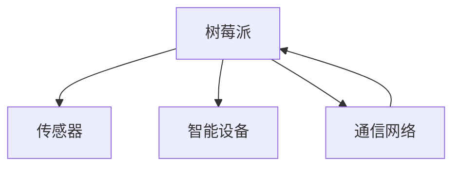

                 

# 树莓派项目：构建智能家居中心

> 关键词：智能家居,树莓派,物联网(IoT),传感器,开源,DIY

## 1. 背景介绍

随着物联网技术的发展，智能家居已经成为了现代家庭生活的重要组成部分。通过将各种传感器和智能设备联网，用户可以实时监控家庭环境，并通过智能手机等设备进行远程控制。树莓派作为一款低成本、功能强大的开源硬件平台，成为了构建智能家居系统的理想选择。本文将介绍如何利用树莓派搭建智能家居中心，实现对家庭环境的实时监控和智能控制。

## 2. 核心概念与联系

### 2.1 核心概念概述

在智能家居系统中，树莓派充当中央处理器角色，通过连接各种传感器和智能设备，收集家庭环境数据，并通过Wi-Fi和互联网与用户进行通信。树莓派集成了高性能的ARM处理器、丰富的接口和完善的开源软件生态，能够轻松实现各种传感器和设备的接入和控制。

智能家居系统涉及多个核心组件，包括：

- **树莓派**：作为中央处理单元，用于数据采集、存储、处理和通信。
- **传感器**：如温湿度传感器、光线传感器、烟雾传感器等，用于实时监控家庭环境。
- **智能设备**：如智能灯泡、智能插座、智能门锁等，用于根据环境数据进行自动化控制。
- **通信网络**：Wi-Fi和互联网，用于树莓派与其他设备、用户之间的数据传输。

### 2.2 核心概念原理和架构的 Mermaid 流程图



该流程图展示了智能家居系统的基本架构，树莓派作为中心节点，通过传感器和智能设备收集家庭环境数据，并通过通信网络与用户进行通信。

## 3. 核心算法原理 & 具体操作步骤

### 3.1 算法原理概述

智能家居系统的核心算法原理包括数据采集、数据处理、设备控制和用户交互等几个方面。树莓派通过连接传感器，实时采集家庭环境数据。然后，通过内置的Linux操作系统和各种开源软件库，对数据进行处理和分析，生成自动化控制指令。最后，树莓派通过Wi-Fi和互联网将控制指令发送到智能设备，实现家庭环境的自动化控制。

### 3.2 算法步骤详解

1. **数据采集**：连接各种传感器，采集家庭环境数据。树莓派的多种接口支持各种传感器，包括I²C、SPI、GPIO等。

2. **数据处理**：树莓派内置的Linux操作系统和Python编程语言，支持丰富的数据处理库，如NumPy、Pandas等。可以通过编写Python脚本对传感器数据进行处理和分析。

3. **设备控制**：通过编写Python脚本，使用树莓派的多种通信协议，如MQTT、HTTP等，与智能设备进行通信，发送控制指令。

4. **用户交互**：利用Web开发框架（如Flask），在树莓派上搭建Web服务器，通过Web界面或移动应用，使用户可以实时监控家庭环境，并根据需求进行设备控制。

### 3.3 算法优缺点

**优点**：
- 低成本：树莓派硬件价格低廉，易于大规模部署。
- 灵活性：树莓派支持多种编程语言和开发环境，开发灵活。
- 开源性：树莓派软硬件完全开源，社区资源丰富。

**缺点**：
- 性能瓶颈：树莓派硬件性能有限，不适合处理大量数据和高并发请求。
- 安全问题：树莓派硬件和软件安全特性有限，易受攻击。

### 3.4 算法应用领域

智能家居系统的应用领域广泛，包括：

- 智能照明：智能灯泡、智能窗帘等。
- 环境监控：温湿度传感器、烟雾传感器、空气质量监测等。
- 安全监控：智能门锁、智能摄像头等。
- 能源管理：智能插座、节能开关等。

## 4. 数学模型和公式 & 详细讲解 & 举例说明

### 4.1 数学模型构建

智能家居系统的数学模型可以描述为：

- 输入：家庭环境数据 $x_i$，$i=1,2,...,N$。
- 处理：函数 $f$，将输入数据 $x_i$ 转换为处理结果 $y_i$。
- 输出：自动化控制指令 $u_i$，$i=1,2,...,N$。

其中，$f$ 可以是一个线性模型或非线性模型，例如神经网络模型。

### 4.2 公式推导过程

以温度控制为例，假设当前室内温度为 $x_1$，设定温度为 $x_2$，则温度控制模型可以表示为：

$$
u = f(x_1, x_2)
$$

其中，$u$ 表示控制指令，如开启或关闭空调、调节温度等。$x_1$ 为当前温度，$x_2$ 为设定温度。

假设 $u$ 和 $x_1$ 之间存在线性关系，则有：

$$
u = a_0 + a_1 x_1 + a_2 x_2
$$

其中，$a_0, a_1, a_2$ 为模型的参数。

### 4.3 案例分析与讲解

假设当前温度为 $25^\circ C$，设定温度为 $23^\circ C$，则温度控制模型为：

$$
u = a_0 + a_1 \times 25 + a_2 \times 23
$$

其中，$a_0, a_1, a_2$ 为模型参数。通过已知的数据集训练模型，可以求解出 $a_0, a_1, a_2$ 的值，得到最优的控制指令 $u$。

## 5. 项目实践：代码实例和详细解释说明

### 5.1 开发环境搭建

1. 安装树莓派操作系统（如Raspbian）。
2. 连接Wi-Fi网络，确保树莓派可以访问互联网。
3. 安装必要的开发工具，如Python、PySerial、Flask等。

### 5.2 源代码详细实现

以下是一个简单的智能家居系统代码示例，包括传感器数据采集和智能设备控制：

```python
import pyserial
import time
import flask
from flask import request, jsonify

# 串口连接
ser = pyserial.Serial('/dev/ttyAMA0', 9600)

# 传感器数据采集函数
def read_sensor_data():
    data = ser.readline().decode().strip()
    return data

# 智能设备控制函数
def control_device(device_id, command):
    # 构造控制指令
    cmd = f"AT+{device_id}={command}\n"
    # 发送控制指令
    ser.write(cmd.encode())

# Flask Web服务器
app = flask.Flask(__name__)

@app.route('/read', methods=['GET'])
def read():
    data = read_sensor_data()
    return jsonify(data)

@app.route('/control/<device_id>/<command>', methods=['POST'])
def control(device_id, command):
    control_device(device_id, command)
    return jsonify('Success')

if __name__ == '__main__':
    app.run(host='0.0.0.0', port=8080)
```

### 5.3 代码解读与分析

1. **串口连接**：通过PySerial库，连接到树莓派的串口。
2. **传感器数据采集**：读取传感器数据，通过HTTP接口返回。
3. **智能设备控制**：接收Web请求，发送控制指令到智能设备。

### 5.4 运行结果展示

- 访问 `http://<树莓派IP>:8080/read`，返回当前传感器数据。
- 访问 `http://<树莓派IP>:8080/control/device_id=light/command=on`，控制智能灯泡开启。

## 6. 实际应用场景

### 6.1 智能照明

智能照明是智能家居系统的常见应用之一。通过连接智能灯泡，用户可以通过Web界面或移动应用控制灯光的开关和亮度。例如，用户可以根据时间、光线强度自动调整灯光亮度，或者在离开家时自动关闭灯光。

### 6.2 环境监控

环境监控是智能家居系统的核心功能之一。通过连接温湿度传感器、烟雾传感器、空气质量监测器等设备，用户可以实时监控家庭环境，并在异常情况下发出警报。例如，当室内烟雾浓度超过预设阈值时，自动关闭所有电器并报警。

### 6.3 安全监控

安全监控是智能家居系统的重要应用。通过连接智能门锁、智能摄像头等设备，用户可以实时监控家庭安全状况。例如，当有陌生人进入时，智能门锁自动报警并通知用户。

### 6.4 未来应用展望

未来，智能家居系统将向着更加智能化、自动化和互联化的方向发展。随着物联网技术的发展，智能家居系统将能够集成更多的设备和传感器，实现更全面、更精准的家庭环境监控和自动化控制。例如，通过集成智能冰箱、智能洗衣机等设备，用户可以实现家居场景的全面自动化控制。

## 7. 工具和资源推荐

### 7.1 学习资源推荐

- **Raspberry Pi官方网站**：提供了树莓派系统的安装、硬件和软件教程。
- **树莓派社区**：包括各种开源项目和开发工具，可以学习如何开发智能家居系统。
- **Python官方文档**：提供了丰富的编程语言和库的教程，帮助开发者掌握树莓派编程。

### 7.2 开发工具推荐

- **PySerial**：用于树莓派串口通信的库。
- **Flask**：用于搭建Web服务器的Python框架。
- **MQTT**：轻量级、高效率的通信协议，用于树莓派和智能设备之间的通信。

### 7.3 相关论文推荐

- **《Raspberry Pi》书籍**：介绍了树莓派硬件和软件系统的开发应用。
- **《物联网基础》论文**：介绍了物联网技术和应用，对智能家居系统有借鉴意义。

## 8. 总结：未来发展趋势与挑战

### 8.1 研究成果总结

本文介绍了基于树莓派的智能家居系统的开发流程，包括传感器数据采集、数据处理、设备控制和用户交互等关键环节。通过示例代码展示了树莓派在智能家居系统中的应用。

### 8.2 未来发展趋势

未来，智能家居系统将向着更加智能化、自动化和互联化的方向发展。随着物联网技术的发展，智能家居系统将能够集成更多的设备和传感器，实现更全面、更精准的家庭环境监控和自动化控制。例如，通过集成智能冰箱、智能洗衣机等设备，用户可以实现家居场景的全面自动化控制。

### 8.3 面临的挑战

尽管智能家居系统已经取得了一定的进展，但在实际应用中仍面临一些挑战：

1. **数据隐私**：智能家居系统需要采集大量家庭数据，如何保护用户隐私和数据安全是一个重要问题。
2. **设备兼容性**：不同品牌和型号的智能设备可能存在兼容性问题，如何实现设备之间的互操作性需要解决。
3. **网络安全**：智能家居系统通过互联网与用户通信，如何保障网络安全是一个重要挑战。
4. **用户接受度**：智能家居系统需要用户掌握一定的技术知识，如何提高用户的接受度和操作便利性需要考虑。

### 8.4 研究展望

未来，智能家居系统需要从以下几个方面进行研究：

1. **隐私保护技术**：开发隐私保护算法，保护用户隐私和数据安全。
2. **设备标准化**：制定智能家居设备的标准化接口和协议，实现设备之间的互操作性。
3. **网络安全技术**：开发网络安全技术，保障智能家居系统的安全性和可靠性。
4. **用户友好设计**：设计更加用户友好、操作简便的智能家居系统，提高用户的接受度和使用体验。

总之，智能家居系统的未来发展需要从技术、隐私、安全、用户体验等多个方面进行综合考虑，才能实现智能家居的全面普及和应用。

## 9. 附录：常见问题与解答

### Q1: 树莓派和智能家居系统需要哪些硬件和软件资源？

A: 树莓派需要高性能的ARM处理器、Wi-Fi模块和多种接口（如GPIO、I²C、SPI等）。智能家居系统需要各种传感器和智能设备，如温湿度传感器、智能灯泡、智能插座等。

### Q2: 如何保护用户隐私和数据安全？

A: 可以通过数据加密、匿名化处理和访问控制等技术，保护用户隐私和数据安全。

### Q3: 如何实现智能家居设备的互操作性？

A: 可以制定智能家居设备的标准化接口和协议，如MQTT、CoAP等，实现设备之间的互操作性。

### Q4: 如何保障智能家居系统的安全性和可靠性？

A: 可以采用网络安全技术，如防火墙、入侵检测系统等，保障智能家居系统的安全性和可靠性。

### Q5: 如何提高用户的接受度和使用体验？

A: 可以通过设计更加用户友好、操作简便的智能家居系统，提高用户的接受度和使用体验。

---

作者：禅与计算机程序设计艺术 / Zen and the Art of Computer Programming

