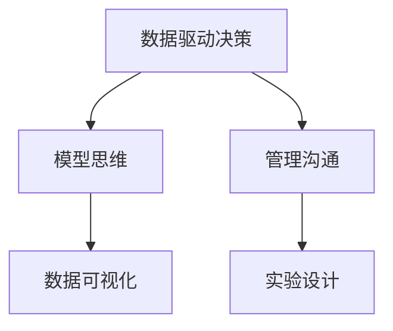

                 

# 模型思维在管理沟通中的运用

## 1. 背景介绍

在现代社会，数据驱动决策已经成为普遍的管理理念。无论是在产品开发、市场营销，还是在团队协作、组织管理中，数据都可以提供关键的支持和指导。管理沟通作为组织运作的核心环节，也逐渐融入了数据驱动的思维模式，通过构建和管理模型来优化沟通流程，提升沟通效果。本文将围绕模型思维在管理沟通中的运用，系统梳理相关理论和方法，提供实用的指导和案例分析。

## 2. 核心概念与联系

### 2.1 核心概念概述

为更好地理解模型思维在管理沟通中的应用，本节将介绍几个密切相关的核心概念：

- 数据驱动决策(Data-Driven Decision Making)：基于数据分析和建模的决策方式，通过模型预测和分析结果来指导决策过程。
- 模型思维(Model Thinking)：将复杂的管理问题抽象为可量化的模型，通过数学和统计方法求解，形成基于数据的决策逻辑。
- 管理沟通(Management Communication)：在组织内部和外部，通过有效的信息传递和交流，协调团队合作，实现组织目标。
- 数据可视化(Data Visualization)：将数据以图形化方式呈现，直观展示数据特征和变化趋势，辅助理解和决策。
- 实验设计(Experimental Design)：通过控制变量和随机分配等方法，评估不同变量对结果的影响，优化沟通策略。

这些核心概念之间的逻辑关系可以通过以下Mermaid流程图来展示：



这个流程图展示了一系列核心概念及其之间的关系：

1. 数据驱动决策通过构建模型辅助决策。
2. 模型思维提供数据驱动的决策模型。
3. 管理沟通通过模型传递和接收信息。
4. 数据可视化辅助理解和评估模型结果。
5. 实验设计测试和优化沟通策略。

这些概念共同构成了管理沟通中模型思维的应用框架，使其能够系统、科学地优化沟通过程。

## 3. 核心算法原理 & 具体操作步骤
### 3.1 算法原理概述

模型思维在管理沟通中的应用，本质上是通过构建和管理模型来优化信息传递和决策过程。其核心思想是：将复杂的管理问题抽象为数学或统计模型，利用模型分析结果指导沟通和决策，从而提升沟通效果和决策准确性。

形式化地，假设管理沟通问题 $P$ 可以抽象为模型 $M$，则沟通优化的目标是最小化沟通成本 $C$，即：

$$
\min_{M} C(P,M)
$$

其中 $C$ 为沟通成本函数，通常包括信息传递时间、误解概率、决策质量等指标。通过求解上述优化问题，找到最佳的沟通模型 $M$。

### 3.2 算法步骤详解

基于模型思维的管理沟通优化一般包括以下几个关键步骤：

**Step 1: 问题抽象和模型构建**
- 定义管理沟通的具体问题，如信息传递效率、团队协作效果等。
- 选择合适的模型框架，如回归模型、分类模型、图模型等。
- 收集相关数据，定义输入变量和输出变量。

**Step 2: 数据收集和预处理**
- 收集与问题相关的历史数据和实时数据，包括沟通记录、决策结果、绩效评估等。
- 对数据进行清洗、归一化、特征工程等预处理，去除噪音和无关变量。

**Step 3: 模型训练和优化**
- 使用训练数据对模型进行训练，调整模型参数以最小化损失函数。
- 使用验证数据集评估模型性能，进行交叉验证和超参数调优。
- 选择合适的评估指标，如准确率、召回率、F1分数等。

**Step 4: 模型应用和结果分析**
- 将训练好的模型应用于实际沟通场景，生成决策建议或沟通策略。
- 定期更新模型，跟踪评估模型效果，优化沟通流程。

### 3.3 算法优缺点

基于模型思维的管理沟通方法具有以下优点：
1. 科学严谨。通过数据驱动的方法，可以量化沟通效果，避免主观偏差。
2. 高效实用。模型可以快速分析大量数据，生成决策建议，提升沟通效率。
3. 灵活可扩展。不同类型和规模的组织，都可以根据自身需求构建相应的沟通模型。
4. 易于评估。通过实验设计，可以评估模型的效果和应用效果，持续优化模型。

同时，该方法也存在一定的局限性：
1. 数据依赖。模型的效果很大程度上取决于数据的完整性和质量，数据获取成本较高。
2. 模型复杂。构建复杂模型需要专业知识和经验，对模型使用者要求较高。
3. 解释难度。模型的决策过程可能较为复杂，难以解释模型的内部逻辑。
4. 成本投入。构建和管理模型需要较高的技术成本和人力投入。

尽管存在这些局限性，但就目前而言，基于模型思维的管理沟通方法仍是大数据分析和管理中的重要范式。未来相关研究的重点在于如何进一步降低模型构建和维护的成本，提高模型的可解释性，以及探索更高效的沟通模型构建方法。

### 3.4 算法应用领域

基于模型思维的管理沟通方法，已经在企业运营、项目管理、人力资源等多个领域得到了广泛的应用，具体包括：

- 组织绩效评估：通过建立员工绩效评估模型，优化绩效考核指标和标准。
- 项目进度管理：构建项目进度预测模型，优化项目计划和资源分配。
- 团队协作分析：利用模型分析团队协作效果，识别协作瓶颈和改进点。
- 客户关系管理：构建客户满意度预测模型，优化客户服务和营销策略。
- 招聘和人才管理：建立员工流失预测模型，优化人才招聘和保留策略。
- 组织架构调整：利用组织结构优化模型，评估不同架构设计对组织绩效的影响。

此外，在人力资源、市场营销、供应链管理等多个领域，模型思维也展现出了巨大的潜力。通过系统性地构建和管理模型，企业可以更科学地管理和优化沟通流程，提升管理水平和决策质量。

## 4. 数学模型和公式 & 详细讲解
### 4.1 数学模型构建

本节将使用数学语言对基于模型思维的管理沟通过程进行更加严格的刻画。

假设管理沟通问题 $P$ 可以抽象为回归问题，即：

$$
Y = \beta_0 + \beta_1 X_1 + \beta_2 X_2 + \cdots + \beta_n X_n + \epsilon
$$

其中 $Y$ 为沟通效果，$X_1, X_2, \cdots, X_n$ 为影响沟通效果的各个因素，$\beta_0, \beta_1, \cdots, \beta_n$ 为模型参数，$\epsilon$ 为误差项。通过最小化均方误差 $\sum(Y_i - \hat{Y}_i)^2$ 来求解模型参数，得到最优的回归模型：

$$
\min_{\beta_0, \beta_1, \cdots, \beta_n} \sum(Y_i - \beta_0 - \beta_1 X_{1i} - \beta_2 X_{2i} - \cdots - \beta_n X_{ni})^2
$$

### 4.2 公式推导过程

以下是回归模型的推导过程：

1. 定义均方误差损失函数：
$$
L(\beta) = \frac{1}{N}\sum_{i=1}^N (Y_i - \beta_0 - \beta_1 X_{1i} - \beta_2 X_{2i} - \cdots - \beta_n X_{ni})^2
$$

2. 求偏导数并令其等于0，解得：
$$
\frac{\partial L(\beta)}{\partial \beta_k} = -2\sum_{i=1}^N (Y_i - \beta_0 - \beta_1 X_{1i} - \beta_2 X_{2i} - \cdots - \beta_n X_{ni})X_{ki} = 0
$$

3. 解上述方程组，得到模型参数：
$$
\beta_k = \frac{\sum_{i=1}^N (Y_i - \bar{Y})X_{ki}}{\sum_{i=1}^N X_{ki}^2 - \frac{1}{N}\sum_{i=1}^N X_{ki}^2}
$$

其中 $\bar{Y}$ 为 $Y$ 的均值。

### 4.3 案例分析与讲解

**案例1: 员工绩效评估模型**
- 问题描述：如何通过沟通效果评估员工绩效？
- 数据收集：员工沟通记录、项目完成情况、绩效评估结果等。
- 模型构建：构建员工绩效回归模型，将沟通效果 $Y$ 与员工努力程度 $X_1$、团队协作水平 $X_2$、管理支持度 $X_3$ 等变量相关联。
- 数据处理：对数据进行归一化和缺失值处理，去除无关变量。
- 模型训练：使用训练数据拟合回归模型，求解最优参数。
- 结果分析：通过验证数据评估模型性能，生成员工绩效评估建议。

**案例2: 项目进度预测模型**
- 问题描述：如何预测项目进度并优化资源分配？
- 数据收集：项目进度记录、资源投入、团队协作情况等。
- 模型构建：建立项目进度预测模型，将进度 $Y$ 与团队协作水平 $X_1$、资源投入 $X_2$、外部干扰 $X_3$ 等变量相关联。
- 数据处理：对数据进行时间序列分析和归一化处理，去除噪音和无关变量。
- 模型训练：使用训练数据拟合回归模型，求解最优参数。
- 结果分析：通过验证数据评估模型性能，生成项目进度预测结果，优化资源分配策略。

## 5. 项目实践：代码实例和详细解释说明
### 5.1 开发环境搭建

在进行模型实践前，我们需要准备好开发环境。以下是使用Python进行Scikit-learn开发的环境配置流程：

1. 安装Anaconda：从官网下载并安装Anaconda，用于创建独立的Python环境。

2. 创建并激活虚拟环境：
```bash
conda create -n model-env python=3.8 
conda activate model-env
```

3. 安装Scikit-learn、Pandas、Numpy等库：
```bash
pip install scikit-learn pandas numpy matplotlib seaborn statsmodels
```

4. 安装各类工具包：
```bash
pip install tqdm jupyter notebook ipython
```

完成上述步骤后，即可在`model-env`环境中开始模型实践。

### 5.2 源代码详细实现

这里我们以员工绩效评估模型为例，给出使用Scikit-learn库进行回归模型训练的Python代码实现。

```python
import pandas as pd
from sklearn.linear_model import LinearRegression
from sklearn.model_selection import train_test_split
from sklearn.metrics import mean_squared_error, r2_score
from sklearn.preprocessing import StandardScaler

# 读取数据
data = pd.read_csv('employee_performance.csv')

# 数据预处理
X = data[['effort', 'collaboration', 'support']]
Y = data['performance']
scaler = StandardScaler()
X_scaled = scaler.fit_transform(X)

# 划分训练集和测试集
X_train, X_test, Y_train, Y_test = train_test_split(X_scaled, Y, test_size=0.2, random_state=42)

# 构建模型
model = LinearRegression()

# 模型训练
model.fit(X_train, Y_train)

# 模型评估
Y_pred = model.predict(X_test)
mse = mean_squared_error(Y_test, Y_pred)
rmse = mean_squared_error(Y_test, Y_pred, squared=False)
r2 = r2_score(Y_test, Y_pred)

# 输出结果
print(f'Mean Squared Error: {mse:.2f}')
print(f'Root Mean Squared Error: {rmse:.2f}')
print(f'R-squared: {r2:.2f}')
```

以上代码实现了员工绩效评估模型的构建和评估过程。可以看到，使用Scikit-learn库，我们可以用非常简洁的代码实现回归模型的训练和评估。

### 5.3 代码解读与分析

让我们再详细解读一下关键代码的实现细节：

**数据读取**：
- 使用Pandas库的`read_csv`方法读取员工绩效评估数据，将其存储为DataFrame对象。

**数据预处理**：
- 定义输入变量 $X$ 和输出变量 $Y$，使用`StandardScaler`对 $X$ 进行归一化处理，去除数据的尺度影响。
- 使用`train_test_split`方法将数据集划分为训练集和测试集，确保模型评估的公平性。

**模型构建**：
- 定义线性回归模型 `model`，使用`LinearRegression`类构建。

**模型训练**：
- 使用`fit`方法对模型进行训练，传入训练集数据。

**模型评估**：
- 使用`predict`方法生成测试集上的预测值 $Y_{pred}$。
- 使用`mean_squared_error`和`r2_score`方法评估模型性能，分别计算均方误差和决定系数。

可以看到，Scikit-learn库使得回归模型的构建和评估过程变得非常简单和高效。开发者可以将更多精力放在数据处理、模型优化等高层逻辑上，而不必过多关注底层的实现细节。

## 6. 实际应用场景
### 6.1 智能客服系统

基于模型思维的智能客服系统，可以广泛应用于客户服务行业。传统客服系统往往依赖人工操作，效率低且服务质量难以保证。利用模型思维，可以通过数据分析和模型构建，自动优化客户服务流程，提升服务效率和质量。

在技术实现上，可以收集历史客服记录和客户反馈，构建客户满意度预测模型，优化客服流程。例如，利用回归模型预测客户情绪和需求，自动分配最优客服人员，生成个性化回复模板，显著提高客户满意度和服务效率。

### 6.2 人力资源管理

人力资源管理是企业运营中非常重要的一环，直接影响员工满意度和企业绩效。通过模型思维，可以系统地分析员工绩效和离职率，优化人力资源管理策略。

具体而言，可以构建员工绩效预测模型和员工流失预测模型，评估不同管理措施的效果。例如，利用回归模型分析员工绩效与工作环境、薪酬福利、职业发展等因素的关系，生成员工绩效提升建议。利用分类模型预测员工流失风险，提前采取措施，降低员工流失率，提升员工满意度和企业稳定发展。

### 6.3 项目进度管理

项目管理是企业运营中的重要环节，通过模型思维可以优化项目进度预测和资源分配，提高项目管理效率。

可以构建项目进度预测模型，评估项目进度与团队协作水平、资源投入、外部干扰等因素的关系。例如，利用回归模型分析项目进度与关键指标的关系，生成项目进度预测报告，优化资源分配和项目计划。利用时间序列模型预测项目进度变化趋势，提前识别风险点，及时调整项目计划，确保项目顺利完成。

### 6.4 未来应用展望

随着模型思维的不断发展，未来在管理沟通中的应用将更加广泛，为企业管理带来更大的变革。

在智慧医疗领域，通过模型分析医疗数据，优化诊疗流程和资源分配，提升医疗服务质量和效率。在智能教育领域，通过模型分析学生数据，优化教学内容和评估标准，提升教育质量和学生满意度。

在智能城市治理中，通过模型分析城市运行数据，优化城市管理和服务，提升城市居民的生活质量和幸福感。在企业生产、社会治理、文娱传媒等众多领域，模型思维也将发挥重要的作用，推动智能化、数据化的管理方式变革。

## 7. 工具和资源推荐
### 7.1 学习资源推荐

为了帮助开发者系统掌握模型思维在管理沟通中的运用，这里推荐一些优质的学习资源：

1. 《数据驱动决策：理论与实践》书籍：详细介绍了数据驱动决策的方法和案例，适合初学者和实践者。
2. Coursera《数据科学导论》课程：由Johns Hopkins大学开设，涵盖数据科学基础和建模方法，适合系统学习。
3. Kaggle平台：提供丰富的数据集和比赛，通过实际项目训练模型思维和数据驱动决策能力。
4. Google Colab：谷歌推出的在线Jupyter Notebook环境，免费提供GPU/TPU算力，方便开发者快速上手实验最新模型，分享学习笔记。
5. DataCamp：提供互动式数据科学和机器学习课程，适合初学者和进阶学习者。

通过对这些资源的学习实践，相信你一定能够快速掌握模型思维在管理沟通中的运用，并用于解决实际的业务问题。
### 7.2 开发工具推荐

高效的开发离不开优秀的工具支持。以下是几款用于模型构建和管理沟通模型的常用工具：

1. Scikit-learn：Python的科学计算库，提供了丰富的机器学习算法和工具，适合数据驱动决策的建模。
2. TensorFlow：由Google主导开发的深度学习框架，生产部署方便，适合大规模工程应用。
3. PyTorch：基于Python的开源深度学习框架，灵活动态的计算图，适合快速迭代研究。
4. Weights & Biases：模型训练的实验跟踪工具，可以记录和可视化模型训练过程中的各项指标，方便对比和调优。
5. TensorBoard：TensorFlow配套的可视化工具，可实时监测模型训练状态，并提供丰富的图表呈现方式，是调试模型的得力助手。
6. Jupyter Notebook：交互式编程环境，适合数据分析和模型构建，支持多种语言和库的集成。

合理利用这些工具，可以显著提升模型构建和管理沟通模型的开发效率，加快创新迭代的步伐。

### 7.3 相关论文推荐

模型思维在管理沟通中的应用源于学界的持续研究。以下是几篇奠基性的相关论文，推荐阅读：

1. Data Mining and Statistical Learning: With Applications in Business and Science（《数据挖掘与统计学习》）：介绍了数据驱动决策的基本概念和方法，适用于广泛的管理沟通场景。
2. Predictive Analytics for Business（《商业预测分析》）：详细介绍了预测模型的构建和应用，适用于企业决策支持和管理沟通优化。
3. Data-Driven Decision Making in Organizations（《组织中的数据驱动决策》）：探讨了数据驱动决策在组织中的运用，适用于管理沟通和决策支持。
4. Predictive Modeling with SAS（《使用SAS进行预测建模》）：介绍了SAS平台下的预测建模方法，适用于数据驱动决策和管理沟通优化。
5. Decision Tree Models and Their Applications（《决策树模型及应用》）：介绍了决策树模型的构建和应用，适用于管理沟通中的决策支持和预测建模。

这些论文代表了大数据和管理沟通研究的最新进展，通过学习这些前沿成果，可以帮助研究者把握学科前进方向，激发更多的创新灵感。

## 8. 总结：未来发展趋势与挑战
### 8.1 总结

本文对基于模型思维的管理沟通方法进行了全面系统的介绍。首先阐述了模型思维在管理沟通中的应用背景和意义，明确了模型思维在优化沟通流程、提升沟通效果方面的独特价值。其次，从原理到实践，详细讲解了模型思维的数学原理和关键步骤，给出了模型构建和管理沟通模型的完整代码实例。同时，本文还广泛探讨了模型思维在智能客服、人力资源、项目管理等多个领域的应用前景，展示了模型思维的巨大潜力。

通过本文的系统梳理，可以看到，基于模型思维的管理沟通方法正在成为企业数据分析和管理中的重要范式，极大地拓展了数据驱动决策的应用边界，催生了更多的落地场景。受益于大规模数据的预处理和模型构建，企业可以更科学地管理和优化沟通流程，提升管理水平和决策质量。未来，伴随数据驱动决策的持续演进，管理沟通技术还将进一步深化，为构建数据智能型组织提供更加坚实的技术支撑。

### 8.2 未来发展趋势

展望未来，基于模型思维的管理沟通技术将呈现以下几个发展趋势：

1. 数据获取自动化。通过数据采集和清洗自动化技术，降低数据获取和预处理成本，提高数据质量和可用性。
2. 模型构建灵活化。开发更加灵活、可扩展的模型构建框架，支持不同类型和规模的组织，提高模型的应用效果。
3. 数据可视化增强。通过更先进的可视化工具和图表，直观展示模型结果和分析结论，提升数据驱动决策的可理解性和可信度。
4. 智能推荐系统普及。通过推荐模型优化信息传递效率，自动生成沟通建议，提升沟通效果和决策质量。
5. 实时决策支持。利用流数据和实时计算技术，支持快速响应和决策，优化沟通流程和效果。
6. 知识图谱集成。将知识图谱与模型思维结合，构建知识驱动的决策模型，提升决策的深度和广度。

以上趋势凸显了模型思维在管理沟通中的广阔前景。这些方向的探索发展，必将进一步提升数据驱动决策的效果和应用范围，为数据智能型组织构建提供更强大的技术支持。

### 8.3 面临的挑战

尽管基于模型思维的管理沟通技术已经取得了显著成就，但在迈向更加智能化、普适化应用的过程中，它仍面临着诸多挑战：

1. 数据隐私和安全。在数据驱动决策中，如何保护用户隐私和数据安全，避免数据泄露和滥用，是需要解决的重要问题。
2. 模型复杂度和可解释性。构建复杂的模型虽然可以提高决策质量，但也带来更高的复杂度和更低的可解释性，需要权衡决策效果和可解释性之间的平衡。
3. 跨领域数据整合。不同领域的数据具有不同的特征和单位，如何进行跨领域数据整合，提升模型性能，是实现数据驱动决策的重要挑战。
4. 实时数据处理能力。大数据和流数据的处理需要强大的计算能力和存储支持，如何提升数据处理速度和效率，是实现实时决策支持的关键。
5. 模型性能评估标准。不同领域和业务场景下的模型性能评估标准不同，如何建立统一、科学的评估标准，是衡量模型效果的重要基础。
6. 多模型融合与优化。不同模型的预测结果存在差异，如何有效融合多种模型，提升综合决策效果，是优化数据驱动决策的关键。

这些挑战需要在未来的研究中不断探索和突破，以实现模型思维在管理沟通中的更广泛应用。只有解决好这些关键问题，才能真正发挥数据驱动决策的潜力，推动企业管理向智能化、数据化转型。

### 8.4 研究展望

面对模型思维在管理沟通中面临的挑战，未来的研究需要在以下几个方面寻求新的突破：

1. 探索大数据与机器学习融合的新方法。结合大数据分析和机器学习技术，构建更加高效、智能的决策模型。
2. 研究跨领域数据整合和融合技术。开发跨领域数据融合工具，提升不同数据源之间的协同性和融合效果。
3. 开发智能推荐系统框架。结合推荐算法和模型思维，构建智能推荐系统，提升信息传递效率和决策效果。
4. 引入因果推断方法。利用因果推断技术，分析模型预测结果的因果关系，提升决策的可靠性和可解释性。
5. 探索实时决策支持技术。结合实时数据处理和流计算技术，构建实时决策支持系统，支持快速响应和决策。
6. 研究知识驱动的决策模型。将知识图谱和模型思维结合，构建知识驱动的决策模型，提升决策的深度和广度。

这些研究方向的探索，必将引领基于模型思维的管理沟通技术迈向更高的台阶，为构建数据智能型组织提供更加坚实的技术支撑。面向未来，数据驱动决策和管理沟通技术的融合将更加紧密，数据智能型组织必将呈现出更加广阔的前景。

