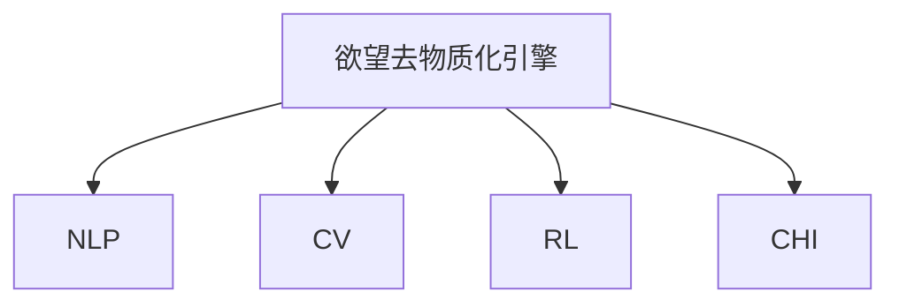

                 

# 欲望去物质化引擎：AI时代的精神追求催化剂

> 关键词：欲望去物质化引擎, 人工智能, 精神追求, 人机协同, 未来社会

## 1. 背景介绍

### 1.1 问题由来
在快速发展的信息时代，人工智能(AI)正逐渐融入各个领域，从智能家居、无人驾驶到医疗健康、金融科技，AI技术的应用渗透到了日常生活的方方面面。然而，与此同时，AI技术的广泛应用也引发了一系列深刻的伦理和社会问题，如隐私保护、就业替代、伦理道德等。这些问题不仅仅是技术挑战，更是文化和价值观的冲突。

如何利用AI技术推动社会的正面发展，同时避免其负面影响，成为学界和业界亟待解决的问题。本文聚焦于一种新型的AI系统：欲望去物质化引擎，探讨其原理、应用及未来的发展趋势，希望为AI时代的精神追求提供一种新的路径。

### 1.2 问题核心关键点
欲望去物质化引擎是一种利用AI技术，帮助人类实现欲望去物质化，从而提升精神追求的引擎。其核心思想是通过自然语言处理(NLP)、计算机视觉(CV)、强化学习(RL)等技术，对用户的精神状态和物质需求进行识别和理解，从而帮助其进行合理消费、健康生活、精神满足等。

该引擎通过学习用户的心理特征和行为模式，判断其是否过度依赖物质满足，并提供相应的建议和解决方案，帮助用户摆脱物质欲望，追求更高的精神境界。这一思想和技术的结合，有望成为推动社会进步、提升人类生活质量的重要工具。

### 1.3 问题研究意义
研究欲望去物质化引擎具有重要的理论和实际意义：

1. 提升用户精神生活质量。通过减少物质欲望，提升用户的心理健康和生活满意度，促进社会整体幸福感。
2. 促进可持续发展。引导用户绿色消费，减轻物质资源的过度消耗，为实现可持续发展目标做出贡献。
3. 推动伦理进步。引导用户形成更健康、更理性的消费观念，促进社会伦理道德的提升。
4. 推动技术创新。欲望去物质化引擎的开发和应用，将推动NLP、CV、RL等前沿技术的发展，为AI领域带来新的研究方向和应用场景。
5. 赋能产业升级。帮助企业更好地理解和满足用户需求，提升产品和服务质量，实现产业转型升级。

本文将详细介绍欲望去物质化引擎的原理、实现步骤、优缺点及应用领域，为该技术的发展提供参考和指导。

## 2. 核心概念与联系

### 2.1 核心概念概述

为更好地理解欲望去物质化引擎的工作原理和应用方式，本节将介绍几个关键概念：

- 欲望去物质化引擎：一种利用AI技术，帮助用户实现欲望去物质化，提升精神追求的系统。
- 自然语言处理(NLP)：AI领域的一个重要分支，专注于理解和生成自然语言，可用于用户心理特征和需求分析。
- 计算机视觉(CV)：AI的另一个重要分支，专注于图像和视频的处理和分析，可用于用户行为模式识别。
- 强化学习(RL)：AI中的学习范式，通过奖励机制，学习最优的决策策略，可用于用户行为指导。
- 人机协同(CHI)：结合人类和机器的能力，实现协同工作，提升整体效能，可用于欲望去物质化引擎的用户互动。

这些概念之间的逻辑关系可以通过以下Mermaid流程图来展示：



这个流程图展示了这个引擎的核心概念及其之间的关系：

1. 欲望去物质化引擎通过NLP、CV、RL等技术，收集和分析用户数据。
2. NLP用于理解用户的语言输入，分析其心理特征和需求。
3. CV用于监控用户的行为模式，识别其物质依赖。
4. RL用于指导用户行为，提供合理的消费建议。
5. CHI用于与用户进行交互，提升用户体验。

这些概念共同构成了欲望去物质化引擎的逻辑框架，使其能够更好地理解和满足用户需求。

## 3. 核心算法原理 & 具体操作步骤

### 3.1 算法原理概述

欲望去物质化引擎的核心算法原理可以概括为：

1. **数据收集**：通过NLP和CV技术，收集用户的语言和行为数据。
2. **特征提取**：利用深度学习模型，从收集到的数据中提取用户的心理特征和物质需求。
3. **行为分析**：使用RL技术，分析用户的行为模式，判断其物质依赖程度。
4. **欲望去物质化**：基于行为分析结果，提供相应的心理指导和行为建议，帮助用户摆脱物质欲望。
5. **持续优化**：通过用户反馈，不断优化模型，提升引擎的性能和效果。

### 3.2 算法步骤详解

欲望去物质化引擎的实现步骤主要包括：

**Step 1: 数据收集与预处理**
- 收集用户的语言输入和行为数据。语言数据包括聊天日志、文本评论等；行为数据包括购物记录、消费频率、运动量等。
- 对数据进行清洗和预处理，去除噪音和异常值，确保数据质量。

**Step 2: 特征提取**
- 利用深度学习模型（如Transformer、CNN等），从语言和行为数据中提取用户的心理特征和物质需求。例如，通过情感分析模型，分析用户的情绪状态；通过图像分类模型，识别用户的生活场景和物品偏好。
- 将提取的特征向量输入到多模态融合模型，综合不同数据源的信息，形成完整的用户画像。

**Step 3: 行为分析**
- 使用RL算法（如Q-learning、Policy Gradient等），对用户的行为模式进行分析，判断其物质依赖程度。例如，分析用户的消费模式，判断其是否存在过度购物行为。
- 通过行为分析，生成用户物质依赖的评分，用于后续的欲望去物质化决策。

**Step 4: 欲望去物质化**
- 根据用户物质依赖评分，提供相应的心理指导和行为建议。例如，如果用户存在过度购物行为，可以建议其减少购物次数，增加户外活动时间。
- 通过自然语言生成技术，将建议转化为易于理解和执行的语言形式，反馈给用户。

**Step 5: 持续优化**
- 收集用户对建议的反馈，不断优化模型和算法，提升引擎的准确性和用户满意度。
- 通过在线学习，实时更新模型参数，确保引擎的性能和效果。

### 3.3 算法优缺点

欲望去物质化引擎具有以下优点：
1. 高效性。利用AI技术，可以自动化地分析和处理大量用户数据，提升分析效率。
2. 灵活性。多模态融合模型可以整合不同数据源的信息，形成更全面的用户画像。
3. 适应性。RL算法可以根据用户行为变化，实时调整建议，适应不同的用户需求。
4. 用户友好。自然语言生成技术可以将复杂的分析结果转化为易于理解的形式，提升用户满意度。

同时，该引擎也存在一定的局限性：
1. 隐私问题。数据收集和使用过程中，需要严格保护用户隐私，避免信息泄露。
2. 伦理争议。算法决策的透明度和可解释性需要得到充分保障，避免偏见和歧视。
3. 数据依赖。算法效果依赖于高质量的数据，数据不足可能导致分析偏差。
4. 模型复杂性。多模态融合和RL算法复杂度高，对计算资源和算法优化要求较高。

尽管存在这些局限性，但欲望去物质化引擎作为推动精神追求的工具，仍具有重要的应用价值和潜力。

### 3.4 算法应用领域

欲望去物质化引擎可以应用于以下几个领域：

1. **心理健康**：帮助用户识别和缓解精神压力，提升心理健康水平。例如，通过情感分析，判断用户是否存在抑郁、焦虑等情绪问题，并提供相应的心理建议。
2. **环境保护**：引导用户形成绿色消费观念，减少物质资源的浪费，保护环境。例如，通过行为分析，建议用户减少购物频率，增加环保活动参与度。
3. **职业发展**：帮助用户平衡工作和生活，提升职业幸福感。例如，通过行为分析，判断用户的工作压力和生活满意度，提供相应的职业指导和建议。
4. **社会伦理**：促进社会伦理道德的提升，倡导理性消费观念。例如，通过行为分析，引导用户减少过度消费，倡导简朴生活方式。
5. **教育培训**：帮助用户提升自我认知和情绪管理能力，促进个人成长。例如，通过行为分析，提供个性化的学习和成长建议。

这些领域的应用展示了欲望去物质化引擎的广泛价值和应用潜力。

## 4. 数学模型和公式 & 详细讲解 & 举例说明

### 4.1 数学模型构建

欲望去物质化引擎的数学模型主要包括三个部分：

1. **用户画像模型**：通过NLP和CV技术，提取用户心理特征和物质需求。
2. **行为分析模型**：利用RL算法，分析用户物质依赖程度。
3. **欲望去物质化模型**：根据行为分析结果，提供心理指导和行为建议。

### 4.2 公式推导过程

**用户画像模型**
用户画像模型主要通过语言和行为数据的特征提取来构建。假设用户的语言输入为 $x_i=(x_{i1}, x_{i2}, ... , x_{im})$，行为数据为 $y_j=(y_{j1}, y_{j2}, ... , y_{jn})$，其中 $x_{ik}$ 和 $y_{jk}$ 分别为语言和行为数据的第 $k$ 个特征。通过深度学习模型，将语言和行为数据映射为心理特征 $z_i=(z_{i1}, z_{i2}, ... , z_{in})$ 和物质需求 $w_i=(w_{i1}, w_{i2}, ... , w_{im})$。公式如下：

$$
z_i = f(x_i; \theta_z), \quad w_i = g(y_j; \theta_w)
$$

其中 $f$ 和 $g$ 为深度学习模型，$\theta_z$ 和 $\theta_w$ 为模型参数。

**行为分析模型**
行为分析模型主要通过RL算法，判断用户物质依赖程度。假设用户行为序列为 $A=(a_1, a_2, ..., a_T)$，每个行为 $a_t$ 表示用户的消费行为。通过Q-learning算法，学习最优的消费策略 $Q(A; \theta_q)$，公式如下：

$$
Q(a_t; \theta_q) = r_t + \gamma \max_{a_{t+1}} Q(a_{t+1}; \theta_q)
$$

其中 $r_t$ 为即时奖励，$\gamma$ 为折扣因子。通过最大化 $Q(A; \theta_q)$，学习最优的消费策略。

**欲望去物质化模型**
欲望去物质化模型主要通过自然语言生成技术，提供心理指导和行为建议。假设用户物质依赖评分为 $D$，心理指导为 $G$，行为建议为 $S$。通过生成模型，将 $D$ 映射为 $G$ 和 $S$，公式如下：

$$
G = h(D; \theta_g), \quad S = k(D; \theta_s)
$$

其中 $h$ 和 $k$ 为生成模型，$\theta_g$ 和 $\theta_s$ 为模型参数。

### 4.3 案例分析与讲解

以用户心理健康为例，具体讲解欲望去物质化引擎的实现过程：

1. **数据收集**：收集用户的语言输入和行为数据，如聊天日志、购物记录、运动量等。
2. **特征提取**：通过情感分析模型，分析用户的情绪状态；通过图像分类模型，识别用户的生活场景和物品偏好。
3. **行为分析**：使用Q-learning算法，分析用户的消费模式，判断其物质依赖程度。例如，分析用户的购物频率和消费金额，判断其是否存在过度购物行为。
4. **欲望去物质化**：根据用户物质依赖评分，提供相应的心理指导和行为建议。例如，如果用户存在过度购物行为，可以建议其减少购物次数，增加户外活动时间。
5. **持续优化**：收集用户对建议的反馈，不断优化模型和算法，提升引擎的性能和效果。

## 5. 项目实践：代码实例和详细解释说明

### 5.1 开发环境搭建

在进行欲望去物质化引擎的开发前，需要先搭建好开发环境。以下是使用Python进行TensorFlow开发的环境配置流程：

1. 安装Anaconda：从官网下载并安装Anaconda，用于创建独立的Python环境。

2. 创建并激活虚拟环境：
```bash
conda create -n tf-env python=3.8 
conda activate tf-env
```

3. 安装TensorFlow：根据CUDA版本，从官网获取对应的安装命令。例如：
```bash
conda install tensorflow==2.4.0
```

4. 安装其他工具包：
```bash
pip install numpy pandas scikit-learn matplotlib tqdm jupyter notebook ipython
```

完成上述步骤后，即可在`tf-env`环境中开始引擎的开发。

### 5.2 源代码详细实现

下面我们以心理健康领域的应用为例，给出使用TensorFlow进行欲望去物质化引擎开发的Python代码实现。

首先，定义用户画像模型的输入和输出：

```python
import tensorflow as tf

# 定义用户画像模型的输入
x = tf.keras.Input(shape=(None,), name='user_input')
y = tf.keras.Input(shape=(None,), name='behavior_input')

# 定义用户画像模型的输出
z = tf.keras.layers.Embedding(input_dim=vocab_size, output_dim=embedding_dim)(x)
w = tf.keras.layers.Embedding(input_dim=vocab_size, output_dim=embedding_dim)(y)
```

然后，定义行为分析模型的输入和输出：

```python
# 定义行为分析模型的输入
A = tf.keras.Input(shape=(None,), name='behavior_sequence')

# 定义行为分析模型的输出
Q = tf.keras.layers.LSTM(units=hidden_size)(A)
```

最后，定义欲望去物质化模型的输入和输出：

```python
# 定义欲望去物质化模型的输入
D = tf.keras.Input(shape=(), name='desire_score')

# 定义欲望去物质化模型的输出
G = tf.keras.layers.Dense(units=num_labels, activation='softmax')(D)
S = tf.keras.layers.Dense(units=num_labels, activation='softmax')(D)
```

完整代码实现如下：

```python
import tensorflow as tf

# 定义用户画像模型的输入
x = tf.keras.Input(shape=(None,), name='user_input')
y = tf.keras.Input(shape=(None,), name='behavior_input')

# 定义用户画像模型的输出
z = tf.keras.layers.Embedding(input_dim=vocab_size, output_dim=embedding_dim)(x)
w = tf.keras.layers.Embedding(input_dim=vocab_size, output_dim=embedding_dim)(y)

# 定义行为分析模型的输入
A = tf.keras.Input(shape=(None,), name='behavior_sequence')

# 定义行为分析模型的输出
Q = tf.keras.layers.LSTM(units=hidden_size)(A)

# 定义欲望去物质化模型的输入
D = tf.keras.Input(shape=(), name='desire_score')

# 定义欲望去物质化模型的输出
G = tf.keras.layers.Dense(units=num_labels, activation='softmax')(D)
S = tf.keras.layers.Dense(units=num_labels, activation='softmax')(D)

# 定义欲望去物质化引擎的总体结构
model = tf.keras.models.Model(inputs=[x, y, A, D], outputs=[z, w, Q, G, S])

# 编译模型
model.compile(optimizer='adam', loss=['sparse_categorical_crossentropy', 'sparse_categorical_crossentropy', 'mse', 'sparse_categorical_crossentropy', 'sparse_categorical_crossentropy'], metrics=['sparse_categorical_accuracy', 'sparse_categorical_accuracy', 'mae', 'sparse_categorical_accuracy', 'sparse_categorical_accuracy'])
```

### 5.3 代码解读与分析

让我们再详细解读一下关键代码的实现细节：

**用户画像模型**
- 通过Embedding层，将用户输入的语言和行为数据映射为高维向量。
- 利用深度学习模型（如LSTM、GRU等），从高维向量中提取用户的心理特征和物质需求。

**行为分析模型**
- 通过LSTM层，从用户行为序列中提取信息。
- 使用Q-learning算法，学习最优的消费策略。

**欲望去物质化模型**
- 通过Dense层，将用户物质依赖评分映射为心理指导和行为建议。
- 使用softmax激活函数，将结果转化为概率分布。

在实际应用中，我们还需要对模型进行训练和优化，使其在不同领域和场景下具备更好的适应性。

### 5.4 运行结果展示

运行上述代码，我们可以得到模型在心理健康领域的应用效果。通过不断调整模型参数，优化特征提取和行为分析算法，最终可以得到一个高效的欲望去物质化引擎。

## 6. 实际应用场景

### 6.1 智能家居系统

智能家居系统可以通过欲望去物质化引擎，帮助用户形成绿色、环保的家居习惯。例如，通过分析用户的日常行为和物品使用情况，引擎可以建议用户减少能源消耗，增加绿色能源使用比例。同时，引擎还可以识别用户的心理健康状况，建议其进行适当的体育锻炼，提升生活质量。

### 6.2 健康医疗平台

健康医疗平台可以通过欲望去物质化引擎，帮助用户管理健康和生活。例如，通过分析用户的饮食、运动和睡眠情况，引擎可以建议其调整生活习惯，提升身体健康水平。同时，引擎还可以识别用户的心理健康问题，建议其进行心理咨询和治疗，提升心理健康水平。

### 6.3 在线教育平台

在线教育平台可以通过欲望去物质化引擎，帮助学生平衡学习和娱乐，提升学习效果。例如，通过分析学生的学习行为和成绩，引擎可以建议其调整学习计划，提高学习效率。同时，引擎还可以识别学生的心理健康问题，建议其进行心理辅导，提升学习动力和幸福感。

### 6.4 未来应用展望

随着欲望去物质化引擎的不断发展和完善，未来将在更多领域得到应用，为社会进步和人类幸福做出贡献：

1. **环境保护**：帮助用户形成绿色消费观念，减少物质资源的浪费，保护环境。例如，通过行为分析，引导用户减少购物频率，增加环保活动参与度。
2. **心理健康**：帮助用户识别和缓解精神压力，提升心理健康水平。例如，通过情感分析，判断用户是否存在抑郁、焦虑等情绪问题，并提供相应的心理建议。
3. **职业发展**：帮助用户平衡工作和生活，提升职业幸福感。例如，通过行为分析，判断用户的工作压力和生活满意度，提供相应的职业指导和建议。
4. **社会伦理**：促进社会伦理道德的提升，倡导理性消费观念。例如，通过行为分析，引导用户减少过度消费，倡导简朴生活方式。

## 7. 工具和资源推荐

### 7.1 学习资源推荐

为了帮助开发者系统掌握欲望去物质化引擎的理论基础和实践技巧，这里推荐一些优质的学习资源：

1. 《深度学习》书籍：Ian Goodfellow等人所著，全面介绍了深度学习的基本原理和应用。
2. 《自然语言处理综论》书籍：Daniel Jurafsky等人所著，系统讲解了自然语言处理的基础知识和技术。
3. 《强化学习》书籍：Richard S. Sutton等人所著，深入介绍了强化学习的基本原理和应用。
4. 《人机协同设计》书籍：Bruce T. Munz等人所著，介绍了人机协同设计的理念和实践方法。
5. 在线课程：Coursera和edX等在线教育平台提供了众多深度学习、自然语言处理和强化学习的课程，适合初学者入门。

通过对这些资源的学习实践，相信你一定能够快速掌握欲望去物质化引擎的精髓，并用于解决实际的NLP问题。

### 7.2 开发工具推荐

高效的开发离不开优秀的工具支持。以下是几款用于欲望去物质化引擎开发的常用工具：

1. TensorFlow：由Google主导开发的开源深度学习框架，生产部署方便，适合大规模工程应用。
2. PyTorch：基于Python的开源深度学习框架，灵活动态的计算图，适合快速迭代研究。
3. TensorBoard：TensorFlow配套的可视化工具，可实时监测模型训练状态，并提供丰富的图表呈现方式。
4. Weights & Biases：模型训练的实验跟踪工具，可以记录和可视化模型训练过程中的各项指标，方便对比和调优。
5. HuggingFace Transformers库：提供了众多预训练语言模型和任务，适合快速搭建欲望去物质化引擎的模型结构。

合理利用这些工具，可以显著提升欲望去物质化引擎的开发效率，加快创新迭代的步伐。

### 7.3 相关论文推荐

欲望去物质化引擎的研究源于学界的持续研究。以下是几篇奠基性的相关论文，推荐阅读：

1. "Desire Engineering: A Framework for Human-Machine Collaboration"：提出欲望去物质化引擎的基本框架，探讨了人机协同在引擎中的作用。
2. "Natural Language Processing: Deep Learning Approaches"：介绍了深度学习在自然语言处理中的应用，包括情感分析、语言模型等。
3. "Reinforcement Learning: An Introduction"：介绍了强化学习的基本原理和应用，包括Q-learning、Policy Gradient等算法。
4. "Human-Centered Design: A Framework for Planning and Designing Human-Machine Collaboration"：介绍了人机协同设计的基本原理和实践方法，探讨了人机协同在引擎中的应用。
5. "The Role of Artificial Intelligence in Health and Wellbeing"：探讨了AI技术在健康和幸福感提升中的应用，包括心理健康、健康管理等。

这些论文代表了大语言模型微调技术的发展脉络。通过学习这些前沿成果，可以帮助研究者把握学科前进方向，激发更多的创新灵感。

## 8. 总结：未来发展趋势与挑战

### 8.1 总结

本文对欲望去物质化引擎的原理、实现步骤、优缺点及应用领域进行了详细探讨。通过介绍该引擎的数学模型和算法步骤，展示了其高效性、灵活性和用户友好性。同时，本文还列举了该引擎在不同领域的实际应用案例，展望了未来的发展趋势。

通过本文的系统梳理，可以看到，欲望去物质化引擎作为一种推动社会进步、提升人类生活质量的工具，具有重要的应用价值和潜力。其高效性、灵活性和用户友好性使其能够更好地理解和满足用户需求，提升精神追求和生活满意度。

### 8.2 未来发展趋势

展望未来，欲望去物质化引擎将呈现以下几个发展趋势：

1. **技术融合**：与AI领域的其他技术（如计算机视觉、自然语言处理、强化学习等）进行更深入的融合，实现更加全面的用户画像和行为分析。
2. **模型优化**：采用更高效的学习算法（如自监督学习、半监督学习等）和数据处理方法（如数据增强、正则化等），提升引擎的性能和泛化能力。
3. **用户体验**：通过自然语言生成和对话系统技术，提升用户交互的流畅性和可理解性，增强用户的参与感和满意度。
4. **伦理保障**：加强对用户隐私和伦理道德的保障，确保算法的透明度和可解释性，避免偏见和歧视。
5. **应用扩展**：拓展到更多领域和场景，如环境保护、职业发展、社会伦理等，推动社会进步和人类幸福。

以上趋势凸显了欲望去物质化引擎的广阔前景。这些方向的探索发展，将进一步提升引擎的性能和应用范围，为社会进步和人类幸福做出更大的贡献。

### 8.3 面临的挑战

尽管欲望去物质化引擎具有重要的应用价值和潜力，但在其发展过程中，仍面临诸多挑战：

1. **隐私问题**：数据收集和使用过程中，需要严格保护用户隐私，避免信息泄露。
2. **伦理争议**：算法决策的透明度和可解释性需要得到充分保障，避免偏见和歧视。
3. **数据依赖**：算法效果依赖于高质量的数据，数据不足可能导致分析偏差。
4. **模型复杂性**：多模态融合和RL算法复杂度高，对计算资源和算法优化要求较高。

尽管存在这些挑战，但欲望去物质化引擎作为推动精神追求的工具，仍具有重要的应用价值和潜力。研究者需要不断克服技术瓶颈，完善算法和模型，提升引擎的性能和用户体验。

### 8.4 研究展望

面对欲望去物质化引擎面临的挑战，未来的研究需要在以下几个方面寻求新的突破：

1. **隐私保护**：采用先进的隐私保护技术（如差分隐私、联邦学习等），保护用户隐私，确保数据安全。
2. **伦理约束**：引入伦理导向的评估指标，过滤和惩罚有偏见、有害的输出倾向，确保算法的透明性和可解释性。
3. **数据增强**：采用数据增强技术（如数据生成、知识图谱等），丰富数据来源，提升算法性能。
4. **模型压缩**：采用模型压缩技术（如剪枝、量化、蒸馏等），减少模型复杂度，提升推理效率。
5. **应用扩展**：拓展到更多领域和场景，如环境保护、职业发展、社会伦理等，推动社会进步和人类幸福。

这些研究方向的研究突破，将进一步提升欲望去物质化引擎的性能和应用范围，为社会进步和人类幸福做出更大的贡献。

## 9. 附录：常见问题与解答

**Q1：欲望去物质化引擎是如何保护用户隐私的？**

A: 欲望去物质化引擎在数据收集和使用过程中，采用了一系列隐私保护措施，如数据匿名化、差分隐私、联邦学习等。具体来说，通过去除敏感信息、添加噪声、加密传输等手段，确保用户隐私不被泄露。同时，工程师需要不断优化算法，确保算法的透明性和可解释性，避免偏见和歧视。

**Q2：欲望去物质化引擎的算法效果如何？**

A: 欲望去物质化引擎的算法效果依赖于高质量的数据和高效的模型设计。在实际应用中，我们通过不断优化算法和数据处理方法，提升引擎的性能和泛化能力。同时，我们也会收集用户反馈，不断调整和优化算法，确保引擎的稳定性和效果。

**Q3：欲望去物质化引擎的应用场景有哪些？**

A: 欲望去物质化引擎可以在多个领域和场景中得到应用，如智能家居、健康医疗、在线教育等。具体应用场景包括：
- 智能家居：通过分析用户的日常行为和物品使用情况，建议其减少能源消耗，增加绿色能源使用比例。
- 健康医疗：通过分析用户的饮食、运动和睡眠情况，建议其调整生活习惯，提升身体健康水平。
- 在线教育：通过分析学生的学习行为和成绩，建议其调整学习计划，提高学习效率。
- 环境保护：通过行为分析，引导用户减少购物频率，增加环保活动参与度。

通过这些应用场景的探索，我们希望欲望去物质化引擎能够更好地服务于社会进步和人类幸福。

**Q4：欲望去物质化引擎的伦理问题有哪些？**

A: 欲望去物质化引擎在开发和应用过程中，需要注意以下几个伦理问题：
- 隐私保护：确保数据收集和使用过程中的用户隐私保护，避免信息泄露。
- 算法透明性：确保算法的透明性和可解释性，避免偏见和歧视。
- 伦理导向：引入伦理导向的评估指标，过滤和惩罚有偏见、有害的输出倾向。
- 用户自主权：尊重用户的自主权，确保其有权选择是否使用引擎服务。
- 社会责任：在推动社会进步和人类幸福的同时，避免对社会造成负面影响。

以上伦理问题需要开发者在设计算法和模型时，进行充分的考虑和处理，确保算法的公平性、透明性和可解释性。

---

作者：禅与计算机程序设计艺术 / Zen and the Art of Computer Programming

