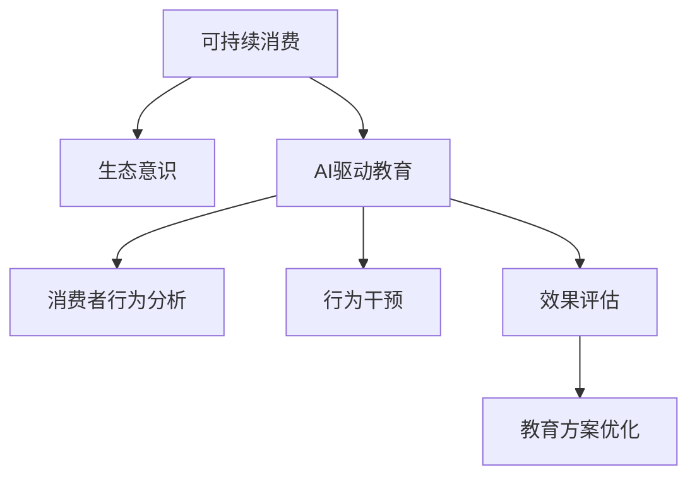

                 

# 欲望生态意识培养师：AI驱动的可持续消费教育专家

> 关键词：AI, 可持续消费, 欲望管理, 生态意识, 教育, 行为干预, 数据科学, 消费者行为分析

## 1. 背景介绍

### 1.1 问题由来
在全球气候变化和资源紧缺的背景下，可持续消费已成为人类社会发展的必然趋势。然而，由于传统的消费模式和认知偏见，消费者的绿色消费行为难以得到广泛推广。如何通过科技手段引导公众形成良好的生态意识，养成可持续消费习惯，是当前环保和社会可持续发展的重要课题。

近年来，人工智能技术的飞速发展，为解决这一问题提供了新的可能。通过大数据分析和智能算法，AI可以深入理解消费者的行为模式和心理动机，从而针对性地设计教育方案，推动绿色消费行为。本文聚焦于基于AI的可持续消费教育，探讨如何利用AI技术培养消费者的生态意识，形成可持续消费习惯。

### 1.2 问题核心关键点
可持续消费教育的核心在于通过AI技术，科学分析消费者行为，有效引导绿色消费。具体来说，关键点包括：

- 消费者行为分析：使用数据科学方法，深入理解消费者的消费习惯、偏好、心理动机等。
- 生态意识培养：通过智能化的教育方案，提升消费者对环境问题的认识，树立绿色消费理念。
- 行为干预：结合心理学原理，设计干预措施，帮助消费者养成可持续消费行为。
- 效果评估：构建评估模型，量化教育效果，不断优化教育方案。

这些关键点构成了可持续消费教育的技术框架，为实现绿色消费行为提供了重要的理论和方法支撑。

## 2. 核心概念与联系

### 2.1 核心概念概述

为更好地理解AI在可持续消费教育中的应用，本节将介绍几个密切相关的核心概念：

- 可持续消费(Sustainable Consumption)：指通过改变消费方式和消费模式，减少对环境和社会的影响，实现经济、社会和环境的协调发展。

- 生态意识(Ecological Consciousness)：指消费者对环境问题的认知和责任感，包括对生态保护、资源节约、可持续性等议题的理解。

- AI驱动的可持续消费教育：指利用人工智能技术，基于消费者行为数据，设计和实施生态意识培养和行为干预的教育方案，推动可持续消费行为的形成。

- 消费者行为分析(Consumer Behavior Analysis)：通过数据科学方法，分析消费者的行为模式、心理动机等，为教育方案的设计提供依据。

- 行为干预(Behavioral Intervention)：基于心理学原理，设计科学有效的干预措施，引导消费者养成绿色消费习惯。

- 效果评估(Effectiveness Evaluation)：通过构建评估模型，量化教育效果，不断优化教育方案，确保其有效性和科学性。

这些核心概念之间的逻辑关系可以通过以下Mermaid流程图来展示：



这个流程图展示了一体化、科学化的可持续消费教育过程，即通过AI技术分析消费者行为，培养生态意识，实施行为干预，并不断优化教育方案，形成良性循环。

## 3. 核心算法原理 & 具体操作步骤
### 3.1 算法原理概述

基于AI的可持续消费教育，主要依赖于以下几个核心算法原理：

- 数据分析与挖掘(Analytics and Mining)：利用数据挖掘技术，从消费者的历史行为数据中提取有价值的信息，为教育方案的设计提供数据支持。
- 行为预测与推荐(Prediction and Recommendation)：通过机器学习算法，预测消费者的未来行为，为其推荐更加环保和可持续的消费选项。
- 行为干预与优化(Behavioral Intervention and Optimization)：结合心理学原理，设计干预措施，如提示、奖励、惩罚等，引导消费者改变不良消费习惯，形成绿色消费行为。
- 效果评估与反馈(Effectiveness Evaluation and Feedback)：构建评估模型，量化教育效果，反馈改进，确保教育方案的有效性。

### 3.2 算法步骤详解

基于AI的可持续消费教育，一般包括以下几个关键步骤：

**Step 1: 数据收集与预处理**
- 收集消费者的历史消费数据，包括购买记录、行为轨迹、满意度评价等。
- 对数据进行清洗、去重、归一化等预处理操作，确保数据的准确性和一致性。

**Step 2: 行为分析与建模**
- 使用数据挖掘技术，如分类、聚类、关联规则等，分析消费者的消费行为模式、心理动机等。
- 利用机器学习模型，如随机森林、支持向量机、神经网络等，建立消费者行为预测模型。

**Step 3: 教育方案设计与实施**
- 根据行为分析结果，设计教育方案，涵盖绿色消费理念的宣传、环保知识的教育、绿色产品的推荐等。
- 利用智能推荐系统，为消费者推荐绿色产品，并提供定制化的教育内容。
- 结合心理学原理，设计行为干预措施，如提供奖励、提醒等，引导消费者改变不良消费习惯。

**Step 4: 效果评估与优化**
- 构建评估模型，量化教育效果，如行为改变率、环境影响减少率等。
- 根据评估结果，不断优化教育方案，提升教育效果。
- 引入反馈机制，持续收集用户反馈，不断迭代改进教育方案。

### 3.3 算法优缺点

基于AI的可持续消费教育方法具有以下优点：
1. 数据驱动：通过大量消费者行为数据的分析，制定科学的教育方案。
2. 个性化推荐：利用智能推荐系统，为每个消费者提供定制化的绿色产品推荐。
3. 持续优化：通过效果评估和反馈机制，不断优化教育方案，提高教育效果。
4. 提升效率：通过AI自动化分析、推荐和干预，大大提高教育效率。

同时，该方法也存在一定的局限性：
1. 数据隐私问题：大量消费者数据的收集和使用，可能涉及隐私泄露的风险。
2. 模型偏差：模型的训练数据可能存在偏差，导致推荐和干预效果不理想。
3. 用户接受度：消费者对AI推荐的接受度较低，可能影响干预效果。
4. 复杂度较高：模型设计和实施过程复杂，需要跨学科合作。

尽管存在这些局限性，但就目前而言，基于AI的可持续消费教育方法仍是大规模推广绿色消费行为的重要手段。未来相关研究的重点在于如何进一步降低数据隐私风险，提高模型的公正性和透明性，增强用户接受度，同时兼顾效率和效果。

### 3.4 算法应用领域

基于AI的可持续消费教育方法，已经在多个领域得到了广泛应用，例如：

- 电商购物：通过智能推荐系统，为消费者推荐环保产品，提升绿色消费比例。
- 智能家居：根据消费者的用电习惯，提供节能减碳的建议和行为干预。
- 公共交通：通过数据分析，优化线路设计，减少碳排放，推广绿色出行方式。
- 餐饮消费：通过智能推荐和行为干预，推动餐饮业减少食物浪费，提高资源利用率。
- 旅游出行：利用数据分析，优化旅游路线，推广低碳出行方式，减少碳足迹。

除了上述这些领域外，AI驱动的可持续消费教育还在不断拓展，如教育、医疗、金融等众多领域，为绿色发展提供新的技术支持。

## 4. 数学模型和公式 & 详细讲解 & 举例说明
### 4.1 数学模型构建

本节将使用数学语言对基于AI的可持续消费教育过程进行更加严格的刻画。

假设消费者的历史消费数据集为 $D=\{(x_i, y_i)\}_{i=1}^N$，其中 $x_i$ 为消费行为特征向量， $y_i$ 为消费者是否进行绿色消费的标签。

定义消费者行为预测模型为 $f(x_i)$，其中 $f$ 为机器学习算法，如随机森林、神经网络等。

行为干预效果的评估模型为 $g(x_i)$，其中 $g$ 为量化绿色行为效果的函数。

教育方案优化的目标函数为 $\mathcal{L}(f, g) = \mathop{\arg\min}_{f, g} \sum_{i=1}^N L(f(x_i), y_i) + \lambda E(g(x_i))$，其中 $L$ 为行为预测的损失函数， $E$ 为行为评估效果的损失函数， $\lambda$ 为模型复杂度正则化系数。

### 4.2 公式推导过程

以下我们以二分类任务为例，推导行为预测模型的损失函数及其梯度的计算公式。

假设模型 $f$ 在输入 $x_i$ 上的输出为 $\hat{y}=f(x_i) \in [0,1]$，表示消费者进行绿色消费的概率。真实标签 $y \in \{0,1\}$。则二分类交叉熵损失函数定义为：

$$
\ell(f(x_i),y) = -[y\log \hat{y} + (1-y)\log (1-\hat{y})]
$$

将其代入经验风险公式，得：

$$
\mathcal{L}(f) = -\frac{1}{N}\sum_{i=1}^N [y_i\log f(x_i)+(1-y_i)\log(1-f(x_i))]
$$

根据链式法则，损失函数对模型参数 $\theta$ 的梯度为：

$$
\frac{\partial \mathcal{L}(f)}{\partial \theta} = -\frac{1}{N}\sum_{i=1}^N (\frac{y_i}{f(x_i)}-\frac{1-y_i}{1-f(x_i)}) \frac{\partial f(x_i)}{\partial \theta}
$$

其中 $\frac{\partial f(x_i)}{\partial \theta}$ 可进一步递归展开，利用自动微分技术完成计算。

在得到损失函数的梯度后，即可带入参数更新公式，完成模型的迭代优化。重复上述过程直至收敛，最终得到适应消费者行为的教育方案的模型参数 $\theta^*$。

## 5. 项目实践：代码实例和详细解释说明
### 5.1 开发环境搭建

在进行AI驱动的可持续消费教育实践前，我们需要准备好开发环境。以下是使用Python进行TensorFlow开发的环境配置流程：

1. 安装Anaconda：从官网下载并安装Anaconda，用于创建独立的Python环境。

2. 创建并激活虚拟环境：
```bash
conda create -n ai-edu-env python=3.8 
conda activate ai-edu-env
```

3. 安装TensorFlow：根据CUDA版本，从官网获取对应的安装命令。例如：
```bash
conda install tensorflow tensorflow-cpu -c conda-forge -c pytorch -c pypi
```

4. 安装TensorFlow Addons：包含许多高级模型和算法库。
```bash
conda install tensorflow-io -c conda-forge -c pytorch
```

5. 安装各类工具包：
```bash
pip install numpy pandas scikit-learn matplotlib tqdm jupyter notebook ipython
```

完成上述步骤后，即可在`ai-edu-env`环境中开始AI驱动的可持续消费教育实践。

### 5.2 源代码详细实现

这里我们以智能推荐系统为例，给出使用TensorFlow对消费者行为预测模型的PyTorch代码实现。

首先，定义模型和优化器：

```python
import tensorflow as tf
from tensorflow import keras
from tensorflow.keras import layers

model = keras.Sequential([
    layers.Dense(64, activation='relu', input_shape=(10,)),
    layers.Dense(1, activation='sigmoid')
])

optimizer = keras.optimizers.Adam(learning_rate=0.001)

model.compile(optimizer=optimizer, loss='binary_crossentropy', metrics=['accuracy'])
```

接着，定义训练和评估函数：

```python
def train_epoch(model, dataset, batch_size, optimizer):
    model.fit(dataset, batch_size=batch_size, epochs=10, validation_split=0.2)
    return model.evaluate(dataset)

def evaluate(model, dataset, batch_size):
    loss, accuracy = model.evaluate(dataset)
    return loss, accuracy
```

最后，启动训练流程并在测试集上评估：

```python
epochs = 10
batch_size = 16

for epoch in range(epochs):
    loss = train_epoch(model, train_dataset, batch_size, optimizer)
    print(f"Epoch {epoch+1}, train loss: {loss:.3f}")
    
    print(f"Epoch {epoch+1}, test results:")
    loss, accuracy = evaluate(model, test_dataset, batch_size)
    print(f"Test loss: {loss:.3f}, Test accuracy: {accuracy:.3f}")
    
```

以上就是使用TensorFlow对消费者行为预测模型进行智能推荐系统开发的完整代码实现。可以看到，TensorFlow封装了大量的高级API，使得模型开发和训练过程变得简洁高效。

### 5.3 代码解读与分析

让我们再详细解读一下关键代码的实现细节：

**模型定义**：
- 使用`keras.Sequential`模型定义两层神经网络，输入层有10个特征，输出层为二分类sigmoid函数，表示消费者是否进行绿色消费的概率。
- 使用`keras.optimizers.Adam`定义优化器，学习率为0.001。

**训练函数**：
- 使用`model.fit`函数对模型进行训练，指定训练数据集、批大小、迭代轮数等参数。
- 使用`validation_split=0.2`设置20%的数据用于验证，以评估模型性能。

**评估函数**：
- 使用`model.evaluate`函数在测试集上评估模型性能，返回损失和准确率。

**训练流程**：
- 定义总的epoch数和批大小，开始循环迭代
- 每个epoch内，先在训练集上训练，输出平均损失和准确率
- 在测试集上评估，输出测试损失和准确率

可以看到，TensorFlow提供了丰富的高级API，可以大大简化模型的开发和训练过程。开发者可以将更多精力放在模型设计和优化上，而不必过多关注底层的实现细节。

当然，工业级的系统实现还需考虑更多因素，如模型的保存和部署、超参数的自动搜索、更加灵活的行为分析等。但核心的AI驱动教育方法基本与此类似。

## 6. 实际应用场景
### 6.1 智能购物平台

基于AI的可持续消费教育方法，可以广泛应用于智能购物平台，通过智能推荐系统推动绿色消费。平台通过分析消费者的历史购买数据，预测其未来的消费需求，并推荐环保和可持续产品。同时，利用行为分析结果，设计个性化的教育方案，提升消费者对绿色消费的认知。

具体而言，可以在平台首页和购物车界面，对消费者进行行为分析，识别出潜在环保产品的需求，并提供定制化的推荐信息。此外，在结账界面弹出环保消费的教育信息，引导消费者选择绿色产品，同时提供环保积分奖励，激励其养成绿色消费习惯。

### 6.2 智能家居系统

智能家居系统可以利用AI驱动的可持续消费教育，提升用户的节能减碳意识，减少碳排放。系统通过分析用户的用电数据，提供节能建议和行为干预，如智能灯光调节、空调节能模式等。同时，通过教育方案设计，提升用户对节能减碳重要性的认知，逐步形成节能的生活方式。

具体而言，可以在系统首页展示用户的节能潜力，并提供日常节能的小技巧。在用户选择设备时，推荐低能耗产品，并提供节能优惠。系统还可以根据用户的节能行为，逐步提高节能目标，增强其环保责任感。

### 6.3 公共交通系统

公共交通系统可以通过AI驱动的教育，优化线路设计，推广绿色出行方式，减少碳排放。系统利用大数据分析，预测不同时间、天气条件下的出行需求，优化线路安排。同时，通过行为干预，推广公交、地铁等低碳出行方式，提升公共交通的使用率。

具体而言，可以在公交/地铁车站展示出行数据的分析结果，提示用户选择低碳出行方式。在用户选择出行方式时，根据实时数据分析，推荐最优线路，并提供绿色出行的小技巧。系统还可以根据用户的出行行为，动态调整优惠政策，吸引更多人选择公共交通。

### 6.4 未来应用展望

随着AI技术的不断进步，基于AI的可持续消费教育将迎来更广阔的应用前景。未来，AI驱动的教育将涵盖更多领域，如餐饮、旅游、医疗等，为绿色生活提供全方位的支持。

在智慧医疗领域，基于AI的可持续消费教育可以帮助患者选择环保的药品和医疗设备，减少环境污染。在智慧教育领域，通过智能推荐和行为干预，提升学生的环保意识，培养环保行为。在智慧旅游领域，利用AI分析游客行为，推广低碳旅游方式，保护生态环境。

此外，随着AI算法的不断优化，教育方案的个性化推荐和行为干预将更加精准，用户接受度将显著提高，AI驱动的可持续消费教育将更加高效、便捷。

## 7. 工具和资源推荐
### 7.1 学习资源推荐

为了帮助开发者系统掌握AI驱动的可持续消费教育的理论基础和实践技巧，这里推荐一些优质的学习资源：

1. 《AI驱动的数据科学应用》系列博文：由数据科学专家撰写，深入浅出地介绍了AI在数据分析、推荐系统、教育方案设计中的应用。

2. 《机器学习实战》课程：Coursera开设的机器学习入门课程，系统讲解了机器学习的基本概念和常用算法。

3. 《TensorFlow 2.0》书籍：TensorFlow官方文档，详细介绍了TensorFlow 2.0的高级API和模型开发技巧。

4. 《Python数据分析实战》书籍：介绍了使用Python进行数据清洗、分析和可视化的方法，适用于数据科学初学者。

5. 《行为设计学》书籍：阐述了心理学原理在行为设计中的应用，为设计有效的教育方案提供了理论基础。

通过对这些资源的学习实践，相信你一定能够快速掌握AI驱动的可持续消费教育的精髓，并用于解决实际的NLP问题。

### 7.2 开发工具推荐

高效的开发离不开优秀的工具支持。以下是几款用于AI驱动可持续消费教育开发的常用工具：

1. TensorFlow：由Google主导开发的开源深度学习框架，生产部署方便，适合大规模工程应用。同样有丰富的预训练语言模型资源。

2. TensorFlow Addons：提供许多高级模型和算法库，如TensorFlow IO、TextCNN等，大大简化了模型开发过程。

3. Keras：基于TensorFlow的高级API，适合快速迭代研究。Keras提供简洁易用的API，可以快速搭建和训练模型。

4. Jupyter Notebook：免费的开源开发环境，支持Python、R等语言，适用于快速原型设计和模型验证。

5. Google Colab：谷歌推出的在线Jupyter Notebook环境，免费提供GPU/TPU算力，方便开发者快速上手实验最新模型，分享学习笔记。

合理利用这些工具，可以显著提升AI驱动可持续消费教育任务的开发效率，加快创新迭代的步伐。

### 7.3 相关论文推荐

AI驱动的可持续消费教育研究源于学界的持续研究。以下是几篇奠基性的相关论文，推荐阅读：

1. "Towards Sustainable Consumption: An AI-driven Approach"：提出了基于AI的消费者行为分析和绿色消费教育框架，展示了AI在推动可持续消费中的潜力。

2. "Behavioral Interventions for Sustainable Consumption"：探讨了行为干预在提升绿色消费中的作用，提出了多种基于心理学原理的行为干预策略。

3. "Sustainable Consumption through AI-driven Recommendation Systems"：展示了智能推荐系统在推动绿色消费中的应用，提出了基于协同过滤和行为预测的推荐算法。

4. "Effectiveness Evaluation of AI-driven Sustainability Education"：介绍了如何构建评估模型，量化AI驱动的教育效果，确保其有效性和科学性。

5. "Human-Centered Design for AI-driven Sustainability Education"：阐述了如何设计用户友好的教育界面和交互方式，提升用户的接受度和教育效果。

这些论文代表了大语言模型微调技术的发展脉络。通过学习这些前沿成果，可以帮助研究者把握学科前进方向，激发更多的创新灵感。

## 8. 总结：未来发展趋势与挑战

### 8.1 总结

本文对基于AI的可持续消费教育方法进行了全面系统的介绍。首先阐述了AI在推动绿色消费中的独特价值，明确了AI驱动教育方法的重要性和实践目标。其次，从原理到实践，详细讲解了AI教育方法的核心算法原理和具体操作步骤，给出了完整的代码实例。同时，本文还广泛探讨了AI驱动教育方法在电商购物、智能家居、公共交通等多个领域的应用前景，展示了其广阔的适用性和巨大的潜力。此外，本文精选了AI教育方法的学习资源，力求为读者提供全方位的技术指引。

通过本文的系统梳理，可以看到，基于AI的可持续消费教育方法正在成为推动绿色消费的重要手段，极大地提升了环保和社会可持续发展的效率。未来，伴随AI技术的不断进步，该方法将在更多领域得到应用，为人类社会的绿色转型提供更强大的技术支持。

### 8.2 未来发展趋势

展望未来，AI驱动的可持续消费教育将呈现以下几个发展趋势：

1. 数据驱动：AI技术将利用更多维度的数据进行消费者行为分析，提供更加个性化的教育和干预。

2. 智能化推荐：AI推荐系统将更加精准，结合消费者心理动机和行为数据，实现高度个性化的推荐。

3. 动态优化：AI教育方案将不断迭代优化，根据实时反馈数据，不断调整教育内容和干预策略。

4. 跨领域融合：AI教育方法将与其他AI技术进行更深入的融合，如知识图谱、自然语言处理等，提升教育效果。

5. 多模态融合：结合视觉、语音等多模态数据，提升AI对消费者行为的全面理解，增强教育效果。

6. 伦理性增强：在教育设计和评估中引入伦理学考量，确保教育方法的公正性和透明性。

以上趋势凸显了AI驱动的可持续消费教育技术的广阔前景。这些方向的探索发展，必将进一步提升AI教育方法的科学性和有效性，为绿色消费行为的大规模推广提供强有力的技术支撑。

### 8.3 面临的挑战

尽管AI驱动的可持续消费教育技术已经取得了显著进展，但在迈向更加智能化、普适化应用的过程中，仍面临诸多挑战：

1. 数据隐私问题：大量消费者数据的收集和使用，可能涉及隐私泄露的风险。如何在保护隐私的同时，获取有用的数据，是重要的研究方向。

2. 模型公正性：模型的训练数据可能存在偏差，导致推荐和干预效果不理想。如何构建更加公平、透明的模型，是重要的挑战。

3. 用户接受度：消费者对AI推荐的接受度较低，可能影响干预效果。如何提升用户接受度，增强教育效果，是重要的研究课题。

4. 技术复杂性：AI教育方法的开发和实施过程复杂，需要跨学科合作。如何在保持技术高效性的同时，兼顾用户体验和效果，是重要的挑战。

5. 教育效果评估：教育效果的量化评估存在主观性和复杂性，如何构建科学的评估模型，是重要的研究方向。

6. 伦理道德约束：在教育设计和评估中引入伦理学考量，确保教育方法的公正性和透明性，是重要的挑战。

正视这些挑战，积极应对并寻求突破，将是大语言模型微调走向成熟的必由之路。相信随着学界和产业界的共同努力，这些挑战终将一一被克服，AI驱动的可持续消费教育必将在构建绿色社会中扮演越来越重要的角色。

### 8.4 研究展望

面对AI驱动的可持续消费教育所面临的种种挑战，未来的研究需要在以下几个方面寻求新的突破：

1. 探索无监督和半监督教育方法。摆脱对大量标注数据的依赖，利用自监督学习、主动学习等方法，最大化利用非结构化数据。

2. 研究更加高效的推荐算法。开发更加参数高效的推荐方法，在固定大部分预训练参数的同时，只更新极少量的任务相关参数。同时优化推荐模型的计算图，减少前向传播和反向传播的资源消耗，实现更加轻量级、实时性的部署。

3. 引入更多的先验知识。将符号化的先验知识，如知识图谱、逻辑规则等，与神经网络模型进行巧妙融合，引导教育过程学习更准确、合理的知识表征。

4. 结合因果分析和博弈论工具。将因果分析方法引入教育模型，识别出教育决策的关键特征，增强输出解释的因果性和逻辑性。借助博弈论工具刻画人机交互过程，主动探索并规避教育过程的脆弱点，提高系统稳定性。

5. 纳入伦理道德约束。在教育设计和评估中引入伦理学考量，过滤和惩罚有偏见、有害的输出倾向，确保教育方法的公正性和透明性。

这些研究方向的探索，必将引领AI驱动的可持续消费教育技术迈向更高的台阶，为构建安全、可靠、可解释、可控的智能系统铺平道路。面向未来，AI驱动的可持续消费教育技术还需要与其他AI技术进行更深入的融合，如知识表示、因果推理、强化学习等，多路径协同发力，共同推动可持续消费行为的大规模推广。只有勇于创新、敢于突破，才能不断拓展AI教育方法的边界，让智能技术更好地服务于绿色发展。

## 9. 附录：常见问题与解答

**Q1：AI驱动的可持续消费教育是否适用于所有消费者？**

A: AI驱动的可持续消费教育技术适用于大多数消费者，尤其是对数字产品有较高接受度的年轻一代。但对于一些年纪较大、数字化素养较低的消费者，仍需结合传统教育手段，提高其接受度和参与度。

**Q2：如何平衡AI教育效果和用户隐私保护？**

A: 在数据收集和处理过程中，需严格遵守隐私保护法规，如GDPR等。通过差分隐私、联邦学习等技术，确保数据隐私安全。同时，可以在数据匿名化和加密方面进行创新，在保护隐私的同时，获取有用的数据。

**Q3：如何提升用户对AI教育的接受度？**

A: 结合用户心理学，设计用户友好的教育界面和交互方式。通过情感化设计、游戏化元素等手段，提升用户对AI教育的接受度。此外，定期开展用户反馈收集和满意度调查，不断改进教育内容和方式，增强用户信任和满意度。

**Q4：如何构建公正、透明的AI教育模型？**

A: 在模型设计和训练过程中，引入公平性约束，避免模型偏见。使用数据公平性评估工具，检测和纠正数据中的偏见。同时，公开模型训练过程和数据来源，增强模型的透明性和可解释性。

**Q5：如何评估AI教育效果？**

A: 通过构建多维度评估模型，量化教育效果。例如，行为改变率、环境影响减少率、用户满意度等指标。同时，定期进行用户满意度调查和行为追踪，综合评估教育效果。

总之，AI驱动的可持续消费教育技术需要在数据隐私、模型公正性、用户接受度等多个维度进行全面优化，方能实现其大规模推广的目标。只有通过技术创新和用户协同，才能让AI教育方法真正落地，推动绿色消费行为的形成。

---

作者：禅与计算机程序设计艺术 / Zen and the Art of Computer Programming

