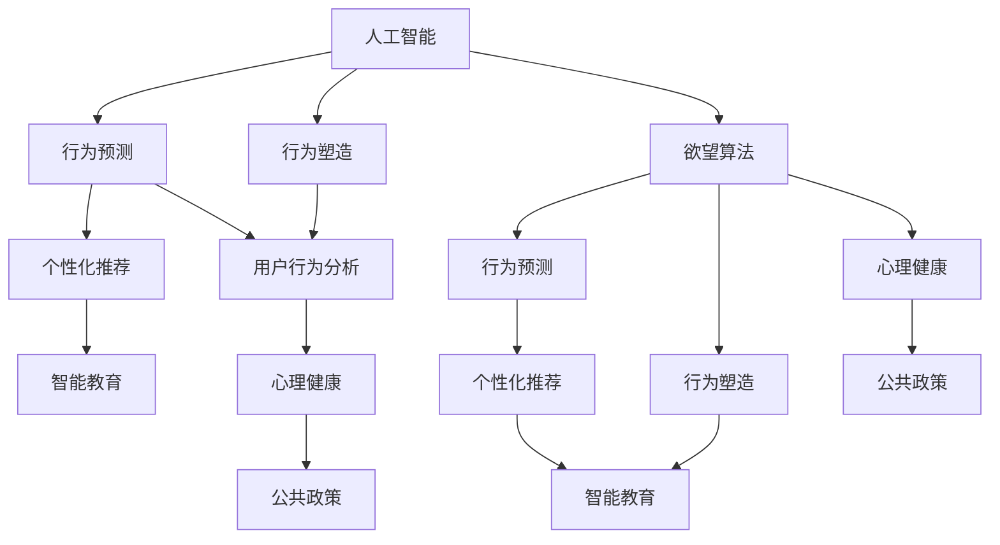

                 

# 欲望算法：AI如何预测和塑造人类行为

> 关键词：人工智能,行为预测,人类行为,行为塑造,欲望算法,机器学习,深度学习,数据科学

## 1. 背景介绍

### 1.1 问题由来
在当今数字化时代，人工智能（AI）正逐步渗透到社会的各个领域，从智能助手到自动驾驶，从医疗诊断到金融风控，AI正在重塑人类的生活方式和工作方式。然而，随着AI技术的广泛应用，我们也不得不面对一个新的问题：AI不仅在技术和工具层面改变着我们的世界，它还如何在更深层次上影响我们的行为和决策？

### 1.2 问题核心关键点
这个问题的核心在于，AI如何利用数据和算法来预测和塑造人类行为。具体来说，AI可以通过分析大量的人类行为数据，识别出行为模式的规律和趋势，进而预测个体的行为选择，甚至干预和改变个体的决策过程。这种行为预测和干预，在许多场景中可能产生重大影响，从个性化推荐系统到智能教育，从心理健康到公共政策，其潜在的社会和经济价值巨大，但也伴随着伦理和法律的挑战。

## 2. 核心概念与联系

### 2.1 核心概念概述

为了更好地理解AI如何预测和塑造人类行为，本节将介绍几个关键概念：

- **人工智能（AI）**：通过计算机模拟人的智能活动，实现自动化、智能化处理和决策。AI技术包括机器学习、深度学习、自然语言处理、计算机视觉等，其中，机器学习是实现行为预测和行为塑造的核心技术。
- **行为预测**：利用数据和算法预测个体的行为选择，如推荐系统的个性化推荐、游戏AI的决策等。行为预测的目标是最大化AI系统的输出效用，同时尊重用户的隐私和自由意志。
- **行为塑造**：通过优化算法和数据选择，有意识地影响个体的行为选择，如通过强化学习训练智能体，使其在特定环境中采取最优策略。行为塑造旨在提升AI系统的效用，但需要注意伦理和法律问题。
- **欲望算法**：一种基于用户行为数据的AI算法，通过识别用户行为背后的心理需求和欲望，预测用户未来的行为选择，并根据这些预测进行行为干预，以提升用户满意度和系统效用。欲望算法结合了行为预测和行为塑造的原理，旨在更好地理解用户的内心需求，从而提供更个性化的服务和决策支持。

### 2.2 核心概念原理和架构的 Mermaid 流程图



这个流程图展示了AI技术在行为预测和行为塑造方面的基本架构和流程。人工智能通过行为预测和行为塑造，影响用户的行为选择，进而提升系统的效用和用户的满意度。欲望算法作为AI技术的一个分支，特别强调通过理解用户的心理需求和欲望，来进行更精准的行为预测和行为干预。

## 3. 核心算法原理 & 具体操作步骤
### 3.1 算法原理概述

欲望算法是一种基于机器学习和行为科学的AI算法，通过分析用户行为数据，识别出行为背后的心理需求和欲望，进而预测用户未来的行为选择，并根据这些预测进行行为干预。其核心原理可以概括为以下几个步骤：

1. **数据采集**：收集用户的行为数据，如点击、浏览、购买记录等，作为算法的输入。
2. **欲望识别**：通过数据挖掘和模式识别技术，识别出用户行为背后的心理需求和欲望。
3. **行为预测**：利用预测模型，预测用户未来的行为选择，如推荐系统推荐物品、教育系统推荐课程等。
4. **行为塑造**：根据预测结果，设计行为干预策略，通过优化算法调整用户的行为选择，以提升系统的效用。

### 3.2 算法步骤详解

欲望算法的具体实现步骤如下：

1. **数据采集**：
    - 定义行为数据采集方式：确定要采集的行为数据类型（如点击、浏览、购买等），设计数据采集接口和协议。
    - 数据清洗和预处理：对采集到的行为数据进行去重、清洗和预处理，确保数据质量和一致性。
    - 数据存储与管理：将处理好的行为数据存储在可扩展的数据库或数据仓库中，设计合理的数据访问和查询机制。

2. **欲望识别**：
    - 特征提取与选择：从行为数据中提取关键特征，如时间戳、设备类型、行为频率等。
    - 欲望模型训练：使用机器学习模型（如神经网络、决策树、支持向量机等）训练欲望识别模型，识别出行为背后的心理需求和欲望。
    - 欲望分类与标注：对识别出的欲望进行分类和标注，建立欲望与行为之间的映射关系。

3. **行为预测**：
    - 预测模型训练：选择适合的预测模型（如回归模型、分类模型、序列模型等），利用历史行为数据训练预测模型。
    - 预测结果生成：对新行为数据进行预测，生成用户未来的行为选择。

4. **行为塑造**：
    - 干预策略设计：根据预测结果，设计行为干预策略，如个性化推荐、智能教育方案、健康干预措施等。
    - 干预效果评估：对行为干预效果进行评估，分析干预对用户行为和系统效用的影响。
    - 干预策略优化：根据评估结果，优化干预策略，提升干预效果和用户满意度。

### 3.3 算法优缺点

欲望算法的优点包括：

- **个性化推荐**：能够根据用户心理需求和欲望，提供更精准、更个性化的推荐服务，提升用户体验。
- **行为优化**：通过行为塑造，优化用户行为，提升系统效用，如提升广告点击率、增加用户活跃度等。
- **用户满意度**：通过理解用户欲望，满足用户心理需求，提升用户满意度和忠诚度。

但其缺点也较为明显：

- **隐私问题**：欲望算法需要收集大量用户行为数据，存在隐私泄露和数据滥用的风险。
- **算法偏见**：欲望算法可能学习到数据的偏见，导致预测和干预的不公平和歧视。
- **干预效果不确定**：行为干预的效果受多种因素影响，如用户心理状态、外部环境变化等，难以保证干预效果。
- **模型复杂性**：欲望算法的实现需要复杂的数据处理和模型训练过程，技术门槛较高。

### 3.4 算法应用领域

欲望算法可以应用于多种领域，如：

- **个性化推荐系统**：利用欲望识别和行为预测，为用户推荐个性化物品或服务。
- **智能教育系统**：根据学生行为数据，提供个性化学习方案和辅导建议。
- **心理健康应用**：通过分析用户的心理健康数据，提供心理健康干预和治疗建议。
- **智能家居**：根据用户的生活习惯和偏好，优化家居设备和环境设置。
- **公共政策制定**：通过分析公众行为数据，制定更科学、更有效的公共政策。

## 4. 数学模型和公式 & 详细讲解 & 举例说明

### 4.1 数学模型构建

欲望算法的数学模型可以简单描述为：

$$
\begin{aligned}
\text{Desire}_{i,j} & = f(\text{Behavior}_{i}, \text{Context}_{j}) \\
\text{Predict}_{i,k} & = g(\text{Desire}_{i,j}, \text{History}_{i,k-1})
\end{aligned}
$$

其中，$i$ 表示用户编号，$j$ 表示行为类型，$k$ 表示时间步。$\text{Behavior}_{i}$ 为第$i$用户的历史行为数据，$\text{Context}_{j}$ 为当前环境特征，$\text{Desire}_{i,j}$ 为用户的第$j$类欲望，$\text{Predict}_{i,k}$ 为预测用户未来的行为选择。$f$ 和 $g$ 分别为欲望识别和行为预测的数学模型。

### 4.2 公式推导过程

以下以个性化推荐系统为例，推导欲望算法的数学模型。

假设用户行为数据为 $B = \{b_1, b_2, ..., b_n\}$，环境特征为 $C = \{c_1, c_2, ..., c_m\}$，用户的第 $j$ 类欲望为 $D_j = \{d_{i,j}\}_{i=1}^N$，其中 $N$ 为用户的数量。假设欲望识别模型为神经网络，行为预测模型为回归模型。

欲望识别模型的输入为 $X = \{B, C\}$，输出为 $D = \{D_1, D_2, ..., D_M\}$，其中 $M$ 为欲望类别数。欲望识别模型的损失函数为：

$$
L_D = \sum_{i=1}^N \sum_{j=1}^M \|D_{i,j} - \hat{D}_{i,j}\|^2
$$

行为预测模型的输入为 $X' = \{D_j, B_{k-1}\}$，输出为 $Y_k = \{y_{i,k}\}_{i=1}^N$，其中 $B_{k-1}$ 为用户历史行为数据的前 $k-1$ 次行为。行为预测模型的损失函数为：

$$
L_Y = \sum_{i=1}^N \|y_{i,k} - \hat{y}_{i,k}\|^2
$$

结合以上两个模型，欲望算法的总损失函数为：

$$
L = L_D + \alpha L_Y
$$

其中 $\alpha$ 为行为预测的权重，用于平衡两个模型的重要性。

### 4.3 案例分析与讲解

假设某电商平台希望通过欲望算法提升用户购物体验。首先，从平台中收集用户的浏览、点击、购买等行为数据，将其作为欲望识别模型的输入。欲望识别模型通过神经网络训练，识别出用户的购物欲望（如购买新产品的欲望、查看同类产品的欲望等）。然后，利用回归模型对用户的购物行为进行预测，生成推荐商品列表。最后，根据预测结果，设计个性化的推荐策略，如根据用户购物欲望推荐相关商品，提升用户满意度和转化率。

## 5. 项目实践：代码实例和详细解释说明

### 5.1 开发环境搭建

在进行欲望算法实践前，我们需要准备好开发环境。以下是使用Python进行TensorFlow开发的环境配置流程：

1. 安装Anaconda：从官网下载并安装Anaconda，用于创建独立的Python环境。
2. 创建并激活虚拟环境：
```bash
conda create -n tf-env python=3.8 
conda activate tf-env
```
3. 安装TensorFlow：根据CUDA版本，从官网获取对应的安装命令。例如：
```bash
conda install tensorflow -c conda-forge
```
4. 安装Pandas、NumPy、Matplotlib等常用工具包：
```bash
pip install pandas numpy matplotlib tqdm jupyter notebook ipython
```
完成上述步骤后，即可在`tf-env`环境中开始欲望算法实践。

### 5.2 源代码详细实现

下面以个性化推荐系统为例，给出使用TensorFlow进行欲望算法微调的代码实现。

首先，定义欲望识别和行为预测的模型：

```python
import tensorflow as tf
from tensorflow.keras import layers

# 欲望识别模型
class DesireModel(tf.keras.Model):
    def __init__(self, input_dim, output_dim):
        super(DesireModel, self).__init__()
        self.dense1 = layers.Dense(64, activation='relu')
        self.dense2 = layers.Dense(output_dim, activation='softmax')
        
    def call(self, inputs):
        x = self.dense1(inputs)
        x = self.dense2(x)
        return x

# 行为预测模型
class BehaviorModel(tf.keras.Model):
    def __init__(self, input_dim, output_dim):
        super(BehaviorModel, self).__init__()
        self.dense1 = layers.Dense(64, activation='relu')
        self.dense2 = layers.Dense(output_dim, activation='linear')
        
    def call(self, inputs):
        x = self.dense1(inputs)
        x = self.dense2(x)
        return x

# 定义欲望识别和行为预测模型的输入输出维度
input_dim = 200
output_dim = 10

desire_model = DesireModel(input_dim, output_dim)
behavior_model = BehaviorModel(input_dim, output_dim)
```

然后，定义欲望识别和行为预测模型的损失函数和优化器：

```python
# 欲望识别模型的损失函数
desire_loss = tf.keras.losses.SparseCategoricalCrossentropy(from_logits=True)

# 行为预测模型的损失函数
behavior_loss = tf.keras.losses.MeanSquaredError()

# 欲望识别模型的优化器
desire_optimizer = tf.keras.optimizers.Adam(learning_rate=0.001)

# 行为预测模型的优化器
behavior_optimizer = tf.keras.optimizers.Adam(learning_rate=0.001)
```

接着，定义欲望识别和行为预测模型的训练函数：

```python
def train_desire_model(data, labels, epochs=10, batch_size=32):
    model = desire_model
    loss_fn = desire_loss
    optimizer = desire_optimizer
    
    for epoch in range(epochs):
        for i in range(0, data.shape[0], batch_size):
            x_batch = data[i:i+batch_size]
            y_batch = labels[i:i+batch_size]
            with tf.GradientTape() as tape:
                logits = model(x_batch)
                loss_value = loss_fn(y_batch, logits)
            grads = tape.gradient(loss_value, model.trainable_variables)
            optimizer.apply_gradients(zip(grads, model.trainable_variables))

def train_behavior_model(data, labels, epochs=10, batch_size=32):
    model = behavior_model
    loss_fn = behavior_loss
    optimizer = behavior_optimizer
    
    for epoch in range(epochs):
        for i in range(0, data.shape[0], batch_size):
            x_batch = data[i:i+batch_size]
            y_batch = labels[i:i+batch_size]
            with tf.GradientTape() as tape:
                logits = model(x_batch)
                loss_value = loss_fn(y_batch, logits)
            grads = tape.gradient(loss_value, model.trainable_variables)
            optimizer.apply_gradients(zip(grads, model.trainable_variables))
```

最后，启动欲望算法训练流程：

```python
# 定义行为数据和标签
data = tf.random.normal([1000, input_dim])
labels = tf.random.randint(0, output_dim, size=[1000, 1])

# 训练欲望识别模型
train_desire_model(data, labels)

# 定义历史行为数据
history_data = tf.random.normal([1000, input_dim])

# 训练行为预测模型
train_behavior_model(history_data, labels)
```

以上就是使用TensorFlow实现欲望算法的完整代码实现。可以看到，欲望算法的代码实现相对简洁，主要涉及模型的定义、损失函数和优化器的选择，以及训练函数的设计。

### 5.3 代码解读与分析

让我们再详细解读一下关键代码的实现细节：

**DesireModel类**：
- `__init__`方法：定义模型层和激活函数。
- `call`方法：前向传播计算模型的输出。

**BehaviorModel类**：
- `__init__`方法：定义模型层和激活函数。
- `call`方法：前向传播计算模型的输出。

**训练函数**：
- 使用`tf.GradientTape`记录梯度，并调用优化器更新模型参数。
- 对欲望识别和行为预测模型分别进行训练，优化目标函数。
- 使用`tf.keras.losses`定义损失函数，支持多种类型的损失计算。

合理利用这些代码模板，可以大大加速欲望算法的开发进程。在实际应用中，还需要根据具体任务的需求，设计更加复杂和精细的欲望识别和行为预测模型。

## 6. 实际应用场景

### 6.1 智能推荐系统

欲望算法在智能推荐系统中的应用非常广泛。通过欲望算法，推荐系统可以更好地理解用户的心理需求和欲望，从而提供更加个性化和精准的推荐。

在实际应用中，推荐系统通常会收集用户的历史行为数据（如浏览、点击、购买等），利用欲望识别模型识别出用户的兴趣和欲望。然后，利用行为预测模型预测用户未来的行为选择，生成个性化推荐列表。推荐系统可以根据用户的欲望，设计不同的推荐策略，如推荐用户感兴趣的商品、提供优惠活动等，提升用户的满意度和转化率。

### 6.2 智能教育

在智能教育领域，欲望算法可以用于个性化学习方案的设计和优化。教育系统通过分析学生的学习行为数据，识别出学生的学习欲望（如提升成绩、扩展知识等），预测学生的未来学习行为，并根据这些预测设计个性化的学习方案和辅导建议。

例如，学习系统可以通过分析学生的浏览记录、作业完成情况等行为数据，识别出学生的薄弱科目和知识点。然后，利用行为预测模型预测学生的学习行为，如选择适合的课程、推荐相关资料等，帮助学生更有效地掌握知识。

### 6.3 心理健康

欲望算法在心理健康领域也有广泛应用。心理健康应用通过分析用户的心理健康数据，识别出用户的心理需求和欲望，预测用户的心理健康状态，提供相应的心理干预和治疗建议。

例如，心理健康应用可以通过分析用户的日志、聊天内容等数据，识别出用户的情绪波动、心理需求等。然后，利用行为预测模型预测用户的心理健康状态，如情绪低落、焦虑等，提供相应的心理健康建议，如心理健康活动、心理咨询等。

### 6.4 未来应用展望

随着欲望算法技术的不断发展，其在更多领域的应用前景也将更加广阔。未来，欲望算法将与其他AI技术进行更深入的融合，如知识表示、因果推理、强化学习等，多路径协同发力，共同推动自然语言理解和智能交互系统的进步。

## 7. 工具和资源推荐

### 7.1 学习资源推荐

为了帮助开发者系统掌握欲望算法的理论基础和实践技巧，这里推荐一些优质的学习资源：

1. 《深度学习》系列书籍：由李宏毅、Andrew Ng等专家撰写，全面介绍深度学习的基本原理和应用场景。
2. 《机器学习实战》书籍：由Peter Harrington撰写，通过丰富的实例和代码，帮助读者快速掌握机器学习的实践技巧。
3. 《行为科学基础》书籍：由Dacher Keltner等专家撰写，深入浅出地介绍行为科学的理论和应用，为欲望算法的理论基础提供支持。
4. 《TensorFlow官方文档》：TensorFlow的官方文档，提供了详尽的API参考和实践指南，是TensorFlow学习的必备资源。
5. Kaggle数据科学竞赛平台：提供丰富的数据集和算法竞赛，帮助开发者提升实践能力和数据分析能力。

通过对这些资源的学习实践，相信你一定能够快速掌握欲望算法的精髓，并用于解决实际的AI问题。

### 7.2 开发工具推荐

高效的开发离不开优秀的工具支持。以下是几款用于欲望算法开发的常用工具：

1. TensorFlow：由Google主导开发的开源深度学习框架，灵活的计算图和丰富的API支持，适用于各种规模和类型的AI应用。
2. PyTorch：由Facebook主导的开源深度学习框架，动态计算图和灵活的编程模型，适合快速迭代研究。
3. Keras：基于TensorFlow和Theano的高级API，提供了更简洁的模型定义和训练接口，适合快速原型开发。
4. Jupyter Notebook：免费的交互式编程环境，支持Python、R等多种语言，适合快速编写和调试代码。
5. Visual Studio Code：功能强大的开源编辑器，支持代码高亮、智能提示、代码调试等功能，适合开发复杂的AI模型。

合理利用这些工具，可以显著提升欲望算法的开发效率，加快创新迭代的步伐。

### 7.3 相关论文推荐

欲望算法的研究源于学界的持续探索。以下是几篇奠基性的相关论文，推荐阅读：

1. 《Desire Algorithms for Personalized Recommendation Systems》：提出欲望算法的基本框架和实现方法，为个性化推荐系统提供理论支持。
2. 《Behavioral Modeling for Personalized Education》：利用行为科学理论，设计个性化教育系统，提升学习效果和用户满意度。
3. 《Behavioral Intervention via Deep Reinforcement Learning》：结合强化学习技术，设计行为干预策略，提升用户行为的可控性和系统效用。
4. 《Desire Algorithms for Social Media Applications》：应用欲望算法于社交媒体平台，提升用户互动和粘性，增强平台的用户体验。
5. 《Behavioral Modeling for Mental Health》：利用行为科学理论，设计心理健康应用，提升用户心理健康水平和生活质量。

这些论文代表了大语言模型微调技术的发展脉络。通过学习这些前沿成果，可以帮助研究者把握学科前进方向，激发更多的创新灵感。

## 8. 总结：未来发展趋势与挑战

### 8.1 总结

本文对欲望算法的原理和实现进行了全面系统的介绍。首先阐述了欲望算法在AI预测和行为塑造中的应用背景和意义，明确了欲望算法在个性化推荐、智能教育、心理健康等领域的重要价值。其次，从原理到实践，详细讲解了欲望算法的数学模型和关键步骤，给出了欲望算法任务开发的完整代码实例。同时，本文还广泛探讨了欲望算法在更多领域的应用前景，展示了欲望算法技术的广阔前景。

通过本文的系统梳理，可以看到，欲望算法作为一种基于机器学习的AI技术，通过理解用户的心理需求和欲望，进行精准的行为预测和行为干预，具有巨大的应用潜力。欲望算法的发展前景广阔，但同时面临诸多挑战，如隐私问题、算法偏见、干预效果不确定等。只有在理论和实践中不断突破，才能真正实现欲望算法技术的落地应用，提升AI系统的效用和用户体验。

### 8.2 未来发展趋势

展望未来，欲望算法技术将呈现以下几个发展趋势：

1. **隐私保护技术**：随着隐私保护意识的增强，欲望算法将更加注重数据隐私和用户隐私保护。采用联邦学习、差分隐私等技术，减少数据泄露风险。
2. **跨模态融合**：将视觉、听觉、文本等多模态数据融合，提升欲望算法的感知能力和表现效果。
3. **实时交互**：利用实时数据流和在线计算技术，实现欲望算法的实时响应和动态调整。
4. **伦理和法律合规**：欲望算法将更多地考虑伦理和法律问题，确保算法决策的公平性和透明性。
5. **多领域应用**：欲望算法将应用于更多领域，如智慧医疗、智能交通、智能制造等，推动各行业的数字化转型。

这些趋势凸显了欲望算法技术的广阔前景，也表明了欲望算法技术在实现大规模应用中需要解决的重要问题。

### 8.3 面临的挑战

尽管欲望算法技术已经取得了一定的进展，但在迈向更加智能化、普适化应用的过程中，它仍面临诸多挑战：

1. **数据隐私和安全**：欲望算法需要收集大量用户行为数据，存在隐私泄露和数据滥用的风险。如何保护用户隐私和数据安全，是欲望算法技术需要解决的关键问题。
2. **算法公平性和透明性**：欲望算法可能学习到数据的偏见，导致预测和干预的不公平和歧视。如何提升算法的公平性和透明性，是欲望算法技术需要解决的重要课题。
3. **干预效果不确定性**：行为干预的效果受多种因素影响，如用户心理状态、外部环境变化等，难以保证干预效果。如何提高干预效果的确定性，是欲望算法技术需要解决的重要挑战。
4. **模型复杂性**：欲望算法的实现需要复杂的数据处理和模型训练过程，技术门槛较高。如何简化模型，降低技术门槛，是欲望算法技术需要解决的问题。
5. **伦理和法律问题**：欲望算法可能带来伦理和法律问题，如用户隐私权、数据所有权等。如何在算法设计和应用中遵循伦理和法律规范，是欲望算法技术需要解决的重要问题。

正视欲望算法面临的这些挑战，积极应对并寻求突破，将是大语言模型微调走向成熟的必由之路。相信随着学界和产业界的共同努力，这些挑战终将一一被克服，欲望算法技术必将在构建安全、可靠、可解释、可控的智能系统中扮演越来越重要的角色。

### 8.4 研究展望

面对欲望算法面临的诸多挑战，未来的研究需要在以下几个方面寻求新的突破：

1. **隐私保护技术**：探索更加安全的数据处理和保护技术，如联邦学习、差分隐私等，减少数据泄露风险，保护用户隐私。
2. **算法公平性**：结合公平学习、透明算法等技术，提升欲望算法的公平性和透明性，确保算法决策的公正性和可信度。
3. **干预效果确定性**：结合因果推断、强化学习等技术，提高干预效果的确定性，确保行为干预的有效性和可控性。
4. **模型简化**：通过模型压缩、稀疏化等技术，简化欲望算法的模型结构，降低技术门槛，提升模型可解释性和可维护性。
5. **伦理和法律规范**：建立和完善欲望算法的伦理和法律规范，确保算法设计和应用符合伦理和法律要求。

这些研究方向将推动欲望算法技术的不断进步，为构建安全、可靠、可解释、可控的智能系统提供新的技术路径。

## 9. 附录：常见问题与解答

**Q1：欲望算法是否适用于所有AI应用场景？**

A: 欲望算法虽然在很多场景中表现出色，但并不适用于所有AI应用场景。例如，在金融交易、医疗诊断等高风险场景中，欲望算法需要结合其他AI技术，如知识表示、因果推理等，才能实现全面的决策支持。此外，在一些需要高精度、高鲁棒性的应用中，欲望算法可能难以满足要求，需要与其他AI技术结合，进行互补和提升。

**Q2：如何设计欲望模型和行为预测模型？**

A: 欲望模型和行为预测模型的设计需要结合具体应用场景和数据特点。一般来说，欲望模型需要从用户的长期行为数据中提取心理需求和欲望，如利用时间序列模型、情感分析等技术。行为预测模型则需要从用户的短期行为数据中预测未来的行为选择，如利用回归模型、分类模型等技术。

**Q3：如何提高欲望算法的干预效果？**

A: 提高欲望算法的干预效果，可以从以下几个方面入手：
1. 数据质量：确保数据采集和处理的准确性和完整性，减少数据噪音和偏差。
2. 模型优化：利用更加先进的模型和算法，提升模型的准确性和泛化能力。
3. 干预策略设计：根据应用场景和用户需求，设计合适的干预策略，如个性化推荐、智能教育等。
4. 用户反馈：收集用户反馈，不断优化干预策略，提升用户体验和满意度。

合理利用这些方法和策略，可以显著提升欲望算法的干预效果，实现更好的应用效果。

**Q4：欲望算法在落地部署时需要注意哪些问题？**

A: 将欲望算法转化为实际应用，还需要考虑以下因素：
1. 模型裁剪：去除不必要的层和参数，减小模型尺寸，加快推理速度。
2. 量化加速：将浮点模型转为定点模型，压缩存储空间，提高计算效率。
3. 服务化封装：将模型封装为标准化服务接口，便于集成调用。
4. 弹性伸缩：根据请求流量动态调整资源配置，平衡服务质量和成本。
5. 监控告警：实时采集系统指标，设置异常告警阈值，确保服务稳定性。
6. 安全防护：采用访问鉴权、数据脱敏等措施，保障数据和模型安全。

欲望算法的成功部署需要综合考虑模型优化、服务化封装、弹性伸缩等多个因素，确保系统性能和用户满意度。

---

作者：禅与计算机程序设计艺术 / Zen and the Art of Computer Programming

