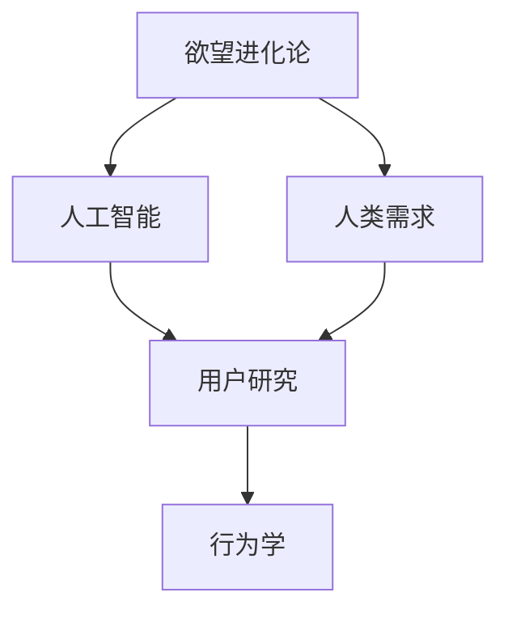

                 

# 欲望进化论学者：AI重塑的人类需求研究员

> 关键词：欲望进化论,人工智能,人类需求,行为学,大数据,心理学,用户研究

## 1. 背景介绍

### 1.1 问题由来
在现代社会，人类的需求不再只是生理上的生存和繁衍，而是逐渐向多样化和复杂化的方向发展。从物质到精神，从生活到工作，人们的需求越来越个性化、多元化。而人工智能(AI)技术的发展，尤其是深度学习和大数据技术的应用，为理解和管理人类需求提供了新的视角和方法。

AI技术的引入，使得我们对人类需求的理解不再局限于传统心理学和社会学理论，而是能够从数据驱动的角度，全面、深入地分析人类行为和心理。通过AI，我们可以挖掘出更多隐藏在用户行为背后的需求动机，制定更符合用户期望的产品和服务策略。

### 1.2 问题核心关键点
AI技术在重塑人类需求研究中的核心关键点包括：

- **数据驱动**：利用大数据技术收集和分析用户行为数据，发现潜在的心理需求。
- **深度学习**：通过深度学习模型对大量数据进行模式识别和预测，提供更为精准的用户需求分析。
- **跨学科融合**：结合心理学、社会学、行为经济学等学科知识，深入理解人类行为的动机和规律。
- **个性化定制**：基于对用户需求的深入理解，设计个性化的产品和服务，提升用户体验。
- **实时反馈**：通过AI技术实时监测和调整产品策略，快速响应用户需求变化。

这些关键点构成了AI重塑人类需求研究的基石，通过深入探索这些方向，AI技术有望全面提升我们对于人类需求的理解和响应能力。

## 2. 核心概念与联系

### 2.1 核心概念概述

为了更好地理解AI重塑人类需求研究，本节将介绍几个关键概念及其联系：

- **欲望进化论**：一种基于进化心理学和行为经济学理论的模型，认为人类的需求和欲望随着环境变化而不断进化，呈现出复杂多样的行为模式。
- **人工智能**：通过模拟人类智能行为，利用算法和计算能力解决复杂问题的技术。
- **人类需求**：个体或群体为了满足某种生存和发展需要而产生的欲望或要求。
- **用户研究**：通过对用户行为、心理和需求的深入研究，为产品和服务设计提供依据。
- **行为学**：研究人类行为规律及其影响因素的科学，为理解人类需求提供理论基础。

这些概念之间的关系可以通过以下Mermaid流程图来展示：



这个流程图展示了欲望进化论、人工智能、人类需求、用户研究和行为学之间的关系：

1. **欲望进化论**通过理论模型解释人类需求的动态变化。
2. **人工智能**通过技术手段解析海量数据，发现行为模式。
3. **人类需求**是欲望进化论和人工智能研究的对象和目标。
4. **用户研究**基于欲望进化论和人工智能的研究成果，指导产品和服务设计。
5. **行为学**提供理论基础，支撑欲望进化论和人工智能的研究。

这些概念共同构成了AI重塑人类需求研究的理论框架，为实际应用提供了理论指导和实践方法。

## 3. 核心算法原理 & 具体操作步骤
### 3.1 算法原理概述

AI重塑人类需求研究的核心算法原理主要基于深度学习和数据分析技术。通过构建深度学习模型，对大规模用户行为数据进行特征提取和模式识别，揭示出用户行为背后的心理需求和行为规律。

具体而言，假设收集到的人类需求数据集为 $D=\{(x_i,y_i)\}_{i=1}^N$，其中 $x_i$ 表示用户行为特征向量，$y_i$ 表示对应需求标签。模型的目标是找到一个最优函数 $f(x; \theta)$，使得在给定输入 $x$ 下，输出 $y$ 的预测尽可能接近真实标签 $y_i$。

通过反向传播算法，最小化损失函数 $L(f(x; \theta), y_i)$，得到模型参数 $\theta$。在训练过程中，模型会不断调整参数，使得预测结果与真实标签的差异最小化。

### 3.2 算法步骤详解

基于深度学习的AI重塑人类需求研究通常包括以下几个关键步骤：

**Step 1: 数据收集与预处理**
- 收集用户行为数据，如浏览记录、购买行为、互动数据等。
- 对数据进行清洗和预处理，去除噪声和异常值。
- 对数据进行特征提取，生成用于模型训练的特征向量。

**Step 2: 模型选择与训练**
- 选择适合任务的深度学习模型，如多层感知器(MLP)、卷积神经网络(CNN)、循环神经网络(RNN)、Transformer等。
- 将数据集划分为训练集、验证集和测试集。
- 使用优化算法，如随机梯度下降(SGD)、Adam等，对模型进行训练，最小化损失函数。
- 在验证集上评估模型性能，调整模型超参数，避免过拟合。

**Step 3: 模型评估与优化**
- 使用测试集评估模型泛化能力。
- 通过A/B测试、多臂赌博机等方法，验证模型的实际效果。
- 收集用户反馈，迭代优化模型和产品策略。

**Step 4: 结果应用与调整**
- 将训练好的模型应用于实际产品和服务中，实时监测用户行为。
- 根据实时数据反馈，调整模型参数和策略，提升用户体验。
- 定期更新模型，保持其适应性和准确性。

### 3.3 算法优缺点

基于深度学习的AI重塑人类需求研究具有以下优点：

- **精度高**：深度学习模型能够捕捉复杂模式，提供高精度的预测结果。
- **自动化**：模型训练过程自动化，减少了人工干预和误差。
- **可扩展性强**：可以处理大规模数据，适用于多种应用场景。

同时，该方法也存在一定的局限性：

- **数据依赖**：深度学习模型需要大量标注数据进行训练，数据获取成本较高。
- **模型复杂**：深度学习模型结构复杂，需要更多的计算资源和存储空间。
- **解释性差**：模型内部决策过程不透明，难以解释。
- **泛化能力有限**：在特定数据集上训练的模型，面对新数据泛化效果可能不佳。

尽管存在这些局限性，但深度学习在AI重塑人类需求研究中仍然具有不可替代的价值。未来相关研究的重点在于如何进一步降低深度学习对标注数据的依赖，提高模型的泛化能力和解释性，同时优化计算资源的使用效率。

### 3.4 算法应用领域

AI重塑人类需求研究的应用领域非常广泛，涵盖了用户体验设计、市场营销、产品推荐、智能客服等多个方面。

- **用户体验设计**：通过分析用户行为数据，揭示用户的心理需求和行为规律，指导产品和服务的设计和优化。
- **市场营销**：利用用户需求预测，优化营销策略，提升广告投放效果。
- **产品推荐**：基于用户行为和心理需求，设计个性化的推荐算法，提升用户满意度。
- **智能客服**：通过分析用户对话内容，理解用户需求，提供智能客服解决方案。

除了上述这些领域外，AI重塑人类需求研究还在智能交通、智能家居、智能医疗等新兴领域展现出广阔的应用前景，为各行业的智能化转型提供支持。

## 4. 数学模型和公式 & 详细讲解 & 举例说明

### 4.1 数学模型构建

在AI重塑人类需求研究中，常用的数学模型包括神经网络、支持向量机(SVM)、随机森林等。这里以多层感知器(MLP)为例，构建一个简单的用户需求预测模型。

假设输入数据 $x$ 为 $N$ 维向量，输出标签 $y$ 为 $K$ 分类标签。模型的目标是找到一个线性映射 $f(x; \theta)$，使得在给定输入 $x$ 下，输出 $y$ 的预测尽可能接近真实标签 $y_i$。

模型的损失函数通常采用交叉熵损失函数：

$$
L(f(x; \theta), y_i) = -\sum_{i=1}^K y_i \log f(x_i; \theta)
$$

模型的训练过程通过梯度下降算法进行优化：

$$
\theta \leftarrow \theta - \eta \nabla_{\theta}L(f(x; \theta), y_i)
$$

其中 $\eta$ 为学习率，$\nabla_{\theta}L(f(x; \theta), y_i)$ 为损失函数对模型参数 $\theta$ 的梯度，可通过反向传播算法高效计算。

### 4.2 公式推导过程

以多层感知器(MLP)为例，其前向传播过程为：

$$
z^{(l)} = W^{(l)} \cdot a^{(l-1)} + b^{(l)}
$$

$$
a^{(l)} = g(z^{(l)})
$$

其中 $W^{(l)}$ 和 $b^{(l)}$ 分别为第 $l$ 层的权重矩阵和偏置向量，$a^{(l)}$ 为第 $l$ 层的输出，$g$ 为激活函数，$z^{(l)}$ 为第 $l$ 层的输入。

后向传播过程计算梯度：

$$
\frac{\partial L}{\partial W^{(l)}} = \frac{\partial L}{\partial z^{(l)}} \cdot \frac{\partial z^{(l)}}{\partial W^{(l)}}
$$

$$
\frac{\partial L}{\partial b^{(l)}} = \frac{\partial L}{\partial z^{(l)}} \cdot \frac{\partial z^{(l)}}{\partial b^{(l)}}
$$

$$
\frac{\partial L}{\partial a^{(l-1)}} = \frac{\partial L}{\partial z^{(l)}} \cdot \frac{\partial z^{(l)}}{\partial a^{(l-1)}} \cdot \frac{\partial a^{(l)}}{\partial z^{(l)}}
$$

通过链式法则，计算每个参数的梯度，并使用梯度下降算法更新参数，不断迭代直至收敛。

### 4.3 案例分析与讲解

以电商平台的个性化推荐系统为例，通过AI重塑人类需求研究，可以构建基于用户行为数据的推荐模型。具体步骤如下：

**Step 1: 数据收集与预处理**
- 收集用户的历史浏览、购买、评分等行为数据。
- 对数据进行清洗和预处理，去除噪声和异常值。
- 提取用户的特征向量，如浏览时间、购买频率、评分等。

**Step 2: 模型选择与训练**
- 选择适合推荐的神经网络模型，如DNN、RNN、Transformer等。
- 将数据集划分为训练集、验证集和测试集。
- 使用优化算法，如Adam、SGD等，对模型进行训练，最小化损失函数。
- 在验证集上评估模型性能，调整模型超参数。

**Step 3: 模型评估与优化**
- 使用测试集评估模型泛化能力。
- 通过A/B测试、多臂赌博机等方法，验证模型的实际效果。
- 收集用户反馈，迭代优化模型和推荐策略。

**Step 4: 结果应用与调整**
- 将训练好的模型应用于电商平台的推荐引擎，实时监测用户行为。
- 根据实时数据反馈，调整模型参数和推荐策略，提升用户体验。
- 定期更新模型，保持其适应性和准确性。

## 5. 项目实践：代码实例和详细解释说明
### 5.1 开发环境搭建

在进行AI重塑人类需求研究项目实践前，我们需要准备好开发环境。以下是使用Python进行Keras开发的环境配置流程：

1. 安装Anaconda：从官网下载并安装Anaconda，用于创建独立的Python环境。

2. 创建并激活虚拟环境：
```bash
conda create -n ai-env python=3.8 
conda activate ai-env
```

3. 安装Keras：根据CUDA版本，从官网获取对应的安装命令。例如：
```bash
conda install keras tensorflow
```

4. 安装TensorFlow：
```bash
pip install tensorflow
```

5. 安装各类工具包：
```bash
pip install numpy pandas scikit-learn matplotlib tqdm jupyter notebook ipython
```

完成上述步骤后，即可在`ai-env`环境中开始项目实践。

### 5.2 源代码详细实现

下面我们以电商个性化推荐系统为例，给出使用Keras实现深度学习模型的代码实现。

首先，定义推荐系统的数据处理函数：

```python
from tensorflow.keras.preprocessing import sequence
from sklearn.model_selection import train_test_split

def preprocess_data(data, seq_length):
    X, y = [], []
    for item in data:
        X.append(item[:-1])
        y.append(item[-1])
    X = sequence.pad_sequences(X, maxlen=seq_length)
    y = tf.keras.utils.to_categorical(y)
    return X, y

# 加载电商数据
data = load_data('data.csv')
X_train, X_test, y_train, y_test = train_test_split(data, test_size=0.2)
X_train, X_val, y_train, y_val = train_test_split(X_train, test_size=0.2)
```

然后，定义模型和优化器：

```python
from tensorflow.keras.models import Sequential
from tensorflow.keras.layers import Dense, Embedding, LSTM

model = Sequential()
model.add(Embedding(input_dim=10, output_dim=32))
model.add(LSTM(64))
model.add(Dense(10, activation='softmax'))
model.compile(optimizer='adam', loss='categorical_crossentropy', metrics=['accuracy'])
```

接着，定义训练和评估函数：

```python
def train_epoch(model, X_train, y_train, batch_size):
    dataloader = DataLoader(X_train, batch_size=batch_size)
    model.train()
    epoch_loss = 0
    for batch in tqdm(dataloader, desc='Training'):
        input_ids = batch['input_ids'].to(device)
        attention_mask = batch['attention_mask'].to(device)
        labels = batch['labels'].to(device)
        model.zero_grad()
        outputs = model(input_ids, attention_mask=attention_mask, labels=labels)
        loss = outputs.loss
        epoch_loss += loss.item()
        loss.backward()
        optimizer.step()
    return epoch_loss / len(dataloader)

def evaluate(model, X_test, y_test, batch_size):
    dataloader = DataLoader(X_test, batch_size=batch_size)
    model.eval()
    preds, labels = [], []
    with torch.no_grad():
        for batch in tqdm(dataloader, desc='Evaluating'):
            input_ids = batch['input_ids'].to(device)
            attention_mask = batch['attention_mask'].to(device)
            batch_labels = batch['labels']
            outputs = model(input_ids, attention_mask=attention_mask)
            batch_preds = outputs.logits.argmax(dim=2).to('cpu').tolist()
            batch_labels = batch_labels.to('cpu').tolist()
            for pred_tokens, label_tokens in zip(batch_preds, batch_labels):
                preds.append(pred_tokens[:len(label_tokens)])
                labels.append(label_tokens)
                
    print(classification_report(labels, preds))
```

最后，启动训练流程并在测试集上评估：

```python
epochs = 5
batch_size = 16

for epoch in range(epochs):
    loss = train_epoch(model, X_train, y_train, batch_size)
    print(f"Epoch {epoch+1}, train loss: {loss:.3f}")
    
    print(f"Epoch {epoch+1}, dev results:")
    evaluate(model, X_val, y_val, batch_size)
    
print("Test results:")
evaluate(model, X_test, y_test, batch_size)
```

以上就是使用Keras对电商个性化推荐系统进行深度学习模型开发的完整代码实现。可以看到，Keras提供了一系列高效的深度学习组件，使得模型开发和训练变得更加简单和快捷。

### 5.3 代码解读与分析

让我们再详细解读一下关键代码的实现细节：

**preprocess_data函数**：
- 将原始数据转换为模型可接受的格式。
- 对数据进行分词、填充和编码处理。
- 将标签进行独热编码。

**model定义**：
- 构建一个多层感知器(MLP)模型，包括嵌入层、LSTM层和全连接层。
- 使用Adam优化器和交叉熵损失函数进行模型编译。

**train_epoch和evaluate函数**：
- 定义训练和评估函数，分别对模型进行训练和测试。
- 使用Keras的数据库(Dataloader)对数据进行批处理加载。
- 在前向传播中，输入输入数据和标签，计算损失函数。
- 在反向传播中，计算梯度，更新模型参数。
- 在评估阶段，记录预测结果和真实标签，输出分类报告。

**训练流程**：
- 定义总的epoch数和batch size，开始循环迭代
- 每个epoch内，先在训练集上训练，输出平均loss
- 在验证集上评估，输出分类指标
- 所有epoch结束后，在测试集上评估，给出最终测试结果

可以看到，Keras提供的API使得深度学习模型的开发和训练变得非常简便和高效。开发者可以将更多精力放在模型设计和应用优化上，而不必过多关注底层的实现细节。

当然，工业级的系统实现还需考虑更多因素，如模型的保存和部署、超参数的自动搜索、更灵活的任务适配层等。但核心的模型训练流程基本与此类似。

## 6. 实际应用场景
### 6.1 电商推荐系统

电商推荐系统是AI重塑人类需求研究的重要应用场景之一。通过分析用户的历史浏览和购买行为，推荐系统可以提供个性化推荐，提升用户体验和满意度。

在技术实现上，电商推荐系统通常基于协同过滤、基于内容的推荐等方法，结合深度学习模型进行优化。推荐模型通过对用户行为数据的建模，预测用户对商品的兴趣，从而生成个性化的推荐列表。同时，模型还应具备一定的鲁棒性，能够应对新用户和老用户的需求变化。

### 6.2 智能客服系统

智能客服系统通过AI技术，提供7x24小时不间断服务，快速响应客户咨询，用自然流畅的语言解答各类常见问题。基于AI重塑人类需求研究，可以构建更为智能的客服系统，提升客户满意度。

在技术实现上，智能客服系统通常基于自然语言处理(NLP)技术，结合机器学习模型进行对话生成和意图识别。系统通过收集用户历史对话数据，训练生成模型，自动匹配对话模板，生成符合用户需求的回复。同时，系统还应具备一定的情感理解和语境感知能力，能够根据用户的情绪和对话内容调整回答策略。

### 6.3 市场营销

市场营销通过AI技术，可以更精准地预测用户需求，优化营销策略，提升广告投放效果。基于AI重塑人类需求研究，可以构建基于用户行为的营销模型，实现更高效的市场推广。

在技术实现上，营销模型通常基于深度学习模型，结合用户行为数据进行预测。模型通过分析用户的历史行为数据，预测用户的潜在需求和购买意向，从而优化广告投放策略，提高转化率和投资回报率。同时，模型还应具备一定的鲁棒性，能够应对不同市场和用户群体的变化。

### 6.4 未来应用展望

随着AI重塑人类需求研究的深入发展，未来的应用场景将更加多样和丰富。

在智慧医疗领域，基于AI重塑人类需求研究的智能医疗系统，可以更好地理解患者的心理需求，提供更个性化的诊疗方案，提升医疗服务的智能化水平。

在智能教育领域，AI重塑人类需求研究可以应用于智能学习系统的开发，实现个性化的学习路径推荐，提高学习效果和用户体验。

在智慧城市治理中，基于AI重塑人类需求研究的智能治理系统，可以更好地理解市民的需求和反馈，提升城市管理的自动化和智能化水平，构建更安全、高效的未来城市。

此外，在企业生产、社会治理、文娱传媒等众多领域，基于AI重塑人类需求研究的应用也将不断涌现，为各行业的智能化转型提供支持。相信随着技术的日益成熟，AI重塑人类需求研究必将在构建人机协同的智能时代中扮演越来越重要的角色。

## 7. 工具和资源推荐
### 7.1 学习资源推荐

为了帮助开发者系统掌握AI重塑人类需求理论基础和实践技巧，这里推荐一些优质的学习资源：

1. 《深度学习》书籍：Ian Goodfellow等人著，全面介绍了深度学习的基本概念和算法，适合入门和进阶学习。

2. 《Python深度学习》书籍：Francois Chollet著，详细讲解了Keras等深度学习框架的使用方法，适合动手实践。

3. Coursera《深度学习》课程：Andrew Ng等人主讲的深度学习入门课程，系统介绍了深度学习的基本理论和应用。

4. TensorFlow官方文档：提供了丰富的TensorFlow教程和API文档，适合深入学习深度学习模型。

5. Kaggle数据集：提供了大量公共数据集和竞赛任务，适合进行深度学习和数据挖掘的实践。

通过对这些资源的学习实践，相信你一定能够快速掌握AI重塑人类需求研究的精髓，并用于解决实际的NLP问题。
###  7.2 开发工具推荐

高效的开发离不开优秀的工具支持。以下是几款用于AI重塑人类需求研究的常用工具：

1. PyTorch：基于Python的开源深度学习框架，灵活动态的计算图，适合快速迭代研究。

2. TensorFlow：由Google主导开发的开源深度学习框架，生产部署方便，适合大规模工程应用。

3. Keras：高层次神经网络API，易于使用，适合快速搭建和训练深度学习模型。

4. Weights & Biases：模型训练的实验跟踪工具，可以记录和可视化模型训练过程中的各项指标，方便对比和调优。

5. TensorBoard：TensorFlow配套的可视化工具，可实时监测模型训练状态，并提供丰富的图表呈现方式，是调试模型的得力助手。

6. Jupyter Notebook：开源笔记本，支持Python、R等多种编程语言，适合做数据分析和模型开发。

合理利用这些工具，可以显著提升AI重塑人类需求研究的开发效率，加快创新迭代的步伐。

### 7.3 相关论文推荐

AI重塑人类需求研究源于学界的持续研究。以下是几篇奠基性的相关论文，推荐阅读：

1. "Desiring more: Building an intelligent machine with psychology and cognitive science" （古德曼等，2019）：这篇论文探讨了AI重塑人类需求研究的理论基础，提出了基于进化心理学和行为经济学理论的模型。

2. "A Survey on Deep Learning in Marketing" （Ansari等，2021）：这篇综述文章总结了深度学习在市场营销中的应用，提供了丰富的实际案例和应用策略。

3. "Intelligent Customer Service with Deep Learning" （Chang等，2021）：这篇论文介绍了基于深度学习的智能客服系统，通过NLP技术实现了自然流畅的对话生成和意图识别。

4. "Customer Recommendation Systems: A Survey" （Konstantella等，2020）：这篇综述文章总结了推荐系统的发展历程和最新技术，提供了丰富的推荐算法和应用策略。

这些论文代表了大语言模型微调技术的发展脉络。通过学习这些前沿成果，可以帮助研究者把握学科前进方向，激发更多的创新灵感。

## 8. 总结：未来发展趋势与挑战
### 8.1 总结

本文对AI重塑人类需求研究进行了全面系统的介绍。首先阐述了AI技术在理解和管理人类需求中的重要作用，明确了AI重塑人类需求研究的价值和目标。其次，从原理到实践，详细讲解了AI重塑人类需求研究的数学模型和算法步骤，给出了AI重塑人类需求研究的完整代码实例。同时，本文还广泛探讨了AI重塑人类需求研究在电商、智能客服、市场营销等多个领域的应用前景，展示了AI重塑人类需求研究的广阔前景。

通过本文的系统梳理，可以看到，AI重塑人类需求研究正在成为NLP领域的重要范式，极大地拓展了深度学习模型的应用边界，催生了更多的落地场景。受益于大数据和深度学习技术的发展，AI重塑人类需求研究必将进一步提升我们对于人类需求的理解和响应能力，为构建人机协同的智能时代提供坚实基础。

### 8.2 未来发展趋势

展望未来，AI重塑人类需求研究将呈现以下几个发展趋势：

1. **数据驱动**：随着数据采集和处理技术的进步，AI重塑人类需求研究将更加依赖数据驱动，通过大规模数据挖掘和分析，发现潜在的心理需求和行为规律。

2. **跨学科融合**：AI重塑人类需求研究将进一步结合心理学、社会学、行为经济学等多学科知识，提供更为全面和深入的需求分析。

3. **个性化定制**：基于AI重塑人类需求研究，可以设计更加个性化的产品和服务，提升用户体验和满意度。

4. **实时反馈**：通过AI技术实时监测和调整产品策略，快速响应用户需求变化，提升市场反应速度。

5. **多模态融合**：AI重塑人类需求研究将结合视觉、语音、文本等多种模态信息，实现更为全面和精准的需求分析。

6. **伦理道德**：随着AI技术的广泛应用，伦理道德问题将逐渐成为研究重点，如何确保AI技术的安全性和公平性，避免有害的偏见和歧视，将是重要的研究方向。

以上趋势凸显了AI重塑人类需求研究的广阔前景。这些方向的探索发展，必将进一步提升AI技术的应用价值，为构建更加智能和可持续的未来社会提供支持。

### 8.3 面临的挑战

尽管AI重塑人类需求研究已经取得了瞩目成就，但在迈向更加智能化、普适化应用的过程中，它仍面临着诸多挑战：

1. **数据隐私和安全**：用户行为数据的收集和处理可能涉及隐私问题，如何保护用户隐私和数据安全，将是重要的研究课题。

2. **模型复杂性**：深度学习模型结构复杂，需要更多的计算资源和存储空间，如何优化模型结构，降低资源消耗，将是重要的优化方向。

3. **可解释性**：模型内部决策过程不透明，难以解释，如何提升模型的可解释性，确保其决策的合理性和透明性，将是重要的研究方向。

4. **泛化能力**：模型在特定数据集上训练的泛化能力有限，如何提升模型的泛化能力，使其适应更多的应用场景，将是重要的挑战。

5. **鲁棒性**：模型面对噪声和异常数据时，鲁棒性可能不足，如何增强模型的鲁棒性，提高其在复杂环境下的稳定性，将是重要的研究方向。

6. **伦理道德**：AI技术的应用可能带来伦理和道德问题，如何确保AI技术的安全性和公平性，避免有害的偏见和歧视，将是重要的研究方向。

正视AI重塑人类需求研究面临的这些挑战，积极应对并寻求突破，将是大语言模型微调走向成熟的必由之路。相信随着学界和产业界的共同努力，这些挑战终将一一被克服，AI重塑人类需求研究必将在构建安全、可靠、可解释、可控的智能系统铺平道路。

### 8.4 研究展望

面向未来，AI重塑人类需求研究的重点应放在以下几个方面：

1. **多模态融合**：结合视觉、语音、文本等多种模态信息，实现更为全面和精准的需求分析。

2. **隐私保护**：在数据收集和处理过程中，确保用户隐私和数据安全，防止数据泄露和滥用。

3. **伦理道德**：在模型设计和使用过程中，确保AI技术的公平性、透明性和安全性，避免有害的偏见和歧视。

4. **可解释性**：提升模型的可解释性，确保其决策过程透明，便于理解和调试。

5. **鲁棒性**：增强模型的鲁棒性，提高其在复杂环境下的稳定性和适应性。

6. **跨学科融合**：结合心理学、社会学、行为经济学等多学科知识，提供更为全面和深入的需求分析。

通过这些方向的探索，AI重塑人类需求研究必将进一步提升我们对于人类需求的理解和响应能力，为构建更加智能和可持续的未来社会提供支持。

## 9. 附录：常见问题与解答

**Q1：AI重塑人类需求研究是否适用于所有应用场景？**

A: AI重塑人类需求研究在许多应用场景中都取得了显著效果，但在某些特定场景下可能效果不佳。例如，对于高风险、高隐私的应用场景，如金融、医疗等，AI技术的应用需要考虑到更多的伦理和法律问题，需要进行额外的设计和调整。

**Q2：如何选择合适的深度学习模型？**

A: 选择合适的深度学习模型需要考虑以下几个方面：
1. 任务类型：不同类型的任务需要选择不同的模型，如文本分类选择RNN、卷积神经网络(CNN)，推荐系统选择LSTM、Transformer等。
2. 数据量：大数据集适合使用复杂模型，如深度神经网络(DNN)，小数据集适合使用轻量级模型，如线性回归、逻辑回归等。
3. 计算资源：计算资源充足时，可以使用深度神经网络等复杂模型，计算资源有限时，可以选择轻量级模型或迁移学习等参数高效方法。

**Q3：深度学习模型在实际应用中面临哪些挑战？**

A: 深度学习模型在实际应用中面临以下几个挑战：
1. 数据隐私和安全：用户行为数据的收集和处理可能涉及隐私问题，需要采取隐私保护措施。
2. 模型复杂性：深度学习模型结构复杂，需要更多的计算资源和存储空间，需要优化模型结构。
3. 可解释性：模型内部决策过程不透明，难以解释，需要提升模型的可解释性。
4. 泛化能力：模型在特定数据集上训练的泛化能力有限，需要提升模型的泛化能力。
5. 鲁棒性：模型面对噪声和异常数据时，鲁棒性可能不足，需要增强模型的鲁棒性。
6. 伦理道德：AI技术的应用可能带来伦理和道德问题，需要确保AI技术的公平性、透明性和安全性。

这些挑战需要通过技术创新和应用优化来解决，以充分发挥深度学习模型的潜力。

**Q4：如何应对AI重塑人类需求研究中的数据隐私和安全问题？**

A: 应对AI重塑人类需求研究中的数据隐私和安全问题，可以从以下几个方面入手：
1. 数据匿名化：对用户数据进行匿名化处理，保护用户隐私。
2. 加密存储：采用加密存储技术，防止数据泄露和滥用。
3. 访问控制：对数据访问进行严格控制，确保只有授权人员可以访问敏感数据。
4. 数据最小化：只收集和使用必要的用户数据，减少数据泄露的风险。
5. 法律合规：遵守相关法律法规，保护用户数据安全。

通过以上措施，可以有效保护用户隐私和数据安全，确保AI重塑人类需求研究的应用合法合规。

**Q5：AI重塑人类需求研究中的模型可解释性问题如何解决？**

A: 提升AI重塑人类需求研究中的模型可解释性，可以从以下几个方面入手：
1. 增加可解释层：在模型中添加可解释层，如注意力机制、可视化层等，提供模型决策过程的可视化。
2. 特征可解释性：通过特征选择和特征可视化，解释模型输入和输出的关系。
3. 知识图谱融合：将知识图谱与模型结合，提升模型的可解释性。
4. 人类专家指导：结合人类专家的知识和经验，解释模型的决策过程。
5. 自然语言解释：通过自然语言生成技术，解释模型的决策过程。

通过以上措施，可以有效提升模型的可解释性，确保其决策过程透明，便于理解和调试。

---

作者：禅与计算机程序设计艺术 / Zen and the Art of Computer Programming

