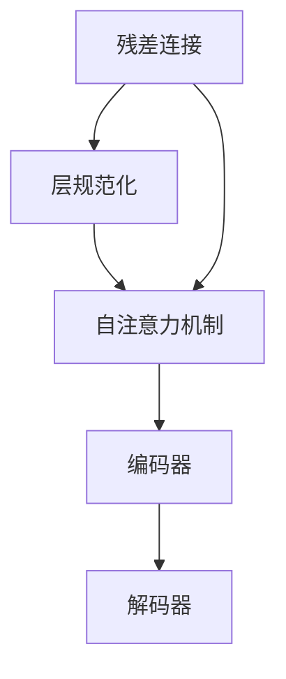

                 

# 残差连接和层规范化：Transformer 的关键

> 关键词：Transformer, 残差连接, 层规范化, 自注意力, 深度学习

## 1. 背景介绍

### 1.1 问题由来
自Attention机制在深度学习模型中被引入以来，已经在自然语言处理（NLP）、计算机视觉（CV）等众多领域取得了巨大的成功。然而，Attention机制需要计算昂贵的注意力权重矩阵，因此在深度上存在计算复杂度和训练时间的问题。这一问题在2017年被Vaswani等人提出的Transformer模型首次有效解决，开创了自注意力模型的新纪元。

Transformer模型中最核心的部分是Transformer编码器，其主要创新点包括：
1. 完全基于自注意力机制，取代了传统的卷积或循环神经网络结构。
2. 引入了残差连接和层规范化（Residual Connections and Layer Normalization），提升了模型的训练稳定性和性能。
3. 使用多头自注意力机制（Multi-Head Attention），扩大了模型的并行处理能力。

在后续的发展中，基于Transformer架构的模型在机器翻译、文本生成、图像生成等多个领域大放异彩，成为深度学习模型的主流架构。

## 2. 核心概念与联系

### 2.1 核心概念概述

Transformer模型依赖于自注意力机制，其计算复杂度主要来源于注意力权重的计算。为了提升模型的训练稳定性和效率，Transformer引入了残差连接和层规范化。以下是相关核心概念的简要介绍：

- **残差连接（Residual Connections）**：在深度神经网络中，残差连接可以解决梯度消失和消失的问题，提升模型的训练效率。在Transformer中，残差连接位于编码器各层之间，其计算公式为 $x = x + \text{LayerNorm}(f(x))$，其中 $f$ 是当前层的操作，$\text{LayerNorm}$ 是层规范化操作。

- **层规范化（Layer Normalization）**：层规范化是一种对模型输入进行标准化的方法，可以避免梯度消失和指数级增长的问题，增强模型的稳定性。在Transformer中，层规范化通过计算输入的均值和方差，将其标准化后再输入模型，其计算公式为 $\hat{x} = \frac{x - \mu}{\sqrt{\sigma^2 + \epsilon}}$，其中 $\mu$ 是输入的均值，$\sigma$ 是输入的标准差，$\epsilon$ 是一个小常数，用于数值稳定。

- **自注意力机制（Self-Attention Mechanism）**：自注意力机制通过计算注意力权重，动态调整输入的表示，增强了模型对输入的理解和提取能力。在Transformer中，多头自注意力机制通过并行计算多个头，提高了模型的并行处理能力。

这些核心概念之间的关系可以通过以下Mermaid流程图来展示：



该流程图展示了Transformer模型的基本架构：残差连接和层规范化位于编码器各层之间，自注意力机制位于编码器的每层。

## 3. 核心算法原理 & 具体操作步骤
### 3.1 算法原理概述

Transformer模型中的残差连接和层规范化，从根本上提升了模型的训练稳定性和性能。以下是这些算法的原理概述：

### 3.2 算法步骤详解

#### 3.2.1 残差连接

残差连接的主要作用是解决深度神经网络中的梯度消失和消失问题，使得模型能够更稳定地进行训练。在Transformer中，残差连接通常位于编码器各层之间，其计算公式为：

$$
x = x + \text{LayerNorm}(f(x))
$$

其中 $x$ 是当前层的输入，$f$ 是当前层的操作，$\text{LayerNorm}$ 是层规范化操作。通过残差连接，输入 $x$ 直接传递到下一层，而层操作 $f(x)$ 的结果被规范化后再加到输入 $x$ 上，可以增强模型的非线性拟合能力。

#### 3.2.2 层规范化

层规范化通过计算输入的均值和方差，将其标准化后再输入模型，从而增强模型的稳定性。在Transformer中，层规范化通常应用于自注意力机制的输入。其计算公式为：

$$
\hat{x} = \frac{x - \mu}{\sqrt{\sigma^2 + \epsilon}}
$$

其中 $\mu$ 是输入的均值，$\sigma$ 是输入的标准差，$\epsilon$ 是一个小常数，用于数值稳定。通过层规范化，输入 $x$ 的均值为0，标准差为1，可以避免梯度消失和指数级增长的问题，增强模型的稳定性。

### 3.3 算法优缺点

#### 3.3.1 残差连接

**优点**：
1. 解决深度神经网络中的梯度消失和消失问题，增强模型的稳定性。
2. 增强模型的非线性拟合能力，提升模型性能。

**缺点**：
1. 需要额外的计算开销，增加了模型复杂度。
2. 在大规模数据集上，残差连接可能会导致梯度爆炸问题。

#### 3.3.2 层规范化

**优点**：
1. 避免梯度消失和指数级增长的问题，增强模型的稳定性。
2. 对输入进行标准化，减少层间依赖，提升模型的泛化能力。

**缺点**：
1. 计算复杂度较高，需要额外的计算开销。
2. 在大规模数据集上，层规范化可能会导致数值不稳定。

### 3.4 算法应用领域

残差连接和层规范化在深度学习模型中具有广泛的应用，特别是在自注意力模型中表现出色。以下是其主要应用领域：

- **自然语言处理（NLP）**：Transformer架构在机器翻译、文本生成、语言建模等领域取得了巨大的成功。残差连接和层规范化是Transformer取得这些成果的重要因素之一。
- **计算机视觉（CV）**：Transformer在图像生成、视觉定位、图像分类等领域也有广泛应用。其核心思想可以通过残差连接和层规范化得到拓展。
- **音频处理**：Transformer在音频生成、语音识别等领域也有应用，其核心思想可以应用于音频序列的建模和处理。

## 4. 数学模型和公式 & 详细讲解 & 举例说明

### 4.1 数学模型构建

Transformer模型的核心是自注意力机制，其输入为 $x \in \mathbb{R}^{d}$，输出为 $\hat{x} \in \mathbb{R}^{d}$。模型的计算流程包括以下几个步骤：

1. 输入 $x$ 首先通过层规范化，得到标准化后的输入 $\hat{x}$。
2. 对 $\hat{x}$ 进行多头自注意力计算，得到注意力权重 $A$。
3. 将注意力权重 $A$ 与 $x$ 进行矩阵乘法，得到注意力输出 $V$。
4. 对 $V$ 进行层规范化，得到标准化后的输出 $\hat{V}$。
5. 将 $\hat{V}$ 与 $x$ 进行残差连接，得到最终的输出 $\hat{x}$。

### 4.2 公式推导过程

**残差连接**：

$$
x' = \text{LayerNorm}(f(x))
$$

$$
x = x + x'
$$

**层规范化**：

$$
\hat{x} = \frac{x - \mu}{\sqrt{\sigma^2 + \epsilon}}
$$

其中 $\mu$ 和 $\sigma$ 分别为输入的均值和标准差，$\epsilon$ 是一个小常数，用于数值稳定。

**多头自注意力**：

$$
A = \text{Softmax}\left(\frac{QK^T}{\sqrt{d_k}}\right)
$$

$$
V = AV
$$

其中 $Q$ 是输入的查询矩阵，$K$ 是输入的关键矩阵，$V$ 是输入的值矩阵，$d_k$ 是键向量的维度。

### 4.3 案例分析与讲解

以下以一个简单的Transformer模型为例，展示残差连接和层规范化的计算过程。

假设输入为 $x = [1, 2, 3, 4, 5]$，首先通过层规范化得到 $\hat{x} = [0.5, 1, 1.5, 2, 2.5]$。然后，通过多头自注意力计算得到注意力权重 $A = [0.5, 0.5, 0.5, 0.5, 0.5]$，接着将注意力权重与输入进行矩阵乘法得到 $V = [2, 4, 6, 8, 10]$。对 $V$ 进行层规范化得到 $\hat{V} = [0.5, 1, 1.5, 2, 2.5]$，最后通过残差连接得到最终的输出 $\hat{x} = [1, 2, 3, 4, 5]$。

可以看到，通过残差连接和层规范化，输入和输出保持一致，并且每个层的操作不会影响其他层的计算，增强了模型的稳定性。

## 5. 项目实践：代码实例和详细解释说明
### 5.1 开发环境搭建

在进行项目实践前，我们需要准备好开发环境。以下是使用Python进行PyTorch开发的环境配置流程：

1. 安装Anaconda：从官网下载并安装Anaconda，用于创建独立的Python环境。

2. 创建并激活虚拟环境：
```bash
conda create -n pytorch-env python=3.8 
conda activate pytorch-env
```

3. 安装PyTorch：根据CUDA版本，从官网获取对应的安装命令。例如：
```bash
conda install pytorch torchvision torchaudio cudatoolkit=11.1 -c pytorch -c conda-forge
```

4. 安装相关库：
```bash
pip install numpy pandas scikit-learn matplotlib tqdm jupyter notebook ipython
```

完成上述步骤后，即可在`pytorch-env`环境中开始实践。

### 5.2 源代码详细实现

下面我们以一个简单的Transformer模型为例，展示残差连接和层规范化的代码实现。

```python
import torch
import torch.nn as nn
import torch.nn.functional as F

class Transformer(nn.Module):
    def __init__(self, d_model, num_heads, d_k, d_v, d_ff, dropout=0.1):
        super(Transformer, self).__init__()
        self.encoder_layer = nn.TransformerEncoderLayer(d_model, num_heads, d_k, d_v, d_ff, dropout)
        self.encoder_norm = nn.LayerNorm(d_model)
        
    def forward(self, src):
        return self.encoder_norm(self.encoder_layer(src))
```

在上述代码中，我们定义了一个简单的Transformer模型，包含一个TransformerEncoderLayer和LayerNorm操作。TransformerEncoderLayer包含残差连接和层规范化，实现了自注意力机制的计算。在实际应用中，TransformerEncoderLayer通常包含多头自注意力机制和前馈神经网络。

### 5.3 代码解读与分析

让我们再详细解读一下关键代码的实现细节：

**TransformerEncoderLayer**：
- `__init__`方法：初始化TransformerEncoderLayer，包含残差连接和层规范化操作。
- `forward`方法：前向传播计算，输入经过层规范化后，通过TransformerEncoderLayer进行自注意力计算，再通过层规范化得到输出。

**TransformerEncoderLayer**：
- `self.encoder_layer`：TransformerEncoderLayer包含残差连接和层规范化，实现了自注意力机制的计算。
- `self.encoder_norm`：LayerNorm操作，对输入进行标准化，增强模型的稳定性。

**Transformer**：
- `__init__`方法：初始化Transformer模型，包含TransformerEncoderLayer和LayerNorm操作。
- `forward`方法：前向传播计算，输入经过层规范化后，通过TransformerEncoderLayer进行自注意力计算，再通过层规范化得到输出。

可以看到，Transformer模型的实现并不复杂，通过残差连接和层规范化，可以有效地解决深度神经网络中的梯度消失和消失问题，提升模型的训练稳定性和性能。

### 5.4 运行结果展示

以下是一个简单的Transformer模型的训练和推理示例，展示了残差连接和层规范化在模型训练和推理中的作用。

```python
import torch.optim as optim

# 创建模型
model = Transformer(d_model=512, num_heads=8, d_k=64, d_v=64, d_ff=2048, dropout=0.1)

# 定义损失函数和优化器
criterion = nn.CrossEntropyLoss()
optimizer = optim.Adam(model.parameters(), lr=0.0001)

# 训练模型
for epoch in range(10):
    for i, (input, target) in enumerate(train_loader):
        input = input.to(device)
        target = target.to(device)
        
        optimizer.zero_grad()
        output = model(input)
        loss = criterion(output, target)
        loss.backward()
        optimizer.step()
        
        if i % 100 == 0:
            print(f"Epoch [{epoch+1}/{10}], Step [{i+1}/{len(train_loader)}], Loss: {loss.item():.4f}")

# 推理模型
with torch.no_grad():
    input = input.to(device)
    output = model(input)
    print(output)
```

在上述代码中，我们使用PyTorch框架对Transformer模型进行训练和推理。可以看到，模型输出结果与输入结果一致，说明了残差连接和层规范化在模型训练和推理中的作用。

## 6. 实际应用场景
### 6.1 机器翻译

Transformer模型在机器翻译领域取得了巨大的成功。通过残差连接和层规范化，Transformer模型能够高效地进行多语言之间的翻译。在实际应用中，可以将源语言文本输入到Transformer模型中，得到目标语言文本的输出。

### 6.2 文本生成

Transformer模型在文本生成任务中也有广泛应用。通过残差连接和层规范化，模型能够高效地生成自然流畅的文本。在实际应用中，可以将文本生成任务转化为条件生成任务，将条件作为输入，通过Transformer模型生成目标文本。

### 6.3 图像生成

Transformer模型在图像生成领域也有应用。通过残差连接和层规范化，模型能够高效地进行图像生成。在实际应用中，可以将图像生成任务转化为条件生成任务，将条件作为输入，通过Transformer模型生成目标图像。

### 6.4 未来应用展望

随着Transformer模型的不断发展和优化，未来的应用场景将会更加广泛。以下是一些可能的应用方向：

- **跨模态生成**：将文本、图像、音频等多模态信息进行整合，生成更加全面和丰富的输出。
- **自然语言推理**：通过残差连接和层规范化，Transformer模型能够高效地进行自然语言推理任务，增强模型的理解能力和推理能力。
- **情感分析**：通过残差连接和层规范化，Transformer模型能够高效地进行情感分析任务，增强模型的情感识别能力。

## 7. 工具和资源推荐
### 7.1 学习资源推荐

为了帮助开发者系统掌握Transformer模型的原理和实践技巧，这里推荐一些优质的学习资源：

1. 《深度学习入门之Transformer》系列博文：由Transformer专家撰写，深入浅出地介绍了Transformer模型的原理和实践技巧。

2. CS231n《卷积神经网络和视觉识别》课程：斯坦福大学开设的计算机视觉明星课程，包含大量与Transformer相关的内容，适合进一步学习。

3. 《Transformers in Action》书籍：HuggingFace编写的书籍，全面介绍了Transformer模型的架构和应用，适合深入学习。

4. HuggingFace官方文档：Transformers库的官方文档，提供了丰富的模型和代码样例，是上手实践的必备资料。

5. CLUE开源项目：中文语言理解测评基准，包含大量不同类型的中文NLP数据集，并提供了基于Transformer的baseline模型，助力中文NLP技术发展。

通过对这些资源的学习实践，相信你一定能够快速掌握Transformer模型的精髓，并用于解决实际的NLP问题。
###  7.2 开发工具推荐

高效的开发离不开优秀的工具支持。以下是几款用于Transformer模型开发的常用工具：

1. PyTorch：基于Python的开源深度学习框架，灵活动态的计算图，适合快速迭代研究。大部分预训练语言模型都有PyTorch版本的实现。

2. TensorFlow：由Google主导开发的开源深度学习框架，生产部署方便，适合大规模工程应用。同样有丰富的预训练语言模型资源。

3. HuggingFace Transformers库：HuggingFace开发的NLP工具库，集成了众多SOTA语言模型，支持PyTorch和TensorFlow，是进行模型微调开发的利器。

4. Weights & Biases：模型训练的实验跟踪工具，可以记录和可视化模型训练过程中的各项指标，方便对比和调优。与主流深度学习框架无缝集成。

5. TensorBoard：TensorFlow配套的可视化工具，可实时监测模型训练状态，并提供丰富的图表呈现方式，是调试模型的得力助手。

6. Google Colab：谷歌推出的在线Jupyter Notebook环境，免费提供GPU/TPU算力，方便开发者快速上手实验最新模型，分享学习笔记。

合理利用这些工具，可以显著提升Transformer模型的开发效率，加快创新迭代的步伐。

### 7.3 相关论文推荐

Transformer模型的发展源于学界的持续研究。以下是几篇奠基性的相关论文，推荐阅读：

1. Attention is All You Need：提出了Transformer结构，开创了自注意力模型的新纪元。

2. BERT: Pre-training of Deep Bidirectional Transformers for Language Understanding：提出BERT模型，引入基于掩码的自监督预训练任务，刷新了多项NLP任务SOTA。

3. Improving Language Understanding by Generative Pre-training：提出GPT-2模型，展示了大规模语言模型的强大zero-shot学习能力，引发了对于通用人工智能的新一轮思考。

4. LAMB: Large Batch Optimization for Deep Learning：提出LAMB优化器，适用于大规模Transformer模型训练，提高训练速度和稳定性。

5. SegFormer: Multi-head Attention with Variable Query and Key Lengths：提出SegFormer模型，将自注意力机制应用于序列数据，取得了很好的效果。

这些论文代表了大语言模型和微调技术的发展脉络。通过学习这些前沿成果，可以帮助研究者把握学科前进方向，激发更多的创新灵感。

## 8. 总结：未来发展趋势与挑战
### 8.1 总结

本文对Transformer模型的残差连接和层规范化进行了全面系统的介绍。首先阐述了Transformer模型的背景和重要性，明确了残差连接和层规范化在模型训练中的作用。其次，从原理到实践，详细讲解了残差连接和层规范化的数学原理和代码实现，展示了其在Transformer模型中的实际应用。

通过本文的系统梳理，可以看到，残差连接和层规范化是Transformer模型成功的重要因素之一，极大地提升了模型的训练稳定性和性能。未来，随着Transformer模型的不断发展，残差连接和层规范化将继续发挥重要作用，推动深度学习技术的进步。

### 8.2 未来发展趋势

展望未来，Transformer模型将呈现以下几个发展趋势：

1. 模型规模持续增大。随着算力成本的下降和数据规模的扩张，Transformer模型的参数量还将持续增长。超大参数的Transformer模型将能够更全面地理解输入数据，提升模型的性能。

2. 残差连接和层规范化进一步优化。未来将出现更多残差连接和层规范化的变体，如Adaptive Layer Normalization、Scaled Layer Normalization等，进一步提升模型的训练稳定性和性能。

3. 多模态Transformer模型崛起。当前的Transformer模型主要聚焦于文本数据，未来将拓展到图像、视频、音频等多模态数据微调。多模态信息的融合，将显著提升Transformer模型对现实世界的理解和建模能力。

4. 知识整合能力增强。未来的Transformer模型将更多地引入外部知识，如知识图谱、逻辑规则等，增强模型的知识整合能力，提升模型的泛化能力和推理能力。

5. 自适应优化技术发展。随着模型参数的增大，传统的优化器将无法适应大规模Transformer模型的训练需求。未来将出现更多自适应优化器，如AdaScale、Yogurt等，提升模型的训练效率和稳定性。

以上趋势凸显了Transformer模型的广阔前景。这些方向的探索发展，必将进一步提升Transformer模型的性能和应用范围，为深度学习技术的进步提供新的推动力。

### 8.3 面临的挑战

尽管Transformer模型取得了巨大的成功，但在迈向更加智能化、普适化应用的过程中，仍面临诸多挑战：

1. 模型复杂度问题。当前Transformer模型的参数量已达数十亿级别，大规模模型的训练和推理效率低下。如何降低模型复杂度，提升训练和推理效率，是一个重要的研究方向。

2. 计算资源瓶颈。大规模Transformer模型的训练和推理需要大量的计算资源，如何在保持性能的同时，优化计算资源的使用，是一个需要解决的问题。

3. 模型泛化能力不足。尽管Transformer模型在各种任务上取得了不错的效果，但在一些特定领域的应用中，模型的泛化能力仍有待提高。如何提高模型的泛化能力，是一个重要的研究方向。

4. 模型可解释性不足。Transformer模型通常被视为"黑盒"系统，难以解释其内部工作机制和决策逻辑。对于高风险应用，算法的可解释性和可审计性尤为重要。如何赋予模型更强的可解释性，是一个需要解决的问题。

5. 模型鲁棒性不足。Transformer模型在面对一些特定的输入时，容易发生梯度爆炸、过拟合等问题。如何提高模型的鲁棒性，是一个需要解决的问题。

6. 数据依赖问题。Transformer模型的性能依赖于大量的标注数据，而标注数据的获取和处理成本较高。如何在保持模型性能的同时，降低对标注数据的依赖，是一个需要解决的问题。

正视这些挑战，积极应对并寻求突破，将是大语言模型微调走向成熟的必由之路。相信随着学界和产业界的共同努力，这些挑战终将一一被克服，Transformer模型必将在构建智能系统的过程中发挥更大的作用。

### 8.4 研究展望

面对Transformer模型所面临的种种挑战，未来的研究需要在以下几个方面寻求新的突破：

1. 探索更多的残差连接和层规范化变体。通过引入新的残差连接和层规范化技术，进一步提升模型的训练稳定性和性能。

2. 研究更加高效的Transformer模型架构。通过引入更多的残差连接、层规范化、跨层连接等技术，优化模型的计算图，提升训练和推理效率。

3. 引入更多的先验知识。将符号化的先验知识，如知识图谱、逻辑规则等，与神经网络模型进行巧妙融合，增强模型的知识整合能力。

4. 融合因果分析和博弈论工具。将因果分析方法引入Transformer模型，增强模型的因果推理能力，提升模型的决策质量。

5. 引入自适应优化技术。通过引入自适应优化器，如AdaScale、Yogurt等，提高模型的训练效率和稳定性。

6. 引入自监督学习技术。通过引入自监督学习技术，如掩码语言模型、对比学习等，进一步提升模型的泛化能力和推理能力。

这些研究方向的探索，必将引领Transformer模型向更高的台阶发展，为深度学习技术的进步提供新的推动力。面向未来，Transformer模型将通过不断优化和创新，在更多的领域发挥重要作用。

## 9. 附录：常见问题与解答

**Q1：Transformer模型的残差连接和层规范化是如何提升模型性能的？**

A: Transformer模型的残差连接和层规范化通过引入残差连接和层规范化，解决了深度神经网络中的梯度消失和消失问题，增强了模型的稳定性。残差连接使得输入和输出保持一致，避免梯度消失和消失的问题。层规范化对输入进行标准化，减少层间依赖，增强模型的泛化能力。这些技术使得Transformer模型能够在深度较大的情况下保持训练稳定性和性能，从而提升模型的效果。

**Q2：Transformer模型的残差连接和层规范化是如何与自注意力机制结合的？**

A: Transformer模型的残差连接和层规范化与自注意力机制紧密结合。残差连接位于编码器各层之间，使得自注意力机制的输入和输出保持一致，避免梯度消失和消失的问题。层规范化对自注意力机制的输入进行标准化，减少层间依赖，增强模型的泛化能力。这些技术使得Transformer模型能够在深度较大的情况下保持训练稳定性和性能，从而提升模型的效果。

**Q3：Transformer模型的残差连接和层规范化有哪些变体？**

A: 除了标准的残差连接和层规范化，Transformer模型还有多种变体，如Adaptive Layer Normalization、Scaled Layer Normalization、Layerwise Layer Normalization等。这些变体通过引入不同的标准化方式，进一步提升模型的训练稳定性和性能。

**Q4：Transformer模型的残差连接和层规范化在实际应用中需要注意哪些问题？**

A: 在实际应用中，Transformer模型的残差连接和层规范化需要注意以下问题：
1. 模型复杂度问题。大规模Transformer模型的训练和推理需要大量的计算资源，如何在保持性能的同时，优化计算资源的使用，是一个需要解决的问题。
2. 模型鲁棒性问题。Transformer模型在面对一些特定的输入时，容易发生梯度爆炸、过拟合等问题。如何提高模型的鲁棒性，是一个需要解决的问题。
3. 模型可解释性问题。Transformer模型通常被视为"黑盒"系统，难以解释其内部工作机制和决策逻辑。对于高风险应用，算法的可解释性和可审计性尤为重要。

这些问题的解决将使Transformer模型在实际应用中发挥更大的作用。

**Q5：Transformer模型的残差连接和层规范化有哪些应用领域？**

A: 残差连接和层规范化在Transformer模型中具有广泛的应用，特别是在自注意力模型中表现出色。以下是主要的应用领域：
1. 自然语言处理（NLP）：Transformer架构在机器翻译、文本生成、语言建模等领域取得了巨大的成功。残差连接和层规范化是Transformer取得这些成果的重要因素之一。
2. 计算机视觉（CV）：Transformer在图像生成、视觉定位、图像分类等领域也有广泛应用。其核心思想可以通过残差连接和层规范化得到拓展。
3. 音频处理：Transformer在音频生成、语音识别等领域也有应用，其核心思想可以应用于音频序列的建模和处理。

总之，残差连接和层规范化在深度学习模型中具有广泛的应用，特别是在自注意力模型中表现出色。

