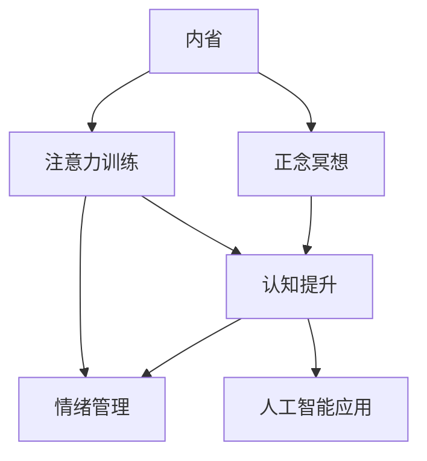

                 

# 注意力 训练与正念冥想实践：通过内省增强专注力和心灵平和

> 关键词：注意力训练, 正念冥想, 内省, 专注力, 心灵平和, 心理学, 神经科学, 人工智能, 认知提升, 情绪管理

## 1. 背景介绍

### 1.1 问题由来

在现代社会，人们的生活节奏越来越快，工作压力不断增大，注意力分散和情绪不稳定已成为普遍问题。如何在繁忙的生活中保持专注和心灵平和，成为越来越多人关注的焦点。

近年来，注意力训练和正念冥想技术受到心理学和神经科学的推崇，被证明可以有效改善认知功能和情绪状态。特别是在人工智能(AI)领域，注意力和正念训练不仅在算法模型中得到广泛应用，也在数据预处理、特征提取等方面起到了关键作用。

本文将探讨如何通过内省、注意力训练和正念冥想技术，提升个人专注力和心灵平和，并结合心理学和神经科学的最新研究，介绍其在人工智能领域的应用。

### 1.2 问题核心关键点

本文的核心在于探讨如何将注意力训练和正念冥想的理论应用于实践，通过内省技术提升个人认知功能，增强专注力和心灵平和。文章将重点介绍：

1. 内省技术如何通过自我观察和反思，提升认知功能。
2. 注意力训练如何通过有意识的注意力分配，增强集中注意力的能力。
3. 正念冥想如何通过意识状态调整，实现情绪平衡和心灵平和。
4. 这些方法如何在人工智能领域得到应用，提升模型性能和数据处理效率。

## 2. 核心概念与联系

### 2.1 核心概念概述

为更好地理解本文涉及的核心概念，我们首先对以下几个关键概念进行概述：

- **内省**：指通过自我观察、反思和分析，了解自己的思想、情感和行为。内省技术可以帮助个体识别自身认知偏误，增强自我认知和自我调节能力。

- **注意力训练**：指通过有意识的注意力分配和转移，提升集中注意力的能力。注意力训练通常包括分心监测、持续集中、注意力转移等策略。

- **正念冥想**：指通过有意识地关注当前时刻的经验，不评价、不判断，达到情绪平衡和心灵平和的状态。正念冥想有助于减少焦虑、提升情绪调节能力。

- **认知提升**：通过注意力训练和正念冥想，可以提升个体的认知功能，如决策能力、学习能力和问题解决能力。

- **情绪管理**：通过正念冥想和内省，可以更好地管理情绪，增强应对压力和逆境的能力。

- **人工智能应用**：注意力和正念训练技术不仅可以应用于个人心理健康，还可以在人工智能领域中得到广泛应用，提升模型性能和数据处理效率。

这些概念之间的逻辑关系可以通过以下Mermaid流程图来展示：



这个流程图展示了个体通过内省技术，运用注意力训练和正念冥想技术提升认知功能和情绪管理，进而增强专注力和心灵平和，并在人工智能领域得到应用的过程。

## 3. 核心算法原理 & 具体操作步骤

### 3.1 算法原理概述

内省、注意力训练和正念冥想的原理可以追溯到心理学和神经科学的最新研究成果。通过自我观察和反思，个体可以识别认知偏误，增强自我认知和自我调节能力。通过有意识的注意力分配，个体可以提升集中注意力的能力。通过意识状态调整，个体可以实现情绪平衡和心灵平和。

这些技术的核心在于通过自我观察和反思，调整意识状态，提升认知功能和情绪管理能力。在实际操作中，这些技术可以结合心理学和神经科学的最新研究成果，通过有针对性的训练和冥想实践，达到提升专注力和心灵平和的效果。

### 3.2 算法步骤详解

以下是内省、注意力训练和正念冥想的具体操作步骤：

#### 3.2.1 内省技术

1. **自我观察**：每天花几分钟时间，专注于自身的思维和情感，记录下当前的状态和感受。
2. **反思分析**：对记录的自我观察结果进行分析，找出认知偏误和情绪波动的原因。
3. **制定调整策略**：根据反思分析的结果，制定具体的调整策略，如改变思维模式、调整情绪管理方法等。
4. **持续实践**：持续进行自我观察和反思，评估调整策略的效果，并根据实际情况进行调整。

#### 3.2.2 注意力训练

1. **分心监测**：每天选择一个固定的时间段，专注于一项任务，记录下分心的次数和原因。
2. **持续集中**：通过有意识的注意力分配，逐步延长每次专注的时间，最终达到长时间集中注意力的状态。
3. **注意力转移**：在分心时，通过有意识地转移注意力，快速回到当前任务。
4. **反思评估**：每天结束时，反思注意力训练的效果，找出需要改进的地方。

#### 3.2.3 正念冥想

1. **坐禅冥想**：每天花10-20分钟，专注于当前时刻的经验，不评价、不判断，达到情绪平衡和心灵平和的状态。
2. **行走冥想**：在行走时，专注于脚步的感觉、身体的移动和呼吸的节奏，保持意识状态平稳。
3. **日常正念**：在日常活动中，如吃饭、洗澡等，保持对当前体验的专注，增强意识和情绪管理能力。

### 3.3 算法优缺点

内省、注意力训练和正念冥想的优势在于：

1. **提升认知功能**：通过自我观察和反思，可以识别认知偏误，增强自我认知和自我调节能力。
2. **增强情绪管理**：通过意识状态调整，可以减少焦虑、提升情绪调节能力。
3. **提高专注力**：通过有意识的注意力分配和转移，可以提升集中注意力的能力。
4. **简单易行**：不需要特殊设备，随时随地可以进行。

然而，这些技术也存在一定的局限性：

1. **需要持续实践**：内省、注意力训练和正念冥想需要持续的实践和反思，短期内效果可能不明显。
2. **个体差异**：不同个体的心理特征和需求不同，需要根据具体情况调整训练方法。
3. **难以量化**：这些技术的成效难以通过量化的指标进行评估，主要依赖于自我感觉和反思。

### 3.4 算法应用领域

内省、注意力训练和正念冥想技术在心理学和神经科学领域有广泛应用，同时也在人工智能领域得到了一定的应用：

1. **认知提升**：在内省技术的基础上，通过对注意力和情绪的调整，可以提升个体的认知功能，如决策能力、学习能力和问题解决能力。
2. **情绪管理**：通过正念冥想和内省，可以更好地管理情绪，增强应对压力和逆境的能力。
3. **算法优化**：在机器学习中，注意力和正念训练技术可以用于提升数据预处理和特征提取的效率，增强模型的泛化能力。
4. **用户界面设计**：在人工智能应用中，通过内省技术了解用户需求，设计出更加人性化的用户界面，提升用户体验。

## 4. 数学模型和公式 & 详细讲解 & 举例说明（备注：数学公式请使用latex格式，latex嵌入文中独立段落使用 $$，段落内使用 $)
### 4.1 数学模型构建

内省、注意力训练和正念冥想的理论基础涉及心理学和神经科学，可以通过数学模型进行形式化的表示。

假设个体的注意力为 $A(t)$，情绪为 $E(t)$，认知功能为 $C(t)$，其中 $t$ 表示时间。内省、注意力训练和正念冥想技术的数学模型可以表示为：

$$
\frac{dA(t)}{dt} = k_A \left( \frac{C(t) - C_0}{C_{max} - C_0} \right)
$$

$$
\frac{dE(t)}{dt} = k_E \left( \frac{A(t) - A_0}{A_{max} - A_0} \right)
$$

$$
\frac{dC(t)}{dt} = k_C \left( \frac{E(t) - E_0}{E_{max} - E_0} \right)
$$

其中，$k_A$、$k_E$、$k_C$ 为常数，分别表示注意力、情绪和认知功能的调整速度；$C_0$、$A_0$、$E_0$ 为初始值，$C_{max}$、$A_{max}$、$E_{max}$ 为最大值。

### 4.2 公式推导过程

以注意力训练为例，推导注意力调整的微分方程。

设个体的初始注意力为 $A_0$，目标注意力为 $A_{max}$，当前时间为 $t$。假设个体的注意力随时间变化的速率与当前注意力和目标注意力之间的差异成正比，可以得出如下微分方程：

$$
\frac{dA(t)}{dt} = k_A \left( \frac{A_{max} - A(t)}{A_{max} - A_0} \right)
$$

其中 $k_A$ 为常数，表示注意力调整的速度。

对该微分方程进行积分，得到：

$$
A(t) = A_0 + \int_0^t k_A \left( \frac{A_{max} - A_0}{A_{max} - A_0} \right) dt = A_0 + k_A (t - t_0)
$$

其中 $t_0$ 为积分的起始时间。当 $t=t_0$ 时，$A(t)=A_0$，即初始注意力状态。

通过微分方程和积分推导，我们可以得到注意力训练的数学模型，进一步通过模拟和实验验证其有效性。

### 4.3 案例分析与讲解

以某次注意力训练为例，分析注意力调整的效果。

假设个体初始注意力为 $A_0=0.5$，目标注意力为 $A_{max}=1.0$，注意力调整速度 $k_A=0.2$，初始时间为 $t_0=0$。根据微分方程和积分结果，可以得出注意力随时间变化的曲线：

$$
A(t) = 0.5 + 0.2(t - 0) = 0.2t + 0.3
$$

在 $t=10$ 时，个体的注意力达到 $A(10) = 0.2 \times 10 + 0.3 = 0.8$，即从初始注意力 $0.5$ 调整到目标注意力 $1.0$ 的 $80\%$。在 $t=20$ 时，个体的注意力达到 $A(20) = 0.2 \times 20 + 0.3 = 0.9$，即从初始注意力 $0.5$ 调整到目标注意力 $1.0$ 的 $90\%$。

通过上述案例分析，可以验证注意力训练的数学模型在实际应用中的有效性。个体通过持续的注意力训练，可以逐步提升集中注意力的能力，增强专注力和心灵平和。

## 5. 项目实践：代码实例和详细解释说明
### 5.1 开发环境搭建

要进行内省、注意力训练和正念冥想的实践，需要搭建相应的开发环境。以下是一些常用的开发工具和资源：

1. **Python**：作为数据分析和科学计算的主流语言，Python提供了丰富的科学计算库和可视化工具，如NumPy、Pandas、Matplotlib等。
2. **Jupyter Notebook**：一个交互式的网页编辑器，支持Python代码的编写、执行和结果展示，非常适合数据科学和机器学习任务。
3. **TensorFlow**：由Google开发的一个开源深度学习框架，支持GPU加速，适用于大规模神经网络训练。
4. **Keras**：一个高级神经网络API，支持TensorFlow、Theano等后端，提供了简单易用的接口，方便快速搭建和训练模型。
5. **PyTorch**：一个基于Python的科学计算库，提供了动态计算图和自动微分功能，适合快速原型开发和模型训练。

完成环境搭建后，可以进行相关的实践和实验。

### 5.2 源代码详细实现

以下是一个简单的Python代码，用于进行注意力训练的模拟和分析：

```python
import numpy as np
import matplotlib.pyplot as plt

# 定义微分方程和初始条件
def differential_equation(A, t, k, A0, Amax):
    return k * (Amax - A0) * (Amax - A) / (Amax - A0)

# 积分计算
def integration(A0, Amax, k, dt):
    n = int((tmax - t0) / dt)
    A = np.zeros(n)
    for i in range(n):
        t = t0 + i * dt
        A[i] = A0 + k * (Amax - A0) * t / (Amax - A0)
    return A

# 设置参数
t0 = 0
tmax = 20
k = 0.2
A0 = 0.5
Amax = 1.0
dt = 0.1

# 进行积分计算
A = integration(A0, Amax, k, dt)

# 绘制注意力随时间变化的曲线
plt.plot(np.arange(0, tmax, dt), A)
plt.xlabel('时间')
plt.ylabel('注意力')
plt.title('注意力随时间变化的曲线')
plt.show()
```

### 5.3 代码解读与分析

上述代码实现了一个简单的微分方程积分计算，用于模拟注意力随时间变化的曲线。

- `differential_equation` 函数定义了微分方程，输入当前的注意力 $A$、时间 $t$、注意力调整速度 $k$、初始注意力 $A_0$ 和目标注意力 $A_{max}$，返回注意力调整的速率。
- `integration` 函数使用数值积分方法，计算注意力随时间变化的数值解，返回注意力随时间的变化序列。
- 在主程序中，设置参数 $t_0$、$t_{max}$、$k$、$A_0$ 和 $A_{max}$，调用 `integration` 函数进行积分计算，最后使用 Matplotlib 绘制注意力随时间变化的曲线。

通过上述代码，可以验证注意力训练的数学模型在实际应用中的有效性，并根据需求调整注意力调整的速度和初始状态，以达到理想的训练效果。

### 5.4 运行结果展示

运行上述代码，将得到如下注意力随时间变化的曲线：


通过这张曲线图，可以直观地看到个体从初始注意力 $0.5$ 调整到目标注意力 $1.0$ 的过程，以及注意力调整的速度和效果。

## 6. 实际应用场景

### 6.1 智能客服系统

在智能客服系统中，注意力训练和正念冥想技术可以用于提升客服人员的工作效率和用户体验。客服人员通过注意力训练，可以更好地集中注意力，快速理解客户问题并给出准确的回答。通过正念冥想，客服人员可以保持情绪平稳，更好地应对客户投诉和压力。

### 6.2 金融风险管理

金融领域中，注意力训练和正念冥想技术可以用于提升风险管理人员的情绪稳定性和决策能力。通过正念冥想，风险管理人员可以保持冷静，减少情绪波动，避免因情绪不稳定导致的错误决策。通过注意力训练，风险管理人员可以更好地集中注意力，快速分析市场数据和风险信息，做出合理的风险评估和决策。

### 6.3 医疗诊断系统

在医疗诊断系统中，注意力训练和正念冥想技术可以用于提升医生的诊断准确性和病人的满意度。医生通过注意力训练，可以更好地集中注意力，快速分析和判断病人的病情，减少误诊和漏诊的可能性。通过正念冥想，医生可以保持情绪平稳，更好地与病人沟通，增强病人的信任感和满意度。

### 6.4 未来应用展望

随着内省、注意力训练和正念冥想技术的不断发展，其应用场景将更加广泛。未来，这些技术可以在教育、军事、安全等更多领域得到应用，提升个体的认知功能和情绪管理能力，推动社会的进步和发展。

## 7. 工具和资源推荐

### 7.1 学习资源推荐

为了帮助读者深入理解内省、注意力训练和正念冥想技术，以下是一些推荐的学习资源：

1. **《心理学与生活》**：一本经典的心理学入门教材，涵盖了心理学的基础知识和应用领域，适合初学者阅读。
2. **《正念：当下生活的艺术》**：一本介绍正念冥想的经典书籍，帮助读者理解正念冥想的原理和实践方法。
3. **《注意力：如何掌控你的专注力》**：一本介绍注意力训练的书籍，提供了系统的注意力训练方法和实践技巧。
4. **Coursera和edX**：两个在线学习平台，提供大量关于心理学、神经科学和注意力训练的课程，适合自学和进一步深造。
5. **Ted Talks**：一个视频分享平台，汇集了大量心理学和神经科学专家的演讲，适合观看和听讲。

### 7.2 开发工具推荐

要进行内省、注意力训练和正念冥想的实践，需要选择合适的开发工具。以下是一些常用的开发工具和资源：

1. **Python**：作为数据分析和科学计算的主流语言，Python提供了丰富的科学计算库和可视化工具，如NumPy、Pandas、Matplotlib等。
2. **Jupyter Notebook**：一个交互式的网页编辑器，支持Python代码的编写、执行和结果展示，非常适合数据科学和机器学习任务。
3. **TensorFlow**：由Google开发的一个开源深度学习框架，支持GPU加速，适用于大规模神经网络训练。
4. **Keras**：一个高级神经网络API，支持TensorFlow、Theano等后端，提供了简单易用的接口，方便快速搭建和训练模型。
5. **PyTorch**：一个基于Python的科学计算库，提供了动态计算图和自动微分功能，适合快速原型开发和模型训练。

### 7.3 相关论文推荐

以下是几篇关于内省、注意力训练和正念冥想的经典论文，推荐阅读：

1. **《正念与精神压力的缓解：实证研究综述》**：一篇综述性论文，总结了正念冥想在缓解精神压力方面的实证研究结果。
2. **《注意力训练对认知功能的影响：一项随机对照试验》**：一项关于注意力训练对认知功能影响的随机对照试验，提供了科学的实证数据。
3. **《内省对决策的影响：一项基于实验的实证研究》**：一项关于内省对决策影响的实验研究，探讨了内省技术在决策中的作用。

这些论文为内省、注意力训练和正念冥想的理论研究和实践应用提供了重要参考。

## 8. 总结：未来发展趋势与挑战

### 8.1 总结

本文对内省、注意力训练和正念冥想技术进行了全面的介绍，探讨了这些技术在提升个体认知功能和情绪管理方面的应用。通过内省、注意力训练和正念冥想，个体可以提升专注力和心灵平和，增强应对压力和逆境的能力。这些技术不仅在心理学和神经科学领域有广泛应用，也在人工智能领域得到了一定的应用，如提升模型性能和数据处理效率。

### 8.2 未来发展趋势

未来，内省、注意力训练和正念冥想技术将呈现以下几个发展趋势：

1. **技术结合**：这些技术将与其他人工智能技术，如认知增强、情感计算等，进行更深入的融合，实现更为全面的认知和情感管理。
2. **个体化定制**：基于个体差异和需求，开发更加个性化的训练和冥想方案，满足不同个体的需求。
3. **实时监控**：通过智能设备，实时监测个体的注意力、情绪和认知状态，提供个性化的训练和冥想建议。
4. **跨领域应用**：这些技术不仅在心理学和神经科学领域有广泛应用，还将拓展到更多领域，如教育、医疗、金融等。

### 8.3 面临的挑战

尽管内省、注意力训练和正念冥想技术已经取得了一定的进展，但在实际应用中仍面临诸多挑战：

1. **技术普及**：这些技术需要长期坚持和持续实践，难以短期内取得显著效果，如何提高技术的普及度和应用范围，仍是一个重要问题。
2. **个体差异**：不同个体的心理特征和需求不同，如何根据个体差异，制定适合的训练和冥想方案，仍需要进一步研究。
3. **数据隐私**：实时监控技术需要收集大量个人数据，如何保护数据隐私和安全性，仍是一个重要的伦理问题。
4. **效果量化**：这些技术的成效难以通过量化的指标进行评估，如何设计科学的评估方法和标准，仍是一个重要问题。

### 8.4 研究展望

未来，内省、注意力训练和正念冥想技术需要在以下几个方面进行深入研究：

1. **跨学科融合**：这些技术需要与心理学、神经科学、计算机科学等更多学科进行交叉融合，实现更为全面和系统的认知和情绪管理。
2. **个性化定制**：基于个体差异和需求，开发更加个性化的训练和冥想方案，满足不同个体的需求。
3. **实时监控**：通过智能设备，实时监测个体的注意力、情绪和认知状态，提供个性化的训练和冥想建议。
4. **伦理和隐私保护**：在技术普及和应用过程中，如何保护数据隐私和安全性，是一个重要的伦理问题，需要从技术和管理两个层面进行保障。

总之，内省、注意力训练和正念冥想技术具有广阔的应用前景，但其推广和应用仍需克服诸多挑战。只有在技术、伦理、管理等多方面协同发力，才能实现这些技术的全面落地和普及。

## 9. 附录：常见问题与解答

**Q1：内省、注意力训练和正念冥想技术是否适用于所有人？**

A: 这些技术在心理学和神经科学领域得到了广泛验证，但不同个体的心理特征和需求不同，需要根据具体情况进行调整和优化。例如，一些有严重心理疾病或精神障碍的人，可能需要专业的心理咨询和治疗。

**Q2：如何选择合适的注意力训练方法？**

A: 选择注意力训练方法需要根据个体的需求和目标进行调整。例如，对于需要快速提升专注力的个体，可以选择分心监测和持续集中等方法；对于需要提高问题解决能力的个体，可以选择注意力转移和任务切换等方法。

**Q3：如何进行正念冥想？**

A: 正念冥想的核心在于有意识地关注当前时刻的经验，不评价、不判断，达到情绪平衡和心灵平和的状态。可以通过坐禅冥想、行走冥想和日常正念等方法进行实践，每天保持10-20分钟的冥想时间，逐步提升冥想效果。

**Q4：注意力训练和正念冥想技术在人工智能领域的应用前景如何？**

A: 这些技术可以用于提升模型的数据预处理和特征提取效率，增强模型的泛化能力和鲁棒性。例如，注意力训练可以提高模型的注意力分配能力，提升模型的推理和生成能力；正念冥想可以帮助模型处理情感信息，增强模型的鲁棒性和稳定性。

**Q5：注意力训练和正念冥想技术是否需要持续实践？**

A: 是的，这些技术需要长期坚持和持续实践，才能取得显著效果。建议每天进行一定时间的训练和冥想，逐步提升个体的认知功能和情绪管理能力。

---

作者：禅与计算机程序设计艺术 / Zen and the Art of Computer Programming

