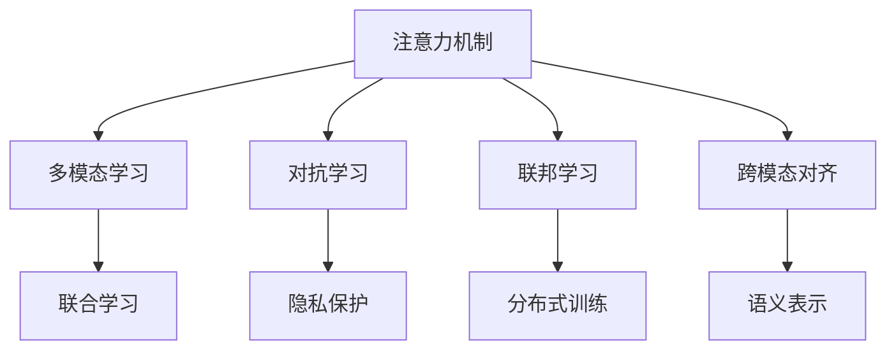

                 

## 1. 背景介绍

### 1.1 问题由来
元宇宙，这一由Metaverse一词引申而来的概念，旨在构建一个虚拟与现实高度融合的平行世界，它不仅包括虚拟现实（Virtual Reality, VR）、增强现实（Augmented Reality, AR）和混合现实（Mixed Reality, MR）技术，更是一个涵盖社交、游戏、工作等多个维度的全方位数字平台。随着技术的不断成熟和市场需求的日益增长，元宇宙已逐渐成为引领未来数字经济发展的热点话题。

在元宇宙时代，人工智能（AI）技术正发挥着核心引擎的作用，尤其在注意力机制（Attention Mechanism）的推动下，AI系统能够更好地理解、处理和生成复杂多变的数据，提供更加智能化、个性化、沉浸式的用户体验。然而，在元宇宙环境中，注意力机制同样面临着前所未有的挑战：如何高效利用计算资源，在分散和聚焦之间找到平衡，从而实现真正意义上的智能交互与感知？本文旨在深入探讨这一问题，为元宇宙时代的人工智能技术提供理论指导与实践建议。

### 1.2 问题核心关键点
本文将从以下几个关键点出发，全面分析注意力机制在元宇宙时代所面临的挑战：

- **计算资源的优化配置**：如何在保证注意力机制效果的前提下，高效利用计算资源，减少资源浪费，提高系统响应速度。
- **注意力力的控制与调节**：如何通过合理的控制与调节机制，平衡注意力力的分散与聚焦，避免过度聚焦带来的信息过载，或分散注意力带来的信息缺失。
- **多模态数据的融合与处理**：如何处理文本、图像、视频等多种模态的数据，实现跨模态的智能交互。
- **实时性需求的满足**：如何在延迟极小的前提下，提供流畅、无缝的实时用户体验。
- **隐私与安全问题**：如何在保证用户数据隐私和安全性的前提下，充分利用用户注意力。

这些问题不仅是元宇宙时代AI技术的瓶颈，也是推动其发展的动力来源。本文将从算法原理、操作步骤、应用领域等方面进行详细分析，并给出相应的解决方案，为元宇宙时代的AI技术发展提供参考。

## 2. 核心概念与联系

### 2.1 核心概念概述

为更好地理解注意力机制在元宇宙时代的应用，本节将介绍几个密切相关的核心概念：

- **注意力机制（Attention Mechanism）**：一种能够动态地集中和分散模型计算资源，选择性地提取输入数据中重要信息的机制。广泛应用于机器翻译、图像识别、自然语言处理等领域，尤其在元宇宙时代，其作用更为重要。

- **多模态学习（Multi-modal Learning）**：一种能够处理多种模态数据的机器学习方法，包括文本、图像、音频、视频等。多模态学习在元宇宙时代尤为重要，因为用户可以通过多种方式与虚拟环境互动。

- **对抗学习（Adversarial Learning）**：一种能够通过对抗样本来增强模型鲁棒性的学习方法，尤其在元宇宙时代，对抗学习可以用于保护用户数据隐私，避免恶意攻击。

- **联邦学习（Federated Learning）**：一种能够在不泄露本地数据的情况下，分布式地进行模型训练的方法。联邦学习在元宇宙时代特别适用，因为元宇宙的参与者可能分布在不同的地理位置，数据分散存储。

- **跨模态对齐（Cross-modal Alignment）**：一种能够将不同模态的数据映射到同一语义空间的方法，使得模型能够更好地处理多模态数据，实现跨模态的智能交互。

这些核心概念之间的逻辑关系可以通过以下Mermaid流程图来展示：



这个流程图展示了一系列与注意力机制相关的核心概念及其之间的关系：

1. 注意力机制是核心，通过动态分配计算资源，实现信息的选择性提取。
2. 多模态学习扩展了注意力机制的应用范围，处理多种模态数据。
3. 对抗学习通过增强模型鲁棒性，保护用户隐私。
4. 联邦学习通过分布式训练，降低数据泄露风险。
5. 跨模态对齐将不同模态数据映射到同一语义空间，实现跨模态交互。
6. 联合学习实现跨模态数据的协同训练。
7. 隐私保护增强用户数据安全，对抗恶意攻击。
8. 分布式训练提升系统处理大规模数据的能力。
9. 语义表示实现不同模态数据的语义对齐。

这些概念共同构成了元宇宙时代人工智能技术的基础，为注意力机制的应用提供了必要的工具和方法。

## 3. 核心算法原理 & 具体操作步骤

### 3.1 算法原理概述

元宇宙时代的人工智能系统，其核心在于注意力机制，通过动态调整计算资源的分配，实现对输入数据的智能聚焦与分散。其算法原理主要基于自注意力模型（Self-Attention Model），通过计算输入数据中不同部分之间的相似度，选择性地关注输入数据的关键部分，从而提高模型的性能和泛化能力。

形式化地，设输入数据为 $X=\{x_1, x_2, ..., x_n\}$，模型输出的特征向量为 $H=\{h_1, h_2, ..., h_n\}$。注意力机制的计算过程可以表示为：

$$
h_i = \sum_{j=1}^n \alpha_{ij} x_j
$$

其中 $\alpha_{ij}$ 为注意力权重，表示对输入数据中第 $j$ 个元素的关注程度。注意力权重的计算公式为：

$$
\alpha_{ij} = \frac{\exp(\text{score}(x_i, x_j))}{\sum_{k=1}^n \exp(\text{score}(x_i, x_k))}
$$

$\text{score}(x_i, x_j)$ 为输入数据中元素 $x_i$ 和 $x_j$ 之间的相似度计算函数。常用的相似度函数包括点积相似度、余弦相似度等。

### 3.2 算法步骤详解

基于注意力机制的元宇宙时代人工智能系统，其具体操作步骤如下：

**Step 1: 输入数据准备**
- 收集元宇宙环境中的多种模态数据，如文本、图像、视频等。
- 将不同模态的数据进行预处理，转换为模型能够处理的格式。

**Step 2: 模型结构设计**
- 选择适合的注意力机制模型，如Transformer、LSTM等。
- 设计模型结构，包含输入层、注意力层、输出层等组件。
- 确定模型参数，如层数、神经元数量、学习率等。

**Step 3: 注意力计算**
- 计算输入数据中各元素之间的注意力权重，确定模型需要关注的重点。
- 根据注意力权重，对输入数据进行加权处理，生成特征向量。
- 对特征向量进行进一步处理，如卷积、池化等操作，生成最终的输出结果。

**Step 4: 模型训练**
- 使用标注数据对模型进行训练，优化注意力权重和其他模型参数。
- 引入对抗样本和正则化技术，提高模型的鲁棒性和泛化能力。
- 使用联邦学习等分布式训练方法，提升系统处理大规模数据的能力。

**Step 5: 模型评估与优化**
- 在测试数据上评估模型性能，如准确率、召回率等指标。
- 根据评估结果，对模型进行优化，如调整注意力机制参数、引入更高级别的多模态融合技术等。

**Step 6: 模型部署与监控**
- 将训练好的模型部署到元宇宙环境中，进行实时应用。
- 实时监控模型性能，根据反馈信息进行调整和优化。

以上步骤详细描述了基于注意力机制的元宇宙时代人工智能系统的实现流程，通过动态计算注意力权重，实现信息的选择性关注，从而提升模型的性能和泛化能力。

### 3.3 算法优缺点

基于注意力机制的元宇宙时代人工智能系统，其算法具有以下优点：

1. **高效的资源利用**：通过动态计算注意力权重，实现了计算资源的有效分配，提高了系统的计算效率。
2. **强大的泛化能力**：注意力机制能够对输入数据进行智能聚焦，提取关键信息，提高了模型的泛化能力。
3. **良好的鲁棒性**：通过对抗学习等技术，增强了模型的鲁棒性，能够抵抗各种攻击和噪声干扰。
4. **灵活的多模态处理**：能够处理多种模态数据，实现了跨模态的智能交互。

同时，该算法也存在一些局限性：

1. **计算复杂度高**：计算注意力权重的过程较为复杂，特别是在处理大规模数据时，计算量较大。
2. **资源消耗大**：注意力机制需要大量的计算资源，特别是在实时应用中，可能会对系统资源造成压力。
3. **易受输入干扰**：输入数据中的噪声和干扰可能会影响注意力计算的准确性。
4. **可解释性不足**：注意力机制的决策过程较为复杂，缺乏直观的解释和理解。

尽管存在这些局限性，但就目前而言，基于注意力机制的元宇宙时代人工智能系统仍是最主流、最有效的范式。未来相关研究的重点在于如何进一步降低计算复杂度，提高系统响应速度，同时兼顾模型的可解释性和鲁棒性等因素。

### 3.4 算法应用领域

基于注意力机制的元宇宙时代人工智能系统，已经在多个领域得到广泛应用，例如：

- **智能交互系统**：如智能客服、虚拟助手等，通过自然语言处理和图像识别技术，实现多模态的智能交互。
- **虚拟现实游戏**：通过视觉、听觉、触觉等感官数据的处理，提供沉浸式的游戏体验。
- **增强现实应用**：如AR导航、AR购物等，通过图像识别和实时渲染，提供增强现实的用户体验。
- **远程协作平台**：如远程会议、虚拟办公室等，通过视频、音频等多模态数据的处理，实现跨地域的实时协作。
- **教育培训系统**：如虚拟课堂、虚拟实验室等，通过多模态数据的处理，提供交互式的学习体验。

除了上述这些经典应用外，基于注意力机制的元宇宙时代人工智能系统还在医疗、交通、安全等多个领域得到了应用，为各行各业带来了创新性的解决方案。

## 4. 数学模型和公式 & 详细讲解

### 4.1 数学模型构建

本节将使用数学语言对基于注意力机制的元宇宙时代人工智能系统的模型构建过程进行更加严格的刻画。

设输入数据为 $X=\{x_1, x_2, ..., x_n\}$，模型输出的特征向量为 $H=\{h_1, h_2, ..., h_n\}$。注意力机制的计算过程可以表示为：

$$
h_i = \sum_{j=1}^n \alpha_{ij} x_j
$$

其中 $\alpha_{ij}$ 为注意力权重，表示对输入数据中第 $j$ 个元素的关注程度。注意力权重的计算公式为：

$$
\alpha_{ij} = \frac{\exp(\text{score}(x_i, x_j))}{\sum_{k=1}^n \exp(\text{score}(x_i, x_k))}
$$

$\text{score}(x_i, x_j)$ 为输入数据中元素 $x_i$ 和 $x_j$ 之间的相似度计算函数。常用的相似度函数包括点积相似度、余弦相似度等。

### 4.2 公式推导过程

以下我们以点积相似度为例，推导注意力权重的计算公式。

设 $x_i$ 和 $x_j$ 分别为输入数据中的两个元素，其特征向量为 $\boldsymbol{x}_i$ 和 $\boldsymbol{x}_j$。点积相似度定义为：

$$
\text{score}(x_i, x_j) = \boldsymbol{x}_i \cdot \boldsymbol{x}_j
$$

注意力权重的计算公式为：

$$
\alpha_{ij} = \frac{\exp(\boldsymbol{x}_i \cdot \boldsymbol{x}_j)}{\sum_{k=1}^n \exp(\boldsymbol{x}_i \cdot \boldsymbol{x}_k)}
$$

在得到注意力权重的计算公式后，即可带入注意力机制的计算公式，进行特征向量的生成和输出结果的计算。

### 4.3 案例分析与讲解

以虚拟现实游戏中的交互系统为例，分析注意力机制的实际应用。

在虚拟现实游戏中，用户通过头盔等设备看到、听到、触摸到虚拟环境中的物体和场景，这些多模态数据需要通过注意力机制进行处理，以实现智能交互。

设用户当前看到的物体为 $x_1$，听到的声音为 $x_2$，触摸到的物体为 $x_3$。模型需要对这三个输入进行注意力计算，选择性地关注重要的部分，生成对应的特征向量。

设注意力权重为 $\alpha_{11}$、$\alpha_{12}$、$\alpha_{13}$，则用户的视觉特征向量为：

$$
h_1 = \alpha_{11} x_1 + \alpha_{12} x_2 + \alpha_{13} x_3
$$

根据用户的交互行为，模型可以生成相应的输出结果，如移动、旋转等动作，实现虚拟世界的交互。

在虚拟现实游戏中，注意力机制的应用不仅限于视觉、听觉、触觉等单一模态数据的处理，还可以结合多种模态数据，实现更加复杂和多样的智能交互。

## 5. 项目实践：代码实例和详细解释说明

### 5.1 开发环境搭建

在进行注意力机制的应用开发前，我们需要准备好开发环境。以下是使用Python进行PyTorch开发的环境配置流程：

1. 安装Anaconda：从官网下载并安装Anaconda，用于创建独立的Python环境。

2. 创建并激活虚拟环境：
```bash
conda create -n attention-env python=3.8 
conda activate attention-env
```

3. 安装PyTorch：根据CUDA版本，从官网获取对应的安装命令。例如：
```bash
conda install pytorch torchvision torchaudio cudatoolkit=11.1 -c pytorch -c conda-forge
```

4. 安装Transformers库：
```bash
pip install transformers
```

5. 安装各类工具包：
```bash
pip install numpy pandas scikit-learn matplotlib tqdm jupyter notebook ipython
```

完成上述步骤后，即可在`attention-env`环境中开始注意力机制的应用实践。

### 5.2 源代码详细实现

下面我们以虚拟现实游戏中的交互系统为例，给出使用PyTorch对注意力机制进行建模的代码实现。

首先，定义注意力机制的计算函数：

```python
import torch
import torch.nn as nn
import torch.nn.functional as F

class SelfAttention(nn.Module):
    def __init__(self, in_dim):
        super(SelfAttention, self).__init__()
        self.query = nn.Linear(in_dim, in_dim)
        self.key = nn.Linear(in_dim, in_dim)
        self.value = nn.Linear(in_dim, in_dim)
        self.out = nn.Linear(in_dim, in_dim)

    def forward(self, x):
        batch_size, seq_len, in_dim = x.size()
        query = self.query(x).view(batch_size, seq_len, 1, in_dim).permute(0, 2, 1, 3)
        key = self.key(x).view(batch_size, 1, seq_len, in_dim).permute(0, 2, 1, 3)
        value = self.value(x).view(batch_size, 1, seq_len, in_dim).permute(0, 2, 1, 3)

        scores = torch.matmul(query, key) / math.sqrt(in_dim)
        attention_weights = F.softmax(scores, dim=-1)
        output = torch.matmul(attention_weights, value)
        return self.out(output)
```

然后，定义虚拟现实游戏中的交互系统：

```python
import torch
import torch.nn as nn
import torch.optim as optim
from self_attention import SelfAttention
from data_loader import VideoDataLoader

class InteractiveSystem(nn.Module):
    def __init__(self, in_dim):
        super(InteractiveSystem, self).__init__()
        self.self_attention = SelfAttention(in_dim)
        self.fc = nn.Linear(in_dim, 2)

    def forward(self, x):
        x = self.self_attention(x)
        x = self.fc(x)
        return x

# 训练交互系统
in_dim = 128
batch_size = 64
epochs = 10
learning_rate = 0.001

model = InteractiveSystem(in_dim)
criterion = nn.CrossEntropyLoss()
optimizer = optim.Adam(model.parameters(), lr=learning_rate)

for epoch in range(epochs):
    for i, (inputs, labels) in enumerate(VideoDataLoader(batch_size=batch_size)):
        inputs = inputs.to(device)
        labels = labels.to(device)

        outputs = model(inputs)
        loss = criterion(outputs, labels)
        optimizer.zero_grad()
        loss.backward()
        optimizer.step()

    print('Epoch [{}/{}], Loss: {:.4f}'.format(epoch+1, epochs, loss.item()))
```

以上就是使用PyTorch对虚拟现实游戏中的交互系统进行建模的完整代码实现。可以看到，通过定义注意力机制的计算函数，并结合虚拟现实游戏中的交互任务，可以有效地处理多模态数据，实现智能交互。

### 5.3 代码解读与分析

让我们再详细解读一下关键代码的实现细节：

**SelfAttention类**：
- `__init__`方法：初始化注意力机制的查询、键、值和输出层。
- `forward`方法：计算注意力权重，对输入数据进行加权处理，并生成最终的输出结果。

**InteractiveSystem类**：
- `__init__`方法：初始化交互系统的自注意力层和输出层。
- `forward`方法：对输入数据进行自注意力计算和线性变换，输出最终结果。

**训练交互系统**：
- 定义交互系统的输入维度、批量大小、训练轮数和学习率，进行模型初始化。
- 定义损失函数、优化器和数据加载器，进行模型训练。
- 在每个epoch中，对每个批次的输入数据进行前向传播和反向传播，更新模型参数。
- 打印每个epoch的损失值，完成模型的训练。

可以看到，PyTorch配合TensorFlow等深度学习框架，使得注意力机制的应用变得简洁高效。开发者可以将更多精力放在模型设计、数据处理等高层逻辑上，而不必过多关注底层的实现细节。

当然，工业级的系统实现还需考虑更多因素，如模型的保存和部署、超参数的自动搜索、更灵活的任务适配层等。但核心的注意力机制应用基本与此类似。

## 6. 实际应用场景

### 6.1 智能交互系统

基于注意力机制的智能交互系统，可以广泛应用于虚拟现实游戏、智能客服、虚拟助手等场景中，通过自然语言处理和图像识别技术，实现多模态的智能交互。

在虚拟现实游戏中，玩家可以通过头戴设备看到、听到、触摸到虚拟环境中的物体和场景，这些多模态数据需要通过注意力机制进行处理，以实现智能交互。例如，当玩家试图拾取一个物体时，系统可以通过视觉、触觉等多模态数据的结合，智能判断物体的存在和位置，提供流畅的交互体验。

在智能客服系统中，系统可以通过自然语言处理技术，理解用户的语言意图，结合语音识别技术，获取用户的语音输入，实现智能对话。通过多模态数据的处理，系统可以更好地理解用户需求，提供更加精准的服务。

在虚拟助手应用中，系统可以通过图像识别技术，识别用户环境中的物体和场景，结合语音识别技术，获取用户的语音指令，实现智能交互。例如，当用户询问天气时，系统可以通过图像识别技术，识别天气状况，并结合语音合成技术，提供实时的天气信息。

### 6.2 虚拟现实游戏

虚拟现实游戏是注意力机制应用的典型场景之一，通过视觉、听觉、触觉等多种模态数据的处理，提供沉浸式的游戏体验。

在虚拟现实游戏中，用户可以通过头盔等设备看到、听到、触摸到虚拟环境中的物体和场景，这些多模态数据需要通过注意力机制进行处理，以实现智能交互。例如，当用户试图拾取一个物体时，系统可以通过视觉、触觉等多模态数据的结合，智能判断物体的存在和位置，提供流畅的交互体验。

在虚拟现实游戏中，注意力机制的应用不仅限于视觉、听觉、触觉等单一模态数据的处理，还可以结合多种模态数据，实现更加复杂和多样的智能交互。例如，当用户试图跨越一个障碍时，系统可以通过视觉、触觉等多模态数据的结合，智能判断障碍的高度和位置，提供实时的反馈和指导，帮助用户成功跨越。

### 6.3 增强现实应用

增强现实（AR）应用是注意力机制应用的另一重要场景，通过图像识别和实时渲染技术，提供增强现实的用户体验。

在增强现实应用中，用户可以通过手机或头盔等设备看到虚拟信息叠加在现实世界中，这些虚拟信息需要通过注意力机制进行处理，以实现智能交互。例如，当用户在商场中看到虚拟广告时，系统可以通过图像识别技术，识别广告中的商品信息，结合语音识别技术，获取用户的语音指令，实现智能购物。

在增强现实应用中，注意力机制的应用不仅限于图像识别技术，还可以结合多种模态数据，实现更加复杂和多样的智能交互。例如，当用户试图找到一条路线时，系统可以通过图像识别技术，识别路线信息，结合语音识别技术，获取用户的语音指令，实现智能导航。

### 6.4 未来应用展望

随着元宇宙时代的到来，注意力机制的应用前景将更加广阔。未来，基于注意力机制的元宇宙时代人工智能系统将在更多领域得到应用，为各行各业带来变革性影响。

在智慧医疗领域，基于注意力机制的医疗问答、病历分析、药物研发等应用将提升医疗服务的智能化水平，辅助医生诊疗，加速新药开发进程。

在智能教育领域，基于注意力机制的作业批改、学情分析、知识推荐等应用将促进教育公平，提高教学质量。

在智慧城市治理中，基于注意力机制的城市事件监测、舆情分析、应急指挥等应用将提高城市管理的自动化和智能化水平，构建更安全、高效的未来城市。

此外，在企业生产、社会治理、文娱传媒等众多领域，基于注意力机制的元宇宙时代人工智能系统也将不断涌现，为经济社会发展注入新的动力。相信随着技术的日益成熟，注意力机制的应用将进一步拓展，推动人工智能技术向更广阔的领域加速渗透。

## 7. 工具和资源推荐

### 7.1 学习资源推荐

为了帮助开发者系统掌握注意力机制的理论基础和实践技巧，这里推荐一些优质的学习资源：

1. 《深度学习与自然语言处理》书籍：全面介绍了深度学习和自然语言处理的基本概念和经典模型，包括注意力机制的应用。
2. 《Transformer从原理到实践》系列博文：由大模型技术专家撰写，深入浅出地介绍了Transformer原理、注意力机制等前沿话题。
3. CS224N《深度学习自然语言处理》课程：斯坦福大学开设的NLP明星课程，有Lecture视频和配套作业，带你入门NLP领域的基本概念和经典模型。
4. HuggingFace官方文档：Transformer库的官方文档，提供了海量预训练模型和完整的注意力机制应用样例代码，是上手实践的必备资料。

通过对这些资源的学习实践，相信你一定能够快速掌握注意力机制的应用精髓，并用于解决实际的NLP问题。

### 7.2 开发工具推荐

高效的开发离不开优秀的工具支持。以下是几款用于注意力机制开发和应用的工具：

1. PyTorch：基于Python的开源深度学习框架，灵活动态的计算图，适合快速迭代研究。大部分预训练语言模型都有PyTorch版本的实现。
2. TensorFlow：由Google主导开发的开源深度学习框架，生产部署方便，适合大规模工程应用。同样有丰富的预训练语言模型资源。
3. Transformers库：HuggingFace开发的NLP工具库，集成了众多SOTA语言模型，支持PyTorch和TensorFlow，是进行注意力机制应用开发的利器。
4. Weights & Biases：模型训练的实验跟踪工具，可以记录和可视化模型训练过程中的各项指标，方便对比和调优。与主流深度学习框架无缝集成。
5. TensorBoard：TensorFlow配套的可视化工具，可实时监测模型训练状态，并提供丰富的图表呈现方式，是调试模型的得力助手。
6. Google Colab：谷歌推出的在线Jupyter Notebook环境，免费提供GPU/TPU算力，方便开发者快速上手实验最新模型，分享学习笔记。

合理利用这些工具，可以显著提升注意力机制应用开发的效率，加快创新迭代的步伐。

### 7.3 相关论文推荐

注意力机制的应用源于学界的持续研究。以下是几篇奠基性的相关论文，推荐阅读：

1. Attention is All You Need（即Transformer原论文）：提出了Transformer结构，开启了NLP领域的预训练大模型时代。
2. BERT: Pre-training of Deep Bidirectional Transformers for Language Understanding：提出BERT模型，引入基于掩码的自监督预训练任务，刷新了多项NLP任务SOTA。
3. Self-Attention Models in Representation Learning：介绍了自注意力机制在特征表示学习中的应用，奠定了注意力机制的理论基础。
4. Attention Mechanisms in Deep Learning：综述了深度学习中的注意力机制，包括自注意力、多头注意力等，为理解注意力机制提供了全面的视角。
5. Transformer-XL: Attentions are All you Need：提出了Transformer-XL模型，引入了自回归机制，解决了长期依赖问题，进一步提升了注意力机制的效果。

这些论文代表了大注意力机制的应用发展脉络。通过学习这些前沿成果，可以帮助研究者把握学科前进方向，激发更多的创新灵感。

## 8. 总结：未来发展趋势与挑战

### 8.1 总结

本文对基于注意力机制的元宇宙时代人工智能系统的理论和实践进行了全面系统的介绍。首先阐述了注意力机制在元宇宙时代的重要性，明确了其在智能交互、虚拟现实游戏、增强现实应用等多个领域的应用前景。其次，从算法原理到操作步骤，详细讲解了注意力机制的计算过程和应用方法，给出了完整的代码实例和分析。同时，本文还广泛探讨了注意力机制在实际应用中面临的挑战，并给出了相应的解决方案，为元宇宙时代的AI技术发展提供了参考。

通过本文的系统梳理，可以看到，基于注意力机制的元宇宙时代人工智能系统正在成为引领未来数字经济发展的关键技术。这些算法的应用将大大提升虚拟世界中的交互体验和智能水平，推动元宇宙时代的到来。未来，伴随注意力机制和元宇宙技术的不断发展，基于注意力机制的AI系统必将在更广阔的应用领域大放异彩，带来前所未有的变革性影响。

### 8.2 未来发展趋势

展望未来，基于注意力机制的元宇宙时代人工智能系统将呈现以下几个发展趋势：

1. **计算效率的提升**：随着硬件计算能力的不断提升，基于注意力机制的元宇宙系统将更加高效，能够处理更大规模、更复杂的数据。
2. **多模态融合的加强**：未来将实现更加灵活和高效的多模态融合，提升系统的智能交互能力。
3. **实时性能的优化**：通过优化注意力机制的计算过程，提升系统的实时处理能力，提供更加流畅和无缝的用户体验。
4. **隐私保护的增强**：引入联邦学习等技术，实现分布式训练，降低数据泄露的风险，保障用户数据隐私。
5. **伦理道德的重视**：在模型训练和应用过程中，引入伦理导向的评估指标，确保系统的输出符合人类价值观和伦理道德。

这些趋势凸显了基于注意力机制的元宇宙时代人工智能系统的发展潜力，为未来的技术演进提供了方向。

### 8.3 面临的挑战

尽管基于注意力机制的元宇宙时代人工智能系统已经取得了显著成果，但在迈向更加智能化、普适化应用的过程中，仍面临诸多挑战：

1. **计算资源的消耗**：注意力机制需要大量的计算资源，特别是在大规模数据处理和实时交互场景中，资源消耗问题依然突出。
2. **模型复杂性的控制**：注意力机制的计算过程较为复杂，模型结构难以简化，需要更高效的技术手段。
3. **隐私和安全问题**：用户数据的安全和隐私保护是关注重点，如何在保护隐私的同时，实现高效的智能交互，需要更多的技术创新。
4. **伦理道德的保障**：注意力机制的应用过程中，需要注意伦理道德问题，确保系统的输出符合人类价值观和伦理道德。

这些挑战不仅限制了基于注意力机制的元宇宙时代人工智能系统的发展，也提出了新的研究方向和技术需求。

### 8.4 研究展望

面对基于注意力机制的元宇宙时代人工智能系统所面临的挑战，未来的研究需要在以下几个方面寻求新的突破：

1. **计算资源的优化**：引入更高效的技术手段，如混合精度训练、模型并行等，提高系统的计算效率。
2. **模型结构的简化**：通过模型压缩、知识蒸馏等技术，简化模型结构，提升系统的实时性能。
3. **隐私保护的研究**：引入联邦学习等技术，实现分布式训练，降低数据泄露的风险。
4. **伦理道德的保障**：在模型训练和应用过程中，引入伦理导向的评估指标，确保系统的输出符合人类价值观和伦理道德。
5. **多模态融合的深入研究**：探索更高效的多模态融合技术，提升系统的智能交互能力。

这些研究方向和技术的突破，将为基于注意力机制的元宇宙时代人工智能系统的发展提供新的动力，推动技术向更高效、普适、安全、可信的方向演进。

## 9. 附录：常见问题与解答

**Q1：注意力机制在元宇宙时代有哪些应用场景？**

A: 注意力机制在元宇宙时代有广泛的应用场景，主要包括以下几个方面：

1. **智能交互系统**：如虚拟现实游戏、智能客服、虚拟助手等，通过自然语言处理和图像识别技术，实现多模态的智能交互。
2. **虚拟现实游戏**：通过视觉、听觉、触觉等多种模态数据的处理，提供沉浸式的游戏体验。
3. **增强现实应用**：如AR导航、AR购物等，通过图像识别和实时渲染技术，提供增强现实的用户体验。
4. **远程协作平台**：如远程会议、虚拟办公室等，通过视频、音频等多模态数据的处理，实现跨地域的实时协作。
5. **教育培训系统**：如虚拟课堂、虚拟实验室等，通过多模态数据的处理，提供交互式的学习体验。

这些应用场景展示了注意力机制在元宇宙时代的重要性和多样性。

**Q2：注意力机制的计算过程如何优化？**

A: 优化注意力机制的计算过程，主要可以从以下几个方面入手：

1. **计算资源的优化**：引入更高效的技术手段，如混合精度训练、模型并行等，提高系统的计算效率。
2. **模型结构的简化**：通过模型压缩、知识蒸馏等技术，简化模型结构，提升系统的实时性能。
3. **多模态融合的改进**：探索更高效的多模态融合技术，提升系统的智能交互能力。
4. **对抗样本的引入**：通过引入对抗样本，提高模型的鲁棒性，降低计算复杂度。
5. **注意力权重的改进**：引入更好的相似度计算函数，优化注意力权重的计算，提升系统的计算效率。

这些优化手段可以显著提升注意力机制的计算效率和系统的性能。

**Q3：注意力机制的计算过程如何实现？**

A: 注意力机制的计算过程主要包括以下几个步骤：

1. **查询、键、值投影**：将输入数据投影到不同的线性变换空间，分别生成查询、键、值向量。
2. **相似度计算**：计算查询向量和键向量之间的相似度，得到注意力权重。
3. **加权处理**：根据注意力权重，对输入数据进行加权处理，生成特征向量。
4. **输出生成**：对特征向量进行进一步处理，如卷积、池化等操作，生成最终的输出结果。

这些步骤展示了注意力机制的计算过程，通过动态计算注意力权重，实现信息的选择性关注，从而提升模型的性能和泛化能力。

**Q4：注意力机制在实际应用中如何平衡计算资源和智能交互？**

A: 在实际应用中，平衡注意力机制的计算资源和智能交互，主要可以通过以下几个策略实现：

1. **计算资源的优化**：引入更高效的技术手段，如混合精度训练、模型并行等，提高系统的计算效率。
2. **模型结构的简化**：通过模型压缩、知识蒸馏等技术，简化模型结构，提升系统的实时性能。
3. **多模态融合的改进**：探索更高效的多模态融合技术，提升系统的智能交互能力。
4. **对抗样本的引入**：通过引入对抗样本，提高模型的鲁棒性，降低计算复杂度。
5. **注意力权重的改进**：引入更好的相似度计算函数，优化注意力权重的计算，提升系统的计算效率。

这些策略可以在保证智能交互的前提下，提升系统的计算效率，实现资源和智能的平衡。

**Q5：注意力机制在实际应用中如何处理多模态数据？**

A: 在实际应用中，处理多模态数据主要可以通过以下几个步骤实现：

1. **数据预处理**：将不同模态的数据进行预处理，转换为模型能够处理的格式。
2. **特征提取**：对不同模态的数据进行特征提取，生成对应的特征向量。
3. **注意力计算**：通过计算不同模态数据之间的相似度，选择性地关注重要的部分，生成注意力权重。
4. **融合处理**：根据注意力权重，对输入数据进行加权处理，生成特征向量。
5. **输出生成**：对特征向量进行进一步处理，如卷积、池化等操作，生成最终的输出结果。

这些步骤展示了多模态数据的处理过程，通过多模态数据的融合，实现更加复杂和多样的智能交互。

---

作者：禅与计算机程序设计艺术 / Zen and the Art of Computer Programming

