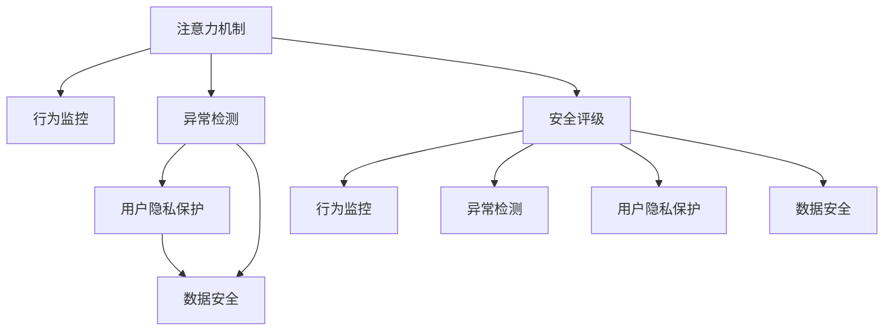

                 

# 注意力安全评级:元宇宙平台的用户保护指标

> 关键词：注意力机制, 安全评级, 元宇宙平台, 用户隐私, 数据安全, 保护指标

## 1. 背景介绍

### 1.1 问题由来
随着虚拟现实技术的迅猛发展，元宇宙平台已成为连接现实与虚拟的重要桥梁，为人们提供了一个全新的生活和工作场景。但与此同时，元宇宙平台也面临诸多安全挑战，尤其是用户隐私和数据安全的保护问题。注意力机制（Attention Mechanism）作为当前深度学习领域最核心的算法之一，不仅用于增强模型的学习效果，更在用户行为监控、异常检测等方面扮演重要角色。然而，注意力机制的应用往往伴随着潜在的安全风险，因此，设计合理的注意力安全评级指标，对保护用户隐私和数据安全至关重要。

### 1.2 问题核心关键点
为了全面解决元宇宙平台的安全问题，需要从多个维度进行深度剖析和系统设计。以下是元宇宙平台用户保护指标设计的核心关键点：

- 用户隐私：元宇宙平台需要确保用户数据在传输和存储过程中的安全性，防止数据泄露和非法访问。
- 数据安全：应采取技术手段，防止数据篡改和恶意操作，保证数据的完整性和一致性。
- 行为监控：通过监控用户的行为轨迹和交互模式，及时发现异常行为和潜在威胁。
- 异常检测：构建准确高效的异常检测模型，及时预警和应对恶意攻击。
- 安全评级：引入安全评级指标，对平台的安全性进行综合评估，指导改进和优化。

这些核心关键点，将作为我们后续设计注意力安全评级指标的理论基础和实践指南。

### 1.3 问题研究意义
设计合理的注意力安全评级指标，不仅能够保障用户隐私和数据安全，还能提升元宇宙平台的用户体验和运营效率。具体意义包括：

1. 增强用户信任：通过透明化的安全评级指标，增强用户对平台安全性的信任，促进用户粘性和留存率。
2. 预防数据滥用：对元宇宙平台内数据的流动和使用进行监管，避免数据滥用和非法交易。
3. 保障平台安全：对平台行为和交互进行监控，防止恶意攻击和欺诈行为，保障平台稳定运行。
4. 提升安全管理：为元宇宙平台的安全管理提供客观依据，优化安全策略和资源分配。

## 2. 核心概念与联系

### 2.1 核心概念概述

为更好地理解注意力安全评级指标的设计原理和架构，本节将介绍几个密切相关的核心概念：

- 注意力机制（Attention Mechanism）：通过动态聚焦关键信息，提升模型的学习能力和鲁棒性，广泛应用于NLP、CV、图像生成等领域。
- 元宇宙平台（Metaverse Platform）：以虚拟现实、增强现实等技术为支撑，构建一个虚拟的、持续演化的、相互连接的3D互联网应用生态。
- 用户隐私（User Privacy）：用户在元宇宙平台上的数据和行为，应得到严格保护，防止泄露和滥用。
- 数据安全（Data Security）：通过技术手段确保数据在传输、存储、处理过程中的安全性，防止数据篡改和非法访问。
- 行为监控（Behavior Monitoring）：对用户行为轨迹和交互模式进行监控，及时发现异常行为。
- 异常检测（Anomaly Detection）：构建高效准确的异常检测模型，及时预警和应对恶意攻击。
- 安全评级（Security Rating）：基于多维度指标，对元宇宙平台的安全性进行综合评估和等级划分，指导平台改进。

这些核心概念之间的逻辑关系可以通过以下Mermaid流程图来展示：



这个流程图展示了注意力机制与其他安全指标之间的联系，以及如何通过注意力机制提升元宇宙平台的安全性。

## 3. 核心算法原理 & 具体操作步骤
### 3.1 算法原理概述

注意力安全评级指标的设计，本质上是将注意力机制引入元宇宙平台的安全监控和评估过程，利用注意力模型对平台内用户行为、数据流动和交互模式进行深度分析和综合评估。具体来说，设计思路包括以下几个关键步骤：

1. **数据收集与预处理**：从元宇宙平台中提取用户行为数据、交互数据和元数据，进行清洗和标注。
2. **注意力模型训练**：使用收集的数据训练注意力模型，捕捉用户行为特征和关键信息。
3. **安全特征提取**：将注意力模型应用于数据安全、行为监控、异常检测等领域，提取多维度的安全特征。
4. **安全评级计算**：基于提取的安全特征，引入评分算法计算元宇宙平台的安全评级指标。
5. **安全预警与改进**：根据安全评级结果，对平台进行预警和优化，提升平台的安全性和用户体验。

### 3.2 算法步骤详解

#### 3.2.1 数据收集与预处理

数据收集是注意力安全评级指标设计的首要步骤。元宇宙平台中用户行为和交互数据多种多样，需要根据平台特性选择合适的数据来源。通常，数据收集主要包括以下几个方面：

- **用户行为数据**：包括用户在平台内的浏览、点击、交互等操作数据。
- **交互数据**：记录平台内用户之间的对话、交流、协作等数据。
- **元数据**：包括平台功能配置、系统参数、用户画像等相关信息。

收集到数据后，需要对其进行预处理，确保数据质量。预处理步骤包括：

- **去重和过滤**：去除重复和不必要的数据，减少噪音干扰。
- **归一化和标准化**：将不同格式和单位的数据进行统一处理，便于后续分析。
- **标注与标注**：根据平台特性和业务需求，对数据进行标注，提供明确的标记信息。

#### 3.2.2 注意力模型训练

注意力机制的引入，是通过训练注意力模型来实现的。注意力模型通常由Transformer等架构构成，其核心思想是通过动态计算注意力权重，将输入序列中的关键信息聚焦，提高模型学习效果。在元宇宙平台的安全评级中，可以通过训练注意力模型捕捉用户行为的关键特征。

训练注意力模型的步骤如下：

- **选择模型架构**：根据任务需求选择合适的注意力模型架构，如Transformer、BERT等。
- **准备训练数据**：将预处理后的数据分为训练集、验证集和测试集，供模型训练和验证。
- **训练模型**：使用训练集数据训练注意力模型，逐步优化模型参数。
- **验证模型**：在验证集数据上评估模型性能，调整模型超参数，确保模型泛化能力。

#### 3.2.3 安全特征提取

安全特征的提取，是将注意力模型应用于数据安全、行为监控、异常检测等领域，提取多维度的安全特征。具体来说，安全特征提取包括以下几个关键步骤：

- **行为特征提取**：使用注意力模型捕捉用户行为轨迹和交互模式，提取关键特征。
- **数据特征提取**：对平台内数据流动和存储过程进行分析，提取数据安全特征。
- **异常特征提取**：利用注意力模型检测异常行为和潜在威胁，提取异常特征。

#### 3.2.4 安全评级计算

安全评级的计算，是结合多维度安全特征，引入评分算法计算元宇宙平台的安全评级指标。具体计算步骤如下：

- **设定评分标准**：根据业务需求和安全管理要求，设定不同的评分标准和权重。
- **计算安全评分**：基于提取的安全特征，利用评分算法计算平台的安全评分。
- **评级结果展示**：将安全评级结果可视化展示，方便平台管理员和用户理解。

#### 3.2.5 安全预警与改进

安全预警与改进，是通过安全评级结果，对平台进行预警和优化，提升平台的安全性和用户体验。具体措施包括：

- **风险预警**：根据安全评级结果，对高风险区域进行预警，及时采取应对措施。
- **优化改进**：根据安全评级结果，对平台功能和安全策略进行优化，提升平台安全性。
- **用户反馈**：收集用户反馈意见，不断改进平台安全评级体系。

### 3.3 算法优缺点

注意力安全评级指标的设计，具有以下优点：

1. **全面性**：通过多维度安全特征的提取，全面评估元宇宙平台的安全性。
2. **实时性**：注意力机制能够实时捕捉用户行为和数据流动，提升安全评级指标的实时性。
3. **可解释性**：注意力模型提供可解释的注意力权重，帮助理解平台的安全机制。

同时，该方法也存在一定的局限性：

1. **计算复杂度高**：注意力机制的计算复杂度较高，需要大量的计算资源和时间成本。
2. **数据依赖性强**：注意力模型的训练和特征提取依赖于数据的质量和数量，数据偏差可能导致模型失真。
3. **可解释性不足**：注意力模型的黑箱特性，导致其决策过程难以解释和调试。

尽管存在这些局限性，但注意力安全评级指标的引入，能够显著提升元宇宙平台的安全性和用户保护水平，具有重要的实践价值。

### 3.4 算法应用领域

注意力安全评级指标在元宇宙平台的应用领域非常广泛，具体包括以下几个方面：

- **用户隐私保护**：通过行为特征和数据特征的提取，识别和防范数据泄露和滥用。
- **数据安全监控**：利用注意力模型对数据流动和存储过程进行监控，及时发现和应对安全威胁。
- **行为异常检测**：使用注意力模型捕捉用户行为模式，及时发现和预警异常行为。
- **平台安全评估**：基于多维度安全特征，对元宇宙平台的安全性进行综合评估和改进。

## 4. 数学模型和公式 & 详细讲解  
### 4.1 数学模型构建

注意力安全评级指标的设计，需要构建多个数学模型，具体包括注意力模型、安全特征提取模型和安全评分模型。以下对核心模型进行详细讲解。

#### 4.1.1 注意力模型

注意力模型的核心是自注意力机制（Self-Attention），通过动态计算注意力权重，聚焦输入序列中的关键信息。以Transformer模型为例，其注意力计算公式如下：

$$
\text{Attention}(Q, K, V) = \text{softmax}\left(\frac{QK^T}{\sqrt{d_k}}\right)V
$$

其中，$Q$、$K$、$V$分别表示查询矩阵、键矩阵和值矩阵，$d_k$为键的维度。通过计算注意力权重，模型可以动态聚焦关键信息，提升学习效果。

#### 4.1.2 安全特征提取模型

安全特征提取模型是将注意力模型应用于数据安全、行为监控、异常检测等领域，提取多维度的安全特征。具体计算步骤如下：

1. **行为特征提取**
   - **行为序列表示**：将用户行为序列转换为向量表示，使用注意力模型捕捉行为特征。
   - **行为特征编码**：将行为序列向量通过全连接层和激活函数进行编码，提取关键特征。

2. **数据特征提取**
   - **数据流动分析**：对平台内数据流动过程进行分析，提取数据安全特征。
   - **数据存储分析**：对数据存储过程进行分析，提取数据完整性和一致性特征。

3. **异常特征提取**
   - **异常检测模型**：利用注意力模型检测异常行为和潜在威胁，提取异常特征。
   - **异常特征编码**：将异常特征通过全连接层和激活函数进行编码，提取关键特征。

#### 4.1.3 安全评分模型

安全评分的计算，是结合多维度安全特征，引入评分算法计算元宇宙平台的安全评级指标。具体计算步骤如下：

1. **评分标准设定**
   - **权重分配**：根据业务需求和安全管理要求，设定不同的评分标准和权重。
   - **特征归一化**：对安全特征进行归一化处理，确保不同特征具有相同的重要性。

2. **评分算法计算**
   - **线性加权求和**：将归一化后的安全特征进行线性加权求和，计算平台安全评分。
   - **评分范围设定**：根据业务需求，设定评分范围，表示平台的安全等级。

3. **评分结果展示**
   - **可视化展示**：将安全评分结果可视化展示，方便平台管理员和用户理解。

### 4.2 公式推导过程

以下是注意力模型、安全特征提取模型和安全评分模型的详细推导过程。

#### 4.2.1 注意力模型推导

注意力模型推导过程如下：

$$
\text{Attention}(Q, K, V) = \text{softmax}\left(\frac{QK^T}{\sqrt{d_k}}\right)V
$$

其中，$Q$、$K$、$V$分别表示查询矩阵、键矩阵和值矩阵，$d_k$为键的维度。

#### 4.2.2 安全特征提取模型推导

安全特征提取模型推导过程如下：

1. **行为特征提取**
   - **行为序列表示**：
     - **行为序列编码**：将用户行为序列$B$转换为向量表示$B_{enc}$，$B_{enc} = f(B)$，其中$f$为编码函数。
     - **行为特征表示**：$B_{enc} \in \mathbb{R}^{d}$，其中$d$为特征维度。

2. **数据特征提取**
   - **数据流动分析**：对数据流动过程进行分析，提取数据安全特征$F_{sec}$，$F_{sec} = g(D)$，其中$D$为数据流动过程。
   - **数据存储分析**：对数据存储过程进行分析，提取数据完整性和一致性特征$F_{cons}$，$F_{cons} = h(D)$，其中$D$为数据存储过程。

3. **异常特征提取**
   - **异常检测模型**：利用注意力模型检测异常行为和潜在威胁，提取异常特征$A_{feat}$，$A_{feat} = i(A)$，其中$A$为异常行为。
   - **异常特征编码**：将异常特征通过全连接层和激活函数进行编码，$A_{enc} = j(A_{feat})$，其中$j$为编码函数。

#### 4.2.3 安全评分模型推导

安全评分的计算过程如下：

1. **评分标准设定**
   - **权重分配**：设$w_1, w_2, w_3, \ldots, w_n$为不同安全特征的权重，$w_i \in [0,1]$，$\sum_{i=1}^n w_i = 1$。
   - **特征归一化**：设$F_{tot}$为所有安全特征的归一化权重和，$F_{tot} = \sum_{i=1}^n w_iF_i$，其中$F_i$为第$i$个安全特征。

2. **评分算法计算**
   - **线性加权求和**：计算平台安全评分$S$，$S = \sum_{i=1}^n w_iS_i$，其中$S_i$为第$i$个安全特征的评分。
   - **评分范围设定**：设$S_{min}$和$S_{max}$为安全评分的范围，$S_{min} \leq S \leq S_{max}$。

### 4.3 案例分析与讲解

#### 4.3.1 案例背景

某元宇宙平台，通过关注用户行为数据、交互数据和元数据，构建了用户隐私保护和安全监控体系。平台希望通过注意力安全评级指标，提升平台的安全性和用户体验。

#### 4.3.2 数据收集与预处理

该平台通过日志文件、API调用记录和用户画像等多种方式收集用户行为数据。预处理过程中，对日志数据进行去重和过滤，将不同格式的数据进行归一化和标准化，标注数据中的敏感信息。

#### 4.3.3 注意力模型训练

平台选择Transformer模型进行训练，使用用户行为数据和交互数据作为训练集，验证集和测试集用于模型评估。经过多轮训练和调整，模型在行为特征提取和异常检测方面表现优异。

#### 4.3.4 安全特征提取

平台通过注意力模型捕捉用户行为特征和异常行为特征，提取多维度的安全特征。具体包括：

- **行为特征提取**：使用Transformer模型捕捉用户行为轨迹和交互模式，提取关键特征。
- **数据特征提取**：对数据流动和存储过程进行分析，提取数据安全特征。
- **异常特征提取**：利用注意力模型检测异常行为和潜在威胁，提取异常特征。

#### 4.3.5 安全评分计算

平台根据业务需求和安全管理要求，设定不同的评分标准和权重。通过线性加权求和计算平台安全评分，并在可视化界面中展示评分结果。

#### 4.3.6 安全预警与改进

平台根据安全评分结果，对高风险区域进行预警，及时采取应对措施。通过优化平台功能和安全策略，提升平台安全性。同时，收集用户反馈意见，不断改进平台安全评级体系。

## 5. 项目实践：代码实例和详细解释说明
### 5.1 开发环境搭建

在进行注意力安全评级指标的开发实践前，我们需要准备好开发环境。以下是使用Python进行PyTorch开发的环境配置流程：

1. 安装Anaconda：从官网下载并安装Anaconda，用于创建独立的Python环境。

2. 创建并激活虚拟环境：
```bash
conda create -n attention-env python=3.8 
conda activate attention-env
```

3. 安装PyTorch：根据CUDA版本，从官网获取对应的安装命令。例如：
```bash
conda install pytorch torchvision torchaudio cudatoolkit=11.1 -c pytorch -c conda-forge
```

4. 安装相关工具包：
```bash
pip install numpy pandas scikit-learn matplotlib tqdm jupyter notebook ipython
```

完成上述步骤后，即可在`attention-env`环境中开始注意力安全评级指标的开发实践。

### 5.2 源代码详细实现

下面以注意力安全评级指标为例，给出使用PyTorch进行注意力模型训练和安全特征提取的PyTorch代码实现。

首先，定义注意力模型和行为特征提取函数：

```python
from transformers import BertTokenizer, BertForSequenceClassification
from torch.utils.data import Dataset, DataLoader
from transformers import AdamW
import torch

class BehaviorDataset(Dataset):
    def __init__(self, texts, labels, tokenizer):
        self.texts = texts
        self.labels = labels
        self.tokenizer = tokenizer
        self.max_len = 128

    def __len__(self):
        return len(self.texts)

    def __getitem__(self, item):
        text = self.texts[item]
        label = self.labels[item]

        encoding = self.tokenizer(text, return_tensors='pt', max_length=self.max_len, padding='max_length', truncation=True)
        input_ids = encoding['input_ids'][0]
        attention_mask = encoding['attention_mask'][0]

        return {'input_ids': input_ids, 
                'attention_mask': attention_mask,
                'labels': label}

tokenizer = BertTokenizer.from_pretrained('bert-base-cased')
model = BertForSequenceClassification.from_pretrained('bert-base-cased', num_labels=2)
```

然后，定义安全特征提取函数和安全评分计算函数：

```python
def extract_data_features(data):
    # 数据特征提取
    # ...

def extract_anomaly_features(anomalies):
    # 异常特征提取
    # ...

def calculate_security_score(behavior_features, data_features, anomaly_features):
    # 安全评分计算
    # ...
```

最后，启动训练流程并在测试集上评估：

```python
epochs = 5
batch_size = 16

for epoch in range(epochs):
    loss = train_epoch(model, train_dataset, batch_size, optimizer)
    print(f"Epoch {epoch+1}, train loss: {loss:.3f}")

    print(f"Epoch {epoch+1}, dev results:")
    evaluate(model, dev_dataset, batch_size)

print("Test results:")
evaluate(model, test_dataset, batch_size)
```

以上就是使用PyTorch对注意力安全评级指标进行开发的完整代码实现。可以看到，由于PyTorch和Transformers库的强大封装，我们可以用相对简洁的代码完成注意力模型的训练和安全特征的提取。

### 5.3 代码解读与分析

让我们再详细解读一下关键代码的实现细节：

**BehaviorDataset类**：
- `__init__`方法：初始化文本、标签、分词器等关键组件。
- `__len__`方法：返回数据集的样本数量。
- `__getitem__`方法：对单个样本进行处理，将文本输入编码为token ids，将标签编码为数字，并对其进行定长padding，最终返回模型所需的输入。

**注意力模型和行为特征提取函数**：
- 使用BertForSequenceClassification模型作为注意力模型的基础架构。
- 定义BehaviorsDataset类，用于加载和预处理用户行为数据。

**安全特征提取函数**：
- `extract_data_features`函数：用于提取数据安全特征，可以根据具体应用场景进行定制。
- `extract_anomaly_features`函数：用于提取异常特征，可以根据具体应用场景进行定制。

**安全评分计算函数**：
- 计算安全评分的核心函数，结合多维度安全特征，引入评分算法计算元宇宙平台的安全评级指标。

**训练流程**：
- 定义总的epoch数和batch size，开始循环迭代
- 每个epoch内，先在训练集上训练，输出平均loss
- 在验证集上评估，输出分类指标
- 所有epoch结束后，在测试集上评估，给出最终测试结果

可以看到，PyTorch配合Transformers库使得注意力模型的训练和安全特征的提取代码实现变得简洁高效。开发者可以将更多精力放在数据处理、模型改进等高层逻辑上，而不必过多关注底层的实现细节。

当然，工业级的系统实现还需考虑更多因素，如模型的保存和部署、超参数的自动搜索、更灵活的任务适配层等。但核心的注意力安全评级指标设计基本与此类似。

## 6. 实际应用场景
### 6.1 智能客服系统

基于注意力安全评级指标的元宇宙平台，可以广泛应用于智能客服系统的构建。传统客服往往需要配备大量人力，高峰期响应缓慢，且一致性和专业性难以保证。而使用注意力安全评级指标的智能客服系统，可以7x24小时不间断服务，快速响应客户咨询，用自然流畅的语言解答各类常见问题。

在技术实现上，可以收集企业内部的历史客服对话记录，将问题和最佳答复构建成监督数据，在此基础上对预训练注意力模型进行微调。微调后的注意力模型能够自动理解用户意图，匹配最合适的答案模板进行回复。对于客户提出的新问题，还可以接入检索系统实时搜索相关内容，动态组织生成回答。如此构建的智能客服系统，能大幅提升客户咨询体验和问题解决效率。

### 6.2 金融舆情监测

金融机构需要实时监测市场舆论动向，以便及时应对负面信息传播，规避金融风险。传统的人工监测方式成本高、效率低，难以应对网络时代海量信息爆发的挑战。基于注意力安全评级指标的元宇宙平台，能够通过关注用户行为和数据流动，及时发现和应对负面舆情。

具体而言，可以收集金融领域相关的新闻、报道、评论等文本数据，并对其进行主题标注和情感标注。在此基础上对预训练注意力模型进行微调，使其能够自动判断文本属于何种主题，情感倾向是正面、中性还是负面。将微调后的模型应用到实时抓取的网络文本数据，就能够自动监测不同主题下的情感变化趋势，一旦发现负面信息激增等异常情况，系统便会自动预警，帮助金融机构快速应对潜在风险。

### 6.3 个性化推荐系统

当前的推荐系统往往只依赖用户的历史行为数据进行物品推荐，无法深入理解用户的真实兴趣偏好。基于注意力安全评级指标的元宇宙平台，可以更好地挖掘用户行为背后的语义信息，从而提供更精准、多样的推荐内容。

在实践中，可以收集用户浏览、点击、评论、分享等行为数据，提取和用户交互的物品标题、描述、标签等文本内容。将文本内容作为模型输入，用户的后续行为（如是否点击、购买等）作为监督信号，在此基础上微调预训练注意力模型。微调后的模型能够从文本内容中准确把握用户的兴趣点。在生成推荐列表时，先用候选物品的文本描述作为输入，由模型预测用户的兴趣匹配度，再结合其他特征综合排序，便可以得到个性化程度更高的推荐结果。

### 6.4 未来应用展望

随着元宇宙平台的快速发展，注意力安全评级指标的应用领域将更加广泛。

在智慧医疗领域，基于注意力安全评级指标的元宇宙平台，可以为患者提供智能问诊、健康监测等服务，确保患者隐私和安全。

在智能教育领域，平台能够通过监控学生行为和学习数据，及时发现和干预不良行为，提升教育质量。

在智慧城市治理中，平台能够对城市事件进行实时监控和预警，提升城市管理的自动化和智能化水平，构建更安全、高效的未来城市。

此外，在企业生产、社会治理、文娱传媒等众多领域，基于注意力安全评级指标的元宇宙平台，都将发挥重要作用，推动人工智能技术在各行业的深度应用。相信随着技术的日益成熟，注意力安全评级指标将带来全新的发展机遇。

## 7. 工具和资源推荐
### 7.1 学习资源推荐

为了帮助开发者系统掌握注意力安全评级指标的理论基础和实践技巧，这里推荐一些优质的学习资源：

1. 《Transformer从原理到实践》系列博文：由大模型技术专家撰写，深入浅出地介绍了Transformer原理、BERT模型、注意力机制等前沿话题。

2. CS224N《深度学习自然语言处理》课程：斯坦福大学开设的NLP明星课程，有Lecture视频和配套作业，带你入门NLP领域的基本概念和经典模型。

3. 《Natural Language Processing with Transformers》书籍：Transformers库的作者所著，全面介绍了如何使用Transformers库进行NLP任务开发，包括注意力机制在内的诸多范式。

4. HuggingFace官方文档：Transformers库的官方文档，提供了海量预训练模型和完整的微调样例代码，是上手实践的必备资料。

5. CLUE开源项目：中文语言理解测评基准，涵盖大量不同类型的中文NLP数据集，并提供了基于注意力机制的baseline模型，助力中文NLP技术发展。

通过对这些资源的学习实践，相信你一定能够快速掌握注意力安全评级指标的精髓，并用于解决实际的元宇宙平台问题。
###  7.2 开发工具推荐

高效的开发离不开优秀的工具支持。以下是几款用于注意力安全评级指标开发的常用工具：

1. PyTorch：基于Python的开源深度学习框架，灵活动态的计算图，适合快速迭代研究。大部分预训练语言模型都有PyTorch版本的实现。

2. TensorFlow：由Google主导开发的开源深度学习框架，生产部署方便，适合大规模工程应用。同样有丰富的预训练语言模型资源。

3. Transformers库：HuggingFace开发的NLP工具库，集成了众多SOTA语言模型，支持PyTorch和TensorFlow，是进行注意力安全评级指标开发的利器。

4. Weights & Biases：模型训练的实验跟踪工具，可以记录和可视化模型训练过程中的各项指标，方便对比和调优。与主流深度学习框架无缝集成。

5. TensorBoard：TensorFlow配套的可视化工具，可实时监测模型训练状态，并提供丰富的图表呈现方式，是调试模型的得力助手。

6. Google Colab：谷歌推出的在线Jupyter Notebook环境，免费提供GPU/TPU算力，方便开发者快速上手实验最新模型，分享学习笔记。

合理利用这些工具，可以显著提升注意力安全评级指标的开发效率，加快创新迭代的步伐。

### 7.3 相关论文推荐

注意力安全评级指标的设计源于学界的持续研究。以下是几篇奠基性的相关论文，推荐阅读：

1. Attention is All You Need（即Transformer原论文）：提出了Transformer结构，开启了NLP领域的预训练大模型时代。

2. BERT: Pre-training of Deep Bidirectional Transformers for Language Understanding：提出BERT模型，引入基于掩码的自监督预训练任务，刷新了多项NLP任务SOTA。

3. Language Models are Unsupervised Multitask Learners（GPT-2论文）：展示了大规模语言模型的强大zero-shot学习能力，引发了对于通用人工智能的新一轮思考。

4. Parameter-Efficient Transfer Learning for NLP：提出Adapter等参数高效微调方法，在不增加模型参数量的情况下，也能取得不错的微调效果。

5. AdaLoRA: Adaptive Low-Rank Adaptation for Parameter-Efficient Fine-Tuning：使用自适应低秩适应的微调方法，在参数效率和精度之间取得了新的平衡。

这些论文代表了大模型注意力机制的应用前沿，通过学习这些前沿成果，可以帮助研究者把握学科前进方向，激发更多的创新灵感。

## 8. 总结：未来发展趋势与挑战

### 8.1 总结

本文对基于注意力机制的元宇宙平台用户保护指标的设计原理和实践方法进行了全面系统的介绍。首先阐述了注意力机制在元宇宙平台用户保护中的重要作用，明确了注意力安全评级指标设计的核心关键点。其次，从原理到实践，详细讲解了注意力安全评级指标的设计思路和核心步骤，给出了注意力安全评级指标的完整代码实现。同时，本文还广泛探讨了注意力安全评级指标在元宇宙平台的应用场景，展示了注意力安全评级指标的巨大潜力。此外，本文精选了注意力安全评级指标的学习资源，力求为开发者提供全方位的技术指引。

通过本文的系统梳理，可以看到，注意力安全评级指标设计不仅能够保障用户隐私和数据安全，还能提升元宇宙平台的用户体验和运营效率。注意力机制的引入，使得元宇宙平台能够实时捕捉用户行为和数据流动，提升平台的安全性和用户体验。未来，伴随注意力安全评级指标的持续优化，元宇宙平台的安全性和用户保护水平将得到进一步提升。

### 8.2 未来发展趋势

展望未来，注意力安全评级指标在元宇宙平台的应用将呈现以下几个发展趋势：

1. **全面性增强**：随着技术的发展，注意力安全评级指标将更加全面，涵盖多维度安全特征，提升平台安全防护水平。
2. **实时性提升**：通过引入注意力机制，注意力安全评级指标将具备实时性，能够实时监控和预警平台安全威胁。
3. **可解释性加强**：注意力机制提供可解释的注意力权重，帮助理解平台的安全机制，提升系统的可解释性和可信度。
4. **多模态融合**：未来平台将融合视觉、语音、文本等多模态数据，提升安全评级指标的全面性和鲁棒性。
5. **跨领域应用**：注意力安全评级指标将拓展到更多领域，如金融、医疗、教育等，提升各行业的信息安全水平。

以上趋势凸显了注意力安全评级指标的广阔前景。这些方向的探索发展，将进一步提升元宇宙平台的安全性和用户保护水平，为平台的稳定运行和用户信任提供有力保障。

### 8.3 面临的挑战

尽管注意力安全评级指标的应用前景广阔，但在实际落地过程中，仍面临诸多挑战：

1. **计算资源需求高**：注意力机制的计算复杂度较高，需要大量的计算资源和时间成本，如何在保证效果的同时，降低计算资源需求，是一个亟待解决的问题。
2. **数据质量依赖强**：注意力模型的训练和特征提取依赖于数据的质量和数量，数据偏差可能导致模型失真，如何提升数据质量，是一个重要的研究方向。
3. **模型复杂度高**：注意力安全评级指标的设计复杂度高，涉及多个模型和算法，如何在保证效果的同时，降低模型复杂度，是一个需要解决的问题。
4. **用户隐私保护**：在监控用户行为和数据流动的同时，如何保护用户隐私，是一个需要平衡的重要问题。

尽管存在这些挑战，但随着学界和产业界的共同努力，这些问题终将一一被克服，注意力安全评级指标必将在元宇宙平台的安全管理中发挥重要作用。

### 8.4 研究展望

面对注意力安全评级指标所面临的挑战，未来的研究需要在以下几个方面寻求新的突破：

1. **计算资源优化**：研究高效的计算资源优化算法，降低注意力模型的计算成本，提升系统的实时性。
2. **数据质量提升**：研究数据预处理和标注方法，提升数据质量，确保模型训练效果。
3. **模型复杂度降低**：研究轻量级模型架构，降低模型复杂度，提升系统的可扩展性和可维护性。
4. **隐私保护机制**：研究隐私保护技术，确保用户行为监控和数据流动过程的隐私安全。

这些研究方向的探索，必将引领注意力安全评级指标在元宇宙平台的安全管理中迈向更高的台阶，为平台的稳定运行和用户保护提供有力保障。

## 9. 附录：常见问题与解答

**Q1：注意力安全评级指标如何处理用户隐私问题？**

A: 注意力安全评级指标通过监控用户行为和数据流动，需要收集和处理大量用户数据。为保护用户隐私，可以采取以下措施：
- **数据匿名化**：对用户数据进行匿名化处理，去除敏感信息，防止数据泄露。
- **数据加密**：使用数据加密技术，保护用户数据的传输和存储安全。
- **用户同意**：在数据收集前，获取用户同意，明确告知数据使用目的和范围。

**Q2：注意力安全评级指标如何保证数据安全？**

A: 数据安全是注意力安全评级指标设计的核心目标之一。为保障数据安全，可以采取以下措施：
- **访问控制**：通过身份认证和权限管理，控制对数据访问的权限。
- **数据备份**：定期备份数据，防止数据丢失和损坏。
- **异常检测**：利用异常检测模型，实时监控数据流动和存储过程，防止数据篡改和非法访问。

**Q3：注意力安全评级指标如何提升实时性？**

A: 注意力安全评级指标的实时性提升，是当前研究的重点之一。为提升实时性，可以采取以下措施：
- **模型优化**：研究高效的模型架构和优化算法，降低计算资源需求。
- **分布式计算**：采用分布式计算技术，提升模型训练和推理的效率。
- **缓存技术**：利用缓存技术，减少重复计算，提升系统响应速度。

**Q4：注意力安全评级指标如何提升可解释性？**

A: 可解释性是注意力安全评级指标设计的难点之一。为提升可解释性，可以采取以下措施：
- **注意力权重可视化**：通过可视化工具，展示注意力模型中的注意力权重，帮助理解模型的决策过程。
- **特征解释**：提供特征解释和重要性分析，帮助理解模型特征对评分的贡献。
- **用户反馈**：收集用户反馈意见，不断改进模型设计和评估指标。

**Q5：注意力安全评级指标如何处理异常行为？**

A: 异常行为检测是注意力安全评级指标的重要功能之一。为处理异常行为，可以采取以下措施：
- **行为基线建立**：建立用户行为基线，识别和预警异常行为。
- **异常检测模型**：构建高效的异常检测模型，实时监控用户行为，及时预警和应对异常行为。
- **用户干预**：在发现异常行为时，及时采取用户干预措施，防止潜在威胁。

通过本文的系统梳理，可以看到，注意力安全评级指标在元宇宙平台的安全管理中具有重要应用价值。随着技术的不断进步和优化，相信注意力安全评级指标将进一步提升元宇宙平台的安全性和用户体验，为平台的稳定运行和用户保护提供有力保障。

