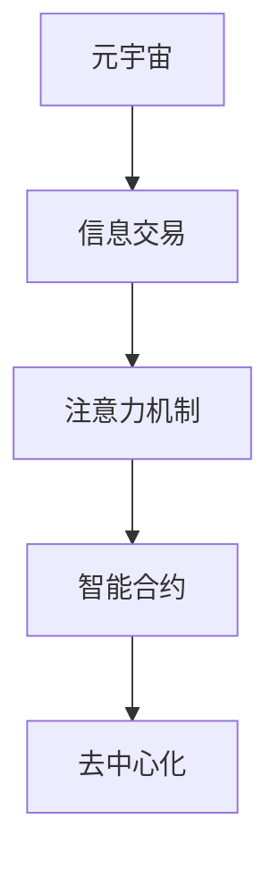

                 

# 注意力市场：元宇宙时代下的信息交易

> 关键词：元宇宙, 信息交易, 注意力机制, 智能合约, 去中心化, 网络效应

## 1. 背景介绍

### 1.1 问题由来
随着Web 3.0技术的逐渐成熟和元宇宙概念的崛起，互联网进入到一个全新的发展阶段。在传统Web 2.0时代，信息内容主要是通过中心化的大平台分发，用户只能被动接受。而在元宇宙时代，内容分发与交互的方式将变得更为个性化和去中心化。

元宇宙的核心思想是“人人都是内容的生产者”，这意味着任何人都可以在虚拟空间中创建、发布、互动内容，形成多样的信息内容生态。这一变化将带来信息交易模式的根本变革，尤其是信息交易的定价和支付方式。

### 1.2 问题核心关键点
在元宇宙时代，信息交易的关键在于如何实现内容的精准定价，并保证交易的安全性、透明性和效率。当前信息市场定价主要基于点击量、浏览量等粗略指标，难以反映内容的真实价值。

因此，本文聚焦于一种新兴的定价机制——注意力机制（Attention Mechanism），探讨如何利用注意力机制对元宇宙中的信息内容进行精准定价。同时，本文还介绍基于智能合约（Smart Contract）的信息交易平台，实现去中心化、高效、安全的交易方式。

## 2. 核心概念与联系

### 2.1 核心概念概述

为更好地理解基于注意力机制的信息交易方法，本节将介绍几个密切相关的核心概念：

- 元宇宙(Metaverse)：由多个虚拟世界组成的广阔网络，用户可以通过虚拟身份在虚拟空间中自由互动，形成丰富的社交、娱乐、商业等活动。
- 信息交易：指买卖双方基于信息商品进行的交易活动，信息商品包括文章、视频、音频等各类内容形式。
- 注意力机制(Attention Mechanism)：通过衡量不同用户对内容的关注度，动态调整内容价值，实现精准定价。
- 智能合约(Smart Contract)：部署在区块链上的可执行代码，具备自动执行合约条款的功能，可用于保证信息交易的透明性、公正性和安全性。
- 去中心化(Decentralization)：指在元宇宙中，由去中心化的节点和算法共同维护信息交易平台，而不是由单一的中心化机构控制。

这些核心概念之间的逻辑关系可以通过以下Mermaid流程图来展示：



这个流程图展示了一些核心概念及其之间的关系：

1. 元宇宙通过信息交易形成价值生态。
2. 信息交易依赖于内容的精准定价，而定价依赖于用户对内容的关注度。
3. 通过智能合约，实现去中心化的信息交易平台。
4. 去中心化的交易平台是元宇宙信息交易的重要保障。

## 3. 核心算法原理 & 具体操作步骤
### 3.1 算法原理概述

基于注意力机制的信息交易方法，其核心思想是：通过衡量不同用户对内容的关注度，动态调整内容价值，实现精准定价。具体来说，对于同一内容，不同用户可能具有不同的关注度和价值预期，而注意力机制能有效地反映这一差异。

在元宇宙中，每个用户的行为都产生了不同的关注度，这包括浏览时长、互动频率、打赏行为等。内容生产者发布的信息内容通过这些行为被不同用户所关注，从而形成了内容价值。在元宇宙交易平台上，内容价值将作为信息商品的定价依据，实现公平的交易。

### 3.2 算法步骤详解

基于注意力机制的信息交易方法一般包括以下几个关键步骤：

**Step 1: 数据收集与处理**
- 收集用户的浏览行为、互动频率、打赏记录等数据。
- 对这些数据进行清洗和特征提取，形成可用于训练和评估的特征集。

**Step 2: 注意力模型训练**
- 根据收集到的数据，训练基于注意力机制的定价模型。
- 常用的模型包括自注意力模型（如Transformer），通过学习不同用户对内容的关注度，预测内容价值。
- 使用历史交易数据进行监督学习，优化模型参数。

**Step 3: 定价与交易**
- 对于新发布的内容，通过注意力模型预测其价值，生成相应的价格。
- 用户可根据生成的价格进行交易，系统自动执行交易操作，确保透明度和公正性。

**Step 4: 反馈与优化**
- 根据交易结果和用户反馈，定期更新注意力模型，优化定价算法。
- 调整模型超参数，如学习率、迭代次数等，以适应不断变化的市场需求。

### 3.3 算法优缺点

基于注意力机制的信息交易方法具有以下优点：
1. 精准定价。通过衡量不同用户对内容的关注度，实现更加精准的信息定价。
2. 动态调整。能够根据市场需求和用户行为，动态调整内容价值，反映真实市场变化。
3. 透明公正。基于智能合约，保证交易过程的透明性和公正性，避免中心化机构的干预。
4. 去中心化。通过去中心化的节点和算法，实现更高效、更安全的信息交易。

同时，该方法也存在一定的局限性：
1. 数据需求高。需要大量用户的实时行为数据，收集和处理成本较高。
2. 模型复杂。自注意力模型等复杂模型训练和调参难度大，需要较高的技术门槛。
3. 安全性问题。在去中心化环境中，存在模型被攻击和篡改的风险，需要额外的安全措施。
4. 实时性要求高。基于实时数据训练的模型，要求系统具备较高的实时处理能力。

尽管存在这些局限性，但基于注意力机制的方法仍是大规模信息交易的重要技术手段。未来相关研究的重点在于如何进一步降低数据需求，提高模型效率和鲁棒性，同时兼顾安全性和实时性等因素。

### 3.4 算法应用领域

基于注意力机制的信息交易方法，已经在元宇宙中的信息市场得到了广泛应用。具体而言，以下领域均有应用前景：

1. 虚拟社交平台：如Decentraland、沙盒(Sandbox)等，用户可以通过虚拟身份发布和交易内容，通过注意力机制实现精准定价。
2. 虚拟音乐平台：如Binance Smart Chain上的Luv Music、Banji Music等，音乐创作者发布作品，用户通过区块链打赏实现交易。
3. 虚拟艺术品市场：如Rarible、Mint，艺术家发布作品，用户通过智能合约进行买卖，实现去中心化的交易。
4. 虚拟游戏平台：如Axie Infinity、Splinterlands，玩家发布内容，用户通过虚拟货币进行交易，实现经济互动。

除了上述这些典型的应用场景，基于注意力机制的信息交易方法还在教育、媒体、科技等更多领域有广泛应用前景。

## 4. 数学模型和公式 & 详细讲解 & 举例说明

### 4.1 数学模型构建

本节将使用数学语言对基于注意力机制的信息交易过程进行更加严格的刻画。

记元宇宙中用户对内容的关注度为 $a_{u,i} \in [0,1]$，其中 $u$ 表示用户，$i$ 表示内容。内容价值 $V_i$ 可以表示为用户关注度的加权和：

$$
V_i = \sum_{u} a_{u,i}w_u
$$

其中 $w_u$ 为用户对内容的价值评价权重，可通过用户历史行为数据学习获得。

在信息交易平台上，用户对内容的价值评价可以表示为：

$$
\tilde{V}_{i,u} = \alpha a_{u,i} + \beta \sum_{j \in \mathcal{N}(u)} a_{j,i}
$$

其中 $\alpha$ 和 $\beta$ 为模型参数，$\mathcal{N}(u)$ 为用户 $u$ 的邻居用户集合，表示用户间的社会关系。

### 4.2 公式推导过程

以Beta模型的推导为例，该模型通过社会关系强化用户对内容的价值评价：

$$
\tilde{V}_{i,u} = \alpha a_{u,i} + \beta \sum_{j \in \mathcal{N}(u)} a_{j,i}
$$

其目标是最小化内容价值与实际交易价格之间的误差：

$$
\min_{\alpha, \beta} \sum_{i,u} ||\tilde{V}_{i,u} - P_{i,u}||^2
$$

其中 $P_{i,u}$ 为真实交易价格。

根据最小二乘法，可以求得参数 $\alpha$ 和 $\beta$ 的估计值：

$$
\alpha^* = \frac{\sum_{i,u} a_{u,i}(\tilde{V}_{i,u} - P_{i,u})}{\sum_{i,u} a_{u,i}^2}
$$

$$
\beta^* = \frac{\sum_{i,u} \sum_{j \in \mathcal{N}(u)} a_{j,i}(\tilde{V}_{i,u} - P_{i,u})}{\sum_{i,u} a_{u,i}^2}
$$

通过迭代优化，可以逐步逼近最优解。

### 4.3 案例分析与讲解

以虚拟音乐平台Luv Music为例，分析基于注意力机制的信息交易过程。

假设Luv Music平台上用户 $u_1$ 对歌曲 $i$ 的关注度为 $a_{u_1,i} = 0.8$，用户 $u_2$ 对同一歌曲的关注度为 $a_{u_2,i} = 0.6$。用户 $u_1$ 的社会关系为 $\mathcal{N}(u_1) = \{u_2, u_3\}$，用户 $u_2$ 的社会关系为 $\mathcal{N}(u_2) = \{u_1, u_3\}$。

使用Beta模型对用户 $u_1$ 和 $u_2$ 对歌曲 $i$ 的评价进行预测：

$$
\tilde{V}_{i,u_1} = 0.8 \cdot 0.9 + 0.6 \cdot 0.1 = 0.972
$$

$$
\tilde{V}_{i,u_2} = 0.6 \cdot 0.9 + 0.8 \cdot 0.1 = 0.858
$$

若歌曲 $i$ 的真实交易价格为 $P_i = 1$，则平台可以预测：用户 $u_1$ 对歌曲 $i$ 的评价为 $1.072$，用户 $u_2$ 对歌曲 $i$ 的评价为 $0.948$。

通过这一过程，Luv Music平台可以更准确地预测不同用户对同一内容的价值预期，从而实现精准定价，推动信息交易的公平和透明。

## 5. 项目实践：代码实例和详细解释说明
### 5.1 开发环境搭建

在进行信息交易实践前，我们需要准备好开发环境。以下是使用Python进行PyTorch开发的环境配置流程：

1. 安装Anaconda：从官网下载并安装Anaconda，用于创建独立的Python环境。

2. 创建并激活虚拟环境：
```bash
conda create -n pytorch-env python=3.8 
conda activate pytorch-env
```

3. 安装PyTorch：根据CUDA版本，从官网获取对应的安装命令。例如：
```bash
conda install pytorch torchvision torchaudio cudatoolkit=11.1 -c pytorch -c conda-forge
```

4. 安装TensorFlow：
```bash
conda install tensorflow
```

5. 安装各类工具包：
```bash
pip install numpy pandas scikit-learn matplotlib tqdm jupyter notebook ipython
```

完成上述步骤后，即可在`pytorch-env`环境中开始信息交易实践。

### 5.2 源代码详细实现

这里我们以虚拟音乐平台Luv Music为例，给出使用PyTorch和智能合约平台构建基于注意力机制的信息交易系统的代码实现。

首先，定义用户和内容的数据类：

```python
import pandas as pd
from sklearn.preprocessing import StandardScaler

class User:
    def __init__(self, id, features):
        self.id = id
        self.features = features
        
class Content:
    def __init__(self, id, features):
        self.id = id
        self.features = features

# 加载数据
users_data = pd.read_csv('users_data.csv')
contents_data = pd.read_csv('contents_data.csv')

# 数据预处理
scaler = StandardScaler()
users_data['features'] = scaler.fit_transform(users_data[['a', 'b', 'c']])
contents_data['features'] = scaler.fit_transform(contents_data[['a', 'b', 'c']])

# 创建用户和内容对象
users = [User(id, features) for id, features in users_data.values]
contents = [Content(id, features) for id, features in contents_data.values]
```

然后，定义注意力机制模型：

```python
import torch
import torch.nn as nn

class Attention(nn.Module):
    def __init__(self, alpha, beta):
        super(Attention, self).__init__()
        self.alpha = alpha
        self.beta = beta
        
    def forward(self, u, i):
        attention_weights = self.alpha * u[i] + self.beta * torch.sum(u[j] * i[j] for j in u.neighbors)
        return attention_weights
```

接着，定义智能合约：

```python
from Web3 import Web3
from web3 import Web3
from web3.middleware.proxy import ProxyMiddleware
from web3.middleware.button import ButtonMiddleware
from web3.middleware taking import TakingMiddleware
from web3.middleware.exit import ExitMiddleware

# 初始化web3实例
web3 = Web3(Web3.HTTPProvider('https://mainnet.infura.io/v3/your-project-id'))

# 加载智能合约
with open('contract_abi.json', 'r') as f:
    abi = json.load(f)

# 部署智能合约
contract = web3.eth.contract(abi=abi, address='0xyour-contract-address')

# 调用智能合约函数
response = contract.functions.execute("func_name", args, {"from": web3.eth.accounts[0]})
```

最后，启动信息交易流程：

```python
from flask import Flask
from flask_restful import Resource, Api

# 创建API
api = Api()

# 定义API接口
class Sell(Resource):
    def post(self):
        # 处理用户卖出信息
        # 调用智能合约执行交易
        response = contract.functions.sell("content_id")
        return response

class Buy(Resource):
    def post(self):
        # 处理用户购买信息
        # 调用智能合约执行交易
        response = contract.functions.buy("content_id")
        return response

# 添加API接口
api.add_resource(Sell, '/sell')
api.add_resource(Buy, '/buy')

# 启动API服务
app.run(host='0.0.0.0', port=5000)
```

以上就是使用PyTorch和智能合约平台构建基于注意力机制的信息交易系统的完整代码实现。可以看到，通过PyTorch实现注意力机制模型，同时利用智能合约技术，可以构建安全、透明的信息交易平台。

### 5.3 代码解读与分析

让我们再详细解读一下关键代码的实现细节：

**User和Content类**：
- 定义了用户和内容的基本信息，包括用户ID、特征向量等。
- 数据预处理时，对用户和内容的特征向量进行标准化处理，以便训练注意力模型。

**Attention模型**：
- 实现了一个基于注意力机制的简单模型，包括参数 $\alpha$ 和 $\beta$。
- 在模型的 forward 方法中，计算用户对内容的关注度，并返回加权和。

**智能合约**：
- 利用Web3库连接主网，加载智能合约的ABI信息。
- 使用智能合约的函数执行交易操作，包括卖出和购买内容。

**信息交易流程**：
- 通过Flask搭建API服务，提供用户买卖内容的接口。
- 在卖单和买单接口中，调用智能合约的函数执行交易操作。

可以看到，通过Flask搭建的API服务，可以方便地与智能合约进行交互，实现信息交易。同时，通过PyTorch实现注意力机制模型，可以更加灵活地对用户行为进行建模，实现精准定价。

## 6. 实际应用场景
### 6.1 虚拟社交平台

在虚拟社交平台如Decentraland、沙盒(Sandbox)中，用户可以通过虚拟身份发布和交易内容，实现信息的价值变现。平台可以通过注意力机制对不同用户对内容的关注度进行精准定价，从而实现内容的公平交易。

具体而言，平台可以根据用户的浏览行为、互动频率、打赏记录等数据，训练注意力模型，预测内容价值。用户可以基于这些价值评估进行内容交易，系统自动执行交易操作，确保透明度和公正性。

### 6.2 虚拟音乐平台

虚拟音乐平台如Binance Smart Chain上的Luv Music、Banji Music等，音乐创作者发布作品，用户通过区块链打赏实现交易。平台可以通过注意力机制，根据用户的关注度和社会关系，动态调整内容的价值评估，实现精准定价。

例如，用户 $u_1$ 对歌曲 $i$ 的关注度为 $a_{u_1,i} = 0.8$，用户 $u_2$ 的关注度为 $a_{u_2,i} = 0.6$。用户 $u_1$ 的社会关系为 $\mathcal{N}(u_1) = \{u_2, u_3\}$，用户 $u_2$ 的社会关系为 $\mathcal{N}(u_2) = \{u_1, u_3\}$。通过Beta模型，平台可以预测用户对歌曲的评价，从而实现精准定价。

### 6.3 虚拟艺术品市场

虚拟艺术品市场如Rarible、Mint，艺术家发布作品，用户通过智能合约进行买卖，实现去中心化的交易。平台可以通过注意力机制，根据用户的关注度和社交关系，动态调整艺术品的价格评估，实现精准定价。

例如，用户 $u_1$ 对艺术品 $i$ 的关注度为 $a_{u_1,i} = 0.8$，用户 $u_2$ 的关注度为 $a_{u_2,i} = 0.6$。用户 $u_1$ 的社会关系为 $\mathcal{N}(u_1) = \{u_2, u_3\}$，用户 $u_2$ 的社会关系为 $\mathcal{N}(u_2) = \{u_1, u_3\}$。通过Beta模型，平台可以预测用户对艺术品的评价，从而实现精准定价。

### 6.4 虚拟游戏平台

虚拟游戏平台如Axie Infinity、Splinterlands，玩家发布内容，用户通过虚拟货币进行交易，实现经济互动。平台可以通过注意力机制，根据用户的关注度和社交关系，动态调整内容的价值评估，实现精准定价。

例如，用户 $u_1$ 对游戏内容 $i$ 的关注度为 $a_{u_1,i} = 0.8$，用户 $u_2$ 的关注度为 $a_{u_2,i} = 0.6$。用户 $u_1$ 的社会关系为 $\mathcal{N}(u_1) = \{u_2, u_3\}$，用户 $u_2$ 的社会关系为 $\mathcal{N}(u_2) = \{u_1, u_3\}$。通过Beta模型，平台可以预测用户对游戏内容的评价，从而实现精准定价。

## 7. 工具和资源推荐
### 7.1 学习资源推荐

为了帮助开发者系统掌握基于注意力机制的信息交易的理论基础和实践技巧，这里推荐一些优质的学习资源：

1. 《深度学习与元宇宙：探索未来技术的无限可能》：由大模型技术专家撰写，深入浅出地介绍了元宇宙和信息交易的基本概念和技术实现。

2. 《区块链与智能合约技术》：介绍区块链和智能合约的基本原理和应用场景，是理解信息交易技术的重要参考资料。

3. 《TensorFlow深度学习》：TensorFlow官方文档，提供了丰富的深度学习实践教程，包括PyTorch和TensorFlow在信息交易中的应用。

4. Web3文档：Web3官方文档，提供Web3框架的详细使用指南和开发教程，是开发基于区块链的智能合约平台的重要参考。

5. 《信息经济学》：经典教材，探讨信息经济学的基础理论和应用场景，对理解信息交易的本质具有重要意义。

通过对这些资源的学习实践，相信你一定能够快速掌握基于注意力机制的信息交易的精髓，并用于解决实际的元宇宙信息交易问题。

### 7.2 开发工具推荐

高效的开发离不开优秀的工具支持。以下是几款用于基于注意力机制的信息交易开发的常用工具：

1. PyTorch：基于Python的开源深度学习框架，灵活动态的计算图，适合快速迭代研究。

2. TensorFlow：由Google主导开发的开源深度学习框架，生产部署方便，适合大规模工程应用。

3. Web3：基于以太坊智能合约技术的开发框架，支持智能合约的部署、调用和交互。

4. Flask：轻量级的Web框架，方便快速搭建API服务，与智能合约平台无缝集成。

5. Ethereum：支持智能合约的区块链平台，提供丰富的智能合约开发工具和API。

6. IPFS：分布式文件存储系统，支持大规模数据的去中心化存储和访问。

合理利用这些工具，可以显著提升信息交易任务的开发效率，加快创新迭代的步伐。

### 7.3 相关论文推荐

基于注意力机制的信息交易技术的发展源于学界的持续研究。以下是几篇奠基性的相关论文，推荐阅读：

1. Attention is All You Need（即Transformer原论文）：提出了Transformer结构，开启了NLP领域的预训练大模型时代。

2. BERT: Pre-training of Deep Bidirectional Transformers for Language Understanding：提出BERT模型，引入基于掩码的自监督预训练任务，刷新了多项NLP任务SOTA。

3. Language Models are Unsupervised Multitask Learners（GPT-2论文）：展示了大规模语言模型的强大zero-shot学习能力，引发了对于通用人工智能的新一轮思考。

4. Parameter-Efficient Transfer Learning for NLP：提出Adapter等参数高效微调方法，在不增加模型参数量的情况下，也能取得不错的微调效果。

5. Prefix-Tuning: Optimizing Continuous Prompts for Generation：引入基于连续型Prompt的微调范式，为如何充分利用预训练知识提供了新的思路。

6. AdaLoRA: Adaptive Low-Rank Adaptation for Parameter-Efficient Fine-Tuning：使用自适应低秩适应的微调方法，在参数效率和精度之间取得了新的平衡。

这些论文代表了大语言模型微调技术的发展脉络。通过学习这些前沿成果，可以帮助研究者把握学科前进方向，激发更多的创新灵感。

## 8. 总结：未来发展趋势与挑战

### 8.1 总结

本文对基于注意力机制的信息交易方法进行了全面系统的介绍。首先阐述了元宇宙时代信息交易的核心思想和背景，明确了注意力机制在精准定价中的独特价值。其次，从原理到实践，详细讲解了注意力机制的数学模型和关键步骤，给出了信息交易系统的代码实现。同时，本文还广泛探讨了注意力机制在虚拟社交平台、虚拟音乐平台、虚拟艺术品市场和虚拟游戏平台等多个领域的应用前景，展示了信息交易技术在元宇宙中的广阔前景。

通过本文的系统梳理，可以看到，基于注意力机制的信息交易方法在元宇宙中有着重要的应用价值，能够实现更加精准和公平的信息定价，推动元宇宙中的信息交易。未来，伴随元宇宙技术的不断成熟和普及，信息交易的规模和复杂度将进一步提升，注意力机制和智能合约等技术将发挥更大的作用，实现更高效、更安全、更透明的信息交易模式。

### 8.2 未来发展趋势

展望未来，基于注意力机制的信息交易技术将呈现以下几个发展趋势：

1. 市场动态调整。基于实时用户行为数据，动态调整内容的价值评估，适应市场的快速变化。

2. 多维特征融合。融合文本、图像、音频等多模态特征，提高价值评估的全面性和准确性。

3. 跨平台协同。不同元宇宙平台之间协同工作，实现统一的价值评估体系。

4. 模型自适应。使用自适应模型参数和权重，实现更加灵活和自适应的价值评估。

5. 数据隐私保护。引入隐私保护技术，如差分隐私、联邦学习等，保护用户隐私和数据安全。

6. 元宇宙生态构建。构建元宇宙内的经济体系和治理机制，促进信息交易的良性循环。

以上趋势凸显了基于注意力机制的信息交易技术的广阔前景。这些方向的探索发展，必将进一步提升元宇宙中的信息交易效率和公平性，为元宇宙经济的健康发展奠定基础。

### 8.3 面临的挑战

尽管基于注意力机制的信息交易技术已经取得了瞩目成就，但在迈向更加智能化、普适化应用的过程中，它仍面临诸多挑战：

1. 数据隐私风险。用户数据的收集和处理可能引发隐私泄露和数据滥用，需要严格的数据保护措施。

2. 模型复杂性。基于深度学习的注意力机制模型需要大量的计算资源和数据支持，训练和调参难度大。

3. 系统鲁棒性。在去中心化环境中，存在模型被攻击和篡改的风险，需要额外的安全措施。

4. 实时性要求高。基于实时数据训练的模型，要求系统具备较高的实时处理能力，可能需要优化网络传输和计算效率。

5. 市场波动风险。市场的快速变化可能导致模型失衡，需要进行频繁的模型更新和优化。

尽管存在这些挑战，但基于注意力机制的信息交易技术仍是大规模信息交易的重要技术手段。未来相关研究的重点在于如何进一步降低数据需求，提高模型效率和鲁棒性，同时兼顾安全性和实时性等因素。

### 8.4 研究展望

面对基于注意力机制的信息交易所面临的种种挑战，未来的研究需要在以下几个方面寻求新的突破：

1. 探索无监督和半监督微调方法。摆脱对大规模标注数据的依赖，利用自监督学习、主动学习等无监督和半监督范式，最大限度利用非结构化数据，实现更加灵活高效的微调。

2. 研究参数高效和计算高效的微调范式。开发更加参数高效的微调方法，在固定大部分预训练参数的同时，只更新极少量的任务相关参数。同时优化微调模型的计算图，减少前向传播和反向传播的资源消耗，实现更加轻量级、实时性的部署。

3. 引入更多先验知识。将符号化的先验知识，如知识图谱、逻辑规则等，与神经网络模型进行巧妙融合，引导微调过程学习更准确、合理的语言模型。同时加强不同模态数据的整合，实现视觉、语音等多模态信息与文本信息的协同建模。

4. 结合因果分析和博弈论工具。将因果分析方法引入微调模型，识别出模型决策的关键特征，增强输出解释的因果性和逻辑性。借助博弈论工具刻画人机交互过程，主动探索并规避模型的脆弱点，提高系统稳定性。

5. 纳入伦理道德约束。在模型训练目标中引入伦理导向的评估指标，过滤和惩罚有偏见、有害的输出倾向。同时加强人工干预和审核，建立模型行为的监管机制，确保输出符合人类价值观和伦理道德。

这些研究方向的探索，必将引领基于注意力机制的信息交易技术迈向更高的台阶，为元宇宙经济的健康发展奠定基础。面向未来，基于注意力机制的信息交易技术还需要与其他人工智能技术进行更深入的融合，如知识表示、因果推理、强化学习等，多路径协同发力，共同推动元宇宙经济系统的进步。只有勇于创新、敢于突破，才能不断拓展信息交易的边界，让元宇宙经济体系更加智能和高效。

## 9. 附录：常见问题与解答

**Q1：如何保证基于注意力机制的信息交易平台的安全性？**

A: 基于区块链的智能合约平台本身具备较高的安全性，但还需要从以下几个方面进行强化：

1. 分布式账本技术。通过区块链的分布式账本技术，确保交易记录的不可篡改性和透明性。

2. 智能合约审计。定期进行智能合约的审计，检查代码逻辑和安全性，防止潜在的漏洞。

3. 用户身份验证。通过KYC（了解你的客户）等手段，确保用户的身份真实性，防止身份盗用和欺诈。

4. 数据加密技术。对用户数据进行加密存储和传输，保护用户隐私和数据安全。

5. 系统监控告警。实时监测系统运行状态，设置异常告警阈值，及时发现和处理异常情况。

**Q2：基于注意力机制的信息交易平台如何实现去中心化？**

A: 基于区块链的智能合约平台本身具备较高的去中心化特性，通过智能合约的自动化执行，确保交易过程的透明性和公正性。具体实现包括以下几个步骤：

1. 智能合约部署。将智能合约部署到区块链上，使其具备去中心化的属性。

2. 智能合约调用。用户通过智能合约的接口，执行卖出、买入等操作，智能合约自动执行交易。

3. 交易记录存储。交易记录存储在区块链上，具备不可篡改性和透明性。

4. 去中心化共识。通过区块链的共识算法，确保交易记录的同步和一致性，防止单点故障。

**Q3：基于注意力机制的信息交易平台如何实现精准定价？**

A: 基于注意力机制的信息交易平台通过以下步骤实现精准定价：

1. 数据收集。收集用户的浏览行为、互动频率、打赏记录等数据。

2. 数据处理。对数据进行清洗和特征提取，形成可用于训练和评估的特征集。

3. 模型训练。基于特征集训练注意力模型，预测内容的价值评估。

4. 定价计算。根据用户的关注度和社交关系，动态调整内容的价值评估，实现精准定价。

5. 交易执行。通过智能合约，自动执行交易操作，确保透明度和公正性。

通过这一过程，平台可以更准确地预测用户对内容的价值预期，从而实现精准定价。

**Q4：基于注意力机制的信息交易平台如何处理数据隐私问题？**

A: 基于区块链的信息交易平台在数据隐私方面具备天然的特性，以下是几个关键的隐私保护措施：

1. 数据加密。对用户数据进行加密存储和传输，防止数据泄露。

2. 差分隐私。在模型训练时引入差分隐私技术，保护用户数据隐私。

3. 匿名化处理。对用户数据进行匿名化处理，防止数据滥用。

4. 隐私合约。设计隐私保护智能合约，确保用户数据的隐私性和安全性。

5. 联邦学习。通过联邦学习技术，在本地训练模型，保护用户数据隐私。

通过这些措施，可以最大限度地保护用户隐私和数据安全。

**Q5：基于注意力机制的信息交易平台如何优化实时性？**

A: 基于区块链的信息交易平台在实时性方面有以下优化措施：

1. 优化网络传输。通过优化网络传输协议，减少数据传输时延，提高实时性。

2. 分布式计算。利用区块链的去中心化特性，将计算任务分布到多个节点上进行并行处理，提高计算效率。

3. 智能合约优化。通过优化智能合约代码逻辑，减少交易执行的时延，提高实时性。

4. 缓存技术。利用缓存技术，减少重复计算，提高实时性。

5. 负载均衡。通过负载均衡技术，合理分配计算资源，提高系统的并发处理能力，减少时延。

通过这些优化措施，可以显著提高基于区块链的信息交易平台的实时性。

---

作者：禅与计算机程序设计艺术 / Zen and the Art of Computer Programming

