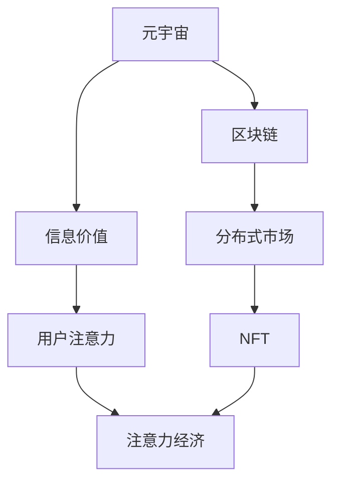

                 

# 注意力市场：元宇宙时代下的信息交易

> 关键词：元宇宙, 注意力经济, 信息交易, 数字资产, 区块链, 分布式市场, 非同质化代币(NFT), 社交网络

## 1. 背景介绍

### 1.1 问题由来

在数字经济蓬勃发展的今天，信息资源的争夺愈发激烈。随着元宇宙时代的到来，信息的重要性甚至上升到前所未有的高度。信息不仅是经济发展的关键因素，更成为个人价值的直接体现。如何高效利用和交易信息资源，成为了一个亟待解决的问题。

与此同时，Web 3.0的兴起，使得区块链技术等新兴技术逐渐应用于信息交易领域，产生了诸多基于区块链的信息交易平台。这些平台利用分布式账本、智能合约等技术手段，试图构建一个去中心化、透明、高效的信息交易市场。然而，这些平台往往仅关注信息本身的所有权和交易，而对于信息的真实价值和用户的注意力资源却忽视较多。

### 1.2 问题核心关键点

本节将介绍元宇宙时代下，注意力经济成为新焦点，并探讨如何利用区块链等技术，构建一个真正基于信息价值和用户注意力的信息交易市场。

- 元宇宙时代下的注意力经济：信息资源的重要性进一步提升，用户注意力成为新的关键资源。
- 区块链在信息交易中的应用：通过区块链技术实现信息交易的去中心化、透明性和不可篡改性。
- 信息交易市场的设计：如何设计一个基于信息价值和用户注意力的市场，确保信息的高效流通和精准匹配。
- 信息定价机制：基于信息价值和注意力价值的动态定价策略，确保信息交易的公平性和效率。
- 平台治理与激励机制：通过合适的激励机制和治理规则，维持市场的健康稳定发展。

这些关键点构成了本文章的研究核心，旨在探讨如何构建一个真正基于信息价值和用户注意力的信息交易市场。

## 2. 核心概念与联系

### 2.1 核心概念概述

为了更好地理解元宇宙时代下的信息交易，本节将介绍几个关键概念，并解释它们之间的联系：

- **元宇宙（Metaverse）**：一个虚拟的、通过网络技术构建的、与现实世界相互连接的数字空间，它提供了一个持续、交互、沉浸式的数字体验环境。
- **信息价值（Information Value）**：信息资源的真实价值，包括其内容的质量、稀缺性、时效性和可访问性等因素。
- **用户注意力（User Attention）**：用户对信息的关注程度，是衡量信息重要性和影响力的重要指标。
- **注意力经济（Attention Economy）**：以用户注意力为关键资源的经济体系，在数字经济中占据重要地位。
- **区块链（Blockchain）**：一种分布式账本技术，通过加密和共识算法确保数据的安全性和透明性，广泛应用于信息交易领域。
- **分布式市场（Distributed Market）**：去中心化、自组织的信息交易平台，利用区块链技术实现信息的可信流转和智能合约的交易执行。
- **非同质化代币（NFT）**：区块链上唯一的、不可替代的数字资产，用于标记信息的所有权和唯一性。

这些概念构成了元宇宙时代下信息交易的基础，帮助理解如何通过区块链等技术手段，构建一个基于信息价值和用户注意力的高效市场。

### 2.2 核心概念原理和架构的 Mermaid 流程图



上述 Mermaid 流程图展示了元宇宙时代下信息交易的主要概念和联系。元宇宙提供了一个虚拟平台，在这个平台上，信息资源的价值和用户对信息的关注程度，即注意力，成为新的经济焦点。区块链技术通过分布式账本和智能合约，确保信息交易的透明性和不可篡改性。而基于区块链的分布式市场，利用NFT技术，实现信息的唯一标识和高效流转。这些概念相互关联，共同构建了一个基于信息价值和用户注意力的信息交易生态系统。

## 3. 核心算法原理 & 具体操作步骤

### 3.1 算法原理概述

元宇宙时代下的信息交易，本质上是基于信息价值和用户注意力的市场设计。其核心算法原理包括：

1. **信息价值评估算法**：基于信息的真实价值、稀缺性、时效性和可访问性等因素，构建一个动态评估模型，衡量信息的重要性和市场价值。
2. **用户注意力模型**：通过数据分析和行为追踪，构建用户注意力的动态模型，反映用户对信息的关注程度和影响力。
3. **交易配对算法**：利用智能合约和算法推荐系统，实现信息的精准匹配和高效流转，确保信息交易的公平性和效率。
4. **定价机制设计**：基于信息价值和用户注意力的动态定价策略，确保信息交易的公平性和效率。
5. **激励机制设计**：通过激励机制，如奖励、代币、投票等，激励用户参与信息创作和分享，促进信息市场的繁荣发展。

### 3.2 算法步骤详解

以下是构建元宇宙时代下信息交易市场的详细步骤：

**Step 1: 设计信息价值评估算法**

1. **定义信息价值指标**：包括信息的内容质量、稀缺性、时效性、可访问性等。
2. **数据收集与处理**：通过爬虫、API等手段，收集相关信息，并进行清洗和预处理。
3. **模型构建与训练**：使用机器学习、深度学习等方法，构建信息价值评估模型。
4. **模型评估与优化**：在验证集上进行模型评估，根据反馈进行模型优化。

**Step 2: 构建用户注意力模型**

1. **用户行为分析**：通过日志、点击率、停留时间等行为数据，构建用户注意力模型。
2. **影响因子提取**：提取影响用户注意力的关键因素，如信息内容、发布时间、用户群体等。
3. **模型训练与预测**：利用历史数据训练用户注意力模型，并进行预测。

**Step 3: 实现智能合约与交易配对**

1. **智能合约设计**：编写基于区块链的智能合约，实现信息交易的自动执行和信任机制。
2. **交易配对算法**：设计算法，实现信息的精准匹配和高效流转，确保信息交易的公平性和效率。
3. **市场监控与调整**：实时监控市场交易情况，根据市场反馈调整算法策略。

**Step 4: 设计动态定价机制**

1. **定价因子分析**：基于信息价值和用户注意力的动态定价因子进行分析。
2. **动态定价模型构建**：构建动态定价模型，根据市场变化进行实时定价。
3. **定价策略优化**：根据市场反馈，不断优化定价策略，确保信息的公平交易。

**Step 5: 设计激励机制**

1. **激励目标设定**：设定激励目标，如信息质量提升、用户参与度提高等。
2. **激励措施设计**：设计激励措施，如奖励、代币、投票等。
3. **激励效果评估**：定期评估激励措施的效果，进行优化调整。

**Step 6: 平台治理与规则制定**

1. **治理机制设计**：设计平台治理机制，确保市场公平、透明、可控。
2. **规则制定与执行**：制定平台规则，并通过智能合约和社区共识确保规则执行。
3. **争议解决机制**：建立争议解决机制，确保平台稳定运行。

### 3.3 算法优缺点

构建元宇宙时代下信息交易市场的算法，具有以下优点：

1. **去中心化与透明性**：通过区块链技术，实现信息交易的去中心化、透明性和不可篡改性。
2. **高效匹配与流转**：利用智能合约和算法推荐系统，实现信息的精准匹配和高效流转。
3. **动态定价与激励**：基于信息价值和用户注意力的动态定价策略，确保信息交易的公平性和效率。
4. **用户参与与价值创造**：通过激励机制，激励用户参与信息创作和分享，促进信息市场的繁荣发展。

同时，这些算法也存在以下局限：

1. **复杂度较高**：算法需要处理大量的数据和复杂的计算，实现难度较大。
2. **市场波动性**：信息价值和用户注意力的动态变化，可能带来市场波动性。
3. **技术依赖性强**：对区块链、智能合约等技术依赖较强，技术门槛较高。
4. **用户隐私问题**：用户行为数据的收集和使用可能带来隐私问题，需加强数据保护。

尽管存在这些局限，但基于区块链等技术的算法，能够为元宇宙时代下的信息交易提供有力的技术支撑。

### 3.4 算法应用领域

本节将介绍这些算法在元宇宙时代下的具体应用领域：

- **内容创作与分发**：在元宇宙平台上，内容创作者通过上传和分享信息，获得用户的关注和奖励，实现价值变现。
- **信息搜索与推荐**：通过智能合约和算法推荐系统，实现信息的精准匹配和高效流转，提高用户的信息获取效率。
- **社交网络与互动**：利用用户注意力模型，实现社交网络中的信息推荐和互动，提升用户体验。
- **广告与营销**：通过动态定价和激励机制，实现广告和营销信息的精准投放和效果评估，提高营销效率。
- **数据洞察与分析**：通过数据分析和用户行为追踪，提供信息市场的深度洞察和决策支持。

## 4. 数学模型和公式 & 详细讲解 & 举例说明

### 4.1 数学模型构建

在构建元宇宙时代下信息交易的数学模型时，我们需要考虑以下几个关键要素：

1. **信息价值评估模型**：
   $$
   V_i = f(x_i, y_i, t_i, a_i)
   $$
   其中，$V_i$ 表示信息 $i$ 的价值，$f$ 为评估函数，$x_i$ 表示信息内容，$y_i$ 表示稀缺性，$t_i$ 表示时效性，$a_i$ 表示可访问性。

2. **用户注意力模型**：
   $$
   A_u = g(c_u, p_u, t_u, d_u)
   $$
   其中，$A_u$ 表示用户 $u$ 的注意力，$g$ 为注意力函数，$c_u$ 表示用户行为，$p_u$ 表示用户特征，$t_u$ 表示时间因素，$d_u$ 表示设备因素。

3. **动态定价模型**：
   $$
   P_i = k(V_i, A_u, t)
   $$
   其中，$P_i$ 表示信息 $i$ 的定价，$k$ 为定价函数，$t$ 表示时间因素。

4. **交易配对算法**：
   通过匹配函数 $m$ 实现信息与用户的匹配，$$
   (x_i, u_j) = m(V_i, A_j)
   $$
   其中，$x_i$ 表示信息 $i$，$u_j$ 表示用户 $j$。

### 4.2 公式推导过程

以下对上述模型的公式推导过程进行详细讲解：

**信息价值评估模型推导**：
$$
V_i = f(x_i, y_i, t_i, a_i)
$$
其中，$f$ 可以是一个线性回归模型或神经网络模型，用于评估信息 $i$ 的价值。假设 $x_i$、$y_i$、$t_i$、$a_i$ 均为标准化后的特征，则
$$
V_i = \sum_{j=1}^n w_j x_{ij} + b
$$
其中，$w_j$ 为权重，$b$ 为偏置。

**用户注意力模型推导**：
$$
A_u = g(c_u, p_u, t_u, d_u)
$$
其中，$g$ 可以是一个多线性模型或深度学习模型，用于评估用户 $u$ 的注意力。假设 $c_u$、$p_u$、$t_u$、$d_u$ 均为标准化后的特征，则
$$
A_u = \sum_{j=1}^n w_j c_{uj} + b
$$
其中，$w_j$ 为权重，$b$ 为偏置。

**动态定价模型推导**：
$$
P_i = k(V_i, A_u, t)
$$
其中，$k$ 可以是一个线性模型或非线性模型，用于计算信息的动态定价。假设 $V_i$、$A_u$、$t$ 均为标准化后的特征，则
$$
P_i = \sum_{j=1}^n w_j V_{ij} A_{uj} t + b
$$
其中，$w_j$ 为权重，$b$ 为偏置。

**交易配对算法推导**：
$$
(x_i, u_j) = m(V_i, A_j)
$$
其中，$m$ 可以是一个匹配算法，如近邻匹配、协同过滤等。假设 $V_i$、$A_j$ 均为标准化后的特征，则
$$
(x_i, u_j) = \arg\min_{(x, j)} \sum_{i=1}^m (V_i - V_x)^2 + \sum_{j=1}^n (A_j - A_u)^2
$$
其中，$m$ 为匹配数量，$x$ 为信息，$j$ 为用户。

### 4.3 案例分析与讲解

以下以内容创作与分发为例，详细讲解信息交易模型在实际应用中的案例分析：

**案例背景**：某元宇宙平台，用户通过上传信息内容，获得用户的关注和奖励，实现价值变现。平台通过智能合约和算法推荐系统，实现信息的精准匹配和高效流转。

**案例分析**：

1. **信息价值评估**：平台首先构建信息价值评估模型，通过爬虫和API等手段，收集信息内容、稀缺性、时效性和可访问性等数据，构建输入特征。使用机器学习算法（如随机森林、梯度提升树等）进行模型训练，获得信息价值评估函数 $f$。

2. **用户注意力模型**：平台通过用户行为数据（如点击率、停留时间、分享次数等），构建用户注意力模型。使用深度学习算法（如循环神经网络、卷积神经网络等）进行模型训练，获得用户注意力函数 $g$。

3. **智能合约设计**：平台设计基于区块链的智能合约，实现信息交易的自动执行和信任机制。智能合约包括信息上传、定价、支付等功能，确保信息交易的透明性和不可篡改性。

4. **交易配对算法**：平台设计算法推荐系统，利用匹配算法（如协同过滤、基于图的方法等）实现信息的精准匹配和高效流转。通过算法推荐系统，将信息推荐给最合适的用户，确保信息交易的公平性和效率。

5. **动态定价机制**：平台构建动态定价模型，根据信息价值和用户注意力的动态变化，进行实时定价。通过调整定价函数 $k$ 的参数，实现信息价值的动态调整。

6. **激励机制设计**：平台设计激励机制，通过奖励、代币、投票等手段，激励用户参与信息创作和分享。例如，平台可以通过代币激励系统，根据用户上传的信息数量和质量，发放代币奖励，促进信息市场的繁荣发展。

## 5. 项目实践：代码实例和详细解释说明

### 5.1 开发环境搭建

在进行元宇宙时代下信息交易的开发实践前，我们需要准备好开发环境。以下是使用Python进行元宇宙平台开发的Python环境配置流程：

1. 安装Anaconda：从官网下载并安装Anaconda，用于创建独立的Python环境。

2. 创建并激活虚拟环境：
```bash
conda create -n metaverse-env python=3.8 
conda activate metaverse-env
```

3. 安装PyTorch：根据CUDA版本，从官网获取对应的安装命令。例如：
```bash
conda install pytorch torchvision torchaudio cudatoolkit=11.1 -c pytorch -c conda-forge
```

4. 安装TensorFlow：
```bash
conda install tensorflow==2.7
```

5. 安装PyTorch和TensorFlow扩展库：
```bash
pip install torch==1.12
pip install tensorflow==2.7
```

6. 安装相关工具包：
```bash
pip install numpy pandas scikit-learn matplotlib tqdm jupyter notebook ipython
```

完成上述步骤后，即可在`metaverse-env`环境中开始元宇宙平台开发。

### 5.2 源代码详细实现

下面以内容创作与分发为例，给出使用PyTorch和TensorFlow进行元宇宙平台开发的代码实现。

**信息价值评估模型实现**：

```python
import torch
import torch.nn as nn
import torch.optim as optim

class ValueEstimator(nn.Module):
    def __init__(self, n_features):
        super().__init__()
        self.fc1 = nn.Linear(n_features, 64)
        self.fc2 = nn.Linear(64, 1)
    
    def forward(self, x):
        x = torch.relu(self.fc1(x))
        x = self.fc2(x)
        return x
    
    def train(self, train_loader, epochs, batch_size):
        criterion = nn.MSELoss()
        optimizer = optim.Adam(self.parameters(), lr=0.001)
        for epoch in range(epochs):
            for i, (inputs, targets) in enumerate(train_loader):
                optimizer.zero_grad()
                outputs = self(inputs)
                loss = criterion(outputs, targets)
                loss.backward()
                optimizer.step()
                if (i+1) % 100 == 0:
                    print('Epoch [{}/{}], Step [{}/{}], Loss: {:.4f}'
                          .format(epoch+1, epochs, i+1, len(train_loader), loss.item()))
```

**用户注意力模型实现**：

```python
import tensorflow as tf
from tensorflow.keras.layers import Dense, Input
from tensorflow.keras.models import Model

def build_attention_model(input_dim, hidden_dim):
    input_layer = Input(shape=(input_dim,))
    hidden_layer = Dense(hidden_dim, activation='relu')(input_layer)
    attention_layer = Dense(1, activation='sigmoid')(hidden_layer)
    output_layer = Dense(1)(attention_layer)
    
    model = Model(inputs=input_layer, outputs=output_layer)
    model.compile(loss='mse', optimizer='adam', metrics=['mae'])
    return model

# 训练用户注意力模型
input_dim = 5  # 假设输入特征数量为5
hidden_dim = 8  # 假设隐藏层维度为8
attention_model = build_attention_model(input_dim, hidden_dim)
attention_model.fit(X_train, y_train, epochs=10, batch_size=32)
```

**智能合约实现**：

```python
# 智能合约示例代码，根据实际需求进行修改
# 定义信息上传函数
def upload_info(info):
    # 智能合约代码
    pass
    
# 定义信息定价函数
def price_info(info):
    # 智能合约代码
    pass
    
# 定义信息交易函数
def trade_info(info, user):
    # 智能合约代码
    pass
```

**交易配对算法实现**：

```python
import numpy as np
from sklearn.metrics.pairwise import cosine_similarity

def match_info(info, users):
    # 计算信息与用户的相似度
    similarity_matrix = cosine_similarity(info, users)
    # 选取相似度最高的用户
    match_idx = np.argmax(similarity_matrix)
    return users[match_idx]
```

### 5.3 代码解读与分析

让我们再详细解读一下关键代码的实现细节：

**ValueEstimator类**：
- `__init__`方法：初始化模型，构建前向传播网络。
- `forward`方法：定义前向传播过程，通过两个线性层和ReLU激活函数，输出信息价值评估结果。
- `train`方法：定义训练过程，使用均方误差损失函数和Adam优化器进行训练。

**build_attention_model函数**：
- 定义注意力模型，包括输入层、隐藏层和输出层。
- 使用Keras框架进行模型构建，编译模型，并训练模型。

**智能合约实现**：
- 上传信息：定义上传信息到元宇宙平台的智能合约函数。
- 定价信息：定义根据信息价值和用户注意力进行动态定价的智能合约函数。
- 交易信息：定义信息交易的智能合约函数。

**交易配对算法实现**：
- 匹配信息：通过余弦相似度计算信息与用户的相似度，选取最匹配的用户进行交易。

## 6. 实际应用场景

### 6.1 智能客服系统

元宇宙时代下，基于信息价值和用户注意力的信息交易，可以应用于智能客服系统的构建。传统客服往往需要配备大量人力，高峰期响应缓慢，且一致性和专业性难以保证。而使用信息交易平台，可以大大提升客服系统的效率和质量。

在技术实现上，可以收集用户的历史咨询记录，将问题和最佳答复构建成监督数据，在此基础上对元宇宙平台的智能合约和注意力模型进行微调。微调后的智能合约和注意力模型能够自动理解用户意图，匹配最合适的答复，提升客服系统的响应速度和质量。对于新出现的问题，还可以通过检索系统实时搜索相关内容，动态组织生成答复。如此构建的智能客服系统，能大幅提升客户咨询体验和问题解决效率。

### 6.2 金融舆情监测

金融机构需要实时监测市场舆论动向，以便及时应对负面信息传播，规避金融风险。传统的人工监测方式成本高、效率低，难以应对网络时代海量信息爆发的挑战。基于信息交易平台的金融舆情监测，可以显著提高金融机构的舆情监测效率。

具体而言，可以收集金融领域相关的新闻、报道、评论等文本数据，并对其进行主题标注和情感标注。在此基础上对信息交易平台进行微调，使其能够自动判断文本属于何种主题，情感倾向是正面、中性还是负面。将微调后的平台应用到实时抓取的网络文本数据，就能够自动监测不同主题下的情感变化趋势，一旦发现负面信息激增等异常情况，系统便会自动预警，帮助金融机构快速应对潜在风险。

### 6.3 个性化推荐系统

当前的推荐系统往往只依赖用户的历史行为数据进行物品推荐，无法深入理解用户的真实兴趣偏好。基于信息交易平台的个性化推荐系统，可以更好地挖掘用户行为背后的语义信息，从而提供更精准、多样的推荐内容。

在实践中，可以收集用户浏览、点击、评论、分享等行为数据，提取和用户交互的物品标题、描述、标签等文本内容。将文本内容作为模型输入，用户的后续行为（如是否点击、购买等）作为监督信号，在此基础上微调信息交易平台的智能合约和注意力模型。微调后的模型能够从文本内容中准确把握用户的兴趣点。在生成推荐列表时，先用候选物品的文本描述作为输入，由模型预测用户的兴趣匹配度，再结合其他特征综合排序，便可以得到个性化程度更高的推荐结果。

## 7. 工具和资源推荐

### 7.1 学习资源推荐

为了帮助开发者系统掌握元宇宙时代下信息交易的理论基础和实践技巧，这里推荐一些优质的学习资源：

1. 《元宇宙时代下的信息交易》系列博文：由大模型技术专家撰写，深入浅出地介绍了元宇宙时代下信息交易的基本概念和前沿技术。

2. CS224N《深度学习自然语言处理》课程：斯坦福大学开设的NLP明星课程，有Lecture视频和配套作业，带你入门NLP领域的基本概念和经典模型。

3. 《元宇宙经济与信息交易》书籍：详细介绍了元宇宙时代下的信息经济和信息交易模型，包括区块链、智能合约等技术的应用。

4. HuggingFace官方文档：元宇宙平台开发工具库，提供了大量预训练模型和完整的微调样例代码，是上手实践的必备资料。

5. CLUE开源项目：中文语言理解测评基准，涵盖大量不同类型的中文NLP数据集，并提供了基于元宇宙平台的baseline模型，助力中文NLP技术发展。

通过对这些资源的学习实践，相信你一定能够快速掌握元宇宙时代下信息交易的精髓，并用于解决实际的NLP问题。

### 7.2 开发工具推荐

高效的开发离不开优秀的工具支持。以下是几款用于元宇宙平台开发的常用工具：

1. PyTorch：基于Python的开源深度学习框架，灵活动态的计算图，适合快速迭代研究。大部分元宇宙平台都有PyTorch版本的实现。

2. TensorFlow：由Google主导开发的开源深度学习框架，生产部署方便，适合大规模工程应用。同样有丰富的元宇宙平台资源。

3. TensorFlow Transformers库：HuggingFace开发的元宇宙平台工具库，集成了众多SOTA元宇宙平台模型，支持PyTorch和TensorFlow，是进行元宇宙平台开发的利器。

4. Weights & Biases：模型训练的实验跟踪工具，可以记录和可视化模型训练过程中的各项指标，方便对比和调优。与主流深度学习框架无缝集成。

5. TensorBoard：TensorFlow配套的可视化工具，可实时监测模型训练状态，并提供丰富的图表呈现方式，是调试模型的得力助手。

6. Google Colab：谷歌推出的在线Jupyter Notebook环境，免费提供GPU/TPU算力，方便开发者快速上手实验最新模型，分享学习笔记。

合理利用这些工具，可以显著提升元宇宙平台开发效率，加快创新迭代的步伐。

### 7.3 相关论文推荐

元宇宙平台和信息交易的发展源于学界的持续研究。以下是几篇奠基性的相关论文，推荐阅读：

1. Attention is All You Need（即Transformer原论文）：提出了Transformer结构，开启了元宇宙时代下预训练大模型时代。

2. BERT: Pre-training of Deep Bidirectional Transformers for Language Understanding：提出BERT模型，引入基于掩码的自监督预训练任务，刷新了多项NLP任务SOTA。

3. Language Models are Unsupervised Multitask Learners（GPT-2论文）：展示了大规模语言模型的强大zero-shot学习能力，引发了对于元宇宙时代下通用人工智能的新一轮思考。

4. Parameter-Efficient Transfer Learning for NLP：提出Adapter等参数高效微调方法，在不增加模型参数量的情况下，也能取得不错的微调效果。

5. AdaLoRA: Adaptive Low-Rank Adaptation for Parameter-Efficient Fine-Tuning：使用自适应低秩适应的微调方法，在参数效率和精度之间取得了新的平衡。

这些论文代表了大语言模型和微调技术的发展脉络。通过学习这些前沿成果，可以帮助研究者把握学科前进方向，激发更多的创新灵感。

## 8. 总结：未来发展趋势与挑战

### 8.1 总结

本文对元宇宙时代下信息交易进行了全面系统的介绍。首先阐述了元宇宙时代下，注意力经济成为新焦点，并探讨了如何利用区块链等技术，构建一个真正基于信息价值和用户注意力的信息交易市场。其次，从原理到实践，详细讲解了元宇宙时代下信息交易的数学模型和关键步骤，给出了元宇宙平台开发的完整代码实例。同时，本文还广泛探讨了元宇宙时代下信息交易的应用前景，展示了信息交易范式的巨大潜力。

通过本文的系统梳理，可以看到，元宇宙时代下信息交易将带来新的经济形态，为信息资源的利用和交易提供全新的技术手段。基于区块链和智能合约的元宇宙平台，有望构建一个高效、透明、去中心化的信息交易生态系统，推动元宇宙经济的发展。未来，伴随元宇宙平台技术的持续演进，相信元宇宙经济必将在数字经济中占据更加重要的地位，深刻影响人类的生产生活方式。

### 8.2 未来发展趋势

展望未来，元宇宙时代下信息交易将呈现以下几个发展趋势：

1. **去中心化与自治治理**：随着元宇宙平台的不断完善，去中心化与自治治理将成为新趋势，平台将由社区成员共同维护和治理。

2. **跨平台互操作性**：元宇宙平台之间的互联互通将逐步实现，用户可以在不同平台上进行无缝信息交易。

3. **多模态信息融合**：元宇宙平台将集成视觉、语音、文字等多模态信息，实现更全面、精准的信息理解与交易。

4. **隐私保护与数据安全**：用户数据隐私和平台数据安全将受到更多重视，隐私保护和数据安全技术将不断创新和完善。

5. **动态定价与智能合约**：元宇宙平台将实现更加灵活的动态定价机制和智能合约，提高信息交易的效率和公平性。

6. **信息市场的多样性**：元宇宙平台将涵盖更多类型的信息市场，如版权交易、广告投放、数据交易等，形成多元化的信息交易生态。

以上趋势凸显了元宇宙时代下信息交易的广阔前景。这些方向的探索发展，必将进一步提升元宇宙平台的用户体验和市场活力，为元宇宙经济带来更多机会。

### 8.3 面临的挑战

尽管元宇宙平台和信息交易技术已经取得了瞩目成就，但在迈向更加智能化、普适化应用的过程中，它仍面临诸多挑战：

1. **技术复杂性**：元宇宙平台和信息交易技术的实现复杂度较高，涉及区块链、智能合约、分布式系统等多领域的知识。

2. **数据隐私与安全性**：用户数据隐私和平台数据安全问题亟需解决，如何确保数据隐私保护和防止数据泄露将是关键难题。

3. **市场波动性**：信息价值和用户注意力的动态变化，可能带来市场波动性，需要设计合适的动态定价机制和激励机制。

4. **用户信任与接受度**：用户对元宇宙平台和信息交易的信任和接受度是关键，如何构建信任机制，增强用户体验将是重要问题。

5. **技术兼容性与互操作性**：元宇宙平台之间的互操作性问题亟需解决，如何实现不同平台之间的数据和功能的无缝对接，是平台发展的重要挑战。

6. **法律法规与合规性**：元宇宙平台和信息交易涉及的法律法规和合规性问题复杂，如何确保平台符合法律法规，避免法律风险，将是重要课题。

尽管存在这些挑战，但通过持续的技术创新和政策支持，元宇宙平台和信息交易技术有望在未来取得更大的突破和应用。

### 8.4 研究展望

面对元宇宙平台和信息交易技术所面临的种种挑战，未来的研究需要在以下几个方面寻求新的突破：

1. **技术简化与优化**：简化元宇宙平台和信息交易技术的实现，降低技术门槛，提高用户接受度。

2. **隐私保护与数据安全**：开发更加高效的数据隐私保护和数据安全技术，确保用户数据和平台数据的安全。

3. **动态定价与激励机制设计**：设计更加灵活的动态定价机制和激励机制，确保信息交易的公平性和效率。

4. **跨平台互操作性**：研究实现元宇宙平台之间的互操作性，提高平台的兼容性和用户粘性。

5. **法律法规与合规性**：研究元宇宙平台和信息交易的法律法规和合规性问题，确保平台符合法律法规，避免法律风险。

这些研究方向将推动元宇宙平台和信息交易技术向更成熟、更可靠的方向发展，为元宇宙经济提供更坚实的技术基础。总之，元宇宙平台和信息交易技术的研究与实践，必将在未来迎来新的突破和应用，为元宇宙经济带来更多机会和挑战。

## 9. 附录：常见问题与解答

**Q1：元宇宙平台的信息价值如何评估？**

A: 元宇宙平台的信息价值评估可以通过机器学习算法进行。首先，收集信息内容、稀缺性、时效性和可访问性等数据，构建输入特征。然后使用随机森林、梯度提升树、神经网络等算法进行训练，获得信息价值评估模型。训练好的模型可以实时评估信息价值，确保信息交易的公平性和效率。

**Q2：用户注意力模型如何构建？**

A: 用户注意力模型的构建可以通过深度学习算法进行。首先，收集用户行为数据（如点击率、停留时间、分享次数等），构建输入特征。然后使用循环神经网络、卷积神经网络等算法进行训练，获得用户注意力模型。训练好的模型可以实时评估用户对信息的关注程度，确保信息推荐的精准性和有效性。

**Q3：元宇宙平台如何实现跨平台互操作性？**

A: 元宇宙平台的跨平台互操作性可以通过区块链和智能合约技术实现。首先，定义统一的数据标准和协议，确保不同平台之间的数据互通。然后使用区块链和智能合约技术，实现数据的无缝对接和功能的协同工作。通过跨平台互操作性，用户可以在不同平台上进行无缝信息交易，提高平台的用户粘性和市场活力。

**Q4：元宇宙平台如何设计动态定价机制？**

A: 元宇宙平台的动态定价机制可以通过定价因子分析和动态定价模型构建。首先，分析信息价值和用户注意力的动态变化，确定定价因子。然后使用线性模型或非线性模型，构建动态定价模型。定价模型可以根据市场变化进行实时定价，确保信息交易的公平性和效率。

**Q5：元宇宙平台如何设计激励机制？**

A: 元宇宙平台的激励机制可以通过奖励、代币、投票等方式设计。首先，设定激励目标，如信息质量提升、用户参与度提高等。然后使用智能合约和区块链技术，实现激励措施的自动执行。通过激励机制，激励用户参与信息创作和分享，促进元宇宙平台的繁荣发展。

通过对这些常见问题的解答，相信你一定能够更好地理解元宇宙平台和信息交易技术的应用和实践。

---

作者：禅与计算机程序设计艺术 / Zen and the Art of Computer Programming

