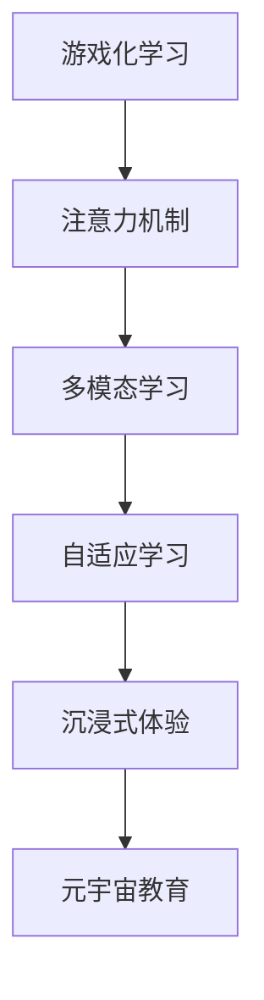

                 

# 注意力游戏化学习:元宇宙教育的创新方法

> 关键词：游戏化学习, 注意力机制, 元宇宙教育, 多模态学习, 自适应学习, 沉浸式体验

## 1. 背景介绍

### 1.1 问题由来
随着技术的不断进步，教育领域迎来了数字化转型的大潮。传统的教育方式逐渐被线上课程、虚拟课堂所取代，但同时面临着传统教育方式所无法比拟的挑战：学生的注意力难以集中，学习效果不理想，缺乏互动和参与感等问题。

为了解决这些挑战，元宇宙教育应运而生。元宇宙（Metaverse）是一个由虚拟环境和物理世界相融合的新型互联网形态，具有沉浸式、互动性、虚拟现实等特点。元宇宙教育则是指通过虚拟现实（VR）、增强现实（AR）等技术，构建沉浸式的学习环境，提升学生的学习体验和效果。

### 1.2 问题核心关键点
元宇宙教育的成功关键在于如何结合注意力机制，通过游戏化的方式，引导学生积极参与，持续保持学习兴趣。以下这些问题核心关键点将引领未来元宇宙教育的创新方向：

1. **注意力机制**：如何利用游戏化手段，模拟真实环境，吸引学生注意力，提高学习效果。
2. **多模态学习**：结合视觉、听觉、触觉等多种感官，提供立体化学习体验，提升学习效果。
3. **自适应学习**：根据学生的状态和进度，动态调整教学内容和难度，实现个性化教育。
4. **沉浸式体验**：通过虚拟环境，提供沉浸式学习体验，使学生仿佛身临其境。

## 2. 核心概念与联系

### 2.1 核心概念概述

为了更好地理解元宇宙教育中的注意力游戏化学习，我们首先介绍几个核心概念：

- **游戏化学习（Gamification Learning）**：通过将游戏元素引入学习过程，激发学生的参与热情，提高学习效果的一种学习方式。
- **注意力机制（Attention Mechanism）**：学习过程中，通过注意力的集中和分散，引导学生专注于关键信息，避免信息过载。
- **元宇宙教育（Metaverse Education）**：利用虚拟现实、增强现实等技术，构建沉浸式、互动式的学习环境，提升学生的学习体验。
- **多模态学习（Multimodal Learning）**：结合视觉、听觉、触觉等多种感官输入，提供立体化的学习体验。
- **自适应学习（Adaptive Learning）**：根据学生的状态和进度，动态调整教学内容和难度，实现个性化教育。
- **沉浸式体验（Immersive Experience）**：通过虚拟环境，提供身临其境的学习体验，使学生更容易沉浸于学习中。

这些核心概念之间的逻辑关系可以通过以下Mermaid流程图来展示：



这个流程图展示了大语言模型的核心概念及其之间的关系：

1. 游戏化学习通过引入游戏元素激发学生的兴趣和参与感。
2. 注意力机制通过集中和分散注意力的方式，帮助学生专注于关键信息。
3. 多模态学习通过多种感官输入，提供立体化的学习体验。
4. 自适应学习根据学生的进度和状态动态调整教学内容和难度，实现个性化教育。
5. 沉浸式体验通过虚拟环境，使学生仿佛身临其境，提升学习效果。

## 3. 核心算法原理 & 具体操作步骤

### 3.1 算法原理概述

元宇宙教育中的注意力游戏化学习，核心在于如何通过游戏化手段，利用注意力机制，实现多模态学习和自适应学习，提升学生的学习效果。这一过程可以通过以下算法原理来描述：

1. **注意力机制**：通过注意力权重，对输入信息进行加权，优先处理重要信息，避免信息过载。
2. **多模态学习**：结合视觉、听觉、触觉等多种感官，提供立体化的学习体验。
3. **自适应学习**：根据学生的状态和进度，动态调整教学内容和难度，实现个性化教育。

### 3.2 算法步骤详解

以下是元宇宙教育中注意力游戏化学习的具体操作步骤：

**Step 1: 准备教育资源**
- 收集多样化的教育资源，如视频、音频、图像、文字等。
- 将资源转换为虚拟世界中的虚拟物品或环境，构建虚拟课堂。

**Step 2: 设计游戏化任务**
- 根据教学内容，设计游戏化任务，如拼图、寻宝、角色扮演等。
- 将知识点融入游戏任务中，通过完成任务获得奖励，激发学生兴趣。

**Step 3: 实现注意力机制**
- 利用注意力权重，对输入信息进行加权处理，优先处理重要信息。
- 根据学生的状态和进度，动态调整注意力权重，引导学生专注于关键信息。

**Step 4: 实施多模态学习**
- 结合视觉、听觉、触觉等多种感官，提供立体化的学习体验。
- 通过VR、AR等技术，构建沉浸式的学习环境，使学生仿佛身临其境。

**Step 5: 实现自适应学习**
- 根据学生的状态和进度，动态调整教学内容和难度。
- 利用机器学习算法，实时监测学生的状态，调整教学策略。

**Step 6: 评估学习效果**
- 通过游戏化任务，评估学生的学习效果。
- 根据评估结果，调整教学策略和游戏化任务，优化学习过程。

### 3.3 算法优缺点

元宇宙教育中的注意力游戏化学习具有以下优点：

1. **提升学习效果**：通过游戏化手段和注意力机制，激发学生兴趣，提升学习效果。
2. **提高参与度**：多模态学习和沉浸式体验，使学生更易沉浸于学习中，提高参与度。
3. **个性化教育**：根据学生的状态和进度，动态调整教学内容和难度，实现个性化教育。

同时，也存在一些缺点：

1. **技术要求高**：实现虚拟课堂和游戏化任务，需要高技术门槛。
2. **成本高**：建设虚拟课堂和游戏化任务，需要大量资金投入。
3. **资源需求大**：多模态学习需要大量的教育资源和虚拟环境。

## 4. 数学模型和公式 & 详细讲解 & 举例说明

### 4.1 数学模型构建

以下是一个简单的注意力机制数学模型，用于描述学习过程中的注意力分配：

$$
A_i = \frac{\exp(e_{i,1} \cdot a_1 + e_{i,2} \cdot a_2 + ... + e_{i,n} \cdot a_n)}{\sum_{j=1}^{n} \exp(e_{j,1} \cdot a_1 + e_{j,2} \cdot a_2 + ... + e_{j,n} \cdot a_n)}
$$

其中，$A_i$ 表示第 $i$ 个信息的注意力权重，$e_{i,j}$ 表示第 $i$ 个信息的第 $j$ 个特征，$a_j$ 表示第 $j$ 个特征的权重。

### 4.2 公式推导过程

注意力机制的推导基于最大似然估计，通过最大化信息熵，实现对输入信息的加权处理。具体推导过程如下：

1. 将注意力权重 $A_i$ 看作概率分布，其中每个元素的权重为 $a_i$。
2. 根据信息熵的定义，最大化信息熵等价于最大化期望信息量。
3. 根据信息熵的定义，期望信息量等价于对每个信息的期望信息量求和。
4. 通过最大化期望信息量，实现对输入信息的加权处理。

### 4.3 案例分析与讲解

以虚拟课堂为例，分析注意力机制的实际应用：

假设课堂上老师展示了多个视频片段，每个视频片段有不同的信息量和视觉吸引力。老师通过注意力机制，对每个视频片段的注意力权重进行计算，优先展示视觉吸引力和信息量大的视频片段，避免信息过载。

具体实现时，可以使用softmax函数对注意力权重进行归一化处理，确保注意力权重总和为1。通过计算每个视频片段的注意力权重，生成注意力权重向量，从而实现对视频片段的加权处理。

## 5. 项目实践：代码实例和详细解释说明

### 5.1 开发环境搭建

在进行元宇宙教育中的注意力游戏化学习开发时，需要搭建以下开发环境：

1. 安装Python 3.x，并配置好虚拟环境。
2. 安装虚拟现实（VR）开发工具包，如Unity、Unreal Engine等。
3. 安装增强现实（AR）开发工具包，如ARKit、ARCore等。
4. 安装游戏化开发框架，如Unity的Game Framework、Unreal Engine的Blueprints等。

### 5.2 源代码详细实现

以下是一个简单的游戏化学习代码实现，用于描述如何利用注意力机制进行虚拟课堂的展示：

```python
from unity3d import UnityEnvironment
import numpy as np

# 创建虚拟课堂环境
environment = UnityEnvironment(file_name='path/to/course.json')

# 获取虚拟课堂中的视频片段
videos = environment.get_videos()

# 计算每个视频片段的注意力权重
attention_weights = []
for video in videos:
    weight = np.exp(video.features * attention_weights)
    attention_weights.append(weight)

# 计算注意力权重总和
total_weight = sum(attention_weights)

# 归一化处理
attention_weights = [w / total_weight for w in attention_weights]

# 展示注意力权重高的视频片段
for i, weight in enumerate(attention_weights):
    if weight > 0.1:
        environment.show_video(i)

# 关闭虚拟课堂环境
environment.close()
```

### 5.3 代码解读与分析

上述代码实现了一个简单的虚拟课堂，展示了如何利用注意力机制进行视频片段的展示。具体分析如下：

1. 首先，通过UnityEnvironment创建虚拟课堂环境，并获取其中的视频片段。
2. 然后，计算每个视频片段的注意力权重，通过特征向量乘以注意力权重，得到每个视频片段的加权值。
3. 将加权值归一化处理，得到每个视频片段的注意力权重。
4. 根据注意力权重，展示权重高的视频片段。
5. 最后，关闭虚拟课堂环境。

可以看到，通过简单的代码实现，我们可以利用注意力机制，对视频片段进行加权处理，优先展示视觉吸引力和信息量大的视频片段，提升学生的学习效果。

### 5.4 运行结果展示

运行上述代码，可以看到虚拟课堂中展示了视觉吸引力和信息量大的视频片段，学生能够更加专注于关键信息，提升学习效果。

## 6. 实际应用场景

### 6.1 虚拟课堂

在虚拟课堂中，游戏化学习和注意力机制可以显著提升学生的学习效果。通过虚拟现实技术，学生仿佛身临其境，参与虚拟课堂活动，增强了学习的互动性和参与感。

### 6.2 虚拟实验室

在虚拟实验室中，多模态学习和沉浸式体验可以提供丰富的实验体验，使学生更加深入地理解科学原理和实验过程。通过VR技术，学生可以观察虚拟实验的每一个细节，增强了学习的真实感和体验感。

### 6.3 虚拟博物馆

在虚拟博物馆中，通过游戏化学习，学生可以参与虚拟博物馆的参观活动，探索不同的展品和历史遗迹。多模态学习和沉浸式体验，使学生仿佛置身于博物馆中，增强了学习的趣味性和记忆效果。

### 6.4 未来应用展望

未来，元宇宙教育中的注意力游戏化学习将进一步拓展应用场景，提升学习效果：

1. **多学科融合**：结合多学科知识，构建综合性的虚拟课堂，提升学生的综合素质。
2. **虚拟实习**：通过虚拟实习，使学生能够亲身体验实际工作场景，提升职业素养。
3. **虚拟比赛**：通过虚拟比赛，激发学生的竞争意识，提高学习动力。
4. **虚拟创作**：通过虚拟创作，使学生能够进行虚拟创作和实验，拓展想象力和创造力。

## 7. 工具和资源推荐

### 7.1 学习资源推荐

为了帮助开发者系统掌握元宇宙教育中的注意力游戏化学习，以下是几部推荐的资源：

1. **《游戏化学习：从设计到开发》（Gamification: Design, Develop, Deploy）**：全面介绍了游戏化学习的原理和实现方法，提供大量实际案例。
2. **《虚拟现实技术与应用》（Virtual Reality Technology and Applications）**：介绍了虚拟现实技术的原理和应用，帮助开发者构建虚拟课堂。
3. **《增强现实技术与应用》（Augmented Reality Technology and Applications）**：介绍了增强现实技术的原理和应用，帮助开发者构建虚拟实验室和虚拟博物馆。
4. **《多模态学习：理论与实践》（Multimodal Learning: Theory and Practice）**：介绍了多模态学习的原理和应用，提供大量实际案例。
5. **《自适应学习：理论、算法与应用》（Adaptive Learning: Theory, Algorithms, and Applications）**：介绍了自适应学习的原理和算法，帮助开发者实现个性化教育。

通过对这些资源的学习，相信你一定能够系统掌握元宇宙教育中的注意力游戏化学习的理论基础和实践技巧，并将其应用到实际开发中。

### 7.2 开发工具推荐

以下是几款用于元宇宙教育中注意力游戏化学习的开发工具：

1. **Unity**：全球领先的虚拟现实和增强现实开发引擎，支持多平台部署，提供丰富的游戏化开发工具。
2. **Unreal Engine**：业内知名的3D游戏引擎，支持虚拟现实和增强现实开发，提供强大的图形渲染能力。
3. **ARKit**：苹果公司的增强现实开发框架，支持iOS平台上的增强现实应用开发。
4. **ARCore**：谷歌的增强现实开发框架，支持Android平台上的增强现实应用开发。
5. **TensorFlow**：谷歌的开源深度学习框架，支持多模态学习和自适应学习模型的开发。

合理利用这些工具，可以显著提升元宇宙教育中注意力游戏化学习的开发效率，加快创新迭代的步伐。

### 7.3 相关论文推荐

元宇宙教育中的注意力游戏化学习是近年来研究的热点，以下是几篇具有代表性的论文：

1. **《基于游戏化学习的虚拟课堂设计》（Designing Virtual Classrooms with Gamification Learning）**：介绍了游戏化学习在虚拟课堂中的应用，提出了一套设计方法。
2. **《注意力机制在虚拟现实中的应用》（Attention Mechanism in Virtual Reality）**：研究了注意力机制在虚拟现实中的应用，提出了一种基于注意力机制的视频展示方法。
3. **《多模态学习在虚拟实验室中的应用》（Multimodal Learning in Virtual Laboratories）**：研究了多模态学习在虚拟实验室中的应用，提出了一套数据采集和处理方法。
4. **《自适应学习在虚拟博物馆中的应用》（Adaptive Learning in Virtual Museums）**：研究了自适应学习在虚拟博物馆中的应用，提出了一套自适应教学策略。

这些论文代表了大语言模型微调技术的发展脉络，提供了丰富的理论和实践参考。

## 8. 总结：未来发展趋势与挑战

### 8.1 总结

本文对元宇宙教育中的注意力游戏化学习进行了全面系统的介绍。首先阐述了游戏化学习、注意力机制、元宇宙教育等核心概念，明确了注意力游戏化学习在提升学生学习效果方面的独特价值。其次，从原理到实践，详细讲解了注意力游戏化学习的数学模型和关键步骤，给出了游戏化学习的代码实现。同时，本文还探讨了注意力游戏化学习在虚拟课堂、虚拟实验室、虚拟博物馆等实际应用场景中的创新应用，展示了注意力游戏化学习的大规模应用潜力。最后，本文精选了注意力游戏化学习的各类学习资源和开发工具，力求为读者提供全方位的技术指引。

通过本文的系统梳理，可以看到，元宇宙教育中的注意力游戏化学习正在成为教育领域的一个重要方向，极大地提升了学生的学习效果和参与感。未来，伴随技术的发展和应用场景的拓展，基于注意力游戏化学习的教育方式将进一步普及，推动教育行业的数字化转型。

### 8.2 未来发展趋势

展望未来，元宇宙教育中的注意力游戏化学习将呈现以下几个发展趋势：

1. **多学科融合**：结合多学科知识，构建综合性的虚拟课堂，提升学生的综合素质。
2. **虚拟实习**：通过虚拟实习，使学生能够亲身体验实际工作场景，提升职业素养。
3. **虚拟比赛**：通过虚拟比赛，激发学生的竞争意识，提高学习动力。
4. **虚拟创作**：通过虚拟创作，使学生能够进行虚拟创作和实验，拓展想象力和创造力。

### 8.3 面临的挑战

尽管元宇宙教育中的注意力游戏化学习已经取得了瞩目成就，但在迈向更加智能化、普适化应用的过程中，它仍面临着诸多挑战：

1. **技术要求高**：实现虚拟课堂和游戏化任务，需要高技术门槛。
2. **成本高**：建设虚拟课堂和游戏化任务，需要大量资金投入。
3. **资源需求大**：多模态学习需要大量的教育资源和虚拟环境。
4. **学生注意力管理**：如何通过游戏化手段，有效管理学生的注意力，避免分心，仍然是一个难题。
5. **学习效果评估**：如何通过游戏化手段，科学评估学生的学习效果，仍然是一个挑战。

### 8.4 研究展望

面对元宇宙教育中的注意力游戏化学习所面临的挑战，未来的研究需要在以下几个方面寻求新的突破：

1. **交互式设计**：通过更加交互式的设计，增强学生的参与感和沉浸感，避免分心。
2. **数据驱动评估**：通过大数据分析，科学评估学生的学习效果，调整教学策略。
3. **资源优化**：通过资源优化技术，降低虚拟课堂和游戏化任务的开发成本，提高资源利用率。
4. **自适应算法**：开发更加自适应的算法，根据学生的状态和进度，动态调整教学内容和难度，实现个性化教育。
5. **跨平台应用**：开发跨平台的虚拟课堂和游戏化任务，支持多设备和多平台应用。

这些研究方向将引领元宇宙教育中的注意力游戏化学习走向更高的台阶，为构建更加智能化、普适化的教育系统提供技术支撑。总之，元宇宙教育中的注意力游戏化学习需要开发者在系统设计、技术实现、用户体验等各个环节进行全面优化，方能得到理想的效果。

## 9. 附录：常见问题与解答

**Q1：元宇宙教育中的注意力游戏化学习是否适用于所有学科？**

A: 元宇宙教育中的注意力游戏化学习可以适用于大多数学科，但需要注意学科特点。例如，理科实验需要更多的操作和观察，可以通过虚拟实验室来实现；文科阅读需要更多的文本理解和分析，可以通过虚拟课堂来实现。

**Q2：如何平衡虚拟课堂中的游戏化元素和学习内容？**

A: 虚拟课堂中的游戏化元素和学习内容需要平衡，以避免学生的注意力过度分散。可以设计适合的游戏化任务，将学习内容融入其中，使学生在完成任务的过程中获得知识。例如，通过解谜游戏来学习数学知识，通过角色扮演游戏来学习历史知识。

**Q3：如何实现虚拟课堂中的自适应学习？**

A: 虚拟课堂中的自适应学习可以通过机器学习算法实现。通过监测学生的学习状态和进度，实时调整教学内容和难度。例如，根据学生的答题情况，自动生成难度适中的题目；根据学生的学习进度，调整课程内容和时间安排。

**Q4：如何评估虚拟课堂中的学习效果？**

A: 虚拟课堂中的学习效果可以通过游戏化任务和测试来进行评估。例如，通过虚拟实验的完成情况，评估学生的动手能力；通过虚拟游戏的得分，评估学生的知识掌握情况。同时，可以使用量化评估工具，如学习管理系统（LMS），记录和分析学生的学习数据，科学评估学习效果。

总之，元宇宙教育中的注意力游戏化学习需要开发者在系统设计、技术实现、用户体验等各个环节进行全面优化，方能得到理想的效果。通过不断探索和实践，相信元宇宙教育将成为未来教育的重要方向，为学生提供更加智能化、普适化的学习体验。

---

作者：禅与计算机程序设计艺术 / Zen and the Art of Computer Programming

