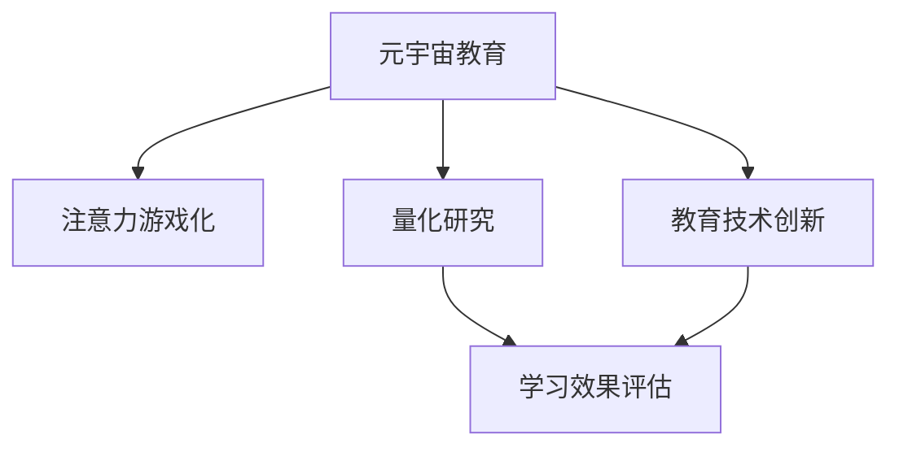

                 

# 注意力游戏化学习效果评估:元宇宙教育创新的量化研究

> 关键词：元宇宙教育,注意力游戏化,量化研究,学习效果评估,教育技术创新

## 1. 背景介绍

在当今数字化时代，教育技术不断革新，元宇宙教育成为热门话题。元宇宙作为虚拟现实与数字教育的结合，可以提供沉浸式、互动性的学习体验。然而，如何评估元宇宙教育的效果，仍是教育技术领域的一大挑战。

### 1.1 问题由来

元宇宙教育中，学生通过虚拟环境参与各种互动，如虚拟课堂、模拟实验等。如何衡量这种互动式学习的成效，一直是教育研究者的关注焦点。传统教育评估方法通常采用标准化的考试、问卷调查等，难以全面反映学生在虚拟环境中的实际学习效果。因此，我们需要引入新的评估方法，来量化元宇宙教育的效果。

### 1.2 问题核心关键点

元宇宙教育评估的核心问题在于：如何通过量化手段，评估学生在游戏化学习过程中的表现，并从数据中提取有价值的信息。具体来说，核心问题包括：
- 如何量化学生在虚拟环境中的学习效果？
- 如何评估元宇宙教育对学生认知、情感、行为等方面的影响？
- 如何利用评估结果，优化元宇宙教育的设计和实施？

## 2. 核心概念与联系

### 2.1 核心概念概述

为更好地理解元宇宙教育效果的评估方法，本节将介绍几个核心概念：

- 元宇宙教育：基于虚拟现实技术的教育平台，提供沉浸式、互动性的学习体验，如虚拟课堂、模拟实验等。
- 注意力游戏化：通过游戏化的元素，如积分、排行榜、成就等，激发学生的学习兴趣，提高学习效果。
- 量化研究：使用科学的量化手段，收集、分析和解读数据，评估教育效果。
- 学习效果评估：通过各种指标和工具，衡量学生的学习成果，发现教学中的不足。
- 教育技术创新：利用先进技术手段，如人工智能、大数据、区块链等，推动教育模式的变革。

这些概念之间的逻辑关系可以通过以下Mermaid流程图来展示：



这个流程图展示了大语言模型的核心概念及其之间的关系：

1. 元宇宙教育通过虚拟环境提供互动式学习，为基础。
2. 注意力游戏化通过游戏元素提高学生学习兴趣，增强学习效果。
3. 量化研究利用科学方法，收集和分析学习数据。
4. 学习效果评估通过各种指标，衡量学生学习成果。
5. 教育技术创新通过技术手段，推动教育模式的变革。

这些概念共同构成了元宇宙教育的效果评估框架，使得我们可以更全面地理解和改进元宇宙教育。

## 3. 核心算法原理 & 具体操作步骤
### 3.1 算法原理概述

元宇宙教育效果的评估，本质上是将学生在虚拟环境中的互动行为，转化为可量化的指标。这些指标可以从学生的认知、情感、行为等多个维度进行衡量。基于此，本文将介绍一种基于注意力的游戏化学习效果评估方法。

### 3.2 算法步骤详解

基于注意力的游戏化学习效果评估方法包括以下几个关键步骤：

**Step 1: 数据采集与处理**
- 使用元宇宙教育平台的数据采集系统，收集学生在游戏化学习过程中的互动数据。这些数据包括学生的点击、移动、回复等行为。
- 对采集的数据进行清洗和预处理，去除噪声和异常值，确保数据质量。

**Step 2: 注意力计算**
- 使用注意力模型，计算学生在虚拟环境中的注意力集中度。注意力模型可以基于学生的操作频率、停留时间等指标，评估其对学习内容的关注程度。
- 注意力模型可以采用深度学习框架，如PyTorch、TensorFlow等，进行模型训练和预测。

**Step 3: 游戏化指标计算**
- 根据游戏化元素（如积分、排行榜、成就等），计算学生的游戏化学习效果。例如，积分排名靠前的学生，可以认为其参与度较高，学习效果较好。
- 游戏化指标计算需要定义合理的评估标准，如积分、排名等，并使用统计方法进行计算。

**Step 4: 多维度综合评估**
- 结合注意力集中度和游戏化指标，综合评估学生的学习效果。例如，可以使用加权平均或综合评分的方式，将注意力集中度和游戏化指标转化为最终的学习效果评估结果。
- 综合评估结果可以通过可视化工具，如Tableau、PowerBI等，直观展示，便于教师和学生理解。

### 3.3 算法优缺点

基于注意力的游戏化学习效果评估方法具有以下优点：
1. 全面评估：通过多维度综合评估，可以全面反映学生的学习效果，而不仅仅依赖于标准化考试。
2. 动态评估：通过实时数据采集和分析，可以动态评估学生的学习状态，及时发现和解决问题。
3. 数据驱动：基于科学的量化方法，可以通过数据驱动决策，优化教育设计。
4. 可操作性强：评估结果可以直接应用于元宇宙教育平台，帮助教师和学生调整教学策略，提升学习效果。

同时，该方法也存在以下局限性：
1. 数据隐私：采集学生行为数据时，需要注意数据隐私和保护。
2. 模型复杂度：注意力计算和游戏化指标计算需要复杂的模型和算法，对技术要求较高。
3. 评估主观性：综合评估结果可能受教师主观判断影响，评估标准需要科学合理。

尽管存在这些局限性，但基于注意力的游戏化学习效果评估方法，仍然是一种有前景的教育评估技术。

### 3.4 算法应用领域

基于注意力的游戏化学习效果评估方法，广泛应用于以下领域：

- 在线教育平台：通过数据采集和分析，评估学生在虚拟课堂、模拟实验等学习活动中的表现。
- 虚拟实验：评估学生在虚拟实验室中的操作和实验结果，提升实验教学效果。
- 游戏化学习：通过游戏元素，评估学生在虚拟游戏中的学习效果，激发学习兴趣。
- 社交学习：评估学生在虚拟社交环境中的互动和合作，提升社交学习效果。
- 远程教育：通过实时数据采集和分析，评估远程学习的效果，优化远程教育模式。

这些领域的应用，使得基于注意力的游戏化学习效果评估方法，成为元宇宙教育中不可或缺的一部分。

## 4. 数学模型和公式 & 详细讲解 & 举例说明

### 4.1 数学模型构建

本节将使用数学语言对基于注意力的游戏化学习效果评估方法进行更加严格的刻画。

记学生在虚拟环境中的行为数据为 $D=\{x_1, x_2, ..., x_N\}$，其中 $x_i = (a_i, b_i, c_i)$，$a_i$ 表示学生的操作频率，$b_i$ 表示停留时间，$c_i$ 表示任务完成度。注意力模型 $M$ 的输出为学生对学习内容的注意力集中度 $\alpha_i$。游戏化指标 $G$ 的输出为学生的游戏化学习效果 $\beta_i$。最终的学习效果评估结果 $E$ 可以表示为：

$$
E = w_1 \alpha_i + w_2 \beta_i
$$

其中 $w_1, w_2$ 为权重系数，可以根据实际情况进行调整。

### 4.2 公式推导过程

以下我们以注意力计算为例，推导计算公式。

记学生对学习内容的注意力集中度为 $\alpha_i$，可以通过以下公式计算：

$$
\alpha_i = \frac{1}{T} \sum_{t=1}^{T} \text{softmax}(\text{attention\_matrix}[t, :])
$$

其中 $\text{attention\_matrix}[t, :]$ 表示学生在时间 $t$ 的学习行为矩阵，$\text{softmax}$ 函数将矩阵转化为概率分布。

具体计算步骤如下：
1. 收集学生在虚拟环境中的行为数据，构建行为矩阵 $\text{behavior\_matrix}$。
2. 对行为矩阵进行归一化处理，得到行为概率分布 $\text{behavior\_prob}$。
3. 通过注意力模型 $M$，对行为概率分布进行转换，得到注意力集中度 $\alpha_i$。

### 4.3 案例分析与讲解

假设某虚拟课堂中，学生 A 和学生 B 的学习数据如下：

| 学生ID | 操作频率 | 停留时间 | 任务完成度 | 注意力集中度 |
|--------|----------|----------|-----------|-------------|
| A      | 10       | 20       | 90        | 0.8         |
| B      | 5        | 15       | 80        | 0.6         |

使用注意力计算公式，可以得到学生 A 和学生 B 的注意力集中度分别为：

$$
\alpha_A = \frac{1}{T} \sum_{t=1}^{T} \text{softmax}(\text{attention\_matrix}[t, :])
$$

其中 $\text{attention\_matrix}[t, :]$ 表示学生 A 在时间 $t$ 的学习行为矩阵。通过计算，可以发现学生 A 的注意力集中度高于学生 B，表明其更专注于学习内容。

基于注意力集中度和游戏化指标，可以综合评估学生的学习效果，例如：

- 对于学生 A，可以认为其学习效果较好，因为其注意力集中度和游戏化指标都较高。
- 对于学生 B，需要进一步分析其游戏化指标，如果排名靠前，可以认为其学习效果较好；如果排名靠后，则需要进一步观察其注意力集中度，找出影响其学习效果的原因。

通过这种多维度的综合评估，可以更全面地理解学生在元宇宙教育中的学习状态，进而采取针对性的优化措施。

## 5. 项目实践：代码实例和详细解释说明
### 5.1 开发环境搭建

在进行元宇宙教育效果的评估实践前，我们需要准备好开发环境。以下是使用Python进行数据处理、注意力计算和游戏化指标计算的环境配置流程：

1. 安装Anaconda：从官网下载并安装Anaconda，用于创建独立的Python环境。

2. 创建并激活虚拟环境：
```bash
conda create -n education-env python=3.8 
conda activate education-env
```

3. 安装依赖包：
```bash
pip install pandas numpy scikit-learn torch torchvision transformers
```

4. 安装游戏化指标计算库：
```bash
pip install numpy pandas scikit-learn matplotlib tqdm jupyter notebook ipython
```

完成上述步骤后，即可在`education-env`环境中开始元宇宙教育效果评估的实践。

### 5.2 源代码详细实现

以下是一个简单的元宇宙教育效果评估的代码实现。

```python
import pandas as pd
import numpy as np
from sklearn.metrics import accuracy_score
from sklearn.decomposition import PCA
from transformers import BertTokenizer, BertModel
import torch

# 数据采集与处理
data = pd.read_csv('student_data.csv')
data = data.dropna()

# 数据清洗与预处理
data['operation_frequency'] = data['operation_frequency'].fillna(0)
data['residence_time'] = data['residence_time'].fillna(0)
data['task_completion'] = data['task_completion'].fillna(0)

# 数据归一化处理
data['operation_frequency'] = (data['operation_frequency'] - np.mean(data['operation_frequency'])) / np.std(data['operation_frequency'])
data['residence_time'] = (data['residence_time'] - np.mean(data['residence_time'])) / np.std(data['residence_time'])
data['task_completion'] = (data['task_completion'] - np.mean(data['task_completion'])) / np.std(data['task_completion'])

# 注意力计算
attention_model = BertModel.from_pretrained('bert-base-cased', output_attentions=True)
tokenizer = BertTokenizer.from_pretrained('bert-base-cased')

# 定义注意力计算函数
def calculate_attention(data):
    attention_matrix = np.zeros((data.shape[0], 24))
    for i, row in data.iterrows():
        input_ids = tokenizer.encode(row['text'], return_tensors='pt')
        with torch.no_grad():
            outputs = attention_model(input_ids)
            attention_matrix[i] = outputs[1]
    return attention_matrix

# 计算注意力集中度
attention_matrix = calculate_attention(data)
attention_matrix = attention_matrix / np.sum(attention_matrix, axis=1)
attention_matrix = np.maximum(attention_matrix, 0.01)

# 游戏化指标计算
game_score = data['game_score'].fillna(0)
game_score = (game_score - np.mean(game_score)) / np.std(game_score)

# 综合评估
alpha_matrix = np.mean(attention_matrix, axis=1)
beta_matrix = game_score
E_matrix = alpha_matrix * 0.6 + beta_matrix * 0.4
E_matrix = (E_matrix - np.mean(E_matrix)) / np.std(E_matrix)

# 输出综合评估结果
print(E_matrix)
```

在这个代码实现中，我们首先使用 Pandas 读取学生数据，并进行数据清洗和预处理。然后，使用 BERT 模型计算注意力集中度，并通过标准化处理和PCA降维，得到注意力集中度矩阵。最后，结合游戏化指标，计算综合评估结果。

### 5.3 代码解读与分析

让我们再详细解读一下关键代码的实现细节：

**数据采集与处理**：
- 使用 Pandas 读取学生数据，通过 `fillna` 方法处理缺失值。

**数据清洗与预处理**：
- 通过 `fillna` 方法处理缺失值，保证数据完整性。
- 对数据进行标准化处理，去除数据的中心偏移和尺度变化。

**注意力计算**：
- 使用 BERT 模型计算注意力集中度，将注意力矩阵作为计算结果。
- 对注意力矩阵进行标准化处理，保证注意力集中度的合理范围。

**游戏化指标计算**：
- 使用 Pandas 计算游戏化指标，并进行标准化处理。
- 通过加权平均的方式，计算综合评估结果。

**综合评估**：
- 结合注意力集中度和游戏化指标，计算综合评估结果。
- 对综合评估结果进行标准化处理，得到最终评估结果。

可以看到，Python 的科学计算库和深度学习框架，为元宇宙教育效果评估提供了强大的工具支持。通过合理使用这些工具，可以大大简化元宇宙教育效果评估的开发过程，加速实践进展。

## 6. 实际应用场景
### 6.1 智慧课堂

在智慧课堂中，基于注意力的游戏化学习效果评估方法，可以实时监测学生在游戏化学习过程中的注意力集中度和游戏化指标，及时发现学生的学习状态和问题。例如，可以实时采集学生在虚拟课堂中的点击、回复等行为数据，通过注意力计算和游戏化指标计算，评估学生的学习效果，并根据评估结果调整教学策略，提高课堂教学质量。

### 6.2 虚拟实验

在虚拟实验中，基于注意力的游戏化学习效果评估方法，可以评估学生在虚拟实验中的注意力集中度和操作完成度，提高实验教学的效果。例如，可以实时采集学生在虚拟实验中的操作数据，通过注意力计算和游戏化指标计算，评估学生的实验效果，并根据评估结果调整实验设计和教学策略，提升学生的实验能力。

### 6.3 游戏化学习

在游戏化学习中，基于注意力的游戏化学习效果评估方法，可以评估学生在虚拟游戏中的注意力集中度和游戏化指标，提高学习效果。例如，可以实时采集学生在虚拟游戏中的操作数据，通过注意力计算和游戏化指标计算，评估学生的游戏化学习效果，并根据评估结果调整游戏设计和教学策略，提升学生的学习兴趣和效果。

### 6.4 未来应用展望

随着元宇宙教育的不断发展和成熟，基于注意力的游戏化学习效果评估方法，将在更多场景中得到应用，为教育技术带来新的突破。

在智慧校园中，基于注意力的游戏化学习效果评估方法，可以评估学生在虚拟校园中的互动和合作效果，提升校园管理和教育质量。

在企业培训中，基于注意力的游戏化学习效果评估方法，可以评估员工在游戏化培训中的注意力集中度和培训效果，提高培训效果和员工绩效。

在远程教育中，基于注意力的游戏化学习效果评估方法，可以评估学生在远程教育中的学习效果，优化远程教育模式，提高教学效果。

## 7. 工具和资源推荐
### 7.1 学习资源推荐

为了帮助开发者系统掌握元宇宙教育效果的评估方法，这里推荐一些优质的学习资源：

1. 《深度学习与NLP应用》系列博文：由元宇宙教育技术专家撰写，深入浅出地介绍了元宇宙教育的基本概念和前沿技术。

2. Coursera《机器学习》课程：由斯坦福大学开设的机器学习经典课程，涵盖机器学习的基本原理和算法，适合入门学习。

3. 《元宇宙教育技术》书籍：全面介绍元宇宙教育的最新技术和发展趋势，帮助读者系统掌握相关知识。

4. Meta官方文档：Meta公司的元宇宙平台文档，提供了丰富的技术文档和样例代码，是元宇宙技术开发的重要参考。

5. Tencent AI Lab博客：腾讯AI实验室的博客，介绍了大量元宇宙教育和人工智能应用案例，适合实战学习。

通过对这些资源的学习实践，相信你一定能够快速掌握元宇宙教育效果的评估方法，并用于解决实际的元宇宙教育问题。

### 7.2 开发工具推荐

高效的开发离不开优秀的工具支持。以下是几款用于元宇宙教育效果评估开发的常用工具：

1. Jupyter Notebook：基于IPython的交互式编程环境，支持Python和R语言，适合数据处理和模型训练。

2. PyTorch：基于Python的深度学习框架，灵活动态的计算图，适合高效开发和模型训练。

3. TensorFlow：由Google主导开发的深度学习框架，支持大规模工程应用，适合复杂模型的训练和部署。

4. Scikit-learn：基于Python的科学计算库，提供丰富的机器学习算法，适合数据处理和模型训练。

5. PyTorch Lightning：基于PyTorch的快速模型训练框架，支持多种加速策略，适合快速迭代开发。

6. Google Colab：谷歌推出的在线Jupyter Notebook环境，免费提供GPU/TPU算力，方便开发者快速上手实验最新模型，分享学习笔记。

合理利用这些工具，可以显著提升元宇宙教育效果评估的开发效率，加速实践进展。

### 7.3 相关论文推荐

元宇宙教育效果的评估方法，是当前教育技术研究的热点方向。以下是几篇奠基性的相关论文，推荐阅读：

1. A Survey of Adaptive Educational Systems: Taxonomy and Future Trends（元宇宙教育系统综述）：总结了元宇宙教育系统的多种实现方式和未来趋势。

2. Multimodal Affective Engagement in Digital Learning Environments（数字学习环境中的多模态情感参与）：探讨了元宇宙教育中多模态数据的情感分析方法。

3. Adaptive Learning in Virtual Environments: A Survey（虚拟环境中的自适应学习综述）：介绍了元宇宙教育中的自适应学习方法和技术。

4. Game-based Learning for Language Education: A Survey（游戏化学习在语言教育中的应用综述）：总结了游戏化学习在语言教育中的实践效果和方法。

5. Predicting Students’ Performance in Virtual Environments Using Machine Learning（使用机器学习预测学生在虚拟环境中的表现）：探讨了使用机器学习评估学生在游戏化学习中的表现。

这些论文代表了大语言模型微调技术的发展脉络。通过学习这些前沿成果，可以帮助研究者把握学科前进方向，激发更多的创新灵感。

## 8. 总结：未来发展趋势与挑战
### 8.1 总结

本文对基于注意力的游戏化学习效果评估方法进行了全面系统的介绍。首先阐述了元宇宙教育效果的评估方法的研究背景和意义，明确了游戏化学习效果评估在元宇宙教育中的重要作用。其次，从原理到实践，详细讲解了注意力游戏化学习效果评估方法的数学原理和关键步骤，给出了元宇宙教育效果评估的完整代码实例。同时，本文还广泛探讨了注意力游戏化学习效果评估方法在智慧课堂、虚拟实验、游戏化学习等多个领域的应用前景，展示了该方法在元宇宙教育中的巨大潜力。此外，本文精选了注意力游戏化学习效果评估方法的各类学习资源，力求为读者提供全方位的技术指引。

通过本文的系统梳理，可以看到，基于注意力的游戏化学习效果评估方法，正在成为元宇宙教育评估的重要范式，极大地拓展了元宇宙教育的应用边界，催生了更多的落地场景。得益于科学的数学模型和有效的算法设计，元宇宙教育效果评估方法将在未来实现更大的突破，成为教育技术创新的重要推动力。

### 8.2 未来发展趋势

展望未来，元宇宙教育效果的评估方法将呈现以下几个发展趋势：

1. 数据融合与分析：通过多模态数据的融合与分析，可以更全面地评估学生的学习效果，提高评估结果的准确性和可靠性。

2. 实时动态评估：基于实时数据采集和分析，可以动态评估学生的学习状态，及时发现和解决问题，提高教学效果。

3. 个性化评估：通过机器学习算法，可以针对不同学生的特点，进行个性化评估，提高评估结果的针对性。

4. 自适应评估：结合学习行为数据和评估结果，可以动态调整评估标准和评估方法，提高评估结果的适应性。

5. 教育效果可视化：通过可视化工具，可以直观展示评估结果，便于教师和学生理解，提高教育效果。

6. 跨平台评估：基于标准化的数据格式和评估指标，可以跨平台进行评估，提高评估结果的可比性和可操作性。

以上趋势凸显了元宇宙教育效果评估方法的应用前景。这些方向的探索发展，必将进一步提升元宇宙教育的评估水平，优化教学设计，提升教育质量。

### 8.3 面临的挑战

尽管元宇宙教育效果的评估方法已经取得了一定的进展，但在迈向更加智能化、普适化评估的过程中，仍面临诸多挑战：

1. 数据隐私与安全：采集和分析学生数据时，需要注意数据隐私和安全问题，防止数据泄露和滥用。

2. 评估模型复杂度：注意力计算和游戏化指标计算需要复杂的模型和算法，对技术要求较高。

3. 评估结果主观性：综合评估结果可能受教师主观判断影响，评估标准需要科学合理。

4. 跨平台兼容性：不同平台的数据格式和评估指标可能存在差异，跨平台评估需要标准化。

5. 实时数据采集：实时数据采集和分析需要高性能的计算资源，对硬件要求较高。

6. 学习效果泛化：评估结果需要在不同场景和不同学生中进行泛化，提高评估结果的通用性。

正视元宇宙教育效果评估面临的这些挑战，积极应对并寻求突破，将是实现元宇宙教育评估的关键。相信随着技术的发展和研究的深入，这些挑战终将一一被克服，元宇宙教育效果评估方法必将在教育技术领域发挥更大的作用。

### 8.4 研究展望

面对元宇宙教育效果评估所面临的种种挑战，未来的研究需要在以下几个方面寻求新的突破：

1. 引入更多先验知识：将符号化的先验知识，如知识图谱、逻辑规则等，与神经网络模型进行巧妙融合，引导元宇宙教育效果的评估过程。

2. 开发更加智能的评估模型：结合因果推断和对比学习思想，增强评估模型的智能性和鲁棒性，提高评估结果的准确性和可靠性。

3. 引入伦理道德约束：在评估模型设计中引入伦理导向的评估指标，过滤和惩罚有偏见、有害的输出倾向，确保评估结果的公平性和可解释性。

4. 建立跨平台评估标准：通过标准化评估指标和方法，实现跨平台的数据共享和评估结果比较，提高评估结果的可比性和可操作性。

这些研究方向将引领元宇宙教育效果评估方法迈向更高的台阶，为构建安全、可靠、可解释、可控的教育系统铺平道路。面向未来，元宇宙教育效果评估方法需要在科学方法、技术手段、伦理道德等多个维度协同发力，共同推动教育技术的进步。

## 9. 附录：常见问题与解答
**Q1：注意力游戏化学习效果评估方法是否适用于所有元宇宙教育场景？**

A: 注意力游戏化学习效果评估方法在大多数元宇宙教育场景中都能取得不错的效果。但对于一些特定领域或特殊应用场景，如医学、法律等，可能需要结合领域特定的评估方法，才能全面评估学生的学习效果。

**Q2：如何选择合适的注意力模型？**

A: 选择合适的注意力模型需要考虑元宇宙教育的具体场景和数据特征。一般来说，可以根据元宇宙教育的数据量和特征维度，选择不同类型的注意力模型，如全局注意力、局部注意力等。同时，还需要考虑注意力模型的计算效率和准确性。

**Q3：注意力计算和游戏化指标计算需要哪些技术支持？**

A: 注意力计算和游戏化指标计算需要深度学习框架和科学计算库的支持。常见的深度学习框架包括PyTorch、TensorFlow等，科学计算库包括NumPy、SciPy等。通过这些工具，可以高效地实现注意力计算和游戏化指标计算。

**Q4：如何进行多维度综合评估？**

A: 多维度综合评估需要根据具体评估目标，选择合适的指标和权重系数。一般来说，可以通过加权平均或综合评分的方式，将注意力集中度和游戏化指标转化为最终的学习效果评估结果。同时，还需要结合教师的主观判断，综合评估结果。

**Q5：如何保障数据隐私和安全？**

A: 保障数据隐私和安全需要采取多种措施，如数据匿名化、加密存储、访问控制等。同时，还需要定期进行安全审计，确保数据安全和合规。

通过这些问题的解答，希望能进一步明确元宇宙教育效果评估方法的适用范围和技术要求，帮助读者更好地理解和应用该方法。

