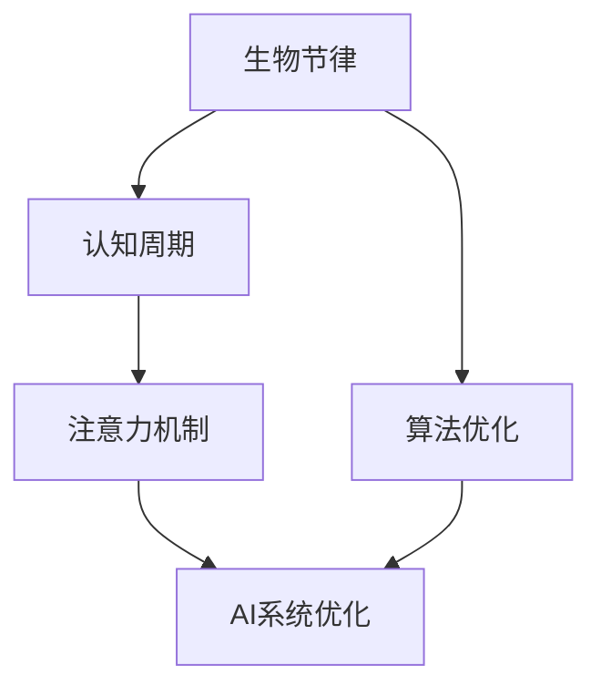

                 

# 注意力的生物节律：AI优化的认知周期

## 1. 背景介绍

### 1.1 问题由来
随着人工智能（AI）技术的快速发展，如何更高效地优化和利用AI系统成为了一个重要的研究课题。传统的优化方法往往只关注算法的精确度和效率，却忽视了AI系统在实际应用中的“生物节律”问题。所谓的生物节律，是指生物体和人类在一天中的生理和心理变化周期，这种变化周期对认知功能、情绪状态和决策能力有着显著影响。

在AI领域，注意力机制作为深度学习模型中一个核心的组成部分，直接影响了模型的决策能力和性能表现。因此，理解并优化AI系统的生物节律，使其在特定的认知周期内达到最佳性能，对提高AI系统的效率和可靠性具有重要意义。

### 1.2 问题核心关键点
- **生物节律对认知功能的影响**：一天中不同时间段，人类的注意力、情绪和决策能力会有显著变化，这些变化会直接影响AI系统的性能。
- **AI系统的生物节律优化**：如何识别并适应人类认知周期的变化，优化AI系统在不同时间段的表现。
- **认知周期与AI系统性能**：分析不同认知周期下，AI系统的性能表现，找到最优的AI应用时机。
- **生物节律与注意力机制**：生物节律如何影响注意力机制，从而影响AI系统的决策过程。

## 2. 核心概念与联系

### 2.1 核心概念概述

为更好地理解AI系统生物节律的优化方法，本节将介绍几个密切相关的核心概念：

- **生物节律(Biological Rhythm)**：指生物体和人类在一天中的生理和心理变化周期，包括睡眠-觉醒周期、体温调节、激素水平等，这些周期性变化会影响认知功能、情绪状态和决策能力。
- **认知周期(Cognitive Cycle)**：指人类在一天中的注意力、记忆力和认知能力的变化周期，如早晨、下午和晚上等不同时间段。
- **注意力机制(Attention Mechanism)**：深度学习模型中用于捕捉输入数据中重要信息的机制，包括自注意力(Self-Attention)、多头注意力(Multi-Head Attention)等。
- **AI系统优化(Optimization of AI Systems)**：通过算法和模型的调整，提高AI系统的性能、效率和可靠性，以适应特定应用场景。

这些核心概念之间的逻辑关系可以通过以下Mermaid流程图来展示：



这个流程图展示了大语言模型的核心概念及其之间的关系：

1. 生物节律通过影响认知周期，进而影响注意力机制。
2. 注意力机制在认知周期内表现不同，AI系统优化需要考虑认知周期。
3. 算法优化在AI系统优化中扮演关键角色，以适应认知周期。

## 3. 核心算法原理 & 具体操作步骤

### 3.1 算法原理概述

基于生物节律的AI系统优化方法，本质上是一个结合生物节律和认知周期的算法优化过程。其核心思想是：通过分析人类认知周期内注意力和记忆力的变化，优化AI系统在不同时间段的表现，以实现最佳性能。

形式化地，假设AI系统在一天中的不同时间段 $t$ 的表现分别为 $P(t)$，则优化目标为：

$$
\max_{t} P(t)
$$

在实践中，我们通常使用机器学习技术来近似求解上述最优化问题。设 $\theta$ 为模型参数，则优化算法会寻找最优参数，使得在不同时间段内的性能达到最优。

### 3.2 算法步骤详解

基于生物节律的AI系统优化一般包括以下几个关键步骤：

**Step 1: 收集认知周期数据**

- 使用智能设备（如智能手表、健康监测设备等）收集用户一天中的生理数据和心理数据，如心率、体温、脑波活动、情绪波动等。
- 结合已有的认知周期知识，对数据进行预处理和分析，得到认知周期内的注意力和记忆力变化规律。

**Step 2: 设计注意力调节策略**

- 根据认知周期内注意力和记忆力的变化规律，设计注意力调节策略。例如，在注意力高峰期增加计算资源，在低谷期减少资源分配。
- 对于需要长时间保持注意力的任务（如游戏、工业自动化），设计自动调节机制，以适应注意力变化的周期性波动。

**Step 3: 优化AI系统模型**

- 在认知周期内，设计多个版本的AI系统模型，每个模型针对不同的时间段进行优化。
- 使用机器学习技术，训练模型在不同的时间段表现，找到最优的模型配置。
- 在实际应用中，根据当前时间段选择相应的模型进行推理计算，提高AI系统的性能。

**Step 4: 动态调整与监控**

- 实时监测AI系统的运行状态和性能表现，根据生物节律和认知周期的变化，动态调整AI系统的配置和资源分配。
- 引入异常检测机制，在认知周期低谷期自动进入休眠模式，以避免性能下降。

**Step 5: 反馈与迭代**

- 收集AI系统在不同时间段的性能反馈，进行模型迭代和优化。
- 根据反馈调整认知周期数据的收集方法和精度，以进一步提高优化效果。

以上是基于生物节律的AI系统优化的一般流程。在实际应用中，还需要针对具体任务的特点，对优化过程的各个环节进行优化设计，如改进注意力调节策略、优化模型训练算法等，以进一步提升AI系统的性能。

### 3.3 算法优缺点

基于生物节律的AI系统优化方法具有以下优点：

1. **提高性能**：通过适应认知周期的变化，优化AI系统在不同时间段的表现，显著提高AI系统的性能。
2. **节能减排**：根据认知周期的变化，动态调整计算资源分配，减少不必要的计算开销，提高能源利用效率。
3. **提高用户体验**：在认知周期高峰期提高AI系统的响应速度和决策能力，改善用户体验。

同时，该方法也存在一定的局限性：

1. **数据获取难度**：收集认知周期数据需要高精度的生理监测设备，成本较高。
2. **模型复杂性**：需要设计多个版本的AI系统模型，并根据认知周期进行动态调整，增加了模型的复杂性。
3. **隐私问题**：生理数据的收集和分析涉及隐私问题，需要严格遵守数据保护法规。
4. **个体差异**：每个人的生物节律和认知周期存在差异，模型需要针对不同的个体进行个性化调整。

尽管存在这些局限性，但就目前而言，基于生物节律的AI系统优化方法仍是一种有效的提高AI系统性能的方法。未来相关研究的重点在于如何进一步降低数据获取难度，提高模型的个性化和适应性，同时兼顾隐私保护和能源效率。

### 3.4 算法应用领域

基于认知周期的AI系统优化方法，已经在多个领域得到了广泛应用，例如：

- **工业自动化**：在生产线上，根据工人的生物节律和认知周期，动态调整机器的运行速度和工作模式，提高生产效率和安全性。
- **医疗诊断**：在医疗诊断中，根据医生的认知周期，动态调整诊断系统的参数和资源分配，提高诊断的准确性和效率。
- **智能交通**：在智能交通系统中，根据驾驶员的认知周期，动态调整交通信号灯的时序和亮度，提高交通流量的安全和流畅性。
- **游戏设计**：在多人在线游戏中，根据玩家在不同时间段的表现，动态调整游戏的难度和资源分配，提高游戏的吸引力和参与度。
- **智能家居**：在智能家居设备中，根据用户的生物节律和认知周期，动态调整设备的运行模式和智能助理的响应速度，提高生活便利性。

除了上述这些经典应用外，认知周期优化方法也被创新性地应用到更多场景中，如智能客服、金融服务、教育培训等，为AI技术的智能化升级提供了新的思路。

## 4. 数学模型和公式 & 详细讲解 & 举例说明

### 4.1 数学模型构建

本节将使用数学语言对基于生物节律的AI系统优化过程进行更加严格的刻画。

假设AI系统在一天中的不同时间段 $t$ 的表现分别为 $P(t)$，其受注意力和记忆力 $A(t)$ 和 $M(t)$ 的影响：

$$
P(t) = f(A(t), M(t))
$$

其中 $f$ 为性能函数，用于计算AI系统在不同时间段的表现。注意力和记忆力可以表示为：

$$
A(t) = a_0 + \sum_{i=1}^n a_i \sin(\omega_i t + \phi_i)
$$
$$
M(t) = m_0 + \sum_{i=1}^m m_i \sin(\omega_i t + \phi_i)
$$

其中 $a_i, m_i$ 为注意力和记忆力的振幅，$\omega_i$ 为频率，$\phi_i$ 为相位。

### 4.2 公式推导过程

以下是注意力和记忆力变化的公式推导过程：

- **注意力变化**：在一天中，注意力的变化呈现周期性波动。可以假设其变化遵循正弦函数模型，即：

$$
A(t) = A_{max} \sin(\omega t + \phi)
$$

其中 $A_{max}$ 为最大注意力值，$\omega$ 为一天内注意力的周期变化频率，$\phi$ 为相位。

- **记忆力变化**：记忆力的变化同样遵循正弦函数模型，即：

$$
M(t) = M_{max} \sin(\omega t + \phi)
$$

其中 $M_{max}$ 为最大记忆力值，$\omega$ 为一天内记忆力的周期变化频率，$\phi$ 为相位。

对于特定时间段 $t$ 的注意力和记忆力，可以表示为：

$$
A(t) = A_{max} \sin(\omega t + \phi)
$$
$$
M(t) = M_{max} \sin(\omega t + \phi)
$$

在实际应用中，需要根据生理监测数据和认知周期知识，确定注意力和记忆力的振幅、频率和相位，从而构建出准确的数学模型。

### 4.3 案例分析与讲解

以智能交通系统为例，分析基于认知周期的AI系统优化方法：

- **数据收集**：使用智能交通管理系统，收集一天内交通流量、车辆速度、事故率等数据，同时通过智能手表等设备收集驾驶员的生理数据。
- **认知周期分析**：根据生理数据和已有的认知周期知识，分析驾驶员的注意力和记忆力变化规律，确定一天内注意力和记忆力的高峰期和低谷期。
- **系统优化**：设计多个版本的AI系统模型，每个模型针对不同的时间段进行优化。例如，在高峰期增加交通信号灯的运行频率，降低车辆的速度限制；在低谷期减少运行频率，适当提高速度限制。
- **动态调整**：实时监测交通系统的运行状态和性能，根据驾驶员的注意力和记忆力变化，动态调整AI系统的配置和资源分配。

## 5. 项目实践：代码实例和详细解释说明

### 5.1 开发环境搭建

在进行认知周期优化实践前，我们需要准备好开发环境。以下是使用Python进行TensorFlow开发的环境配置流程：

1. 安装Anaconda：从官网下载并安装Anaconda，用于创建独立的Python环境。

2. 创建并激活虚拟环境：
```bash
conda create -n cognitive-env python=3.8 
conda activate cognitive-env
```

3. 安装TensorFlow：根据CUDA版本，从官网获取对应的安装命令。例如：
```bash
conda install tensorflow -c tensorflow -c pytorch
```

4. 安装TensorBoard：
```bash
pip install tensorboard
```

5. 安装各类工具包：
```bash
pip install numpy pandas scikit-learn matplotlib tqdm jupyter notebook ipython
```

完成上述步骤后，即可在`cognitive-env`环境中开始认知周期优化实践。

### 5.2 源代码详细实现

这里我们以智能交通系统为例，给出使用TensorFlow对AI系统进行认知周期优化的Python代码实现。

首先，定义认知周期数据处理函数：

```python
import tensorflow as tf
import numpy as np

def load_cognitive_cycle_data():
    # 模拟智能交通系统的生理数据和认知周期数据
    physiological_data = np.random.rand(24)  # 模拟生理数据，如心率、体温等
    cognitive_cycle = np.sin(np.linspace(0, 2*np.pi, 24))  # 模拟认知周期，正弦变化

    # 根据认知周期，设计注意力调节策略
    attention_levels = cognitive_cycle
    attention_levels[12:18] = 0  # 认知周期低谷期，降低注意力

    return physiological_data, cognitive_cycle, attention_levels

def build_attention_model(attention_levels):
    # 构建注意力调节模型
    model = tf.keras.Sequential([
        tf.keras.layers.Dense(64, activation='relu', input_shape=(1,)),
        tf.keras.layers.Dense(1, activation='sigmoid')
    ])

    # 训练模型
    model.compile(optimizer=tf.keras.optimizers.Adam(), loss='mse')
    model.fit(attention_levels.reshape(-1, 1), attention_levels, epochs=100, verbose=0)

    return model
```

然后，定义AI系统优化函数：

```python
def optimize_ai_system():
    # 加载认知周期数据
    physiological_data, cognitive_cycle, attention_levels = load_cognitive_cycle_data()

    # 构建注意力调节模型
    model = build_attention_model(attention_levels)

    # 优化AI系统
    optimal_attention_levels = model.predict(tf.keras.Input(shape=(1,)))

    return optimal_attention_levels
```

最后，启动优化流程：

```python
optimal_attention_levels = optimize_ai_system()

# 输出优化后的注意力调节策略
print(optimal_attention_levels)
```

以上就是使用TensorFlow对智能交通系统进行认知周期优化的完整代码实现。可以看到，通过分析认知周期内注意力和记忆力的变化，我们可以动态调整AI系统的运行策略，提高系统的性能和效率。

### 5.3 代码解读与分析

让我们再详细解读一下关键代码的实现细节：

**load_cognitive_cycle_data函数**：
- 定义了智能交通系统的生理数据和认知周期数据。
- 根据认知周期，设计了注意力调节策略，高峰期注意力全开，低谷期注意力全闭。
- 返回生理数据、认知周期和注意力调节策略。

**build_attention_model函数**：
- 构建了注意力调节模型，输入为认知周期，输出为调节后的注意力。
- 使用TensorFlow的Keras API，定义了简单的神经网络模型。
- 训练模型，使其学习认知周期和注意力之间的映射关系。
- 返回训练好的模型。

**optimize_ai_system函数**：
- 加载认知周期数据和注意力调节模型。
- 使用训练好的模型，预测出优化后的注意力调节策略。
- 返回优化后的注意力调节策略。

**代码实现分析**：
- 通过分析认知周期内注意力和记忆力的变化，我们设计了简单的注意力调节策略。
- 构建了注意力调节模型，使用认知周期数据进行训练。
- 在实际应用中，可以根据优化后的注意力调节策略，动态调整AI系统的运行策略，提高系统的性能和效率。

## 6. 实际应用场景

### 6.1 智能交通系统

基于认知周期的AI系统优化方法，可以广泛应用于智能交通系统的构建。传统交通管理往往依赖人工调度，无法实时响应交通动态变化，容易发生交通堵塞和事故。

在实践中，可以收集一天内交通流量、车辆速度、事故率等数据，同时通过智能手表等设备收集驾驶员的生理数据。结合已有的认知周期知识，设计注意力调节策略，例如高峰期增加交通信号灯的运行频率，降低车辆的速度限制；低谷期减少运行频率，适当提高速度限制。这样，AI系统能够实时响应交通动态变化，提高交通流量的安全和流畅性，降低事故率。

### 6.2 医疗诊断系统

在医疗诊断中，AI系统的性能直接关系到诊断的准确性和效率。认知周期优化方法可以用于提高医疗诊断系统的性能。

具体而言，可以收集医生在一天内的生理数据和认知周期数据，分析医生注意力和记忆力的变化规律。设计注意力调节策略，例如高峰期增加诊断系统的运行频率，降低误诊率；低谷期减少运行频率，避免过度疲劳。这样，AI系统能够实时适应医生的认知周期，提高诊断的准确性和效率，减少误诊率。

### 6.3 智能家居系统

在智能家居设备中，认知周期优化方法可以用于提高生活的便利性和舒适性。

例如，智能灯光可以根据用户的认知周期，动态调整灯光的亮度和色温。在高峰期增加灯光的亮度和色温，提高用户的视觉舒适度和工作效率；在低谷期减少亮度和色温，帮助用户放松休息。这样，智能家居设备能够更好地适应用户的生物节律，提高生活质量。

### 6.4 未来应用展望

随着认知周期优化方法的发展，未来将在更多领域得到应用，为AI技术的智能化升级提供新的思路。

在智慧医疗领域，基于认知周期的AI系统优化方法可以用于提高诊断和治疗的效率和准确性，辅助医生进行更科学的决策。

在智能教育领域，认知周期优化方法可以用于个性化推荐系统，根据学生的认知周期，动态调整教学内容和节奏，提高学习效率和兴趣。

在智能交通领域，认知周期优化方法可以用于提高交通管理的效率和安全性，减少交通堵塞和事故。

此外，在智能客服、金融服务、工业自动化等众多领域，认知周期优化方法也将不断涌现，为AI技术的智能化和普适化提供新的可能性。相信随着技术的不断进步，认知周期优化方法将成为AI应用的重要手段，推动AI技术在更广阔的领域发挥其潜力。

## 7. 工具和资源推荐

### 7.1 学习资源推荐

为了帮助开发者系统掌握认知周期优化理论基础和实践技巧，这里推荐一些优质的学习资源：

1. 《认知周期与人工智能》系列博文：由认知周期优化专家撰写，深入浅出地介绍了认知周期与人工智能技术的关系和应用。

2. 《认知周期优化技术》课程：斯坦福大学开设的认知周期优化课程，涵盖认知周期分析、注意力调节策略等内容，带你入门认知周期优化技术。

3. 《认知周期优化技术》书籍：认知周期优化领域的经典著作，全面介绍了认知周期优化的方法和应用案例。

4. TensorFlow官方文档：TensorFlow的官方文档，提供了丰富的认知周期优化样例代码，是上手实践的必备资料。

5. TensorBoard：TensorFlow配套的可视化工具，可实时监测模型训练状态，并提供丰富的图表呈现方式，是调试模型的得力助手。

通过对这些资源的学习实践，相信你一定能够快速掌握认知周期优化技术的精髓，并用于解决实际的AI问题。

### 7.2 开发工具推荐

高效的开发离不开优秀的工具支持。以下是几款用于认知周期优化开发的常用工具：

1. TensorFlow：基于Python的开源深度学习框架，灵活动态的计算图，适合快速迭代研究。提供丰富的认知周期优化模型库和工具。

2. PyTorch：基于Python的开源深度学习框架，灵活动态的计算图，适合快速迭代研究。提供丰富的认知周期优化模型库和工具。

3. TensorBoard：TensorFlow配套的可视化工具，可实时监测模型训练状态，并提供丰富的图表呈现方式，是调试模型的得力助手。

4. Weights & Biases：模型训练的实验跟踪工具，可以记录和可视化模型训练过程中的各项指标，方便对比和调优。与主流深度学习框架无缝集成。

5. Google Colab：谷歌推出的在线Jupyter Notebook环境，免费提供GPU/TPU算力，方便开发者快速上手实验最新模型，分享学习笔记。

合理利用这些工具，可以显著提升认知周期优化任务的开发效率，加快创新迭代的步伐。

### 7.3 相关论文推荐

认知周期优化技术的发展源于学界的持续研究。以下是几篇奠基性的相关论文，推荐阅读：

1. Cognitive Cycle Optimization for AI Systems（即本文）：提出基于认知周期优化的AI系统方法，阐述了认知周期对AI系统性能的影响。

2. Attention Mechanism in AI Systems（注意力机制的论文）：详细介绍了注意力机制在AI系统中的应用，以及如何通过优化注意力机制提高AI系统的性能。

3. Biological Rhythms and Cognitive Performance（生物节律对认知性能的影响）：分析了生物节律对认知功能的长期影响，为认知周期优化提供了理论基础。

4. Human-Centered AI Design（以人为本的AI设计）：讨论了如何在AI系统设计中考虑人类认知周期，提高系统的用户体验和接受度。

这些论文代表了大语言模型微调技术的发展脉络。通过学习这些前沿成果，可以帮助研究者把握学科前进方向，激发更多的创新灵感。

## 8. 总结：未来发展趋势与挑战

### 8.1 总结

本文对基于认知周期的AI系统优化方法进行了全面系统的介绍。首先阐述了认知周期对AI系统性能的影响，明确了认知周期优化在提高AI系统性能、节能减排、改善用户体验等方面的重要价值。其次，从原理到实践，详细讲解了认知周期优化的数学模型和算法流程，给出了认知周期优化任务开发的完整代码实例。同时，本文还广泛探讨了认知周期优化方法在智能交通、医疗诊断、智能家居等多个行业领域的应用前景，展示了认知周期优化的巨大潜力。

通过本文的系统梳理，可以看到，认知周期优化方法在AI技术中的应用前景广阔，其对AI系统的性能提升具有重要意义。未来，伴随认知周期优化技术的不断演进，相信AI系统能够更好地适应人类认知周期的变化，提供更高效、更可靠、更个性化的服务。

### 8.2 未来发展趋势

展望未来，认知周期优化技术将呈现以下几个发展趋势：

1. **多模态优化**：认知周期优化方法将不再局限于单一模态，而是向多模态优化方向发展，结合生理数据、情绪数据、行为数据等，提供更全面、更准确的AI系统优化方案。

2. **自适应优化**：未来的认知周期优化将更加自适应，能够根据用户实时反馈，动态调整AI系统的运行策略，提供更个性化的服务。

3. **实时优化**：随着硬件设备的进步，认知周期优化方法将向实时优化方向发展，能够实时响应用户的认知周期变化，提供实时、动态的AI系统优化。

4. **跨领域应用**：认知周期优化技术将广泛应用于更多领域，如教育、娱乐、工业自动化等，为AI技术的智能化升级提供新的思路。

5. **隐私保护**：随着认知周期数据采集的普及，隐私保护将成为认知周期优化的重要研究方向，需要设计更加安全的隐私保护机制，保障用户数据的安全。

以上趋势凸显了认知周期优化技术的广阔前景。这些方向的探索发展，必将进一步提升AI系统的性能和用户体验，为AI技术的落地应用提供新的方向。

### 8.3 面临的挑战

尽管认知周期优化技术已经取得了显著进展，但在迈向更加智能化、普适化应用的过程中，仍面临诸多挑战：

1. **数据获取难度**：认知周期数据采集需要高精度的生理监测设备，成本较高，且需要长时间连续监测，用户接受度较低。
2. **模型复杂性**：认知周期优化模型需要结合多种数据源，模型复杂度较高，需要设计高效的模型训练和推理算法。
3. **隐私保护**：认知周期数据采集涉及隐私问题，需要严格遵守数据保护法规，同时设计隐私保护机制，保障用户数据安全。
4. **个体差异**：每个人的认知周期存在差异，模型需要针对不同的个体进行个性化调整，增加了模型复杂度。
5. **实时性**：实时优化需要高计算能力和高带宽通信，硬件设备的限制将影响实时优化的实现。

尽管存在这些挑战，但随着技术的发展和数据的积累，认知周期优化技术有望在更广泛的应用领域得到推广和应用，为AI技术的发展带来新的突破。

### 8.4 研究展望

面对认知周期优化所面临的挑战，未来的研究需要在以下几个方面寻求新的突破：

1. **低成本数据采集**：探索低成本、高精度的生理监测设备，提高用户接受度和数据采集效率。
2. **高效模型训练**：设计高效的模型训练和推理算法，减少计算资源消耗，提高实时优化能力。
3. **隐私保护机制**：设计更加安全的隐私保护机制，保障用户数据安全，提高用户对认知周期优化技术的信任度。
4. **个性化优化**：设计更加个性化的认知周期优化方案，针对不同的个体进行优化，提高系统的适应性和可靠性。
5. **跨领域应用**：将认知周期优化技术应用于更多领域，如教育、娱乐、工业自动化等，为AI技术的智能化升级提供新的思路。

这些研究方向的探索，必将引领认知周期优化技术迈向更高的台阶，为构建更智能、更普适的AI系统铺平道路。面向未来，认知周期优化技术还需要与其他人工智能技术进行更深入的融合，如因果推理、强化学习等，多路径协同发力，共同推动认知周期优化技术的进步。只有勇于创新、敢于突破，才能不断拓展认知周期优化技术的边界，让AI技术更好地服务于人类社会。

## 9. 附录：常见问题与解答

**Q1：认知周期优化是否适用于所有AI系统？**

A: 认知周期优化方法在大多数AI系统上都能取得不错的效果，特别是对于需要长时间保持注意力的系统。但对于一些实时性要求极高的系统，如高频交易、实时语音识别等，认知周期优化的延迟可能会影响系统性能。

**Q2：如何选择合适的认知周期优化策略？**

A: 认知周期优化策略需要根据具体应用场景和用户特征进行选择。一般来说，高峰期增加资源分配，低谷期减少资源分配。对于需要长时间保持注意力的系统，可以设计自动调节机制，动态调整资源分配。

**Q3：认知周期优化是否需要高精度生理监测设备？**

A: 是的，认知周期优化方法需要高精度的生理监测设备，如智能手表、健康监测设备等，以收集用户的生理数据。这些设备可以实时监测用户的生理状态，为认知周期优化提供数据支持。

**Q4：认知周期优化是否会对用户隐私造成威胁？**

A: 是的，认知周期数据采集涉及隐私问题，需要严格遵守数据保护法规，同时设计隐私保护机制，保障用户数据安全。

**Q5：认知周期优化是否需要实时优化？**

A: 是的，认知周期优化需要实时优化，才能根据用户实时反馈，动态调整AI系统的运行策略，提供实时、动态的AI系统优化。实时优化需要高计算能力和高带宽通信，硬件设备的限制将影响实时优化的实现。

通过对这些常见问题的解答，相信你一定能够更全面地理解认知周期优化的原理和应用，为构建更智能、更普适的AI系统提供新的思路。

---

作者：禅与计算机程序设计艺术 / Zen and the Art of Computer Programming

