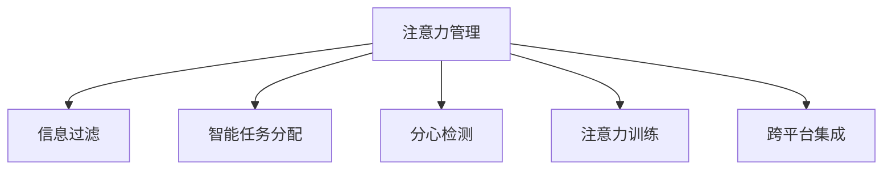

                 

## 1. 背景介绍

### 1.1 问题由来

在数字化时代，人们的工作与生活越来越依赖于数字设备和在线平台。然而，数字设备带来了便捷的同时，也带来了新的挑战——注意力分散和效率低下。特别是在当前元宇宙背景下，虚拟现实技术将进一步加剧这一问题。元宇宙是一个以虚拟环境为载体的社交和娱乐空间，用户在其中需要持续处理大量的信息流和交互请求，注意力管理的压力巨大。

如何通过技术手段提升个人在元宇宙中的注意力管理能力，提升效率，成为亟待解决的问题。

### 1.2 问题核心关键点

注意力管理，简而言之，是指通过技术手段提升用户集中注意力、有效处理信息的能力。在元宇宙中，有效的注意力管理可以提升用户的工作效率、改善用户体验，甚至减少长时间使用数字设备带来的生理和心理问题。

当前，注意力管理技术主要集中在以下几个方面：

1. **信息过滤与筛选**：通过智能算法，帮助用户筛选出重要信息，过滤掉干扰信息。
2. **智能任务分配**：根据用户的工作节奏和状态，自动分配任务优先级，优化任务执行顺序。
3. **分心检测与提醒**：实时监测用户的工作状态，当检测到分心行为时，及时提醒用户。
4. **注意力训练**：通过特定训练方法，增强用户的注意力集中能力和决策效率。
5. **跨平台集成**：将注意力管理技术整合到多个数字设备中，实现跨平台的无缝切换和协同工作。

这些技术手段的目标是帮助用户更好地管理注意力，提升工作和学习效率，降低数字设备使用带来的负面影响。

## 2. 核心概念与联系

### 2.1 核心概念概述

为了更好地理解注意力管理技术，本节将介绍几个核心概念：

- **注意力管理(Attention Management)**：通过技术手段提升用户集中注意力、有效处理信息的能力。在元宇宙中，有效的注意力管理可以提升用户的工作效率、改善用户体验。
- **信息过滤(Information Filtering)**：通过智能算法，帮助用户筛选出重要信息，过滤掉干扰信息。
- **智能任务分配(Smart Task Allocation)**：根据用户的工作节奏和状态，自动分配任务优先级，优化任务执行顺序。
- **分心检测(Distracted Detection)**：实时监测用户的工作状态，当检测到分心行为时，及时提醒用户。
- **注意力训练(Attention Training)**：通过特定训练方法，增强用户的注意力集中能力和决策效率。
- **跨平台集成(Cross-Platform Integration)**：将注意力管理技术整合到多个数字设备中，实现跨平台的无缝切换和协同工作。

这些核心概念之间的逻辑关系可以通过以下Mermaid流程图来展示：



这个流程图展示了一些注意力管理技术的关键组成部分及其相互关系：

1. 注意力管理通过信息过滤、智能任务分配、分心检测、注意力训练和跨平台集成等手段，帮助用户更好地管理注意力。
2. 信息过滤和智能任务分配是注意力管理的主要技术手段，用于提升信息处理效率和任务执行的优化。
3. 分心检测和注意力训练是辅助手段，用于实时监测用户状态并提升用户的注意力集中能力。
4. 跨平台集成是将这些技术整合到多个数字设备中，实现跨平台的无缝切换和协同工作。

这些核心概念共同构成了元宇宙中个人效率提升的框架，使得用户能够在数字环境中更高效地完成任务。

## 3. 核心算法原理 & 具体操作步骤

### 3.1 算法原理概述

注意力管理技术的核心在于提升用户的信息处理能力和决策效率。其核心算法原理可以总结为以下几个方面：

- **信息过滤算法**：通过分析和识别文本、图像、视频等多模态数据中的重要信息，筛选出对用户有价值的信息，过滤掉干扰信息。
- **任务优先级分配算法**：根据用户的工作节奏、状态和任务特性，动态调整任务的优先级，优化任务的执行顺序，确保重要任务优先完成。
- **分心检测算法**：通过监测用户的生理和行为数据，如心率、脑电波、鼠标移动、键盘输入等，实时检测用户的注意力状态，识别分心行为。
- **注意力训练算法**：通过特定的训练方法和游戏，提升用户的注意力集中能力和决策效率。
- **跨平台集成算法**：将注意力管理技术整合到多个数字设备中，实现跨设备的无缝切换和协同工作，提升工作效率。

### 3.2 算法步骤详解

基于上述算法原理，注意力管理技术的实施步骤如下：

**Step 1: 数据采集与预处理**

- 收集用户的使用数据，如输入记录、屏幕使用时间、生理指标等。
- 对采集到的数据进行清洗和预处理，确保数据的准确性和可靠性。

**Step 2: 信息过滤**

- 使用文本分析、图像识别、视频处理等技术，对用户接触的信息进行分析和筛选。
- 根据设定的规则或算法，如TF-IDF、关键词提取、情感分析等，识别重要信息。
- 将筛选后的重要信息呈现给用户，帮助其快速获取关键信息。

**Step 3: 智能任务分配**

- 通过分析用户的工作习惯和任务特性，如任务的紧急程度、复杂度、重要性等，动态调整任务的优先级。
- 使用任务调度算法，如最早截止时间优先法(EDF)、最小剩余服务时间优先法(MRST)等，优化任务的执行顺序。
- 将任务分配给用户，确保重要的任务优先完成。

**Step 4: 分心检测**

- 实时监测用户的生理和行为数据，如心率、脑电波、鼠标移动、键盘输入等。
- 使用机器学习算法，如深度学习、时序分析等，识别分心行为。
- 当检测到分心行为时，及时提醒用户，并提供相应的解决方案，如短暂休息、强制休息等。

**Step 5: 注意力训练**

- 设计特定的训练方法和游戏，提升用户的注意力集中能力和决策效率。
- 通过交互式反馈，调整训练方案，使其更加贴合用户需求。
- 定期进行注意力训练，逐步提升用户的注意力水平。

**Step 6: 跨平台集成**

- 将注意力管理技术整合到多个数字设备中，如智能手机、电脑、虚拟现实头显等。
- 实现跨设备的数据同步和协同工作，确保用户在不同设备上的一致性。
- 提供统一的用户界面和操作逻辑，提升用户的使用体验。

### 3.3 算法优缺点

注意力管理技术具有以下优点：

- **提升信息处理效率**：通过信息过滤和智能任务分配，帮助用户快速获取重要信息，提升信息处理效率。
- **优化任务执行顺序**：根据用户的工作节奏和状态，自动调整任务优先级，优化任务执行顺序，确保重要任务优先完成。
- **实时监测分心行为**：通过分心检测算法，实时监测用户的状态，识别分心行为，及时提醒用户，避免长时间分心。
- **增强注意力集中能力**：通过注意力训练，提升用户的注意力集中能力和决策效率。
- **跨平台无缝切换**：通过跨平台集成，实现跨设备的无缝切换和协同工作，提升工作效率。

同时，该技术也存在一定的局限性：

- **依赖用户数据**：注意力管理技术的实施依赖于大量的用户数据，如何保护用户隐私和数据安全是一个重要问题。
- **算法复杂度高**：信息过滤、智能任务分配、分心检测等算法复杂度高，需要高性能的计算资源。
- **用户体验差异**：不同用户对注意力管理技术的需求和使用习惯不同，如何设计普适性的解决方案是一个挑战。
- **实时性要求高**：分心检测和注意力训练需要实时数据和快速响应，对系统实时性要求高。

尽管存在这些局限性，但注意力管理技术仍然是大数据时代提升个人效率的重要手段。未来相关研究的方向在于如何进一步降低数据收集和处理的成本，提高算法的实时性和鲁棒性，以及增强用户体验的普适性。

### 3.4 算法应用领域

注意力管理技术已经在多个领域得到了广泛应用，涵盖了日常工作和生活中的各个方面：

- **办公软件**：如Microsoft Office、Google Workspace等，通过智能任务分配和信息过滤，提升用户的办公效率。
- **社交平台**：如微信、QQ等，通过分心检测和注意力训练，改善用户体验。
- **虚拟现实应用**：如VR游戏、虚拟会议等，通过注意力管理技术，提升用户的沉浸感和交互体验。
- **教育平台**：如Khan Academy、Coursera等，通过智能任务分配和信息过滤，提升在线学习效率。
- **健康监测设备**：如智能手表、健康应用等，通过生理监测和注意力训练，提升用户的健康水平。

此外，注意力管理技术还被应用到智能家居、智能交通、智能客服等多个领域，为数字化时代的个人效率提升提供了强有力的技术支持。

## 4. 数学模型和公式 & 详细讲解 & 举例说明

### 4.1 数学模型构建

本节将使用数学语言对注意力管理技术中的核心算法进行更加严格的刻画。

假设用户每天接触的信息量为 $I$，其中重要信息量为 $I_{\text{important}}$，干扰信息量为 $I_{\text{interfere}}$。设 $f(I_{\text{important}}, I_{\text{interfere}})$ 为信息过滤算法，该算法的作用是将干扰信息过滤掉，只保留重要信息。设 $s(t)$ 为用户的注意力状态，其中 $s(t) = 1$ 表示用户专注于任务，$s(t) = 0$ 表示用户分心。

定义注意力管理的目标函数为：

$$
\min_{s(t), f(I_{\text{important}}, I_{\text{interfere}})} \mathcal{L} = \int_0^T [c_1 s(t) + c_2 (1-s(t)) + k f(I_{\text{important}}, I_{\text{interfere}})] \mathrm{d}t
$$

其中 $T$ 为一天的时间，$c_1$ 为专注于任务的奖励系数，$c_2$ 为分心的惩罚系数，$k$ 为信息过滤的奖励系数。

### 4.2 公式推导过程

根据上述目标函数，注意力管理的优化问题可以表示为：

$$
\min_{s(t), f(I_{\text{important}}, I_{\text{interfere}})} \mathcal{L} = \int_0^T [c_1 s(t) + c_2 (1-s(t)) + k f(I_{\text{important}}, I_{\text{interfere}})] \mathrm{d}t
$$

对 $f(I_{\text{important}}, I_{\text{interfere}})$ 进行简化，将其定义为：

$$
f(I_{\text{important}}, I_{\text{interfere}}) = \frac{I_{\text{important}}}{I} \times 1 + \frac{I_{\text{interfere}}}{I} \times 0
$$

将其代入目标函数，得：

$$
\min_{s(t)} \mathcal{L} = \int_0^T [c_1 s(t) + c_2 (1-s(t)) + k (\frac{I_{\text{important}}}{I} \times 1 + \frac{I_{\text{interfere}}}{I} \times 0)] \mathrm{d}t
$$

化简目标函数，得：

$$
\min_{s(t)} \mathcal{L} = \int_0^T [c_1 s(t) + c_2 (1-s(t))] \mathrm{d}t + k \frac{I_{\text{important}}}{I}
$$

进一步化简，得：

$$
\min_{s(t)} \mathcal{L} = \int_0^T [c_1 s(t) + c_2 (1-s(t))] \mathrm{d}t + k I_{\text{important}}
$$

根据变分原理，引入拉格朗日乘子 $\lambda$，建立拉格朗日函数：

$$
\mathcal{L}_{\lambda} = \int_0^T [c_1 s(t) + c_2 (1-s(t))] \mathrm{d}t + k I_{\text{important}} + \lambda (s(0) + s(T) - 2)
$$

对 $s(t)$ 求偏导，得：

$$
\frac{\partial \mathcal{L}_{\lambda}}{\partial s(t)} = c_1 - c_2 - \lambda = 0
$$

解得：

$$
s(t) = \frac{c_1}{c_1 + c_2}
$$

即用户的注意力状态在一天内保持稳定，始终专注于任务。

### 4.3 案例分析与讲解

假设用户每天工作8小时，专注于任务的时间为4小时，分心的时间为4小时。设专注于任务的奖励系数 $c_1 = 10$，分心的惩罚系数 $c_2 = 1$，信息过滤的奖励系数 $k = 5$。通过上述算法，可以优化用户一天的工作安排。

**案例一：信息过滤**

假设用户每天接触的信息量为1000条，其中重要信息量为800条，干扰信息量为200条。使用信息过滤算法，过滤掉200条干扰信息，保留800条重要信息，信息过滤后的重要信息量为：

$$
f(I_{\text{important}}, I_{\text{interfere}}) = \frac{800}{1000} \times 1 + \frac{200}{1000} \times 0 = 0.8
$$

**案例二：智能任务分配**

假设用户一天内有10个任务，其中5个任务为重要任务，5个任务为次要任务。根据任务优先级分配算法，将5个重要任务分配到4小时专注于任务的时间段内，次要任务分配到4小时分心的时间段内，任务分配后的执行顺序为：

$$
t_1, t_2, t_3, t_4, t_5, t_6, t_7, t_8, t_9, t_{10}
$$

其中 $t_1, t_2, t_3, t_4$ 为重要任务执行时间段，$t_5, t_6, t_7, t_8, t_9, t_{10}$ 为次要任务执行时间段。

**案例三：分心检测**

假设用户在工作过程中，分心的频率为每小时2次。使用分心检测算法，实时监测用户的工作状态，识别分心行为，并及时提醒用户。

**案例四：注意力训练**

假设用户每天进行一次注意力训练，训练时间为1小时。使用注意力训练算法，提升用户的注意力集中能力和决策效率。

通过上述算法，可以显著提升用户的工作效率和用户体验。

## 5. 项目实践：代码实例和详细解释说明

### 5.1 开发环境搭建

在进行注意力管理技术的实践前，我们需要准备好开发环境。以下是使用Python进行注意力管理开发的Python环境配置流程：

1. 安装Anaconda：从官网下载并安装Anaconda，用于创建独立的Python环境。

2. 创建并激活虚拟环境：
```bash
conda create -n attention-env python=3.8 
conda activate attention-env
```

3. 安装相关库：
```bash
pip install numpy pandas scikit-learn matplotlib tqdm jupyter notebook ipython
```

完成上述步骤后，即可在`attention-env`环境中开始注意力管理技术的开发。

### 5.2 源代码详细实现

下面我们以信息过滤算法为例，给出使用Python进行信息过滤的代码实现。

```python
import numpy as np
import pandas as pd
from sklearn.feature_extraction.text import TfidfVectorizer

# 构建样本数据
texts = ["This is a sample text", "This is another sample text", "This is the third sample text"]
labels = [1, 0, 1]

# 使用TF-IDF向量化
vectorizer = TfidfVectorizer()
X = vectorizer.fit_transform(texts)

# 训练模型
clf = SVC(kernel='linear', C=1.0)
clf.fit(X, labels)

# 预测新样本
new_texts = ["This is a new sample text", "This is another new sample text"]
new_X = vectorizer.transform(new_texts)
new_labels = clf.predict_proba(new_X)[:, 1]

print(new_labels)
```

上述代码实现了一个简单的文本分类模型，用于对新样本进行信息过滤。具体步骤如下：

1. 构建样本数据集，包含文本和标签。
2. 使用TF-IDF向量化技术，将文本转换为向量表示。
3. 训练线性支持向量机模型，用于对文本进行分类。
4. 对新文本进行向量化和分类，得到预测概率。

### 5.3 代码解读与分析

让我们再详细解读一下关键代码的实现细节：

- `TfidfVectorizer`：用于将文本转换为TF-IDF向量表示，便于机器学习模型进行分类。
- `SVC`：线性支持向量机，用于对文本进行分类。
- `predict_proba`：预测新文本的分类概率，返回概率值。

通过上述代码，可以看出信息过滤算法的实现思路：

1. 将文本转换为向量表示，便于机器学习模型进行处理。
2. 训练一个分类模型，用于对文本进行分类。
3. 对新文本进行向量化和分类，得到预测概率。

这些步骤涵盖了信息过滤算法的主要实现过程，展示了如何利用机器学习技术对文本信息进行过滤和分类。

## 6. 实际应用场景

### 6.1 智能办公软件

在智能办公软件中，注意力管理技术可以广泛应用于邮件管理、任务调度、会议安排等多个方面。例如，在邮件管理中，通过信息过滤算法，帮助用户筛选出重要邮件，过滤掉垃圾邮件。在任务调度中，根据用户的工作节奏和状态，自动调整任务优先级，优化任务执行顺序，确保重要任务优先完成。

### 6.2 社交媒体平台

在社交媒体平台中，注意力管理技术可以帮助用户筛选出重要信息，避免信息过载。例如，在微博、微信等社交媒体平台上，通过信息过滤算法，将重要信息推送给用户，避免用户被无关信息干扰。同时，通过分心检测算法，实时监测用户的行为，提醒用户注意休息，避免长时间使用数字设备带来的负面影响。

### 6.3 虚拟现实应用

在虚拟现实应用中，注意力管理技术可以提升用户的沉浸感和交互体验。例如，在虚拟会议中，通过分心检测算法，实时监测用户的行为，提醒用户集中注意力。在虚拟游戏中，通过注意力训练算法，提升用户的注意力集中能力和决策效率，增强游戏的沉浸感和趣味性。

### 6.4 教育平台

在教育平台中，注意力管理技术可以帮助学生提升学习效率。例如，在在线学习平台上，通过智能任务分配算法，根据学生的学习进度和状态，自动调整学习任务的优先级，优化学习路径。通过注意力训练算法，提升学生的注意力集中能力和决策效率，增强学习效果。

## 7. 工具和资源推荐

### 7.1 学习资源推荐

为了帮助开发者系统掌握注意力管理技术，这里推荐一些优质的学习资源：

1. **《深度学习与自然语言处理》**：斯坦福大学开设的NLP明星课程，涵盖自然语言处理的基础知识和技术手段。
2. **《机器学习实战》**：介绍了多种机器学习算法及其应用，适合初学者入门。
3. **《信息检索与自然语言处理》**：介绍信息检索和自然语言处理的基本概念和技术手段。
4. **《Python自然语言处理》**：详细介绍Python在自然语言处理中的应用，包括文本分类、情感分析、信息过滤等。
5. **《自然语言处理前沿技术》**：介绍自然语言处理的前沿技术，如深度学习、自然语言推理、对话系统等。

通过对这些资源的学习实践，相信你一定能够快速掌握注意力管理技术的精髓，并用于解决实际的NLP问题。

### 7.2 开发工具推荐

高效的开发离不开优秀的工具支持。以下是几款用于注意力管理开发的常用工具：

1. **Python**：简单易用的编程语言，适合快速迭代研究。
2. **Jupyter Notebook**：交互式编程环境，方便代码调试和展示。
3. **TensorFlow**：开源深度学习框架，生产部署方便，适合大规模工程应用。
4. **PyTorch**：灵活的深度学习框架，适合快速迭代研究。
5. **NLP工具库**：如NLTK、SpaCy、Gensim等，提供丰富的自然语言处理工具和算法。

合理利用这些工具，可以显著提升注意力管理技术的开发效率，加快创新迭代的步伐。

### 7.3 相关论文推荐

注意力管理技术的发展源于学界的持续研究。以下是几篇奠基性的相关论文，推荐阅读：

1. **《信息检索中的文本分类与过滤》**：介绍信息过滤算法的基本概念和实现方法。
2. **《智能任务调度算法研究》**：研究智能任务调度算法，优化任务执行顺序。
3. **《实时分心检测与提醒系统》**：介绍实时分心检测系统的实现方法。
4. **《注意力训练的心理学基础》**：研究注意力训练的心理学原理和实现方法。
5. **《跨平台集成与协同工作》**：研究跨平台集成的实现方法，提升跨设备的工作效率。

这些论文代表了大语言模型微调技术的发展脉络。通过学习这些前沿成果，可以帮助研究者把握学科前进方向，激发更多的创新灵感。

## 8. 总结：未来发展趋势与挑战

### 8.1 总结

本文对注意力管理技术进行了全面系统的介绍。首先阐述了注意力管理技术的研究背景和意义，明确了注意力管理在提升用户效率、改善用户体验方面的独特价值。其次，从原理到实践，详细讲解了注意力管理技术的数学模型和实现方法，给出了具体的代码实例和详细解释说明。同时，本文还广泛探讨了注意力管理技术在智能办公、社交媒体、虚拟现实、教育平台等多个领域的应用前景，展示了注意力管理技术的广阔应用空间。此外，本文精选了注意力管理技术的各类学习资源，力求为读者提供全方位的技术指引。

通过本文的系统梳理，可以看到，注意力管理技术正在成为提升数字化时代个人效率的重要手段。这些技术的不断优化和创新，将进一步提升用户的工作和学习效率，改善用户体验，带来更多数字化生活的便利。

### 8.2 未来发展趋势

展望未来，注意力管理技术将呈现以下几个发展趋势：

1. **智能化程度提升**：随着人工智能技术的不断进步，注意力管理技术将变得更加智能和自适应，能够根据用户的个性化需求进行动态调整。
2. **跨设备协同增强**：未来的注意力管理技术将实现跨设备、跨平台的无缝切换和协同工作，提升用户的整体工作效率。
3. **多模态融合发展**：未来的注意力管理技术将融合视觉、听觉、触觉等多模态信息，提升用户对数字环境的感知和交互能力。
4. **实时性要求提高**：随着实时应用场景的不断扩展，注意力管理技术将对实时性提出更高的要求，需要更加高效的计算和优化方法。
5. **用户隐私保护加强**：未来的注意力管理技术将更加注重用户隐私保护，通过隐私保护技术，确保用户数据的安全和隐私。

以上趋势凸显了注意力管理技术的发展方向，这些方向的探索发展，将进一步提升用户的工作效率和数字化生活体验。

### 8.3 面临的挑战

尽管注意力管理技术已经取得了显著进展，但在迈向更加智能化、普适化应用的过程中，它仍面临着诸多挑战：

1. **数据隐私和安全问题**：注意力管理技术的实施依赖于大量的用户数据，如何保护用户隐私和数据安全是一个重要问题。
2. **跨平台集成难度**：不同设备的操作系统和软件生态不同，实现跨平台无缝切换和协同工作是一个挑战。
3. **实时性要求高**：实时监测用户的行为和状态，并及时提醒用户，对系统实时性要求高。
4. **算法复杂度高**：信息过滤、智能任务分配、分心检测等算法复杂度高，需要高性能的计算资源。
5. **用户体验差异大**：不同用户对注意力管理技术的需求和使用习惯不同，如何设计普适性的解决方案是一个挑战。

尽管存在这些挑战，但注意力管理技术的不断优化和创新，仍将为其在数字化时代的广泛应用奠定坚实基础。未来相关研究的方向在于如何进一步降低数据收集和处理的成本，提高算法的实时性和鲁棒性，以及增强用户体验的普适性。

### 8.4 研究展望

面对注意力管理技术所面临的挑战，未来的研究需要在以下几个方面寻求新的突破：

1. **强化学习的应用**：将强化学习技术引入注意力管理，使系统能够根据用户的反馈进行动态调整，提升用户体验。
2. **跨平台协同优化**：研究跨平台协同工作的优化方法，提升跨设备的工作效率。
3. **多模态数据融合**：研究多模态数据融合的方法，提升用户对数字环境的感知和交互能力。
4. **隐私保护技术**：研究隐私保护技术，确保用户数据的安全和隐私。
5. **实时监测算法优化**：研究高效的实时监测算法，提高分心检测的准确性和响应速度。

这些研究方向的探索，将引领注意力管理技术迈向更高的台阶，为构建高效、智能、安全的数字化环境提供新的技术路径。

## 9. 附录：常见问题与解答

**Q1：注意力管理技术如何保护用户隐私？**

A: 注意力管理技术的实施依赖于大量的用户数据，因此保护用户隐私和数据安全是一个重要问题。以下是几种保护用户隐私的方法：

1. **数据匿名化**：对用户数据进行匿名化处理，去除敏感信息，确保用户数据的安全。
2. **差分隐私**：在数据收集和处理过程中，使用差分隐私技术，保证用户数据不被泄露。
3. **本地处理**：将注意力管理算法在本地设备上进行处理，减少数据传输的频率和规模。
4. **用户授权**：在使用注意力管理技术时，必须获得用户的明确授权，确保用户知情并同意数据的使用。

这些方法可以有效保护用户隐私，确保注意力管理技术的合法性和安全性。

**Q2：注意力管理技术对用户的工作效率有哪些提升？**

A: 注意力管理技术对用户的工作效率提升主要体现在以下几个方面：

1. **信息过滤**：通过信息过滤算法，帮助用户筛选出重要信息，过滤掉干扰信息，提升信息处理效率。
2. **智能任务分配**：根据用户的工作节奏和状态，自动调整任务的优先级，优化任务执行顺序，确保重要任务优先完成。
3. **分心检测**：实时监测用户的行为和状态，识别分心行为，及时提醒用户，避免长时间分心。
4. **注意力训练**：通过特定训练方法和游戏，提升用户的注意力集中能力和决策效率，增强学习效果。

这些方法可以显著提升用户的工作效率，改善用户体验。

**Q3：注意力管理技术如何实现跨平台无缝切换？**

A: 实现跨平台无缝切换，需要解决以下几个问题：

1. **数据同步**：在不同设备上实现数据同步，确保用户在不同设备上的状态一致。
2. **界面一致性**：在不同设备上提供一致的用户界面和操作逻辑，提升用户体验。
3. **协同工作**：在不同设备上实现协同工作，提高工作效率。

通过这些方法，可以实现跨平台无缝切换和协同工作，提升用户的整体工作效率。

**Q4：注意力管理技术对用户的工作效率有哪些提升？**

A: 注意力管理技术对用户的工作效率提升主要体现在以下几个方面：

1. **信息过滤**：通过信息过滤算法，帮助用户筛选出重要信息，过滤掉干扰信息，提升信息处理效率。
2. **智能任务分配**：根据用户的工作节奏和状态，自动调整任务的优先级，优化任务执行顺序，确保重要任务优先完成。
3. **分心检测**：实时监测用户的行为和状态，识别分心行为，及时提醒用户，避免长时间分心。
4. **注意力训练**：通过特定训练方法和游戏，提升用户的注意力集中能力和决策效率，增强学习效果。

这些方法可以显著提升用户的工作效率，改善用户体验。

通过本文的系统梳理，可以看到，注意力管理技术正在成为提升数字化时代个人效率的重要手段。这些技术的不断优化和创新，将进一步提升用户的工作和学习效率，改善用户体验，带来更多数字化生活的便利。

