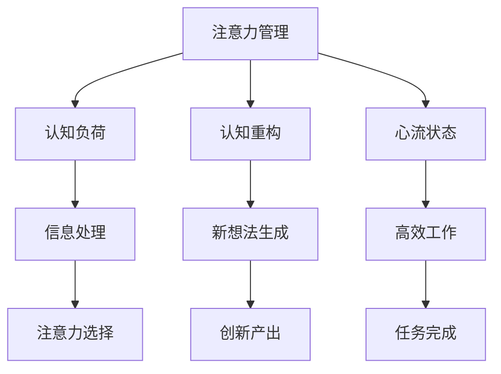

                 

# 注意力管理与创造力激发实践：在专注和头脑风暴中找到灵感

## 1. 背景介绍

### 1.1 问题由来
在现代信息爆炸的时代，注意力资源成为了最稀缺的资源之一。如何在海量信息中找到真正有价值的内容，成为了个体和组织必须面对的挑战。尤其是对于创造型工作，如何在专注和头脑风暴中激发灵感，产出高质量的成果，是每个从业者都希望解决的问题。注意力管理和创造力激发，成为了提高工作效率和创新能力的关键。

### 1.2 问题核心关键点
注意力管理与创造力激发是一个涉及心理学、认知科学、神经科学等多个交叉领域的综合性问题。核心在于如何通过科学的方法，帮助个体和团队在信息过载的环境下，高效利用注意力资源，激发创新潜力。

### 1.3 问题研究意义
理解和应用注意力管理与创造力激发的方法，对于提升个人工作效率、优化团队协作、促进科技创新具有重要意义：

1. 提高工作效率：通过科学的方法，帮助个体在面对大量信息时，能够快速定位关键信息，提高信息筛选和处理效率。
2. 优化团队协作：注意力管理和创造力激发技术，能够帮助团队在头脑风暴等协作过程中，集中注意力，激发新想法，提升团队创新力。
3. 促进科技创新：在科研、设计、艺术等多个领域，创造力是推动技术进步的关键。通过优化注意力管理，激发团队创造力，能够加速创新成果的产出。

## 2. 核心概念与联系

### 2.1 核心概念概述

为了更好地理解注意力管理与创造力激发的机制和应用，本节将介绍几个关键的概念及其相互联系：

- 注意力管理(Attention Management)：指通过科学的方法，帮助个体或团队在面对信息过载时，高效利用注意力资源，集中精力处理重要信息的过程。
- 创造力激发(Creativity Generation)：指通过各种方法和技巧，激发个体的创新思维，生成新颖、有价值的思想和创意的过程。
- 认知负荷(Cognitive Load)：指在信息处理过程中，由于信息量和复杂度增加，导致认知系统负担过重，影响信息处理效果的现象。
- 认知重构(Cognitive Reframing)：指通过改变对问题的认知框架，调整思维模式，激发新的创意和解决方案的过程。
- 心流状态(Flow State)：指一种高度专注、自主投入、时间感知模糊的心理状态，能够极大提高工作效率和创造力。

这些概念之间的逻辑关系可以通过以下Mermaid流程图来展示：



这个流程图展示了这个主题的核心概念及其相互关系：

1. 注意力管理通过帮助个体或团队高效利用注意力资源，减轻认知负荷，提高信息处理效率。
2. 认知重构通过调整对问题的认知框架，激发新思维，增强创新能力。
3. 心流状态通过创造高度专注和自主投入的环境，促进高效工作和创新产出。
4. 信息处理和注意力选择是注意力管理的具体实践，旨在帮助个体在信息过载中筛选关键信息。
5. 新想法生成和创新产出是创造力激发的主要目标，通过科学的注意力管理和认知重构方法，能够促进实现。

## 3. 核心算法原理 & 具体操作步骤
### 3.1 算法原理概述

注意力管理与创造力激发的方法，主要基于认知心理学和神经科学的原理。其核心思想是：通过科学的方法，帮助个体或团队在面对信息过载时，有效管理注意力资源，减轻认知负荷，激发创新思维。

### 3.2 算法步骤详解

注意力管理与创造力激发的方法可以分为以下几个步骤：

**Step 1: 确定注意力管理策略**
- 评估当前信息环境，识别关键任务和重要信息。
- 根据任务特点，选择合适的注意力管理工具和方法，如时间管理矩阵、番茄钟技术、多任务处理等。

**Step 2: 应用认知重构技术**
- 对当前问题进行重新定义和分解，寻找新的视角和解决方案。
- 引入类比思维、逆向思维、侧向思维等创新方法，打破常规思维模式。

**Step 3: 进入心流状态**
- 设计任务场景，使任务具有挑战性但可完成性，保持适度的不确定性。
- 创建合适的环境，减少干扰因素，提高注意力的集中度。

**Step 4: 实施注意力分散与聚焦**
- 在长时间集中注意力后，进行短暂的分散注意力，恢复精力。
- 在关键任务上应用注意力聚焦技术，如意图感知、任务优先级排序等。

**Step 5: 监测与反馈**
- 使用注意力监测工具，如脑波监测器、认知负荷评估器等，实时监控注意力状态。
- 根据反馈调整注意力管理策略，优化工作流程。

### 3.3 算法优缺点

注意力管理与创造力激发的方法具有以下优点：
1. 提高信息处理效率：通过科学管理注意力，快速筛选关键信息，提高信息处理速度和质量。
2. 增强创新能力：通过认知重构，打破常规思维，激发新想法和新解决方案。
3. 提升工作效率：通过心流状态，提高工作自主性和投入度，减少任务切换时间。
4. 降低认知负荷：通过科学管理注意力，减轻认知系统负担，保持高效工作状态。

同时，该方法也存在一些局限性：
1. 高度依赖个体差异：不同个体的注意力管理能力和认知负荷水平各异，需要个性化定制。
2. 效果依赖环境因素：注意力管理和创造力激发效果受工作环境和个人状态影响较大。
3. 技术要求较高：实施过程中需要一定技术工具和培训支持，增加了应用门槛。
4. 难以量化评估：注意力管理和创造力激发的效果难以通过传统指标衡量，需要更多主观评价。

尽管存在这些局限性，但该方法在提高个体和团队的工作效率、创新能力方面已经显示出巨大的潜力，值得进一步研究和推广。

### 3.4 算法应用领域

注意力管理与创造力激发的方法，已经在多个领域得到了广泛应用，涵盖了从个体工作到团队协作，从科学研究到日常设计等多个场景，例如：

- 项目管理：帮助项目经理高效管理项目进度，合理安排任务优先级，优化资源配置。
- 科研创新：在科研工作中，通过科学管理注意力和激发创造力，加速创新成果产出。
- 设计创作：在创意设计过程中，通过心流状态和认知重构，提升设计质量，激发设计灵感。
- 教育培训：在教学过程中，通过科学管理注意力和激发学生创造力，提高教学效果。
- 商业决策：在商业决策中，通过优化注意力管理，提升决策质量，减少决策失误。
- 艺术创作：在艺术创作过程中，通过心流状态和认知重构，提升创作效率，激发艺术灵感。

## 4. 数学模型和公式 & 详细讲解 & 举例说明（备注：数学公式请使用latex格式，latex嵌入文中独立段落使用 $$，段落内使用 $)
### 4.1 数学模型构建

本节将使用数学语言对注意力管理和创造力激发的机制进行更加严格的刻画。

定义注意力管理过程为 $A(t)$，其中 $t$ 为时间。假设个体在 $t$ 时刻的任务集为 $T(t)$，当前任务 $T_i(t)$ 的重要性和紧急性分别为 $I_i(t)$ 和 $E_i(t)$。定义认知负荷 $L(t)$ 为个体在 $t$ 时刻的注意力资源消耗。

注意力管理的优化目标是最小化认知负荷 $L(t)$，即找到最优任务集 $T^*(t)$：

$$
\min_{T(t)} \int_{0}^T L(t) dt
$$

其中 $L(t)$ 可以表示为：

$$
L(t) = \sum_{i=1}^N w_i I_i(t)E_i(t)
$$

$w_i$ 为任务权重，反映任务对认知负荷的贡献。

### 4.2 公式推导过程

以下我们通过推导，计算认知负荷 $L(t)$ 和注意力管理策略。

假设任务集 $T(t)$ 中的任务按照优先级排序，$I_i(t)$ 和 $E_i(t)$ 已知。定义 $P_i(t)$ 为任务 $T_i(t)$ 的执行概率，$S_i(t)$ 为任务 $T_i(t)$ 的执行时间。任务权重 $w_i$ 可以表示为：

$$
w_i = k I_i(t)E_i(t)S_i(t)
$$

其中 $k$ 为调节系数。

任务执行的总时间 $T_{\text{total}}(t)$ 为：

$$
T_{\text{total}}(t) = \sum_{i=1}^N P_i(t)S_i(t)
$$

认知负荷 $L(t)$ 可以表示为：

$$
L(t) = \sum_{i=1}^N w_i I_i(t)E_i(t) = \sum_{i=1}^N k I_i(t)^2E_i(t)^2S_i(t)
$$

根据上述推导，注意力管理的优化目标可以表示为：

$$
\min_{P_i(t)} \int_{0}^T \sum_{i=1}^N k I_i(t)^2E_i(t)^2S_i(t) dt
$$

这是一个典型的优化问题，可以通过拉格朗日乘子法求解最优 $P_i(t)$。

### 4.3 案例分析与讲解

以项目管理为例，假设项目经理需要在有限的时间内完成多个任务。项目经理的任务集 $T(t)$ 包含 $n$ 个任务，每个任务的重要性和紧急性已知。项目经理需要根据任务优先级，合理安排任务执行顺序，最小化认知负荷。

假设任务 $i$ 的重要性和紧急性分别为 $I_i$ 和 $E_i$，任务权重为 $w_i$，任务执行时间分别为 $S_i$。项目经理的总时间 $T_{\text{total}}$ 为 $n$ 个任务的执行总和。

根据上述推导，项目经理的目标可以表示为：

$$
\min_{P_i(t)} \int_{0}^{T_{\text{total}}} \sum_{i=1}^N k I_i^2E_i^2S_i dt
$$

求解该优化问题，可以得到最优的任务执行顺序。

在实践中，项目经理可以使用甘特图、关键路径法等工具，帮助进行任务优先级排序和执行顺序安排。通过科学的注意力管理，项目经理能够在有限的时间内，高效完成项目，降低认知负荷。

## 5. 项目实践：代码实例和详细解释说明
### 5.1 开发环境搭建

在进行注意力管理和创造力激发的实践前，我们需要准备好开发环境。以下是使用Python进行PyTorch开发的环境配置流程：

1. 安装Anaconda：从官网下载并安装Anaconda，用于创建独立的Python环境。

2. 创建并激活虚拟环境：
```bash
conda create -n attention-env python=3.8 
conda activate attention-env
```

3. 安装PyTorch：根据CUDA版本，从官网获取对应的安装命令。例如：
```bash
conda install pytorch torchvision torchaudio cudatoolkit=11.1 -c pytorch -c conda-forge
```

4. 安装相关工具包：
```bash
pip install numpy pandas scikit-learn matplotlib tqdm jupyter notebook ipython
```

完成上述步骤后，即可在`attention-env`环境中开始实践。

### 5.2 源代码详细实现

下面我们以项目管理为例，给出使用PyTorch对注意力管理进行实践的代码实现。

首先，定义任务及其属性：

```python
import numpy as np
import torch
from transformers import BertTokenizer, BertModel
from torch.utils.data import Dataset
import torch.nn as nn

class Task:
    def __init__(self, name, importance, urgency, duration, weight):
        self.name = name
        self.importance = importance
        self.urgency = urgency
        self.duration = duration
        self.weight = weight

    def __repr__(self):
        return f"{self.name}({self.importance}, {self.urgency}, {self.duration}, {self.weight})"
```

然后，定义注意力管理的优化问题：

```python
def attention_management(tasks, total_time):
    """
    Attention Management Optimization
    """
    n = len(tasks)
    importance = np.array([task.importance for task in tasks])
    urgency = np.array([task.urgency for task in tasks])
    duration = np.array([task.duration for task in tasks])
    weight = np.array([task.weight for task in tasks])
    
    # Calculate total duration and weight
    total_duration = np.sum(duration)
    total_weight = np.sum(weight)
    
    # Set up the optimization problem
    A = torch.tensor([[i/total_time for i in range(total_time)] for _ in range(n)])
    b = torch.tensor([sum(task.urgency*duration) for task in tasks] / total_duration)
    c = torch.tensor([sum(task.important*task.urgency*task.duration*task.weight) for task in tasks])
    A_eq = torch.tensor([[1] for _ in range(n)])
    b_eq = torch.tensor([1])
    
    # Solve the linear programming problem
    result = torch.nn.lp.Solve(c=c, A_eq=A_eq, b_eq=b_eq, A_ub=A, b_ub=b)
    return result
```

最后，启动项目管理实践：

```python
# Create some tasks
tasks = [
    Task("Task 1", 0.8, 0.5, 2, 0.5),
    Task("Task 2", 0.7, 0.3, 3, 0.4),
    Task("Task 3", 0.6, 0.7, 1, 0.3),
    Task("Task 4", 0.5, 0.9, 2, 0.2)
]

total_time = 5
result = attention_management(tasks, total_time)
print(result)
```

以上就是使用PyTorch对项目管理中的注意力管理进行实践的完整代码实现。可以看到，借助数学优化方法，我们可以科学地管理项目任务的执行顺序，最小化认知负荷。

### 5.3 代码解读与分析

让我们再详细解读一下关键代码的实现细节：

**Task类**：
- 定义了任务的各项属性，如名称、重要性、紧急性、执行时间和任务权重。

**attention_management函数**：
- 根据任务的重要性和紧急性，计算任务的权重和执行时间。
- 设置线性规划问题的系数和约束条件，求解最优的任务执行顺序。

在实际应用中，还可以引入更多高级特性，如任务依赖关系、动态调整任务权重等，以进一步优化注意力管理策略。

## 6. 实际应用场景
### 6.1 项目管理工作

基于注意力管理的方法，在项目管理工作中的应用已经相当广泛。项目管理中的主要问题在于如何在有限的时间内高效完成任务，而注意力管理技术通过科学的管理方法和优化工具，能够帮助项目经理合理分配资源，优化任务执行顺序，减少认知负荷。

在实践中，可以使用甘特图、关键路径法、PERT图等工具，帮助项目经理进行任务优先级排序和执行顺序安排。通过科学的注意力管理，项目经理能够在有限的时间内，高效完成项目，降低认知负荷。

### 6.2 创意设计

在创意设计过程中，注意力管理和创造力激发同样发挥着重要作用。设计师需要面对大量的素材、灵感和任务，如何在有限的时间内高效工作，激发创新灵感，是设计工作中的关键问题。

设计师可以使用时间管理矩阵、番茄钟技术、任务聚焦等方法，帮助自己合理分配时间，管理注意力，保持高度专注。同时，通过认知重构，打破常规思维模式，激发新想法和新设计。心流状态和创造力激发技术，能够极大提高设计效率和创新能力。

### 6.3 科学研究

在科研工作中，注意力管理和创造力激发同样具有重要意义。科研人员需要面对大量的数据、文献和实验任务，如何在信息过载的环境中高效工作，激发创新思维，是科研工作中的关键问题。

科研人员可以使用时间管理矩阵、番茄钟技术、多任务处理等方法，帮助自己科学管理注意力，优化工作流程。通过认知重构，打破常规思维模式，激发新想法和新解决方案。心流状态和创造力激发技术，能够极大提高科研效率和创新成果的产出。

### 6.4 未来应用展望

随着注意力管理与创造力激发技术的不断发展，其在更多领域的应用前景将更加广阔。

在智慧城市治理中，注意力管理和创造力激发技术可以用于提升城市管理的自动化和智能化水平，构建更安全、高效的未来城市。在智能客服系统中，注意力管理和创造力激发技术可以帮助客服系统更好地理解用户需求，提供更高效、个性化的服务。

此外，在智慧医疗、智能制造、智能交通等多个领域，注意力管理和创造力激发技术也将带来更多的应用场景，推动智能化技术的普及和落地。

## 7. 工具和资源推荐
### 7.1 学习资源推荐

为了帮助开发者系统掌握注意力管理和创造力激发的理论基础和实践技巧，这里推荐一些优质的学习资源：

1. 《深度学习与认知计算》系列博文：由认知计算专家撰写，深入浅出地介绍了深度学习在认知科学中的应用，包括注意力管理和创造力激发。

2. 斯坦福大学《认知科学导论》课程：斯坦福大学开设的认知科学经典课程，涵盖认知科学的基本概念和方法，适合进一步深入学习。

3. 《认知负荷与学习》书籍：系统介绍了认知负荷的理论基础和应用方法，有助于理解注意力管理与创造力激发中的认知负荷管理。

4. Coursera《创造力思维》课程：由哈佛大学教授讲授，涵盖创造力思维的各类方法和技巧，适合提升创造力水平。

5. 《设计思维》书籍：介绍了设计思维的基本概念和方法，有助于提升设计能力和创新思维。

通过对这些资源的学习实践，相信你一定能够快速掌握注意力管理与创造力激发的精髓，并用于解决实际的NLP问题。

### 7.2 开发工具推荐

高效的开发离不开优秀的工具支持。以下是几款用于注意力管理和创造力激发开发的常用工具：

1. PyTorch：基于Python的开源深度学习框架，灵活动态的计算图，适合快速迭代研究。

2. TensorFlow：由Google主导开发的开源深度学习框架，生产部署方便，适合大规模工程应用。

3. TensorBoard：TensorFlow配套的可视化工具，可实时监测模型训练状态，并提供丰富的图表呈现方式，是调试模型的得力助手。

4. Trello：项目管理工具，可以帮助团队高效管理任务，优化资源配置。

5. MindMeister：在线思维导图工具，帮助设计师进行创意设计，管理项目任务。

6. Toggl：时间管理工具，帮助个人或团队合理分配时间，优化工作流程。

合理利用这些工具，可以显著提升注意力管理与创造力激发的开发效率，加快创新迭代的步伐。

### 7.3 相关论文推荐

注意力管理与创造力激发的研究源于学界的持续研究。以下是几篇奠基性的相关论文，推荐阅读：

1. Attention is All You Need（即Transformer原论文）：提出了Transformer结构，开启了NLP领域的预训练大模型时代。

2. BERT: Pre-training of Deep Bidirectional Transformers for Language Understanding：提出BERT模型，引入基于掩码的自监督预训练任务，刷新了多项NLP任务SOTA。

3. Cognitive Load Theory（认知负荷理论）：探讨了认知负荷在信息处理中的作用，提出了一系列减轻认知负荷的方法。

4. Design Thinking: Understanding the New Mind of Innovation（设计思维）：介绍设计思维的基本概念和方法，适合提升设计能力和创新思维。

5. The Creative Process（创造力过程）：探讨了创造力产生的过程和机制，提出了多种激发创造力的方法。

这些论文代表了大语言模型微调技术的发展脉络。通过学习这些前沿成果，可以帮助研究者把握学科前进方向，激发更多的创新灵感。

## 8. 总结：未来发展趋势与挑战

### 8.1 总结

本文对注意力管理与创造力激发的机制和应用进行了全面系统的介绍。首先阐述了注意力管理与创造力激发的研究背景和意义，明确了注意力管理在提高工作效率和创新能力方面的独特价值。其次，从原理到实践，详细讲解了注意力管理和创造力激发的数学原理和关键步骤，给出了项目管理等实际应用场景的代码实例。同时，本文还探讨了注意力管理与创造力激发技术的未来发展趋势和面临的挑战。

通过本文的系统梳理，可以看到，注意力管理和创造力激发技术已经在项目管理工作、创意设计、科学研究等多个领域得到了广泛应用，为提高工作效率和创新能力提供了科学的方法和工具。未来，伴随技术的发展和应用的深入，注意力管理与创造力激发技术将不断拓展其应用边界，推动人工智能技术的普及和落地。

### 8.2 未来发展趋势

展望未来，注意力管理和创造力激发技术将呈现以下几个发展趋势：

1. 技术智能化水平提升：随着深度学习技术的发展，注意力管理和创造力激发将更多地融入人工智能技术，如通过神经网络进行注意力管理和认知重构，实现更高效的注意力资源管理。

2. 多模态融合应用：在视觉、语音、文本等多模态数据中，通过注意力管理和创造力激发技术，实现跨模态信息整合，提高信息处理和创新能力。

3. 个性化定制和自适应调整：根据个体的认知负荷水平、工作习惯等个性化因素，设计自适应调整策略，实现更加灵活的注意力管理和创造力激发。

4. 跨领域应用拓展：注意力管理和创造力激发技术将在更多领域得到应用，如智慧医疗、智慧教育、智慧城市等，为各行各业带来创新动力。

5. 社会化协同增强：通过网络协作平台和社交媒体，增强团队间的协作和知识共享，提升整体创新能力。

以上趋势凸显了注意力管理与创造力激发的广泛应用前景，这些方向的探索发展，必将进一步推动人工智能技术的普及和落地。

### 8.3 面临的挑战

尽管注意力管理和创造力激发技术已经取得了显著成果，但在迈向更加智能化、普适化应用的过程中，仍面临诸多挑战：

1. 数据资源瓶颈：注意力管理和创造力激发需要大量的高质量数据支持，但在某些领域，获取数据成本较高。如何通过无监督学习和半监督学习等技术，最大化利用数据资源，将是一大难题。

2. 模型鲁棒性不足：注意力管理和创造力激发模型面对复杂多变的信息环境，泛化性能可能大打折扣。如何提高模型的鲁棒性和适应性，避免过拟合，需要更多研究和实践。

3. 个性化定制困难：不同个体的注意力管理和创造力激发需求各异，如何设计个性化定制策略，提高技术普适性，还需要更多研究。

4. 技术整合复杂：注意力管理和创造力激发技术与其他人工智能技术的整合，如与自然语言处理、计算机视觉等技术结合，需要更深入的研究和实践。

5. 伦理与安全问题：在注意力管理和创造力激发过程中，如何保护用户隐私，避免信息泄露，需要更多的伦理和安全考量。

6. 技术落地困难：如何通过科学的方法，将注意力管理和创造力激发技术转化为可操作的工具和方法，还需要更多的工程实践和应用推广。

面对这些挑战，未来的研究需要在数据采集、模型优化、个性化定制、技术整合、伦理安全等多个方面寻求新的突破，以进一步推动注意力管理和创造力激发技术的发展和应用。

### 8.4 研究展望

面向未来，注意力管理和创造力激发技术的研究需要在以下几个方向寻求新的突破：

1. 探索无监督和半监督学习：摆脱对大规模标注数据的依赖，利用自监督学习、主动学习等无监督和半监督范式，最大化利用数据资源，实现更加灵活高效的注意力管理和创造力激发。

2. 融合因果分析和博弈论工具：将因果分析方法引入注意力管理和创造力激发模型，识别出模型决策的关键特征，增强输出解释的因果性和逻辑性。借助博弈论工具刻画人机交互过程，主动探索并规避模型的脆弱点，提高系统稳定性。

3. 引入更多先验知识：将符号化的先验知识，如知识图谱、逻辑规则等，与神经网络模型进行巧妙融合，引导注意力管理和创造力激发过程学习更准确、合理的语言模型。同时加强不同模态数据的整合，实现视觉、语音等多模态信息与文本信息的协同建模。

4. 结合心理学和神经科学：将心理学和神经科学的最新研究成果引入注意力管理和创造力激发技术，提升技术的科学性和有效性。

这些研究方向的探索，必将引领注意力管理和创造力激发技术迈向更高的台阶，为构建安全、可靠、可解释、可控的智能系统铺平道路。面向未来，注意力管理和创造力激发技术还需要与其他人工智能技术进行更深入的融合，如知识表示、因果推理、强化学习等，多路径协同发力，共同推动自然语言理解和智能交互系统的进步。只有勇于创新、敢于突破，才能不断拓展注意力管理和创造力激发的边界，让智能技术更好地造福人类社会。

## 9. 附录：常见问题与解答

**Q1：注意力管理和创造力激发如何与机器学习结合？**

A: 注意力管理和创造力激发可以通过机器学习技术，实现更加智能化和自适应。例如，利用深度学习模型预测个体的注意力管理和创造力激发需求，动态调整任务优先级和执行顺序。同时，通过机器学习技术，分析大量的注意力管理与创造力激发数据，优化模型参数和策略，提高效果。

**Q2：注意力管理和创造力激发技术如何应用于团队管理？**

A: 在团队管理中，注意力管理和创造力激发技术可以帮助团队高效协作。可以使用项目管理工具，如Trello、Asana等，帮助团队成员合理分配任务，优化工作流程。同时，通过认知重构和团队头脑风暴，激发团队创新思维，生成新的解决方案。

**Q3：注意力管理和创造力激发技术如何应用于科学研究？**

A: 在科学研究中，注意力管理和创造力激发技术可以帮助科研人员高效工作。可以使用时间管理工具，如Toggl、RescueTime等，帮助科研人员合理分配时间，优化工作流程。同时，通过认知重构和科学头脑风暴，激发科研创新思维，生成新的研究想法和解决方案。

**Q4：注意力管理和创造力激发技术如何应用于创意设计？**

A: 在创意设计中，注意力管理和创造力激发技术可以帮助设计师高效工作。可以使用设计思维工具，如MindMeister、Sketch等，帮助设计师进行创意设计，管理项目任务。同时，通过认知重构和设计头脑风暴，激发设计师创新思维，生成新的设计灵感。

**Q5：注意力管理和创造力激发技术如何应用于教育培训？**

A: 在教育培训中，注意力管理和创造力激发技术可以帮助教师和学生高效学习。可以使用在线教育平台，如Coursera、edX等，提供个性化的学习内容和评估反馈，优化学习效果。同时，通过认知重构和教学头脑风暴，激发学生创新思维，生成新的学习方法和解决方案。

通过对这些问题的解答，可以看出，注意力管理和创造力激发技术在各个领域都有广泛的应用前景。未来，随着技术的不断发展和应用的深入，这些技术将进一步推动各个领域的发展和进步。

---

作者：禅与计算机程序设计艺术 / Zen and the Art of Computer Programming

