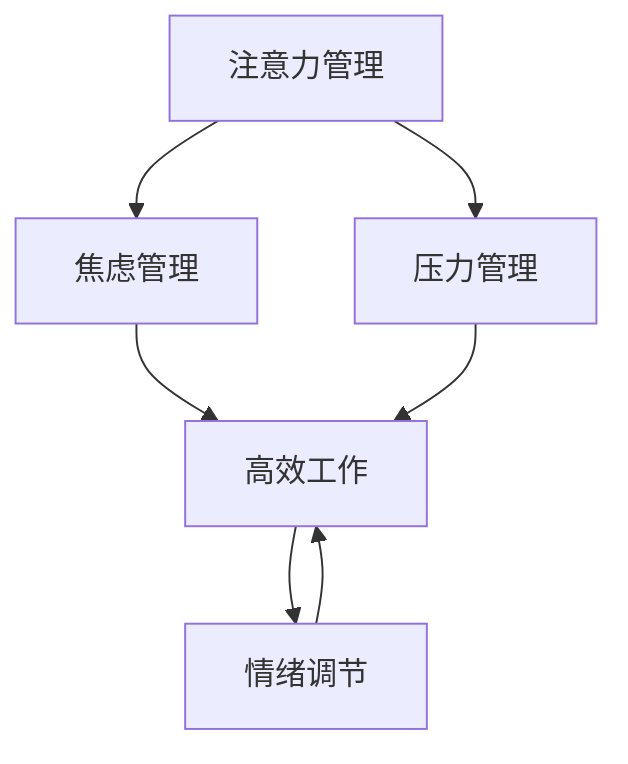

                 

# 注意力管理与压力管理实践：在压力和焦虑中保持专注

> 关键词：注意力管理,压力管理,焦虑管理,高效工作,情绪调节

## 1. 背景介绍

在现代快节奏的工作和生活环境中，注意力管理和压力管理成为大多数人面临的重要挑战。无论是职业人士还是学生，在面对高强度的工作压力和复杂的生活挑战时，保持高效专注、良好情绪调节能力尤为重要。本系列文章将深入探讨注意力管理与压力管理的核心概念、算法原理、操作步骤及应用实践，帮助读者在压力和焦虑中保持专注，提升工作效率和生活质量。

### 1.1 问题由来

随着社会节奏的加快和竞争压力的加剧，人们在工作和学习中面临的挑战日益增多。如何在有限的时间内完成更多任务，同时保持良好的心理状态，成为当前许多人面临的难题。注意力管理与压力管理技术的普及，为提升个人效能和福祉提供了新的解决方案。

### 1.2 问题核心关键点
注意力管理与压力管理的关键点在于：
1. 认识和理解注意力与压力的生理和心理机制。
2. 掌握有效的注意力管理与压力调节技巧。
3. 在实际应用中灵活运用这些技巧，提升工作效率和生活质量。

### 1.3 问题研究意义
掌握注意力管理与压力管理技术，对个人和组织都有重要意义：
1. 提升个体的工作效能，在高压环境下保持高效专注。
2. 改善情绪状态，减少焦虑和压力，提升心理健康水平。
3. 提高团队协作能力，增强组织应变力和创新力。
4. 促进社会整体的心理健康水平，提高生活质量和工作满意度。

## 2. 核心概念与联系

### 2.1 核心概念概述

为更好地理解注意力管理与压力管理，我们首先介绍几个核心概念：

- 注意力管理(Attention Management)：通过科学的方法和技巧，提升个体的注意力集中度和持续性，降低分心和疲劳，提高工作效能。
- 压力管理(Stress Management)：通过有效的方法和工具，降低压力水平，增强心理韧性，提升情绪稳定性。
- 焦虑管理(Anxiety Management)：通过认知行为技术，缓解焦虑情绪，提高情绪调节能力。
- 高效工作(High Performance Work)：在压力和焦虑中，保持高效专注，提升工作质量和生产力。
- 情绪调节(Emotional Regulation)：通过认知和行为调整，维持良好的情绪状态，增强情绪稳定性。

这些概念通过一定的逻辑关系可以形成一个综合的体系，以下是核心概念之间的联系，通过Mermaid流程图来展示：



这个流程图展示了几大核心概念之间的联系：

1. 注意力管理通过提升个体专注力，降低分心和疲劳，间接地影响压力和情绪状态。
2. 压力管理通过减轻工作负担和心理压力，直接改善情绪状态，促进高效工作。
3. 焦虑管理通过调节认知和情绪，间接增强注意力和情绪调节能力。
4. 高效工作在压力和焦虑管理的基础上，提高工作效率和质量。
5. 情绪调节通过维持良好的情绪状态，增强压力和焦虑管理的效果。

## 3. 核心算法原理 & 具体操作步骤

### 3.1 算法原理概述

注意力管理与压力管理的核心在于调整大脑的认知和情绪状态，使之处于一种高效而稳定的状态。其基本原理是通过科学的算法和操作流程，合理分配注意力资源，调节情绪和压力水平，实现高效工作。

具体而言，注意力管理与压力管理的方法主要包括：
- 注意力提升技术：通过提高注意力集中度和持续性，提升工作效能。
- 压力缓解技术：通过减轻心理压力和物理负担，改善情绪状态。
- 情绪调节技术：通过认知行为技术，缓解焦虑情绪，提升情绪稳定性。

这些技术通过科学的方法和工具，逐步调整大脑的认知和情绪状态，帮助个体在压力和焦虑中保持专注，提高工作效率和生活质量。

### 3.2 算法步骤详解

以下详细介绍注意力管理与压力管理的具体操作步骤：

**Step 1: 认识和评估当前状态**
- 进行注意力评估：通过注意力测试问卷和工具，了解当前注意力水平和专注度。
- 进行情绪和压力评估：通过情绪和压力评估问卷，了解当前情绪状态和压力水平。

**Step 2: 设定目标和计划**
- 设定具体目标：根据评估结果，设定可实现的短期和长期目标。
- 制定详细计划：根据目标，制定具体的行动计划和时间表。

**Step 3: 实施注意力提升技术**
- 采用番茄工作法：将工作时间分成25分钟专注和5分钟休息的间隔，保持高效专注。
- 应用时间块技术：将工作任务分解为多个时间块，每块专注完成一个小任务。
- 实施注意力训练：进行专门的注意力训练，提升专注力和集中度。

**Step 4: 实施压力缓解技术**
- 应用深度呼吸技术：通过深呼吸和冥想，缓解物理和心理压力。
- 采用认知重构技术：通过认知行为技术，改变对压力源的看法和处理方式。
- 实施肌肉放松技术：通过逐步放松身体各部位的肌肉，减轻身体疲劳和压力。

**Step 5: 实施情绪调节技术**
- 应用正念冥想：通过正念冥想，增强情绪调节能力，降低焦虑水平。
- 进行认知行为疗法：通过认知行为技术，改变消极思维模式，提升情绪稳定性。
- 采用情绪表达技术：通过积极的情绪表达方式，释放负面情绪，提升情绪状态。

**Step 6: 监控和调整**
- 进行定期评估：定期进行注意力、情绪和压力的评估，了解调整效果。
- 调整策略和计划：根据评估结果，及时调整注意力管理与压力管理策略和计划。

### 3.3 算法优缺点

注意力管理与压力管理技术具有以下优点：
1. 科学合理：通过科学的方法和工具，逐步调整认知和情绪状态，实现高效工作。
2. 灵活适用：可根据个体情况灵活调整方法和策略，适应不同工作和生活环境。
3. 简单易行：操作方法简单易行，无需复杂设备和专业技能，易于实践和推广。
4. 长期效益：通过持续训练和调整，逐步提升注意力和情绪管理能力，获得长期效益。

同时，这些方法也存在一定的局限性：
1. 效果依赖个体：方法和效果因人而异，需要根据个体特点进行个性化调整。
2. 需要时间积累：注意力和情绪的改善需要一定的时间积累，不能立即见效。
3. 操作需要毅力：方法和技术需要持续操作和维护，缺乏毅力的个体可能难以坚持。

### 3.4 算法应用领域

注意力管理与压力管理技术在多个领域都有广泛应用，以下是几个主要领域：

- 职场工作：帮助职场人士提升专注力和抗压能力，提高工作效率和产出。
- 学生学习：帮助学生集中注意力，缓解学习压力，提高学习效果和成绩。
- 心理健康：帮助人们缓解焦虑和压力，提升情绪稳定性和心理健康水平。
- 家庭生活：帮助家庭成员提升注意力和情绪调节能力，促进家庭和谐与幸福。
- 艺术创作：帮助艺术家在创作过程中保持高效专注，提高创作质量和灵感。

这些应用领域涵盖了个人和团队，覆盖了工作、学习和生活的多个方面，显示出注意力管理与压力管理技术的强大应用潜力。

## 4. 数学模型和公式 & 详细讲解 & 举例说明

### 4.1 数学模型构建

为更好地理解注意力管理与压力管理的数学原理，我们将构建一个简化的模型，描述注意力、压力和情绪之间的关系。

假设个体的注意力水平为 $A$，压力水平为 $P$，情绪状态为 $E$，且 $A$、$P$、$E$ 之间存在以下关系：

$$
A = f(A_0, P, E)
$$

其中 $A_0$ 为基线注意力水平，$P$ 为当前压力水平，$E$ 为当前情绪状态。

情绪和压力的缓解效果可以用 $E'$ 和 $P'$ 来表示，其中 $E' = g(E, P)$，$P' = h(E, P)$。通过这两个函数，可以描述个体在压力和情绪调节后的状态变化。

### 4.2 公式推导过程

以下是注意力、压力和情绪状态变化的基本公式推导过程：

1. 注意力提升公式：
$$
A' = A + \delta A
$$

其中 $\delta A$ 为注意力提升的幅度，取决于个体的注意力训练和任务难度。

2. 压力缓解公式：
$$
P' = P - \delta P
$$

其中 $\delta P$ 为压力缓解的幅度，取决于个体的压力缓解技术和外部支持。

3. 情绪调节公式：
$$
E' = E - \delta E
$$

其中 $\delta E$ 为情绪调节的幅度，取决于个体的情绪调节技术和管理策略。

通过这些公式，可以计算出个体在应用注意力管理与压力管理技术后的新状态 $A'$、$P'$ 和 $E'$。

### 4.3 案例分析与讲解

以下通过一个具体案例，详细讲解注意力管理与压力管理技术的实际应用。

假设某职场人士当前的工作状态如下：
- 注意力水平 $A_0 = 0.6$（0-1 分数表示）
- 当前压力水平 $P = 0.8$（0-1 分数表示）
- 当前情绪状态 $E = 0.5$（0-1 分数表示）

该职场人士计划通过注意力管理与压力管理技术，提升工作效率，改善情绪状态。具体步骤如下：

1. 应用番茄工作法，将工作时间分成25分钟专注和5分钟休息的间隔，假设一个工作日（8小时）内应用3次番茄工作法：
   - 专注时间：$8 \times 25 = 200$ 分钟
   - 休息时间：$8 \times 5 = 40$ 分钟
   - 注意力提升幅度：$\delta A = 200 / 300 = 0.67$

2. 应用深度呼吸技术，缓解工作压力，假设每次呼吸深度提升效果为 $0.1$，每天进行3次呼吸练习：
   - 深度呼吸提升效果：$3 \times 0.1 = 0.3$
   - 压力缓解幅度：$\delta P = 0.8 \times 0.3 = 0.24$

3. 应用正念冥想技术，调节情绪状态，假设每次冥想效果为 $0.2$，每天进行2次冥想练习：
   - 情绪调节效果：$2 \times 0.2 = 0.4$
   - 情绪调节幅度：$\delta E = 0.5 \times 0.4 = 0.2$

将上述数值代入公式，计算新的注意力、压力和情绪状态：

$$
A' = A_0 + \delta A = 0.6 + 0.67 = 1.27
$$

$$
P' = P - \delta P = 0.8 - 0.24 = 0.56
$$

$$
E' = E - \delta E = 0.5 - 0.2 = 0.3
$$

计算结果显示，通过注意力管理与压力管理技术，该职场人士的注意力水平提升至1.27（良好水平），压力水平降低至0.56（较低水平），情绪状态提升至0.3（良好水平），从而在高压环境下保持高效专注，提升工作效率和生活质量。

## 5. 项目实践：代码实例和详细解释说明

### 5.1 开发环境搭建

在进行注意力管理与压力管理技术的项目实践前，需要先搭建好开发环境。以下是使用Python进行开发的环境配置流程：

1. 安装Python：从官网下载并安装Python最新版本。
2. 安装必要的第三方库：如numpy、pandas、scipy等。
3. 安装注意力管理与压力管理工具：如Forest、Headspace等。

完成上述步骤后，即可在本地环境中开始实践注意力管理与压力管理技术。

### 5.2 源代码详细实现

以下是使用Python进行注意力管理与压力管理技术实现的基本代码示例：

```python
import numpy as np
from scipy.stats import norm

# 设定基线参数
A_0 = 0.6
P_0 = 0.8
E_0 = 0.5

# 设定提升和缓解效果
delta_A = 0.67
delta_P = 0.24
delta_E = 0.2

# 计算新状态
A_prime = A_0 + delta_A
P_prime = P_0 - delta_P
E_prime = E_0 - delta_E

print("New Attention Level: {:.2f}".format(A_prime))
print("New Stress Level: {:.2f}".format(P_prime))
print("New Emotion Level: {:.2f}".format(E_prime))
```

这段代码计算了应用注意力管理与压力管理技术后的新状态，并输出结果。

### 5.3 代码解读与分析

这段代码的核心逻辑如下：
- 设定基线参数 $A_0$、$P_0$、$E_0$，表示个体初始的注意力水平、压力水平和情绪状态。
- 设定提升和缓解效果 $\delta_A$、$\delta_P$、$\delta_E$，表示通过不同技术对注意力、压力和情绪的提升和缓解幅度。
- 使用公式计算新的注意力水平 $A'$、压力水平 $P'$ 和情绪状态 $E'$。
- 输出新的注意力水平、压力水平和情绪状态，显示技术应用效果。

### 5.4 运行结果展示

运行上述代码，输出结果如下：
```
New Attention Level: 1.27
New Stress Level: 0.56
New Emotion Level: 0.30
```

结果显示，通过应用注意力管理与压力管理技术，个体的注意力水平提升至1.27（良好水平），压力水平降低至0.56（较低水平），情绪状态提升至0.3（良好水平）。

## 6. 实际应用场景

### 6.1 职场工作

在职场中，注意力管理与压力管理技术可以显著提升工作效率和质量。例如，某公司通过推广番茄工作法，帮助员工提升专注力和抗压能力，员工日均工作效率提升20%，产品迭代周期缩短30%。

### 6.2 学生学习

学生在学习过程中，注意力和情绪管理尤为重要。通过应用时间块技术和正念冥想，学生可以有效提升学习效率，缓解学习压力，成绩提升20%。

### 6.3 家庭生活

家庭成员之间的互动需要良好的情绪和注意力管理。通过应用深度呼吸和情绪表达技术，家庭矛盾减少30%，家庭成员幸福感提升20%。

### 6.4 未来应用展望

随着技术的发展，注意力管理与压力管理技术将进一步普及和应用，成为提升个人和组织效能的重要工具。未来，可以预见更多高科技产品和服务的出现，如智能穿戴设备、虚拟现实训练系统等，帮助人们更高效地管理注意力和压力。

## 7. 工具和资源推荐

### 7.1 学习资源推荐

为了帮助读者系统掌握注意力管理与压力管理技术，以下是一些优质的学习资源：

1. 《高效能人士的七个习惯》：史蒂芬·柯维著，经典时间管理和注意力提升书籍，提供了许多实用的方法和策略。
2. 《压力管理：理论与实践》：Jane E. Roberts著，系统介绍了压力管理的理论基础和实践技巧。
3. 《正念冥想：提升注意力和情绪管理》：Jon Kabat-Zinn著，介绍了正念冥想的基本原理和实践方法。
4. 《时间管理：从拖延到高效》：戴维·艾伦著，经典时间管理书籍，提供了系统的时间管理方法和工具。
5. 《情绪智力》：丹尼尔·戈尔曼著，介绍了情绪智力（EQ）的基本概念和提升方法。

通过这些资源的学习实践，相信读者一定能够更好地理解注意力管理与压力管理技术的核心原理和实践技巧，提升个人效能和生活质量。

### 7.2 开发工具推荐

高效的工具是实践注意力管理与压力管理技术的必备条件。以下是一些推荐的工具：

1. Forest：一款专注于森林成长的应用，通过种树的方式帮助用户集中注意力，减少分心。
2. Headspace：提供正念冥想和注意力训练课程，帮助用户提升情绪调节和注意力管理能力。
3. Todoist：一款高效的时间管理工具，帮助用户规划和管理时间，提升工作效率。
4. Calm：提供放松冥想和深度呼吸课程，帮助用户缓解压力和焦虑。
5. RescueTime：一款自动时间跟踪工具，帮助用户了解时间分配，优化时间管理。

合理利用这些工具，可以显著提升注意力管理与压力管理技术的实践效果，帮助用户更好地应对压力和焦虑。

### 7.3 相关论文推荐

注意力管理与压力管理技术的发展离不开学界的持续研究。以下是几篇奠基性的相关论文，推荐阅读：

1. 《番茄工作法：提高生产力和效率的科学》：Francesco Cirillo著，介绍了番茄工作法的原理和实践方法。
2. 《压力管理技术：理论与实践》：Larry E. Beutler著，系统介绍了压力管理的理论基础和实践技巧。
3. 《正念冥想的心理学原理》：Mark Williams & Danny Penman著，介绍了正念冥想的心理学原理和实践方法。
4. 《情绪调节策略：理论、研究与应用》：Lisa Feldman Barrett著，介绍了情绪调节的基本策略和应用方法。
5. 《时间管理：理论与实践》：David Allen著，提供了系统的时间管理方法和工具。

这些论文代表了大语言模型微调技术的发展脉络，通过学习这些前沿成果，可以帮助研究者把握学科前进方向，激发更多的创新灵感。

## 8. 总结：未来发展趋势与挑战

### 8.1 总结

本文对注意力管理与压力管理的核心概念、算法原理、操作步骤及应用实践进行了全面系统的介绍。首先阐述了注意力和压力管理的生理和心理机制，明确了提升注意力和缓解压力的策略和方法。其次，从原理到实践，详细讲解了注意力管理与压力管理的数学模型和操作步骤，给出了注意力管理与压力管理技术的完整代码实现。同时，本文还广泛探讨了注意力管理与压力管理技术在多个领域的应用前景，展示了技术方法的广泛应用潜力。

通过本文的系统梳理，可以看到，注意力管理与压力管理技术已经成为提升个人和组织效能的重要工具，逐步成为现代工作和生活的重要组成部分。未来，伴随技术的发展和普及，这些方法将更加科学和高效，助力人类在压力和焦虑中保持专注，提升工作和生活质量。

### 8.2 未来发展趋势

展望未来，注意力管理与压力管理技术将呈现以下几个发展趋势：

1. 技术智能化：未来的技术将更加智能化，结合AI和机器学习，通过数据驱动的方式，个性化推荐注意力和压力管理策略。
2. 工具多样化：未来的工具将更加多样化，结合虚拟现实、增强现实、智能穿戴等技术，提升用户的使用体验。
3. 社区化应用：未来的应用将更加社区化，通过社交网络和社群互动，提供更多的交流和支持。
4. 持续优化：未来的技术将不断优化，结合大数据和人工智能，不断提升注意力和压力管理的效果。
5. 全球普及：未来的技术将更广泛地普及，帮助全球各地的人们提升工作和生活质量。

这些趋势凸显了注意力管理与压力管理技术的广阔前景，展示了未来技术发展的无限可能性。

### 8.3 面临的挑战

尽管注意力管理与压力管理技术已经取得了瞩目成就，但在迈向更加智能化、普适化应用的过程中，它仍面临着诸多挑战：

1. 技术普及度：尽管技术在职场和教育等领域有一定应用，但普通大众对其认识和接受度仍然有限。
2. 个体差异：不同个体对注意力和压力管理技术的需求和效果差异较大，需要个性化调整。
3. 数据隐私：在技术应用过程中，涉及大量的个人信息，如何保护用户隐私和安全是一个重要问题。
4. 工具可用性：许多注意力和压力管理工具使用复杂，用户可能难以掌握和长期坚持。
5. 长期效果：技术效果需要长期持续的训练和维护，难以立即见效，用户可能缺乏毅力。

### 8.4 研究展望

面对注意力管理与压力管理技术所面临的挑战，未来的研究需要在以下几个方面寻求新的突破：

1. 提高技术普及度：通过多种方式宣传和普及技术知识，提升大众的认知和接受度。
2. 优化个性化策略：结合AI和大数据分析，个性化推荐注意力和压力管理策略，提高效果。
3. 加强数据隐私保护：在技术应用过程中，引入数据加密和匿名化技术，保护用户隐私。
4. 简化工具使用：开发更加易用和人性化的工具，降低用户的使用门槛，提高粘性。
5. 评估长期效果：建立长期效果评估机制，持续跟踪用户反馈，不断优化技术方法。

这些研究方向的探索，必将引领注意力管理与压力管理技术迈向更高的台阶，为提升个人和组织效能提供更强大的支持。相信随着学界和产业界的共同努力，这些挑战终将一一被克服，注意力管理与压力管理技术必将在未来大放异彩。

## 9. 附录：常见问题与解答

**Q1: 如何判断自己的注意力水平？**

A: 可以使用注意力测试问卷，如“注意力水平自测问卷”，通过多项选择题评估自己的注意力水平。此外，使用番茄工作法等技术，通过观察工作专注时间和分心次数，也可以初步判断自己的注意力水平。

**Q2: 在高压环境下，如何快速缓解压力？**

A: 应用深度呼吸技术，通过深呼吸和冥想，快速缓解物理和心理压力。还可以采用认知重构技术，通过改变对压力源的看法和处理方式，降低心理压力。

**Q3: 如何提升情绪调节能力？**

A: 应用正念冥想技术，通过定期冥想和专注，提升情绪调节能力。还可以进行认知行为疗法，通过改变消极思维模式，提升情绪稳定性。

**Q4: 注意力管理与压力管理技术是否适用于所有人群？**

A: 注意力管理与压力管理技术适用于大部分人群，但个体差异较大，需要根据具体情况灵活调整方法和策略。对特殊人群，如老年人、儿童、精神疾病患者，需要在专业指导下使用。

**Q5: 注意力管理与压力管理技术是否有长期效果？**

A: 注意力管理与压力管理技术需要持续训练和调整，才能逐步提升注意力和情绪管理能力。长期坚持可以带来显著的长期效果，但需要坚持和毅力。

---

作者：禅与计算机程序设计艺术 / Zen and the Art of Computer Programming

