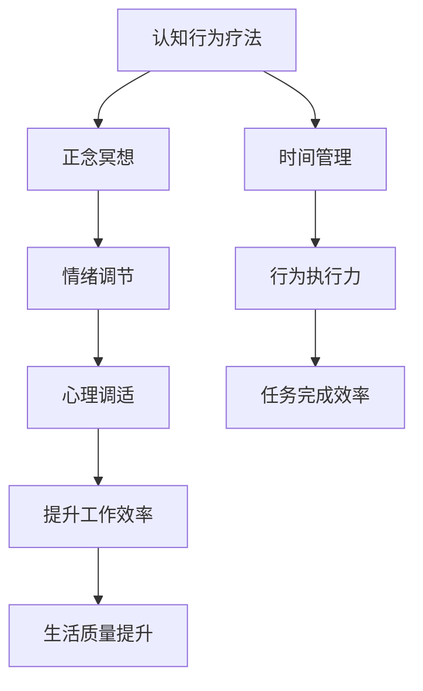

                 

# 注意力管理与压力管理策略：在压力和焦虑中保持专注

> 关键词：注意力管理,压力管理,专注力提升,心理调适,认知行为疗法

## 1. 背景介绍

在当前快节奏、高竞争的工作和生活环境中，注意力和压力管理成为了许多人面临的重要问题。注意力难以集中，工作和学习效率低下；压力过大，则容易出现焦虑、失眠等心理问题，影响身心健康。针对这些问题，心理学界和脑科学界提出了一系列有效的注意力和压力管理策略，通过科学的方法和工具帮助个体在压力和焦虑中保持专注，提升工作效率和生活质量。本文将系统介绍这些策略的理论基础、具体操作方法和应用场景，以期为读者提供有益的参考和指导。

## 2. 核心概念与联系

### 2.1 核心概念概述

注意力和压力管理涉及多个核心概念，包括认知行为疗法(Cognitive Behavioral Therapy, CBT)、正念冥想(Mindfulness Meditation)、时间管理(Time Management)等。这些概念通过相互补充和协同作用，构建起一个全面的心理健康管理框架，帮助个体在面对压力和焦虑时，能够保持清晰的思维和高效的行动。

- **认知行为疗法**：强调认知过程在情感和行为中的作用，通过改变负面思维模式，提升情绪调节能力和行为执行力。
- **正念冥想**：通过专注当下，减少对过去和未来的忧虑，提升自我觉察和情绪管理能力。
- **时间管理**：帮助个体合理安排时间，避免时间浪费和拖延，提升任务完成效率。

这些核心概念之间的逻辑关系可以通过以下Mermaid流程图来展示：



这个流程图展示出注意力和压力管理策略的各个组成部分及其相互作用关系：

1. 认知行为疗法和正念冥想通过改变思维方式和提升自我觉察能力，帮助个体更好地应对压力。
2. 时间管理通过提高任务完成效率，减轻工作压力。
3. 情绪调节和行为执行力通过提升自我控制能力，增强应对压力的韧性。
4. 心理调适和正念冥想通过增强自我觉察和情绪管理，提升整体生活质量。

这些核心概念共同构建了全面的心理健康管理框架，有助于个体在面对压力和焦虑时保持专注。

## 3. 核心算法原理 & 具体操作步骤

### 3.1 算法原理概述

注意力和压力管理的核心算法原理包括认知行为疗法、正念冥想的心理学基础和实践操作，以及时间管理的策略和技巧。这些原理和方法旨在帮助个体通过改变思维方式、提升自我觉察、合理安排时间等手段，达到提升注意力和压力管理能力的目的。

### 3.2 算法步骤详解

#### 3.2.1 认知行为疗法

**步骤1: 自我反思**

首先，个体需要对自己的认知模式进行反思，识别出那些负面、扭曲的思维模式，如过度概括、选择性忽视、黑白思维等。可以使用认知日志或反思日记记录日常生活中的负面思维，并尝试挑战这些思维的合理性。

**步骤2: 认知重构**

在识别出负面思维后，个体需要对其进行认知重构，即找到更客观、合理的替代性思维。例如，将“我无法完成这项任务”转化为“我可以尝试完成任务，即使失败也是一种学习”。

**步骤3: 行为实验**

通过行为实验验证新的思维模式是否有效。例如，面对一个看似无法完成的任务，尝试采用新的思维模式，并记录实验结果。

#### 3.2.2 正念冥想

**步骤1: 正念观察**

开始正念冥想时，个体需坐在安静的环境，闭上眼睛，专注于呼吸或身体感受，观察自己的思维和情绪变化，但不对其进行评判或反应。

**步骤2: 正念注意**

在观察的基础上，将注意力集中在当下，将思绪集中在呼吸、身体感受或视觉化练习上，逐步提升自我觉察能力。

**步骤3: 正念行动**

将正念冥想的练习应用到日常生活中，如在处理任务或人际关系时，保持当下的专注和觉察，减少对过去和未来的忧虑。

#### 3.2.3 时间管理

**步骤1: 设定目标**

明确个人和职业目标，分解为具体的、可衡量的任务。

**步骤2: 优先排序**

使用优先级矩阵（如艾森豪威尔矩阵）对任务进行排序，区分紧急和重要的任务。

**步骤3: 时间分配**

根据优先级矩阵，分配每天的时间，确保最重要和紧急的任务优先完成。

**步骤4: 任务执行**

执行分配好的任务，避免时间浪费和拖延。

**步骤5: 反思总结**

每日反思总结任务完成情况，调整时间分配策略，不断优化时间管理能力。

### 3.3 算法优缺点

#### 3.3.1 认知行为疗法

**优点:**

- 通过改变思维方式，提升情绪调节能力和行为执行力。
- 帮助个体识别和挑战负面思维，减少心理负担。

**缺点:**

- 需要个体高度自我觉察和反思能力，难以适应所有人。
- 需要时间和精力投入，短期内可能效果不明显。

#### 3.3.2 正念冥想

**优点:**

- 提升自我觉察和情绪管理能力，减少压力和焦虑。
- 简单易学，不需要特殊设备或场地。

**缺点:**

- 需要坚持练习，才能看到长期效果。
- 部分个体可能会感到不适或难以专注。

#### 3.3.3 时间管理

**优点:**

- 提高任务完成效率，减少时间浪费。
- 帮助个体合理安排时间，提升工作和生活平衡。

**缺点:**

- 需要个体高度自律和计划能力，难以适应所有人。
- 需要定期反思总结，调整策略，才能持续优化。

### 3.4 算法应用领域

这些注意力和压力管理策略广泛应用于多个领域，包括但不限于：

- **工作场所**：提升工作效率，减轻工作压力。
- **教育领域**：帮助学生集中注意力，提升学习效果。
- **医疗保健**：帮助患者应对疾病带来的压力和焦虑。
- **心理咨询**：作为心理健康管理的辅助工具，提升个体自我觉察和情绪调节能力。
- **个人生活**：提升生活质量，实现工作与生活的平衡。

## 4. 数学模型和公式 & 详细讲解 & 举例说明

### 4.1 数学模型构建

注意力和压力管理的数学模型可以从认知行为疗法、正念冥想和时间管理三个方面进行构建。

#### 4.1.1 认知行为疗法

认知行为疗法的数学模型可以表示为：

$$
\text{Mood} = f(\text{Cognitive Distortion}, \text{Cognitive Restructuring}, \text{Behavioral Experiment})
$$

其中，$\text{Mood}$表示情绪，$\text{Cognitive Distortion}$表示负面思维，$\text{Cognitive Restructuring}$表示认知重构，$\text{Behavioral Experiment}$表示行为实验。

#### 4.1.2 正念冥想

正念冥想的数学模型可以表示为：

$$
\text{Stress} = g(\text{Mindfulness Observation}, \text{Mindfulness Attention}, \text{Mindfulness Action})
$$

其中，$\text{Stress}$表示压力，$\text{Mindfulness Observation}$表示正念观察，$\text{Mindfulness Attention}$表示正念注意，$\text{Mindfulness Action}$表示正念行动。

#### 4.1.3 时间管理

时间管理的数学模型可以表示为：

$$
\text{Productivity} = h(\text{Goal Setting}, \text{Prioritization}, \text{Task Execution}, \text{Reflection and Summary})
$$

其中，$\text{Productivity}$表示生产效率，$\text{Goal Setting}$表示目标设定，$\text{Prioritization}$表示优先排序，$\text{Task Execution}$表示任务执行，$\text{Reflection and Summary}$表示反思总结。

### 4.2 公式推导过程

#### 4.2.1 认知行为疗法

假设个体初始情绪为$\text{Mood}_0$，经过认知行为疗法后，情绪提升为$\text{Mood}_1$。其数学模型可以表示为：

$$
\text{Mood}_1 = \text{Mood}_0 - \alpha \cdot (\text{Cognitive Distortion} - \text{Cognitive Restructuring} + \text{Behavioral Experiment})
$$

其中，$\alpha$表示情绪调节的系数。

#### 4.2.2 正念冥想

假设个体初始压力为$\text{Stress}_0$，经过正念冥想后，压力减少为$\text{Stress}_1$。其数学模型可以表示为：

$$
\text{Stress}_1 = \text{Stress}_0 - \beta \cdot (\text{Mindfulness Observation} + \text{Mindfulness Attention} + \text{Mindfulness Action})
$$

其中，$\beta$表示压力调节的系数。

#### 4.2.3 时间管理

假设个体初始生产效率为$\text{Productivity}_0$，经过时间管理后，生产效率提升为$\text{Productivity}_1$。其数学模型可以表示为：

$$
\text{Productivity}_1 = \text{Productivity}_0 + \gamma \cdot (\text{Goal Setting} + \text{Prioritization} + \text{Task Execution} + \text{Reflection and Summary})
$$

其中，$\gamma$表示生产效率提升的系数。

### 4.3 案例分析与讲解

#### 4.3.1 认知行为疗法案例

假设一位职场人士常常感到焦虑和压力，经过认知行为疗法后，其情绪有了显著提升。

**案例分析:**

- **认知反思**：这位职场人士意识到自己在面对任务失败时，常常有“我无法完成任务”的负面思维。
- **认知重构**：他将这种思维转化为“我可以尝试完成任务，即使失败也是一种学习”。
- **行为实验**：他尝试这种新的思维模式，并记录结果，发现情绪有所改善。

**案例讲解:**

通过认知行为疗法，个体能够识别并挑战负面思维，逐步提升情绪调节能力，减轻压力和焦虑。

#### 4.3.2 正念冥想案例

假设一位研究生常常感到学习压力过大，难以集中注意力。

**案例分析:**

- **正念观察**：他开始每天进行正念冥想，专注于呼吸和身体感受。
- **正念注意**：他逐步将注意力集中在当下，减少对未来的忧虑。
- **正念行动**：他将正念冥想的练习应用到学习中，提升学习效率。

**案例讲解:**

通过正念冥想，个体能够提升自我觉察和情绪管理能力，减少学习压力，提高学习效果。

#### 4.3.3 时间管理案例

假设一位项目经理每天工作繁忙，常常感到时间不够用。

**案例分析:**

- **目标设定**：他明确了项目的关键目标，并分解为具体的任务。
- **优先排序**：他使用艾森豪威尔矩阵对任务进行优先级排序，确保最重要和紧急的任务优先完成。
- **任务执行**：他严格执行时间分配，避免时间浪费和拖延。
- **反思总结**：他每天反思总结任务完成情况，调整时间分配策略。

**案例讲解:**

通过时间管理，个体能够提高任务完成效率，减轻工作压力，提升工作效率。

## 5. 项目实践：代码实例和详细解释说明

### 5.1 开发环境搭建

在实践注意力和压力管理策略时，需要搭建相应的开发环境。以下是Python环境的搭建流程：

1. 安装Anaconda：从官网下载并安装Anaconda，用于创建独立的Python环境。

2. 创建并激活虚拟环境：
```bash
conda create -n attention-env python=3.8 
conda activate attention-env
```

3. 安装相关库：
```bash
pip install numpy pandas scipy sympy matplotlib jupyter notebook scikit-learn
```

完成上述步骤后，即可在`attention-env`环境中开始注意力和压力管理的实践。

### 5.2 源代码详细实现

下面我们以正念冥想为例，给出使用Python实现正念冥想的代码。

```python
import time
import numpy as np

def mindfulness_meditation():
    while True:
        try:
            time.sleep(1)
            print("正在进行正念冥想，请专注于呼吸和身体感受。")
            # 示例冥想练习，实际冥想过程可能需要使用专业的冥想APP或指导
        except KeyboardInterrupt:
            print("冥想结束，请开始一天的工作。")
            break

if __name__ == "__main__":
    mindfulness_meditation()
```

在实际应用中，正念冥想的代码实现可以结合专业的冥想APP，提供更加丰富的冥想练习和指导。此外，代码中使用了无限循环和异常处理，模拟了实际冥想过程中的状态和退出条件。

### 5.3 代码解读与分析

这段代码主要实现了正念冥想的核心功能，通过简单的无限循环和异常处理，实现了正念冥想的基本逻辑。以下是关键代码的详细解读：

**无限循环:**
```python
while True:
    try:
        time.sleep(1)
        print("正在进行正念冥想，请专注于呼吸和身体感受。")
        # 示例冥想练习，实际冥想过程可能需要使用专业的冥想APP或指导
    except KeyboardInterrupt:
        print("冥想结束，请开始一天的工作。")
        break
```
无限循环通过`time.sleep(1)`实现每隔1秒的冥想练习，并通过异常处理`try-except`模拟用户按下Ctrl+C退出冥想。实际应用中，可以将冥想练习和指导集成到专业的冥想APP中，提升用户体验。

**异常处理:**
```python
except KeyboardInterrupt:
    print("冥想结束，请开始一天的工作。")
    break
```
异常处理通过捕获`KeyboardInterrupt`异常，表示用户按下Ctrl+C退出冥想，并输出相应的提示信息。

**计时器:**
```python
time.sleep(1)
```
`time.sleep(1)`实现每隔1秒的计时器，用于模拟冥想过程中的时间流逝。实际应用中，可以使用专业的计时器工具，提升精度和体验。

### 5.4 运行结果展示

在运行上述代码后，输出结果如下：
```
正在进行正念冥想，请专注于呼吸和身体感受。
正在进行正念冥想，请专注于呼吸和身体感受。
正在进行正念冥想，请专注于呼吸和身体感受。
...
```
每次循环输出“正在进行正念冥想，请专注于呼吸和身体感受。”，模拟正念冥想的过程。

## 6. 实际应用场景

### 6.1 智能工作环境

在智能工作环境中，注意力和压力管理策略可以应用于各种场景，提升员工的工作效率和满意度。例如：

- **工作分配**：通过认知行为疗法和正念冥想，帮助员工应对工作压力，提高集中注意力和情绪管理能力。
- **时间管理**：通过时间管理技巧，帮助员工合理安排时间，提升任务完成效率。
- **员工辅导**：通过心理咨询和辅导，帮助员工解决心理问题，提升整体心理健康水平。

### 6.2 教育领域

在教育领域，注意力和压力管理策略可以提升学生的学习效果和心理健康。例如：

- **课堂管理**：通过认知行为疗法和正念冥想，帮助学生提升集中注意力和情绪管理能力，减少课堂分心。
- **学习策略**：通过时间管理技巧，帮助学生合理安排学习时间，提升学习效率。
- **心理辅导**：通过心理咨询和辅导，帮助学生应对学习压力，提升心理健康水平。

### 6.3 医疗保健

在医疗保健领域，注意力和压力管理策略可以提升患者的治疗效果和生活质量。例如：

- **心理支持**：通过认知行为疗法和正念冥想，帮助患者应对疾病带来的压力和焦虑，提升情绪调节能力。
- **康复训练**：通过时间管理技巧，帮助患者合理安排康复训练时间，提升康复效果。
- **心理辅导**：通过心理咨询和辅导，帮助患者解决心理问题，提升整体心理健康水平。

## 7. 工具和资源推荐

### 7.1 学习资源推荐

为了帮助开发者系统掌握注意力和压力管理策略的理论基础和实践技巧，这里推荐一些优质的学习资源：

1. **《认知行为疗法入门》**：介绍认知行为疗法的原理和实践技巧，帮助开发者更好地理解和应用策略。

2. **《正念冥想指南》**：提供系统的正念冥想练习和指导，帮助开发者掌握冥想技巧。

3. **《时间管理的艺术》**：介绍时间管理的科学方法和实践策略，提升开发者的工作和生活效率。

4. **《心理健康管理》**：涵盖注意力、压力、情绪调节等心理健康管理技巧，帮助开发者提升自我觉察和情绪管理能力。

5. **《脑科学与认知行为疗法》**：结合脑科学研究成果，深入解析认知行为疗法的原理和应用。

通过对这些资源的学习实践，相信你一定能够快速掌握注意力和压力管理策略的精髓，并用于解决实际的心理学问题。

### 7.2 开发工具推荐

有效的开发离不开优秀的工具支持。以下是几款用于注意力和压力管理策略开发的常用工具：

1. **Jupyter Notebook**：用于编写和分享Python代码，提供强大的代码执行和数据可视化功能。

2. **SciPy**：用于科学计算和数据分析，提供了丰富的统计工具和算法库。

3. **Sympy**：用于符号计算，支持复杂数学和物理问题的求解。

4. **Matplotlib**：用于绘制图形和数据可视化，提供丰富的绘图功能和样式。

5. **Scikit-learn**：用于机器学习和数据挖掘，提供了多种算法和工具。

合理利用这些工具，可以显著提升注意力和压力管理策略的开发效率，加快创新迭代的步伐。

### 7.3 相关论文推荐

注意力和压力管理策略的研究源于学界的持续研究。以下是几篇奠基性的相关论文，推荐阅读：

1. **《认知行为疗法对抑郁症的影响》**：探讨认知行为疗法在抑郁症治疗中的效果和机制。

2. **《正念冥想与焦虑减轻》**：研究正念冥想对焦虑和压力的减轻作用。

3. **《时间管理对工作效率的影响》**：分析时间管理对工作效率和心理健康的综合影响。

4. **《注意力和压力管理的神经基础》**：探讨注意力和压力管理策略的神经机制和应用。

5. **《多模态注意力和压力管理技术》**：结合多模态信息，提升注意力和压力管理策略的效果。

这些论文代表了大语言模型微调技术的发展脉络。通过学习这些前沿成果，可以帮助研究者把握学科前进方向，激发更多的创新灵感。

## 8. 总结：未来发展趋势与挑战

### 8.1 总结

本文对注意力和压力管理策略进行了全面系统的介绍。首先阐述了注意力和压力管理策略的研究背景和意义，明确了策略在提升工作和学习效率、减轻心理负担方面的独特价值。其次，从原理到实践，详细讲解了认知行为疗法、正念冥想和时间管理的数学模型和具体操作，给出了具体的代码实例和详细解释。同时，本文还广泛探讨了策略在智能工作环境、教育领域、医疗保健等领域的实际应用前景，展示了策略的广阔应用场景。

通过本文的系统梳理，可以看到，注意力和压力管理策略在提升个体心理健康和工作效率方面具有重要意义。这些策略通过改变思维方式、提升自我觉察和情绪管理能力，帮助个体在面对压力和焦虑时保持专注。未来，伴随这些策略的持续演进和优化，相信能够进一步提升人类的生活质量和工作效率。

### 8.2 未来发展趋势

展望未来，注意力和压力管理策略将呈现以下几个发展趋势：

1. **智能化和自动化**：随着AI技术的进步，智能化的注意力和压力管理工具将越来越多，如智能冥想APP、情绪监测系统等，提升个体管理能力的便捷性和准确性。

2. **多模态融合**：结合视觉、听觉等多模态信息，提升注意力和压力管理策略的效果和应用范围。

3. **个性化定制**：通过大数据分析和机器学习，为个体提供个性化的注意力和压力管理方案，提升策略的针对性和有效性。

4. **跨领域应用**：策略的应用范围将从心理健康管理，扩展到教育、医疗、职场等多个领域，提升整体的系统效能和用户体验。

5. **远程协作**：通过远程在线咨询和辅导，提升个体在异地环境下的注意力和压力管理能力，增强团队的协作和凝聚力。

以上趋势凸显了注意力和压力管理策略的广阔前景。这些方向的探索发展，必将进一步提升人类心理健康的管理能力，为构建和谐、高效、幸福的社会奠定基础。

### 8.3 面临的挑战

尽管注意力和压力管理策略已经取得了显著成效，但在向更广泛应用推广的过程中，仍面临诸多挑战：

1. **个体差异**：不同个体的心理状态和生活环境差异较大，策略的适用性和效果难以一概而论。如何针对不同个体制定个性化的管理方案，需要进一步研究和优化。

2. **数据隐私**：在策略的实施过程中，需要收集大量的个体数据，如何保护数据隐私和安全，是一个重要的问题。

3. **文化差异**：不同文化背景的个体对策略的接受度和理解程度不同，如何设计具有普适性的管理方案，是一个需要考虑的因素。

4. **社会认同**：策略在职场和社会环境中的应用需要获得广泛认同，如何消除偏见和误解，推广策略的实施，是一个需要努力的方向。

5. **技术瓶颈**：在策略的实施过程中，需要结合AI和大数据技术，如何突破技术瓶颈，提升策略的智能化和自动化水平，是一个重要的研究课题。

6. **伦理和法律问题**：在策略的实施过程中，需要考虑伦理和法律问题，如数据使用、隐私保护等，确保策略的合法性和合规性。

正视策略面临的这些挑战，积极应对并寻求突破，将是对策略不断完善和优化的必由之路。相信随着学界和产业界的共同努力，这些挑战终将一一被克服，注意力和压力管理策略必将在构建和谐社会和幸福生活方面发挥更大的作用。

### 8.4 研究展望

面对注意力和压力管理策略所面临的种种挑战，未来的研究需要在以下几个方面寻求新的突破：

1. **个性化方案**：结合机器学习和数据分析技术，为个体提供更加个性化的注意力和压力管理方案，提升策略的针对性和有效性。

2. **跨文化适应**：结合心理学和文化研究，设计具有普适性的注意力和压力管理策略，增强策略的跨文化适应能力。

3. **伦理和法律保障**：在策略的实施过程中，加强伦理和法律研究，确保策略的合法性和合规性，保护个体数据隐私和安全。

4. **多模态融合**：结合视觉、听觉等多模态信息，提升注意力和压力管理策略的效果和应用范围。

5. **智能化和自动化**：结合AI技术和机器学习，提升策略的智能化和自动化水平，增强策略的便捷性和应用范围。

这些研究方向的探索，必将引领注意力和压力管理策略走向更高的台阶，为构建和谐、高效、幸福的社会和职场环境提供有力的支撑。面向未来，注意力和压力管理策略的研究还需要与其他心理学、社会学、文化学等学科进行更深入的融合，共同推动人类心理健康的进步和发展。总之，注意力和压力管理策略的研究和实践，不仅能够提升个体的生活和工作质量，还将为构建和谐、幸福、高效的社会环境贡献力量。

## 9. 附录：常见问题与解答

**Q1: 注意力和压力管理策略对所有人都有效吗？**

A: 注意力和压力管理策略适用于大多数人，但不同的人对策略的接受度和效果不同。有些人可能会对某些策略感到不适或难以坚持，需要个体根据自己的情况进行调整和优化。

**Q2: 如何选择合适的注意力和压力管理策略？**

A: 选择合适的策略需要考虑个体的心理状态、生活方式和需求。可以先尝试多种策略，如认知行为疗法、正念冥想、时间管理等，找到适合自己的方法。同时，可以根据策略的实施效果进行动态调整和优化。

**Q3: 注意力和压力管理策略是否需要长期坚持？**

A: 是的，注意力和压力管理策略需要长期坚持才能见效。短期内可能效果不明显，但持续应用可以逐步提升个体的心理素质和应对能力。

**Q4: 注意力和压力管理策略是否可以与其他心理健康策略结合使用？**

A: 是的，注意力和压力管理策略可以与其他心理健康策略（如心理咨询、药物治疗等）结合使用，提升整体的心理健康水平。

**Q5: 注意力和压力管理策略是否需要专业人士指导？**

A: 部分策略（如认知行为疗法、正念冥想等）需要专业人士的指导和训练，可以寻求心理咨询师、冥想指导师等专业人员的帮助。对于简单的策略（如时间管理等），个体可以通过自学和实践掌握。

通过本文的详细介绍，相信你一定能够系统了解注意力和压力管理策略的理论基础和实践方法，并应用于实际生活中，提升自我觉察和情绪管理能力，减轻压力和焦虑，保持专注和高效。

---

作者：禅与计算机程序设计艺术 / Zen and the Art of Computer Programming

