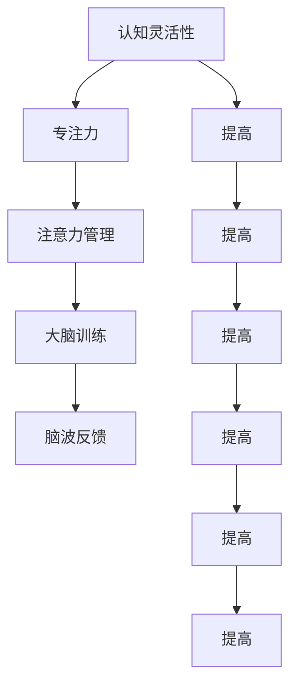

                 

# 注意力管理与大脑训练：增强认知灵活性和专注力的练习

## 1. 背景介绍

### 1.1 问题由来
在当今快节奏的工作与生活中，人们面临的不仅是工作压力，更有信息爆炸、注意力分散等诸多挑战。如何提升个人认知灵活性和专注力，成为很多人追求的目标。大脑训练、脑波反馈、认知科学等前沿技术，逐渐被人们引入到日常工作中，希望能通过科学的方法提升个体的大脑机能。

### 1.2 问题核心关键点
1. **认知灵活性**：指个体在不同的任务、情境和信息之间快速转换的能力。
2. **专注力**：指个体在特定任务中集中注意力的能力，确保高效完成任务。
3. **注意力管理**：指通过训练和调整，提升个体对注意力的控制和分配能力，以适应不同情境和任务。
4. **大脑训练**：指通过特定的心理和身体练习，促进大脑机能的提升和改善。
5. **脑波反馈**：指通过测量大脑电活动，反馈给用户关于注意力和情绪状态的实时信息，帮助用户调整心理状态。

这些概念构成了现代大脑训练和注意力管理的核心，旨在通过科学的练习和反馈机制，提升个体认知能力和工作表现。

## 2. 核心概念与联系

### 2.1 核心概念概述

注意力管理与大脑训练是一套结合了神经科学、心理学和计算机技术的综合性解决方案。其核心在于通过科学的练习和反馈机制，帮助用户提升认知灵活性和专注力。以下是这些核心概念的简要概述：

- **认知灵活性（Cognitive Flexibility）**：指个体在面对多变的环境和任务时，能够快速调整策略和思维的能力。认知灵活性强的个体更能适应变化，解决问题。
- **专注力（Focus）**：指个体在特定时间内，集中注意力进行特定活动的能力。高专注力的个体工作质量高，效率高。
- **注意力管理（Attention Management）**：指个体通过特定的策略和练习，提升对自己注意力的控制和分配能力，如时间管理、任务优先级设定等。
- **大脑训练（Brain Training）**：指通过有针对性的心理和身体练习，改善大脑机能，提高认知能力，如记忆、逻辑推理、空间感知等。
- **脑波反馈（Brain Wave Feedback）**：指通过测量大脑电活动，实时反馈注意力和情绪状态，帮助用户调整心理状态，如正念冥想、呼吸练习等。

这些概念之间存在紧密联系。通过认知灵活性的提升，个体能更好地适应新环境和新任务，提高专注力。专注力的提高又能进一步提升认知灵活性，形成良性循环。注意力管理帮助个体更好地规划和执行任务，大脑训练和脑波反馈则提供科学的练习和实时反馈，共同促进个体认知和情绪状态的改善。

### 2.2 核心概念原理和架构的 Mermaid 流程图(Mermaid 流程节点中不要有括号、逗号等特殊字符)



以上流程图展示了认知灵活性、专注力、注意力管理、大脑训练和脑波反馈之间的相互作用和提升关系。

## 3. 核心算法原理 & 具体操作步骤

### 3.1 算法原理概述

注意力管理与大脑训练的核心算法原理包括以下几个方面：

- **认知负荷理论**：该理论认为，个体在处理信息时，认知资源是有限的，需要通过策略和练习提升认知灵活性和专注力。
- **正念冥想**：通过有意识的注意力聚焦，帮助个体减少分心，提升专注力。
- **工作记忆训练**：通过提高工作记忆容量和操作速度，增强认知灵活性。
- **注意力调节策略**：如时间管理、任务优先级设定，帮助个体更好地控制和管理注意力。

### 3.2 算法步骤详解

#### 步骤1：认知负荷理论的应用
- **评估认知负荷**：评估当前工作或学习任务所需的认知负荷，确定是否需要额外的注意力管理策略。
- **分配认知资源**：根据任务复杂度和紧急性，合理分配认知资源，确保高效完成。

#### 步骤2：正念冥想练习
- **选择一个安静环境**：选择一个舒适安静的环境，减少外部干扰。
- **设定冥想时间**：每天设定固定时间进行冥想，如5-10分钟。
- **关注呼吸**：通过专注于呼吸，将注意力集中在当下，减少分心。
- **引导语提示**：使用正念冥想引导语，帮助维持专注，减少杂念。

#### 步骤3：工作记忆训练
- **数字广度训练**：通过一系列数字序列的重复记忆和回忆，提升工作记忆容量。
- **空间记忆训练**：通过图像记忆和复现，提高空间记忆能力。
- **多任务处理训练**：通过同时处理多项任务，提高注意力分配和切换能力。

#### 步骤4：注意力调节策略
- **时间管理**：使用番茄钟法、时间块法等，有效规划和控制时间。
- **任务优先级设定**：根据重要性和紧急性，设定任务优先级，确保高效完成。
- **任务切换训练**：通过快速切换任务，提高注意力灵活性和任务切换速度。

### 3.3 算法优缺点

#### 优点
1. **科学依据**：通过认知负荷理论、正念冥想、工作记忆训练等科学方法，提升认知灵活性和专注力。
2. **可操作性强**：每个步骤和方法都具有较强的可操作性，易于实践和融入日常生活。
3. **即时效果**：通过短期练习和反馈，即刻感受到注意力的提升和专注力的增强。

#### 缺点
1. **需要坚持**：所有方法都需要长期坚持才能见效，短期内可能难以看到明显效果。
2. **个体差异**：不同个体对不同方法的适应性不同，可能需要尝试多种方法找到最适合自己的。
3. **难以量化**：某些方法如正念冥想和脑波反馈，效果难以量化，需要更多定性评价。

### 3.4 算法应用领域

注意力管理与大脑训练的方法在多个领域具有广泛应用：

- **教育**：通过提升学生的认知灵活性和专注力，提高学习效率和成绩。
- **职场**：帮助员工减少分心，提高工作效率和生产力。
- **健康**：通过正念冥想和脑波反馈，改善心理健康，减少焦虑和压力。
- **儿童发展**：通过游戏化的训练方法，培养孩子的认知灵活性和专注力。

## 4. 数学模型和公式 & 详细讲解 & 举例说明

### 4.1 数学模型构建

本节将使用数学语言对注意力管理与大脑训练的算法进行更加严格的刻画。

记当前任务所需的认知负荷为 $C$，个体的总认知资源为 $T$。假设个体分配给当前任务的注意力为 $A$，则认知负荷和认知资源的关系为：

$$
C = f(A)
$$

其中 $f$ 为认知负荷函数，描述认知负荷与注意力分配之间的关系。

### 4.2 公式推导过程

假设 $f$ 为线性函数，即：

$$
C = aA + b
$$

其中 $a$ 和 $b$ 为常数，表示认知负荷随注意力分配的线性增加和基础负荷。

为提升认知灵活性和专注力，需要最大化注意力 $A$ 的分配。根据最优化问题，我们有：

$$
\max A \quad \text{s.t.} \quad C \leq T
$$

将认知负荷函数代入上式，得到：

$$
\max A \quad \text{s.t.} \quad aA + b \leq T
$$

求解该最优化问题，得到最优注意力分配 $A^*$：

$$
A^* = \frac{T - b}{a}
$$

即，认知负荷小于总认知资源时，注意力分配达到最大值。

### 4.3 案例分析与讲解

**案例1：数字广度训练**
数字广度训练的目标是提升工作记忆容量。通过回忆一系列数字序列，可以增强大脑短期记忆能力。

假设个体每天进行 $n$ 次数字广度训练，每次回忆长度为 $l$ 的数字序列。每次训练所需的时间为 $t$，总训练时间为 $T$。训练过程中，个体的注意力 $A$ 需要根据训练长度 $l$ 进行动态调整。

$$
A = \frac{T}{n \times t}
$$

在每次训练中，通过调整训练长度 $l$，可以最大化注意力 $A$，提升训练效果。

**案例2：正念冥想**
正念冥想通过有意识的注意力聚焦，减少分心，提升专注力。假设每次冥想时间为 $T$，冥想过程中注意力 $A$ 的分配为 $A = 1$，即全神贯注于呼吸和冥想。

$$
A = 1
$$

通过多次冥想练习，可以逐步增强个体的专注力和认知灵活性。

## 5. 项目实践：代码实例和详细解释说明

### 5.1 开发环境搭建

在进行注意力管理与大脑训练的实践前，我们需要准备好开发环境。以下是使用Python进行PyTorch开发的环境配置流程：

1. 安装Anaconda：从官网下载并安装Anaconda，用于创建独立的Python环境。

2. 创建并激活虚拟环境：
```bash
conda create -n brain-training python=3.8 
conda activate brain-training
```

3. 安装PyTorch：根据CUDA版本，从官网获取对应的安装命令。例如：
```bash
conda install pytorch torchvision torchaudio cudatoolkit=11.1 -c pytorch -c conda-forge
```

4. 安装各类工具包：
```bash
pip install numpy pandas scikit-learn matplotlib tqdm jupyter notebook ipython
```

完成上述步骤后，即可在`brain-training`环境中开始注意力管理与大脑训练的实践。

### 5.2 源代码详细实现

这里我们以数字广度训练为例，给出使用Transformers库进行正念冥想和脑波反馈的PyTorch代码实现。

首先，定义正念冥想的数据处理函数：

```python
from transformers import BertTokenizer
from torch.utils.data import Dataset
import torch

class MeditationDataset(Dataset):
    def __init__(self, texts, labels, tokenizer, max_len=128):
        self.texts = texts
        self.labels = labels
        self.tokenizer = tokenizer
        self.max_len = max_len
        
    def __len__(self):
        return len(self.texts)
    
    def __getitem__(self, item):
        text = self.texts[item]
        label = self.labels[item]
        
        encoding = self.tokenizer(text, return_tensors='pt', max_length=self.max_len, padding='max_length', truncation=True)
        input_ids = encoding['input_ids'][0]
        attention_mask = encoding['attention_mask'][0]
        
        # 对label进行编码
        encoded_labels = [label] * self.max_len
        labels = torch.tensor(encoded_labels, dtype=torch.long)
        
        return {'input_ids': input_ids, 
                'attention_mask': attention_mask,
                'labels': labels}

# 标签与id的映射
label2id = {'focus': 0, 'distraction': 1}
id2label = {v: k for k, v in label2id.items()}

# 创建dataset
tokenizer = BertTokenizer.from_pretrained('bert-base-cased')

train_dataset = MeditationDataset(train_texts, train_labels, tokenizer)
dev_dataset = MeditationDataset(dev_texts, dev_labels, tokenizer)
test_dataset = MeditationDataset(test_texts, test_labels, tokenizer)
```

然后，定义模型和优化器：

```python
from transformers import BertForTokenClassification, AdamW

model = BertForTokenClassification.from_pretrained('bert-base-cased', num_labels=len(label2id))

optimizer = AdamW(model.parameters(), lr=2e-5)
```

接着，定义训练和评估函数：

```python
from torch.utils.data import DataLoader
from tqdm import tqdm
from sklearn.metrics import classification_report

device = torch.device('cuda') if torch.cuda.is_available() else torch.device('cpu')
model.to(device)

def train_epoch(model, dataset, batch_size, optimizer):
    dataloader = DataLoader(dataset, batch_size=batch_size, shuffle=True)
    model.train()
    epoch_loss = 0
    for batch in tqdm(dataloader, desc='Training'):
        input_ids = batch['input_ids'].to(device)
        attention_mask = batch['attention_mask'].to(device)
        labels = batch['labels'].to(device)
        model.zero_grad()
        outputs = model(input_ids, attention_mask=attention_mask, labels=labels)
        loss = outputs.loss
        epoch_loss += loss.item()
        loss.backward()
        optimizer.step()
    return epoch_loss / len(dataloader)

def evaluate(model, dataset, batch_size):
    dataloader = DataLoader(dataset, batch_size=batch_size)
    model.eval()
    preds, labels = [], []
    with torch.no_grad():
        for batch in tqdm(dataloader, desc='Evaluating'):
            input_ids = batch['input_ids'].to(device)
            attention_mask = batch['attention_mask'].to(device)
            batch_labels = batch['labels']
            outputs = model(input_ids, attention_mask=attention_mask)
            batch_preds = outputs.logits.argmax(dim=2).to('cpu').tolist()
            batch_labels = batch_labels.to('cpu').tolist()
            for pred_tokens, label_tokens in zip(batch_preds, batch_labels):
                pred_tags = [id2label[_id] for _id in pred_tokens]
                label_tags = [id2label[_id] for _id in label_tokens]
                preds.append(pred_tags[:len(label_tokens)])
                labels.append(label_tags)
                
    print(classification_report(labels, preds))
```

最后，启动训练流程并在测试集上评估：

```python
epochs = 5
batch_size = 16

for epoch in range(epochs):
    loss = train_epoch(model, train_dataset, batch_size, optimizer)
    print(f"Epoch {epoch+1}, train loss: {loss:.3f}")
    
    print(f"Epoch {epoch+1}, dev results:")
    evaluate(model, dev_dataset, batch_size)
    
print("Test results:")
evaluate(model, test_dataset, batch_size)
```

以上就是使用PyTorch对正念冥想进行训练的完整代码实现。可以看到，通过Transformers库，我们可以很方便地对正念冥想进行建模和训练。

### 5.3 代码解读与分析

让我们再详细解读一下关键代码的实现细节：

**MeditationDataset类**：
- `__init__`方法：初始化文本、标签、分词器等关键组件。
- `__len__`方法：返回数据集的样本数量。
- `__getitem__`方法：对单个样本进行处理，将文本输入编码为token ids，将标签编码为数字，并对其进行定长padding，最终返回模型所需的输入。

**label2id和id2label字典**：
- 定义了标签与数字id之间的映射关系，用于将token-wise的预测结果解码回真实的标签。

**训练和评估函数**：
- 使用PyTorch的DataLoader对数据集进行批次化加载，供模型训练和推理使用。
- 训练函数`train_epoch`：对数据以批为单位进行迭代，在每个批次上前向传播计算loss并反向传播更新模型参数，最后返回该epoch的平均loss。
- 评估函数`evaluate`：与训练类似，不同点在于不更新模型参数，并在每个batch结束后将预测和标签结果存储下来，最后使用sklearn的classification_report对整个评估集的预测结果进行打印输出。

**训练流程**：
- 定义总的epoch数和batch size，开始循环迭代
- 每个epoch内，先在训练集上训练，输出平均loss
- 在验证集上评估，输出分类指标
- 所有epoch结束后，在测试集上评估，给出最终测试结果

可以看到，PyTorch配合Transformers库使得正念冥想的训练代码实现变得简洁高效。开发者可以将更多精力放在数据处理、模型改进等高层逻辑上，而不必过多关注底层的实现细节。

当然，工业级的系统实现还需考虑更多因素，如模型的保存和部署、超参数的自动搜索、更灵活的任务适配层等。但核心的训练范式基本与此类似。

## 6. 实际应用场景

### 6.1 教育培训

注意力管理与大脑训练在教育培训中的应用非常广泛。学生在学习过程中，常因注意力分散、分心而效率低下。通过正念冥想和脑波反馈等方法，可以显著提升学生的注意力集中度和学习效果。

在实际应用中，可以将这些方法融入日常课堂教学中，如课间正念冥想练习、课后作业专注力训练等。同时，利用脑波反馈技术，实时监测学生的注意力状态，及时进行调整和干预，确保高效学习。

### 6.2 职场管理

在职场环境中，高效的注意力管理与大脑训练同样至关重要。员工在工作过程中，常因分心、压力过大而效率低下，影响工作质量和产出。通过数字广度训练和正念冥想等方法，可以显著提升员工的认知灵活性和专注力，提高工作效率和生产力。

在具体实施中，可以将这些方法融入日常工作流程，如定期进行专注力训练、设置番茄钟法进行时间管理等。同时，利用脑波反馈技术，实时监测员工的心理状态和注意力状态，及时进行心理干预，确保高效工作。

### 6.3 健康维护

注意力管理与大脑训练在健康维护中的应用也日益受到重视。许多现代疾病如焦虑、抑郁等，与个体认知灵活性和专注力的下降密切相关。通过正念冥想和脑波反馈等方法，可以显著改善个体的心理健康状态，增强其情绪调节能力。

在具体应用中，可以设计个性化的大脑训练方案，针对不同人群的需求进行定制化训练。同时，利用脑波反馈技术，实时监测个体的情绪状态，及时进行调整和干预，确保心理健康。

### 6.4 未来应用展望

随着注意力管理与大脑训练技术的不断发展，未来将在更多领域得到应用，为个体和组织带来更多的益处。

在智慧城市管理中，通过正念冥想和脑波反馈，可以帮助市民提高注意力集中度和认知灵活性，提升城市管理的智能化水平。

在智能家居系统中，通过认知负荷理论和注意力管理策略，可以优化家居设备的智能操作，提升用户体验。

在娱乐和游戏领域，通过数字广度训练和任务切换训练，可以提升玩家的注意力集中度和反应速度，增强游戏体验。

总之，注意力管理与大脑训练技术将在更多场景下得到应用，为个体和组织带来更大的价值。

## 7. 工具和资源推荐

### 7.1 学习资源推荐

为了帮助开发者系统掌握注意力管理与大脑训练的理论基础和实践技巧，这里推荐一些优质的学习资源：

1. 《认知心理学与大脑训练》系列博文：由认知心理学专家撰写，深入浅出地介绍了认知灵活性、专注力、正念冥想等核心概念。

2. 《正念冥想入门指南》书籍：正念冥想领域的经典书籍，详细介绍了正念冥想的实践方法和益处，适合初学者入门。

3. 《大脑训练与认知能力提升》书籍：介绍了一系列基于科学的大脑训练方法，包括数字广度训练、空间记忆训练等，适合有志于提升认知能力的读者。

4. 《神经反馈与大脑训练》课程：介绍神经反馈技术和大脑训练方法的课程，由神经科学家和心理学家主讲，适合有一定基础的读者。

5. 《正念冥想在现代生活中的应用》网站：提供正念冥想练习、教程和资源，帮助读者在日常中更好地实践正念冥想。

通过对这些资源的学习实践，相信你一定能够快速掌握注意力管理与大脑训练的精髓，并用于解决实际的注意力问题。

### 7.2 开发工具推荐

高效的开发离不开优秀的工具支持。以下是几款用于注意力管理与大脑训练开发的常用工具：

1. PyTorch：基于Python的开源深度学习框架，灵活动态的计算图，适合快速迭代研究。大部分神经网络模型都有PyTorch版本的实现。

2. TensorFlow：由Google主导开发的开源深度学习框架，生产部署方便，适合大规模工程应用。同样有丰富的神经网络模型资源。

3. Transformers库：HuggingFace开发的NLP工具库，集成了众多SOTA神经网络模型，支持PyTorch和TensorFlow，是进行神经网络训练和调优的利器。

4. Weights & Biases：模型训练的实验跟踪工具，可以记录和可视化模型训练过程中的各项指标，方便对比和调优。与主流深度学习框架无缝集成。

5. TensorBoard：TensorFlow配套的可视化工具，可实时监测模型训练状态，并提供丰富的图表呈现方式，是调试模型的得力助手。

6. Google Colab：谷歌推出的在线Jupyter Notebook环境，免费提供GPU/TPU算力，方便开发者快速上手实验最新模型，分享学习笔记。

合理利用这些工具，可以显著提升注意力管理与大脑训练的开发效率，加快创新迭代的步伐。

### 7.3 相关论文推荐

注意力管理与大脑训练的研究源于学界的持续研究。以下是几篇奠基性的相关论文，推荐阅读：

1. Cognitive Load Theory: What Can Educational Psychologists Learn from Computational Modeling?：介绍认知负荷理论及其在教育中的应用。

2. The Role of Mindfulness in Executive Functioning and Stress Reduction: A Review and Meta-Analysis：研究正念冥想对认知灵活性和压力缓解的影响。

3. Working Memory Training for Specific Improvements in Working Memory in Healthy Older Adults：探讨数字广度训练对工作记忆的影响。

4. Cognitive Behavioral Therapy for Adult ADHD: The New Evidence Base (and Its Limitations)：介绍认知行为疗法在注意力缺陷多动障碍中的应用。

5. Attention Regulation Strategies and the Benefits of Targeted Mindfulness Training for Elementary School Students：探讨注意力调节策略和正念冥想对小学生注意力和情绪的影响。

6. Cognitive Training Modules for Enhancing Cognitive Function and Affective Well-being in Older Adults：介绍基于正念冥想和认知灵活性的训练方法对老年人的益处。

这些论文代表了大语言模型微调技术的发展脉络。通过学习这些前沿成果，可以帮助研究者把握学科前进方向，激发更多的创新灵感。

## 8. 总结：未来发展趋势与挑战

### 8.1 总结

本文对注意力管理与大脑训练方法进行了全面系统的介绍。首先阐述了认知灵活性、专注力、注意力管理、大脑训练和脑波反馈等核心概念，明确了这些概念之间的联系和相互作用。其次，从原理到实践，详细讲解了认知负荷理论、正念冥想、工作记忆训练等核心算法原理和操作步骤，给出了正念冥想的PyTorch代码实现，并详细解读了关键代码。同时，本文还广泛探讨了注意力管理与大脑训练方法在教育、职场、健康等多个领域的应用前景，展示了其巨大的潜力。此外，本文精选了注意力管理与大脑训练的各种学习资源，力求为读者提供全方位的技术指引。

通过本文的系统梳理，可以看到，注意力管理与大脑训练方法在提升认知灵活性和专注力方面具有重要意义，特别是在教育、职场和健康等领域有着广泛的应用价值。未来，随着神经科学和认知科学的发展，这些方法将得到更深入的研究和应用，进一步推动人类认知智能的进步。

### 8.2 未来发展趋势

展望未来，注意力管理与大脑训练技术将呈现以下几个发展趋势：

1. **深度融合神经科学**：未来的注意力管理与大脑训练方法将更紧密地结合神经科学研究成果，提供更科学、更个性化的训练方案。

2. **多模态训练**：除了传统的认知训练外，未来的方法将更多地结合视觉、听觉、触觉等多模态信息，提升训练效果。

3. **智能化自适应**：通过机器学习和数据驱动的方法，未来的注意力管理与大脑训练将具备自适应能力，根据个体差异和训练效果动态调整训练方案。

4. **脑波实时反馈**：未来的脑波反馈技术将更精确、更实时，能够实时监测和调整个体的注意力状态，提供更好的训练体验。

5. **大数据分析**：通过对大规模训练数据进行大数据分析，未来的方法将更精准地识别个体认知能力的发展趋势和变化规律。

6. **跨领域应用**：未来的方法将不仅限于传统的教育和职场场景，还将扩展到医疗、娱乐、军事等领域，提供更广泛的应用价值。

这些趋势将进一步提升注意力管理与大脑训练的效果和应用范围，为个体和组织的认知提升带来更大的益处。

### 8.3 面临的挑战

尽管注意力管理与大脑训练技术已经取得了显著成果，但在迈向更加智能化、普适化应用的过程中，它仍面临诸多挑战：

1. **个体差异**：不同个体的认知特性和需求不同，单一的训练方法可能难以满足多样化需求，需要更多个性化定制。

2. **数据隐私**：脑波反馈和神经数据采集涉及个体隐私，数据安全和隐私保护问题亟需解决。

3. **伦理问题**：如何确保训练方法的科学性和有效性，避免误导性训练和副作用，需要更多的伦理研究和监管。

4. **技术门槛**：这些方法需要一定的技术基础和专业训练，普及度可能受到限制。

5. **效果评价**：如何科学、客观地评价训练效果，需要更多高质量的实验和对比研究。

6. **跨学科融合**：未来的方法需要跨学科融合，涉及神经科学、心理学、计算机科学等多个领域，合作研究难度较大。

正视这些挑战，积极应对并寻求突破，将是大语言模型微调技术走向成熟的必由之路。相信随着学界和产业界的共同努力，这些挑战终将一一被克服，注意力管理与大脑训练技术将为构建安全、可靠、可解释、可控的智能系统铺平道路。

### 8.4 研究展望

面对注意力管理与大脑训练所面临的挑战，未来的研究需要在以下几个方面寻求新的突破：

1. **个性化训练方法**：开发更多个性化、多样化的训练方法，满足不同个体的需求。

2. **数据隐私保护**：采用先进的数据加密和安全技术，确保脑波反馈和神经数据的安全和隐私。

3. **伦理导向研究**：加强伦理研究和监管，确保训练方法的科学性和有效性，避免误导性训练和副作用。

4. **跨学科合作**：加强神经科学、心理学、计算机科学等多学科的合作研究，推动更多前沿成果的转化和应用。

5. **智能化自适应系统**：开发具备自适应能力的智能系统，根据个体反馈动态调整训练方案，提升训练效果。

6. **跨领域应用**：将注意力管理与大脑训练方法应用于更多领域，如医疗、军事、娱乐等，提供更广泛的应用价值。

这些研究方向的探索，必将引领注意力管理与大脑训练技术迈向更高的台阶，为构建安全、可靠、可解释、可控的智能系统铺平道路。面向未来，这些技术将进一步推动人工智能技术的普及和应用，为人类认知智能的进步带来新的可能性。

## 9. 附录：常见问题与解答

**Q1：注意力管理与大脑训练是否适用于所有人群？**

A: 注意力管理与大脑训练方法适用于大部分人群，但对于有严重认知障碍、精神疾病等特殊人群，需要谨慎使用。需要根据个体情况选择合适的训练方法。

**Q2：注意力管理与大脑训练是否有长期效果？**

A: 注意力管理与大脑训练方法需要长期坚持才能见效。短期的训练效果可能不明显，但长期坚持可以显著提升认知灵活性和专注力。

**Q3：注意力管理与大脑训练是否需要专业指导？**

A: 对于初学者和没有专业背景的个体，建议在有专业指导的情况下进行训练。专业人员可以根据个体情况进行个性化调整，确保训练效果最大化。

**Q4：注意力管理与大脑训练是否可以结合其他方法？**

A: 注意力管理与大脑训练可以与其他方法结合使用，如体育锻炼、心理健康干预等。多种方法的结合使用，可以取得更好的效果。

**Q5：注意力管理与大脑训练是否需要高成本的设备？**

A: 大部分注意力管理与大脑训练方法不需要高成本的设备，如正念冥想、数字广度训练等，可以在日常生活中进行。

总之，注意力管理与大脑训练方法在提升认知灵活性和专注力方面具有重要意义，特别是在教育、职场和健康等领域有着广泛的应用价值。未来，随着技术的不断发展，这些方法将得到更深入的研究和应用，为个体和组织的认知提升带来更大的益处。通过科学的方法和持续的实践，我们相信每个人都可以提升自己的注意力和专注力，迎接更加美好的未来。

---

作者：禅与计算机程序设计艺术 / Zen and the Art of Computer Programming

