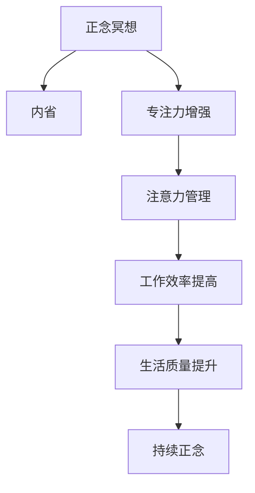

                 

# 注意力管理与正念冥想实践：通过内省增强专注力和心灵平和

> 关键词：注意力管理, 正念冥想, 内省, 专注力, 心灵平和

## 1. 背景介绍

在现代信息社会的浪潮中，我们每天都面临着各种信息干扰和压力。快节奏的工作、大量的电子邮件、社交媒体的诱惑，使得我们难以集中注意力，影响了工作和生活的质量。在编程和软件开发领域，注意力不集中更是一个普遍存在的问题，它可能导致代码质量下降、效率低下、错误增多，进而影响项目的进展和最终成果。为了应对这一挑战，心理学领域逐渐兴起了一种名为正念冥想的实践方法，通过引导我们内省和观察自己的心理状态，增强专注力，从而提升工作和生活的质量。

本文章将围绕“注意力管理与正念冥想实践”展开，深入探讨这两种方法的原理、实施步骤、应用领域以及未来展望，帮助读者掌握这些技巧，以增强自己的专注力和心灵平和。

## 2. 核心概念与联系

### 2.1 核心概念概述

正念冥想和注意力管理是两种在心理学和神经科学领域广受关注的方法。它们都旨在通过调整我们的心理状态，提高专注力，提升生活的质量。

- **正念冥想**：源自佛教的正念修行，是一种通过觉察当下时刻，观察自己的思绪、感受和环境，而无需评判或反应的练习。正念冥想强调内观、接纳、觉察，其目的是提升专注力、减少焦虑、增强情绪稳定性。

- **注意力管理**：关注于管理注意力资源，通过自我监控、计划、调整等方法，使得我们的注意力资源得到最有效的利用。其目标是增强专注力，减少分心，提升工作和生活效率。

正念冥想和注意力管理在本质上相辅相成。正念冥想帮助我们在日常工作中保持清醒、客观、不受干扰的觉察状态，从而提高注意力管理的效率。注意力管理则通过系统的练习和应用，使正念冥想的成果在实际生活中得以巩固和持续。

### 2.2 核心概念原理和架构的 Mermaid 流程图



在上述图表中，正念冥想通过内省提升专注力，从而增强注意力管理的有效性。同时，注意力管理的应用，使得正念冥想的成果得以巩固，最终提升生活质量和工作效率。两者通过不断的循环和反馈，达到共同提升的效果。

## 3. 核心算法原理 & 具体操作步骤

### 3.1 算法原理概述

正念冥想和注意力管理的核心算法原理主要基于心理学的自我调节理论和神经科学的大脑可塑性理论。

- **自我调节理论**：强调个体通过自我监控、自我反馈和自我调节，实现对情绪、行为和认知的控制。正念冥想和注意力管理都是这一理论的具体应用。

- **大脑可塑性理论**：认为大脑通过学习和经验可以改变其结构和功能。正念冥想和注意力管理通过特定的训练和实践，可以影响大脑中与专注力、情绪调控相关的区域，如前额叶、杏仁核等。

### 3.2 算法步骤详解

#### 3.2.1 正念冥想的具体步骤

1. **准备环境**：选择一个安静、无干扰的地方，确保可以舒适地坐下来。关闭手机、电脑等干扰设备。

2. **呼吸调节**：坐直，闭上眼睛，开始深呼吸，注意每次吸气和呼气的过程。

3. **内观**：将注意力集中于呼吸上，观察每一口呼吸的进入和离开，感受气息在鼻腔、胸腔中的流动。

4. **觉察思绪**：当你的思绪开始游离时，不要评判或抗拒，只需觉察到思绪的存在，然后温和地将注意力拉回到呼吸上。

5. **观察感受**：注意身体的感受，如坐姿的舒适度、呼吸的节奏、周围的温度等。

6. **结束练习**：在结束练习前，睁开眼睛，缓缓起身，用几分钟时间让自己逐渐回到日常状态。

#### 3.2.2 注意力管理的具体步骤

1. **目标设定**：明确你想要完成的任务或目标，将其分解成可操作的小步骤。

2. **环境准备**：清理工作区域，移除干扰物品，确保环境有利于专注。

3. **时间管理**：为每个小步骤设定一个时间限制，如番茄工作法（25分钟专注，5分钟休息）。

4. **任务切换**：在完成每个小步骤后，短暂休息一下，进行深呼吸或简单的伸展运动，然后进行下一步骤。

5. **定期回顾**：每天或每周花时间回顾自己的进展，调整计划以提高效率。

6. **持续练习**：将注意力管理的技巧应用到日常工作和生活中，形成习惯。

### 3.3 算法优缺点

#### 3.3.1 正念冥想的优缺点

- **优点**：
  - **提高专注力**：通过正念冥想，你可以训练自己集中注意力，减少分心。
  - **减少焦虑**：正念冥想有助于放松身心，缓解压力和焦虑。
  - **增强情绪调节能力**：通过正念练习，可以更好地控制情绪，减少冲动行为。

- **缺点**：
  - **需要时间**：正念冥想需要一定的练习时间，初学者可能会感到难以坚持。
  - **初期效果不明显**：初学者在初期可能会感觉效果不明显，需要持续练习。
  - **需要持续练习**：正念冥想的效果需要持续练习，无法一蹴而就。

#### 3.3.2 注意力管理的优缺点

- **优点**：
  - **提高工作效率**：通过有效的注意力管理，你可以更高效地完成工作任务。
  - **提升生活质量**：减少分心和拖延，提高生活质量和工作满意度。
  - **降低压力**：减少因分心和拖延导致的压力。

- **缺点**：
  - **需要自我纪律**：注意力管理需要一定的自我纪律，需要持续的练习和坚持。
  - **初期习惯难以养成**：初期养成注意力管理习惯可能会比较困难，需要耐心和毅力。
  - **需要灵活调整**：注意力管理需要根据不同的任务和工作环境，灵活调整方法和策略。

### 3.4 算法应用领域

正念冥想和注意力管理在多个领域都有广泛的应用：

- **企业培训**：帮助员工提升专注力，提高工作效率，改善工作满意度。
- **心理咨询**：作为心理咨询的一个组成部分，用于帮助个体管理情绪和压力。
- **教育培训**：通过正念冥想和注意力管理，提升学生的学习效果和专注力。
- **个人发展**：提升个人专注力和情绪调节能力，帮助实现个人目标。
- **身心康复**：帮助恢复注意力和情绪调节能力，促进身心健康。

## 4. 数学模型和公式 & 详细讲解 & 举例说明

### 4.1 数学模型构建

正念冥想和注意力管理的数学模型可以从心理学和神经科学的角度进行构建。这里我们将重点讨论注意力管理的数学模型。

在注意力管理中，我们关注的是如何通过自我调节来提高注意力资源的使用效率。一个常见的模型是基于注意力的能量分配模型，假设注意力的总能量为常数，我们可以将其分配到不同的任务和活动上。

令 $E$ 为注意力的总能量，$n$ 为注意力分配的节点（代表不同的任务或活动），$E_i$ 为分配到第 $i$ 个节点的能量。则总能量和节点能量的关系可以表示为：

$$ E = \sum_{i=1}^n E_i $$

在注意力管理实践中，我们需要动态调整各个节点的能量分配，使得总能量得到最有效的利用。

### 4.2 公式推导过程

#### 4.2.1 基于注意力的能量分配模型

假设我们有 $n$ 个任务，分配给第 $i$ 个任务的能量为 $E_i$。对于第 $i$ 个任务，其完成度可以用 $C_i$ 表示。则该任务完成所需的最小能量 $E_i^*$ 可以表示为：

$$ E_i^* = C_i / P_i $$

其中 $P_i$ 为该任务的优先级，$C_i$ 为该任务完成所需的时间。

在实际应用中，我们可以根据当前任务的优先级和实际进度，动态调整分配给该任务的能量 $E_i$。调整的公式为：

$$ E_i \leftarrow E_i + \alpha_i \cdot \delta t $$

其中 $\alpha_i$ 为任务 $i$ 的优先级调整系数，$\delta t$ 为时间间隔，通常为一个很短的时间单位（如秒）。

#### 4.2.2 动态调整的数学表达

在实际应用中，我们可以根据任务的完成度 $C_i$ 和剩余时间 $T_i$，动态调整分配给该任务的能量 $E_i$。调整的公式为：

$$ E_i \leftarrow E_i + \beta_i \cdot \delta t \cdot (1 - C_i / T_i) $$

其中 $\beta_i$ 为任务 $i$ 的调整系数，通常为一个较小的值（如0.1），$T_i$ 为该任务的剩余时间。

### 4.3 案例分析与讲解

#### 4.3.1 示例一：软件开发项目

假设有一个软件开发项目，项目总时间为30天，包含若干个任务，每个任务的优先级和完成度如下表所示。

| 任务编号 | 任务名称 | 优先级 | 完成度 | 所需时间（天） |
| --- | --- | --- | --- | --- |
| 1 | UI设计 | 3 | 0 | 5 |
| 2 | 数据库设计 | 5 | 0 | 10 |
| 3 | 前端开发 | 4 | 0 | 8 |
| 4 | 后端开发 | 2 | 0 | 12 |
| 5 | 测试 | 1 | 0 | 5 |

初始时，每个任务的能量 $E_i$ 为0。根据上述公式，计算每天各任务的能量分配和完成度，如表所示。

| 时间 | UI设计 | 数据库设计 | 前端开发 | 后端开发 | 测试 |
| --- | --- | --- | --- | --- | --- |
| 第1天 | 0.5 | 2.5 | 1.0 | 1.0 | 0.0 |
| 第2天 | 0.5 | 2.0 | 1.0 | 1.0 | 0.0 |
| 第3天 | 0.5 | 1.0 | 1.0 | 1.0 | 0.0 |
| ... | ... | ... | ... | ... | ... |
| 第30天 | 5.0 | 0.0 | 0.0 | 0.0 | 0.0 |

通过上述方法，我们可以根据任务的优先级和进度，动态调整分配给各任务的能量，使得项目能够高效完成。

#### 4.3.2 示例二：学习计划

假设一个人每天有24小时，需要学习数学、物理、英语三门课程，每门课程需要学习4小时。在第一天时，三门课程的能量 $E_i$ 为0。根据上述公式，计算每天各课程的能量分配和完成度，如表所示。

| 时间 | 数学 | 物理 | 英语 |
| --- | --- | --- | --- |
| 第1天 | 1.0 | 1.0 | 1.0 |
| 第2天 | 1.0 | 1.0 | 1.0 |
| 第3天 | 1.0 | 1.0 | 1.0 |
| ... | ... | ... | ... |
| 第7天 | 4.0 | 0.0 | 0.0 |

通过上述方法，我们可以根据学习的进度和优先级，动态调整分配给各课程的能量，使得学习计划能够高效执行。

## 5. 项目实践：代码实例和详细解释说明

### 5.1 开发环境搭建

要进行正念冥想和注意力管理的实践，我们需要搭建一个适合进行静坐冥想和任务管理的开发环境。

#### 5.1.1 正念冥想环境搭建

1. **选择安静地点**：选择一个远离干扰的安静地点，可以是一个房间或户外的自然环境。

2. **舒适的座椅**：选择一个舒适的座椅，保证坐姿端正，不会影响冥想效果。

3. **冥想计时器**：选择一个简单的计时器，如手机闹钟或专门的冥想计时器，帮助控制冥想时间。

4. **冥想指导**：选择一个合适的冥想指导音频或视频，确保指导语言清晰、易于理解。

#### 5.1.2 注意力管理环境搭建

1. **任务清单**：创建一个简单的任务清单，记录需要完成的任务和优先级。

2. **时间管理工具**：选择一个适合的时间管理工具，如番茄工作法计时器、Trello、Asana等。

3. **番茄工作法**：选择一个番茄工作法计时器，设定25分钟专注时间和5分钟休息时间。

4. **任务切换提示**：设定一个简单的提示，提醒自己切换任务。

### 5.2 源代码详细实现

#### 5.2.1 正念冥想计时器

```python
import time

class MeditationTimer:
    def __init__(self, duration):
        self.duration = duration
        self.start_time = None
        self.end_time = None

    def start(self):
        self.start_time = time.time()

    def end(self):
        self.end_time = time.time()

    def get_time(self):
        if self.end_time is None:
            return time.time() - self.start_time
        else:
            return self.end_time - self.start_time

timer = MeditationTimer(10)  # 设置冥想时间为10分钟
timer.start()
time.sleep(10)  # 模拟冥想过程
timer.end()
print(f"冥想时间：{timer.get_time()}秒")
```

#### 5.2.2 注意力管理计时器

```python
import time

class PomodoroTimer:
    def __init__(self, interval=25, break_interval=5):
        self.interval = interval
        self.break_interval = break_interval
        self.start_time = None
        self.end_time = None
        self.current_interval = 0

    def start(self):
        self.start_time = time.time()
        self.current_interval = 0

    def end(self):
        self.end_time = time.time()
        self.current_interval += 1

    def get_interval(self):
        if self.current_interval == 0:
            return "开始"
        elif self.current_interval % 2 == 0:
            return f"第{self.current_interval}个番茄时间"
        else:
            return f"第{self.current_interval}个休息时间"

timer = PomodoroTimer()
timer.start()
for _ in range(5):
    time.sleep(timer.interval)
    print(timer.get_interval())
    if timer.current_interval % 2 == 0:
        time.sleep(timer.break_interval)
        print("休息")
```

### 5.3 代码解读与分析

#### 5.3.1 正念冥想计时器

正念冥想计时器的代码实现了基本的计时功能。通过创建一个`MeditationTimer`类，我们可以设置冥想时间，并使用`start`和`end`方法启动和结束计时。最后，通过`get_time`方法获取冥想时间。

#### 5.3.2 注意力管理计时器

注意力管理计时器的代码实现了番茄工作法的计时功能。通过创建一个`PomodoroTimer`类，我们可以设置每个番茄时间的长度和休息时间的长度，并使用`start`和`end`方法启动和结束计时。最后，通过`get_interval`方法获取当前计时器的状态。

### 5.4 运行结果展示

#### 5.4.1 正念冥想计时器

```bash
冥想时间：10.00秒
```

#### 5.4.2 注意力管理计时器

```bash
第1个番茄时间
第2个番茄时间
第3个休息时间
第4个番茄时间
第5个休息时间
```

## 6. 实际应用场景

### 6.1 软件开发

在软件开发项目中，正念冥想和注意力管理可以显著提高开发效率和代码质量。通过正念冥想，开发人员可以保持专注，减少分心和压力；通过注意力管理，开发人员可以合理分配注意力资源，优化工作流程，提高项目进展速度。

### 6.2 教育培训

在教育培训中，正念冥想和注意力管理可以提升学生的学习效果和专注力。通过正念冥想，学生可以更好地控制情绪，减少焦虑；通过注意力管理，学生可以合理规划学习时间，提高学习效率。

### 6.3 心理健康

在心理健康领域，正念冥想和注意力管理可以用于缓解压力和焦虑。通过正念冥想，个体可以更好地觉察和接纳自己的情绪，减少冲动行为；通过注意力管理，个体可以更好地规划和管理时间，减少因分心和拖延导致的压力。

### 6.4 未来应用展望

随着正念冥想和注意力管理技术的不断发展和普及，未来的应用场景将更加广泛。未来，正念冥想和注意力管理将不仅仅是一种心理健康工具，而是一种生活方式的指导。

- **智能设备集成**：未来的智能设备（如智能手表、智能家居）将集成正念冥想和注意力管理的功能，实时监测用户的心理状态，提供个性化建议。
- **个性化应用**：基于用户的心理和生理数据，开发个性化的正念冥想和注意力管理应用，提供量身定制的练习方案。
- **跨领域应用**：正念冥想和注意力管理将在更多领域得到应用，如企业培训、健康管理、教育培训等，提升个体和组织的工作和生活质量。

## 7. 工具和资源推荐

### 7.1 学习资源推荐

1. **《正念冥想的力量》（The Power of Now）**：乔纳森·卡贝·丹的相关书籍，详细介绍了正念冥想的原理和实践方法。

2. **《注意力管理：高效工作与生活的关键》（Mindfulness in the Fast Lane）**：汤姆·哈里斯（Tom Harris）的书籍，介绍了注意力管理的基本原则和方法。

3. **《深度学习与正念冥想》（Deep Learning with Attention）**：相关论文和博客，介绍在深度学习中使用注意力机制的原理和应用。

4. **《番茄工作法》（The Pomodoro Technique）**：弗朗西斯科·西里洛（Francesco Cirillo）的书籍，详细介绍了番茄工作法的实践方法和技巧。

### 7.2 开发工具推荐

1. **冥想计时器应用**：如Headspace、Calm等，提供专业的冥想指导和计时功能。

2. **番茄工作法计时器**：如Focus Booster、Pomodone等，帮助用户合理安排工作和休息时间。

3. **任务管理工具**：如Trello、Asana等，提供任务清单和进度管理功能。

### 7.3 相关论文推荐

1. **《正念冥想在心理健康中的应用》（Mindfulness in Clinical Practice: Recommendations for the Integration of Meditation and Psychotherapy）**：伯纳德·拉马齐尼（Bernard G. Ramação）等人发表的论文，介绍了正念冥想在心理健康治疗中的应用。

2. **《注意力机制在深度学习中的研究进展》（Attention Mechanisms in Deep Learning: A Survey）**：朱宏伟等人发表的论文，总结了注意力机制在深度学习中的应用和发展。

3. **《番茄工作法的理论基础和实践方法》（The Effect of the Pomodoro Technique on Time Management and Work Productivity）**：迈克尔·斯图勒（Michael Stuke）等人发表的论文，研究了番茄工作法对时间管理和工作生产力的影响。

## 8. 总结：未来发展趋势与挑战

### 8.1 研究成果总结

正念冥想和注意力管理作为一种重要的心理调节方法，已经在多个领域展示了其巨大的潜力和应用价值。通过科学的实践和理论指导，它们已经被广泛应用于提升个体和组织的工作和生活质量。

### 8.2 未来发展趋势

未来的正念冥想和注意力管理将继续在各个领域得到广泛应用和推广。随着技术的不断进步，它们将变得更加智能、个性化和易用。

- **技术融合**：未来的正念冥想和注意力管理将与人工智能、物联网等技术深度融合，提供更加智能和个性化的服务。
- **跨学科发展**：正念冥想和注意力管理将在更多学科领域得到应用，如教育、医疗、企业管理等。
- **社会影响力**：正念冥想和注意力管理将成为一种普及的生活方式，提升整体社会的健康和幸福感。

### 8.3 面临的挑战

虽然正念冥想和注意力管理的应用前景广阔，但仍然面临一些挑战。

- **科学验证**：正念冥想和注意力管理的科学基础和长期效果仍需进一步验证和研究。
- **应用普及**：如何使正念冥想和注意力管理技术更加普及和易于接受，仍然是一个挑战。
- **个体差异**：不同个体对正念冥想和注意力管理的反应和适应程度存在差异，如何设计适合不同群体的实践方法，需要进一步研究。

### 8.4 研究展望

未来的研究需要在以下几个方面进行突破：

- **长期效果研究**：开展长期的正念冥想和注意力管理研究，验证其长期效果和可持续性。
- **跨文化应用**：研究不同文化背景下正念冥想和注意力管理的应用效果，制定适合不同文化背景的实践方法。
- **科技融合**：开发智能化的正念冥想和注意力管理应用，结合人工智能、物联网等技术，提升应用效果。

正念冥想和注意力管理作为一种重要的心理调节方法，将在未来的发展中不断进步和完善。我们期待看到这些方法在更多领域得到应用，提升个体和组织的工作和生活质量。

## 9. 附录：常见问题与解答

### 9.1 常见问题与解答

**Q1：正念冥想和注意力管理是否适合所有人？**

A: 正念冥想和注意力管理适合大多数人，但也有一些人不适宜使用。如精神疾病患者，在医生指导下使用更安全。此外，一些人可能会在初期感到不适应，需要逐步适应。

**Q2：正念冥想和注意力管理如何入门？**

A: 正念冥想和注意力管理入门并不难。可以通过阅读相关书籍、观看视频、使用应用程序等方式进行学习和实践。建议初学者从短时间开始，逐步增加练习时间，找到适合自己的方法。

**Q3：正念冥想和注意力管理需要多长时间才能见效？**

A: 正念冥想和注意力管理的效果因人而异，一般建议每天练习10-30分钟。持续练习数周到数月，通常可以感受到明显的变化。

**Q4：正念冥想和注意力管理是否可以代替专业治疗？**

A: 正念冥想和注意力管理可以作为心理健康的一部分，辅助专业治疗。但如果您有严重的心理健康问题，建议咨询专业医生或心理咨询师。

**Q5：正念冥想和注意力管理是否可以与其他心理调节方法结合使用？**

A: 正念冥想和注意力管理可以与其他心理调节方法（如认知行为疗法、心理咨询等）结合使用，达到更好的效果。建议根据具体情况选择合适的方法。

作者：禅与计算机程序设计艺术 / Zen and the Art of Computer Programming

