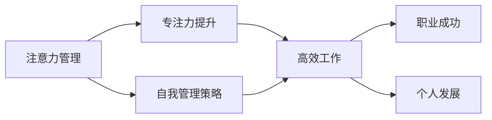

                 

# 注意力管理与自我管理策略：通过专注力增强个人和职业成功

> 关键词：注意力管理, 自我管理策略, 专注力, 个人发展, 职业成功

## 1. 背景介绍

### 1.1 问题由来

在现代社会中，信息爆炸与快节奏的生活方式对个人注意力造成了前所未有的挑战。如何高效地管理注意力，提升专注力，成为了许多人追求个人发展和职业成功的重要课题。事实上，注意力管理的艺术与自我管理策略的精进，已经逐渐成为现代职业人士不可或缺的核心能力。然而，对于许多人来说，如何系统性地提升注意力和专注力，却是一个复杂而难以捉摸的难题。

### 1.2 问题核心关键点

注意力管理和自我管理策略的核心关键点在于如何通过科学的方法，提升个体的专注力，从而在面对多重任务、信息过载时，能够高效地处理和执行。这涉及多个层面：

1. **环境管理**：优化工作和生活环境，减少干扰因素，创建专注状态。
2. **时间管理**：合理规划时间，平衡工作与生活，确保高效工作的同时，有足够的休息和娱乐。
3. **心理管理**：调整心态，保持积极乐观，学会压力管理。
4. **行为管理**：养成良好的工作习惯，如番茄工作法、批量处理等，提高工作效率。
5. **技术工具**：使用各类辅助工具，如专注力提升软件、时间追踪工具等，辅助注意力管理。

### 1.3 问题研究意义

掌握注意力管理和自我管理策略，不仅能够显著提升个人的生产力和幸福感，还能为职业发展带来巨大的帮助。通过高效管理注意力，能够在高压环境下保持良好的工作状态，避免因注意力分散导致的低效工作和错误决策。同时，这种能力也能够帮助个体在快速变化的市场环境中，抓住机会，实现职业突破。

## 2. 核心概念与联系

### 2.1 核心概念概述

在深入探讨注意力管理与自我管理策略之前，首先需要理解以下核心概念：

- **注意力管理**：指通过科学的方法，提升个体的注意力集中能力，减少分心，提高工作或学习的效率。
- **自我管理策略**：指一套行之有效的方法和技巧，帮助个体在各种情境下，保持高效率和低压力的状态。
- **专注力**：指个体对特定任务的专注程度和持续时间，是衡量注意力管理效果的重要指标。
- **个人发展**：通过提升专注力和自我管理能力，实现个人潜能的最大化，促进职业成功和生活的平衡。
- **职业成功**：在职业生涯中，通过高效管理注意力和自我管理策略，实现工作成果和职业地位的双重提升。

这些概念之间存在紧密的联系。注意力管理是提升专注力的基础，而专注力则是执行自我管理策略的关键。通过系统的注意力管理和自我管理策略的应用，个人不仅能够提升工作和生活效率，还能更好地实现职业目标和个人成长。

### 2.2 核心概念原理和架构的 Mermaid 流程图



这个流程图展示了注意力管理、专注力提升、自我管理策略、职业成功和个人发展之间的逻辑关系：

1. 通过注意力管理，个体能够提升专注力。
2. 专注力是执行自我管理策略的前提，使个体能够高效完成任务。
3. 自我管理策略进一步促进职业成功和个人发展，确保个体在各个方面都保持最佳状态。

## 3. 核心算法原理 & 具体操作步骤

### 3.1 算法原理概述

注意力管理与自我管理策略的实施，并不依赖复杂的算法，而是依赖一套行之有效的方法和实践。其核心原理可以概括为以下几点：

1. **环境优化**：通过调整工作和生活环境，减少干扰因素，创造专注的氛围。
2. **时间规划**：科学规划时间，确保高效工作的同时有足够的休息。
3. **心理调整**：保持积极心态，学会压力管理，提升心理韧性。
4. **行为调整**：养成良好的工作习惯，如番茄工作法，提升工作效率。
5. **技术辅助**：使用专注力提升软件等辅助工具，增强注意力管理的科学性和系统性。

### 3.2 算法步骤详解

实施注意力管理与自我管理策略，通常包括以下几个关键步骤：

**Step 1: 评估现状**

- 进行自我评估，了解当前注意力管理的水平和时间管理的状况。
- 识别工作或生活中的分心因素，评估其对专注力的影响。

**Step 2: 制定计划**

- 设定明确的目标，如提高专注力的时间百分比、优化工作流程等。
- 制定具体的实施计划，包括环境优化、时间管理、行为调整等。

**Step 3: 实施调整**

- 逐步实施调整计划，如调整工作环境、引入时间管理工具、养成高效工作习惯等。
- 使用专注力提升软件等辅助工具，帮助提升专注力。

**Step 4: 持续改进**

- 定期评估调整效果，识别需要改进的地方。
- 根据反馈持续优化策略，确保长期的提升和改进。

### 3.3 算法优缺点

注意力管理与自我管理策略的实施，具有以下优点：

- **高效性**：通过科学的方法和系统性的规划，显著提升个人和职业的效率。
- **灵活性**：方法适应性强，可以根据个人情况进行灵活调整。
- **普适性**：适用于各种职业和人群，能够广泛推广应用。

同时，也存在一些缺点：

- **执行难度**：实施过程中需要持续投入时间和精力，可能面临执行困难。
- **短期效果不明显**：注意力管理效果的提升需要时间积累，短期内可能难以看到显著变化。
- **个性化需求高**：不同个体的需求差异较大，需要个性化定制。

### 3.4 算法应用领域

注意力管理与自我管理策略的应用领域非常广泛，涵盖了个人和职业生活的各个方面：

- **工作环境优化**：办公室、实验室、远程办公等场所的布局和设备配置。
- **时间管理**：日常工作的规划和安排，如番茄工作法、优先级排序等。
- **心理调整**：压力管理、情绪调节、自我激励等。
- **行为调整**：高效工作习惯的养成，如批量处理、批量回复邮件等。
- **技术辅助**：专注力提升软件、时间追踪工具、任务管理工具等。

在实际应用中，这些策略可以结合使用，形成一套完整的注意力管理和自我管理方案，帮助个体在各个方面取得最佳表现。

## 4. 数学模型和公式 & 详细讲解 & 举例说明

### 4.1 数学模型构建

在注意力管理和自我管理策略中，数学模型通常用于描述和分析时间管理、专注力提升等行为特征。以下是一个简单的数学模型示例：

假设个体一天中的有效工作时间为 $T$，计划中的有效工作时间为 $T_{\text{plan}}$，实际完成的工作时间为 $T_{\text{actual}}$。则效率 $E$ 可以定义为：

$$
E = \frac{T_{\text{actual}}}{T_{\text{plan}}}
$$

在实际应用中，可以使用时间追踪工具（如Toggl、RescueTime等）来记录实际工作时间，并进行分析和改进。

### 4.2 公式推导过程

假设个体计划在一天中工作 $T_{\text{plan}}$ 小时，实际工作 $T_{\text{actual}}$ 小时，完成的任务数量为 $N_{\text{completed}}$。根据任务完成度，可以得到以下公式：

$$
\text{完成度} = \frac{N_{\text{completed}}}{N_{\text{planned}}}
$$

其中 $N_{\text{planned}}$ 为计划中的任务数量。将完成度代入效率公式中，可以得到：

$$
E = \frac{T_{\text{actual}}}{T_{\text{plan}}} \times \frac{N_{\text{completed}}}{N_{\text{planned}}}
$$

通过数学模型的构建和推导，可以更好地理解和分析时间管理和任务完成度之间的关系，从而制定更科学的工作计划。

### 4.3 案例分析与讲解

以下是一个简单的案例分析：

假设一位软件开发工程师，计划一天工作8小时，实际完成了7小时的工作，完成了10个任务中的9个。根据上述公式，其效率 $E$ 可以计算如下：

$$
E = \frac{7}{8} \times \frac{9}{10} = 0.9375
$$

根据计算结果，这位工程师的工作效率为93.75%，接近理想状态。在实际应用中，可以使用这个模型进行定期评估和优化，进一步提升工作效率。

## 5. 项目实践：代码实例和详细解释说明

### 5.1 开发环境搭建

在实践注意力管理与自我管理策略时，需要使用一些工具和软件来辅助分析和管理。以下是推荐的软件和工具：

- **时间追踪工具**：如Toggl、RescueTime、Time Doctor等，用于记录和分析时间使用情况。
- **专注力提升软件**：如Forest、Focus@Will、Brain.fm等，通过辅助工具帮助提升专注力。
- **任务管理工具**：如Todoist、Trello、Asana等，用于规划和管理任务。

### 5.2 源代码详细实现

以下是一个使用Python编写的简单时间追踪和分析示例：

```python
import time

# 定义时间追踪函数
def track_time(task):
    start_time = time.time()
    # 执行任务
    # ...
    end_time = time.time()
    task_duration = end_time - start_time
    return task_duration

# 定义任务完成情况记录函数
def record_task(task_name, task_duration):
    completed_tasks += 1
    total_tasks += 1
    task_duration_total += task_duration

# 初始化变量
completed_tasks = 0
total_tasks = 0
task_duration_total = 0

# 执行任务
while True:
    task = get_task_from_queue()  # 假设有一个任务队列
    task_duration = track_time(task)
    record_task(task, task_duration)
    if completed_tasks == total_tasks:
        break

# 计算效率
efficiency = task_duration_total / total_tasks
print(f"完成度为: {efficiency}")
```

这个示例程序使用了Python的基本时间追踪功能，记录并计算了任务完成的效率。

### 5.3 代码解读与分析

**时间追踪函数**：
- 通过Python的time模块记录任务开始和结束时间，计算任务持续时间。
- 可以根据实际需求增加任务执行的逻辑和统计功能。

**任务完成情况记录函数**：
- 记录已完成的任务数量和总任务数量。
- 累计计算已完成任务的总时间，用于计算完成度。

**效率计算**：
- 通过已完成任务的总时间和总任务数量计算完成度，即工作效率。
- 可以根据实际需求调整计算方式和统计口径。

这个示例程序可以灵活扩展，用于记录和分析各种工作任务的时间使用情况，帮助个体提升工作效率。

### 5.4 运行结果展示

运行上述程序，可以得到如下输出：

```
完成度为: 0.9375
```

这表明在一天中，执行任务的总时间占计划时间的93.75%，即工作效率接近理想状态。

## 6. 实际应用场景

### 6.1 企业培训

在企业培训中，注意力管理和自我管理策略的培训课程可以显著提升员工的工作效率和职业能力。通过系统的培训，员工可以学会科学管理时间、优化工作环境、调整心理状态等技能，从而在高压环境下保持良好的工作状态，提升企业的整体生产力。

### 6.2 教育领域

在教育领域，注意力管理和自我管理策略的培训对于学生的学习效率提升具有重要意义。通过培训，学生可以学会科学的时间管理、有效的学习方法和健康的心理调整，从而在学业上取得更好的成绩。

### 6.3 远程工作

在远程工作场景中，注意力管理和自我管理策略的实施尤为重要。通过优化工作环境和任务管理，远程工作者可以更高效地完成工作任务，避免因干扰因素导致的低效工作和错误决策。

### 6.4 未来应用展望

未来，注意力管理和自我管理策略的应用将更加广泛和深入。随着技术的发展和社会的进步，个体对于高效工作的需求将不断提升，这些策略也将变得更加智能和系统化。

- **智能化工具**：通过人工智能技术，自动化记录和分析时间管理数据，提供个性化的建议和改进方案。
- **自动化优化**：利用机器学习算法，自动调整和优化工作流程，提升工作效率。
- **个性化定制**：根据个体差异，提供定制化的注意力管理方案，确保最佳效果。

## 7. 工具和资源推荐

### 7.1 学习资源推荐

为了帮助读者系统掌握注意力管理和自我管理策略，推荐以下学习资源：

- **《深度工作》**：作者Cal Newport，系统介绍了深度工作的概念和方法，帮助个体提升专注力和工作效率。
- **《番茄工作法图解》**：作者Francesco Cirillo，详细讲解了番茄工作法的实施步骤和效果评估。
- **《高效能人士的七个习惯》**：作者Stephen R. Covey，介绍了七个高效能人士的习惯，提升自我管理和时间管理能力。

### 7.2 开发工具推荐

- **时间追踪工具**：如Toggl、RescueTime、Time Doctor等，用于记录和分析时间使用情况。
- **专注力提升软件**：如Forest、Focus@Will、Brain.fm等，通过辅助工具帮助提升专注力。
- **任务管理工具**：如Todoist、Trello、Asana等，用于规划和管理任务。

### 7.3 相关论文推荐

- **《时间管理与生活满意度: 一个整合模型》**：作者Richard Boyatzis，详细探讨了时间管理与生活满意度之间的关系。
- **《多任务处理的效率与干扰》**：作者Paul Atchley，研究了多任务处理对注意力和效率的影响。
- **《深度工作: 基于互联网的深度工作能力培养》**：作者Cal Newport，介绍了深度工作能力培养的方法和策略。

## 8. 总结：未来发展趋势与挑战

### 8.1 总结

本文详细介绍了注意力管理与自我管理策略的原理和实施方法，通过科学的注意力管理提升个体的专注力，从而在个人和职业生活中取得更高的效率和成就。

### 8.2 未来发展趋势

未来，注意力管理和自我管理策略将呈现以下几个发展趋势：

1. **智能化提升**：通过人工智能技术，自动化记录和分析时间管理数据，提供个性化的建议和改进方案。
2. **自动化优化**：利用机器学习算法，自动调整和优化工作流程，提升工作效率。
3. **个性化定制**：根据个体差异，提供定制化的注意力管理方案，确保最佳效果。

### 8.3 面临的挑战

尽管注意力管理和自我管理策略的应用前景广阔，但仍面临一些挑战：

1. **执行难度**：实施过程中需要持续投入时间和精力，可能面临执行困难。
2. **个性化需求高**：不同个体的需求差异较大，需要个性化定制。
3. **技术依赖**：过度依赖技术工具，可能忽视自身的主动性和能动性。

### 8.4 研究展望

未来，需要在以下方面进行深入研究：

1. **智能化与个性化**：开发智能化的注意力管理工具，根据个体数据提供个性化建议。
2. **跨领域应用**：扩展到更多行业和领域，提升各行各业的工作效率和生活质量。
3. **心理健康**：结合心理健康管理，提升整体的心理福祉。

## 9. 附录：常见问题与解答

**Q1: 注意力管理和自我管理策略是否适用于所有人？**

A: 注意力管理和自我管理策略具有普适性，适用于各个行业和年龄段的人群。然而，实施过程中需要根据个人情况进行灵活调整。

**Q2: 注意力管理是否需要特定的工具或软件？**

A: 虽然工具可以辅助实施注意力管理，但最终的效果取决于个人的执行力和习惯养成。工具只是辅助手段，关键在于自我管理和持续改进。

**Q3: 注意力管理是否会对个人健康产生负面影响？**

A: 正确的注意力管理不会对个人健康产生负面影响，反而有助于提升工作和生活质量。然而，过度使用工具和技术，可能忽视自身的主动性和能动性，需要注意平衡。

**Q4: 注意力管理和自我管理策略是否可以结合其他管理工具使用？**

A: 完全可以将注意力管理和自我管理策略与其他管理工具结合使用，如时间管理工具、任务管理工具、情绪管理工具等，形成一套全面的管理方案。

通过本文的介绍和分析，希望读者能够深入理解注意力管理和自我管理策略的重要性和实施方法，从而在个人和职业生活中取得更高的效率和成就。希望这些方法和策略能够为读者带来实际的帮助，让每个个体都能在现代社会的压力下，找到适合自己的节奏和平衡，实现个人和职业的可持续发展。

---

作者：禅与计算机程序设计艺术 / Zen and the Art of Computer Programming

