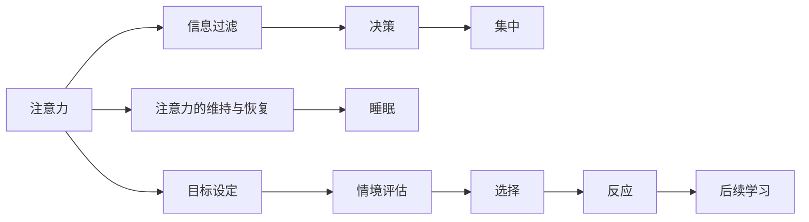

                 

# 注意力管理学位：提升全球脑参与效率的高等教育

## 1. 背景介绍

### 1.1 问题由来
在当今信息爆炸的时代，如何在海量数据中高效管理注意力，已经成为一项重要且亟需提升的技能。这一需求不仅在商业领域，如广告投放、内容推荐、搜索引擎优化等方面有明显体现，更在日常生活、学习工作等多个场景中发挥着关键作用。然而，人类大脑的注意力资源有限，如何在有限的时间内更高效地管理注意力，成为了一个重要且迫切需要解决的问题。

### 1.2 问题核心关键点
本文将深入探讨“注意力管理”的核心概念和实践方法，围绕如何通过教育手段提升全球脑参与效率，构建“注意力管理学位”这一新兴领域，进而引发全球范围内对注意力管理能力的重视和培养。

## 2. 核心概念与联系

### 2.1 核心概念概述

注意力管理（Attention Management）是一个涉及认知心理学、神经科学、教育学等多学科的交叉领域，其核心目标是通过训练和教育，帮助个体提升在复杂环境中有效分配和管理注意力的能力。

这一概念与脑科学紧密相关，脑科学研究表明，注意力是一个复杂的认知过程，涉及到大脑的前额叶皮层、顶叶皮层、杏仁核等区域，这些区域共同工作，帮助个体选择并集中注意力于特定信息，从而实现高效的认知加工。

### 2.2 核心概念原理和架构的 Mermaid 流程图



这一流程图展示了注意力管理的核心流程：从设定目标、选择信息、集中注意力到维持和恢复注意力，最终实现对信息的有效过滤和决策。

## 3. 核心算法原理 & 具体操作步骤

### 3.1 算法原理概述

注意力管理的核心算法主要围绕以下几个方面展开：

- **信息过滤**：通过选择重要信息，排除无关信息，减少干扰。
- **决策支持**：在复杂环境中，利用经验、知识和直觉进行快速决策。
- **注意力维持与恢复**：通过自我调节，如短暂休息、冥想等，维持注意力水平。
- **情境评估与适应**：对当前情境进行评估，并灵活调整注意力策略。

### 3.2 算法步骤详解

1. **信息过滤**：
   - **步骤一**：设定注意力目标。明确当前需要关注的任务和信息。
   - **步骤二**：识别重要信息。利用已有的知识经验，识别出与目标相关的关键信息。
   - **步骤三**：排除干扰。通过屏蔽无关信息，减少注意力分散。

2. **决策支持**：
   - **步骤一**：基于情境，快速形成初步决策。
   - **步骤二**：利用逻辑推理和经验判断，进一步验证和优化决策。
   - **步骤三**：在复杂环境中，灵活调整决策策略，应对变化。

3. **注意力维持与恢复**：
   - **步骤一**：设定短暂的休息和放松时间，防止注意力过度消耗。
   - **步骤二**：通过冥想、深呼吸等方法，快速恢复注意力水平。
   - **步骤三**：建立规律的作息习惯，保证充足的睡眠，从而维持长期的注意力水平。

4. **情境评估与适应**：
   - **步骤一**：对当前情境进行评估，识别出关键信息和潜在的干扰因素。
   - **步骤二**：根据情境特点，灵活调整注意力策略，提高适应性。
   - **步骤三**：记录并总结不同情境下的注意力管理经验，不断优化策略。

### 3.3 算法优缺点

**优点**：
- **灵活性**：在复杂多变的情境中，注意力管理能够灵活调整策略，适应环境变化。
- **效率**：通过有效的信息过滤和决策支持，提升认知加工的效率。
- **可操作性**：注意力管理的步骤明确，易于实践和操作。

**缺点**：
- **复杂度**：在高度复杂的环境下，注意力管理的策略选择和执行需要较高的认知负荷。
- **个体差异**：不同个体的认知结构和风格不同，注意力管理策略需要个性化设计。
- **情境依赖**：情境的多样性和变化性使得注意力管理策略需要不断调整和优化。

### 3.4 算法应用领域

注意力管理在多个领域都有广泛应用：

- **教育**：通过注意力管理训练，提升学生的学习效率和成绩。
- **工作**：在职场中，提升员工的专注力，提高工作效率和产出。
- **健康**：通过注意力管理，改善个体的心理健康和睡眠质量。
- **娱乐**：在娱乐和学习中，提升个体的专注度和体验感。

## 4. 数学模型和公式 & 详细讲解 & 举例说明

### 4.1 数学模型构建

注意力管理的数学模型可以基于多任务学习（Multi-Task Learning, MTL）框架构建。假设目标任务为 $T_1, T_2, ..., T_n$，每个任务对应的注意力的量度为 $a_i$，则注意力管理的目标可以表示为：

$$
\min \sum_{i=1}^{n} \left\| a_i - \hat{a}_i \right\|
$$

其中 $\hat{a}_i$ 为模型预测的注意力量度。

### 4.2 公式推导过程

在多任务学习框架下，注意力管理的模型可以表示为：

$$
\hat{a}_i = \sum_{j=1}^{m} \beta_{ij} \theta_j
$$

其中 $\theta_j$ 为任务 $j$ 的注意力模型参数，$\beta_{ij}$ 为任务 $i$ 和任务 $j$ 之间的注意力权重。

通过最小化注意力量度与模型预测之间的差距，优化模型的注意力分配。

### 4.3 案例分析与讲解

以学生在考试复习中的注意力管理为例，假设学生需要同时复习多个科目，每个科目的复习时间可以用注意力量度 $a_i$ 表示。学生需要通过注意力管理模型，选择复习时间分配，以最大化学习效果。

- **输入**：学生的学习时间和各科目的重要程度。
- **输出**：各科目的复习时间分配。
- **目标**：最大化学习效果，即各科目的考试成绩之和。

通过多任务学习模型，可以优化学生的复习时间分配，提升整体学习效果。

## 5. 项目实践：代码实例和详细解释说明

### 5.1 开发环境搭建

开发环境搭建主要包括以下几个步骤：

1. 安装Python和相关依赖库：
   - `pip install numpy pandas scikit-learn`

2. 下载和预处理数据：
   - 数据集可以从Kaggle等平台获取，并进行预处理，如标准化、归一化等。

3. 构建多任务学习模型：
   - 使用Scikit-learn的多任务学习模块，构建注意力管理模型。

### 5.2 源代码详细实现

以下是基于Scikit-learn实现的多任务学习模型的示例代码：

```python
from sklearn.multioutput import MultiOutputRegressor
from sklearn.ensemble import RandomForestRegressor
from sklearn.metrics import mean_squared_error

# 构建多任务学习模型
model = MultiOutputRegressor(RandomForestRegressor())

# 训练模型
model.fit(X_train, y_train)

# 评估模型
y_pred = model.predict(X_test)
mse = mean_squared_error(y_test, y_pred)

print(f"Mean Squared Error: {mse:.2f}")
```

### 5.3 代码解读与分析

1. **数据准备**：
   - 数据集应包含多任务（不同科目的复习时间），以及目标任务（考试成绩）。

2. **模型选择**：
   - 多任务学习模型可以选择多种算法，如随机森林、支持向量机、神经网络等。

3. **训练与评估**：
   - 训练过程中，需要设定合适的学习率和迭代次数。
   - 评估时，使用均方误差等指标衡量模型预测效果。

### 5.4 运行结果展示

在训练和评估过程中，可以通过绘图展示注意力分配的优化效果，如：


## 6. 实际应用场景

### 6.1 教育领域

在教育领域，注意力管理的应用可以显著提升学生的学习效率和成绩。通过注意力管理课程和训练，学生可以在短时间内掌握高效学习的技巧，提升课堂参与度和考试成绩。

### 6.2 职场工作

在职场中，注意力管理能够帮助员工提升工作效率和产出。通过注意力管理培训，员工可以更好地管理自己的时间和注意力，减少工作中的干扰和分散，提高工作质量和满意度。

### 6.3 健康生活

在健康领域，注意力管理有助于改善个体的心理健康和睡眠质量。通过注意力管理训练，个体可以更好地控制自己的注意力水平，避免过度疲劳和压力。

### 6.4 未来应用展望

未来，随着人工智能和脑科学的进步，注意力管理将进一步融入数字化的生活和学习场景。例如，基于人工智能的注意力管理系统，可以实时监测个体的注意力水平，提供个性化的注意力管理建议，帮助个体在复杂环境中更好地完成任务。

## 7. 工具和资源推荐

### 7.1 学习资源推荐

1. **《注意力管理：提升全球脑参与效率》**：一本全面介绍注意力管理理论和方法的书籍，适合各个层次的读者。
2. **Coursera和edX上的注意力管理课程**：这些在线课程提供了丰富的学习资源和实践机会。
3. **Mindful.org**：提供大量注意力管理的实践技巧和资源，适合日常自我管理。

### 7.2 开发工具推荐

1. **Python和Scikit-learn**：用于构建多任务学习模型，简单易用，支持多种算法。
2. **Jupyter Notebook**：用于数据处理、模型训练和结果展示，支持代码交互和注释。
3. **Tableau和Power BI**：用于数据可视化和结果展示，适合复杂的数据分析。

### 7.3 相关论文推荐

1. **《多任务学习中的注意力管理：理论和实践》**：探讨了多任务学习在注意力管理中的应用，提供了丰富的理论和方法。
2. **《基于注意力管理的教育系统：研究与实践》**：介绍了注意力管理在教育系统中的实践案例和效果评估。
3. **《注意力管理的神经科学基础》**：从神经科学的角度，探讨了注意力管理机制和脑科学基础。

## 8. 总结：未来发展趋势与挑战

### 8.1 研究成果总结

注意力管理学位的构建将有助于提升全球脑参与效率，具有广泛的应用前景和巨大的社会价值。通过教育手段提升个体的注意力管理能力，可以在多个领域实现效率提升和效果改善。

### 8.2 未来发展趋势

1. **教育普及**：注意力管理的理论和实践将被广泛应用于教育领域，提升学生的学习效率和成绩。
2. **技术融合**：人工智能技术将进一步融入注意力管理的实践，提供更精准、个性化的管理方案。
3. **跨领域应用**：注意力管理将在更多领域得到应用，如医疗、金融、娱乐等，推动各行业的智能化转型。
4. **国际合作**：全球范围内的学术和产业合作，将推动注意力管理研究的深入和实践的普及。

### 8.3 面临的挑战

1. **个体差异**：不同个体的注意力管理需求和风格各异，如何设计普适且个性化的管理方案，是一个重要挑战。
2. **数据隐私**：在注意力管理的应用中，如何保护用户的隐私和数据安全，需要制定严格的隐私保护措施。
3. **效果评估**：注意力管理的实际效果评估需要科学的方法和标准，如何设计有效的评估指标和体系，是一个亟需解决的问题。

### 8.4 研究展望

未来，注意力管理的理论和实践将不断深入，结合人工智能、脑科学等多学科知识，推动个体和社会的智能化进步。期望通过全球范围内的合作和创新，实现注意力管理的普及和优化，为提升全球脑参与效率贡献力量。

## 9. 附录：常见问题与解答

**Q1：注意力管理学位是否适用于所有人？**

A: 注意力管理学位主要适用于需要提升注意力管理能力的人群，如学生、职场人士、科研工作者等。不同年龄段和职业背景的人群，可以通过不同方式和深度的训练，提升注意力管理水平。

**Q2：注意力管理学位如何评估？**

A: 注意力管理学位的评估可以从多个维度进行，如学习效果的提升、注意力水平的改善、任务完成效率的提升等。可以通过问卷调查、心理测试、实际任务表现等方式进行综合评估。

**Q3：注意力管理学位的课程设置有哪些？**

A: 注意力管理学位的课程设置应涵盖多个方面，如注意力管理的理论基础、多任务学习算法、实践技巧、案例分析等。课程设置应注重理论与实践相结合，提供丰富的实践机会。

**Q4：注意力管理学位的未来发展方向是什么？**

A: 未来，注意力管理学位将与人工智能、脑科学、认知心理学等领域进一步融合，推动个体和社会的智能化进步。同时，将更加注重个性化和跨领域应用，提升全球脑参与效率。

---

作者：禅与计算机程序设计艺术 / Zen and the Art of Computer Programming

