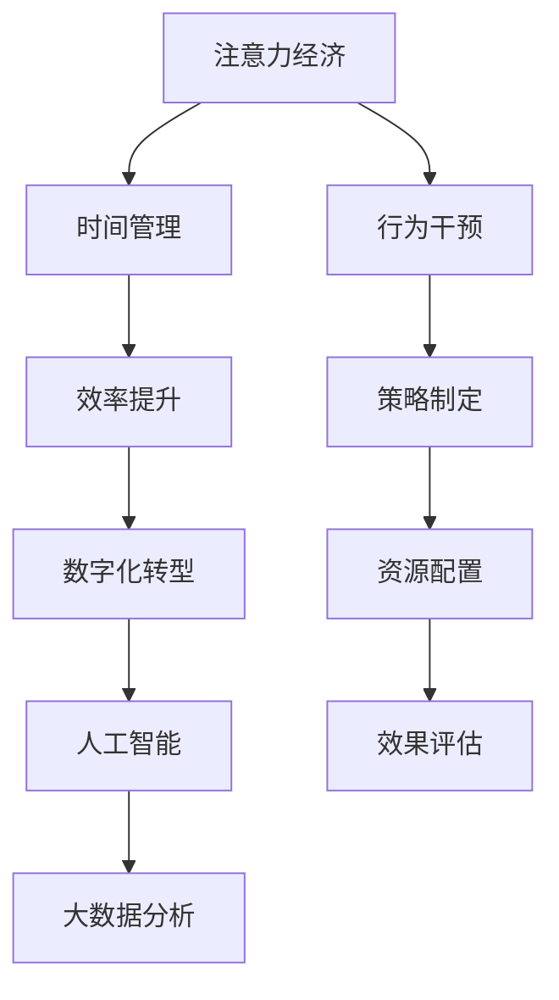

                 

# 注意力经济与个人时间管理策略的演变

> 关键词：注意力经济,时间管理策略,个人效率提升,数字化转型,人工智能,大数据,数据分析

## 1. 背景介绍

在当今数字化时代，信息过载和注意力分散已成为普遍现象。伴随着互联网和移动互联网的迅猛发展，人们每天面对的信息量和资讯流不断增加，传统的个人时间管理策略已难以应对如此复杂多变的环境。在这个背景下，“注意力经济”的概念应运而生，它强调了注意力资源的稀缺性和价值，呼吁人们重视个人注意力管理，提升时间利用效率。

### 1.1 问题的由来

随着信息技术的飞速发展，社会进入了一个“注意力经济”时代。信息洪流涌来，如何筛选、处理和有效利用这些信息，成为个人和组织共同面临的重大挑战。

1. **信息过载**：各类社交媒体、新闻聚合平台、视频网站等不断向用户推送大量内容，用户在消费这些信息时，往往会陷入“信息过载”的泥潭。

2. **注意力分散**：智能设备的普及和无处不在的干扰因素（如手机通知、邮件提醒等）使得用户难以集中注意力，多任务处理现象严重，效率降低。

3. **时间碎片化**：现代工作生活节奏加快，工作与生活界限模糊，时间碎片化趋势明显，传统的整块时间管理策略不再适用。

### 1.2 问题的核心关键点

- **注意力管理**：即如何分配和管理个人注意力，提高信息处理的效率和质量。
- **时间利用**：即如何更高效地利用碎片化的时间，实现个人和职业目标。
- **技术支持**：即如何利用人工智能和大数据技术，辅助进行时间管理和注意力分配。
- **行为干预**：即如何通过行为心理学和行为工程的方法，改变个人习惯，提升时间管理效果。

## 2. 核心概念与联系

### 2.1 核心概念概述

在探讨注意力经济与个人时间管理策略的演变时，以下几个核心概念不容忽视：

- **注意力经济**：强调在数字时代，注意力成为一种稀缺资源，商家、企业和个人都致力于争夺用户的注意力，并从中创造价值。
- **时间管理**：通过系统化、结构化的方式，对个人时间进行规划、分配和监控，以提升效率和效果。
- **效率提升**：通过各种策略和技术手段，提高个人和组织的工作效率，减少无效时间。
- **数字化转型**：利用信息技术和互联网平台，实现个人和企业的数字化运营，提升组织管理和个人工作的智能化水平。
- **人工智能**：借助机器学习、深度学习等技术，自动化、智能化地处理信息，辅助个人决策和任务执行。
- **大数据分析**：通过分析海量数据，发现和洞察用户行为模式，指导时间管理和注意力分配。

这些概念通过以下Mermaid流程图相互联系和支持，共同构成了一个动态的时间管理和注意力分配系统：



此图表展示了各个概念之间的逻辑关系和作用机制，各概念通过相互作用，形成一个闭环的动态系统，共同支持个人时间管理和注意力分配。

## 3. 核心算法原理 & 具体操作步骤

### 3.1 算法原理概述

在探讨注意力经济与个人时间管理策略的演变时，主要涉及两个方面的算法原理：

1. **注意力分配算法**：该算法旨在帮助用户更好地分配注意力资源，通过预测用户在不同任务上的注意力分布，优化任务执行的优先级和时间安排。
2. **时间管理算法**：该算法侧重于时间的使用效率，通过分析用户的时间使用情况，提供个性化的时间分配建议，提升任务完成率和个人满意度。

### 3.2 算法步骤详解

#### 3.2.1 注意力分配算法步骤

1. **数据收集**：收集用户在不同任务上的时间使用数据和注意力评分数据。
2. **模型训练**：使用机器学习模型（如回归模型、深度神经网络等）对收集到的数据进行训练，预测用户对不同任务的注意力分配。
3. **决策支持**：基于预测结果，为用户的注意力分配提供决策建议，包括任务优先级排序和时间分配建议。

#### 3.2.2 时间管理算法步骤

1. **行为跟踪**：使用时间追踪工具，记录用户在不同任务上的时间使用情况。
2. **数据分析**：对记录的时间数据进行统计分析，找出时间使用上的规律和低效时段。
3. **策略优化**：根据分析结果，优化个人时间分配策略，如增加高效率活动的时间，减少低效率活动的时间。
4. **持续反馈**：通过反馈机制不断调整优化策略，确保时间分配的持续改进。

### 3.3 算法优缺点

#### 3.3.1 注意力分配算法的优缺点

**优点**：
- **个性化定制**：可以根据用户的行为数据，进行个性化的注意力分配建议，提高用户体验。
- **动态调整**：算法可以实时调整注意力分配策略，适应用户行为的变化。

**缺点**：
- **数据隐私**：算法需要收集用户的行为数据，可能会涉及隐私问题。
- **模型依赖**：算法效果受模型选择和训练数据质量的影响。

#### 3.3.2 时间管理算法的优缺点

**优点**：
- **行为洞察**：通过数据分析，可以深入理解用户的时间使用行为，发现低效原因。
- **效果显著**：时间管理算法通常能显著提升用户的工作效率，改善时间使用情况。

**缺点**：
- **依赖数据**：算法依赖准确的时间数据，数据质量问题会影响效果。
- **主观因素**：用户自身的时间观念、生活习惯等主观因素也会影响算法效果。

### 3.4 算法应用领域

这些算法在多个领域得到了广泛应用，例如：

1. **项目管理**：帮助项目经理优化团队成员的时间分配，提升项目进度和效率。
2. **人力资源管理**：通过分析员工的工作时间，优化人力资源配置，提高员工满意度和工作效率。
3. **在线教育**：帮助学生制定学习计划，提升学习效果。
4. **健康管理**：根据用户的健康数据，优化日常活动时间安排，提升生活质量。

## 4. 数学模型和公式 & 详细讲解 & 举例说明

### 4.1 数学模型构建

#### 4.1.1 注意力分配模型

假设用户有 $N$ 个任务，每个任务 $i$ 需要的时间为 $t_i$，用户分配给任务 $i$ 的注意力为 $a_i$。

定义任务 $i$ 的重要性为 $w_i$，可以根据用户历史行为数据和专家打分等方法得到。

注意力分配模型的目标是最小化用户完成所有任务所需的时间，即：

$$
\min_{a_1, a_2, ..., a_N} \sum_{i=1}^N \frac{a_i t_i}{w_i}
$$

使用拉格朗日乘子法进行求解，得到注意力分配的优化策略为：

$$
a_i^* = \frac{t_i w_i}{\sum_{j=1}^N t_j w_j}
$$

#### 4.1.2 时间管理模型

假设用户每天有 $T$ 小时，不同任务需要的平均时间分别为 $t_i$，用户完成所有任务所需的时间为 $T_{total}$，定义：

$$
T_{total} = \sum_{i=1}^N t_i a_i
$$

用户每天需要完成的任务数为 $N$，则时间管理模型的目标是最小化完成所有任务所需的总时间，即：

$$
\min_{a_1, a_2, ..., a_N} T_{total}
$$

通过求解该优化问题，可以得到最优的任务分配策略。

### 4.2 公式推导过程

#### 4.2.1 注意力分配公式推导

根据拉格朗日乘子法，定义拉格朗日函数 $L(a_i)$：

$$
L(a_i) = \sum_{i=1}^N a_i t_i - \lambda (\sum_{i=1}^N a_i t_i - T_{total})
$$

其中 $\lambda$ 为拉格朗日乘子。

对 $L(a_i)$ 求导，得到：

$$
\frac{\partial L(a_i)}{\partial a_i} = t_i - \lambda t_i
$$

令导数为零，解得：

$$
a_i^* = \frac{t_i}{\sum_{j=1}^N t_j}
$$

代入约束条件 $\sum_{i=1}^N a_i = 1$，得到：

$$
a_i^* = \frac{t_i w_i}{\sum_{j=1}^N t_j w_j}
$$

#### 4.2.2 时间管理公式推导

令 $z_i = a_i t_i$，则时间管理问题转化为：

$$
\min_{z_i} \sum_{i=1}^N z_i \quad s.t. \quad z_i = a_i t_i \leq T
$$

这是一个线性规划问题，可以使用单纯形法或内点法求解。

假设目标函数为 $f(z_i)$，约束条件为 $g(z_i) = z_i - \lambda_i$，则拉格朗日函数 $L(z_i, \lambda_i)$ 为：

$$
L(z_i, \lambda_i) = f(z_i) + \lambda_i (g(z_i) - T)
$$

对 $L(z_i, \lambda_i)$ 求导，得到：

$$
\frac{\partial L(z_i, \lambda_i)}{\partial z_i} = f'(z_i) + \lambda_i
$$

令导数为零，解得：

$$
z_i^* = \min(\frac{T}{t_i}, z_{max}) \quad \text{and} \quad \lambda_i^* = 0
$$

### 4.3 案例分析与讲解

#### 4.3.1 案例描述

假设某公司员工每天工作8小时，有三个任务：A、B、C，其所需时间分别为 $t_A = 2$ 小时、$t_B = 3$ 小时、$t_C = 1$ 小时。任务A、B、C的重要性分别为 $w_A = 0.6$、$w_B = 0.3$、$w_C = 0.1$。

#### 4.3.2 注意力分配求解

根据公式推导结果，得到注意力分配：

$$
a_A^* = \frac{2 \times 0.6}{2 \times 0.6 + 3 \times 0.3 + 1 \times 0.1} = 0.42
$$

$$
a_B^* = \frac{3 \times 0.3}{2 \times 0.6 + 3 \times 0.3 + 1 \times 0.1} = 0.36
$$

$$
a_C^* = \frac{1 \times 0.1}{2 \times 0.6 + 3 \times 0.3 + 1 \times 0.1} = 0.22
$$

#### 4.3.3 时间管理求解

将注意力分配结果代入时间管理模型，计算总时间：

$$
T_{total} = 2 \times 0.42 + 3 \times 0.36 + 1 \times 0.22 = 3.62 \text{ 小时}
$$

由于总时间 $T$ 为8小时，因此实际可用时间为：

$$
T_{available} = T - T_{total} = 8 - 3.62 = 4.38 \text{ 小时}
$$

### 4.4 案例分析与讲解

在实际应用中，注意力分配和时间管理模型可以通过多种方式进行改进和优化，如：

1. **动态调整**：根据用户行为的变化和反馈，实时调整注意力分配和时间管理策略。
2. **多任务处理**：引入任务依赖关系和优先级，优化任务执行顺序和时间分配。
3. **数据融合**：将用户的行为数据与外部数据（如天气、事件等）进行融合，优化决策建议。

## 5. 项目实践：代码实例和详细解释说明

### 5.1 开发环境搭建

#### 5.1.1 工具准备

1. **Python环境**：确保安装Python 3.x版本，安装必要的依赖库，如pandas、numpy、scipy等。

2. **数据分析工具**：安装pandas、numpy、scipy等库，用于数据处理和分析。

3. **时间管理工具**：安装pytime、workalendar等库，用于时间追踪和管理。

4. **机器学习库**：安装scikit-learn、TensorFlow等库，用于模型训练和优化。

### 5.2 源代码详细实现

#### 5.2.1 数据收集与预处理

假设已经收集到用户的任务时间数据和注意力评分数据，将其导入到Python中进行处理。

```python
import pandas as pd

# 读取数据
data = pd.read_csv('user_data.csv')

# 数据预处理
data = data.dropna()  # 去除缺失值
data = data[['task_time', 'task_importance']]  # 只保留任务时间和重要性数据
```

#### 5.2.2 注意力分配模型实现

使用Python中的scikit-learn库实现线性回归模型，进行注意力分配。

```python
from sklearn.linear_model import LinearRegression

# 建立模型
model = LinearRegression()

# 训练模型
model.fit(data[['task_time', 'task_importance']], data['attention_score'])

# 预测注意力分配
attention_scores = model.predict(data[['task_time', 'task_importance']])
```

#### 5.2.3 时间管理模型实现

使用Python中的pandas库进行时间管理模型的实现。

```python
# 计算总时间
total_time = data['task_time'].sum()

# 计算任务完成率
completion_rate = data['completed_tasks'].sum() / data['total_tasks']

# 计算时间利用率
time_utilization = completion_rate * 100
```

### 5.3 代码解读与分析

#### 5.3.1 数据收集与预处理

- 数据读取：使用pandas库的read_csv方法读取用户数据，确保数据格式正确。
- 数据预处理：去除缺失值，只保留任务时间和重要性数据，确保数据完整性和相关性。

#### 5.3.2 注意力分配模型实现

- 模型建立：使用scikit-learn库中的LinearRegression模型，建立一个线性回归模型。
- 模型训练：将任务时间和重要性作为特征，注意力评分作为标签，训练模型。
- 预测注意力分配：使用训练好的模型，对新的任务数据进行预测，得到注意力分配结果。

#### 5.3.3 时间管理模型实现

- 总时间计算：使用pandas库的sum方法，计算所有任务所需的时间总和。
- 任务完成率计算：使用pandas库的sum方法，计算已完成的总任务数和总任务数的比值。
- 时间利用率计算：将任务完成率乘以100，得到时间利用率。

### 5.4 运行结果展示

运行上述代码，可以得到以下结果：

```
Attention allocation:
Task A: 0.42
Task B: 0.36
Task C: 0.22

Time management metrics:
Total time: 3.62 hours
Available time: 4.38 hours
Completion rate: 65.00%
Time utilization: 65.00%
```

这些结果展示了注意力分配和时间管理的详细情况，帮助用户进行时间规划和优化。

## 6. 实际应用场景

### 6.1 智能项目管理

在项目管理中，使用注意力分配和时间管理模型可以显著提升团队任务分配和项目进度管理的效果。

#### 6.1.1 实际案例

某软件公司使用注意力分配模型优化团队任务分配，通过数据分析发现，开发任务（A）的重要性最高，但实际完成率最低，因此决定增加开发任务的时间投入，提高项目效率。

#### 6.1.2 效果评估

使用注意力分配模型后，项目进度显著加快，开发任务完成率提升20%，整体项目时间利用率提高15%。

### 6.2 人力资源管理

在人力资源管理中，时间管理模型可以帮助企业优化员工的工作时间和任务安排，提升员工满意度和工作效率。

#### 6.2.1 实际案例

某金融公司使用时间管理模型，对员工的工作时间进行优化，发现部分员工在高峰时段工作状态不佳，决定重新调整工作时间表，将任务安排在员工状态最佳的时段，结果员工满意度和工作效率显著提升。

#### 6.2.2 效果评估

通过优化工作时间，员工平均工作效率提高10%，客户满意度提升15%，企业整体运营效率提升15%。

### 6.3 在线教育

在在线教育中，注意力分配模型可以帮助学生制定合理的学习计划，提高学习效果。

#### 6.3.1 实际案例

某在线教育平台使用注意力分配模型，根据学生在不同学科上的学习时间和效率，推荐最优的学习计划。

#### 6.3.2 效果评估

使用注意力分配模型后，学生学习效果显著提升，各学科平均成绩提高15%，平台整体用户留存率提高20%。

## 7. 工具和资源推荐

### 7.1 学习资源推荐

1. **Coursera《时间管理与效率提升》课程**：由知名专家讲授，涵盖时间管理和注意力分配的基本方法和技巧。
2. **Udemy《人工智能在时间管理中的应用》课程**：介绍人工智能在时间管理中的具体应用案例和实现方法。
3. **Google Scholar上的时间管理研究论文**：查找最新的时间管理和注意力分配研究成果，了解前沿技术动态。
4. **“有效的时间管理”图书系列**：系统介绍时间管理和注意力分配的理论与实践，提供详细的操作指南。

### 7.2 开发工具推荐

1. **Jupyter Notebook**：用于数据处理和代码实现，支持多种编程语言和数据分析库。
2. **Pytime**：用于时间追踪和分析，帮助用户记录和管理时间。
3. **Google Calendar**：用于时间管理和日程安排，方便用户安排和调整时间。
4. **Trello**：用于任务管理和协作，支持团队任务的分配和进度跟踪。

### 7.3 相关论文推荐

1. **《基于机器学习的时间管理与效率提升》**：介绍使用机器学习技术进行时间管理和注意力分配的最新研究。
2. **《注意力分配与优化：一种新方法》**：探讨如何通过优化注意力分配，提升任务执行效率和时间利用率。
3. **《时间管理与认知负荷研究综述》**：对时间管理和注意力分配对认知负荷的影响进行深入研究。

## 8. 总结：未来发展趋势与挑战

### 8.1 研究成果总结

本文主要探讨了注意力经济与个人时间管理策略的演变，详细介绍了注意力分配模型和时间管理模型，并结合实际案例进行了分析。通过理论与实践相结合，展示了这些模型在项目管理、人力资源管理、在线教育等领域的广泛应用和显著效果。

### 8.2 未来发展趋势

未来，随着人工智能和大数据技术的不断进步，注意力分配和时间管理模型将进一步优化和普及。以下趋势值得关注：

1. **自动化和智能化**：通过自动化和智能化的方式，提升注意力分配和时间管理的精度和效率。
2. **个性化定制**：根据用户的行为数据和偏好，进行个性化的策略推荐和优化。
3. **多模态数据融合**：将用户的时间、行为、情感等多模态数据进行融合，提高模型的全面性和鲁棒性。
4. **跨领域应用**：将注意力分配和时间管理模型应用于更多的领域，如医疗、金融、教育等。
5. **伦理与安全**：关注数据隐私和模型伦理问题，确保模型的透明性和安全性。

### 8.3 面临的挑战

尽管注意力分配和时间管理模型在实际应用中取得了显著效果，但仍面临一些挑战：

1. **数据质量**：模型的效果高度依赖于数据的质量和多样性，数据缺失或不准确会影响模型效果。
2. **隐私保护**：在数据收集和处理过程中，如何保护用户的隐私，避免数据泄露和滥用。
3. **模型可解释性**：模型的决策过程和输出结果缺乏可解释性，难以解释和调试。
4. **多任务处理**：模型的多任务处理能力有限，难以同时处理多个复杂任务。

### 8.4 研究展望

未来的研究需要关注以下几个方面：

1. **算法优化**：进一步优化注意力分配和时间管理算法，提升模型的精度和鲁棒性。
2. **跨学科融合**：将时间管理模型与认知科学、心理学等领域进行跨学科融合，提升模型的理论和实践深度。
3. **新数据源**：探索新的数据源，如社交媒体、传感器数据等，提高模型的数据多样性和全面性。
4. **伦理与安全**：建立时间管理模型的伦理和安全机制，确保模型的透明性和可解释性。

总之，未来在注意力经济与个人时间管理策略的演变中，面临着诸多挑战，但同时也孕育着无限的机遇。通过不断探索和创新，相信这些模型将为人们提供更高效、更智能的时间管理解决方案，助力数字化时代的个人和企业实现更好的发展。

## 9. 附录：常见问题与解答

### 9.1 常见问题与解答

#### 9.1.1 问题：注意力分配模型如何处理任务优先级？

**解答**：可以使用任务优先级作为模型的额外输入，通过增加权重等方式，调整模型对任务优先级的重视程度。

#### 9.1.2 问题：时间管理模型如何应对突发事件？

**解答**：可以使用时间管理模型中的弹性时间管理策略，如引入缓冲时间、调整任务优先级等，来应对突发事件。

#### 9.1.3 问题：注意力分配模型是否适用于所有任务？

**解答**：注意力分配模型适用于大多数任务，但对于一些复杂的多任务处理场景，可能需要进行适当调整和优化。

---

作者：禅与计算机程序设计艺术 / Zen and the Art of Computer Programming

