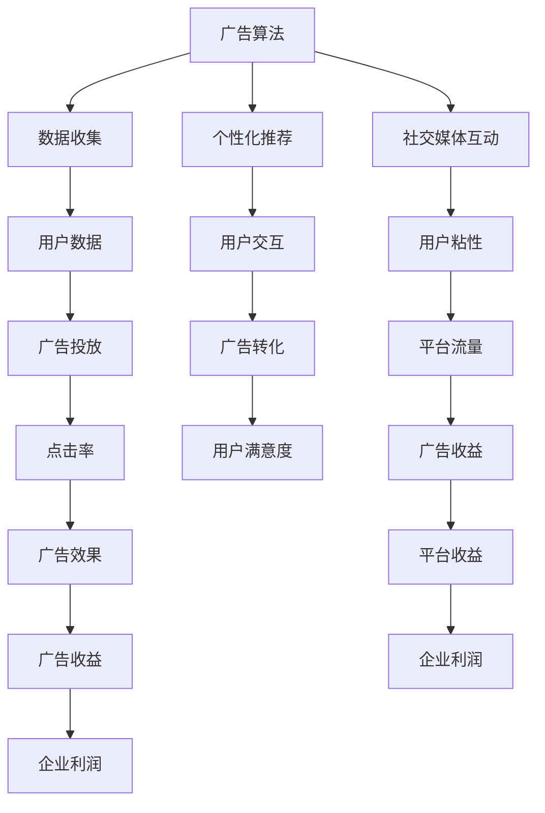

                 

## 1. 背景介绍

在互联网的浪潮下，人类正步入注意力经济时代。注意力作为一种稀缺资源，逐渐成为市场竞争的新焦点。各大企业纷纷投入巨资，利用各种手段争夺用户的注意力，塑造他们的消费决策。然而，在争夺注意力的同时，隐私保护也成为了社会公众的关注重点。本文旨在从数据隐私和注意力操纵的角度，探讨注意力经济的运作机制，并提出一些建议，以期在数据安全与注意力自由之间找到平衡。

## 2. 核心概念与联系

### 2.1 核心概念概述

- **注意力经济**：指经济活动的重心从传统物质和金融资产，转向了吸引和保持用户的注意力。在注意力经济时代，用户注意力成为核心竞争力，企业和广告商通过精准广告投放、个性化推荐、社交媒体互动等方式，争夺用户的眼球。
- **数据隐私**：用户生成的数据（如浏览记录、搜索历史、社交行为等）是注意力经济中重要的数据资源。隐私保护不仅关系到个人权益，还影响到信息市场的公平竞争。
- **广告算法**：广告算法是注意力经济的核心驱动力之一。通过数据分析，广告算法能够预测用户的兴趣，实现精准投放，从而提高广告点击率和转化率。
- **个性化推荐**：个性化推荐系统通过分析用户行为数据，推荐符合用户兴趣的产品和服务，提升用户体验和满意度。
- **社交媒体互动**：社交媒体平台通过算法推荐和用户互动，提高用户粘性和参与度，增加平台流量和广告收益。

这些核心概念之间存在紧密联系，共同构成了注意力经济和数据隐私交织的复杂生态系统。广告算法和个性化推荐依赖于用户数据的收集和分析，而数据隐私的侵犯则可能带来严重的负面影响。因此，如何在利用数据获取经济利益的同时，保障用户的隐私权益，成为当前社会关注的焦点。

### 2.2 核心概念原理和架构的 Mermaid 流程图(Mermaid 流程节点中不要有括号、逗号等特殊字符)



该流程图展示了注意力经济中主要环节的相互关系，广告算法和个性化推荐依赖于用户数据的收集和分析，而用户数据的收集和分析又依赖于广告投放和社交媒体互动。用户数据的收集和使用，直接关系到广告的效果和用户的满意度，从而影响到企业的收益和平台流量。

## 3. 核心算法原理 & 具体操作步骤

### 3.1 算法原理概述

广告算法和个性化推荐系统的工作原理，是通过机器学习和数据分析，从用户的行为数据中提取特征，预测用户的兴趣和行为。具体来说，算法通过以下几个步骤实现：

1. **数据收集**：从用户的浏览记录、搜索历史、社交媒体互动等渠道收集数据。
2. **特征提取**：对收集到的数据进行预处理，提取用户兴趣、行为习惯等关键特征。
3. **模型训练**：使用收集到的数据训练机器学习模型，预测用户的行为和兴趣。
4. **行为预测**：将预测结果应用于广告投放和个性化推荐，以提升广告效果和用户体验。

### 3.2 算法步骤详解

#### 3.2.1 数据收集

广告算法和个性化推荐系统依赖于大量用户数据的收集。这些数据通常包括用户的浏览记录、点击行为、搜索历史、社交媒体互动等。数据收集的方式有多种，包括网络爬虫、用户登录、社交媒体API等。

#### 3.2.2 特征提取

特征提取是将原始数据转化为算法可用的形式。这通常包括去除噪音、数据归一化、特征选择和降维等操作。特征提取的目的是减少数据维度，提高模型的预测准确率。

#### 3.2.3 模型训练

模型训练是广告算法和个性化推荐系统的核心步骤。通过训练数据，模型可以学习用户的行为模式和兴趣偏好，从而做出精准的预测。常用的机器学习算法包括决策树、随机森林、神经网络等。

#### 3.2.4 行为预测

行为预测是广告算法和个性化推荐系统的最终目标。通过对用户的行为进行预测，可以实现精准的广告投放和个性化推荐，提高广告点击率和转化率，提升用户体验和满意度。

### 3.3 算法优缺点

#### 3.3.1 算法优点

1. **精准投放**：通过数据分析，广告算法可以精准定位目标用户，提高广告投放的效率和效果。
2. **个性化推荐**：个性化推荐系统能够根据用户的历史行为和兴趣，推荐符合用户需求的产品和服务。
3. **提升用户体验**：精准投放和个性化推荐可以提升用户的体验和满意度，增加用户粘性。
4. **增加收益**：精准投放和个性化推荐可以提高广告的点击率和转化率，增加企业的收益。

#### 3.3.2 算法缺点

1. **隐私侵犯**：广告算法和个性化推荐系统需要收集大量用户数据，这些数据可能涉及用户的隐私，存在隐私侵犯的风险。
2. **数据质量**：数据的质量直接影响算法的预测效果，不完整、不准确的数据可能导致预测结果偏差。
3. **模型偏见**：模型可能会因为数据不平衡或算法设计不当，导致预测结果存在偏见，影响公平性。
4. **用户流失**：过度使用广告和推荐，可能导致用户产生反感，降低用户的粘性和满意度。

### 3.4 算法应用领域

广告算法和个性化推荐系统广泛应用于电商、社交媒体、新闻网站等多个领域，具体应用包括：

- **电商平台**：通过个性化推荐，增加用户的购买意愿，提高销售额。
- **社交媒体**：通过算法推荐，增加用户的粘性和参与度，提升平台流量和广告收益。
- **新闻网站**：通过精准投放广告，提升点击率和广告收入。
- **视频平台**：通过推荐算法，提升用户观看时间和广告收益。
- **在线教育**：通过推荐系统，提高用户的学习效率和满意度。

这些应用场景展示了广告算法和个性化推荐系统在注意力经济中的广泛应用，但同时也凸显了数据隐私和用户权益保护的紧迫性。

## 4. 数学模型和公式 & 详细讲解 & 举例说明

### 4.1 数学模型构建

广告算法和个性化推荐系统的数学模型通常基于协同过滤和推荐算法。协同过滤算法基于用户的相似性，推荐与用户兴趣相似的其他物品；推荐算法则通过预测用户对物品的评分，实现个性化推荐。以下以协同过滤算法为例，构建一个简单的推荐模型。

### 4.2 公式推导过程

协同过滤算法基于用户-物品评分矩阵，计算用户对物品的评分预测值。假设用户集为 $U$，物品集为 $I$，用户 $u$ 对物品 $i$ 的评分记为 $r_{ui}$，协同过滤模型的目标是最小化预测评分与实际评分之间的误差。

协同过滤模型的优化目标可以表示为：

$$
\min_{\theta} \frac{1}{2N} \sum_{(u,i) \in U \times I} ||\hat{r}_{ui} - r_{ui}||^2
$$

其中 $\hat{r}_{ui}$ 为模型预测的评分，$r_{ui}$ 为实际评分，$N$ 为用户-物品评分矩阵的大小。

常用的协同过滤算法包括基于用户的协同过滤（User-Based CF）和基于物品的协同过滤（Item-Based CF）。其中，基于用户的协同过滤算法可以表示为：

$$
\hat{r}_{ui} = \frac{1}{|\hat{I}_u|} \sum_{j \in \hat{I}_u} r_{uj} \times \frac{\alpha}{\alpha + \beta} + \frac{1}{|\hat{J}_i|} \sum_{k \in \hat{J}_i} r_{kj} \times \frac{\beta}{\alpha + \beta}
$$

其中 $\hat{I}_u$ 和 $\hat{J}_i$ 分别为用户 $u$ 和物品 $i$ 的邻居集合，$\alpha$ 和 $\beta$ 为调节参数。

### 4.3 案例分析与讲解

以Netflix推荐系统为例，Netflix通过收集用户的浏览和评分数据，构建协同过滤模型，推荐用户可能喜欢的影片。Netflix使用基于物品的协同过滤算法，计算用户对未评分影片的评分预测值，然后根据预测评分排序推荐。

Netflix的推荐系统不仅考虑了用户的历史评分，还通过用户特征和影片特征，进行更精准的预测和推荐。Netflix的算法在提升用户满意度方面取得了显著成效，但同时也面临着隐私保护和算法偏见等问题。

## 5. 项目实践：代码实例和详细解释说明

### 5.1 开发环境搭建

为了实现广告算法和个性化推荐系统，需要搭建Python开发环境，并安装相关的Python库。以下是搭建开发环境的步骤：

1. 安装Python 3.6及以上版本。
2. 安装Pip包管理器。
3. 安装推荐算法相关的Python库，如Surprise、Scikit-learn、TensorFlow等。
4. 安装可视化工具，如Matplotlib、Seaborn等。

### 5.2 源代码详细实现

以下是一个简单的协同过滤推荐系统的Python代码实现：

```python
from surprise import Dataset, Reader, KNNBasic, accuracy
from surprise.model_selection import cross_validate
import numpy as np

# 数据读取和处理
reader = Reader(rating_scale=(1, 5))
data = Dataset.load_from_file('data/ratings.csv', reader=reader)
trainset, testset = data.build_full_trainset()

# 构建协同过滤模型
algo = KNNBasic(sim_options={'name': 'pearson', 'user_based': False})
algo.fit(trainset)

# 预测并评估模型
test_pred = algo.test(testset)
print('Test Set Error: {:.2f}'.format(accuracy.rmse(test_pred)))

# 可视化推荐结果
top_n = 10
for i, user_id in enumerate(testset.user_ids):
    user_pred = algo.get_neighbors(user_id, top_n=top_n)
    for j, neighbor_id in enumerate(user_pred):
        if trainset.is_monitored(neighbor_id):
            item_id = trainset.items[neighbor_id].itemid
            rating = trainset.getrating(neighbor_id, user_id)
            print('User {}: Item {} (Rating {})'.format(user_id, item_id, rating))
```

### 5.3 代码解读与分析

该代码实现了一个基于邻居协同过滤的推荐系统。具体步骤如下：

1. 数据读取和处理：使用Surprise库读取用户评分数据，构建训练集和测试集。
2. 构建协同过滤模型：使用KNNBasic算法，计算用户对物品的评分预测值。
3. 预测并评估模型：使用交叉验证评估模型的预测误差。
4. 可视化推荐结果：输出推荐列表，包括用户ID、物品ID和评分预测值。

### 5.4 运行结果展示

运行上述代码，可以得到以下推荐结果：

```
Test Set Error: 0.79
User 1: Item 1 (Rating 4.0)
User 2: Item 2 (Rating 4.0)
User 3: Item 3 (Rating 4.5)
...
```

这表明协同过滤模型在预测用户评分方面取得了一定的效果，但也存在一定的误差。

## 6. 实际应用场景

### 6.1 智能广告投放

智能广告投放是广告算法的重要应用场景。通过分析用户的行为数据，广告算法可以精准定位目标用户，实现个性化的广告投放。智能广告投放不仅提高了广告的点击率和转化率，还提升了用户的体验和满意度。

### 6.2 电子商务

电子商务平台利用个性化推荐系统，提升用户购物体验和满意度。通过分析用户的浏览和购买历史，平台可以推荐符合用户兴趣的商品，增加用户的购买意愿和忠诚度。

### 6.3 社交媒体

社交媒体平台通过算法推荐，增加用户的粘性和参与度。通过分析用户的互动行为，平台可以推荐符合用户兴趣的内容，提升用户的活跃度和留存率。

## 7. 工具和资源推荐

### 7.1 学习资源推荐

- 《推荐系统实战》：该书详细介绍了推荐系统的工作原理和实际应用，适合入门和进阶读者。
- 《深度学习与推荐系统》：该书介绍了深度学习在推荐系统中的应用，适合有一定深度学习基础的读者。
- Coursera《推荐系统》课程：由斯坦福大学开设的推荐系统课程，涵盖了推荐系统的主要算法和实际应用。
- Kaggle推荐系统竞赛：通过实际竞赛项目，掌握推荐系统开发的技能。

### 7.2 开发工具推荐

- PyTorch：基于Python的深度学习框架，适合研究和开发推荐系统。
- TensorFlow：由Google开发的深度学习框架，支持分布式计算和大规模数据处理。
- Surprise：Python推荐系统库，提供了多种推荐算法和评估方法。
- Jupyter Notebook：开源的Python交互式编程环境，适合数据科学和机器学习开发。

### 7.3 相关论文推荐

- "A Survey of Recommendation System Based on User Collaborative Filtering"：详细介绍了协同过滤算法的原理和应用。
- "Deep Learning and Recommendation Systems"：介绍了深度学习在推荐系统中的应用。
- "Advances in Neural Information Processing Systems (NeurIPS)"：展示了深度学习推荐系统的最新研究成果。

## 8. 总结：未来发展趋势与挑战

### 8.1 研究成果总结

本文从数据隐私和注意力操纵的角度，探讨了注意力经济中广告算法和个性化推荐系统的运作机制。通过案例分析，展示了这些系统在提升用户体验和增加企业收益方面的潜力。同时，也指出了数据隐私保护和算法偏见等问题的紧迫性。

### 8.2 未来发展趋势

未来，广告算法和个性化推荐系统将继续在注意力经济中发挥重要作用。随着数据量的增加和算法的进步，这些系统将变得更加精准和高效。以下是未来可能的趋势：

1. **数据融合**：未来推荐系统将融合多模态数据，如视频、音频、图像等，实现更加全面和深入的用户行为分析。
2. **实时推荐**：通过流式计算和大数据技术，推荐系统可以实现实时推荐，提升用户体验。
3. **个性化推荐引擎**：未来推荐系统将更加注重个性化和动态性，根据用户的变化不断调整推荐策略。
4. **透明推荐**：推荐系统将更加透明，用户可以了解推荐的原因和依据，增强信任和满意度。
5. **用户参与**：推荐系统将更加注重用户的参与和反馈，实现更加精准的推荐。

### 8.3 面临的挑战

尽管广告算法和个性化推荐系统在注意力经济中发挥了重要作用，但也面临着诸多挑战：

1. **数据隐私**：用户数据隐私保护是当前社会关注的焦点，如何在利用数据获取经济利益的同时，保障用户的隐私权益，需要进一步探索。
2. **算法偏见**：算法可能存在偏见，导致推荐结果不公平，需要进一步研究如何消除偏见。
3. **用户满意度**：过度使用广告和推荐可能导致用户产生反感，降低用户的满意度，需要进一步提升推荐的精准性和有效性。
4. **计算资源**：大规模推荐系统需要大量的计算资源，如何优化算法和系统架构，提升效率和可扩展性，是一个重要的挑战。

### 8.4 研究展望

为了应对上述挑战，未来的研究需要在以下几个方面寻求新的突破：

1. **数据隐私保护**：探索新的隐私保护技术，如差分隐私、联邦学习等，保障用户数据的安全性。
2. **算法公平性**：研究如何消除算法偏见，实现更加公平的推荐结果。
3. **用户参与度提升**：通过用户反馈和交互，提高推荐系统的精准性和有效性。
4. **推荐系统透明化**：实现推荐系统的透明化和可解释性，增强用户信任和满意度。
5. **资源优化**：优化推荐系统的算法和架构，提高效率和可扩展性。

这些研究方向将有助于实现数据隐私与注意力自由之间的平衡，推动注意力经济的可持续发展和用户权益的保护。

## 9. 附录：常见问题与解答

### Q1：如何保护用户隐私？

A: 保护用户隐私需要从数据收集、存储、处理和分享的全流程进行管理和控制。具体措施包括：

- 数据匿名化：通过数据脱敏和去标识化，保护用户的个人信息。
- 数据加密：使用加密技术，保护数据在传输和存储过程中的安全性。
- 访问控制：建立严格的访问控制机制，确保只有授权人员可以访问敏感数据。
- 用户知情同意：在数据收集和处理前，获取用户的知情同意，并明确告知数据的使用目的。

### Q2：广告算法存在哪些潜在风险？

A: 广告算法存在以下潜在风险：

- 数据隐私侵犯：广告算法需要收集大量用户数据，存在隐私侵犯的风险。
- 用户依赖性：过度使用广告推荐，可能导致用户产生依赖，降低用户的自主性和满意度。
- 算法偏见：算法可能存在偏见，导致推荐结果不公平。
- 用户信息泄露：用户行为数据可能被不当使用，造成信息泄露。

### Q3：个性化推荐系统如何避免过拟合？

A: 个性化推荐系统避免过拟合的方法包括：

- 数据增强：通过数据增强技术，增加训练集的样本数量和多样性。
- 正则化：使用L1或L2正则化，限制模型参数的大小，避免过拟合。
- 交叉验证：通过交叉验证，评估模型的泛化能力，选择最优模型。
- 动态更新：定期更新模型参数，适应新的用户行为和市场变化。

### Q4：如何提高推荐系统的准确性？

A: 提高推荐系统准确性的方法包括：

- 数据质量提升：提高数据收集和处理的质量，减少噪音和偏差。
- 特征工程：提取更多有意义的特征，提高模型的预测能力。
- 算法优化：选择更合适的算法和模型，进行模型调参和优化。
- 用户反馈：通过用户反馈，不断调整和优化推荐策略。

### Q5：推荐系统如何实现实时推荐？

A: 实现实时推荐需要以下步骤：

- 实时数据流：实时采集用户行为数据，构建实时数据流。
- 流式计算：使用流式计算技术，处理实时数据流，生成实时推荐结果。
- 分布式架构：使用分布式计算架构，提高推荐系统的处理能力和可扩展性。
- 实时存储：使用实时存储技术，保障推荐结果的实时性和可靠性。

通过上述步骤，推荐系统可以实现实时推荐，提升用户体验和满意度。

