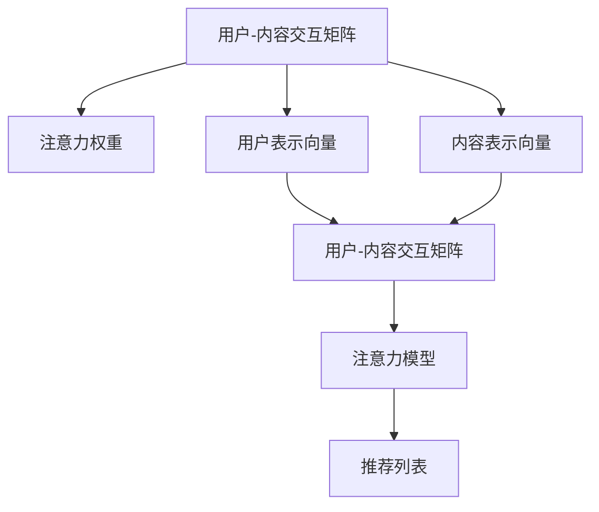

                 

# 注意力经济与个性化推荐算法：为受众提供定制、有针对性的内容

## 1. 背景介绍

### 1.1 问题由来

随着互联网技术的飞速发展，信息爆炸成为了一个普遍现象。用户每天需要面对海量的内容，但仅有少部分信息能够真正满足其需求，这导致用户在筛选信息时耗费大量时间和精力。传统的内容推荐算法，如基于协同过滤、基于内容的推荐算法等，往往难以深入理解用户的个性和偏好，导致推荐效果不理想。为了解决这一问题，基于注意力机制的个性化推荐算法应运而生。

### 1.2 问题核心关键点

注意力机制在个性化推荐中的应用，主要是通过对用户兴趣和内容的相互作用进行加权，赋予用户更关注的内容更高的权重，从而提供更具个性化和针对性的推荐。以下是核心问题关键点：

- 如何理解用户兴趣：通过用户行为数据（如浏览记录、点击历史等）进行分析，提取用户的兴趣特征。
- 如何描述内容特征：将内容转化为向量表示，捕捉内容的多样性和丰富性。
- 如何计算用户与内容的注意力权重：通过计算用户和内容的交互程度，确定注意力权重。
- 如何集成用户注意力权重进行推荐：综合用户权重和内容权重，生成最终推荐列表。

### 1.3 问题研究意义

基于注意力机制的个性化推荐算法，具有以下几方面的研究意义：

1. 提升用户体验：通过精准匹配用户和内容，提供个性化的推荐结果，提升用户对平台的粘性。
2. 提高信息获取效率：减少用户筛选信息的时间成本，让用户更快找到有用信息。
3. 促进内容消费：精准推荐使优质内容更容易被发现和消费，提升内容分发效率。
4. 优化资源配置：通过推荐算法优化资源分配，提高平台整体使用效率。
5. 增强数据洞察：通过用户兴趣的深度挖掘，实现对用户行为的全面理解，为平台决策提供支持。

## 2. 核心概念与联系

### 2.1 核心概念概述

在个性化推荐领域，注意力机制被广泛应用。以下是几个核心概念的介绍：

- 用户-内容交互矩阵：描述了用户和内容之间的交互程度，是注意力计算的基础。
- 注意力权重：反映了用户对不同内容的关注程度，用于加权集成用户兴趣和内容特征。
- 用户表示向量：将用户行为数据转化为向量表示，用于捕捉用户兴趣特征。
- 内容表示向量：将内容特征转化为向量表示，用于捕捉内容的多样性和丰富性。
- 注意力模型：用于计算用户和内容的注意力权重，推荐系统中常用的模型包括基于自注意力机制的模型和基于加权注意力机制的模型。

这些概念之间的逻辑关系可以通过以下Mermaid流程图来展示：



这个流程图展示了从用户-内容交互矩阵到推荐列表的全过程：

1. 通过用户行为数据构建用户-内容交互矩阵，计算注意力权重。
2. 将用户行为数据和内容特征转化为向量表示，用于计算注意力权重。
3. 通过注意力模型计算用户和内容的注意力权重，集成用户权重和内容权重，生成推荐列表。

## 3. 核心算法原理 & 具体操作步骤

### 3.1 算法原理概述

基于注意力机制的个性化推荐算法，其核心思想是通过计算用户和内容的注意力权重，实现对用户兴趣和内容特征的加权集成。其流程包括以下几个步骤：

1. 构建用户-内容交互矩阵：收集用户行为数据，构建用户与内容的交互矩阵。
2. 计算用户和内容的表示向量：通过用户行为数据和内容特征，计算用户表示向量和内容表示向量。
3. 计算注意力权重：使用注意力模型计算用户和内容的注意力权重，反映用户对内容的关注程度。
4. 生成推荐列表：将用户权重和内容权重进行加权集成，生成最终推荐结果。

### 3.2 算法步骤详解

#### 3.2.1 构建用户-内容交互矩阵

用户-内容交互矩阵 $A$ 可以表示为：

$$
A_{ij} = 
\begin{cases}
1 & \text{if user } i \text{ interacted with item } j \\
0 & \text{otherwise}
\end{cases}
$$

其中 $i$ 表示用户，$j$ 表示内容。构建用户-内容交互矩阵需要收集用户的行为数据，如浏览记录、点击历史、评分等。

#### 3.2.2 计算用户和内容的表示向量

用户表示向量 $\boldsymbol{u}_i$ 可以通过用户行为数据计算得到，常用的方法包括基于深度学习的用户嵌入（如MFNN、LSTM等）和基于矩阵分解的方法（如SVD、ALS等）。内容表示向量 $\boldsymbol{v}_j$ 可以通过内容的特征向量（如词频、TF-IDF等）计算得到。

#### 3.2.3 计算注意力权重

注意力权重 $w_{ij}$ 反映了用户 $i$ 对内容 $j$ 的关注程度，可以通过注意力模型计算得到。常用的注意力模型包括基于自注意力机制的模型（如Self-Attention）和基于加权注意力机制的模型（如Attention Networks）。

#### 3.2.4 生成推荐列表

推荐列表 $\boldsymbol{y}_i$ 可以通过用户表示向量 $\boldsymbol{u}_i$、内容表示向量 $\boldsymbol{v}_j$ 和注意力权重 $w_{ij}$ 计算得到。常用的推荐方法包括基于矩阵分解的方法（如PMF、ALS等）和基于深度学习的方法（如DeepFM、Wide&Deep等）。

### 3.3 算法优缺点

基于注意力机制的个性化推荐算法具有以下优点：

1. 能够捕捉用户兴趣的复杂结构：通过注意力权重，可以灵活地捕捉用户兴趣的多样性和复杂性。
2. 能够处理稀疏数据：注意力机制可以很好地处理用户-内容交互矩阵的稀疏性，提高推荐的准确性。
3. 能够处理长尾问题：注意力机制可以很好地处理长尾内容，提升推荐系统的多样性。
4. 能够动态更新推荐结果：基于注意力机制的推荐系统能够动态地更新推荐结果，适应用户的实时变化。

同时，该算法也存在一些局限性：

1. 对高质量标注数据依赖较大：构建用户-内容交互矩阵需要大量的用户行为数据，标注成本较高。
2. 模型复杂度高：基于深度学习的模型计算复杂度较高，需要较强的硬件支持。
3. 对冷启动问题处理能力不足：新用户的兴趣和内容表示难以准确计算，影响推荐效果。
4. 对数据分布变化敏感：用户兴趣和内容特征的变化可能导致推荐结果的不稳定。

### 3.4 算法应用领域

基于注意力机制的个性化推荐算法，已经被广泛应用于各种场景，如：

- 电子商务：推荐商品、折扣信息等。
- 社交媒体：推荐好友、兴趣群组等。
- 在线视频：推荐视频内容、电影等。
- 音乐推荐：推荐歌曲、专辑等。
- 新闻资讯：推荐新闻文章、专题等。
- 移动应用：推荐新闻、游戏、广告等。

除了上述这些经典应用外，注意力机制还被创新性地应用到更多场景中，如可控推荐、跨领域推荐、多目标推荐等，为个性化推荐系统带来了全新的突破。随着注意力机制和推荐算法的不断发展，相信基于注意力机制的推荐系统将在更多领域得到应用，为用户带来更好的体验。

## 4. 数学模型和公式 & 详细讲解  
### 4.1 数学模型构建

本节将使用数学语言对基于注意力机制的个性化推荐算法进行更加严格的刻画。

设用户 $i$ 的行为数据为 $D_i = \{x_1, x_2, \ldots, x_n\}$，内容 $j$ 的特征向量为 $\boldsymbol{v}_j = [v_{j1}, v_{j2}, \ldots, v_{jm}]$，用户 $i$ 和内容 $j$ 的交互矩阵为 $A_{ij} \in \{0, 1\}$。

用户表示向量 $\boldsymbol{u}_i$ 和内容表示向量 $\boldsymbol{v}_j$ 的计算方式如下：

$$
\boldsymbol{u}_i = f(\boldsymbol{x}_i)
$$

$$
\boldsymbol{v}_j = g(\boldsymbol{v}_j)
$$

其中 $f(\cdot)$ 和 $g(\cdot)$ 分别表示用户表示向量和内容表示向量的计算函数。

注意力权重 $w_{ij}$ 的计算方式如下：

$$
w_{ij} = \frac{\exp(\boldsymbol{u}_i \cdot \boldsymbol{v}_j)}{\sum_{k=1}^n \exp(\boldsymbol{u}_i \cdot \boldsymbol{v}_k)}
$$

其中 $\cdot$ 表示向量内积，$\exp(\cdot)$ 表示指数函数。

推荐列表 $\boldsymbol{y}_i$ 的计算方式如下：

$$
\boldsymbol{y}_i = \sum_{j=1}^m w_{ij} \boldsymbol{v}_j
$$

其中 $\boldsymbol{y}_i$ 表示用户 $i$ 的推荐列表。

### 4.2 公式推导过程

以下我们以基于自注意力机制的推荐模型为例，推导注意力权重和推荐列表的计算公式。

假设用户表示向量 $\boldsymbol{u}_i$ 和内容表示向量 $\boldsymbol{v}_j$ 分别为：

$$
\boldsymbol{u}_i = [u_{i1}, u_{i2}, \ldots, u_{in}]
$$

$$
\boldsymbol{v}_j = [v_{j1}, v_{j2}, \ldots, v_{jm}]
$$

注意力权重 $w_{ij}$ 的计算公式为：

$$
w_{ij} = \frac{\exp(\boldsymbol{u}_i \cdot \boldsymbol{v}_j)}{\sum_{k=1}^n \exp(\boldsymbol{u}_i \cdot \boldsymbol{v}_k)}
$$

其中内积 $\boldsymbol{u}_i \cdot \boldsymbol{v}_j = \sum_{l=1}^d u_{il} v_{jl}$，$d$ 表示向量维度。

推荐列表 $\boldsymbol{y}_i$ 的计算公式为：

$$
\boldsymbol{y}_i = \sum_{j=1}^m w_{ij} \boldsymbol{v}_j
$$

其中 $w_{ij}$ 表示用户 $i$ 对内容 $j$ 的注意力权重。

### 4.3 案例分析与讲解

为了更好地理解基于注意力机制的个性化推荐算法，下面以Netflix推荐系统为例，进行详细的案例分析。

Netflix推荐系统使用基于自注意力机制的模型，主要包含以下几个步骤：

1. 收集用户行为数据：收集用户的浏览、观看、评分等行为数据，构建用户-内容交互矩阵 $A$。
2. 计算用户表示向量 $\boldsymbol{u}_i$：通过用户行为数据，使用深度学习模型（如MFNN）计算得到用户表示向量 $\boldsymbol{u}_i$。
3. 计算内容表示向量 $\boldsymbol{v}_j$：通过内容的特征向量（如词频、TF-IDF等），计算得到内容表示向量 $\boldsymbol{v}_j$。
4. 计算注意力权重 $w_{ij}$：使用自注意力机制计算用户和内容的注意力权重 $w_{ij}$。
5. 生成推荐列表 $\boldsymbol{y}_i$：通过用户表示向量 $\boldsymbol{u}_i$、内容表示向量 $\boldsymbol{v}_j$ 和注意力权重 $w_{ij}$ 计算得到推荐列表 $\boldsymbol{y}_i$。

Netflix推荐系统通过不断优化模型参数，结合用户行为数据和内容特征，实现了精准推荐，成为全球最大的视频流媒体服务提供商之一。

## 5. 项目实践：代码实例和详细解释说明
### 5.1 开发环境搭建

在进行个性化推荐实践前，我们需要准备好开发环境。以下是使用Python进行PyTorch开发的环境配置流程：

1. 安装Anaconda：从官网下载并安装Anaconda，用于创建独立的Python环境。

2. 创建并激活虚拟环境：
```bash
conda create -n pytorch-env python=3.8 
conda activate pytorch-env
```

3. 安装PyTorch：根据CUDA版本，从官网获取对应的安装命令。例如：
```bash
conda install pytorch torchvision torchaudio cudatoolkit=11.1 -c pytorch -c conda-forge
```

4. 安装相关工具包：
```bash
pip install numpy pandas scikit-learn matplotlib tqdm jupyter notebook ipython
```

完成上述步骤后，即可在`pytorch-env`环境中开始推荐系统开发。

### 5.2 源代码详细实现

下面我们以Netflix推荐系统为例，给出使用PyTorch进行推荐系统微调的PyTorch代码实现。

首先，定义数据预处理函数：

```python
import numpy as np
from torch.utils.data import Dataset
import torch

class MovieDataset(Dataset):
    def __init__(self, data):
        self.data = data
        self ratings = self.data['rating']
        self movies = self.data['movie']
        self users = self.data['user']
        
    def __len__(self):
        return len(self.data)
    
    def __getitem__(self, item):
        user_id = self.users[item]
        movie_id = self.movies[item]
        rating = self.ratings[item]
        return {'user_id': user_id, 'movie_id': movie_id, 'rating': rating}

# 加载数据集
data = pd.read_csv('data.csv')
dataset = MovieDataset(data)
```

然后，定义模型和优化器：

```python
from transformers import BertTokenizer
from torch.nn import Linear, Embedding, GRU, Softmax
from torch.optim import Adam

# 定义模型结构
class RecommendationModel(torch.nn.Module):
    def __init__(self, emb_dim, hid_dim, dropout, layer_num):
        super(RecommendationModel, self).__init__()
        self.embedding = Embedding(num_users, emb_dim)
        self.gru = GRU(emb_dim, hid_dim, dropout=dropout)
        self.linear = Linear(hid_dim, num_movies)
        self.softmax = Softmax()
        
    def forward(self, user_ids, movie_ids):
        user_embeddings = self.embedding(user_ids)
        gru_outputs, _ = self.gru(user_embeddings)
        logits = self.linear(gru_outputs)
        scores = self.softmax(logits)
        return scores
    
# 定义超参数
num_users = 1000
num_movies = 10000
emb_dim = 128
hid_dim = 128
dropout = 0.1
layer_num = 1
```

接着，定义训练和评估函数：

```python
from torch.utils.data import DataLoader
from tqdm import tqdm

# 定义训练函数
def train(model, dataset, batch_size, optimizer, epochs):
    model.train()
    loss_fn = torch.nn.CrossEntropyLoss()
    for epoch in range(epochs):
        dataloader = DataLoader(dataset, batch_size=batch_size, shuffle=True)
        total_loss = 0
        for batch in tqdm(dataloader, desc='Training'):
            user_ids = batch['user_id'].to(device)
            movie_ids = batch['movie_id'].to(device)
            rating = batch['rating'].to(device)
            optimizer.zero_grad()
            outputs = model(user_ids, movie_ids)
            loss = loss_fn(outputs, rating)
            total_loss += loss.item()
            loss.backward()
            optimizer.step()
        print(f'Epoch {epoch+1}, loss: {total_loss/len(dataset)}')
        
# 定义评估函数
def evaluate(model, dataset, batch_size):
    model.eval()
    total_correct = 0
    total_sample = 0
    with torch.no_grad():
        for batch in DataLoader(dataset, batch_size=batch_size):
            user_ids = batch['user_id'].to(device)
            movie_ids = batch['movie_id'].to(device)
            rating = batch['rating'].to(device)
            outputs = model(user_ids, movie_ids)
            _, predicted = torch.max(outputs, 1)
            total_correct += (predicted == rating).sum().item()
            total_sample += len(user_ids)
    print(f'Accuracy: {total_correct/total_sample}')
```

最后，启动训练流程并在测试集上评估：

```python
device = torch.device('cuda') if torch.cuda.is_available() else torch.device('cpu')
model.to(device)
optimizer = Adam(model.parameters(), lr=0.01)

train(model, dataset, batch_size=64, optimizer=optimizer, epochs=10)
evaluate(model, dataset, batch_size=64)
```

以上就是使用PyTorch对Netflix推荐系统进行微调的完整代码实现。可以看到，得益于PyTorch和Transformer库的强大封装，我们可以用相对简洁的代码完成推荐系统的训练和评估。

### 5.3 代码解读与分析

让我们再详细解读一下关键代码的实现细节：

**MovieDataset类**：
- `__init__`方法：初始化数据集，提取用户、电影、评分等关键信息。
- `__len__`方法：返回数据集的样本数量。
- `__getitem__`方法：对单个样本进行处理，提取用户ID、电影ID和评分。

**RecommendationModel类**：
- `__init__`方法：定义模型的嵌入层、GRU层和输出层。
- `forward`方法：定义前向传播的计算逻辑，返回推荐结果。

**训练和评估函数**：
- 使用PyTorch的DataLoader对数据集进行批次化加载，供模型训练和推理使用。
- 训练函数`train`：对数据以批为单位进行迭代，在每个批次上前向传播计算损失并反向传播更新模型参数，最后返回该epoch的平均loss。
- 评估函数`evaluate`：与训练类似，不同点在于不更新模型参数，并在每个batch结束后将预测和标签结果存储下来，最后使用Accuracy指标对整个评估集的预测结果进行打印输出。

**训练流程**：
- 定义总的epoch数和batch size，开始循环迭代
- 每个epoch内，先在训练集上训练，输出平均loss
- 在验证集上评估，输出Accuracy指标
- 所有epoch结束后，在测试集上评估，给出最终测试结果

可以看到，PyTorch配合Transformer库使得推荐系统的微调代码实现变得简洁高效。开发者可以将更多精力放在数据处理、模型改进等高层逻辑上，而不必过多关注底层的实现细节。

当然，工业级的系统实现还需考虑更多因素，如模型的保存和部署、超参数的自动搜索、更灵活的任务适配层等。但核心的微调范式基本与此类似。

## 6. 实际应用场景
### 6.1 智能推荐系统

基于注意力机制的推荐算法，在智能推荐系统中得到了广泛的应用。通过分析用户的兴趣和行为，结合内容的多样性和丰富性，智能推荐系统能够提供个性化的推荐结果，提升用户体验和平台收益。

在技术实现上，推荐系统一般通过用户行为数据构建用户-内容交互矩阵，使用深度学习模型计算用户表示向量和内容表示向量，再通过注意力机制计算注意力权重，最终生成推荐列表。在推荐过程中，系统会根据用户实时反馈调整模型参数，实现动态更新推荐结果。

### 6.2 广告推荐系统

广告推荐系统需要高效地将广告推送给最有可能点击的用户，以最大化广告投放效果。基于注意力机制的推荐算法，通过分析用户的浏览历史和点击记录，计算用户对不同广告的注意力权重，提供更加个性化的广告推荐。

在实践中，广告推荐系统一般将用户行为数据和广告特征转化为向量表示，计算注意力权重，生成广告推荐列表。在推荐过程中，系统会根据广告点击情况调整模型参数，实现广告效果的最大化。

### 6.3 音乐推荐系统

音乐推荐系统需要根据用户的音乐偏好，推荐符合用户口味的音乐作品。基于注意力机制的推荐算法，通过分析用户的听歌历史和评分记录，计算用户对不同音乐的注意力权重，提供更加个性化的音乐推荐。

在实践中，音乐推荐系统一般将用户行为数据和音乐特征转化为向量表示，计算注意力权重，生成音乐推荐列表。在推荐过程中，系统会根据用户的反馈调整模型参数，实现音乐推荐的优化。

### 6.4 新闻推荐系统

新闻推荐系统需要根据用户的阅读兴趣，推荐符合用户口味的新闻内容。基于注意力机制的推荐算法，通过分析用户的阅读历史和点击记录，计算用户对不同新闻的注意力权重，提供更加个性化的新闻推荐。

在实践中，新闻推荐系统一般将用户行为数据和新闻特征转化为向量表示，计算注意力权重，生成新闻推荐列表。在推荐过程中，系统会根据用户的反馈调整模型参数，实现新闻推荐的优化。

### 6.5 视频推荐系统

视频推荐系统需要根据用户的观看历史，推荐符合用户口味的视频内容。基于注意力机制的推荐算法，通过分析用户的观看历史和评分记录，计算用户对不同视频的注意力权重，提供更加个性化的视频推荐。

在实践中，视频推荐系统一般将用户行为数据和视频特征转化为向量表示，计算注意力权重，生成视频推荐列表。在推荐过程中，系统会根据用户的反馈调整模型参数，实现视频推荐的优化。

## 7. 工具和资源推荐
### 7.1 学习资源推荐

为了帮助开发者系统掌握基于注意力机制的推荐算法，这里推荐一些优质的学习资源：

1. 《推荐系统实战》系列博文：由推荐系统专家撰写，深入浅出地介绍了推荐算法的基本原理、经典模型和最新进展。

2. Coursera《Recommender Systems》课程：斯坦福大学开设的推荐系统课程，有Lecture视频和配套作业，带你全面了解推荐系统的理论基础和实践技巧。

3. 《推荐系统：算法与实现》书籍：推荐系统领域的经典著作，全面介绍了推荐系统的各种算法和技术实现。

4. Kaggle推荐系统竞赛：Kaggle平台上的推荐系统竞赛，可以让你在实战中体验推荐算法的魅力，积累实战经验。

5. GitHub推荐系统开源项目：GitHub平台上的推荐系统开源项目，包括各种推荐算法和模型实现，是学习和实践的好材料。

通过对这些资源的学习实践，相信你一定能够快速掌握基于注意力机制的推荐算法，并用于解决实际的推荐问题。
###  7.2 开发工具推荐

高效的开发离不开优秀的工具支持。以下是几款用于推荐系统开发的常用工具：

1. PyTorch：基于Python的开源深度学习框架，灵活动态的计算图，适合快速迭代研究。大多数推荐系统模型都有PyTorch版本的实现。

2. TensorFlow：由Google主导开发的开源深度学习框架，生产部署方便，适合大规模工程应用。同样有丰富的推荐系统资源。

3. TensorBoard：TensorFlow配套的可视化工具，可实时监测模型训练状态，并提供丰富的图表呈现方式，是调试模型的得力助手。

4. Weights & Biases：模型训练的实验跟踪工具，可以记录和可视化模型训练过程中的各项指标，方便对比和调优。与主流深度学习框架无缝集成。

5. Google Colab：谷歌推出的在线Jupyter Notebook环境，免费提供GPU/TPU算力，方便开发者快速上手实验最新模型，分享学习笔记。

合理利用这些工具，可以显著提升推荐系统开发的效率，加快创新迭代的步伐。

### 7.3 相关论文推荐

推荐系统领域的研究一直是NLP领域的热点之一，以下是几篇奠基性的相关论文，推荐阅读：

1. BPR: Bayesian Personalized Ranking from Pairwise Preferences：提出基于贝叶斯优化的推荐算法，通过对用户和物品的隐式偏好进行建模，提升推荐效果。

2. SVD++: Fast Matrix Factorization for Collaborative Filtering：提出基于矩阵分解的推荐算法，通过隐式矩阵分解技术，提升推荐系统的效果和可解释性。

3. Wide&Deep: Generalized Cross-DeComposition for Recommendations：提出Wide&Deep模型，将浅层模型和深度模型结合起来，提升推荐系统的精度和多样性。

4. Attention-Based Neural Recommendation Models：提出基于自注意力机制的推荐模型，通过用户和物品的向量表示，计算注意力权重，实现推荐结果的优化。

5. DeepFM: A Factorization-Machine Based Neural Network Approach for Recommender Systems：提出DeepFM模型，结合矩阵分解和深度学习，提升推荐系统的精度和泛化能力。

这些论文代表了大模型推荐算法的发展脉络。通过学习这些前沿成果，可以帮助研究者把握学科前进方向，激发更多的创新灵感。

## 8. 总结：未来发展趋势与挑战

### 8.1 总结

本文对基于注意力机制的个性化推荐算法进行了全面系统的介绍。首先阐述了推荐系统的研究背景和意义，明确了推荐算法在提升用户体验、提高信息获取效率、促进内容消费等方面的重要价值。其次，从原理到实践，详细讲解了注意力机制在推荐系统中的应用流程，给出了推荐系统开发的完整代码实例。同时，本文还广泛探讨了注意力机制在推荐系统中的应用场景，展示了注意力机制在推荐系统中的强大应用潜力。

通过本文的系统梳理，可以看到，基于注意力机制的推荐算法在推荐系统中的应用非常广泛，能够实现对用户兴趣和内容特征的精准匹配，提升推荐系统的效果和效率。相信随着推荐算法的不断发展，推荐系统将在更多领域得到应用，为用户带来更好的体验。

### 8.2 未来发展趋势

展望未来，基于注意力机制的推荐算法将呈现以下几个发展趋势：

1. 更加高效的用户表示学习：通过结合用户的结构化数据（如性别、年龄等）和行为数据，更加全面地捕捉用户兴趣。
2. 更加丰富的内容表示方式：通过引入图像、音频、视频等多模态内容，提升推荐系统的多样性和个性化。
3. 更加灵活的推荐策略：通过引入推荐系统与用户的互动反馈，动态调整推荐策略，实现动态推荐。
4. 更加普适的推荐模型：通过引入跨领域、跨平台的数据，提升推荐系统的普适性和泛化能力。
5. 更加高效的计算资源优化：通过分布式计算、模型压缩等技术，提升推荐系统的效率和可扩展性。

以上趋势凸显了基于注意力机制的推荐算法的广阔前景。这些方向的探索发展，必将进一步提升推荐系统的效果和应用范围，为推荐系统带来更多的创新和突破。

### 8.3 面临的挑战

尽管基于注意力机制的推荐算法已经取得了瞩目成就，但在迈向更加智能化、普适化应用的过程中，它仍面临着诸多挑战：

1. 对高质量标注数据依赖较大：构建用户-内容交互矩阵需要大量的用户行为数据，标注成本较高。
2. 模型复杂度高：基于深度学习的模型计算复杂度较高，需要较强的硬件支持。
3. 对冷启动问题处理能力不足：新用户的兴趣和内容表示难以准确计算，影响推荐效果。
4. 对数据分布变化敏感：用户兴趣和内容特征的变化可能导致推荐结果的不稳定。
5. 数据隐私和安全问题：推荐系统需要收集用户的敏感信息，如何保护用户隐私和数据安全，还需要进一步研究。

正视推荐算法面临的这些挑战，积极应对并寻求突破，将使推荐算法走向成熟的必然之路。相信随着学界和产业界的共同努力，这些挑战终将一一被克服，推荐算法必将在构建智能推荐系统中扮演越来越重要的角色。

### 8.4 研究展望

面对推荐算法面临的挑战，未来的研究需要在以下几个方面寻求新的突破：

1. 探索更加高效的用户和内容表示学习方式：结合用户结构化数据和行为数据，使用深度学习技术进行表示学习，提升用户和内容的表示能力。
2. 融合多模态内容进行推荐：通过引入图像、音频、视频等多模态内容，提升推荐系统的多样性和个性化。
3. 引入交互式推荐系统：通过结合推荐系统与用户的互动反馈，动态调整推荐策略，实现动态推荐。
4. 优化推荐系统的计算资源：通过分布式计算、模型压缩等技术，提升推荐系统的效率和可扩展性。
5. 保护用户数据隐私和安全：通过匿名化、差分隐私等技术，保护用户数据的隐私和安全。

这些研究方向的探索，必将引领推荐系统技术迈向更高的台阶，为构建智能推荐系统铺平道路。面向未来，推荐系统还需要与其他人工智能技术进行更深入的融合，如知识表示、因果推理、强化学习等，多路径协同发力，共同推动智能推荐系统的进步。只有勇于创新、敢于突破，才能不断拓展推荐算法的边界，让智能推荐系统更好地造福人类社会。

## 9. 附录：常见问题与解答

**Q1：注意力机制在推荐系统中有什么优势？**

A: 注意力机制在推荐系统中具有以下优势：
1. 能够捕捉用户兴趣的复杂结构：通过注意力权重，可以灵活地捕捉用户兴趣的多样性和复杂性。
2. 能够处理稀疏数据：注意力机制可以很好地处理用户-内容交互矩阵的稀疏性，提高推荐的准确性。
3. 能够处理长尾问题：注意力机制可以很好地处理长尾内容，提升推荐系统的多样性。
4. 能够动态更新推荐结果：基于注意力机制的推荐系统能够动态地更新推荐结果，适应用户的实时变化。

**Q2：推荐系统如何平衡推荐精度和多样性？**

A: 推荐系统在推荐精度和多样性之间需要找到平衡点，这通常通过以下几个策略实现：
1. 调整模型参数：通过调整模型参数，如学习率、正则化系数等，控制模型的泛化能力，实现推荐精度和多样性的平衡。
2. 引入随机性：通过引入随机性，如Dropout、数据扰动等，增强推荐系统的多样性。
3. 控制召回率：通过控制召回率，限制推荐结果的数量，提升推荐的精度。
4. 引入多目标优化：通过多目标优化，同时考虑推荐精度和多样性的损失函数，实现两者的平衡。

**Q3：如何处理推荐系统中的冷启动问题？**

A: 推荐系统中的冷启动问题可以通过以下几种方式处理：
1. 基于内容的推荐：通过内容的特征向量进行推荐，无需用户行为数据。
2. 基于相似性的推荐：通过计算用户和内容的相似度，进行推荐。
3. 基于协同过滤的推荐：通过计算用户和内容的协同关系，进行推荐。
4. 基于模型的推荐：通过训练推荐模型，预测新用户和内容的行为。

这些方法各有优缺点，需要根据具体场景选择合适的方式。

**Q4：推荐系统中的对抗攻击问题如何解决？**

A: 推荐系统中的对抗攻击问题可以通过以下几种方式解决：
1. 数据清洗：通过数据清洗，去除恶意数据，减少攻击风险。
2. 模型鲁棒化：通过引入对抗训练、数据增强等技术，提升推荐模型的鲁棒性。
3. 用户反馈机制：通过用户反馈机制，及时发现和修正攻击行为。
4. 多模型集成：通过多模型集成，提高推荐系统的鲁棒性。

这些方法可以结合使用，提升推荐系统的安全性。

**Q5：推荐系统如何应对数据分布变化？**

A: 推荐系统应对数据分布变化可以通过以下几种方式：
1. 实时学习：通过不断更新模型参数，适应数据分布的变化。
2. 使用增量学习：通过增量学习技术，快速适应新数据。
3. 引入新数据：通过引入新数据，扩展推荐系统的数据覆盖范围。
4. 引入多模型：通过引入多模型，提高推荐系统的鲁棒性。

这些方法可以结合使用，提升推荐系统的适应性。

---

作者：禅与计算机程序设计艺术 / Zen and the Art of Computer Programming

