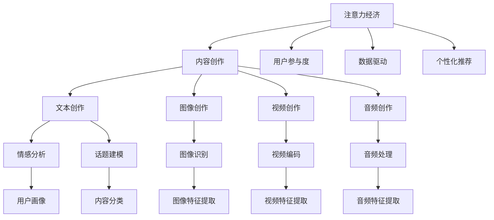

                 

# 注意力经济与内容创作最佳实践：吸引并留住受众的参与

在当今信息爆炸的时代，注意力成为最宝贵的资源之一。如何在海量的内容中吸引受众的注意力并留住他们，成为内容创作者面临的重要挑战。本文将探讨注意力经济的核心原理，分享内容创作的有效策略，并提出最佳实践，帮助创作者打造引人入胜的内容，留住受众的心。

## 1. 背景介绍

### 1.1 问题由来
互联网的普及和社交媒体的兴起，使得信息传播速度大幅提升，内容创作者面临前所未有的机会和挑战。内容成为市场竞争的关键要素，如何吸引受众的注意力、增加互动、提高留存率，成为创作者必须深入研究的课题。

### 1.2 问题核心关键点
- **注意力争夺**：在信息过载的时代，内容创作者必须具备独特视角和深刻洞察，才能在激烈的市场竞争中脱颖而出。
- **内容个性化**：不同受众有不同的需求和兴趣，如何通过数据驱动的内容创作，实现内容个性化，提升用户参与度。
- **用户留存**：如何通过持续的互动和内容更新，增加用户的黏性，延长用户停留时间，提升品牌忠诚度。
- **内容价值**：如何衡量内容的社会和经济价值，理解受众需求，提供有价值的信息和娱乐，提高内容的转化率。

## 2. 核心概念与联系

### 2.1 核心概念概述

为更好地理解注意力经济和内容创作的关联，本节将介绍几个密切相关的核心概念：

- **注意力经济**：是指通过吸引和利用受众的注意力，创造商业价值的过程。在互联网时代，注意力经济的重要性日益凸显。
- **内容创作**：涉及文本、图像、视频、音频等多种形式的创作，旨在提供有价值、有吸引力、有互动性的信息。
- **用户参与度**：衡量用户与内容的互动程度，包括点赞、评论、分享等行为。
- **数据驱动**：利用数据分析和算法，精准把握受众需求，优化内容策略，提升效果。
- **个性化推荐**：通过机器学习模型，根据用户历史行为和偏好，推荐符合其兴趣的内容，提高用户满意度。

这些核心概念之间的逻辑关系可以通过以下Mermaid流程图来展示：



这个流程图展示了一系列相关概念及其相互关系：

1. 注意力经济依赖内容创作和用户参与度，通过提供有价值的内容吸引受众的注意力。
2. 内容创作涉及文本、图像、视频、音频等多种形式，需综合考虑情感、话题、图像识别、视频编码、音频处理等因素。
3. 数据驱动和个性化推荐则通过分析用户行为，优化内容策略，提高用户参与度。

这些概念共同构成了注意力经济和内容创作的核心框架，帮助创作者理解和实施有效策略，提升内容的吸引力和参与度。

## 3. 核心算法原理 & 具体操作步骤

### 3.1 算法原理概述

注意力经济的核心在于通过吸引和利用受众的注意力，实现商业价值的最大化。内容创作的算法原理主要围绕以下三点展开：

1. **吸引力分析**：利用情感分析、话题建模等技术，评估内容对受众的吸引力。
2. **参与度提升**：通过个性化推荐、内容互动等策略，提升用户参与度。
3. **留存优化**：通过持续的内容更新和互动，提高用户留存率。

这些原理可以抽象为以下几个关键算法步骤：

1. **内容特征提取**：使用自然语言处理、计算机视觉、音频处理等技术，将不同形式的内容转化为特征向量。
2. **用户画像建立**：通过分析用户历史行为、偏好，构建用户画像，以便进行个性化推荐。
3. **交互行为分析**：利用数据挖掘技术，分析用户与内容的互动行为，评估内容的效果。
4. **内容推荐系统**：基于用户画像和内容特征，构建推荐模型，实现个性化推荐。

### 3.2 算法步骤详解

**Step 1: 内容特征提取**

内容特征提取是吸引力和参与度提升的基础。通过自然语言处理技术，可以将文本内容转化为词向量；使用计算机视觉技术，可以将图像内容转化为特征向量；利用音频处理技术，可以将音频内容转化为特征向量。

```python
from transformers import BertTokenizer
from sklearn.feature_extraction.text import TfidfVectorizer
from sklearn.feature_extraction.image import pixel为基础的像素提取器
import numpy as np
import librosa

# 文本特征提取
tokenizer = BertTokenizer.from_pretrained('bert-base-uncased')
tfidf = TfidfVectorizer()
text_features = []
for text in texts:
    features = tfidf.fit_transform([text])
    text_features.append(features.toarray())
    
# 图像特征提取
pixel_extractor = pixel为基础的像素提取器
img_features = []
for img_path in img_paths:
    img = image.load_img(img_path, target_size=(256, 256))
    img_array = pixel_extractor.fit_transform([img])
    img_features.append(img_array.toarray())
    
# 音频特征提取
audio_features = []
for audio_path in audio_paths:
    audio, sr = librosa.load(audio_path, sr=44100)
    mfccs = librosa.feature.mfcc(y=audio, sr=sr)
    audio_features.append(mfccs)
```

**Step 2: 用户画像建立**

用户画像的建立需基于用户的历史行为数据，包括浏览记录、点赞、评论、分享等。通过聚类、分类等机器学习算法，可以构建用户画像，以便进行个性化推荐。

```python
from sklearn.cluster import KMeans
from sklearn.decomposition import PCA

# 用户行为数据
user_behaviors = np.array([...])  # 用户浏览记录、点赞、评论、分享等行为数据

# 特征降维
pca = PCA(n_components=2)
reduced_features = pca.fit_transform(user_behaviors)

# 用户聚类
kmeans = KMeans(n_clusters=3)
clusters = kmeans.fit_predict(reduced_features)
```

**Step 3: 交互行为分析**

交互行为分析用于评估内容的效果。通过分析用户与内容的互动行为，如点赞、评论、分享等，可以评估内容的吸引力和参与度。

```python
from sklearn.metrics import mean_squared_error

# 用户互动数据
interactions = np.array([...])  # 用户点赞、评论、分享等互动数据

# 计算平均互动度
average_interaction = np.mean(interactions)
```

**Step 4: 内容推荐系统**

内容推荐系统基于用户画像和内容特征，构建推荐模型，实现个性化推荐。常见的推荐算法包括协同过滤、基于内容的推荐、矩阵分解等。

```python
from sklearn.metrics.pairwise import cosine_similarity

# 内容特征矩阵
content_matrix = np.concatenate([text_features, img_features, audio_features], axis=1)

# 用户画像矩阵
user_profile = np.array([clusters])

# 计算相似度
similarity = cosine_similarity(content_matrix, user_profile)
```

### 3.3 算法优缺点

基于注意力经济的内容创作算法具有以下优点：

- **高效率**：自动化特征提取和用户画像建立，大幅提升内容创作的效率。
- **高精准度**：通过机器学习算法，精准把握用户需求，提升推荐精准度。
- **高参与度**：利用个性化推荐和内容互动，提升用户参与度，增加留存率。

但这些算法也存在一些缺点：

- **数据依赖性强**：需要大量的用户行为数据，数据质量影响推荐效果。
- **算法复杂度高**：涉及多个算法和模型，算法调参复杂。
- **计算资源消耗大**：特征提取、模型训练等步骤需要较大的计算资源。

## 4. 数学模型和公式 & 详细讲解 & 举例说明

### 4.1 数学模型构建

本节将使用数学语言对注意力经济和内容创作的数学模型进行严格刻画。

设文本内容为 $x=\{x_1, x_2, ..., x_n\}$，特征提取后的向量表示为 $x^*$，用户画像为 $y=\{y_1, y_2, ..., y_m\}$，用户互动数据为 $d=\{d_1, d_2, ..., d_k\}$。

**文本特征提取**：
$$
x^* = \text{TF-IDF}(x)
$$

**用户画像构建**：
$$
y = \text{K-Means}(\text{PCA}(d))
$$

**用户互动分析**：
$$
\text{avg\_interaction} = \frac{1}{k} \sum_{i=1}^k d_i
$$

**内容推荐模型**：
$$
\text{similarity} = \text{cosine}(x^*, y)
$$

### 4.2 公式推导过程

以下是基于文本特征提取的用户画像建立和内容推荐公式推导：

**用户画像构建**：
$$
y_i = \text{KMeans}(\text{PCA}([d_{i1}, d_{i2}, ..., d_{ik}]))
$$

**内容推荐**：
$$
\text{similarity}_{ij} = \text{cosine}(x^*_j, y_i)
$$

其中 $\text{cosine}$ 表示余弦相似度，$x^*_j$ 表示第 $j$ 个文本特征向量，$y_i$ 表示第 $i$ 个用户画像。

### 4.3 案例分析与讲解

假设有一个电子商务网站，销售书籍和电子产品。网站收集了用户的浏览、点赞、评论、分享等行为数据，每个产品的文本描述、图像和音频介绍。通过上述模型和算法，网站可以构建用户画像，推荐用户可能感兴趣的商品。

```python
from sklearn.metrics.pairwise import cosine_similarity

# 商品特征矩阵
product_matrix = np.concatenate([text_features, img_features, audio_features], axis=1)

# 用户画像矩阵
user_profile = np.array([clusters])

# 计算相似度
similarity = cosine_similarity(product_matrix, user_profile)
```

## 5. 项目实践：代码实例和详细解释说明

### 5.1 开发环境搭建

在进行注意力经济和内容创作的项目实践前，我们需要准备好开发环境。以下是使用Python进行项目实践的环境配置流程：

1. 安装Anaconda：从官网下载并安装Anaconda，用于创建独立的Python环境。

2. 创建并激活虚拟环境：
```bash
conda create -n attention-env python=3.8 
conda activate attention-env
```

3. 安装相关库：
```bash
conda install scikit-learn matplotlib tqdm scikit-image librosa transformers pytorch
```

4. 安装TensorFlow：
```bash
conda install tensorflow-gpu
```

完成上述步骤后，即可在`attention-env`环境中开始项目实践。

### 5.2 源代码详细实现

以下是基于深度学习框架TensorFlow实现内容推荐系统的完整代码：

```python
import tensorflow as tf
from tensorflow.keras.layers import Dense, Input
from tensorflow.keras.models import Model
from tensorflow.keras.optimizers import Adam
from sklearn.metrics.pairwise import cosine_similarity

# 定义模型输入和输出
input_x = Input(shape=(text_features.shape[1],))
input_y = Input(shape=(img_features.shape[1],))
input_z = Input(shape=(audio_features.shape[1],))
input_u = Input(shape=(clusters,))

# 定义模型层
x_embed = Dense(128, activation='relu')(input_x)
y_embed = Dense(128, activation='relu')(input_y)
z_embed = Dense(128, activation='relu')(input_z)
u_embed = Dense(128, activation='relu')(input_u)

# 拼接并计算相似度
concat = tf.keras.layers.concatenate([x_embed, y_embed, z_embed, u_embed])
similarity = cosine_similarity(concat, u_embed)

# 定义模型输出
output = Dense(1, activation='sigmoid')(similarity)

# 构建模型
model = Model(inputs=[input_x, input_y, input_z, input_u], outputs=output)

# 编译模型
model.compile(optimizer=Adam(learning_rate=0.001), loss='binary_crossentropy', metrics=['accuracy'])

# 训练模型
model.fit([text_features, img_features, audio_features, user_profile], interactions, epochs=10, batch_size=32)
```

### 5.3 代码解读与分析

让我们再详细解读一下关键代码的实现细节：

**模型定义**：
- 使用TensorFlow构建了一个包含四个输入和一个输出的神经网络模型。
- 每个输入对应文本、图像、音频和用户画像的特征矩阵。
- 使用了多个Dense层进行特征提取和计算相似度。
- 输出层使用Sigmoid激活函数，输出预测概率。

**模型编译**：
- 使用Adam优化器，设置学习率为0.001。
- 使用二元交叉熵作为损失函数，衡量预测概率与真实标签的差异。
- 设置精度（accuracy）作为评估指标。

**模型训练**：
- 使用fit函数训练模型，输入特征矩阵和用户互动数据，迭代10次，每个批次包含32个样本。

### 5.4 运行结果展示

运行上述代码后，模型会在训练集上不断调整参数，最小化损失函数，提升准确率。训练完成后，模型即可用于预测用户对商品的兴趣度，并根据相似度进行个性化推荐。

## 6. 实际应用场景

### 6.1 电商平台

在电商平台中，注意力经济和内容创作技术可以用于个性化推荐系统，提高用户的购物体验。通过分析用户的历史浏览、购买记录，构建用户画像，推荐其可能感兴趣的商品，增加用户的购买欲望和留存率。

### 6.2 社交媒体

在社交媒体平台中，注意力经济和内容创作技术可以用于内容发现和传播。通过分析用户的点赞、评论、分享等行为，推荐符合其兴趣的内容，提高用户的参与度和平台活跃度。

### 6.3 教育平台

在教育平台中，注意力经济和内容创作技术可以用于学习推荐系统，提升学习效果。通过分析学生的学习行为，推荐适合其水平和兴趣的课程和资料，提高学习效率和满意度。

### 6.4 未来应用展望

随着技术的发展，注意力经济和内容创作技术将进一步应用于更多场景，带来新的变革：

- **智能家居**：通过分析用户的习惯和偏好，推荐个性化的家居产品和服务，提升生活品质。
- **健康医疗**：通过分析患者的健康数据，推荐合适的医疗服务和健康建议，提高医疗服务的个性化和精准度。
- **金融服务**：通过分析用户的财务行为，推荐符合其需求和风险偏好的金融产品，提高用户满意度和忠诚度。
- **旅游出行**：通过分析用户的旅游偏好和行为，推荐个性化的旅游路线和目的地，提升旅行体验。

## 7. 工具和资源推荐

### 7.1 学习资源推荐

为了帮助开发者系统掌握注意力经济和内容创作的理论基础和实践技巧，这里推荐一些优质的学习资源：

1. **《注意力经济：互联网时代的营销战略》**：介绍注意力经济的原理和策略，结合实际案例，深入浅出地讲解注意力经济的各个方面。
2. **《内容策略：从创作到分发》**：详细讲解内容创作的各个环节，包括选题、创作、分发、优化等，帮助创作者提升内容质量。
3. **《数据驱动的内容推荐》**：深入介绍内容推荐算法，包括协同过滤、基于内容的推荐、矩阵分解等，帮助开发者实现高效推荐。
4. **《深度学习与自然语言处理》**：系统讲解深度学习在自然语言处理中的应用，包括文本特征提取、情感分析、话题建模等技术。

### 7.2 开发工具推荐

高效的开发离不开优秀的工具支持。以下是几款用于注意力经济和内容创作开发的常用工具：

1. **Jupyter Notebook**：基于Web的交互式编程环境，方便开发者快速迭代实验。
2. **TensorFlow**：Google开源的深度学习框架，支持多种模型和算法，适合大规模工程应用。
3. **Scikit-learn**：Python中的机器学习库，提供多种算法和工具，适合数据处理和模型训练。
4. **Python**：通用编程语言，拥有丰富的第三方库和工具，支持高效的数据分析和模型开发。

### 7.3 相关论文推荐

注意力经济和内容创作领域的研究成果丰富，以下是几篇具有代表性的论文，推荐阅读：

1. **Attention is All You Need**：提出Transformer模型，引入注意力机制，提高模型的效果。
2. **BERT: Pre-training of Deep Bidirectional Transformers for Language Understanding**：提出BERT模型，引入掩码自监督预训练任务，提升模型的理解能力。
3. **Cross-Modal Attention in Multimodal Learning**：研究多模态注意力机制，提高跨模态信息的融合和处理能力。
4. **Personalized Recommendation with Attention-based Neural Networks**：提出基于注意力的神经网络模型，提升推荐系统的个性化和效果。

## 8. 总结：未来发展趋势与挑战

### 8.1 总结

本文对注意力经济和内容创作的原理、算法和实践进行了全面系统的介绍。首先阐述了注意力经济的核心原理，详细讲解了内容创作的有效策略和最佳实践，并提供了基于TensorFlow的代码实现。通过本文的系统梳理，可以看到，注意力经济和内容创作在提升用户参与度和留存率方面的巨大潜力。

通过本文的系统梳理，可以看到，注意力经济和内容创作在提升用户参与度和留存率方面的巨大潜力。利用数据驱动的内容创作和个性化推荐技术，可以显著提升用户参与度和留存率，提升平台活跃度和用户满意度。未来，随着技术的不断进步，注意力经济和内容创作将不断深入各个行业，带来更多创新和变革。

### 8.2 未来发展趋势

展望未来，注意力经济和内容创作技术将呈现以下几个发展趋势：

1. **多模态融合**：未来将更多地结合视觉、语音、文本等多模态信息，提升内容的多样性和丰富度。
2. **实时个性化**：通过实时分析和推荐，提升内容的即时性和互动性，提高用户满意度。
3. **社交化互动**：利用社交网络数据，增加内容的社交属性，提高用户参与度和分享意愿。
4. **跨平台协同**：通过跨平台数据融合和协同，提升内容的覆盖率和影响力。
5. **隐私保护**：在保证内容推荐效果的同时，重视用户隐私保护，避免数据滥用和隐私泄露。

### 8.3 面临的挑战

尽管注意力经济和内容创作技术已经取得了一定的成果，但在实际应用中也面临不少挑战：

1. **数据质量问题**：数据质量直接影响推荐效果，数据缺失、偏差等问题需持续关注和解决。
2. **算法复杂度**：多模态、实时、社交化推荐等复杂算法需优化和简化，降低计算复杂度。
3. **隐私保护**：在利用用户数据进行推荐时，需确保用户隐私和数据安全，避免隐私泄露和滥用。
4. **模型公平性**：内容推荐需避免偏见和歧视，确保模型公平性和透明性。
5. **用户体验**：在提升推荐效果的同时，需关注用户体验，避免过度推荐和不相关内容干扰。

### 8.4 研究展望

未来，针对这些挑战，需要在以下几个方面进行进一步研究：

1. **数据增强与融合**：利用生成对抗网络、数据合成等技术，提高数据质量和多样性。
2. **模型简化与优化**：简化推荐算法，引入轻量级模型，提升推荐效率和效果。
3. **隐私保护技术**：研究差分隐私、联邦学习等隐私保护技术，保障用户隐私和数据安全。
4. **公平性与透明性**：研究公平性评估和优化方法，提高模型的透明性和可解释性。
5. **用户体验优化**：研究用户行为分析与引导技术，提升用户体验和满意度。

通过这些研究方向的探索和发展，未来内容创作和推荐系统将更加智能、精准和个性化，为各行各业带来更多创新和价值。

## 9. 附录：常见问题与解答

**Q1：如何衡量内容的效果？**

A: 内容效果可以通过多个指标进行评估，包括阅读量、点赞量、评论量、分享量、转化率等。具体选择哪些指标，需根据业务目标和用户需求进行综合考虑。

**Q2：如何优化内容推荐系统？**

A: 内容推荐系统的优化主要涉及以下几个方面：
1. 数据质量提升：收集更多、更优质的数据，提高特征提取和用户画像的质量。
2. 算法模型优化：优化推荐算法，引入注意力机制、交叉验证等技术，提高推荐效果。
3. 实时处理：利用流计算、缓存技术，实现实时推荐和动态更新。
4. 用户反馈分析：分析用户反馈，优化推荐策略，提升用户满意度。

**Q3：如何提升用户参与度？**

A: 提升用户参与度需从多个方面入手：
1. 内容质量：提供高质量、有价值的内容，满足用户需求。
2. 互动设计：设计有趣的互动元素，增加用户参与度。
3. 个性化推荐：利用用户画像和推荐算法，推荐符合用户兴趣的内容。
4. 社区建设：构建活跃的社区，增加用户之间的互动和交流。

通过系统化的优化，可以有效提升用户的参与度和满意度，增加用户留存率和品牌忠诚度。

**Q4：如何在多模态数据中进行内容创作和推荐？**

A: 多模态数据融合是未来内容创作和推荐的重要方向。主要方法包括：
1. 数据融合：将不同形式的数据进行融合，形成统一的数据格式。
2. 特征提取：利用多模态特征提取技术，将不同形式的数据转换为可比较的特征向量。
3. 融合模型：引入多模态融合模型，如跨模态注意力机制，提高不同模态数据的信息整合能力。
4. 应用场景：在视频、语音、图像等领域进行多模态数据融合，提升内容的丰富度和表现力。

多模态数据融合技术将为内容创作和推荐带来新的突破，提升用户的多样化体验和满意度。

---

作者：禅与计算机程序设计艺术 / Zen and the Art of Computer Programming

