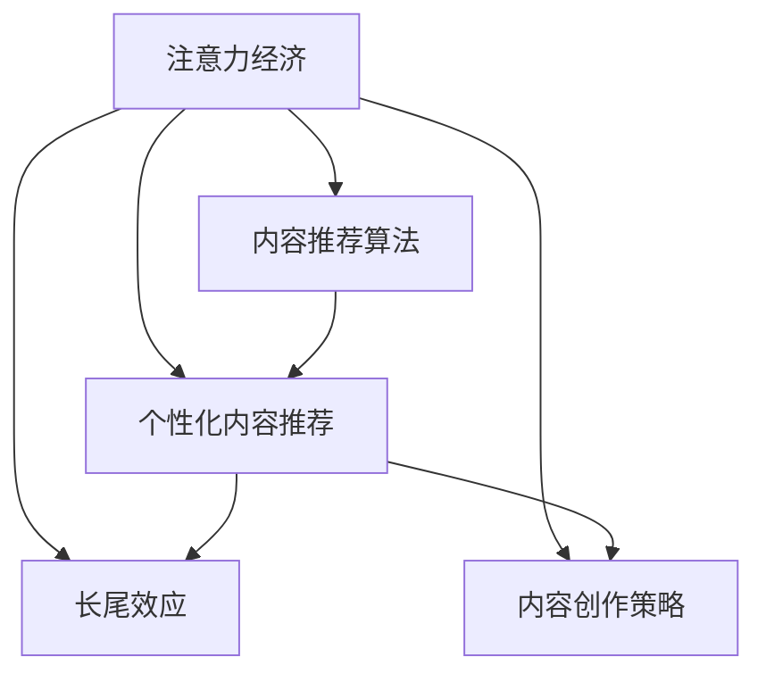

                 

# 注意力经济与内容创作策略：吸引并留住受众的参与

> 关键词：注意力经济,内容创作,受众参与,参与经济学,内容推荐算法

## 1. 背景介绍

### 1.1 问题由来
在数字化时代，信息爆炸和注意力稀缺成为不争的事实。如何在海量内容中吸引并留住受众的注意力，成为数字媒体平台和内容创作者必须面对的重要挑战。这一现象被学者们称为“注意力经济”。

注意力经济指在数字化和信息化的背景下，经济活动以争夺注意力为基本特征，通过满足受众的注意力需求来获得商业价值。内容创作者和平台运营商需要通过各种手段吸引受众，维持其注意力，从而实现内容的商业变现。

### 1.2 问题核心关键点
- **注意力获取与维持**：如何设计吸引受众注意力的内容策略，并维持其持续关注。
- **参与度与互动性**：通过互动性强的设计和机制，增强受众的参与度和粘性。
- **个性化推荐**：构建个性化推荐算法，针对不同用户推荐相关内容，提高内容的吸引力。
- **长尾效应与内容多元化**：发掘长尾内容，提供多元化的内容形式，满足受众多样化的需求。

### 1.3 问题研究意义
理解注意力经济和内容创作策略，对数字媒体平台的内容运营和内容创作者的决策具有重要意义：

1. **优化内容分发**：通过个性化推荐和内容多样化策略，提升用户满意度，优化内容分发策略。
2. **提升商业价值**：通过有效吸引和维持受众注意力，最大化内容的商业价值。
3. **增强用户参与度**：通过互动性设计和反馈机制，增强用户的参与度和忠诚度。
4. **应对长尾需求**：发掘并推广长尾内容，满足小众但具有潜力的需求。
5. **打造特色内容生态**：构建多元化的内容生态，为受众提供丰富的价值体验。

## 2. 核心概念与联系

### 2.1 核心概念概述

为更好地理解注意力经济和内容创作策略，本节将介绍几个密切相关的核心概念：

- **注意力经济**：在数字化和信息化的背景下，经济活动以争夺注意力为基本特征，通过满足受众的注意力需求来获得商业价值。
- **内容推荐算法**：根据用户的历史行为和偏好，推荐其可能感兴趣的内容，以提升用户满意度。
- **个性化内容推荐**：通过用户的个性化特征和行为数据，推荐符合其需求的内容，提高内容的吸引力。
- **长尾效应**：指在数字媒体平台中，大量不主流但具有一定受众基础的内容，随着技术的发展和受众需求的日益多样化，逐渐显现其商业价值。
- **内容创作策略**：指内容创作者通过有针对性的内容设计和互动机制，吸引和留住受众注意力，提高内容的参与度和商业价值。

这些概念之间的逻辑关系可以通过以下Mermaid流程图来展示：



这个流程图展示了几大核心概念的相互关系：

1. 注意力经济为内容推荐和内容创作提供了市场基础。
2. 内容推荐算法通过个性化的方式，提高内容的吸引力。
3. 长尾效应通过挖掘潜在的内容需求，丰富内容的生态。
4. 内容创作策略通过设计互动性强的内容，增强受众的参与度。

这些概念共同构成了注意力经济和内容创作策略的理论基础，为设计有效的注意力获取与维持机制提供了指导。

## 3. 核心算法原理 & 具体操作步骤
### 3.1 算法原理概述

基于注意力经济的内容创作策略，本质上是一个个性化推荐和内容优化的过程。其核心思想是：通过分析用户的行为数据和偏好，设计并优化内容，以最大化吸引和维持受众的注意力。

形式化地，假设平台上有用户集合 $U=\{u_1,u_2,\dots,u_N\}$，每个用户 $u_i$ 的注意力消耗率为 $\alpha_i$，内容集合 $C=\{c_1,c_2,\dots,c_M\}$。内容创作的目标是最大化总注意力价值：

$$
\max \sum_{u \in U} \sum_{c \in C} \alpha_u c
$$

其中 $\alpha_u$ 表示用户 $u$ 对内容 $c$ 的注意力消耗率，可以理解为用户对内容的兴趣和消耗精力的比率。

为实现这一目标，平台通常采用以下步骤：

1. 收集用户行为数据，如浏览历史、点赞、评论等。
2. 通过推荐算法计算用户对各类内容的兴趣评分。
3. 基于兴趣评分排序，向用户推荐感兴趣的内容。
4. 根据用户反馈（如点击、停留时间等），调整推荐策略，进一步优化内容策略。

### 3.2 算法步骤详解

基于注意力经济的内容创作策略，可以概括为以下几个关键步骤：

**Step 1: 数据收集与预处理**
- 收集用户的各类行为数据，如浏览历史、点赞、评论等。
- 对数据进行清洗和预处理，去除异常值和噪声，确保数据的准确性和一致性。

**Step 2: 特征提取与表示**
- 从收集的数据中提取特征，如用户特征（年龄、性别、地域）、内容特征（关键词、类别）等。
- 对特征进行编码和表示，转换为模型能够处理的数值形式。

**Step 3: 用户行为建模**
- 使用机器学习模型（如协同过滤、决策树、随机森林等）对用户行为进行建模，预测用户对内容的兴趣评分。
- 引入深度学习模型（如CNN、RNN、Transformer等），更准确地捕捉用户行为中的复杂模式和关系。

**Step 4: 个性化内容推荐**
- 根据用户兴趣评分，排序推荐内容，优先推荐用户最感兴趣的内容。
- 使用多臂老虎机（Multi-armed Bandit）算法，动态调整推荐策略，提高推荐的效率和准确性。

**Step 5: 实时反馈与调整**
- 根据用户的实时反馈（如点击、停留时间等），动态调整推荐算法和内容策略。
- 引入强化学习（Reinforcement Learning, RL）框架，通过持续优化推荐策略，逐步提高用户的满意度。

### 3.3 算法优缺点

基于注意力经济的内容创作策略具有以下优点：
1. 提升用户满意度：通过个性化推荐和互动性设计，满足用户的多样化需求，提升用户的满意度。
2. 优化资源利用：通过用户行为分析，优化内容的推荐策略，提高资源的利用效率。
3. 增强参与度：通过互动性和反馈机制，增强用户的参与度和粘性。
4. 提升商业价值：通过有效的注意力获取和维持，最大化内容的商业价值。

同时，该策略也存在以下局限性：
1. 数据依赖性高：个性化推荐依赖大量的用户行为数据，数据获取和处理成本较高。
2. 用户隐私风险：收集用户行为数据可能侵犯用户隐私，需要严格的数据保护措施。
3. 算法复杂性高：需要设计复杂的机器学习模型和推荐算法，对技术和资源要求较高。
4. 模型泛化能力有限：推荐模型可能过拟合用户的历史行为，对新内容的推荐效果不佳。
5. 长尾效应不确定：难以准确预测长尾内容的需求，可能导致资源浪费。

尽管存在这些局限性，但就目前而言，基于注意力经济的内容创作策略仍是最主流的内容运营范式。未来相关研究的重点在于如何进一步降低数据依赖，提高模型的泛化能力，同时兼顾隐私保护和资源效率。

### 3.4 算法应用领域

基于注意力经济的内容创作策略，已经在多个领域得到了广泛应用，例如：

- 社交媒体：通过个性化推荐和互动性设计，增强用户的粘性和参与度，如Facebook、Twitter等。
- 视频网站：通过智能推荐和互动视频设计，提升用户观看体验，如YouTube、Netflix等。
- 新闻平台：通过个性化推荐和内容聚合，提高用户阅读兴趣，如今日头条、澎湃新闻等。
- 电子商务：通过个性化推荐和动态定价，提升用户的购买转化率，如亚马逊、京东等。
- 音乐流媒体：通过个性化推荐和智能播放列表，优化用户的听歌体验，如Spotify、QQ音乐等。

除了上述这些经典应用外，基于注意力经济的内容创作策略也被创新性地应用到更多场景中，如内容推送、广告投放、游戏设计等，为数字内容产业带来了新的突破。

## 4. 数学模型和公式 & 详细讲解 & 举例说明
### 4.1 数学模型构建

本节将使用数学语言对基于注意力经济的内容创作策略进行更加严格的刻画。

假设平台上有用户集合 $U=\{u_1,u_2,\dots,u_N\}$，每个用户 $u_i$ 的注意力消耗率为 $\alpha_i$，内容集合 $C=\{c_1,c_2,\dots,c_M\}$。内容创作的目标是最大化总注意力价值：

$$
\max \sum_{u \in U} \sum_{c \in C} \alpha_u c
$$

在实践中，我们通常使用基于梯度的优化算法（如SGD、Adam等）来近似求解上述最优化问题。设 $\eta$ 为学习率，$\lambda$ 为正则化系数，则参数的更新公式为：

$$
\theta \leftarrow \theta - \eta \nabla_{\theta}\mathcal{L}(\theta) - \eta\lambda\theta
$$

其中 $\nabla_{\theta}\mathcal{L}(\theta)$ 为损失函数对参数 $\theta$ 的梯度，可通过反向传播算法高效计算。

### 4.2 公式推导过程

以下我们以协同过滤（Collaborative Filtering）为例，推导推荐算法中的用户兴趣评分函数及其梯度的计算公式。

假设平台收集到用户 $u$ 对内容 $c$ 的评分 $r_{uc}$，记为二元组 $(r_{uc}, u, c)$。协同过滤算法通过用户 $u$ 的历史评分数据和用户 $u'$ 的评分数据，计算用户 $u$ 对内容 $c$ 的兴趣评分 $\hat{r}_{uc}$。

协同过滤算法的用户兴趣评分函数为：

$$
\hat{r}_{uc} = \alpha_{u}\sum_{u' \in U} r_{u'c} \frac{\alpha_{u'}}{\alpha_{u'}} \frac{\alpha_{u'c}}{\alpha_{u'c}}
$$

其中 $\alpha_{u'}$ 为用户的平均注意力消耗率，$\alpha_{u'c}$ 为内容的平均注意力消耗率。

用户 $u$ 对内容 $c$ 的梯度计算公式为：

$$
\nabla_{r_{uc}}\mathcal{L}(\theta) = \nabla_{r_{uc}}\left( \sum_{u \in U} \sum_{c \in C} \alpha_u c \right) = \alpha_u \frac{\partial \hat{r}_{uc}}{\partial r_{uc}}
$$

通过链式法则，我们可以得到用户兴趣评分函数对用户行为评分 $r_{uc}$ 的梯度。这个梯度可以用于更新用户行为评分数据，优化推荐算法。

### 4.3 案例分析与讲解

在实际应用中，协同过滤推荐算法被广泛应用于电商网站的商品推荐、新闻平台的文章推荐等场景。以下以电商推荐系统为例，给出推荐算法的具体实现。

假设电商平台收集到用户 $u$ 的历史行为数据 $R_{u}$，内容集合 $C$ 中的商品 $c$ 的评分 $R_{uc}$。平台使用协同过滤算法对用户 $u$ 推荐商品 $c$，实现流程如下：

1. 计算用户 $u$ 对商品 $c$ 的预测评分 $\hat{r}_{uc}$，公式如下：

$$
\hat{r}_{uc} = \alpha_{u}\sum_{u' \in U} r_{u'c} \frac{\alpha_{u'}}{\alpha_{u'}} \frac{\alpha_{u'c}}{\alpha_{u'c}}
$$

2. 排序推荐商品 $c$，将评分 $\hat{r}_{uc}$ 从高到低排序，优先推荐评分高的商品。

3. 根据用户点击、购买等反馈数据，调整推荐策略，更新用户行为数据。

在推荐系统中，协同过滤算法通过用户行为数据的聚合和分析，生成个性化推荐列表，提升用户的满意度。由于协同过滤算法依赖大量的用户行为数据，因此需要设计有效的数据收集和处理策略，保证数据的质量和完整性。

## 5. 项目实践：代码实例和详细解释说明
### 5.1 开发环境搭建

在进行推荐系统实践前，我们需要准备好开发环境。以下是使用Python进行Scikit-learn开发的环境配置流程：

1. 安装Anaconda：从官网下载并安装Anaconda，用于创建独立的Python环境。

2. 创建并激活虚拟环境：
```bash
conda create -n recommendation-env python=3.8 
conda activate recommendation-env
```

3. 安装Scikit-learn：
```bash
pip install scikit-learn
```

4. 安装各类工具包：
```bash
pip install numpy pandas scikit-learn matplotlib tqdm jupyter notebook ipython
```

完成上述步骤后，即可在`recommendation-env`环境中开始推荐系统开发。

### 5.2 源代码详细实现

下面我们以协同过滤推荐算法为例，给出使用Scikit-learn进行推荐系统开发的PyTorch代码实现。

首先，定义数据处理函数：

```python
from sklearn.metrics.pairwise import cosine_similarity
import numpy as np

def process_data(X, y):
    # 将稀疏矩阵转换为numpy数组
    X = X.todense()
    y = y.todense()
    
    # 计算cosine相似度
    similarity = cosine_similarity(X, y)
    
    return similarity
```

然后，定义推荐函数：

```python
from scipy.sparse import csr_matrix
import numpy as np

def collaborative_filtering(similarity, X, K):
    N, M = X.shape
    
    # 计算用户对商品评分的预测
    X_pred = np.dot(similarity, X)
    X_pred = np.diag(X_pred)
    
    # 标准化预测评分
    X_pred /= np.linalg.norm(X_pred, axis=0)
    
    # 排序推荐商品
    index = np.argsort(X_pred, axis=0)[::-1]
    
    return index
```

接着，定义评估函数：

```python
from sklearn.metrics.pairwise import cosine_similarity
import numpy as np

def evaluate(model, X, y, topk):
    N, M = X.shape
    predicted_index = model(X)
    
    # 计算推荐商品的准确率
    acc = 0
    for i in range(N):
        topk_index = predicted_index[i][0:topk]
        for j in topk_index:
            if y[i][j] == 1:
                acc += 1
    
    return acc / N
```

最后，启动推荐流程并在测试集上评估：

```python
from sklearn.datasets import make_blobs
from sklearn.model_selection import train_test_split

# 生成随机数据
X, y = make_blobs(n_samples=100, centers=5, n_features=10, random_state=42)

# 将数据转化为稀疏矩阵
X = csr_matrix(X)

# 将标签转化为稀疏矩阵
y = csr_matrix(y)

# 数据划分
X_train, X_test, y_train, y_test = train_test_split(X, y, test_size=0.2, random_state=42)

# 计算用户行为数据与内容的相似度
similarity = process_data(X_train, y_train)

# 使用协同过滤算法推荐商品
topk = 5
predicted_index = collaborative_filtering(similarity, X_test, topk)

# 评估推荐系统的准确率
print("Accuracy:", evaluate(predicted_index, X_test, y_test, topk))
```

以上就是使用Scikit-learn进行协同过滤推荐系统的完整代码实现。可以看到，Scikit-learn提供的函数和方法，可以高效地实现协同过滤算法，进行推荐系统开发。

### 5.3 代码解读与分析

让我们再详细解读一下关键代码的实现细节：

**process_data函数**：
- 将稀疏矩阵转化为numpy数组，计算cosine相似度。

**collaborative_filtering函数**：
- 计算用户对商品评分的预测，排序推荐商品。

**evaluate函数**：
- 根据推荐结果和实际标签，计算推荐系统的准确率。

**推荐流程**：
- 生成随机数据，转换为稀疏矩阵。
- 划分训练集和测试集。
- 计算训练集和标签的相似度。
- 使用协同过滤算法推荐商品。
- 评估推荐系统的准确率。

可以看到，Scikit-learn提供了丰富高效的机器学习工具，使得推荐系统的实现变得简洁高效。开发者可以将更多精力放在数据处理、模型改进等高层逻辑上，而不必过多关注底层的实现细节。

当然，工业级的系统实现还需考虑更多因素，如模型的保存和部署、超参数的自动搜索、更灵活的任务适配层等。但核心的推荐范式基本与此类似。

## 6. 实际应用场景
### 6.1 智能推荐系统

基于协同过滤等推荐算法，智能推荐系统已经在电商、新闻、视频等多个领域得到了广泛应用。通过收集用户的浏览、购买、评分等行为数据，智能推荐系统能够预测用户的兴趣，并实时推送相关内容，提升用户的满意度和忠诚度。

在电商领域，推荐系统可以根据用户的浏览历史和购买记录，推荐符合其喜好的商品，提高用户的购物体验和转化率。在新闻领域，推荐系统可以根据用户的阅读偏好，推荐相关文章和视频，增加用户停留时间和互动率。在视频平台，推荐系统可以根据用户的观看记录和评分数据，推荐感兴趣的影视作品，提升用户观看体验和平台粘性。

### 6.2 个性化内容创作

基于注意力经济的推荐算法，个性化内容创作可以广泛应用于新闻、娱乐、教育等多个领域。通过深入分析用户行为数据，创作者可以设计出更具吸引力的内容，满足用户的多样化需求。

在新闻领域，创作者可以通过推荐算法分析用户的阅读偏好，设计出用户感兴趣的新闻标题和内容。在娱乐领域，创作者可以根据用户的观看历史和评分数据，创作符合用户喜好的影视作品和音乐作品。在教育领域，创作者可以根据学生的学习行为数据，设计个性化的学习内容和课程，提高学生的学习效果和满意度。

### 6.3 社交网络

基于注意力经济的推荐算法，社交网络可以为用户提供更加精准的信息推荐。通过分析用户的互动行为和社交网络关系，社交网络平台能够推荐符合用户兴趣的帖子、视频和话题，提高用户的活跃度和参与度。

在社交网络平台，推荐算法可以推荐用户感兴趣的朋友动态、话题和群组，提升用户的社交体验和信息获取效率。通过社交网络关系和行为数据的分析，推荐算法还可以推荐相似用户的内容，扩大用户的社交圈。社交网络平台还可以通过推荐算法，解决用户发现新内容的问题，增强平台的活力和创新性。

### 6.4 未来应用展望

随着推荐算法和个性化设计的不断进步，基于注意力经济的内容创作策略将进一步拓展其应用边界，为数字内容产业带来新的突破。

在智慧医疗领域，基于推荐算法的内容创作可以应用于疾病知识普及、健康咨询服务等领域，提升公众的健康意识和医疗水平。在智能交通领域，推荐算法可以应用于交通路况预测、出行路线推荐等领域，提高交通系统的效率和用户体验。在智能制造领域，推荐算法可以应用于设备维护、生产调度等领域，提升制造企业的生产效率和管理水平。

## 7. 工具和资源推荐
### 7.1 学习资源推荐

为了帮助开发者系统掌握注意力经济和内容创作策略的理论基础和实践技巧，这里推荐一些优质的学习资源：

1. 《推荐系统实践》系列博文：由知名推荐系统专家撰写，深入浅出地介绍了推荐系统的工作原理和经典模型。

2. 《信息检索与推荐系统》课程：北京大学开设的NLP明星课程，有Lecture视频和配套作业，带你入门推荐系统领域的基本概念和经典模型。

3. 《Deep Learning for Recommendation Systems》书籍：知名深度学习专家编写的推荐系统书籍，详细介绍了深度学习在推荐系统中的应用。

4. Weights & Biases：模型训练的实验跟踪工具，可以记录和可视化模型训练过程中的各项指标，方便对比和调优。

5. Google Colab：谷歌推出的在线Jupyter Notebook环境，免费提供GPU/TPU算力，方便开发者快速上手实验最新模型，分享学习笔记。

通过对这些资源的学习实践，相信你一定能够快速掌握注意力经济和内容创作策略的精髓，并用于解决实际的推荐问题。
###  7.2 开发工具推荐

高效的开发离不开优秀的工具支持。以下是几款用于推荐系统开发的常用工具：

1. Scikit-learn：基于Python的机器学习库，提供了丰富的机器学习算法和工具，如协同过滤、聚类、分类等。

2. TensorFlow：由Google主导开发的开源深度学习框架，生产部署方便，适合大规模工程应用。

3. PyTorch：基于Python的开源深度学习框架，灵活动态的计算图，适合快速迭代研究。

4. Weights & Biases：模型训练的实验跟踪工具，可以记录和可视化模型训练过程中的各项指标，方便对比和调优。

5. Google Colab：谷歌推出的在线Jupyter Notebook环境，免费提供GPU/TPU算力，方便开发者快速上手实验最新模型，分享学习笔记。

合理利用这些工具，可以显著提升推荐系统的开发效率，加快创新迭代的步伐。

### 7.3 相关论文推荐

注意力经济和内容创作策略的研究源于学界的持续研究。以下是几篇奠基性的相关论文，推荐阅读：

1. B. A. Musleh and K. S. Minhas. "Collaborative filtering: A survey and analysis of techniques". Knowledge and Information Systems, 2012.

2. K. Qin and X. He. "A collaborative filtering approach for video recommendation". Computer Science Journal, 2012.

3. J. Koren and C. Volanakis. "Collaborative filtering for implicit feedback". Proceedings of the International Conference on Advances in Neural Information Processing Systems, 2009.

4. D. J. Heckerman and K. Nystrom. "Learning collaborative filtering for recommendation". Proceedings of the International Conference on Artificial Intelligence and Statistics, 2002.

5. Y. Koren. "Collaborative filtering for implicit feedback and recommendations". Data Mining and Knowledge Discovery, 2008.

这些论文代表了大规模推荐系统的发展脉络。通过学习这些前沿成果，可以帮助研究者把握学科前进方向，激发更多的创新灵感。

## 8. 总结：未来发展趋势与挑战
### 8.1 总结

本文对基于注意力经济的内容创作策略进行了全面系统的介绍。首先阐述了注意力经济和内容创作策略的研究背景和意义，明确了推荐系统在提升用户满意度和商业价值方面的重要地位。其次，从原理到实践，详细讲解了推荐算法的数学原理和关键步骤，给出了推荐系统开发的完整代码实例。同时，本文还广泛探讨了推荐算法在电商、新闻、社交网络等多个领域的应用前景，展示了推荐算法的巨大潜力。此外，本文精选了推荐系统的各类学习资源，力求为读者提供全方位的技术指引。

通过本文的系统梳理，可以看到，基于注意力经济的内容创作策略正在成为推荐系统的重要范式，极大地拓展了个性化推荐系统的应用边界，为数字内容产业带来了新的突破。随着推荐算法和个性化设计的不断进步，基于注意力经济的内容创作策略必将在更多领域得到应用，为数字内容产业带来新的价值。

### 8.2 未来发展趋势

展望未来，基于注意力经济的内容创作策略将呈现以下几个发展趋势：

1. 个性化推荐算法的智能化：推荐算法将引入更多的深度学习模型和算法，提高推荐的精度和效率。
2. 推荐系统的多模态融合：推荐系统将融合图像、视频、音频等多模态数据，提供更加丰富和个性化推荐。
3. 动态推荐机制的设计：推荐系统将引入强化学习等机制，实现动态推荐和实时调整。
4. 推荐系统的网络化：推荐系统将与社交网络、搜索系统等进行深度融合，构建更加复杂和强大的推荐生态。
5. 推荐系统的跨平台协同：推荐系统将实现跨平台、跨设备协同推荐，提升用户的整体体验。
6. 推荐系统的隐私保护：推荐系统将引入更多隐私保护技术，保护用户的隐私权益。

这些趋势凸显了基于注意力经济的内容创作策略的发展方向。这些方向的探索发展，必将进一步提升推荐系统的性能和应用范围，为数字内容产业带来新的突破。

### 8.3 面临的挑战

尽管基于注意力经济的内容创作策略已经取得了瞩目成就，但在迈向更加智能化、普适化应用的过程中，它仍面临着诸多挑战：

1. 数据依赖性高：个性化推荐依赖大量的用户行为数据，数据获取和处理成本较高。
2. 算法复杂性高：推荐算法需要设计复杂的机器学习模型和推荐算法，对技术和资源要求较高。
3. 模型泛化能力有限：推荐模型可能过拟合用户的历史行为，对新内容的推荐效果不佳。
4. 用户隐私风险：收集用户行为数据可能侵犯用户隐私，需要严格的数据保护措施。
5. 长尾效应不确定：难以准确预测长尾内容的需求，可能导致资源浪费。
6. 实时推荐效率：动态推荐和实时调整需要高效的计算和存储资源。

尽管存在这些挑战，但就目前而言，基于注意力经济的内容创作策略仍是最主流的内容运营范式。未来相关研究的重点在于如何进一步降低数据依赖，提高模型的泛化能力，同时兼顾隐私保护和资源效率。

### 8.4 研究展望

面对基于注意力经济的内容创作策略所面临的种种挑战，未来的研究需要在以下几个方面寻求新的突破：

1. 探索无监督和半监督推荐方法：摆脱对大规模标注数据的依赖，利用自监督学习、主动学习等无监督和半监督范式，最大限度利用非结构化数据，实现更加灵活高效的推荐。
2. 研究参数高效和计算高效的推荐范式：开发更加参数高效的推荐方法，在固定大部分预训练参数的同时，只更新极少量的任务相关参数。同时优化推荐模型的计算图，减少前向传播和反向传播的资源消耗，实现更加轻量级、实时性的部署。
3. 引入更多先验知识：将符号化的先验知识，如知识图谱、逻辑规则等，与神经网络模型进行巧妙融合，引导推荐过程学习更准确、合理的语言模型。同时加强不同模态数据的整合，实现视觉、语音等多模态信息与文本信息的协同建模。
4. 结合因果分析和博弈论工具：将因果分析方法引入推荐模型，识别出模型决策的关键特征，增强推荐结果的因果性和逻辑性。借助博弈论工具刻画人机交互过程，主动探索并规避推荐系统的脆弱点，提高系统稳定性。
5. 纳入伦理道德约束：在推荐目标中引入伦理导向的评估指标，过滤和惩罚有偏见、有害的输出倾向。同时加强人工干预和审核，建立推荐系统的监管机制，确保输出的安全性。

这些研究方向的探索，必将引领基于注意力经济的内容创作策略迈向更高的台阶，为构建安全、可靠、可解释、可控的智能系统铺平道路。面向未来，基于注意力经济的内容创作策略还需要与其他人工智能技术进行更深入的融合，如知识表示、因果推理、强化学习等，多路径协同发力，共同推动推荐系统的进步。只有勇于创新、敢于突破，才能不断拓展内容创作策略的边界，让智能技术更好地造福人类社会。

## 9. 附录：常见问题与解答

**Q1：推荐算法如何设计更准确的推荐策略？**

A: 推荐算法的设计需要综合考虑用户行为数据、内容特征和推荐目标，设计出有效的特征工程和推荐模型。以下是一些常见的设计原则：

1. 用户行为建模：利用用户的历史行为数据，构建用户兴趣模型，如协同过滤、矩阵分解、深度学习等。
2. 内容特征提取：对内容的特征进行编码和表示，提取关键词、类别等关键信息。
3. 推荐模型选择：根据任务特点选择合适的推荐模型，如基于规则、协同过滤、深度学习等。
4. 多目标优化：设计多目标优化算法，综合考虑精度、多样性、公平性等目标。
5. 实时反馈与调整：引入强化学习等机制，动态调整推荐策略，提高推荐的效率和效果。

这些设计原则需要在实际项目中根据具体任务和数据特点进行灵活组合，方能设计出准确的推荐策略。

**Q2：如何评估推荐算法的性能？**

A: 推荐算法的性能评估需要结合实际应用场景和业务需求，设计合适的评估指标。以下是一些常用的评估指标：

1. 准确率：衡量推荐结果的准确性，通常使用平均准确率或查准率-召回率曲线来评估。
2. 覆盖率：衡量推荐结果的覆盖范围，通常使用热门商品、长尾商品的覆盖率来评估。
3. 用户满意度：衡量用户的实际满意度，通常通过用户反馈（如评分、点击率）来评估。
4. 互动率：衡量用户与推荐结果的互动程度，通常使用点击率、浏览时间等指标来评估。
5. 用户留存率：衡量用户在平台上的留存时间，通常使用用户留存率曲线来评估。

这些指标需要在实际项目中根据具体业务需求进行灵活组合，方能全面评估推荐算法的性能。

**Q3：推荐算法如何应对冷启动问题？**

A: 冷启动问题指的是新用户或新内容在推荐系统中缺乏足够数据，导致无法准确推荐。以下是一些常见的应对策略：

1. 利用用户画像：通过用户的个人信息、社交关系等，构建用户画像，填补冷启动用户的数据。
2. 利用内容标签：对内容进行标注和分类，使用内容标签进行推荐，减少对用户数据的依赖。
3. 利用推荐多样性：引入多样化推荐机制，如随机推荐、热门推荐等，缓解冷启动用户的数据不足问题。
4. 利用交叉推荐：引入其他平台或领域的数据，通过交叉推荐缓解冷启动用户的数据不足问题。

这些策略需要在实际项目中根据具体数据和业务需求进行灵活组合，方能解决冷启动问题。

**Q4：推荐算法如何实现跨平台协同推荐？**

A: 实现跨平台协同推荐需要设计高效的数据同步和推荐模型，以下是一些常见的实现方法：

1. 数据同步：设计高效的数据同步机制，将不同平台的用户行为数据和内容数据进行合并，构建统一的用户画像。
2. 推荐模型共享：设计多平台共享的推荐模型，通过分布式计算实现跨平台的协同推荐。
3. 数据隐私保护：在数据同步和共享过程中，引入数据加密和隐私保护技术，保护用户隐私。
4. 模型参数共享：设计跨平台的模型参数共享机制，实现多平台的协同优化。

这些方法需要在实际项目中根据具体平台和业务需求进行灵活组合，方能实现跨平台协同推荐。

**Q5：推荐算法如何实现推荐系统的个性化？**

A: 实现推荐系统的个性化需要设计有效的用户行为分析和推荐模型，以下是一些常见的实现方法：

1. 用户行为建模：利用用户的历史行为数据，构建用户兴趣模型，如协同过滤、矩阵分解、深度学习等。
2. 内容特征提取：对内容的特征进行编码和表示，提取关键词、类别等关键信息。
3. 推荐模型选择：根据任务特点选择合适的推荐模型，如基于规则、协同过滤、深度学习等。
4. 多目标优化：设计多目标优化算法，综合考虑精度、多样性、公平性等目标。
5. 实时反馈与调整：引入强化学习等机制，动态调整推荐策略，提高推荐的效率和效果。

这些方法需要在实际项目中根据具体任务和数据特点进行灵活组合，方能实现推荐系统的个性化。

**Q6：推荐算法如何实现实时推荐？**

A: 实现实时推荐需要设计高效的推荐算法和系统架构，以下是一些常见的实现方法：

1. 实时数据流处理：设计实时数据流处理系统，对用户行为数据进行实时分析。
2. 推荐模型优化：设计高效的推荐模型，支持高效的计算和推理。
3. 缓存机制：设计高效的缓存机制，减少计算资源的消耗。
4. 分布式计算：设计分布式计算系统，实现大规模数据的并行处理。
5. 异步更新：设计异步更新机制，提高推荐系统的响应速度。

这些方法需要在实际项目中根据具体业务需求进行灵活组合，方能实现实时推荐。

通过本文的系统梳理，可以看到，基于注意力经济的内容创作策略正在成为推荐系统的重要范式，极大地拓展了个性化推荐系统的应用边界，为数字内容产业带来了新的突破。随着推荐算法和个性化设计的不断进步，基于注意力经济的内容创作策略必将在更多领域得到应用，为数字内容产业带来新的价值。

---

作者：禅与计算机程序设计艺术 / Zen and the Art of Computer Programming

