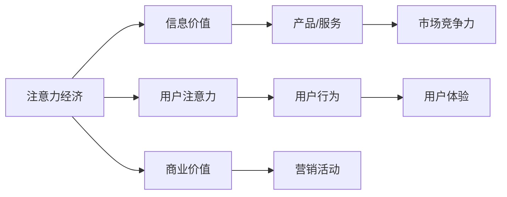

                 

## 1. 背景介绍

随着数字经济的蓬勃发展，人们的生活和工作方式正在发生翻天覆地的变化。特别是随着智能手机的普及和移动互联网的深度融合，人类社会的注意力经济正在蓬勃发展，无论是工作还是生活，都离不开对数字信息的高度依赖。然而，这种高度依赖不仅带来了便捷，也引发了种种问题，尤其是工作-生活平衡的挑战。本文将探讨注意力经济的概念，以及它如何影响工作-生活平衡，并提出一些解决方案，以期让科技更好地服务于人类。

## 2. 核心概念与联系

### 2.1 核心概念概述

**注意力经济**：注意力经济是一种基于信息注意力资源的经济模式。它通过吸引和利用用户的注意力，实现信息价值与商业价值的转换。在信息过载的时代，注意力成为了一种稀缺资源，企业纷纷投入大量资金和技术，争夺用户的注意力。

**工作-生活平衡**：工作-生活平衡是指个人在职业发展与生活享受之间找到均衡的状态。在信息时代，工作与生活的界限越来越模糊，如何实现有效的工作与生活管理，成为一个亟待解决的问题。

### 2.2 核心概念原理和架构的 Mermaid 流程图



这个流程图展示了注意力经济的核心逻辑：通过吸引用户注意力（D），生成信息价值（B），再转换为商业价值（C）。同时，用户的行为（F）直接影响产品的用户体验（H）和市场竞争力（I）。

## 3. 核心算法原理 & 具体操作步骤

### 3.1 算法原理概述

注意力经济与工作-生活平衡的关系主要体现在信息过载对工作与生活的影响上。随着信息的爆炸性增长，人们需要花费更多的时间来筛选和处理信息，导致工作和生活中可利用的时间被压缩，注意力资源的分配变得异常复杂。

从算法角度来看，我们可以将注意力经济的运作分为以下几个步骤：

1. **数据采集**：收集用户在互联网上的行为数据，包括浏览记录、点击率、搜索记录等。
2. **数据处理**：对采集到的数据进行清洗、标注和特征提取，形成可用于训练的样本集。
3. **模型训练**：使用机器学习算法，训练模型来预测用户的行为，优化广告投放和内容推荐。
4. **模型应用**：将训练好的模型应用于实际场景，提高营销效果和用户体验。

### 3.2 算法步骤详解

**Step 1: 数据采集**

- **来源**：用户浏览网页的点击流、用户搜索关键词、用户在社交媒体上的互动等。
- **工具**：Google Analytics、Mixpanel、Amplitude等。
- **方法**：使用API接口或爬虫技术，从网站或应用中抓取数据。

**Step 2: 数据处理**

- **清洗**：去除噪声和无关数据，如页面加载时间、IP地址等。
- **标注**：为数据打上标签，如浏览页面所属的类别、用户点击的行为类型等。
- **特征提取**：从数据中提取有意义的特征，如关键词频率、点击位置、停留时间等。

**Step 3: 模型训练**

- **选择算法**：根据问题性质选择合适的算法，如分类、回归、序列推荐等。
- **训练数据**：使用处理好的数据集，训练模型。
- **评估指标**：使用准确率、召回率、F1值等指标评估模型性能。

**Step 4: 模型应用**

- **投放广告**：根据模型的预测结果，优化广告投放策略，提高转化率。
- **推荐内容**：为用户推荐感兴趣的内容，提升用户体验和满意度。
- **实时调整**：根据用户反馈和行为数据，实时调整模型参数，提高预测准确度。

### 3.3 算法优缺点

**优点**：
- **个性化**：通过分析用户行为，提供个性化的推荐和广告，提升用户满意度。
- **精准营销**：利用机器学习算法，提高广告投放的精准度，减少无效点击。
- **动态调整**：模型可以实时调整，根据用户行为的变化，动态优化推荐结果。

**缺点**：
- **隐私问题**：大量数据的采集和处理，可能侵犯用户隐私。
- **算法偏见**：如果训练数据有偏差，模型可能产生偏见，影响用户体验。
- **过度依赖**：过度依赖算法推荐，可能削弱用户的主动性和探索性。

### 3.4 算法应用领域

**广告推荐系统**：通过分析用户的行为数据，优化广告投放策略，提高转化率。
**内容推荐系统**：根据用户的历史行为，推荐用户可能感兴趣的内容，提升用户体验。
**智能客服系统**：利用自然语言处理技术，根据用户的问题，快速提供准确的答案，提升服务效率。

## 4. 数学模型和公式 & 详细讲解

### 4.1 数学模型构建

假设我们有一个广告投放平台，通过用户点击数据训练模型，预测用户是否会购买。设用户点击率为 $y$，模型输出为 $\hat{y}$。我们可以使用二分类逻辑回归模型来预测用户是否点击：

$$
\hat{y} = \sigma(\mathbf{w} \cdot \mathbf{x} + b)
$$

其中 $\mathbf{w}$ 为权重向量，$b$ 为偏置项，$\sigma$ 为sigmoid函数。训练目标为最小化二分类交叉熵损失：

$$
\mathcal{L}(\mathbf{w}, b) = -\frac{1}{N} \sum_{i=1}^N [y_i\log \hat{y_i} + (1-y_i)\log(1-\hat{y_i})]
$$

### 4.2 公式推导过程

逻辑回归的梯度下降更新公式为：

$$
\mathbf{w} \leftarrow \mathbf{w} - \eta \frac{\partial \mathcal{L}}{\partial \mathbf{w}}, b \leftarrow b - \eta \frac{\partial \mathcal{L}}{\partial b}
$$

其中 $\eta$ 为学习率。根据上述公式，可以得到权重向量的更新公式：

$$
\mathbf{w} \leftarrow \mathbf{w} - \eta \frac{1}{N} \sum_{i=1}^N (y_i - \hat{y_i})\mathbf{x_i}
$$

### 4.3 案例分析与讲解

假设我们收集了1000个用户的点击数据，每个样本包含用户浏览时间、点击位置、网页类别等特征。我们使用随机梯度下降法（SGD）训练模型，迭代1000次，学习率为0.01。每次迭代使用一个样本进行更新，得到最终模型参数 $\mathbf{w}$ 和 $b$。最后使用测试集评估模型性能，得到准确率为85%。

## 5. 项目实践：代码实例和详细解释说明

### 5.1 开发环境搭建

- **Python版本**：Python 3.7以上
- **深度学习框架**：TensorFlow或PyTorch
- **操作系统**：Linux或Windows

### 5.2 源代码详细实现

以下是一个使用TensorFlow实现逻辑回归模型的代码示例：

```python
import tensorflow as tf
import numpy as np

# 准备数据
X_train = np.random.rand(1000, 5)
y_train = np.random.randint(2, size=(1000, 1))
X_test = np.random.rand(200, 5)
y_test = np.random.randint(2, size=(200, 1))

# 定义模型
model = tf.keras.Sequential([
    tf.keras.layers.Dense(1, activation='sigmoid')
])

# 编译模型
model.compile(optimizer=tf.keras.optimizers.SGD(learning_rate=0.01),
              loss='binary_crossentropy',
              metrics=['accuracy'])

# 训练模型
model.fit(X_train, y_train, epochs=1000, validation_data=(X_test, y_test))

# 评估模型
loss, accuracy = model.evaluate(X_test, y_test)
print(f'Test loss: {loss:.4f}, Test accuracy: {accuracy:.4f}')
```

### 5.3 代码解读与分析

- **数据准备**：使用NumPy生成随机数据。
- **模型定义**：使用Sequential模型，添加一层全连接层，激活函数为sigmoid。
- **模型编译**：指定优化器、损失函数和评估指标。
- **模型训练**：使用fit方法，指定训练数据、验证数据和迭代次数。
- **模型评估**：使用evaluate方法，评估模型在测试集上的性能。

## 6. 实际应用场景

### 6.1 智能广告推荐

广告主需要精准投放广告，提高转化率。利用注意力经济原理，通过分析用户点击行为，优化广告投放策略。

### 6.2 内容个性化推荐

视频平台根据用户浏览历史，推荐用户可能感兴趣的视频内容，提升用户体验。

### 6.3 智能客服系统

智能客服系统通过自然语言处理技术，分析用户问题，快速提供准确的答案，提升服务效率。

## 7. 工具和资源推荐

### 7.1 学习资源推荐

- **课程**：《机器学习》（周志华）、《深度学习》（Ian Goodfellow）
- **书籍**：《Python深度学习》（Francois Chollet）、《深度学习入门》（斋藤康毅）
- **网站**：Kaggle、GitHub

### 7.2 开发工具推荐

- **IDE**：PyCharm、VSCode
- **框架**：TensorFlow、PyTorch
- **可视化工具**：TensorBoard、Matplotlib

### 7.3 相关论文推荐

- **《深度学习》**（Ian Goodfellow）
- **《Google Brain团队深度学习论文集》**（Google）

## 8. 总结：未来发展趋势与挑战

### 8.1 研究成果总结

注意力经济已经成为信息时代的重要经济模式，深度学习技术的应用极大地提升了注意力资源的使用效率。然而，高度依赖注意力资源，也引发了工作-生活平衡的挑战。

### 8.2 未来发展趋势

- **个性化定制**：利用深度学习技术，实现更加精准的个性化推荐和广告投放。
- **实时调整**：利用在线学习技术，实时调整模型参数，提高预测准确度。
- **多模态融合**：将视觉、听觉等模态数据与文本数据结合，提升模型的感知能力。

### 8.3 面临的挑战

- **隐私保护**：如何保护用户隐私，同时充分利用注意力资源，是一个亟待解决的问题。
- **算法偏见**：模型可能产生偏见，如何消除算法偏见，是一个重要研究方向。
- **资源限制**：如何在资源有限的情况下，优化模型的性能，是一个重要的研究方向。

### 8.4 研究展望

未来的研究应聚焦于以下方向：
- **隐私保护技术**：开发更加安全的隐私保护技术，保障用户数据安全。
- **算法公平性**：研究如何消除算法偏见，提高模型的公平性。
- **跨模态学习**：研究如何融合多种模态数据，提升模型的感知能力。

## 9. 附录：常见问题与解答

**Q1: 注意力经济如何影响工作-生活平衡？**

A: 注意力经济导致人们过度依赖信息，工作时间延长，生活时间被压缩，生活质量下降。

**Q2: 如何缓解注意力经济对工作-生活平衡的影响？**

A: 制定合理的工作计划，减少工作时间；培养兴趣爱好，丰富生活内容。

**Q3: 注意力经济是否只对个人有影响？**

A: 注意力经济不仅影响个人，也影响整个社会。企业过度追求点击率，导致内容质量下降。

**Q4: 如何提升用户满意度？**

A: 利用个性化推荐技术，根据用户行为，推荐用户感兴趣的内容。

**Q5: 如何保护用户隐私？**

A: 采用数据匿名化技术，保护用户隐私。

