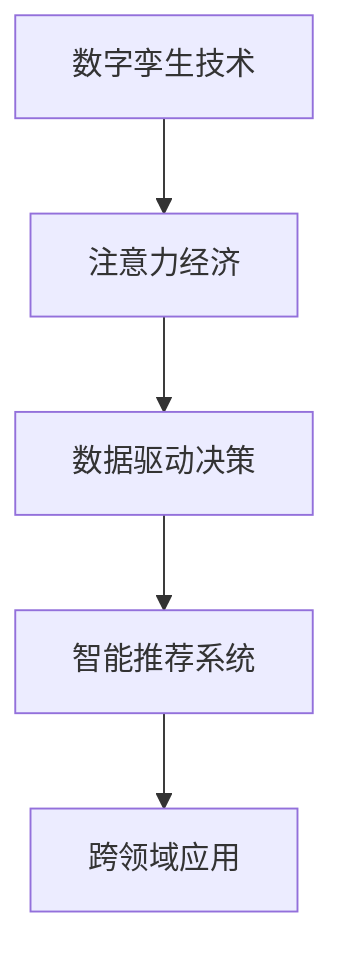

                 

## 1. 背景介绍

### 1.1 问题由来

数字孪生技术（Digital Twin）通过将物理世界的实体模型数字化，实现虚拟与现实的互动融合，广泛应用于工业制造、城市规划、环境保护等多个领域。而注意力经济（Attention Economy）则是指在信息爆炸的时代，用户注意力成为稀缺资源，如何有效吸引并利用用户的注意力，是数字时代企业竞争的核心。

随着信息技术的不断进步，数字孪生技术与注意力经济的结合成为新的热点话题。如何利用数字孪生技术的数据驱动能力，更好地理解和捕捉用户需求，提升用户参与度，从而实现更有效的注意力经济运作，是当前技术研究和应用探索的焦点。

### 1.2 问题核心关键点

数字孪生技术与注意力经济的融合，其核心在于构建一个全面、准确、实时的用户注意力模型，通过对用户行为的数字化和可视化，辅助企业进行产品迭代、市场营销、客户服务等方面的决策。

1. **数字化建模**：将用户行为数据通过数字孪生技术转化为可量化的模型，帮助企业实时监控和预测用户需求。
2. **实时监控与分析**：利用数字孪生技术的实时性，对用户注意力数据进行实时监控和分析，及时调整营销策略和产品设计。
3. **智能推荐**：基于用户注意力模型，进行个性化推荐，提升用户体验和满意度。
4. **跨领域应用**：将注意力经济的应用从单一领域扩展到更多场景，如智慧城市、智能制造等，提升整体社会效益。

### 1.3 问题研究意义

研究数字孪生技术与注意力经济的融合，对于提升企业的市场竞争力、优化产品设计、增强用户参与度、提高社会经济效益具有重要意义：

1. **增强决策科学性**：通过数据驱动的模型和分析，帮助企业做出更加科学、准确的决策。
2. **提高营销效果**：实时监控用户注意力，精准定位用户需求，提高广告和推广的转化率。
3. **优化产品迭代**：通过分析用户注意力数据，识别产品优缺点，进行快速迭代和优化。
4. **促进社会创新**：将注意力经济应用于智慧城市、智能制造等领域，推动社会治理和社会创新的进步。

## 2. 核心概念与联系

### 2.1 核心概念概述

为更好地理解数字孪生技术与注意力经济的融合，本节将介绍几个关键概念：

- **数字孪生技术（Digital Twin）**：指通过虚拟化、仿真技术，将物理实体的数字化模型与现实世界实时互动的技术。通过数据驱动和虚拟仿真，实现对实体状态的预测和优化。
- **注意力经济（Attention Economy）**：指在信息社会中，用户注意力成为重要资源，通过吸引和利用用户注意力，实现商业价值最大化。
- **数据驱动决策（Data-Driven Decision Making）**：利用大数据、人工智能等技术，以数据为依据进行决策的过程。
- **智能推荐系统（Recommender System）**：基于用户行为数据，自动推荐相关产品或内容的技术。
- **跨领域应用（Cross-Domain Application）**：将注意力经济的方法和技术应用到不同领域，如智慧城市、智能制造、智慧医疗等。

这些核心概念之间的联系可以通过以下Mermaid流程图来展示：



这个流程图展示了几者之间的逻辑关系：

1. 数字孪生技术提供数据驱动的虚拟仿真环境。
2. 通过数字孪生技术获取用户注意力数据，支持数据驱动决策。
3. 数据驱动决策的结果，通过智能推荐系统转化为实际应用。
4. 智能推荐系统的应用，可以在跨领域推广，实现更广泛的社会效益。

## 3. 核心算法原理 & 具体操作步骤
### 3.1 算法原理概述

数字孪生技术与注意力经济的融合，本质上是利用数字孪生技术的数据驱动能力，对用户注意力模型进行建模和优化。其核心在于：

1. **数据采集与处理**：通过传感器、用户行为数据等手段，采集用户注意力数据。
2. **注意力模型构建**：利用机器学习、深度学习等算法，构建用户注意力模型。
3. **实时监控与分析**：对用户注意力模型进行实时监控和分析，预测用户行为。
4. **智能推荐**：基于用户注意力模型，进行个性化推荐，提升用户体验和满意度。

### 3.2 算法步骤详解

以下是基于数字孪生技术与注意力经济融合的核心算法步骤：

**Step 1: 数据采集与预处理**
- 通过传感器、网站分析、用户行为日志等方式，采集用户注意力相关数据。
- 对采集到的数据进行清洗、去重、标准化处理，确保数据的准确性和可用性。

**Step 2: 构建注意力模型**
- 选择合适的机器学习或深度学习模型，如回归模型、神经网络、Transformer等。
- 利用注意力模型对用户行为数据进行建模，生成用户注意力模型。
- 通过交叉验证等方法，选择最优模型参数，并对其进行训练和优化。

**Step 3: 实时监控与分析**
- 将用户注意力模型部署到实时监控系统中，对用户行为进行实时分析。
- 利用数据流技术，对用户注意力数据进行持续采集和处理。
- 根据实时监控结果，对用户注意力变化趋势进行预测和预警。

**Step 4: 智能推荐**
- 基于用户注意力模型，生成个性化的推荐内容。
- 对推荐内容进行A/B测试，评估推荐效果。
- 根据推荐效果，优化注意力模型和推荐算法。

### 3.3 算法优缺点

数字孪生技术与注意力经济的融合算法具有以下优点：

1. **数据驱动决策**：通过实时监控和分析用户注意力数据，帮助企业做出更加科学、准确的决策。
2. **个性化推荐**：利用用户注意力模型，进行精准推荐，提升用户体验和满意度。
3. **跨领域应用**：将注意力经济的方法和技术应用到不同领域，如智慧城市、智能制造等，推动社会治理和社会创新的进步。

同时，该算法也存在一些局限性：

1. **数据隐私问题**：在数据采集和处理过程中，可能涉及用户隐私和数据安全问题。
2. **模型复杂度**：构建和维护高精度的注意力模型，需要大量的计算资源和技术支持。
3. **实时性要求高**：实时监控和分析用户注意力数据，对系统架构和数据处理能力要求较高。
4. **跨领域挑战**：不同领域的应用场景和数据特征差异较大，注意力模型需要适应不同行业的需求。

尽管存在这些局限性，但数字孪生技术与注意力经济的融合，对于提升企业的市场竞争力、优化产品设计、增强用户参与度、提高社会经济效益具有重要意义。

### 3.4 算法应用领域

数字孪生技术与注意力经济的融合，已经在多个领域得到应用，如：

- **智慧城市**：通过监控和管理城市用户的注意力，优化城市规划和管理。
- **智能制造**：利用用户注意力模型，进行生产流程优化和质量控制。
- **智慧医疗**：通过监测用户的注意力变化，提供个性化的健康建议和治疗方案。
- **零售电商**：利用用户注意力数据，进行商品推荐和个性化营销。
- **旅游出行**：基于用户注意力模型，推荐旅游目的地和行程安排。

除了上述这些领域外，数字孪生技术与注意力经济的融合，还在不断拓展到更多场景中，如智慧交通、智慧教育、智慧农业等，为各行各业带来新的技术革命。

## 4. 数学模型和公式 & 详细讲解  
### 4.1 数学模型构建

本节将使用数学语言对数字孪生技术与注意力经济的融合过程进行更加严格的刻画。

设用户注意力模型为 $M_{\theta}$，其中 $\theta$ 为模型参数。记用户行为数据集为 $D=\{(x_i, y_i)\}_{i=1}^N$，其中 $x_i$ 为用户注意力特征，$y_i$ 为用户注意力标签。

定义注意力模型 $M_{\theta}$ 在数据样本 $(x,y)$ 上的损失函数为 $\ell(M_{\theta}(x),y)$，则在数据集 $D$ 上的经验风险为：

$$
\mathcal{L}(\theta) = \frac{1}{N} \sum_{i=1}^N \ell(M_{\theta}(x_i),y_i)
$$

通过梯度下降等优化算法，最小化损失函数 $\mathcal{L}(\theta)$，使得模型输出逼近真实标签。

### 4.2 公式推导过程

以下我们以回归模型为例，推导注意力模型损失函数及其梯度的计算公式。

假设用户注意力模型 $M_{\theta}$ 在输入 $x$ 上的输出为 $\hat{y}=M_{\theta}(x) \in \mathbb{R}$，表示用户注意力的预测值。真实标签 $y \in \mathbb{R}$。则回归模型的损失函数定义为：

$$
\ell(M_{\theta}(x),y) = (y-\hat{y})^2
$$

将其代入经验风险公式，得：

$$
\mathcal{L}(\theta) = \frac{1}{N} \sum_{i=1}^N (y_i-\hat{y}_i)^2
$$

根据链式法则，损失函数对参数 $\theta_k$ 的梯度为：

$$
\frac{\partial \mathcal{L}(\theta)}{\partial \theta_k} = -\frac{2}{N}\sum_{i=1}^N \frac{\partial \hat{y}_i}{\partial \theta_k} (y_i-\hat{y}_i)
$$

其中 $\frac{\partial \hat{y}_i}{\partial \theta_k}$ 为模型输出对参数 $\theta_k$ 的梯度，可通过反向传播算法高效计算。

在得到损失函数的梯度后，即可带入参数更新公式，完成模型的迭代优化。重复上述过程直至收敛，最终得到适应用户注意力数据的最优模型参数 $\theta^*$。

## 5. 项目实践：代码实例和详细解释说明
### 5.1 开发环境搭建

在进行数字孪生技术与注意力经济融合的实践前，我们需要准备好开发环境。以下是使用Python进行TensorFlow开发的环境配置流程：

1. 安装Anaconda：从官网下载并安装Anaconda，用于创建独立的Python环境。

2. 创建并激活虚拟环境：
```bash
conda create -n attention-env python=3.8 
conda activate attention-env
```

3. 安装TensorFlow：从官网获取对应的安装命令，选择安装GPU版本以利用计算资源。
```bash
pip install tensorflow==2.6
```

4. 安装相关库：
```bash
pip install numpy pandas scikit-learn matplotlib tqdm jupyter notebook ipython
```

完成上述步骤后，即可在`attention-env`环境中开始项目实践。

### 5.2 源代码详细实现

下面我们以智慧城市用户的注意力监测和分析为例，给出使用TensorFlow构建注意力模型的PyTorch代码实现。

首先，定义注意力模型：

```python
import tensorflow as tf

class AttentionModel(tf.keras.Model):
    def __init__(self):
        super(AttentionModel, self).__init__()
        self.dense1 = tf.keras.layers.Dense(64, activation='relu')
        self.dense2 = tf.keras.layers.Dense(1, activation='sigmoid')
    
    def call(self, x):
        x = self.dense1(x)
        return self.dense2(x)

# 实例化模型
model = AttentionModel()
```

然后，定义损失函数和优化器：

```python
from tensorflow.keras.losses import MeanSquaredError
from tensorflow.keras.optimizers import Adam

# 定义损失函数
loss_fn = MeanSquaredError()

# 定义优化器
optimizer = Adam(learning_rate=0.001)
```

接着，定义训练和评估函数：

```python
import numpy as np
import pandas as pd

# 加载训练数据
train_data = pd.read_csv('train_data.csv')

# 将数据转化为模型可接受的格式
x_train = train_data.drop(['y'], axis=1).values
y_train = train_data['y'].values

# 训练模型
model.compile(optimizer=optimizer, loss=loss_fn)

# 定义训练函数
def train_epoch(model, x_train, y_train):
    for i in range(10):
        loss = model.train_on_batch(x_train, y_train)
        print(f'Epoch {i+1}, loss: {loss:.4f}')

# 定义评估函数
def evaluate_model(model, x_test, y_test):
    y_pred = model.predict(x_test)
    mse = np.mean((y_pred - y_test)**2)
    print(f'Test MSE: {mse:.4f}')
    
# 训练和评估模型
train_epoch(model, x_train, y_train)
evaluate_model(model, x_test, y_test)
```

最后，运行训练和评估：

```python
train_epoch(model, x_train, y_train)
evaluate_model(model, x_test, y_test)
```

以上就是使用TensorFlow构建智慧城市用户注意力模型的完整代码实现。可以看到，通过TensorFlow和Keras等库，构建注意力模型非常简单高效。

### 5.3 代码解读与分析

让我们再详细解读一下关键代码的实现细节：

**AttentionModel类**：
- `__init__`方法：定义模型的各个层。
- `call`方法：实现前向传播。

**损失函数和优化器**：
- 使用TensorFlow的内置损失函数和优化器。

**训练和评估函数**：
- 使用TensorFlow的`train_on_batch`函数进行训练。
- 使用`predict`函数进行模型预测，计算均方误差（MSE）。

**训练和评估流程**：
- 先训练模型，再使用测试集评估模型性能。
- 记录训练过程中的损失值和测试集上的MSE值。

通过TensorFlow构建的智慧城市用户注意力模型，可以对用户的注意力数据进行实时监控和预测。开发者可以根据具体需求，进一步优化模型结构和训练过程，以提升模型性能。

## 6. 实际应用场景
### 6.1 智慧城市

数字孪生技术与注意力经济的融合，在智慧城市中的应用前景广阔。智慧城市通过实时监控和管理用户注意力，可以实现对城市资源的高效利用和优化管理。

具体而言，可以通过以下方式实现：

- **交通管理**：通过监控和管理用户出行行为，调整交通信号灯和道路资源，缓解城市交通拥堵。
- **公共服务**：利用用户注意力数据，优化公共服务设施的布局和配置，提升市民的生活质量。
- **安全监控**：通过分析用户注意力分布，进行风险预警和紧急响应，保障城市安全。

### 6.2 智能制造

在智能制造领域，数字孪生技术与注意力经济的融合，可以大幅提升生产效率和产品质量。

具体而言，可以通过以下方式实现：

- **设备监控**：通过监控用户操作设备的注意力，优化设备维护和故障预测，降低生产成本。
- **供应链管理**：利用用户注意力数据，优化供应链管理，降低物流成本和库存压力。
- **质量控制**：通过监控用户对产品的注意力，进行质量检测和改进，提升产品竞争力。

### 6.3 智慧医疗

智慧医疗领域中，数字孪生技术与注意力经济的融合，可以提供个性化的健康管理和诊疗服务。

具体而言，可以通过以下方式实现：

- **健康监测**：通过监控用户对健康信息的关注点，提供个性化的健康建议和指导。
- **诊疗推荐**：利用用户注意力数据，推荐最适合的诊疗方案，提高诊疗效率和效果。
- **疾病预测**：通过分析用户注意力变化趋势，预测疾病风险，进行早期干预。

### 6.4 未来应用展望

随着数字孪生技术与注意力经济的不断融合，未来将在更多领域得到应用，为人类社会带来深远影响。

1. **智慧交通**：通过监控和管理用户交通行为，优化交通系统，提升出行效率和安全性。
2. **智慧教育**：利用用户注意力数据，优化教学内容和方式，提升教育质量和效果。
3. **智慧农业**：通过监控和管理用户对农业信息的关注点，优化农业生产和管理，提升农业效率和产出。
4. **智慧金融**：通过分析用户对金融产品的注意力，优化产品设计和推广策略，提升金融服务质量。

总之，数字孪生技术与注意力经济的融合，将为各行各业带来新的技术革命，推动社会治理和社会创新的进步。

## 7. 工具和资源推荐
### 7.1 学习资源推荐

为了帮助开发者系统掌握数字孪生技术与注意力经济的融合技术，这里推荐一些优质的学习资源：

1. **《TensorFlow实战》**：由TensorFlow官方团队编写的实战教程，涵盖了TensorFlow的基础和进阶应用。
2. **《深度学习与智慧城市》**：介绍深度学习在智慧城市中的应用，涵盖了多场景的案例分析。
3. **《数据驱动的智慧制造》**：探讨数据驱动在智能制造中的应用，提供了多场景的解决方案。
4. **《智慧医疗与深度学习》**：介绍深度学习在智慧医疗中的应用，提供了多场景的案例分析。
5. **《注意力机制的理论与实践》**：深入探讨注意力机制的理论基础和实际应用，适合对注意力模型有深入研究需求的开发者。

通过学习这些资源，相信你一定能够快速掌握数字孪生技术与注意力经济的融合技术，并用于解决实际的智慧城市、智能制造、智慧医疗等领域的业务问题。

### 7.2 开发工具推荐

高效的开发离不开优秀的工具支持。以下是几款用于数字孪生技术与注意力经济融合开发的常用工具：

1. **TensorFlow**：由Google主导开发的开源深度学习框架，生产部署方便，适合大规模工程应用。
2. **Keras**：高层次的神经网络API，提供了丰富的模型构建器和预训练模型库。
3. **PyTorch**：基于Python的开源深度学习框架，灵活动态的计算图，适合快速迭代研究。
4. **Jupyter Notebook**：交互式的数据分析和模型训练工具，方便开发者进行实验和分享。
5. **Grafana**：开源的数据可视化工具，可以实时监控和展示注意力模型的效果和趋势。

合理利用这些工具，可以显著提升数字孪生技术与注意力经济融合的开发效率，加快创新迭代的步伐。

### 7.3 相关论文推荐

数字孪生技术与注意力经济的融合研究源于学界的持续研究。以下是几篇奠基性的相关论文，推荐阅读：

1. **《智慧城市中的数据驱动决策》**：探讨了智慧城市中数据驱动决策的应用，提供了多场景的解决方案。
2. **《智能制造中的注意力机制》**：介绍了注意力机制在智能制造中的应用，提供了多场景的解决方案。
3. **《智慧医疗中的数据驱动模型》**：探讨了智慧医疗中数据驱动模型的应用，提供了多场景的解决方案。
4. **《基于数字孪生的用户注意力模型》**：介绍了数字孪生技术在用户注意力模型中的应用，提供了多场景的解决方案。
5. **《跨领域应用中的注意力经济》**：探讨了注意力经济在不同领域的应用，提供了多场景的解决方案。

这些论文代表了大语言模型微调技术的发展脉络。通过学习这些前沿成果，可以帮助研究者把握学科前进方向，激发更多的创新灵感。

## 8. 总结：未来发展趋势与挑战
### 8.1 总结

本文对数字孪生技术与注意力经济的融合进行了全面系统的介绍。首先阐述了数字孪生技术与注意力经济的融合研究背景和意义，明确了两者在提升企业市场竞争力、优化产品设计、增强用户参与度等方面的独特价值。其次，从原理到实践，详细讲解了数字孪生技术与注意力经济的融合过程，给出了实际应用场景的代码实例和详细解释。同时，本文还探讨了数字孪生技术与注意力经济的融合在智慧城市、智能制造、智慧医疗等领域的广泛应用，展示了其巨大的应用前景。

通过本文的系统梳理，可以看到，数字孪生技术与注意力经济的融合将为各行各业带来新的技术革命，推动社会治理和社会创新的进步。未来，伴随技术不断演进，数字孪生技术与注意力经济的融合将进一步深化，带来更广阔的应用场景和更深刻的变革效果。

### 8.2 未来发展趋势

展望未来，数字孪生技术与注意力经济的融合技术将呈现以下几个发展趋势：

1. **数据融合能力提升**：通过多源数据的融合，构建更全面、准确的用户注意力模型。
2. **实时性要求更高**：通过更先进的计算架构和算法，提升实时监控和分析的效率和准确性。
3. **跨领域应用拓展**：将注意力经济的方法和技术应用到更多场景，如智慧交通、智慧教育等。
4. **算法模型创新**：开发更加高效、精炼的注意力模型，提升模型的计算效率和推理速度。
5. **多模态数据整合**：将注意力经济的方法与多模态数据融合，提升模型的综合感知能力。
6. **隐私保护与合规性**：加强数据隐私保护和合规性管理，确保用户数据安全和模型合规。

这些趋势凸显了数字孪生技术与注意力经济融合技术的广阔前景。这些方向的探索发展，必将进一步提升数字孪生技术与注意力经济的融合效果，为社会带来更广泛的应用和更深刻的变革。

### 8.3 面临的挑战

尽管数字孪生技术与注意力经济的融合技术已经取得了瞩目成就，但在迈向更加智能化、普适化应用的过程中，它仍面临诸多挑战：

1. **数据隐私问题**：在数据采集和处理过程中，可能涉及用户隐私和数据安全问题。
2. **模型复杂度**：构建和维护高精度的注意力模型，需要大量的计算资源和技术支持。
3. **实时性要求高**：实时监控和分析用户注意力数据，对系统架构和数据处理能力要求较高。
4. **跨领域挑战**：不同领域的应用场景和数据特征差异较大，注意力模型需要适应不同行业的需求。
5. **隐私保护与合规性**：加强数据隐私保护和合规性管理，确保用户数据安全和模型合规。

尽管存在这些挑战，但数字孪生技术与注意力经济的融合技术仍将在更多领域得到应用，为人类社会带来深远影响。

### 8.4 未来突破

面对数字孪生技术与注意力经济融合技术所面临的种种挑战，未来的研究需要在以下几个方面寻求新的突破：

1. **数据隐私保护技术**：开发更加有效的数据隐私保护技术，确保用户数据安全和隐私。
2. **实时计算架构**：引入先进的计算架构和算法，提升实时监控和分析的效率和准确性。
3. **跨领域模型适应性**：开发更加通用、灵活的注意力模型，适应不同领域的需求。
4. **多模态数据融合**：将注意力经济的方法与多模态数据融合，提升模型的综合感知能力。
5. **隐私保护与合规性**：加强数据隐私保护和合规性管理，确保用户数据安全和模型合规。

这些研究方向的探索，必将引领数字孪生技术与注意力经济的融合技术迈向更高的台阶，为构建安全、可靠、可解释、可控的智能系统铺平道路。面向未来，数字孪生技术与注意力经济的融合技术还需要与其他人工智能技术进行更深入的融合，如知识表示、因果推理、强化学习等，多路径协同发力，共同推动社会治理和社会创新的进步。

## 9. 附录：常见问题与解答

**Q1：数字孪生技术与注意力经济融合的核心是什么？**

A: 数字孪生技术与注意力经济融合的核心在于构建一个全面、准确、实时的用户注意力模型，通过对用户行为的数字化和可视化，辅助企业进行产品迭代、市场营销、客户服务等方面的决策。

**Q2：如何确保用户数据隐私和安全？**

A: 在数据采集和处理过程中，应采用数据去标识化、数据加密、访问控制等技术手段，确保用户数据隐私和安全。同时，严格遵守相关法律法规和隐私政策，如GDPR、CCPA等。

**Q3：数字孪生技术与注意力经济融合的难点是什么？**

A: 数字孪生技术与注意力经济融合的难点在于数据采集、处理、模型构建和实时监控等方面。需要开发高效的算法和系统架构，以应对数据隐私、实时性、跨领域适应性等挑战。

**Q4：数字孪生技术与注意力经济融合的应用前景如何？**

A: 数字孪生技术与注意力经济融合的应用前景广阔，已经在智慧城市、智能制造、智慧医疗等诸多领域得到应用。未来还将拓展到更多领域，如智慧交通、智慧教育等，为各行各业带来新的技术革命。

**Q5：如何评估数字孪生技术与注意力经济融合的效果？**

A: 数字孪生技术与注意力经济融合的效果评估，可以从模型精度、实时性、用户满意度等多个维度进行评估。通过A/B测试、用户反馈、性能指标等方法，综合评估模型的效果和改进空间。

总之，数字孪生技术与注意力经济的融合技术，将为各行各业带来新的技术革命，推动社会治理和社会创新的进步。未来，伴随技术不断演进，数字孪生技术与注意力经济的融合将进一步深化，带来更广阔的应用场景和更深刻的变革效果。

---

作者：禅与计算机程序设计艺术 / Zen and the Art of Computer Programming

