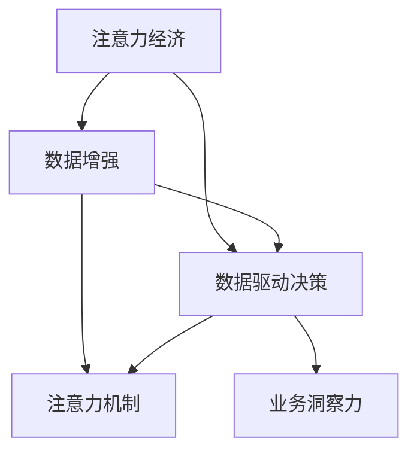
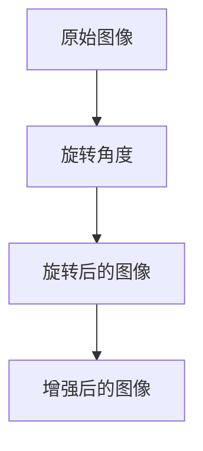
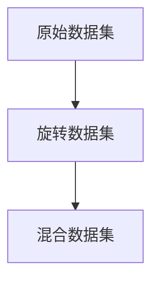

                 

# 注意力经济与数据驱动的决策制定：利用数据增强业务洞察力

## 1. 背景介绍

### 1.1 问题由来

在信息爆炸的时代，注意力经济（Attention Economy）正迅速崛起。随着互联网技术的普及和数据量的爆炸性增长，人们的注意力资源变得愈发稀缺。如何在海量数据中找到有价值的信息，实现精准决策，成为众多企业和组织面临的重大挑战。数据驱动的决策制定（Data-driven Decision Making）方法，通过运用先进的机器学习、数据挖掘和智能分析技术，帮助企业洞察数据背后的规律，优化决策过程，提升业务效率和竞争力。

然而，尽管数据驱动的方法具有诸多优势，但实际应用中仍存在不少困难：
- **数据质量和多样性**：数据样本的偏差和噪声，影响模型训练的稳定性和泛化能力。
- **模型复杂度和可解释性**：模型过于复杂，难以理解其内部工作机制，限制了决策的可解释性。
- **实时性和可操作性**：数据处理和模型推理的速度，影响实时决策和实际应用效果。

为了解决这些挑战，近年来数据增强技术（Data Augmentation）应运而生。数据增强通过对原始数据进行一系列变换，增加样本数量和多样性，从而提高模型的稳定性和泛化能力。本文将深入探讨数据增强在注意力经济和数据驱动决策中的应用，以及如何利用数据增强技术提升业务洞察力。

## 2. 核心概念与联系

### 2.1 核心概念概述

为更好地理解数据增强在注意力经济和数据驱动决策中的应用，本节将介绍几个密切相关的核心概念：

- **注意力经济（Attention Economy）**：指在信息过载的环境中，人们需要花费更多注意力去获取、筛选有价值信息的过程。注意力经济强调信息资源的时间价值和稀缺性，旨在通过数据增强等技术，提升信息获取和决策的效率和准确性。

- **数据增强（Data Augmentation）**：通过变换原始数据，增加样本数量和多样性，以提高模型在有限数据下的泛化能力。常见的数据增强方法包括图像旋转、翻转、裁剪、添加噪声等。

- **注意力机制（Attention Mechanism）**：一种基于统计注意力（Statistical Attention）和自注意力（Self-Attention）机制，帮助模型自动关注输入数据中重要部分的技术。常用于机器翻译、文本摘要、图像分类等任务，提升模型的复杂性和可解释性。

- **数据驱动决策（Data-driven Decision Making）**：基于大量历史数据和统计分析，通过机器学习模型预测未来趋势，辅助企业决策。广泛应用于金融、医疗、零售等行业，提升决策效率和精准度。

- **业务洞察力（Business Insights）**：通过数据分析和模型推理，揭示业务运作的规律和趋势，指导业务优化和决策制定。数据增强技术可以通过增加数据多样性，提高模型的预测准确性和鲁棒性，从而增强业务洞察力。

这些核心概念之间的逻辑关系可以通过以下Mermaid流程图来展示：



这个流程图展示了注意力经济、数据增强、数据驱动决策、注意力机制和业务洞察力之间的关系：

1. 注意力经济通过对信息资源的时间价值和稀缺性的强调，推动了数据增强和数据驱动决策技术的发展。
2. 数据增强通过增加数据多样性，提高了数据驱动决策的稳定性和泛化能力。
3. 数据驱动决策利用增强后的数据，通过机器学习模型预测未来趋势，辅助决策。
4. 注意力机制通过关注输入数据的重要部分，增强了数据驱动决策模型的复杂性和可解释性。
5. 业务洞察力通过数据分析和模型推理，揭示业务运作的规律和趋势，指导业务优化和决策制定。

## 3. 核心算法原理 & 具体操作步骤

### 3.1 算法原理概述

数据增强的原理是通过对原始数据进行一系列变换，生成新的训练样本，增加模型的泛化能力和鲁棒性。其核心思想是利用数据的随机性，模拟不同场景和条件下的数据变化，使得模型能够在各种情况下进行有效的预测和推理。

具体来说，数据增强包括两个主要步骤：
1. **数据生成**：通过对原始数据进行一系列变换，生成新的数据样本。
2. **数据融合**：将增强后的数据与原始数据进行混合，形成完整的训练集。

数据增强技术常用于图像、语音、文本等不同类型的数据，其具体方法因数据类型而异。本文将以图像数据增强为例，介绍数据增强的原理和操作步骤。

### 3.2 算法步骤详解

以下是数据增强在图像分类任务中的具体操作步骤：

1. **数据预处理**：对原始图像进行预处理，包括图像缩放、归一化、裁剪等操作，使其符合训练要求。
2. **数据生成**：通过随机变换生成新的图像样本。常见的数据生成方法包括随机旋转、翻转、缩放、平移、裁剪、添加噪声等。
3. **数据融合**：将生成的新数据与原始数据混合，形成完整的训练集。数据融合的方式包括简单混合、加权混合、随机采样等。
4. **模型训练**：利用增强后的数据进行模型训练，以提高模型的泛化能力和鲁棒性。

以图像旋转为例，数据增强的具体步骤如图：



### 3.3 算法优缺点

数据增强技术具有以下优点：
1. **提升泛化能力**：增加数据多样性，提高模型在有限数据下的泛化能力。
2. **降低过拟合风险**：通过生成更多样化的数据，减少模型对训练数据的过拟合。
3. **加速模型训练**：增强后的数据量增加，有助于加速模型训练过程。

同时，数据增强也存在一些局限性：
1. **生成数据的质量**：生成数据的质量可能影响模型的性能，生成的数据过于离奇或与原始数据差异过大，可能反而导致模型性能下降。
2. **数据增强的计算成本**：数据增强需要大量计算资源，可能影响模型的实时性和可操作性。
3. **增强数据的可解释性**：增强后的数据可能失去原始数据的某些特征，影响模型的可解释性。

### 3.4 算法应用领域

数据增强技术在多个领域中都有广泛应用，具体包括：

- **计算机视觉**：用于图像分类、目标检测、图像分割等任务。通过数据增强，提高模型的泛化能力和鲁棒性。
- **自然语言处理**：用于文本分类、机器翻译、文本生成等任务。通过数据增强，增加训练数据的丰富度，提升模型效果。
- **语音识别**：用于语音识别、语音合成等任务。通过数据增强，增加噪声、混响等干扰，提高模型的鲁棒性和泛化能力。
- **推荐系统**：用于用户行为建模、商品推荐等任务。通过数据增强，增加数据的多样性和丰富度，提升推荐模型的性能。

## 4. 数学模型和公式 & 详细讲解 & 举例说明

### 4.1 数学模型构建

在图像分类任务中，数据增强的数学模型构建可以通过以下公式来描述：

设原始图像为 $x$，增强后的图像为 $x'$。假设对原始图像进行旋转操作，旋转角度为 $\theta$，则增强后的图像可以表示为：

$$
x' = R(\theta) \cdot x
$$

其中 $R(\theta)$ 为旋转矩阵，可以通过如下公式计算：

$$
R(\theta) = 
\begin{bmatrix}
\cos(\theta) & -\sin(\theta) \\
\sin(\theta) & \cos(\theta)
\end{bmatrix}
$$

### 4.2 公式推导过程

数据增强的公式推导过程可以分为两个部分：

1. **数据生成公式**：
   通过随机变换生成新的数据样本。以旋转为例，生成后的图像可以表示为：

   $$
   x' = R(\theta) \cdot x
   $$

   其中 $R(\theta)$ 为旋转矩阵，可以通过上述公式计算。

2. **数据融合公式**：
   将生成的新数据与原始数据混合，形成完整的训练集。以旋转为例，将旋转后的图像 $x'$ 与原始图像 $x$ 混合，可以表示为：

   $$
   x_{aug} = \frac{1}{2}(x + x')
   $$

   其中 $x_{aug}$ 为增强后的图像。

### 4.3 案例分析与讲解

以图像分类为例，假设我们有一个包含5张图片的分类数据集，每张图片对应一个类别。通过数据增强，我们可以生成更多的图像，增加数据集的多样性和丰富度，从而提高模型的泛化能力和鲁棒性。具体步骤如图：



在上述步骤中，我们首先对原始数据集进行旋转操作，生成旋转后的数据集。然后，将旋转后的数据集与原始数据集混合，形成增强后的数据集。通过这种数据增强方法，我们不仅增加了数据集的样本数量，还扩大了数据集的多样性，提高了模型的泛化能力和鲁棒性。

## 5. 项目实践：代码实例和详细解释说明

### 5.1 开发环境搭建

在进行数据增强实践前，我们需要准备好开发环境。以下是使用Python进行Keras和TensorFlow开发的环境配置流程：

1. 安装Anaconda：从官网下载并安装Anaconda，用于创建独立的Python环境。

2. 创建并激活虚拟环境：
```bash
conda create -n pytorch-env python=3.8 
conda activate pytorch-env
```

3. 安装Keras和TensorFlow：根据CUDA版本，从官网获取对应的安装命令。例如：
```bash
pip install keras tensorflow==2.6.0
```

4. 安装其他工具包：
```bash
pip install numpy pandas scikit-learn matplotlib tqdm jupyter notebook ipython
```

完成上述步骤后，即可在`pytorch-env`环境中开始数据增强实践。

### 5.2 源代码详细实现

下面我们以图像分类任务为例，给出使用Keras和TensorFlow进行数据增强的PyTorch代码实现。

首先，定义数据增强函数：

```python
from tensorflow.keras.preprocessing.image import ImageDataGenerator

def data_augmentation(data_dir, batch_size):
    datagen = ImageDataGenerator(
        rotation_range=20,
        width_shift_range=0.1,
        height_shift_range=0.1,
        shear_range=0.1,
        zoom_range=0.1,
        horizontal_flip=True,
        fill_mode='nearest'
    )
    train_generator = datagen.flow_from_directory(
        data_dir,
        target_size=(224, 224),
        batch_size=batch_size,
        class_mode='categorical'
    )
    return train_generator
```

然后，定义模型和优化器：

```python
from tensorflow.keras.models import Sequential
from tensorflow.keras.layers import Conv2D, MaxPooling2D, Flatten, Dense

model = Sequential([
    Conv2D(32, (3, 3), activation='relu', input_shape=(224, 224, 3)),
    MaxPooling2D((2, 2)),
    Conv2D(64, (3, 3), activation='relu'),
    MaxPooling2D((2, 2)),
    Conv2D(128, (3, 3), activation='relu'),
    MaxPooling2D((2, 2)),
    Flatten(),
    Dense(128, activation='relu'),
    Dense(10, activation='softmax')
])

optimizer = Adam(learning_rate=0.001)
```

接着，定义训练和评估函数：

```python
def train_epoch(model, train_generator, optimizer):
    model.compile(optimizer=optimizer, loss='categorical_crossentropy', metrics=['accuracy'])
    model.fit(train_generator, epochs=10, validation_split=0.1)
    
def evaluate(model, test_generator):
    test_generator = ImageDataGenerator().flow_from_directory(
        test_dir,
        target_size=(224, 224),
        batch_size=batch_size,
        class_mode='categorical'
    )
    model.evaluate(test_generator)
```

最后，启动训练流程并在测试集上评估：

```python
batch_size = 32
data_dir = 'train/'
test_dir = 'test/'

train_generator = data_augmentation(data_dir, batch_size)
test_generator = ImageDataGenerator().flow_from_directory(
    test_dir,
    target_size=(224, 224),
    batch_size=batch_size,
    class_mode='categorical'
)

train_epoch(model, train_generator, optimizer)
evaluate(model, test_generator)
```

以上就是使用Keras和TensorFlow对图像分类任务进行数据增强的完整代码实现。可以看到，Keras和TensorFlow提供了丰富的数据增强和模型训练功能，使得数据增强的实践过程更加便捷高效。

### 5.3 代码解读与分析

让我们再详细解读一下关键代码的实现细节：

**data_augmentation函数**：
- 定义ImageDataGenerator对象，指定各种数据增强操作，如旋转、平移、缩放等。
- 通过flow_from_directory方法，将数据集转换为Keras可以处理的格式，并生成数据增强后的训练集。

**train_epoch函数**：
- 编译模型，设置损失函数和优化器。
- 使用fit方法，在数据增强后的训练集上进行模型训练，并进行验证集评估。

**evaluate函数**：
- 在测试集上评估模型性能，通过evaluate方法计算准确率和损失。

**训练流程**：
- 定义批大小batch_size和数据集目录data_dir、test_dir。
- 生成数据增强后的训练集train_generator和测试集test_generator。
- 调用train_epoch函数进行模型训练。
- 调用evaluate函数在测试集上进行模型评估。

可以看到，Keras和TensorFlow使得数据增强的实践过程变得非常直观和简单。开发者只需根据实际需求，定义数据增强操作和模型结构，即可轻松进行数据增强实验。

当然，工业级的系统实现还需考虑更多因素，如模型的保存和部署、超参数的自动搜索、更灵活的任务适配层等。但核心的数据增强范式基本与此类似。

## 6. 实际应用场景

### 6.1 金融风控

金融行业需要处理大量结构化数据和非结构化数据，以实现风险评估和信用评级。数据增强技术可以通过对原始数据进行变换，生成更多的训练样本，提高模型的泛化能力和鲁棒性。

具体来说，可以收集金融客户的交易记录、社交媒体信息、个人信息等，进行数据预处理和特征工程，生成增强后的数据集。通过对增强后的数据进行模型训练，可以构建更加精准、可靠的金融风控系统，提前识别和预防金融风险。

### 6.2 医疗诊断

医疗行业涉及大量复杂的图像和文本数据，数据增强技术可以通过增加数据多样性，提升模型对病变的检测和诊断能力。

例如，通过对医疗影像进行旋转、平移、缩放等操作，生成更多的训练样本，提高模型的泛化能力和鲁棒性。通过对增强后的数据进行模型训练，可以构建更加精准、可靠的医疗诊断系统，提升医生的诊断效率和诊断精度。

### 6.3 零售推荐

零售行业需要处理大量用户行为数据和商品信息，以实现个性化推荐。数据增强技术可以通过增加数据多样性，提升推荐模型的泛化能力和鲁棒性。

具体来说，可以收集用户浏览、购买、评价等行为数据，提取和商品描述、价格、品牌等特征信息，生成增强后的数据集。通过对增强后的数据进行模型训练，可以构建更加精准、可靠的零售推荐系统，提升用户的购物体验和满意度。

### 6.4 未来应用展望

随着数据增强技术的不断发展，其在注意力经济和数据驱动决策中的应用将越来越广泛。未来，数据增强技术将在更多领域得到应用，为传统行业带来变革性影响。

在智慧城市治理中，数据增强技术可以帮助城市管理者更全面、更深入地理解城市运作规律，优化城市管理决策，提升城市治理水平。在智慧农业中，数据增强技术可以通过增强图像和视频数据，提高对农作物生长情况的预测和监测能力，提升农业生产效率。

此外，在智慧交通、智能制造、智慧医疗等领域，数据增强技术都将发挥重要作用，推动各行业的智能化升级。相信随着技术的不断进步，数据增强技术必将成为构建智能社会的核心手段之一。

## 7. 工具和资源推荐

### 7.1 学习资源推荐

为了帮助开发者系统掌握数据增强技术的理论基础和实践技巧，这里推荐一些优质的学习资源：

1. 《TensorFlow实战》系列博文：由TensorFlow官方社区成员撰写，深入浅出地介绍了TensorFlow的基本原理和应用实践，包括数据增强等前沿技术。

2. 《Keras深度学习实战》书籍：通过实际案例，详细讲解了Keras和TensorFlow在数据增强、模型训练等环节的应用，适合初学者快速上手。

3. 《Deep Learning with Python》书籍：斯坦福大学机器学习课程的配套书籍，介绍了深度学习在图像、文本、语音等多个领域的应用，包括数据增强等技术。

4. GitHub数据增强库：收集了多种常见的数据增强方法，提供了丰富的开源代码和示例，适合开发者参考学习。

通过对这些资源的学习实践，相信你一定能够快速掌握数据增强技术的精髓，并用于解决实际的业务问题。

### 7.2 开发工具推荐

高效的开发离不开优秀的工具支持。以下是几款用于数据增强开发的常用工具：

1. Keras和TensorFlow：Google开发的深度学习框架，提供丰富的API和工具支持，适合快速开发和实验数据增强应用。

2. PyTorch和PaddlePaddle：Facebook和百度开发的深度学习框架，灵活性高，支持多种数据增强方法。

3. ImageMagick：开源的图像处理工具，支持多种图像格式和操作，适合进行图像增强实验。

4. DataAugmentation：Python开源库，提供多种图像和文本数据增强方法，适合进行快速实验和应用开发。

5. Skimage：Python图像处理库，提供丰富的图像处理和增强功能，适合进行图像增强实验。

合理利用这些工具，可以显著提升数据增强实验的开发效率，加速创新迭代的步伐。

### 7.3 相关论文推荐

数据增强技术的发展源于学界的持续研究。以下是几篇奠基性的相关论文，推荐阅读：

1. Real-Time Single Image Haze Removal Using Dark Channel Prior (Kaiming He et al.)：提出暗通道先验（Dark Channel Prior），通过增加数据多样性，提高图像去雾算法的鲁棒性和泛化能力。

2. ImageNet Classification with Deep Convolutional Neural Networks (Alex Krizhevsky et al.)：提出ImageNet数据集和卷积神经网络（CNN）模型，通过数据增强和模型训练，实现图像分类的SOTA结果。

3. ECCV 2020: Learning to Augment via Generative Adversarial Networks (Xu Sun et al.)：提出基于生成对抗网络（GAN）的数据增强方法，通过生成对抗训练，提高数据增强的效果和多样性。

4. A Study on Image Data Augmentation Technology (Guo Qinglin et al.)：系统总结了图像数据增强技术的现状和未来趋势，详细介绍了各种数据增强方法的应用和效果。

这些论文代表了大数据增强技术的发展脉络。通过学习这些前沿成果，可以帮助研究者把握学科前进方向，激发更多的创新灵感。

## 8. 总结：未来发展趋势与挑战

### 8.1 总结

本文对数据增强在注意力经济和数据驱动决策中的应用进行了全面系统的介绍。首先阐述了数据增强的基本原理和核心概念，明确了数据增强在提升业务洞察力和优化决策过程方面的独特价值。其次，从原理到实践，详细讲解了数据增强的数学模型和操作步骤，给出了数据增强任务开发的完整代码实例。同时，本文还广泛探讨了数据增强方法在金融风控、医疗诊断、零售推荐等多个行业领域的应用前景，展示了数据增强范式的巨大潜力。最后，本文精选了数据增强技术的各类学习资源，力求为读者提供全方位的技术指引。

通过本文的系统梳理，可以看到，数据增强技术正在成为数据驱动决策的重要工具，极大地提升了业务洞察力和决策效率。未来，伴随数据增强方法的不断演进，数据驱动决策必将在更多领域大放异彩，为传统行业带来颠覆性变革。

### 8.2 未来发展趋势

展望未来，数据增强技术将呈现以下几个发展趋势：

1. **深度数据增强**：结合深度学习技术，进行更高级、更复杂的数据变换，进一步提高模型的泛化能力和鲁棒性。

2. **跨模态数据增强**：将不同模态的数据进行联合增强，提升模型的多模态学习和理解能力。例如，结合图像、文本和音频数据，进行联合增强。

3. **自适应数据增强**：根据数据分布和模型性能，动态调整数据增强策略，进一步提升模型的泛化能力和鲁棒性。例如，在数据分布变化时，动态调整数据增强参数。

4. **联邦学习与数据增强**：结合联邦学习技术，通过分布式数据增强，提升模型的泛化能力和鲁棒性。例如，在多个设备上同时进行数据增强和模型训练。

5. **自动生成数据增强**：利用生成对抗网络（GAN）等技术，自动生成高质量的数据增强样本，进一步提升模型的泛化能力和鲁棒性。

6. **元学习与数据增强**：结合元学习技术，通过学习数据增强策略，提高模型的泛化能力和鲁棒性。例如，在少量数据上，学习有效的数据增强策略。

以上趋势凸显了数据增强技术的广阔前景。这些方向的探索发展，必将进一步提升数据增强技术的效果和应用范围，为数据驱动决策提供更强大的技术支持。

### 8.3 面临的挑战

尽管数据增强技术已经取得了瞩目成就，但在实现全面落地应用的过程中，仍面临不少挑战：

1. **数据生成质量**：数据增强需要高质量的生成样本，但生成样本的质量可能影响模型的性能。

2. **数据生成计算成本**：数据增强需要大量计算资源，可能影响模型的实时性和可操作性。

3. **增强数据可解释性**：增强后的数据可能失去原始数据的某些特征，影响模型的可解释性。

4. **模型训练时间**：数据增强会增加模型训练时间，影响模型训练效率。

5. **数据增强技术普及**：数据增强技术在实际应用中仍存在不少技术难题，需要进一步研究和普及。

6. **伦理和隐私问题**：数据增强可能引入新的伦理和隐私问题，需要进一步研究和规范。

### 8.4 研究展望

面对数据增强面临的这些挑战，未来的研究需要在以下几个方面寻求新的突破：

1. **提升数据生成质量**：结合生成对抗网络（GAN）等技术，生成高质量的数据增强样本，提升模型性能。

2. **降低数据生成计算成本**：利用分布式计算和模型压缩等技术，降低数据增强的计算成本，提升模型实时性。

3. **增强数据可解释性**：引入可解释性技术，提升增强数据的可解释性，增强模型的可信度和透明度。

4. **优化模型训练时间**：结合深度学习技术和优化算法，优化模型训练时间，提升模型训练效率。

5. **普及数据增强技术**：结合工业级应用需求，优化数据增强方法，使其更易于在实际应用中落地。

6. **规范伦理和隐私问题**：制定数据增强技术的伦理和隐私规范，保障数据的安全性和隐私性。

这些研究方向的探索，必将引领数据增强技术迈向更高的台阶，为数据驱动决策提供更强大的技术支持。相信随着技术的不断进步，数据增强技术必将成为构建智能社会的核心手段之一。面向未来，数据增强技术需要与其他人工智能技术进行更深入的融合，如知识表示、因果推理、强化学习等，多路径协同发力，共同推动数据驱动决策的发展。只有勇于创新、敢于突破，才能不断拓展数据增强技术的边界，让数据驱动决策技术更好地服务于社会。

## 9. 附录：常见问题与解答

**Q1：数据增强和数据扩充的区别是什么？**

A: 数据增强和数据扩充（Data Expansion）都是增加数据样本的方法，但两者的主要区别在于数据变换的方式和生成的样本质量。数据扩充通常通过增加数据量来提升模型的泛化能力，例如数据复用、数据合成等。而数据增强则通过变换原始数据，生成新的数据样本，增加数据的多样性和丰富度，从而提高模型的泛化能力和鲁棒性。

**Q2：数据增强是否适用于所有数据类型？**

A: 数据增强通常适用于图像、文本、音频等数据类型，但对于某些数据类型，如时间序列数据、信号数据等，数据增强的效果可能不如数据扩充。在实际应用中，需要根据数据类型的特点，选择合适的方法进行数据处理和增强。

**Q3：数据增强是否会影响模型的可解释性？**

A: 数据增强可能会影响模型的可解释性，因为增强后的数据可能与原始数据存在差异，影响模型的内部特征和决策过程。在实际应用中，需要平衡数据增强和模型可解释性的需求，选择合适的方法进行数据处理和增强。

**Q4：数据增强的计算成本是否影响实时性？**

A: 数据增强的计算成本可能影响模型的实时性，特别是在大规模数据集和复杂模型的情况下。为了降低计算成本，可以使用分布式计算、模型压缩、模型并行等技术，优化数据增强的计算过程。

**Q5：数据增强是否适用于所有模型？**

A: 数据增强通常适用于深度学习模型，如卷积神经网络（CNN）、循环神经网络（RNN）、Transformer等。但对于某些模型，如线性模型、决策树等，数据增强的效果可能不如数据扩充。在实际应用中，需要根据模型的特点，选择合适的方法进行数据处理和增强。

通过本文的系统梳理，可以看到，数据增强技术正在成为数据驱动决策的重要工具，极大地提升了业务洞察力和决策效率。未来，伴随数据增强方法的不断演进，数据驱动决策必将在更多领域大放异彩，为传统行业带来颠覆性变革。面向未来，数据增强技术需要与其他人工智能技术进行更深入的融合，如知识表示、因果推理、强化学习等，多路径协同发力，共同推动数据驱动决策的发展。只有勇于创新、敢于突破，才能不断拓展数据增强技术的边界，让数据驱动决策技术更好地服务于社会。

---

作者：禅与计算机程序设计艺术 / Zen and the Art of Computer Programming

