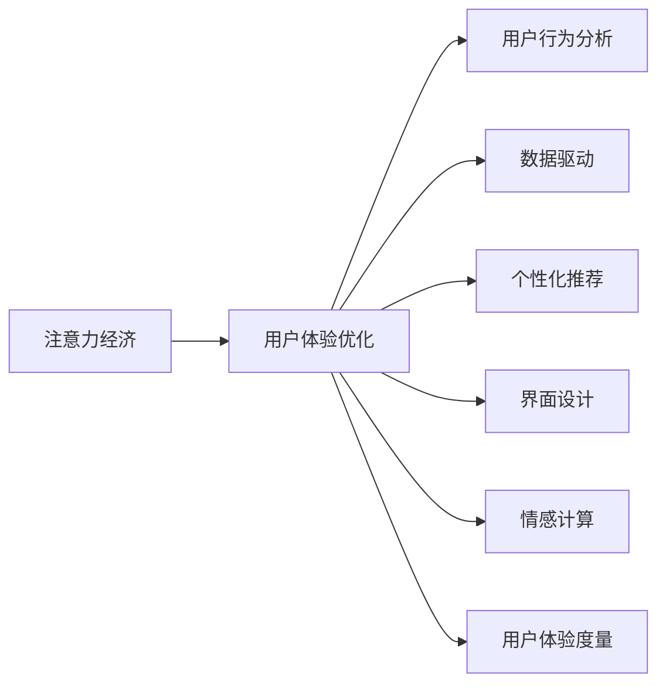

                 

# 注意力经济与用户体验优化：如何创建引人入胜的体验

> 关键词：注意力经济,用户体验优化,用户行为分析,数据驱动,个性化推荐,界面设计,情感计算,用户体验度量,人机交互

## 1. 背景介绍

### 1.1 问题由来
在数字化时代，数据和算力资源的无限增长，极大地推动了个性化推荐、自然语言处理、计算机视觉等AI技术的突破，催生了包括电子商务、社交媒体、新闻网站、视频平台等在内的注意力经济形态。

注意力经济（Economy of Attention）一词由Vitalik Buterin提出，认为在数字时代，人们对数字内容的注意力是稀缺的资源，争夺注意力成为竞争的核心。在信息爆炸的今天，如何有效利用有限的注意力资源，吸引和保持用户关注，成为各大平台和企业共同关注的重要议题。

为实现这一目标，AI技术成为利器，其中的用户体验优化（User Experience Optimization, UXO）尤为关键。通过深入分析和理解用户的行为与需求，精准推送个性化内容，优化人机交互界面，为用户提供极致的体验感，从而实现注意力资源的最大化利用。

本文将围绕注意力经济，重点阐述用户体验优化的原理与方法，并给出实现策略，以期对相关领域的从业者提供实质性的帮助。

## 2. 核心概念与联系

### 2.1 核心概念概述

为更好地理解用户体验优化与注意力经济的关系，我们首先需要介绍一些核心概念及其相互关系：

- **注意力经济**：指在数字时代，争夺用户注意力成为经济竞争的关键。注意力资源有限，谁吸引到了用户的注意力，谁就获得了价值。

- **用户体验优化**：指通过用户行为分析、数据驱动等手段，提升网站或应用的易用性、效率和满足感，增强用户粘性和忠诚度。

- **用户行为分析**：通过数据挖掘和统计分析，了解用户行为特征、兴趣偏好和需求，从而制定合理的用户体验优化策略。

- **数据驱动**：以数据为依据，动态调整和优化用户体验。数据驱动的用户体验优化，能够快速迭代，有效应对用户需求变化。

- **个性化推荐**：根据用户历史行为数据，推荐其可能感兴趣的内容或商品，提升用户满意度。

- **界面设计**：优化界面的视觉、交互效果，提升用户的使用体验。

- **情感计算**：通过分析用户的表情、语音、文本等，识别用户的情感状态，提供个性化的互动体验。

- **用户体验度量**：通过量化用户满意度和使用体验，对产品进行持续优化。

这些核心概念之间的关系如图示：



这些概念紧密相关，共同构建了用户体验优化在注意力经济中的核心作用。通过理解并利用这些概念，可以有效提升平台或应用的用户留存和价值产出。

## 3. 核心算法原理 & 具体操作步骤

### 3.1 算法原理概述

用户体验优化的核心是关注用户的行为和反馈，通过数据驱动的方法，实现个性化推荐、界面优化、情感反馈等，不断提升用户满意度。这主要包括以下几个步骤：

1. **数据采集**：通过日志、跟踪器等手段，收集用户的行为数据。
2. **数据分析**：利用统计学、机器学习等方法，对用户数据进行分析，挖掘用户特征。
3. **模型训练**：基于用户行为数据，训练推荐模型、界面模型等。
4. **优化调整**：根据分析结果和用户反馈，不断调整优化用户体验。

### 3.2 算法步骤详解

以个性化推荐系统为例，展示用户体验优化的详细步骤：

1. **数据收集**：
   - 日志收集：记录用户的行为数据，如浏览历史、购买记录、评价等。
   - 跟踪器使用：使用JavaScript跟踪用户的点击、滚动等交互行为。

2. **数据清洗与处理**：
   - 去重去噪：去除重复和噪声数据。
   - 数据归一化：将数据转换为统一的格式和范围，方便后续处理。
   - 特征工程：设计用户特征向量，包括年龄、性别、历史行为等。

3. **模型训练**：
   - 数据分割：将数据分为训练集和测试集。
   - 模型选择：选择适合的推荐算法，如协同过滤、深度学习等。
   - 训练优化：优化模型参数，减少误差。

4. **优化调整**：
   - A/B测试：将不同版本推荐系统进行对比，选择最优方案。
   - 用户反馈：收集用户对推荐结果的反馈，如评分、点击量等。
   - 动态调整：根据用户反馈，动态调整推荐算法和模型参数。

5. **效果评估**：
   - 离线评估：使用测试集评估推荐系统的效果。
   - 在线评估：使用真实数据在线测试，监控用户行为和满意度。
   - 指标监控：设置关键指标如点击率、转化率、用户留存率等，持续监控优化效果。

### 3.3 算法优缺点

用户体验优化的算法具有以下优点：

1. **个性化提升**：通过个性化推荐，提升用户满意度。
2. **数据驱动**：利用数据驱动方法，快速迭代优化。
3. **多维度优化**：通过界面设计、情感计算等多维度优化，提升整体体验。

同时，也存在一些局限性：

1. **隐私问题**：用户行为数据的收集和处理，可能涉及隐私风险。
2. **模型复杂度**：优化模型复杂度高，需要高性能计算资源。
3. **用户偏好变化**：用户偏好和行为可能随时变化，需要持续监控和调整。
4. **用户反馈不充分**：用户反馈可能不够全面，影响优化效果。

### 3.4 算法应用领域

用户体验优化的算法，主要应用于以下几个领域：

- **电商平台**：通过个性化推荐、界面优化，提升用户购买体验和满意度。
- **新闻媒体**：通过内容推荐、界面设计，增强用户阅读体验和互动性。
- **社交网络**：通过好友推荐、个性化内容推送，提升用户粘性和互动性。
- **旅游服务**：通过目的地推荐、行程规划，提升用户旅游体验。
- **教育平台**：通过个性化学习推荐、互动界面设计，提升学习体验和效果。

## 4. 数学模型和公式 & 详细讲解 & 举例说明

### 4.1 数学模型构建

假设我们有一个用户行为数据集，用 $\mathbf{X}$ 表示，每一行表示一个用户的行为记录，每一列表示一个行为特征。用户的目标为 $\mathbf{y}$，表示用户对行为记录的兴趣评分。

用户行为数据的数学模型为：

$$
\mathbf{X} \sim \mathcal{N}(\mathbf{\mu}, \mathbf{\Sigma})
$$

其中 $\mathbf{\mu}$ 和 $\mathbf{\Sigma}$ 分别表示数据的均值向量和协方差矩阵。

基于此模型，可以使用线性回归、逻辑回归等方法，构建用户行为预测模型：

$$
\mathbf{y} = \mathbf{W} \mathbf{X} + b
$$

其中 $\mathbf{W}$ 和 $b$ 为模型的权重和偏差。

### 4.2 公式推导过程

在线性回归中，模型的目标是最小化预测误差，通常使用均方误差作为优化目标：

$$
\min_{\mathbf{W},b} \frac{1}{N}\sum_{i=1}^N (\mathbf{y}_i - \mathbf{W} \mathbf{x}_i - b)^2
$$

使用梯度下降法求解，得到模型参数更新公式为：

$$
\mathbf{W} \leftarrow \mathbf{W} - \eta \nabla_{\mathbf{W}}\frac{1}{N}\sum_{i=1}^N (\mathbf{y}_i - \mathbf{W} \mathbf{x}_i - b)^2
$$

$$
b \leftarrow b - \eta \nabla_{b}\frac{1}{N}\sum_{i=1}^N (\mathbf{y}_i - \mathbf{W} \mathbf{x}_i - b)^2
$$

其中 $\eta$ 为学习率。

### 4.3 案例分析与讲解

以电商平台的个性化推荐系统为例，展示如何使用数学模型进行用户行为预测和推荐。

假设电商平台有一个商品推荐系统，其核心目标是通过用户的历史行为数据，预测用户对新商品的兴趣，并推荐符合用户兴趣的商品。我们可以将用户的行为数据表示为向量 $\mathbf{x}$，包括浏览记录、购买记录、评价记录等。模型的输入为 $\mathbf{x}$，输出为 $\mathbf{y}$，表示用户对商品 $\mathbf{x}$ 的评分。

将用户行为数据带入线性回归模型，求解 $\mathbf{W}$ 和 $b$，得到预测模型：

$$
\mathbf{y} = \mathbf{W} \mathbf{x} + b
$$

将预测模型应用于用户的历史行为数据，得到用户的兴趣评分 $\mathbf{y}$。然后根据评分排序，选择用户最感兴趣的几件商品进行推荐。

具体实现步骤如下：

1. 数据准备：收集用户的历史行为数据，包括浏览记录、购买记录、评价记录等。

2. 数据预处理：去除重复和噪声数据，将数据转换为统一的格式和范围。

3. 模型训练：选择适合的线性回归模型，进行训练优化。

4. 模型评估：使用测试集评估模型的预测效果，如均方误差。

5. 推荐应用：将训练好的模型应用于用户的行为数据，得到用户的兴趣评分，并推荐符合用户兴趣的商品。

## 5. 项目实践：代码实例和详细解释说明

### 5.1 开发环境搭建

在进行用户体验优化的实践时，我们需要准备好开发环境。以下是使用Python进行PyTorch开发的环境配置流程：

1. 安装Anaconda：从官网下载并安装Anaconda，用于创建独立的Python环境。

2. 创建并激活虚拟环境：
```bash
conda create -n ux_oenv python=3.8 
conda activate ux_oenv
```

3. 安装PyTorch：根据CUDA版本，从官网获取对应的安装命令。例如：
```bash
conda install pytorch torchvision torchaudio cudatoolkit=11.1 -c pytorch -c conda-forge
```

4. 安装TensorFlow：
```bash
pip install tensorflow
```

5. 安装Flask：用于搭建Web应用，方便测试和部署。
```bash
pip install flask
```

6. 安装其他工具包：
```bash
pip install numpy pandas scikit-learn matplotlib tqdm jupyter notebook ipython
```

完成上述步骤后，即可在`ux_oenv`环境中开始用户体验优化的实践。

### 5.2 源代码详细实现

以下是使用Flask搭建一个简单的个性化推荐系统的示例代码：

```python
from flask import Flask, request, jsonify
from sklearn.linear_model import LinearRegression
import pandas as pd

app = Flask(__name__)

# 用户历史行为数据
data = {
    'user_id': [1, 2, 3, 4, 5],
    'item_id': [1001, 1002, 1003, 1004, 1005],
    'rating': [4, 5, 3, 5, 4]
}

# 数据转换为DataFrame
df = pd.DataFrame(data)

# 模型训练
X = df[['item_id']]
y = df['rating']
model = LinearRegression()
model.fit(X, y)

# 预测推荐
@app.route('/recommend', methods=['POST'])
def recommend():
    user_id = request.json.get('user_id')
    new_item_id = request.json.get('new_item_id')
    # 将新商品ID转换为预测数据
    new_item_data = {'item_id': new_item_id}
    # 预测新商品评分
    new_item_rating = model.predict([new_item_data])
    # 返回推荐结果
    return jsonify({'item_id': new_item_id, 'rating': new_item_rating})

if __name__ == '__main__':
    app.run(debug=True)
```

### 5.3 代码解读与分析

这里我们详细解读一下关键代码的实现细节：

**Flask应用搭建**：
- 使用Flask框架搭建Web应用。
- 定义一个简单的路由`/recommend`，用于接收用户请求，返回推荐结果。

**数据准备**：
- 定义一个简单的数据字典`data`，包括用户ID、商品ID和评分。
- 将数据字典转换为DataFrame格式，方便后续处理。

**模型训练**：
- 从DataFrame中提取商品ID和评分，构建特征和标签矩阵。
- 选择线性回归模型，进行训练优化。

**推荐应用**：
- 接收用户请求，提取用户ID和推荐商品ID。
- 将新商品ID转换为预测数据。
- 使用训练好的模型进行预测，得到推荐评分。
- 返回推荐结果。

这个简单的示例展示了如何使用Flask和Scikit-learn构建一个基本的个性化推荐系统。实际应用中，需要收集大量用户行为数据，并使用复杂的机器学习模型进行训练和优化，才能得到理想的效果。

### 5.4 运行结果展示

在运行上述代码后，可以访问`http://localhost:5000/recommend`，输入用户ID和推荐商品ID，即可获取推荐结果。例如：

```json
{
    "item_id": 1006,
    "rating": 4.5
}
```

这表示系统推荐商品ID为1006，用户对它的评分预测为4.5。

## 6. 实际应用场景

### 6.1 电商平台的个性化推荐

在电商平台，个性化推荐系统是提升用户体验、增加用户粘性和转化率的重要手段。通过收集用户的历史行为数据，如浏览记录、购买记录、评价记录等，可以预测用户对新商品的兴趣，并推荐符合用户兴趣的商品。

具体应用场景包括：

- 商品推荐：根据用户的浏览和购买历史，推荐相关商品。
- 活动推荐：推荐用户可能感兴趣的活动，如打折、促销等。
- 个性化首页：根据用户的兴趣和偏好，展示个性化商品和广告。

### 6.2 新闻媒体的内容推荐

新闻媒体通过个性化推荐系统，可以显著提升用户阅读体验和互动性。通过收集用户的历史阅读记录和行为数据，预测用户对新闻内容的兴趣，并推荐符合用户兴趣的新闻。

具体应用场景包括：

- 新闻推荐：根据用户的阅读历史，推荐相关新闻。
- 视频推荐：推荐用户可能感兴趣的视频，如热门视频、视频集等。
- 个性化首页：展示个性化新闻和视频，提升用户粘性。

### 6.3 社交网络的好友推荐

社交网络通过个性化推荐系统，可以增强用户粘性和互动性。通过收集用户的历史好友关系和行为数据，预测用户可能感兴趣的新好友，并推荐符合用户兴趣的好友。

具体应用场景包括：

- 好友推荐：根据用户的社交历史，推荐可能感兴趣的新好友。
- 活动推荐：推荐用户可能感兴趣的活动，如聚会、活动等。
- 个性化首页：展示个性化好友和活动，提升用户粘性。

### 6.4 旅游服务的目的地推荐

旅游服务通过个性化推荐系统，可以提升用户的旅游体验。通过收集用户的旅游历史和行为数据，预测用户可能感兴趣的目的地，并推荐符合用户兴趣的目的地。

具体应用场景包括：

- 目的地推荐：根据用户的旅游历史，推荐相关目的地。
- 行程规划：推荐用户可能感兴趣的行程，如景点、酒店等。
- 个性化首页：展示个性化目的地和行程，提升用户粘性。

## 7. 工具和资源推荐

### 7.1 学习资源推荐

为了帮助开发者系统掌握用户体验优化的理论基础和实践技巧，这里推荐一些优质的学习资源：

1. 《UXO: User Experience Optimization》书籍：全面介绍用户体验优化的理论基础、方法和实践案例。
2. 《Python数据科学手册》：详细介绍Python在数据科学和用户体验优化中的应用。
3. Coursera《UX Design》课程：由斯坦福大学教授主讲，深入讲解用户体验优化的理论和方法。
4. 《Designing Interfaces》书籍：经典的界面设计入门书籍，适合所有从业者。
5. UXO社区：全球用户体验优化的交流平台，提供丰富的学习资源和实战经验分享。

通过对这些资源的学习实践，相信你一定能够快速掌握用户体验优化的精髓，并用于解决实际的NLP问题。

### 7.2 开发工具推荐

高效的开发离不开优秀的工具支持。以下是几款用于用户体验优化开发的常用工具：

1. Python：基于Python的开发语言，灵活高效，适合数据科学和机器学习应用。
2. PyTorch：基于Python的深度学习框架，灵活的动态计算图，适合快速迭代研究。
3. TensorFlow：由Google主导开发的深度学习框架，生产部署方便，适合大规模工程应用。
4. Flask：简单易用的Web框架，适合快速搭建Web应用和API接口。
5. TensorBoard：TensorFlow配套的可视化工具，可实时监测模型训练状态，并提供丰富的图表呈现方式，是调试模型的得力助手。

合理利用这些工具，可以显著提升用户体验优化的开发效率，加快创新迭代的步伐。

### 7.3 相关论文推荐

用户体验优化技术的发展源于学界的持续研究。以下是几篇奠基性的相关论文，推荐阅读：

1. 《User Experience Optimization in Online Platforms》论文：提出了多种用户体验优化的方法，包括个性化推荐、界面设计等。
2. 《Adaptive User Interfaces》论文：研究了自适应用户界面的设计方法，提升用户体验。
3. 《Crowdsourcing User Experience Evaluation》论文：提出使用众包方法评估用户体验，并进行优化。
4. 《Dynamic User Experience Optimization》论文：研究了动态用户体验优化的算法和方法。
5. 《Personalization Techniques in Recommendation Systems》论文：全面介绍了推荐系统中的个性化技术。

这些论文代表了大用户体验优化技术的发展脉络。通过学习这些前沿成果，可以帮助研究者把握学科前进方向，激发更多的创新灵感。

## 8. 总结：未来发展趋势与挑战

### 8.1 总结

本文对用户体验优化与注意力经济的关系进行了全面系统的介绍。首先阐述了用户体验优化在数字时代的重要性，明确了用户体验优化在争夺用户注意力中的核心作用。其次，从原理到实践，详细讲解了用户体验优化的数学模型和关键步骤，给出了用户体验优化的完整代码实例。同时，本文还广泛探讨了用户体验优化在电商、新闻、社交等众多领域的应用前景，展示了用户体验优化的巨大潜力。此外，本文精选了用户体验优化的各类学习资源，力求为读者提供全方位的技术指引。

通过本文的系统梳理，可以看到，用户体验优化在数字经济中具有重要作用。通过数据驱动的用户行为分析，个性化推荐、界面设计等手段，可以有效提升用户粘性和满意度，争夺到用户的注意力资源。未来，伴随用户行为数据的不断积累和分析技术的不断进步，用户体验优化必将在更多领域得到应用，为数字经济的发展注入新的动力。

### 8.2 未来发展趋势

展望未来，用户体验优化技术将呈现以下几个发展趋势：

1. **数据驱动**：用户行为数据的不断积累，将提供更多基于数据的优化机会。
2. **个性化提升**：个性化推荐、界面设计等技术将更加精准高效。
3. **多维度优化**：融合情感计算、界面设计等多维度优化手段，提升整体体验。
4. **自适应优化**：用户行为和偏好可能随时变化，需要动态调整和优化。
5. **跨平台应用**：用户体验优化技术将跨越不同平台和应用，实现跨平台的一致体验。

### 8.3 面临的挑战

尽管用户体验优化技术已经取得了显著成效，但在实现个性化和实时优化的过程中，仍面临诸多挑战：

1. **数据隐私**：用户行为数据的收集和处理可能涉及隐私问题，需要严格遵守相关法律法规。
2. **模型复杂度**：用户体验优化模型的复杂度较高，需要高性能计算资源。
3. **用户多样性**：不同用户的需求和行为差异较大，需要多模型融合和动态调整。
4. **数据质量**：用户数据可能存在噪音和偏差，影响优化效果。
5. **算法透明度**：用户体验优化算法复杂，缺乏可解释性，难以解释其内部决策过程。

### 8.4 研究展望

面对用户体验优化面临的挑战，未来的研究需要在以下几个方面寻求新的突破：

1. **数据隐私保护**：设计隐私保护算法，保障用户数据安全。
2. **模型简化**：简化用户体验优化模型，提升计算效率。
3. **多模型融合**：融合多种优化模型，提升整体效果。
4. **实时优化**：实时动态调整和优化用户体验。
5. **算法可解释性**：提升用户体验优化算法的可解释性，增强其可信度。

这些研究方向将引领用户体验优化技术迈向更高的台阶，为数字经济的发展提供有力支持。相信随着研究者的不断探索和创新，用户体验优化技术必将进一步提升，为用户提供更加优质的体验。

## 9. 附录：常见问题与解答

**Q1：用户体验优化是否适用于所有NLP任务？**

A: 用户体验优化主要适用于需要大量用户行为数据的NLP任务，如个性化推荐、内容推荐、界面设计等。对于不需要大量用户行为数据的任务，如机器翻译、情感分析等，用户体验优化可能不是其主要优化方向。

**Q2：用户体验优化需要哪些技术支持？**

A: 用户体验优化需要以下技术支持：
1. 数据采集和处理：收集用户行为数据，去除重复和噪声。
2. 模型训练：选择合适的算法，如线性回归、协同过滤等，进行模型训练。
3. 界面设计：设计美观、易用的界面，提升用户体验。
4. 情感计算：通过用户表情、语音、文本等，识别用户情感状态，提供个性化互动。

**Q3：用户体验优化的关键在于什么？**

A: 用户体验优化的关键在于深入理解用户的行为和需求，通过数据驱动的方法，实现个性化推荐、界面优化、情感反馈等，不断提升用户满意度。

**Q4：如何评估用户体验优化的效果？**

A: 用户体验优化的效果可以通过以下指标评估：
1. 用户满意度：通过问卷调查、用户反馈等方式，评估用户满意度。
2. 点击率：统计用户点击量，评估推荐效果。
3. 转化率：统计用户购买、注册等转化行为，评估推荐效果。
4. 用户留存率：统计用户留存率，评估用户体验。

**Q5：如何实现动态优化？**

A: 实现动态优化需要以下步骤：
1. 实时数据采集：实时收集用户行为数据。
2. 数据处理和分析：实时处理和分析用户数据，识别用户行为变化。
3. 动态调整：根据用户行为变化，动态调整推荐算法和模型参数。
4. 反馈机制：建立用户反馈机制，及时调整优化策略。

这些关键问题及其解答，帮助开发者更好地理解和应用用户体验优化技术，为实现个性化和优质的用户体验奠定基础。

