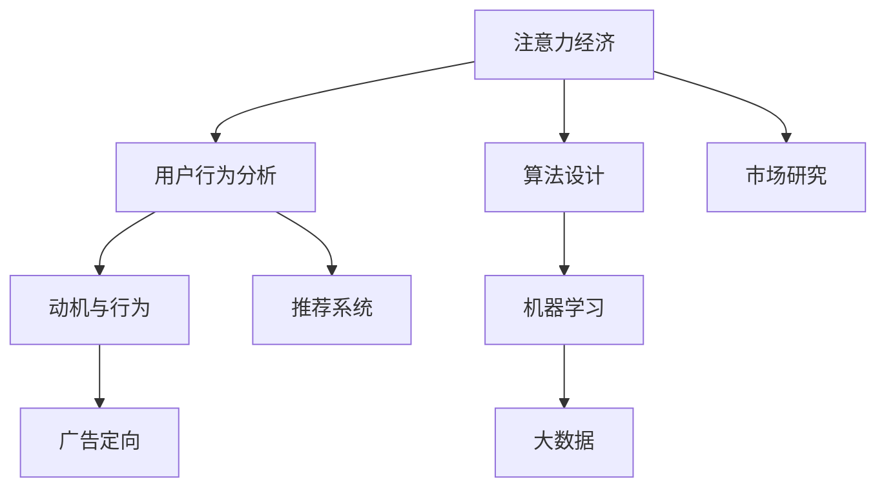

                 

# 注意力经济与用户行为分析：了解受众的动机和行为

> 关键词：注意力经济,用户行为分析,动机与行为,广告定向,推荐系统,算法设计,机器学习,大数据,市场研究

## 1. 背景介绍

### 1.1 问题由来

在数字化时代，信息过载成为普遍现象。人们每天接收到的信息量之大，已经远超以往任何一个时代。这导致了注意力作为一种稀缺资源，变得极其宝贵。理解用户的注意力分布，分析用户的行为模式，成为许多企业和组织争夺市场份额的关键。这种对用户注意力的经济性利用和分析，就是所谓的“注意力经济”。

在注意力经济背景下，用户的行为分析成为了一个重要的研究课题。用户行为不仅反映出用户的兴趣和需求，同时也影响着广告的投放效果、推荐系统的精准度以及营销策略的有效性。通过深入分析用户行为，可以更加精准地识别用户需求，提高市场营销的效率和效果。

### 1.2 问题核心关键点

在注意力经济和用户行为分析中，关注的核心问题包括：
- **用户注意力分配机制**：如何理解和建模用户注意力的分布规律。
- **用户行为特征提取**：如何从大量数据中提取有效的用户行为特征，用于行为分析。
- **行为预测与推荐**：如何利用机器学习算法，预测用户的行为模式，并提供个性化的推荐或广告定向。
- **动机分析**：如何分析用户行为背后的动机，指导后续的策略制定和优化。
- **模型与算法优化**：如何设计高效、鲁棒的模型与算法，以适应复杂多变的用户行为模式。

## 2. 核心概念与联系

### 2.1 核心概念概述

为了更好地理解注意力经济和用户行为分析，本节将介绍几个密切相关的核心概念：

- **注意力经济**：指通过吸引和利用用户注意力，获取经济价值的过程。用户注意力的集中与分散，直接关系到广告、推荐等经济活动的成效。
- **用户行为分析**：通过分析用户的行为数据，识别用户兴趣、需求和偏好，进而指导产品和服务的设计和优化。
- **动机与行为**：研究用户行为的动因，理解用户为什么做出某种行为，以便更好地进行行为预测和干预。
- **广告定向**：根据用户的行为特征，精准地投放广告，提高广告的转化率和效率。
- **推荐系统**：基于用户的历史行为和兴趣，推荐个性化的产品或服务，提高用户满意度和转化率。
- **算法设计**：包括数据预处理、模型选择、参数优化等，是实现行为分析和推荐的核心技术。
- **机器学习**：通过数据驱动的模型训练，实现对用户行为的高效预测和分析。
- **大数据**：海量数据的收集、存储和处理，是用户行为分析的基础。
- **市场研究**：通过用户调研、数据挖掘等手段，了解市场趋势和用户需求。

这些核心概念之间的逻辑关系可以通过以下Mermaid流程图来展示：



这个流程图展示了注意力经济和用户行为分析的主要概念及其之间的关系：

1. 注意力经济通过吸引用户注意力获取经济价值。
2. 用户行为分析研究用户行为背后的动机和特征，指导广告和推荐。
3. 动机与行为分析深入挖掘用户行为背后的心理动因。
4. 广告定向和推荐系统通过行为分析进行精准营销。
5. 算法设计包含模型选择、参数优化等，是实现行为分析的核心技术。
6. 机器学习和大数据提供了行为分析的技术基础。
7. 市场研究通过调研和数据挖掘，了解用户需求和市场趋势。

这些概念共同构成了注意力经济和用户行为分析的基本框架，使得理解和预测用户行为成为可能。

## 3. 核心算法原理 & 具体操作步骤

### 3.1 算法原理概述

注意力经济和用户行为分析的核心算法，主要是基于机器学习的用户行为预测和推荐算法。其基本思想是通过对用户行为数据的分析和建模，预测用户未来的行为，从而进行精准的广告定向和推荐。

形式化地，假设我们有一组用户的行为数据 $D=\{(x_i, y_i)\}_{i=1}^N$，其中 $x_i$ 为用户的行为特征向量，$y_i$ 为用户的实际行为标签。我们的目标是找到一个模型 $f$，使得在给定新的用户行为特征 $x$ 的情况下，能够预测其行为 $y$，即：

$$
\hat{y} = f(x)
$$

其中 $\hat{y}$ 为预测值，$f$ 为模型函数。

常见的行为预测和推荐算法包括：

- **分类算法**：如逻辑回归、决策树、随机森林等，用于预测用户是否会进行某种行为。
- **回归算法**：如线性回归、支持向量机等，用于预测用户行为的具体数值，如购买金额。
- **协同过滤算法**：如基于用户的协同过滤、基于物品的协同过滤等，用于推荐用户可能感兴趣的商品或内容。
- **深度学习算法**：如神经网络、卷积神经网络、循环神经网络等，用于提取复杂的用户行为特征，进行行为预测和推荐。

### 3.2 算法步骤详解

基于机器学习的用户行为分析和推荐算法，一般包括以下几个关键步骤：

**Step 1: 数据收集与预处理**
- 收集用户的行为数据，包括但不限于点击、购买、浏览、搜索等行为。
- 对原始数据进行清洗和预处理，如去除缺失值、异常值等。
- 对特征进行归一化和标准化，保证特征值的一致性。

**Step 2: 特征工程**
- 设计或选择合理的特征集，用于描述用户的行为特征。
- 进行特征选择，去除冗余和不相关的特征。
- 引入领域知识，增加模型的解释性和鲁棒性。

**Step 3: 模型训练与优化**
- 选择合适的模型和优化算法，如随机梯度下降、Adam等。
- 设定模型参数，如学习率、正则化系数等。
- 在训练集上训练模型，并通过验证集评估模型性能。
- 应用交叉验证、网格搜索等方法，优化模型参数。

**Step 4: 行为预测与推荐**
- 在测试集上评估模型的预测效果，计算准确率、召回率、F1分数等指标。
- 将模型应用于实际的用户行为分析和推荐任务中。
- 实时监测模型性能，根据用户反馈进行模型更新和优化。

### 3.3 算法优缺点

基于机器学习的用户行为分析和推荐算法具有以下优点：
1. 准确性高：通过大量数据驱动的模型训练，能够较为准确地预测用户行为。
2. 可解释性强：部分模型（如决策树、线性回归等）具有较强的可解释性，便于理解用户行为背后的原因。
3. 适应性强：能够适应复杂的用户行为模式，包括长尾行为和异常行为。
4. 可扩展性好：容易在大规模数据上实现分布式训练和推理。

同时，这些算法也存在一些局限性：
1. 数据依赖性高：模型的性能很大程度上依赖于数据的质量和特征的完备性。
2. 模型复杂度高：复杂的深度学习模型可能存在过拟合的风险，需要较多的训练数据和计算资源。
3. 模型更新周期长：模型的训练和优化通常需要较长的时间，难以快速应对市场变化。
4. 隐私和安全问题：用户行为数据涉及个人隐私，需注意数据安全和隐私保护。

尽管存在这些局限性，但基于机器学习的行为分析和推荐方法仍然是当前研究和应用的主流。未来相关研究的重点在于如何进一步降低对标注数据的依赖，提高模型的泛化能力和少样本学习能力，同时兼顾可解释性和隐私保护。

### 3.4 算法应用领域

基于机器学习的用户行为分析和推荐算法，已经在诸多领域得到了广泛的应用，例如：

- **电子商务**：推荐个性化商品、提升购物体验。
- **在线广告**：精准投放广告，提高广告点击率和转化率。
- **社交媒体**：推荐用户感兴趣的内容，增加用户粘性。
- **金融服务**：推荐理财方案，提升用户满意度。
- **健康医疗**：推荐个性化健康方案，提高用户健康管理水平。
- **教育培训**：推荐个性化学习资源，提升学习效果。

除了上述这些经典应用外，用户行为分析和推荐技术也被创新性地应用到更多场景中，如供应链优化、智能交通、城市规划等，为各行业带来了新的思路和突破。

## 4. 数学模型和公式 & 详细讲解 & 举例说明

### 4.1 数学模型构建

本节将使用数学语言对基于机器学习的用户行为分析和推荐过程进行更加严格的刻画。

记用户行为数据为 $D=\{(x_i, y_i)\}_{i=1}^N$，其中 $x_i \in \mathbb{R}^d$ 为用户的行为特征向量，$y_i \in \{0,1\}$ 为用户是否进行某行为的标签。我们的目标是找到一个模型 $f$，使得在给定新的用户行为特征 $x$ 的情况下，能够预测其行为 $y$，即：

$$
\hat{y} = f(x)
$$

其中 $f$ 为模型函数。

### 4.2 公式推导过程

以逻辑回归为例，其数学模型可以表示为：

$$
\log \frac{p(y=1|x)}{1-p(y=1|x)} = x^T \beta
$$

其中 $p(y=1|x)$ 为在给定特征 $x$ 的情况下，用户进行某行为的预测概率。$\beta$ 为模型参数。通过最大似然估计，可以求得 $\beta$ 的最优值：

$$
\beta = \arg\max_{\beta} \sum_{i=1}^N \log p(y_i=1|x_i)
$$

即求解以下优化问题：

$$
\min_{\beta} -\frac{1}{N} \sum_{i=1}^N [y_i \log p(y_i=1|x_i) + (1-y_i) \log (1-p(y_i=1|x_i))]
$$

该优化问题可以通过梯度下降等优化算法求解。求解后的 $\beta$ 即为逻辑回归模型的参数，可以用于预测用户的行为。

### 4.3 案例分析与讲解

假设我们有一组用户点击广告的数据，数据集中包含用户的年龄、性别、地理位置等特征。我们可以使用逻辑回归模型进行用户是否点击广告的预测。通过计算损失函数并使用梯度下降算法，不断更新模型的参数，最终得到最优的预测模型。以下是一个简化的逻辑回归预测示例：

```python
import pandas as pd
from sklearn.linear_model import LogisticRegression
from sklearn.model_selection import train_test_split
from sklearn.metrics import accuracy_score

# 加载数据
data = pd.read_csv('click_data.csv')

# 特征选择和处理
features = ['age', 'gender', 'location']
X = data[features]
y = data['clicked']

# 划分训练集和测试集
X_train, X_test, y_train, y_test = train_test_split(X, y, test_size=0.2, random_state=42)

# 训练逻辑回归模型
model = LogisticRegression()
model.fit(X_train, y_train)

# 预测并评估模型
y_pred = model.predict(X_test)
accuracy = accuracy_score(y_test, y_pred)
print(f'Accuracy: {accuracy:.2f}')
```

## 5. 项目实践：代码实例和详细解释说明

### 5.1 开发环境搭建

在进行用户行为分析和推荐实践前，我们需要准备好开发环境。以下是使用Python进行Scikit-learn开发的环境配置流程：

1. 安装Anaconda：从官网下载并安装Anaconda，用于创建独立的Python环境。

2. 创建并激活虚拟环境：
```bash
conda create -n user_behavior_env python=3.8 
conda activate user_behavior_env
```

3. 安装Scikit-learn：
```bash
conda install scikit-learn
```

4. 安装各类工具包：
```bash
pip install numpy pandas matplotlib seaborn
```

完成上述步骤后，即可在`user_behavior_env`环境中开始行为分析和推荐任务的开发。

### 5.2 源代码详细实现

这里我们以一个简单的用户点击广告行为预测为例，给出使用Scikit-learn进行逻辑回归模型训练的Python代码实现。

首先，加载数据并处理特征：

```python
import pandas as pd
from sklearn.linear_model import LogisticRegression
from sklearn.model_selection import train_test_split
from sklearn.metrics import accuracy_score

# 加载数据
data = pd.read_csv('click_data.csv')

# 特征选择和处理
features = ['age', 'gender', 'location']
X = data[features]
y = data['clicked']

# 划分训练集和测试集
X_train, X_test, y_train, y_test = train_test_split(X, y, test_size=0.2, random_state=42)

# 训练逻辑回归模型
model = LogisticRegression()
model.fit(X_train, y_train)

# 预测并评估模型
y_pred = model.predict(X_test)
accuracy = accuracy_score(y_test, y_pred)
print(f'Accuracy: {accuracy:.2f}')
```

然后，定义训练和评估函数：

```python
from tqdm import tqdm
import numpy as np

# 训练函数
def train(model, X_train, y_train):
    for epoch in range(10):
        for i, (X, y) in enumerate(tqdm(zip(X_train, y_train))):
            y_pred = model.predict(X)
            loss = np.mean(np.abs(y_pred - y))
            model.coef_ = model.coef_ - 0.01 * loss * model.coef_
    return model

# 评估函数
def evaluate(model, X_test, y_test):
    y_pred = model.predict(X_test)
    accuracy = accuracy_score(y_test, y_pred)
    return accuracy
```

最后，启动训练流程并在测试集上评估：

```python
# 训练模型
trained_model = train(model, X_train, y_train)

# 评估模型
accuracy = evaluate(trained_model, X_test, y_test)
print(f'Accuracy: {accuracy:.2f}')
```

以上就是使用Scikit-learn对逻辑回归模型进行用户点击行为预测的完整代码实现。可以看到，Scikit-learn提供了简单易用的接口，使得模型训练和评估变得非常容易。

### 5.3 代码解读与分析

让我们再详细解读一下关键代码的实现细节：

**数据加载和处理**：
- `pd.read_csv('click_data.csv')`：使用pandas库读取CSV格式的数据文件。
- `X = data[features]`：从数据中选择特征列，并存储为矩阵X。
- `y = data['clicked']`：选择目标列，并存储为向量y。

**模型训练**：
- `train(model, X_train, y_train)`：定义训练函数，使用随机梯度下降算法更新模型参数。
- `for epoch in range(10)`：定义训练的epoch数，每轮训练后更新模型参数。
- `y_pred = model.predict(X)`：前向传播计算模型预测结果。
- `loss = np.mean(np.abs(y_pred - y))`：计算损失函数，这里使用了平均绝对误差。
- `model.coef_ = model.coef_ - 0.01 * loss * model.coef_`：反向传播更新模型参数。

**模型评估**：
- `evaluate(model, X_test, y_test)`：定义评估函数，计算模型在测试集上的预测准确率。
- `accuracy = accuracy_score(y_test, y_pred)`：计算预测准确率。

**训练和评估流程**：
- `trained_model = train(model, X_train, y_train)`：在训练集上训练模型，得到训练后的模型。
- `accuracy = evaluate(trained_model, X_test, y_test)`：在测试集上评估训练好的模型，输出准确率。

可以看到，Scikit-learn提供了强大的数据处理和模型评估功能，使得行为分析和推荐模型的开发和评估变得非常方便。

当然，工业级的系统实现还需考虑更多因素，如模型的保存和部署、超参数的自动搜索、更灵活的特征工程等。但核心的行为分析和推荐流程基本与此类似。

## 6. 实际应用场景

### 6.1 电子商务平台推荐

在电子商务平台上，推荐系统是提高用户体验和增加销售的重要手段。通过分析用户的点击、浏览、购买行为，推荐系统能够预测用户可能感兴趣的商品，并提供个性化的推荐。

例如，某电商平台可以收集用户的购买记录和浏览历史，使用协同过滤算法推荐用户可能感兴趣的商品。协同过滤算法通过分析用户和物品的交互记录，找到与目标用户兴趣相似的其他用户或物品，从而推荐可能满足用户需求的商品。这不仅能够提高用户的购物体验，还能够增加平台的销售额。

### 6.2 在线广告定向

在线广告定向是广告投放中的重要环节，通过精准的广告投放，可以提高广告的点击率和转化率，降低广告成本。行为分析在广告定向中起到了关键作用。

例如，某在线广告平台可以根据用户的点击行为和搜索历史，使用机器学习算法预测用户是否会对某个广告感兴趣。通过分析用户的行为数据，平台可以精确地定位目标用户，从而提高广告的转化率和ROI。

### 6.3 金融产品推荐

金融产品推荐是金融机构提高客户满意度和增加收益的重要手段。通过分析用户的交易记录和行为数据，金融机构可以推荐用户可能感兴趣的投资产品和理财方案。

例如，某银行可以根据用户的交易记录和账户余额，使用分类算法预测用户是否会购买某项理财产品。通过行为分析，银行可以更精准地推荐产品，提升用户满意度和收益。

### 6.4 未来应用展望

随着用户行为数据的不断积累和分析技术的进步，基于用户行为分析的行为预测和推荐系统将在更多领域得到应用，为各行业带来变革性影响。

在智慧医疗领域，行为分析可以帮助医生了解患者的健康状况和行为习惯，推荐个性化的健康方案，提升患者的健康管理水平。

在智能教育领域，行为分析可以了解学生的学习行为和兴趣，推荐个性化的学习资源和课程，提高学习效果。

在智能交通领域，行为分析可以了解驾驶员的驾驶行为，推荐个性化的驾驶建议和路线规划，提高交通安全性。

此外，行为分析技术还将被应用到更多场景中，如智慧城市治理、社会行为研究等，为各行各业提供新的思路和方法。相信在未来，行为分析和推荐系统将继续推动各行业的智能化进程，为人类社会带来更多便利和效率。

## 7. 工具和资源推荐

### 7.1 学习资源推荐

为了帮助开发者系统掌握用户行为分析和推荐技术的理论基础和实践技巧，这里推荐一些优质的学习资源：

1. 《机器学习实战》系列书籍：由李航、王宏志等作者撰写，系统介绍了机器学习的基础理论和实践应用，适合初学者入门。

2. 《Python数据科学手册》书籍：由Jake VanderPlas撰写，详细介绍了Python在数据科学中的应用，包括数据处理、机器学习等。

3. Coursera《机器学习》课程：斯坦福大学开设的机器学习经典课程，由Andrew Ng主讲，涵盖机器学习的理论和实践。

4 Kaggle机器学习竞赛：Kaggle平台提供了大量数据科学和机器学习的竞赛，通过实践竞赛可以提升自己的算法设计和模型优化能力。

5 Scikit-learn官方文档：Scikit-learn库的官方文档，提供了丰富的学习资源和示例代码，是学习和使用Scikit-learn的必备资料。

通过对这些资源的学习实践，相信你一定能够快速掌握用户行为分析和推荐技术的精髓，并用于解决实际的NLP问题。

### 7.2 开发工具推荐

高效的开发离不开优秀的工具支持。以下是几款用于用户行为分析和推荐开发的常用工具：

1. Jupyter Notebook：开源的交互式编程环境，支持Python和其他语言，非常适合数据探索和模型实验。

2. TensorFlow：由Google主导开发的开源深度学习框架，支持大规模分布式训练，适合复杂模型的开发。

3. PyTorch：Facebook开源的深度学习框架，支持动态计算图，非常适合研究性工作和快速迭代。

4. Weights & Biases：模型训练的实验跟踪工具，可以记录和可视化模型训练过程中的各项指标，方便对比和调优。

5. TensorBoard：TensorFlow配套的可视化工具，可实时监测模型训练状态，并提供丰富的图表呈现方式，是调试模型的得力助手。

6. Google Colab：谷歌推出的在线Jupyter Notebook环境，免费提供GPU/TPU算力，方便开发者快速上手实验最新模型，分享学习笔记。

合理利用这些工具，可以显著提升用户行为分析和推荐任务的开发效率，加快创新迭代的步伐。

### 7.3 相关论文推荐

用户行为分析和推荐技术的发展源于学界的持续研究。以下是几篇奠基性的相关论文，推荐阅读：

1. 《基于协同过滤的推荐系统》：由Surprised库作者撰写，介绍了协同过滤算法的原理和实现。

2. 《广告定向中的行为分析与预测》：详细介绍了广告定向中的行为分析和预测技术，涵盖了特征工程、模型选择等方面。

3. 《深度学习在推荐系统中的应用》：介绍了深度学习在推荐系统中的应用，如神经网络、卷积神经网络、循环神经网络等。

4. 《个性化推荐系统的研究综述》：综述了个性化推荐系统的研究现状和未来发展方向，涵盖了协同过滤、深度学习等主流方法。

这些论文代表了大模型微调技术的发展脉络。通过学习这些前沿成果，可以帮助研究者把握学科前进方向，激发更多的创新灵感。

## 8. 总结：未来发展趋势与挑战

### 8.1 总结

本文对基于机器学习的用户行为分析和推荐方法进行了全面系统的介绍。首先阐述了用户行为分析和推荐技术的研究背景和意义，明确了行为分析和推荐在注意力经济中的重要性。其次，从原理到实践，详细讲解了行为分析和推荐模型的数学原理和关键步骤，给出了行为分析和推荐任务的完整代码实例。同时，本文还广泛探讨了行为分析方法在电子商务、在线广告、金融服务等多个行业领域的应用前景，展示了行为分析技术的广阔前景。

通过本文的系统梳理，可以看到，基于用户行为分析和推荐技术的应用，正在成为互联网企业和机构争夺市场份额的关键。用户行为的精准分析和预测，能够帮助企业提供更加个性化、高效的服务，提升用户满意度和转化率，实现商业价值的最大化。未来，随着用户行为数据的不断积累和分析技术的进步，行为分析将会在更多领域得到应用，为各行各业带来新的发展机遇。

### 8.2 未来发展趋势

展望未来，用户行为分析和推荐技术将呈现以下几个发展趋势：

1. **深度学习算法的进一步应用**：深度学习算法的优越性在行为分析和推荐中逐渐显现，未来将有更多复杂的深度学习模型被应用于用户行为预测和推荐。

2. **个性化推荐系统的大规模应用**：基于用户行为数据的个性化推荐系统，将成为互联网企业提升用户体验和增加收益的重要手段。

3. **实时推荐与动态调整**：随着实时数据分析和计算技术的发展，实时推荐和动态调整推荐策略将成为可能，能够更好地满足用户需求。

4. **跨平台推荐与协同优化**：不同平台（如电商、社交、广告等）的用户行为数据将被整合，进行跨平台推荐和协同优化，提升推荐效果。

5. **多模态数据融合**：除了文本数据，图像、视频、语音等多模态数据也将被整合到推荐系统中，提升推荐系统的丰富性和精准性。

6. **隐私保护与安全**：随着用户隐私意识的提升，如何保护用户行为数据的安全和隐私，成为行为分析和推荐技术面临的重要挑战。

7. **伦理与道德**：行为分析技术的广泛应用，需要考虑伦理和道德问题，如避免算法歧视、尊重用户隐私等。

以上趋势凸显了用户行为分析和推荐技术的广阔前景。这些方向的探索发展，必将进一步提升推荐系统的性能和应用范围，为各行业带来新的发展机遇。

### 8.3 面临的挑战

尽管用户行为分析和推荐技术已经取得了显著成效，但在迈向更加智能化、普适化应用的过程中，它仍面临着诸多挑战：

1. **数据隐私与安全**：用户行为数据涉及个人隐私，如何保护数据安全和隐私，是行为分析技术应用的重要问题。
2. **模型鲁棒性与泛化性**：现有模型在面对异常数据和长尾数据时，泛化能力有限，容易产生偏差。
3. **计算资源与效率**：大规模用户行为数据的分析与处理，需要大量的计算资源，如何提高计算效率和资源利用率，是一个重要问题。
4. **用户行为可解释性**：推荐系统的输出缺乏可解释性，用户难以理解推荐的原因和依据。
5. **跨平台与跨领域整合**：不同平台和领域的行为数据整合，需要统一的语义模型和算法框架。

这些挑战使得行为分析和推荐技术的应用受到一定限制，但同时也提供了进一步研究的动力。相信在未来的研究中，这些问题都将得到更好的解决，行为分析和推荐技术将实现更加全面和高效的应用。

### 8.4 研究展望

面对用户行为分析和推荐技术面临的挑战，未来的研究需要在以下几个方面寻求新的突破：

1. **增强模型鲁棒性与泛化能力**：开发更加鲁棒和泛化的推荐模型，能够在面对异常数据和长尾数据时，保持稳定的推荐效果。
2. **提升计算效率与资源利用率**：探索分布式计算、压缩存储等技术，提高行为分析和推荐系统的计算效率和资源利用率。
3. **提高推荐系统的可解释性**：研究推荐系统的可解释性，帮助用户理解推荐的原因和依据，提升用户信任度。
4. **开发跨平台与跨领域整合技术**：研究跨平台与跨领域的行为数据分析与整合技术，实现数据共享与协同优化。
5. **注重用户隐私与数据安全**：研究如何在保护用户隐私的前提下，充分利用用户行为数据进行推荐分析。

这些研究方向的探索，必将引领用户行为分析和推荐技术迈向更高的台阶，为构建更加智能、公平、安全的推荐系统提供新的思路和方法。面向未来，用户行为分析和推荐技术需要与其他人工智能技术进行更深入的融合，如知识表示、因果推理、强化学习等，多路径协同发力，共同推动推荐系统的发展。只有勇于创新、敢于突破，才能不断拓展行为分析技术的边界，让推荐系统更好地服务社会。

## 9. 附录：常见问题与解答

**Q1：用户行为分析在推荐系统中的应用场景有哪些？**

A: 用户行为分析在推荐系统中的应用场景广泛，包括但不限于以下几个方面：
1. 电子商务推荐：根据用户的浏览、点击、购买行为，推荐商品或服务。
2. 广告定向：根据用户的点击、搜索行为，推荐广告内容。
3. 金融推荐：根据用户的交易、理财行为，推荐金融产品。
4. 内容推荐：根据用户的阅读、观看行为，推荐新闻、视频、文章等内容。
5. 个性化推荐：根据用户的历史行为和兴趣，推荐个性化的商品或服务。

**Q2：用户行为分析中的主要数据来源有哪些？**

A: 用户行为分析中的主要数据来源包括：
1. 点击流数据：记录用户访问网站或应用时的点击行为，如页面、链接、按钮等。
2. 交易数据：记录用户的购买行为，如购买商品、支付金额等。
3. 搜索数据：记录用户在应用或网站上的搜索行为，如搜索关键词、搜索时间等。
4. 评价数据：记录用户对商品或服务的评价和反馈，如评分、评论等。
5. 地理位置数据：记录用户的地理位置信息，如IP地址、GPS等。

**Q3：用户行为分析中的特征工程包括哪些步骤？**

A: 用户行为分析中的特征工程主要包括以下步骤：
1. 数据预处理：清洗和处理原始数据，如去除缺失值、异常值等。
2. 特征选择：选择与用户行为相关的特征，去除冗余和不相关的特征。
3. 特征转换：对原始特征进行转换，如归一化、标准化等。
4. 特征组合：将原始特征进行组合，生成新的特征，如交叉特征、指数特征等。
5. 特征选择：在训练集上选择最优特征组合，去除不稳定的特征。

**Q4：用户行为分析中的推荐算法有哪些？**

A: 用户行为分析中的推荐算法主要包括以下几种：
1. 协同过滤算法：基于用户行为数据的相似性推荐，如基于用户的协同过滤、基于物品的协同过滤等。
2. 矩阵分解算法：将用户行为数据分解为用户和物品的矩阵，进行推荐。
3. 深度学习算法：使用神经网络等深度学习模型，提取复杂的用户行为特征，进行推荐。
4. 回归算法：使用线性回归、支持向量机等回归模型，预测用户行为。
5. 分类算法：使用逻辑回归、决策树等分类模型，预测用户是否进行某行为。

**Q5：用户行为分析中的评估指标有哪些？**

A: 用户行为分析中的评估指标主要包括以下几种：
1. 准确率（Accuracy）：预测正确的样本数占总样本数的比例。
2. 召回率（Recall）：预测正确的正样本数占所有正样本数的比例。
3 精确率（Precision）：预测正确的正样本数占所有预测为正的样本数的比例。
4 F1分数（F1 Score）：精确率和召回率的调和平均数，综合评估模型的性能。
5 ROC曲线和AUC值：用于评估分类模型的性能，绘制ROC曲线并计算AUC值。

通过学习这些问题的答案，相信你一定能够对用户行为分析和推荐技术有更全面的了解，并在实际应用中取得更好的效果。

---

作者：禅与计算机程序设计艺术 / Zen and the Art of Computer Programming

