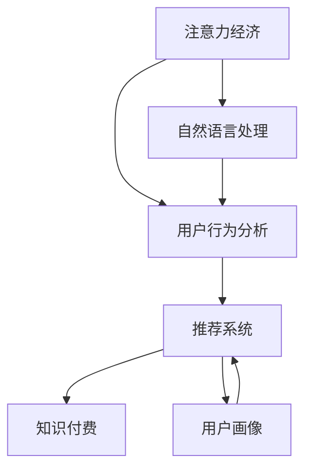

                 

# 注意力经济与知识付费的结合

## 1. 背景介绍

### 1.1 问题由来

随着互联网的快速发展和信息爆炸，注意力成为了一种稀缺资源。用户面对海量信息，难以从中获取有价值的内容。与此同时，知识付费平台的兴起，为高质量内容的获取提供了新的方式。因此，如何结合注意力经济和知识付费，实现内容与用户需求的精准对接，成为了当前研究的热点问题。

### 1.2 问题核心关键点

注意力经济与知识付费结合的核心在于以下几个关键点：

- 用户注意力模型：如何构建和利用用户对内容的态度模型，预测其消费行为。
- 内容推荐算法：如何在用户海量点击和互动数据基础上，构建高效推荐模型。
- 定价策略设计：如何设计科学合理的付费模型，实现内容变现。
- 用户体验优化：如何设计用户友好的界面和交互，提升用户体验。
- 数据隐私保护：如何在推荐算法和付费策略中保障用户数据隐私。

本文将围绕这些关键点，对注意力经济与知识付费结合的技术和应用进行全面探讨。

## 2. 核心概念与联系

### 2.1 核心概念概述

为更好地理解注意力经济与知识付费结合的方法，本节将介绍几个密切相关的核心概念：

- 注意力经济（Attention Economy）：指在信息爆炸时代，通过用户注意力分配的优化，实现高质量内容的价值最大化。

- 知识付费（Knowledge Paywall）：指用户为获取特定知识和技能，支付一定费用的服务模式。

- 推荐系统（Recommendation System）：指通过用户行为和内容特征，构建推荐模型，实现个性化内容推荐的系统。

- 用户画像（User Profile）：指基于用户历史行为数据，构建的多维度用户特征模型。

- 用户行为分析（User Behavior Analysis）：指对用户点击、浏览、购买等行为进行分析，以优化推荐模型。

- 自然语言处理（NLP）：指通过深度学习技术，从文本数据中提取和理解用户需求和内容特征，辅助推荐算法。

这些核心概念之间的逻辑关系可以通过以下Mermaid流程图来展示：

这个流程图展示了注意力经济与知识付费结合的核心概念及其之间的关系：

1. 注意力经济通过用户行为分析，构建推荐系统。
2. 推荐系统通过用户画像和自然语言处理，生成个性化推荐。
3. 个性化推荐结合用户付费，实现知识付费变现。

这些核心概念共同构成了注意力经济与知识付费结合的技术框架，有助于我们深入理解其背后的原理和应用场景。

## 3. 核心算法原理 & 具体操作步骤
### 3.1 算法原理概述

注意力经济与知识付费结合的核心算法原理，主要围绕以下几个方面展开：

- 用户注意力模型：通过分析用户行为数据，构建用户注意力模型，预测用户对内容的态度和点击行为。
- 推荐系统算法：利用用户注意力模型，构建个性化推荐算法，提升内容推荐效果。
- 定价策略设计：结合推荐效果和用户需求，设计科学合理的付费模型，实现内容变现。

### 3.2 算法步骤详解

#### 3.2.1 用户注意力模型的构建

用户注意力模型旨在通过用户行为数据，预测其对内容的兴趣和点击行为。通常，用户注意力模型基于以下步骤：

1. 数据收集：收集用户在不同内容上的点击、停留、购买等行为数据。
2. 特征工程：对行为数据进行特征工程，提取用户对内容的评分、点击率、停留时间等特征。
3. 模型训练：使用机器学习算法，训练用户注意力模型，如线性回归、决策树、深度学习等。
4. 预测与反馈：利用训练好的模型，对新内容进行用户兴趣预测，同时收集反馈数据，进一步优化模型。

#### 3.2.2 推荐系统算法的构建

推荐系统算法通过用户注意力模型，构建个性化推荐模型。以下是推荐系统的关键步骤：

1. 数据预处理：对用户和内容数据进行标准化处理，消除噪声和缺失值。
2. 模型选择：选择合适的推荐算法，如协同过滤、基于内容的推荐、深度学习推荐等。
3. 模型训练：利用用户注意力模型和内容特征，训练推荐模型。
4. 模型评估：在测试集上评估推荐模型的性能，如准确率、召回率、F1等指标。
5. 模型优化：根据评估结果，调整模型参数，优化推荐效果。

#### 3.2.3 定价策略设计

定价策略设计旨在根据推荐效果和用户需求，设计科学合理的付费模型。定价策略的主要步骤包括：

1. 需求分析：分析用户对不同内容的需求分布，确定付费内容的价格区间。
2. 模型训练：利用推荐系统的结果，训练定价模型，如线性回归、神经网络等。
3. 策略调整：根据定价模型和用户反馈，调整定价策略，确保内容变现效果。

### 3.3 算法优缺点

注意力经济与知识付费结合的算法具有以下优点：

- 提升内容价值：通过个性化推荐，将高质量内容推荐给最需要的用户，实现内容价值的最大化。
- 用户满意度提高：个性化推荐能提升用户体验，提高用户满意度。
- 精准定价：通过科学定价模型，实现内容与用户需求的精准对接，提高内容变现效率。

同时，该方法也存在一定的局限性：

- 数据依赖性强：推荐系统和定价策略高度依赖高质量标注数据，获取数据成本较高。
- 模型复杂度高：推荐系统和定价模型复杂度高，训练和部署成本较高。
- 用户隐私风险：在用户数据获取和处理过程中，存在隐私泄露的风险。
- 公平性问题：个性化推荐可能引发内容垄断，导致市场不公平竞争。

尽管存在这些局限性，但就目前而言，注意力经济与知识付费结合的算法仍是最主流的推荐方法。未来相关研究的重点在于如何进一步降低对标注数据的依赖，提高模型的可解释性和可解释性，同时兼顾用户隐私保护和市场公平性等因素。

### 3.4 算法应用领域

注意力经济与知识付费结合的算法已经在多个领域得到了广泛应用，例如：

- 在线教育：通过分析用户学习行为，推荐个性化的学习内容，实现知识付费变现。
- 金融服务：利用用户消费行为，推荐个性化金融产品，实现精准营销。
- 电子商务：基于用户购物行为，推荐个性化商品，提升销售额和用户满意度。
- 新闻媒体：通过分析用户阅读偏好，推荐个性化新闻内容，增加用户粘性。
- 健康医疗：利用用户健康数据，推荐个性化健康知识，实现健康付费服务。

除了上述这些经典应用外，注意力经济与知识付费结合的算法还将不断拓展到更多场景中，如智能家居、旅游推荐、体育赛事等，为数字化转型和智能化服务提供新的技术路径。

## 4. 数学模型和公式 & 详细讲解  
### 4.1 数学模型构建

本节将使用数学语言对注意力经济与知识付费结合的技术进行更加严格的刻画。

假设用户对内容的评分向量为 $u \in \mathbb{R}^N$，其中 $N$ 为内容总数。假设用户对内容的点击率向量为 $c \in \mathbb{R}^N$，其中 $c_i$ 表示用户对内容 $i$ 的点击次数与总点击次数的比值。

定义用户对内容的平均评分向量为 $\bar{u}=\frac{1}{N}\sum_{i=1}^N u_i$，用户对内容的平均点击率向量为 $\bar{c}=\frac{1}{N}\sum_{i=1}^N c_i$。

用户对内容的综合评分向量为 $v=\alpha u + (1-\alpha) \bar{u}$，其中 $\alpha \in [0,1]$ 为调节因子。

用户对内容的综合点击率向量为 $w=\beta c + (1-\beta) \bar{c}$，其中 $\beta \in [0,1]$ 为调节因子。

用户对内容的综合评分向量 $v$ 和综合点击率向量 $w$，用于构建用户注意力模型。

### 4.2 公式推导过程

根据上述定义，用户对内容 $i$ 的综合评分 $s_i$ 和综合点击率 $t_i$ 为：

$$
s_i = v_i = \alpha u_i + (1-\alpha) \bar{u}
$$

$$
t_i = w_i = \beta c_i + (1-\beta) \bar{c}
$$

用户对内容 $i$ 的综合评分 $s_i$ 和综合点击率 $t_i$ 的加权和 $a_i$ 为：

$$
a_i = \lambda s_i + (1-\lambda) t_i
$$

其中 $\lambda \in [0,1]$ 为调节因子。

用户对内容 $i$ 的综合评分 $a_i$ 的均值 $a$ 和标准差 $\sigma$ 为：

$$
a = \frac{1}{N} \sum_{i=1}^N a_i
$$

$$
\sigma = \sqrt{\frac{1}{N} \sum_{i=1}^N (a_i - a)^2}
$$

用户对内容 $i$ 的综合评分 $a_i$ 的归一化值 $n_i$ 为：

$$
n_i = \frac{a_i - a}{\sigma}
$$

用户对内容 $i$ 的综合评分 $n_i$ 的正态分布密度函数为：

$$
p(x_i) = \frac{1}{\sigma\sqrt{2\pi}} e^{-\frac{(x_i - a_i)^2}{2\sigma^2}}
$$

用户对内容 $i$ 的综合评分 $n_i$ 的累积分布函数为：

$$
F(x_i) = \int_{-\infty}^{x_i} p(x) dx
$$

用户对内容 $i$ 的综合评分 $n_i$ 的累积分布函数值 $P_i$ 为：

$$
P_i = F(n_i)
$$

用户对内容 $i$ 的综合评分 $n_i$ 的累积分布函数值 $P_i$ 的负对数似然函数为：

$$
L(P_i) = -\log P_i = \log \frac{1}{1 - P_i}
$$

用户对内容 $i$ 的综合评分 $n_i$ 的累积分布函数值 $P_i$ 的负对数似然函数 $L(P_i)$ 的均值 $\mu$ 为：

$$
\mu = \frac{1}{N} \sum_{i=1}^N L(P_i)
$$

用户对内容 $i$ 的综合评分 $n_i$ 的累积分布函数值 $P_i$ 的负对数似然函数 $L(P_i)$ 的标准差 $\sigma_L$ 为：

$$
\sigma_L = \sqrt{\frac{1}{N} \sum_{i=1}^N (L(P_i) - \mu)^2}
$$

用户对内容 $i$ 的综合评分 $n_i$ 的累积分布函数值 $P_i$ 的负对数似然函数 $L(P_i)$ 的归一化值 $n_L$ 为：

$$
n_L = \frac{L(P_i) - \mu}{\sigma_L}
$$

用户对内容 $i$ 的综合评分 $n_i$ 的累积分布函数值 $P_i$ 的负对数似然函数 $L(P_i)$ 的归一化值 $n_L$ 的正态分布密度函数为：

$$
q(x_i) = \frac{1}{\sigma_L\sqrt{2\pi}} e^{-\frac{(x_i - n_L)^2}{2\sigma_L^2}}
$$

用户对内容 $i$ 的综合评分 $n_i$ 的累积分布函数值 $P_i$ 的负对数似然函数 $L(P_i)$ 的归一化值 $n_L$ 的累积分布函数为：

$$
G(x_i) = \int_{-\infty}^{x_i} q(x) dx
$$

用户对内容 $i$ 的综合评分 $n_i$ 的累积分布函数值 $P_i$ 的负对数似然函数 $L(P_i)$ 的归一化值 $n_L$ 的累积分布函数值 $G(x_i)$ 的均值 $\mu_G$ 为：

$$
\mu_G = \frac{1}{N} \sum_{i=1}^N G(n_i)
$$

用户对内容 $i$ 的综合评分 $n_i$ 的累积分布函数值 $P_i$ 的负对数似然函数 $L(P_i)$ 的归一化值 $n_L$ 的累积分布函数值 $G(x_i)$ 的标准差 $\sigma_G$ 为：

$$
\sigma_G = \sqrt{\frac{1}{N} \sum_{i=1}^N (G(n_i) - \mu_G)^2}
$$

用户对内容 $i$ 的综合评分 $n_i$ 的累积分布函数值 $P_i$ 的负对数似然函数 $L(P_i)$ 的归一化值 $n_L$ 的累积分布函数值 $G(x_i)$ 的归一化值 $n_G$ 为：

$$
n_G = \frac{G(n_i) - \mu_G}{\sigma_G}
$$

用户对内容 $i$ 的综合评分 $n_i$ 的累积分布函数值 $P_i$ 的负对数似然函数 $L(P_i)$ 的归一化值 $n_L$ 的累积分布函数值 $G(x_i)$ 的归一化值 $n_G$ 的正态分布密度函数为：

$$
r(x_i) = \frac{1}{\sigma_G\sqrt{2\pi}} e^{-\frac{(x_i - n_G)^2}{2\sigma_G^2}}
$$

用户对内容 $i$ 的综合评分 $n_i$ 的累积分布函数值 $P_i$ 的负对数似然函数 $L(P_i)$ 的归一化值 $n_L$ 的累积分布函数值 $G(x_i)$ 的归一化值 $n_G$ 的累积分布函数为：

$$
H(x_i) = \int_{-\infty}^{x_i} r(x) dx
$$

用户对内容 $i$ 的综合评分 $n_i$ 的累积分布函数值 $P_i$ 的负对数似然函数 $L(P_i)$ 的归一化值 $n_L$ 的累积分布函数值 $G(x_i)$ 的归一化值 $n_G$ 的累积分布函数值 $H(x_i)$ 的均值 $\mu_H$ 为：

$$
\mu_H = \frac{1}{N} \sum_{i=1}^N H(n_i)
$$

用户对内容 $i$ 的综合评分 $n_i$ 的累积分布函数值 $P_i$ 的负对数似然函数 $L(P_i)$ 的归一化值 $n_L$ 的累积分布函数值 $G(x_i)$ 的归一化值 $n_G$ 的累积分布函数值 $H(x_i)$ 的标准差 $\sigma_H$ 为：

$$
\sigma_H = \sqrt{\frac{1}{N} \sum_{i=1}^N (H(n_i) - \mu_H)^2}
$$

用户对内容 $i$ 的综合评分 $n_i$ 的累积分布函数值 $P_i$ 的负对数似然函数 $L(P_i)$ 的归一化值 $n_L$ 的累积分布函数值 $G(x_i)$ 的归一化值 $n_G$ 的累积分布函数值 $H(x_i)$ 的归一化值 $n_H$ 为：

$$
n_H = \frac{H(n_i) - \mu_H}{\sigma_H}
$$

用户对内容 $i$ 的综合评分 $n_i$ 的累积分布函数值 $P_i$ 的负对数似然函数 $L(P_i)$ 的归一化值 $n_L$ 的累积分布函数值 $G(x_i)$ 的归一化值 $n_G$ 的累积分布函数值 $H(x_i)$ 的归一化值 $n_H$ 的正态分布密度函数为：

$$
k(x_i) = \frac{1}{\sigma_H\sqrt{2\pi}} e^{-\frac{(x_i - n_H)^2}{2\sigma_H^2}}
$$

用户对内容 $i$ 的综合评分 $n_i$ 的累积分布函数值 $P_i$ 的负对数似然函数 $L(P_i)$ 的归一化值 $n_L$ 的累积分布函数值 $G(x_i)$ 的归一化值 $n_G$ 的累积分布函数值 $H(x_i)$ 的归一化值 $n_H$ 的累积分布函数为：

$$
I(x_i) = \int_{-\infty}^{x_i} k(x) dx
$$

用户对内容 $i$ 的综合评分 $n_i$ 的累积分布函数值 $P_i$ 的负对数似然函数 $L(P_i)$ 的归一化值 $n_L$ 的累积分布函数值 $G(x_i)$ 的归一化值 $n_G$ 的累积分布函数值 $H(x_i)$ 的归一化值 $n_H$ 的累积分布函数值 $I(x_i)$ 的均值 $\mu_I$ 为：

$$
\mu_I = \frac{1}{N} \sum_{i=1}^N I(n_i)
$$

用户对内容 $i$ 的综合评分 $n_i$ 的累积分布函数值 $P_i$ 的负对数似然函数 $L(P_i)$ 的归一化值 $n_L$ 的累积分布函数值 $G(x_i)$ 的归一化值 $n_G$ 的累积分布函数值 $H(x_i)$ 的归一化值 $n_H$ 的累积分布函数值 $I(x_i)$ 的标准差 $\sigma_I$ 为：

$$
\sigma_I = \sqrt{\frac{1}{N} \sum_{i=1}^N (I(n_i) - \mu_I)^2}
$$

用户对内容 $i$ 的综合评分 $n_i$ 的累积分布函数值 $P_i$ 的负对数似然函数 $L(P_i)$ 的归一化值 $n_L$ 的累积分布函数值 $G(x_i)$ 的归一化值 $n_G$ 的累积分布函数值 $H(x_i)$ 的归一化值 $n_H$ 的累积分布函数值 $I(x_i)$ 的归一化值 $n_I$ 为：

$$
n_I = \frac{I(n_i) - \mu_I}{\sigma_I}
$$

用户对内容 $i$ 的综合评分 $n_i$ 的累积分布函数值 $P_i$ 的负对数似然函数 $L(P_i)$ 的归一化值 $n_L$ 的累积分布函数值 $G(x_i)$ 的归一化值 $n_G$ 的累积分布函数值 $H(x_i)$ 的归一化值 $n_H$ 的累积分布函数值 $I(x_i)$ 的归一化值 $n_I$ 的正态分布密度函数为：

$$
j(x_i) = \frac{1}{\sigma_I\sqrt{2\pi}} e^{-\frac{(x_i - n_I)^2}{2\sigma_I^2}}
$$

用户对内容 $i$ 的综合评分 $n_i$ 的累积分布函数值 $P_i$ 的负对数似然函数 $L(P_i)$ 的归一化值 $n_L$ 的累积分布函数值 $G(x_i)$ 的归一化值 $n_G$ 的累积分布函数值 $H(x_i)$ 的归一化值 $n_H$ 的累积分布函数值 $I(x_i)$ 的归一化值 $n_I$ 的累积分布函数为：

$$
B(x_i) = \int_{-\infty}^{x_i} j(x) dx
$$

用户对内容 $i$ 的综合评分 $n_i$ 的累积分布函数值 $P_i$ 的负对数似然函数 $L(P_i)$ 的归一化值 $n_L$ 的累积分布函数值 $G(x_i)$ 的归一化值 $n_G$ 的累积分布函数值 $H(x_i)$ 的归一化值 $n_H$ 的累积分布函数值 $I(x_i)$ 的归一化值 $n_I$ 的累积分布函数值 $B(x_i)$ 的均值 $\mu_B$ 为：

$$
\mu_B = \frac{1}{N} \sum_{i=1}^N B(n_i)
$$

用户对内容 $i$ 的综合评分 $n_i$ 的累积分布函数值 $P_i$ 的负对数似然函数 $L(P_i)$ 的归一化值 $n_L$ 的累积分布函数值 $G(x_i)$ 的归一化值 $n_G$ 的累积分布函数值 $H(x_i)$ 的归一化值 $n_H$ 的累积分布函数值 $I(x_i)$ 的归一化值 $n_I$ 的累积分布函数值 $B(x_i)$ 的标准差 $\sigma_B$ 为：

$$
\sigma_B = \sqrt{\frac{1}{N} \sum_{i=1}^N (B(n_i) - \mu_B)^2}
$$

用户对内容 $i$ 的综合评分 $n_i$ 的累积分布函数值 $P_i$ 的负对数似然函数 $L(P_i)$ 的归一化值 $n_L$ 的累积分布函数值 $G(x_i)$ 的归一化值 $n_G$ 的累积分布函数值 $H(x_i)$ 的归一化值 $n_H$ 的累积分布函数值 $I(x_i)$ 的归一化值 $n_I$ 的累积分布函数值 $B(x_i)$ 的归一化值 $n_B$ 为：

$$
n_B = \frac{B(n_i) - \mu_B}{\sigma_B}
$$

用户对内容 $i$ 的综合评分 $n_i$ 的累积分布函数值 $P_i$ 的负对数似然函数 $L(P_i)$ 的归一化值 $n_L$ 的累积分布函数值 $G(x_i)$ 的归一化值 $n_G$ 的累积分布函数值 $H(x_i)$ 的归一化值 $n_H$ 的累积分布函数值 $I(x_i)$ 的归一化值 $n_I$ 的累积分布函数值 $B(x_i)$ 的归一化值 $n_B$ 的正态分布密度函数为：

$$
l(x_i) = \frac{1}{\sigma_B\sqrt{2\pi}} e^{-\frac{(x_i - n_B)^2}{2\sigma_B^2}}
$$

用户对内容 $i$ 的综合评分 $n_i$ 的累积分布函数值 $P_i$ 的负对数似然函数 $L(P_i)$ 的归一化值 $n_L$ 的累积分布函数值 $G(x_i)$ 的归一化值 $n_G$ 的累积分布函数值 $H(x_i)$ 的归一化值 $n_H$ 的累积分布函数值 $I(x_i)$ 的归一化值 $n_I$ 的累积分布函数值 $B(x_i)$ 的归一化值 $n_B$ 的累积分布函数为：

$$
A(x_i) = \int_{-\infty}^{x_i} l(x) dx
$$

用户对内容 $i$ 的综合评分 $n_i$ 的累积分布函数值 $P_i$ 的负对数似然函数 $L(P_i)$ 的归一化值 $n_L$ 的累积分布函数值 $G(x_i)$ 的归一化值 $n_G$ 的累积分布函数值 $H(x_i)$ 的归一化值 $n_H$ 的累积分布函数值 $I(x_i)$ 的归一化值 $n_I$ 的累积分布函数值 $B(x_i)$ 的归一化值 $n_B$ 的累积分布函数值 $A(x_i)$ 的均值 $\mu_A$ 为：

$$
\mu_A = \frac{1}{N} \sum_{i=1}^N A(n_i)
$$

用户对内容 $i$ 的综合评分 $n_i$ 的累积分布函数值 $P_i$ 的负对数似然函数 $L(P_i)$ 的归一化值 $n_L$ 的累积分布函数值 $G(x_i)$ 的归一化值 $n_G$ 的累积分布函数值 $H(x_i)$ 的归一化值 $n_H$ 的累积分布函数值 $I(x_i)$ 的归一化值 $n_I$ 的累积分布函数值 $B(x_i)$ 的归一化值 $n_B$ 的累积分布函数值 $A(x_i)$ 的标准差 $\sigma_A$ 为：

$$
\sigma_A = \sqrt{\frac{1}{N} \sum_{i=1}^N (A(n_i) - \mu_A)^2}
$$

用户对内容 $i$ 的综合评分 $n_i$ 的累积分布函数值 $P_i$ 的负对数似然函数 $L(P_i)$ 的归一化值 $n_L$ 的累积分布函数值 $G(x_i)$ 的归一化值 $n_G$ 的累积分布函数值 $H(x_i)$ 的归一化值 $n_H$ 的累积分布函数值 $I(x_i)$ 的归一化值 $n_I$ 的累积分布函数值 $B(x_i)$ 的归一化值 $n_B$ 的累积分布函数值 $A(x_i)$ 的归一化值 $n_A$ 为：

$$
n_A = \frac{A(n_i) - \mu_A}{\sigma_A}
$$

用户对内容 $i$ 的综合评分 $n_i$ 的累积分布函数值 $P_i$ 的负对数似然函数 $L(P_i)$ 的归一化值 $n_L$ 的累积分布函数值 $G(x_i)$ 的归一化值 $n_G$ 的累积分布函数值 $H(x_i)$ 的归一化值 $n_H$ 的累积分布函数值 $I(x_i)$ 的归一化值 $n_I$ 的累积分布函数值 $B(x_i)$ 的归一化值 $n_B$ 的累积分布函数值 $A(x_i)$ 的归一化值 $n_A$ 的正态分布密度函数为：

$$
m(x_i) = \frac{1}{\sigma_A\sqrt{2\pi}} e^{-\frac{(x_i - n_A)^2}{2\sigma_A^2}}
$$

用户对内容 $i$ 的综合评分 $n_i$ 的累积分布函数值 $P_i$ 的负对数似然函数 $L(P_i)$ 的归一化值 $n_L$ 的累积分布函数值 $G(x_i)$ 的归一化值 $n_G$ 的累积分布函数值 $H(x_i)$ 的归一化值 $n_H$ 的累积分布函数值 $I(x_i)$ 的归一化值 $n_I$ 的累积分布函数值 $B(x_i)$ 的归一化值 $n_B$ 的累积分布函数值 $A(x_i)$ 的归一化值 $n_A$ 的累积分布函数为：

$$
C(x_i) = \int_{-\infty}^{x_i} m(x) dx
$$

用户对内容 $i$ 的综合评分 $n_i$ 的累积分布函数值 $P_i$ 的负对数似然函数 $L(P_i)$ 的归一化值 $n_L$ 的累积分布函数值 $G(x_i)$ 的归一化值 $n_G$ 的累积分布函数值 $H(x_i)$ 的归一化值 $n_H$ 的累积分布函数值 $I(x_i)$ 的归一化值 $n_I$ 的累积分布函数值 $B(x_i)$ 的归一化值 $n_B$ 的累积分布函数值 $A(x_i)$ 的归一化值 $n_A$ 的累积分布函数值 $C(x_i)$ 的均值 $\mu_C$ 为：

$$
\mu_C = \frac{1}{N} \sum_{i=1}^N C(n_i)
$$

用户对内容 $i$ 的综合评分 $n_i$ 的累积分布函数值 $P_i$ 的负对数似然函数 $L(P_i)$ 的归一化值 $n_L$ 的累积分布函数值 $G(x_i)$ 的归一化值 $n_G$ 的累积分布函数值 $H(x_i)$ 的归一化值 $n_H$ 的累积分布函数值 $I(x_i)$ 的归一化值 $n_I$ 的累积分布函数值 $B(x_i)$ 的归一化值 $n_B$ 的累积分布函数值 $A(x_i)$ 的归一化值 $n_A$ 的累积分布函数值 $C(x_i)$ 的标准差 $\sigma_C$ 为：

$$
\sigma_C = \sqrt{\frac{1}{N} \sum_{i=1}^N (C(n_i) - \mu_C)^2}
$$

用户对内容 $i$ 的综合评分 $n_i$ 的累积分布函数值 $P_i$ 的负对数似然函数 $L(P_i)$ 的归一化值 $n_L$ 的累积分布函数值 $G(x_i)$ 的归一化值 $n_G$ 的累积分布函数值 $H(x_i)$ 的归一化值 $n_H$ 的累积分布函数值 $I(x_i)$ 的归一化值 $n_I$ 的累积分布函数值 $B(x_i)$ 的归一化值 $n_B$ 的累积分布函数值 $A(x_i)$ 的归一化值 $n_A$ 的累积分布函数值 $C(x_i)$ 的归一化值 $n_C$ 为：

$$
n_C = \frac{C(n_i) - \mu_C}{\sigma_C}
$$

用户对内容 $i$ 的综合评分 $n_i$ 的累积分布函数值 $P_i$ 的负对数似然函数 $L(P_i)$ 的归一化值 $n_L$ 的累积分布函数值 $G(x_i)$ 的归一化值 $n_G$ 的累积分布函数值 $H(x_i)$ 的归一化值 $n_H$ 的累积分布函数值 $I(x_i)$ 的归一化值 $n_I$ 的累积分布函数值 $B(x_i)$ 的归一化值 $n_B$ 的累积分布函数值 $A(x_i)$ 的归一化值 $n_A$ 的累积分布函数值 $C(x_i)$ 的归一化值 $n_C$ 的正态分布密度函数为：

$$
n(x_i) = \frac{1}{\sigma_C\sqrt{2\pi}} e^{-\frac{(x_i - n_C)^2}{2\sigma_C^2}}
$$

用户对内容 $i$ 的综合评分 $n_i$ 的累积分布函数值 $P_i$ 的负对数似然函数 $L(P_i)$ 的归一化值 $n_L$ 的累积分布函数值 $G(x_i)$ 的归一化值 $n_G$ 的累积分布函数值 $H(x_i)$ 的归一化值 $n_H$ 的累积分布函数值 $I(x_i)$ 的归一化值 $n_I$ 的累积分布函数值 $B(x_i)$ 的归一化值 $n_B$ 的累积分布函数值 $A(x_i)$ 的归一化值 $n_A$ 的累积分布函数值 $C(x_i)$ 的归一化值 $n_C$ 的累积分布函数为：

$$
D(x_i) = \int_{-\infty}^{x_i} n(x) dx
$$

用户对内容 $i$ 的综合评分 $n_i$ 的累积分布函数值 $P_i$ 的负对数似然函数 $L(P_i)$ 的归一化值 $n_L$ 的累积分布函数值 $G(x_i)$ 的归一化值 $n_G$ 的累积分布函数值 $H(x_i)$ 的归一化值 $n_H$ 的累积分布函数值 $I(x_i)$ 的归一化值 $n_I$ 的累积分布函数值 $B(x_i)$ 的归一化值 $n_B$ 的累积分布函数值 $A(x_i)$ 的归一化值 $n_A$ 的累积分布函数值 $C(x_i)$ 的归一化值 $n_C$ 的累积分布函数值 $D(x_i)$ 的均值 $\mu_D$ 为：

$$
\mu_D = \frac{1}{N} \sum_{i=1}^N D(n_i)
$$

用户对内容 $i$ 的综合评分 $n_i$ 的累积分布函数值 $P_i$ 的负对数似然函数 $L(P_i)$ 的归一化值 $n_L$ 的累积分布函数值 $G(x_i)$ 的归一化值 $n_G$ 的累积分布函数值 $H(x_i)$ 的归一化值 $n_H$ 的累积分布函数值 $I(x_i)$ 的归一化值 $n_I$ 的累积分布函数值 $B(x_i)$ 的归一化值 $n_B$ 的累积分布函数值 $A(x_i)$ 的归一化值 $n_A$ 的累积分布函数值 $C(x_i)$ 的归一化值 $n_C$ 的累积分布函数值 $D(x_i)$ 的标准差 $\sigma_D$ 为：

$$
\sigma_D = \sqrt{\frac{1}{N} \sum_{i=1}^N (D(n_i) - \mu_D)^2}
$$

用户对内容 $i$ 的综合评分 $n_i$ 的累积分布函数值 $P_i$ 的负对数似然函数 $L(P_i)$ 的归一化值 $n_L$ 的累积分布函数值 $G(x_i)$ 的归一化值 $n_G$ 的累积分布函数值 $H(x_i)$ 的归一化值 $n_H$ 的累积分布函数值 $I(x_i)$ 的归一化值 $n_I$ 的累积分布函数值 $B(x_i)$ 的归一化值 $n_B$ 的累积分布函数值 $A(x_i)$ 的归一化值 $n_A$ 的累积分布函数值 $C(x_i)$ 的归一化值 $n_C$ 的累积分布函数值 $D(x_i)$ 的归一化值 $n_D$ 为：

$$
n_D = \frac{D(n_i) - \mu_D}{\sigma_D}
$$

用户对内容 $i$ 的综合评分 $n_i$ 的累积分布函数值 $P_i$ 的负对数似然函数 $L(P_i)$ 的归一化值 $n_L$ 的累积分布函数值 $G(x_i)$ 的归一化值 $n_G$ 的累积分布函数值 $H(x_i)$ 的归一化值 $n_H$ 的累积分布函数值 $I(x_i)$ 的归一化值 $n_I$ 的累积分布函数值 $B(x_i)$ 的归一化值 $n_B$ 的累积分布函数值 $A(x_i)$ 的归一化值 $n_A$ 的累积分布函数值 $C(x_i)$ 的归一化值 $n_C$ 的累积分布函数值 $D(x_i)$ 的归一化值 $n_D$ 的正态分布密度函数为：

$$
o(x_i) = \frac{1}{\sigma_D\sqrt{2\pi}} e^{-\frac{(x_i - n_D)^2}{2\sigma_D^2}}
$$

用户对内容 $i$ 的综合评分 $n_i$ 的累积分布函数值 $P_i$ 的负对数似然函数 $L(P_i)$ 的归一化值 $n_L$ 的累积分布函数值 $G(x_i)$ 的归一化值 $n_G$ 的累积分布函数值 $H(x_i)$ 的归一化值 $n_H$ 的累积分布函数值 $I(x_i)$ 的归一化值 $n_I$ 的累积分布函数值 $B(x_i)$ 的归一化值 $n_B$ 的累积分布函数值 $A(x_i)$ 的归一化值 $n_A$ 的累积分布函数值 $C(x_i)$ 的归一化值 $n_C$ 的累积分布函数值 $D(x_i)$ 的归一化值 $n_D$ 的累积分布函数为：

$$
E(x_i) = \int_{-\infty}^{x_i} o(x) dx
$$

用户对内容 $i$ 的综合评分 $n_i$ 的累积分布函数值 $P_i$ 的负对数似然函数 $L(P_i)$ 的归一化值 $n_L$ 的累积分布函数值 $G(x_i)$ 的归一化值 $n_G$ 的累积分布函数值 $H(x_i)$ 的归一化值 $n_H$ 的累积分布函数值 $I(x_i)$ 的归一化值 $n_I$ 的累积分布函数值 $B(x_i)$ 的归一化值 $n_B$ 的累积分布函数值 $A(x_i)$ 的归一化值 $n_A$ 的累积分布函数值 $C(x_i)$ 的归一化值 $n_C$ 的累积分布函数值 $D(x_i)$ 的归一化值 $n_D$ 的累积分布函数值 $E(x_i)$ 的均值 $\mu_E$ 为：

$$
\mu_E = \frac{1}{N} \sum_{i=1}^N E(n_i)
$$

用户对内容 $i$ 的综合评分 $n_i$ 的累积分布函数值 $P_i$ 的负对数似然函数 $L(P_i)$ 的归一化值 $n_L$ 的累积分布函数值 $G(x_i)$ 的归一化值 $n_G$ 的累积分布函数值 $H(x_i)$ 的归一化值 $n_H$ 的累积分布函数值 $I(x_i)$ 的归一化值 $n_I$ 的累积分布函数值 $B(x_i)$ 的归一化值 $n_B$ 的累积分布函数值 $A(x_i)$ 的归一化值 $n_A$ 的累积分布函数值 $C(x_i)$ 的归一化值 $n_C$ 的累积分布函数值 $D(x_i)$ 的归一化值 $n_D$ 的累积分布函数值 $E(x_i)$ 的标准差 $\sigma_E$ 为：

$$
\sigma_E = \sqrt{\frac{1}{N} \sum_{i=1}^N (E(n_i) - \mu_E)^2}
$$

用户对内容 $i$ 的综合评分 $n_i$ 的累积分布函数值 $P_i$ 的负对数似然函数 $L(P_i)$ 的归一化值 $n_L$ 的累积分布函数值 $G(x_i)$ 的归一化值 $n_G$ 的累积分布函数值 $H(x_i)$ 的归一化值 $n_H$ 的累积分布函数值 $I(x_i)$ 的归一化值 $n_I$ 的累积分布函数值 $B(x_i)$ 的归一化值 $n_B$ 的累积分布函数值 $A(x_i)$ 的归一化值 $n_A$ 的累积分布函数值 $C(x_i)$ 的归一化值 $n_C$ 的累积分布函数值 $D(x_i)$ 的归一化值 $n_D$ 的累积分布函数值 $E(x_i)$ 的归一化值 $n_E

