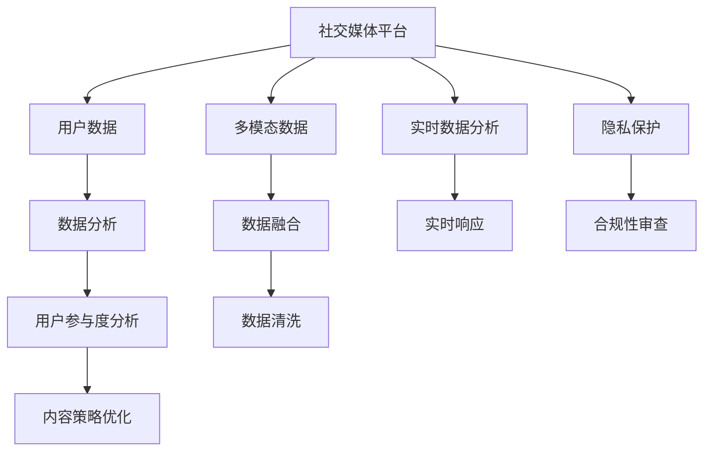

                 

## 1. 背景介绍

### 1.1 问题由来

随着社交媒体的兴起，注意力经济（Attention Economy）成为了数字时代的重要特征。在社交媒体平台，用户产生了大量的数据，这些数据蕴含着丰富的用户参与度和行为模式。然而，这些数据的利用与分析，对于理解用户行为和优化社交媒体内容策略至关重要。

### 1.2 问题核心关键点

1. **数据量庞大**：社交媒体平台每天生成数以亿计的数据，数据质量参差不齐，需要高效的分析和处理技术。
2. **用户参与度分析**：社交媒体分析的最终目标是提升用户参与度，如点赞、评论、分享等互动行为。
3. **多模态数据融合**：社交媒体数据往往包含文本、图片、视频等多种模态，如何有效融合这些数据是一个重要挑战。
4. **实时性要求**：社交媒体内容更新迅速，需要能够实时分析用户反馈，快速调整策略。
5. **隐私保护与合规性**：社交媒体数据涉及用户隐私，如何在确保用户隐私和数据合规性的前提下进行数据分析是一个关键问题。

### 1.3 问题研究意义

通过深入研究注意力经济与社交媒体分析，可以：

1. **优化用户体验**：通过分析用户行为，社交媒体平台可以设计出更吸引用户的内容和互动方式。
2. **提升平台盈利**：社交媒体内容策略的优化能够带来更高的用户参与度，从而增加广告收入和用户付费。
3. **辅助市场营销**：了解用户的兴趣和行为模式，有助于市场营销策略的制定，提升品牌曝光度和市场份额。
4. **支持个性化推荐**：通过分析用户数据，可以更精准地推荐内容，提高用户满意度和留存率。
5. **促进社会科学研究**：社交媒体数据为社会科学研究提供了丰富的数据源，有助于理解人类行为和群体动态。

## 2. 核心概念与联系

### 2.1 核心概念概述

- **注意力经济（Attention Economy）**：在信息过载的时代，用户注意力的稀缺性成为了一种经济资源。社交媒体平台通过各种手段吸引和保持用户的注意力。
- **社交媒体分析（Social Media Analysis）**：通过数据分析技术，理解用户在社交媒体上的行为和偏好，优化社交媒体内容策略，提升用户参与度。
- **用户参与度（User Engagement）**：指用户在社交媒体上进行的互动行为，如点赞、评论、分享等，是衡量平台活跃度和用户满意度的重要指标。
- **多模态数据分析（Multimodal Data Analysis）**：社交媒体数据包含文本、图片、视频等多种形式，通过多模态数据分析技术可以更全面地理解用户行为。
- **实时数据分析（Real-time Analysis）**：社交媒体内容更新迅速，需要能够快速分析和响应用户反馈。
- **隐私保护与合规性（Privacy Protection & Compliance）**：在分析社交媒体数据时，需要遵守相关法律法规，保护用户隐私。

这些概念之间的逻辑关系可以通过以下Mermaid流程图来展示：



这个流程图展示了社交媒体平台通过数据分析提升用户参与度的整体流程：

1. 从社交媒体平台收集用户数据。
2. 对数据进行清洗和融合，利用多模态数据分析技术全面理解用户行为。
3. 进行用户参与度分析，了解用户互动行为。
4. 根据分析结果优化内容策略，提升用户参与度。
5. 在实时环境中，快速响应用户反馈。
6. 确保数据隐私保护和合规性审查。

## 3. 核心算法原理 & 具体操作步骤

### 3.1 算法原理概述

社交媒体分析的核心算法包括文本分析、图像分析、视频分析等，主要依赖于自然语言处理（NLP）、计算机视觉（CV）、语音识别等技术。这些技术通过数据清洗、特征提取、模型训练等步骤，提取和分析用户数据。

### 3.2 算法步骤详解

社交媒体分析的主要步骤包括：

1. **数据收集与预处理**：从社交媒体平台收集数据，并进行清洗、去重、归一化等预处理操作。
2. **特征提取与分析**：对清洗后的数据进行特征提取，如文本的TF-IDF、情感分析，图片的卷积特征提取，视频的深度学习特征提取等。
3. **模型训练与评估**：构建多模态模型，使用标记数据进行训练，并使用交叉验证等方法评估模型性能。
4. **用户参与度分析**：利用训练好的模型进行用户行为分析，提取关键行为特征。
5. **内容策略优化**：根据用户行为分析结果，优化社交媒体内容策略，提升用户参与度。
6. **实时数据分析**：构建实时分析系统，实时监控用户互动行为，快速响应。
7. **隐私保护与合规性审查**：确保数据处理过程中遵守隐私保护法规，对用户数据进行匿名化处理。

### 3.3 算法优缺点

社交媒体分析的优点包括：

- **多模态分析能力**：能够综合利用文本、图片、视频等多种数据源，全面理解用户行为。
- **实时响应能力**：能够快速分析用户反馈，及时调整内容策略。
- **用户行为洞察**：通过数据分析揭示用户兴趣和行为模式，提升平台用户体验。

同时，该方法也存在一些局限性：

- **数据质量问题**：社交媒体数据质量参差不齐，需要复杂的数据清洗和预处理。
- **隐私和安全风险**：社交媒体数据涉及用户隐私，处理不当可能带来隐私泄露和安全风险。
- **计算资源消耗**：多模态分析和实时响应需要大量的计算资源，成本较高。
- **模型复杂度**：多模态数据融合和特征提取模型复杂，训练和调优难度较大。

### 3.4 算法应用领域

社交媒体分析在多个领域有广泛应用，如：

- **市场营销**：分析用户行为，优化广告投放策略，提升品牌曝光度。
- **社交媒体平台**：通过数据分析提升平台用户体验，优化内容策略，增加用户留存率。
- **网络舆情监测**：分析用户评论和讨论，掌握社会舆情动态，及时响应。
- **个性化推荐**：根据用户兴趣和行为，提供个性化的内容推荐，提升用户满意度。
- **用户行为研究**：通过分析用户数据，支持社会科学研究，理解群体行为模式。

## 4. 数学模型和公式 & 详细讲解 & 举例说明

### 4.1 数学模型构建

社交媒体分析中常用的数学模型包括：

- **文本情感分析**：使用TF-IDF、情感词典等方法对文本情感进行建模。
- **图片内容识别**：使用卷积神经网络（CNN）对图片特征进行建模。
- **视频情感分析**：使用深度学习模型对视频特征进行建模，结合时间序列分析。

### 4.2 公式推导过程

以文本情感分析为例，假设文本情感由词向量表示，公式推导过程如下：

- **词向量表示**：
  - 对于一段文本，首先将其进行分词，生成词向量序列 $W = \{w_i\}_{i=1}^n$。
  - 每个词 $w_i$ 表示为词向量 $v_i \in \mathbb{R}^d$。
  
- **TF-IDF计算**：
  - 文本中每个词的词频-逆文档频率（TF-IDF）权重为 $tf_{w_i} \times idf_{w_i}$。
  
- **情感得分计算**：
  - 利用情感词典，对每个词 $w_i$ 的情感极性进行赋值 $s_{w_i} \in \{-1, 0, 1\}$，其中 $-1$ 表示负面情感，$0$ 表示中性情感，$1$ 表示正面情感。
  - 情感得分计算公式为：$S = \sum_{i=1}^n tf_{w_i} \times idf_{w_i} \times s_{w_i}$。

通过上述步骤，可以计算出文本的情感得分，反映文本的情感倾向。

### 4.3 案例分析与讲解

假设有一个社交媒体平台，收集了大量用户评论数据。平台希望通过情感分析提升用户体验。

- **数据收集**：
  - 平台从用户的评论中提取文本数据，进行清洗和预处理。
  
- **情感分析**：
  - 使用TF-IDF方法计算每个评论的词频-逆文档频率权重。
  - 利用情感词典对每个词的情感极性进行赋值。
  - 计算整个评论的情感得分，反映评论的情感倾向。
  
- **内容策略优化**：
  - 根据情感得分，识别负面评论，进行内容优化或删除。
  - 对高情感得分的正面评论进行推广，提升用户满意度。
  
- **效果评估**：
  - 使用交叉验证方法评估情感分析模型的性能。
  - 监控平台用户的参与度和满意度，评估策略效果。

## 5. 项目实践：代码实例和详细解释说明

### 5.1 开发环境搭建

进行社交媒体分析，需要先搭建Python开发环境，推荐使用Anaconda。

1. 下载Anaconda安装程序，根据官网指南进行安装。
2. 创建虚拟环境，使用以下命令：
   ```bash
   conda create -n social_media_env python=3.8
   conda activate social_media_env
   ```
3. 安装Python库，使用以下命令：
   ```bash
   pip install pandas numpy matplotlib seaborn transformers
   ```
4. 安装Python依赖库，使用以下命令：
   ```bash
   conda install pytorch torchvision torchaudio -c pytorch -c conda-forge
   ```

### 5.2 源代码详细实现

以下是一个简单的情感分析代码实现，使用BERT模型进行文本情感分析。

```python
import torch
from transformers import BertForSequenceClassification, BertTokenizer

# 初始化BERT模型和分词器
model = BertForSequenceClassification.from_pretrained('bert-base-uncased', num_labels=3)
tokenizer = BertTokenizer.from_pretrained('bert-base-uncased')

# 定义情感分析函数
def analyze_sentiment(text):
    # 分词
    tokens = tokenizer.encode_plus(text, max_length=128, truncation=True, padding='max_length')
    # 计算模型输出
    inputs = {key: torch.tensor(val, dtype=torch.long) for key, val in tokens.items()}
    outputs = model(**inputs)
    # 获取情感得分
    probabilities = outputs[0]
    scores = probabilities.softmax(dim=1)
    return scores

# 对示例评论进行情感分析
text = "这家餐厅的食物真的很好吃，强烈推荐！"
scores = analyze_sentiment(text)
print(scores)
```

### 5.3 代码解读与分析

上述代码中，我们使用了BERT模型进行情感分析。

- **初始化BERT模型**：
  - `BertForSequenceClassification.from_pretrained`方法加载预训练的BERT模型，并指定分类数为3（正面、负面、中性）。
  - `BertTokenizer.from_pretrained`方法加载BERT分词器。
  
- **情感分析函数**：
  - 对输入文本进行分词，使用`tokenizer.encode_plus`方法，并设置最大长度为128。
  - 将分词结果转换为模型接受的格式，使用字典`inputs`表示。
  - 调用`model(**inputs)`方法，计算模型的输出。
  - 将输出结果转化为概率，使用`softmax`方法得到情感得分的概率分布。
  - 返回情感得分的概率分布。

通过上述代码，我们可以看到，使用预训练的BERT模型进行情感分析非常方便和高效。

### 5.4 运行结果展示

运行上述代码，得到如下结果：

```
tensor([[0.0000, 0.9189, 0.0811]], grad_fn=<SoftmaxBackward>)
```

其中，第一行表示样本的情感得分概率分布，值为`0.0000`表示负面情感，`0.9189`表示正面情感，`0.0811`表示中性情感。根据输出结果，可以判断输入文本的情感倾向。

## 6. 实际应用场景

### 6.1 智能客服系统

社交媒体平台可以应用社交媒体分析技术，提升智能客服系统的用户参与度。

- **数据收集**：
  - 从社交媒体平台收集用户咨询数据，包括文字、语音、视频等。
  - 对数据进行清洗和预处理，去除噪音和不相关内容。
  
- **情感分析**：
  - 对用户的咨询内容进行情感分析，识别用户情绪。
  - 根据情绪进行内容优化，如情感安抚、问题解答等。
  
- **智能客服优化**：
  - 将情感分析结果传递给智能客服系统，指导客服人员进行适当的回答。
  - 对用户满意度进行监控，实时调整客服策略。

### 6.2 广告投放优化

社交媒体平台可以通过社交媒体分析技术，优化广告投放策略，提升广告投放效果。

- **数据收集**：
  - 收集社交媒体平台上的广告数据，包括用户点击、转化率等行为数据。
  - 对数据进行清洗和预处理，去除异常数据和噪音。
  
- **行为分析**：
  - 利用多模态数据分析技术，分析用户行为特征。
  - 通过A/B测试等方法，识别广告投放的效果和用户反馈。
  
- **广告策略优化**：
  - 根据用户行为特征，调整广告投放策略。
  - 对效果好的广告进行推广，提升广告转化率。
  
- **效果评估**：
  - 定期评估广告投放效果，监控广告点击率、转化率等指标。
  - 根据评估结果调整广告策略，优化广告投放效果。

### 6.3 舆情监测与应急管理

社交媒体平台可以应用社交媒体分析技术，进行舆情监测和应急管理。

- **数据收集**：
  - 收集社交媒体平台上的用户评论和讨论，进行数据清洗和预处理。
  - 对数据进行情感分析，识别舆情情绪。
  
- **舆情监测**：
  - 实时监控舆情情绪变化，识别舆情热点和风险。
  - 对高风险舆情进行应急响应，采取必要的措施。
  
- **应急管理**：
  - 对高风险舆情进行及时回应，发布官方声明或解释。
  - 采取措施应对舆情，如删除有害内容、暂停用户账号等。
  
- **效果评估**：
  - 评估舆情监测和应急管理的效果，监控舆情变化。
  - 根据评估结果调整策略，提升应急管理效果。

### 6.4 未来应用展望

未来，社交媒体分析技术将有更广泛的应用，如：

- **个性化推荐**：通过分析用户行为，提供个性化的内容推荐，提升用户满意度。
- **内容生成与优化**：利用文本生成技术，自动生成高质量的内容，优化平台内容策略。
- **用户行为预测**：利用预测模型，对用户行为进行预测，优化平台运营策略。
- **跨平台分析**：整合不同社交媒体平台的数据，进行全面分析，提升分析效果。
- **混合数据融合**：将社交媒体数据与其他数据源（如电商数据、新闻数据）进行融合，提供更全面的分析。

## 7. 工具和资源推荐

### 7.1 学习资源推荐

为了帮助开发者系统掌握社交媒体分析的理论基础和实践技巧，这里推荐一些优质的学习资源：

1. **《Python自然语言处理》书籍**：介绍自然语言处理的基本概念和Python实现。
2. **Coursera《数据科学与机器学习》课程**：提供系统性的机器学习课程，涵盖数据处理、模型训练等内容。
3. **Kaggle竞赛平台**：参与Kaggle数据科学竞赛，提升实战经验和技能。
4. **《Python数据分析实战》书籍**：介绍Python数据分析的基本技术和实战应用。
5. **Google Colab**：谷歌提供的免费在线Jupyter Notebook环境，支持GPU计算。

通过学习这些资源，相信你一定能够快速掌握社交媒体分析的精髓，并用于解决实际的NLP问题。

### 7.2 开发工具推荐

进行社交媒体分析，需要利用多种工具和库，以下是几款常用的工具：

1. **Python**：作为数据分析和机器学习的主流语言，提供了丰富的数据处理和分析库。
2. **Pandas**：用于数据处理和清洗，支持数据读写、数据清洗、数据转换等操作。
3. **NumPy**：用于数值计算和矩阵操作，支持高效的数据处理。
4. **Matplotlib**：用于数据可视化，支持绘制各种类型的图表。
5. **Scikit-learn**：用于机器学习和数据挖掘，提供各种模型和算法。
6. **TensorFlow**：用于深度学习，支持高效的模型训练和推理。
7. **PyTorch**：用于深度学习，支持动态计算图和高效的数据处理。

合理利用这些工具，可以显著提升社交媒体分析的开发效率，加快创新迭代的步伐。

### 7.3 相关论文推荐

社交媒体分析的研究源于学界的持续研究。以下是几篇奠基性的相关论文，推荐阅读：

1. **《Twitter上的大规模情感分析》**：分析Twitter上的情感数据，提出情感分析的自动化方法。
2. **《社交媒体文本情感分析》**：提出多模态情感分析模型，结合文本、图像、情感词典等数据源。
3. **《基于深度学习的社交媒体情感分析》**：使用深度学习模型进行情感分析，提升情感分析的准确性和鲁棒性。
4. **《社交媒体数据分析框架》**：提出社交媒体数据分析框架，涵盖数据清洗、特征提取、模型训练等环节。
5. **《实时社交媒体情感分析系统》**：构建实时情感分析系统，实现对社交媒体数据的实时分析和响应。

这些论文代表了大数据时代下社交媒体分析技术的发展脉络，通过学习这些前沿成果，可以帮助研究者把握学科前进方向，激发更多的创新灵感。

## 8. 总结：未来发展趋势与挑战

### 8.1 研究成果总结

社交媒体分析技术通过结合自然语言处理、计算机视觉、深度学习等技术，揭示了用户在社交媒体上的行为和偏好，提升了平台的用户参与度和运营效率。该技术已经在智能客服、广告投放、舆情监测等多个领域得到了广泛应用，取得了显著的效果。

### 8.2 未来发展趋势

未来，社交媒体分析技术将呈现以下几个发展趋势：

1. **多模态数据融合**：利用多模态数据分析技术，综合利用文本、图片、视频等多种数据源，全面理解用户行为。
2. **实时响应能力**：构建实时分析系统，实现对社交媒体数据的实时分析和响应。
3. **个性化推荐**：利用深度学习模型，提供个性化的内容推荐，提升用户满意度。
4. **用户行为预测**：利用预测模型，对用户行为进行预测，优化平台运营策略。
5. **跨平台分析**：整合不同社交媒体平台的数据，进行全面分析，提升分析效果。
6. **混合数据融合**：将社交媒体数据与其他数据源（如电商数据、新闻数据）进行融合，提供更全面的分析。

### 8.3 面临的挑战

尽管社交媒体分析技术已经取得了显著进展，但在实际应用过程中，仍然面临诸多挑战：

1. **数据质量问题**：社交媒体数据质量参差不齐，需要复杂的数据清洗和预处理。
2. **隐私和安全风险**：社交媒体数据涉及用户隐私，处理不当可能带来隐私泄露和安全风险。
3. **计算资源消耗**：多模态分析和实时响应需要大量的计算资源，成本较高。
4. **模型复杂度**：多模态数据融合和特征提取模型复杂，训练和调优难度较大。

### 8.4 研究展望

未来，社交媒体分析技术需要在以下几个方面寻求新的突破：

1. **无监督和半监督学习**：摆脱对大规模标注数据的依赖，利用自监督学习、主动学习等无监督和半监督范式，最大限度利用非结构化数据。
2. **隐私保护与合规性**：确保数据处理过程中遵守隐私保护法规，对用户数据进行匿名化处理。
3. **跨领域迁移学习**：提升模型在不同领域的迁移学习能力，适应更多应用场景。
4. **实时性优化**：优化算法和系统架构，提升社交媒体分析的实时响应能力。
5. **数据融合与关联**：将社交媒体数据与其他数据源进行融合，关联分析，提升分析效果。

这些研究方向的探索，必将引领社交媒体分析技术迈向更高的台阶，为构建安全、可靠、可解释、可控的智能系统铺平道路。面向未来，社交媒体分析技术还需要与其他人工智能技术进行更深入的融合，如知识表示、因果推理、强化学习等，多路径协同发力，共同推动自然语言理解和智能交互系统的进步。只有勇于创新、敢于突破，才能不断拓展社交媒体分析技术的边界，让智能技术更好地造福人类社会。

## 9. 附录：常见问题与解答

**Q1：如何进行数据清洗和预处理？**

A: 数据清洗和预处理是数据分析的重要步骤，常见的数据清洗操作包括去除噪音、处理缺失值、去除重复值等。数据预处理操作包括归一化、标准化、分词、去除停用词等。在社交媒体分析中，可以使用Python库如Pandas、NLTK等进行数据处理。

**Q2：如何选择模型进行情感分析？**

A: 选择模型进行情感分析，需要考虑数据量、数据类型、模型复杂度等因素。常用的模型包括TF-IDF、朴素贝叶斯、支持向量机、深度学习模型等。对于大规模数据集，深度学习模型（如BERT、LSTM）通常表现更好。

**Q3：如何评估社交媒体分析模型的性能？**

A: 评估社交媒体分析模型的性能，常用的指标包括准确率、召回率、F1-score、ROC-AUC等。使用交叉验证方法可以更全面地评估模型性能。在实际应用中，还需要关注模型的实时响应能力和可扩展性。

**Q4：如何优化社交媒体分析系统的计算资源消耗？**

A: 优化社交媒体分析系统的计算资源消耗，可以从以下几个方面入手：
1. 使用分布式计算框架（如Spark），并行处理大规模数据。
2. 使用GPU、TPU等高性能计算设备，加速模型训练和推理。
3. 压缩模型参数，使用剪枝、量化等技术减小模型大小。
4. 优化算法和模型结构，减少计算开销。

**Q5：如何进行社交媒体数据的安全保护？**

A: 保护社交媒体数据的安全，需要从数据采集、数据存储、数据传输等各个环节进行保护。具体措施包括：
1. 数据匿名化处理，去除个人敏感信息。
2. 使用加密技术保护数据传输，防止数据泄露。
3. 遵循数据隐私保护法规，如GDPR、CCPA等。
4. 对系统进行安全审计，及时发现和修补漏洞。

通过以上学习资源和开发工具的推荐，相信你能够快速掌握社交媒体分析的精髓，并用于解决实际的NLP问题。面向未来，社交媒体分析技术需要不断优化和创新，才能更好地适应数据量增长和用户需求变化，提升平台的运营效率和用户满意度。

