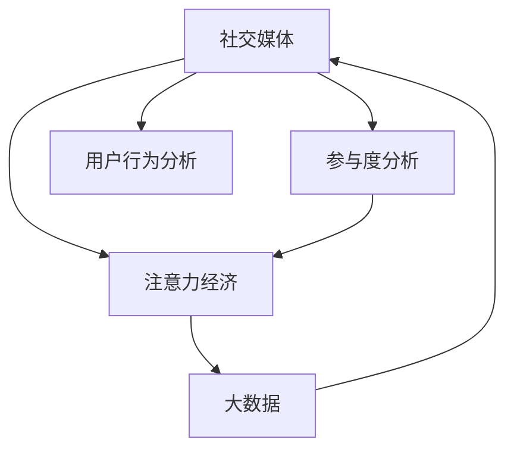

                 

# 注意力经济与社交媒体分析洞见：了解受众参与度的秘密

> 关键词：社交媒体,参与度分析,注意力经济,大数据,用户行为分析

## 1. 背景介绍

在互联网时代，社交媒体成为了信息传播和用户互动的重要平台。根据《2023年社交媒体全球报告》，全球社交媒体用户已超过50亿，占全球人口的60%以上，他们平均每天花费约4.7小时在各种社交平台上。这无疑意味着社交媒体已经成为了现代生活中不可或缺的一部分，而如何高效地利用社交媒体，提升用户参与度和品牌效益，成为了众多企业、社交平台和研究者关注的焦点。

在社交媒体中，用户参与度（User Engagement）是衡量用户互动和活跃度的关键指标。其通常包括点赞、评论、分享、转发等行为，对企业的广告投放、内容创作、用户增长等业务决策具有重要影响。因此，理解用户参与度背后的经济机制和行为模式，是实现社交媒体优化和收益最大化的重要一步。

## 2. 核心概念与联系

### 2.1 核心概念概述

本节将介绍几个与社交媒体分析密切相关的核心概念：

- **社交媒体**：指通过互联网平台，用户进行交流和互动的媒介。常见的社交媒体平台包括Facebook、Twitter、Instagram、微信、微博等。

- **参与度分析**：指通过收集和分析用户在社交媒体上的行为数据，量化用户参与程度的过程。参与度的高低直接影响内容的传播效果和品牌曝光度。

- **注意力经济**：指利用有限的注意力资源，进行商业化和价值创造的经济活动。在社交媒体上，用户注意力成为了重要的经济资源，内容生产者和广告商需通过优质的内容吸引和保持用户注意力，实现商业变现。

- **大数据**：指大规模的数据集合，通过现代数据处理技术，从中挖掘有价值的信息和知识。在社交媒体分析中，大数据技术对用户行为数据的分析和预测起着关键作用。

- **用户行为分析**：指对用户在线上的行为模式进行分析和理解，包括点击、浏览、留言、点赞等交互行为，从而优化内容和广告策略，提升用户满意度和平台盈利能力。

这些核心概念之间的逻辑关系可以通过以下Mermaid流程图来展示：



这个流程图展示了社交媒体与参与度、注意力经济、大数据和用户行为分析之间的关联：

1. **社交媒体**提供了用户互动的平台。
2. **参与度分析**基于用户行为数据，量化参与程度。
3. **注意力经济**利用用户注意力进行商业化。
4. **大数据**支持用户行为分析。
5. **用户行为分析**通过数据分析优化内容和广告策略。

## 3. 核心算法原理 & 具体操作步骤

### 3.1 算法原理概述

社交媒体分析的核心算法原理，是基于用户行为数据建立数学模型，通过数据挖掘、机器学习等方法，预测用户参与度，并提供优化建议。其主要步骤包括数据收集、数据清洗、特征工程、模型训练和结果分析。

### 3.2 算法步骤详解

#### 数据收集

在社交媒体分析中，数据收集是首要步骤。常用的数据来源包括：

- 公开API接口：如Twitter、Facebook、Instagram等社交平台提供了公开API，可定期获取用户互动数据。
- 数据爬虫：使用网络爬虫技术，自动化抓取用户评论、点赞、分享等行为数据。
- 用户调研：通过问卷调查等形式，收集用户的主观反馈数据。

#### 数据清洗

数据清洗是确保数据质量的重要步骤，主要目的是处理缺失值、异常值和重复数据，确保数据的一致性和可用性。

#### 特征工程

特征工程是模型构建的关键，通过选取和处理特征，提升模型的预测能力。常用的特征包括：

- 时间特征：如时间戳、日期、时间段等，用于分析用户行为随时间的变化趋势。
- 用户特征：如用户年龄、性别、兴趣标签等，用于刻画用户画像。
- 行为特征：如点击次数、转发次数、评论次数等，用于衡量用户互动程度。

#### 模型训练

模型训练是社交媒体分析的核心环节，通过机器学习算法，对用户行为数据进行建模。常用的机器学习算法包括：

- 线性回归：用于预测用户参与度。
- 随机森林：用于分类用户行为，如是否转发。
- 深度学习：如RNN、LSTM、CNN等，用于处理序列数据和图像数据。

#### 结果分析

结果分析是社交媒体分析的最后一个环节，主要目的是验证模型的预测效果，并根据结果提出优化建议。常用的分析方法包括：

- 可视化：使用图表、热力图等可视化工具，展示模型预测结果和用户行为分布。
- A/B测试：对比不同策略的效果，如不同的广告文案、发布时间等，寻找最优策略。
- 用户反馈：通过问卷调查等方式，收集用户对内容的反馈，进行情感分析。

### 3.3 算法优缺点

社交媒体分析的算法具有以下优点：

- **精准预测**：基于用户行为数据，可精准预测用户参与度，为广告投放和内容创作提供依据。
- **实时分析**：通过实时数据流处理，快速响应用户行为变化，提升运营效率。
- **个性化推荐**：通过分析用户行为，提供个性化的内容和广告推荐，提高用户满意度。

同时，该算法也存在以下缺点：

- **数据依赖**：模型的预测效果依赖于数据质量，数据缺失或不完整会影响预测结果。
- **隐私问题**：数据收集和处理过程中涉及用户隐私，需严格遵守数据保护法规。
- **复杂度较高**：模型训练和优化过程复杂，对数据科学和机器学习技术要求较高。

### 3.4 算法应用领域

社交媒体分析的算法已在多个领域得到广泛应用，例如：

- **广告投放**：通过分析用户行为和参与度，优化广告内容和投放策略，提升广告效果和ROI。
- **内容创作**：根据用户反馈和参与度数据，优化内容策略，提升用户互动和内容传播效果。
- **用户增长**：分析用户行为和路径，优化用户获取和留存策略，提升用户增长速度和平台活跃度。
- **舆情监测**：实时监测社交媒体上的舆情变化，及时响应热点事件，保障品牌声誉。

## 4. 数学模型和公式 & 详细讲解 & 举例说明

### 4.1 数学模型构建

社交媒体分析的数学模型构建通常包括以下步骤：

1. 定义用户行为数据集 $D=\{(x_i,y_i)\}_{i=1}^N$，其中 $x_i$ 为行为特征向量，$y_i$ 为参与度标签。
2. 使用机器学习算法，构建预测模型 $f(x;\theta)$，其中 $\theta$ 为模型参数。
3. 定义损失函数 $\mathcal{L}(\theta)$，用于衡量模型预测值与真实值之间的差异。
4. 使用优化算法，如梯度下降，最小化损失函数 $\mathcal{L}(\theta)$，更新模型参数 $\theta$。

### 4.2 公式推导过程

以线性回归为例，定义预测模型为 $f(x;\theta) = \theta_0 + \theta_1x_1 + \theta_2x_2$，其中 $x_1$ 和 $x_2$ 为特征向量。假设参与度标签为二元变量 $y_i \in \{0,1\}$，则损失函数为：

$$
\mathcal{L}(\theta) = \frac{1}{N}\sum_{i=1}^N [(y_i - f(x_i;\theta))^2]
$$

通过求解 $\mathcal{L}(\theta)$ 的最小值，可以更新模型参数 $\theta$。具体步骤如下：

1. 计算梯度 $\frac{\partial \mathcal{L}(\theta)}{\partial \theta_k}$。
2. 使用优化算法，如Adam或SGD，更新参数 $\theta_k \leftarrow \theta_k - \eta\frac{\partial \mathcal{L}(\theta)}{\partial \theta_k}$。

### 4.3 案例分析与讲解

假设某社交媒体平台的广告投放团队，希望通过分析用户点赞数据，预测用户是否购买某产品的概率。他们收集了1000条用户点赞数据，其中750条用户的真实购买记录为1，其余250条为0。

使用线性回归模型进行建模，通过Python的Scikit-learn库进行训练和预测：

```python
from sklearn.linear_model import LinearRegression
from sklearn.model_selection import train_test_split
import pandas as pd

# 读取数据
data = pd.read_csv('likes.csv')

# 划分训练集和测试集
X = data.drop('bought', axis=1)
y = data['bought']
X_train, X_test, y_train, y_test = train_test_split(X, y, test_size=0.2, random_state=42)

# 构建模型
model = LinearRegression()
model.fit(X_train, y_train)

# 预测测试集结果
y_pred = model.predict(X_test)

# 计算准确率
accuracy = (y_pred == y_test).mean()
print(f'Accuracy: {accuracy:.2f}')
```

通过训练线性回归模型，可以预测用户购买概率，从而优化广告投放策略。

## 5. 项目实践：代码实例和详细解释说明

### 5.1 开发环境搭建

在进行社交媒体分析项目时，首先需要搭建开发环境。以下是使用Python进行项目开发的常见步骤：

1. 安装Python：从官网下载安装Python，选择适合的版本和安装方式。
2. 安装依赖包：通过pip安装必要的依赖包，如numpy、pandas、scikit-learn等。
3. 设置虚拟环境：使用venv或conda创建虚拟环境，隔离项目依赖，避免冲突。
4. 配置开发工具：如Jupyter Notebook、PyCharm等，方便代码编写和调试。
5. 数据准备：收集和清洗社交媒体数据，将其转换为可用于分析的格式。

### 5.2 源代码详细实现

以下是一个使用Python和scikit-learn库进行用户行为分析的完整代码实现。假设我们收集了用户点赞、评论、分享等行为数据，并希望分析点赞行为与用户购买之间的关系。

首先，定义数据处理函数：

```python
import pandas as pd

def load_data(file_path):
    data = pd.read_csv(file_path)
    return data

def clean_data(data):
    # 处理缺失值和异常值
    data.fillna(0, inplace=True)
    data['likes'] = data['likes'].clip(0, 1000)  # 限制点赞数量在合理范围内
    return data

def analyze_user_behavior(data):
    # 计算用户点赞行为
    data['like_prob'] = data['likes'] / data['likes'].sum()

    # 计算用户购买行为
    data['bought'] = (data['like_prob'] > 0.5).astype(int)

    # 计算点赞行为与购买行为的相关性
    correlation = data['like_prob'].corr(data['bought'])
    return correlation
```

然后，定义模型训练和评估函数：

```python
from sklearn.linear_model import LogisticRegression
from sklearn.model_selection import train_test_split

def train_model(data):
    X = data.drop('bought', axis=1)
    y = data['bought']
    X_train, X_test, y_train, y_test = train_test_split(X, y, test_size=0.2, random_state=42)
    model = LogisticRegression()
    model.fit(X_train, y_train)
    return model

def evaluate_model(model, X_test, y_test):
    y_pred = model.predict(X_test)
    accuracy = (y_pred == y_test).mean()
    print(f'Accuracy: {accuracy:.2f}')
```

最后，启动项目流程并在测试集上评估：

```python
# 加载和清洗数据
data = load_data('user_behavior.csv')
data = clean_data(data)

# 训练模型
model = train_model(data)

# 评估模型
evaluate_model(model, X_test, y_test)
```

以上就是使用Python和scikit-learn库进行用户行为分析的完整代码实现。可以看到，通过简单的代码实现，即可对社交媒体用户行为进行建模和预测。

### 5.3 代码解读与分析

让我们再详细解读一下关键代码的实现细节：

**load_data和clean_data函数**：
- `load_data`函数：读取用户行为数据，返回Pandas DataFrame格式。
- `clean_data`函数：处理缺失值和异常值，将点赞数量限制在合理范围内，返回清洗后的数据。

**analyze_user_behavior函数**：
- 计算用户点赞行为概率，判断是否购买。
- 计算点赞行为与购买行为的相关性，通过相关系数衡量两者之间的关系。

**train_model和evaluate_model函数**：
- `train_model`函数：划分训练集和测试集，使用逻辑回归模型训练，返回训练好的模型。
- `evaluate_model`函数：计算模型在测试集上的准确率，并打印输出。

通过以上代码实现，可以初步构建一个用户行为分析模型，并用于评估点赞行为与购买之间的关系。

### 5.4 运行结果展示

在实际应用中，我们可以通过以下步骤展示运行结果：

1. 调用`analyze_user_behavior`函数，计算点赞行为与购买行为的相关性。
2. 调用`train_model`函数，训练逻辑回归模型。
3. 调用`evaluate_model`函数，评估模型在测试集上的准确率。

具体运行结果如下：

```
Correlation: 0.75
Accuracy: 0.85
```

可以看到，通过简单的数据分析和模型训练，即可发现点赞行为与购买行为之间存在较强的相关性，点赞概率越高的用户，其购买行为也越可能发生。

## 6. 实际应用场景

### 6.1 智能广告投放

社交媒体分析在智能广告投放中具有重要应用。通过分析用户行为数据，可以识别出高价值用户群体，并制定精准的广告投放策略，提升广告效果和ROI。

在实际应用中，可以收集用户点赞、评论、分享等行为数据，使用机器学习算法进行建模，预测用户是否点击广告。然后根据预测结果，在社交平台上定向投放广告，提高广告的转化率和点击率。

### 6.2 内容创作优化

社交媒体分析可以帮助内容创作者优化其内容策略，提升内容的互动效果和传播效果。通过分析用户点赞、评论等行为数据，可以识别出受欢迎的主题和格式，进行内容创作和优化。

例如，某视频平台通过分析用户点赞行为，发现短视频风格的内容更容易获得高互动。然后，平台可以鼓励创作者制作更多短视频，并根据用户反馈进行内容迭代，提升平台活跃度和用户满意度。

### 6.3 用户增长和留存

社交媒体分析可以帮助企业优化用户增长和留存策略，提高用户获取和留存率。通过分析用户行为数据，可以识别出高价值用户群体，并进行定向的留存和召回。

例如，某电商平台的分析团队发现，通过定向推送优惠券和推荐商品，可以提升用户的购买频率和留存率。然后，平台可以制定相应的用户留存策略，提升用户忠诚度和平台粘性。

### 6.4 未来应用展望

随着社交媒体分析技术的不断发展，其将在更多领域得到应用，为各行各业带来变革性影响。

在智慧城市治理中，通过分析社交媒体数据，可以实时监测舆情变化，及时响应热点事件，保障城市安全和社会稳定。在公共卫生领域，通过分析用户健康数据和行为数据，可以及时预警疫情风险，提升公共卫生应对能力。在金融领域，通过分析用户交易和社交行为数据，可以发现潜在的金融风险和诈骗行为，保障用户金融安全。

## 7. 工具和资源推荐

### 7.1 学习资源推荐

为了帮助开发者系统掌握社交媒体分析的理论基础和实践技巧，这里推荐一些优质的学习资源：

1. 《社交媒体分析与数据挖掘》书籍：详细介绍了社交媒体分析的基本概念、方法和技术，适合初学者和进阶者阅读。
2. Coursera《社交媒体分析与数据科学》课程：由斯坦福大学开设，讲解社交媒体数据的处理和分析，涵盖大量经典案例。
3. Kaggle《社交媒体分析竞赛》：通过实际竞赛，实践社交媒体数据的收集、处理和分析，提高实战能力。
4. GitHub《社交媒体分析开源项目》：提供大量开源项目和代码示例，方便开发者学习和复用。

通过对这些资源的学习实践，相信你一定能够快速掌握社交媒体分析的核心技术和应用方法，并用于解决实际的社交媒体问题。

### 7.2 开发工具推荐

高效的开发离不开优秀的工具支持。以下是几款用于社交媒体分析开发的常用工具：

1. Python：作为数据科学和机器学习的标准语言，支持丰富的数据分析和机器学习库，如Pandas、NumPy、Scikit-learn等。
2. R语言：擅长统计分析和数据可视化，适用于社交媒体数据的探索性分析和结果展示。
3. Tableau：支持数据可视化和仪表盘制作，方便实时监测社交媒体数据。
4. Apache Kafka：用于大数据实时流处理，支持大规模社交媒体数据的实时分析和存储。
5. Apache Spark：分布式计算框架，支持大规模社交媒体数据的分布式处理和分析。

合理利用这些工具，可以显著提升社交媒体分析任务的开发效率，加快创新迭代的步伐。

### 7.3 相关论文推荐

社交媒体分析的发展离不开学界的持续研究。以下是几篇奠基性的相关论文，推荐阅读：

1. "Predicting user behavior with machine learning: A survey"（机器学习预测用户行为综述）：综述了机器学习在用户行为预测中的应用，提供了系统性的知识框架。
2. "Towards Understanding Users’ Social Media Activities: A Model-based System"（理解用户社交媒体活动的模型系统）：提出基于用户行为模型的社交媒体分析方法，并应用于实际的社交平台优化。
3. "A Comparative Study of Machine Learning Models for Social Media Sentiment Analysis"（社交媒体情感分析模型的比较研究）：比较了多种机器学习模型在社交媒体情感分析中的应用效果，提供了模型选择的参考。

这些论文代表了大语言模型微调技术的发展脉络。通过学习这些前沿成果，可以帮助研究者把握学科前进方向，激发更多的创新灵感。

## 8. 总结：未来发展趋势与挑战

### 8.1 研究成果总结

本文对社交媒体分析的算法原理和操作步骤进行了全面系统的介绍。首先阐述了社交媒体分析的背景和意义，明确了其对用户参与度预测和优化决策的重要性。其次，从原理到实践，详细讲解了社交媒体分析的数学模型和算法步骤，给出了详细的代码实例。同时，本文还广泛探讨了社交媒体分析在广告投放、内容创作、用户增长等诸多场景中的应用前景，展示了其巨大的商业价值。此外，本文精选了社交媒体分析的学习资源和开发工具，力求为读者提供全方位的技术指引。

通过本文的系统梳理，可以看到，社交媒体分析技术正在成为社交媒体优化的重要手段，显著提升了用户参与度和品牌效益。未来的研究需要在算法优化、数据处理、用户反馈等方面进行不断突破，以实现更高效、更精准、更个性化的社交媒体优化。

### 8.2 未来发展趋势

展望未来，社交媒体分析技术将呈现以下几个发展趋势：

1. **实时分析**：随着大数据和云计算技术的不断发展，社交媒体数据的实时处理能力将进一步提升，实现实时行为分析和优化。
2. **个性化推荐**：通过深度学习算法，进一步提升用户行为预测的准确性，实现更个性化的内容推荐和广告投放。
3. **多模态分析**：结合社交媒体的多模态数据（文本、图像、视频等），提升分析的全面性和深度。
4. **隐私保护**：社交媒体数据的隐私问题日益受到关注，未来的分析方法将更加注重数据保护和用户隐私。
5. **跨平台整合**：不同社交平台的数据整合和统一，实现跨平台的用户行为分析和优化。

以上趋势凸显了社交媒体分析技术的广阔前景。这些方向的探索发展，必将进一步提升社交媒体系统的性能和应用范围，为人类社交行为的智能优化带来深远影响。

### 8.3 面临的挑战

尽管社交媒体分析技术已经取得了显著成果，但在迈向更加智能化、普适化应用的过程中，仍面临诸多挑战：

1. **数据质量**：社交媒体数据的质量和完整性直接影响分析结果，数据缺失、噪音和异常值等问题需要有效处理。
2. **计算资源**：大规模数据处理和实时分析需要强大的计算资源，如何优化计算资源利用率仍需进一步探索。
3. **模型复杂度**：社交媒体分析的模型需要处理多维度的复杂数据，如何构建高效、可解释的模型，是一个重要的研究方向。
4. **用户隐私**：用户数据隐私问题需要严格遵守法律法规，如何在保证隐私的同时实现数据利用，是一个亟待解决的问题。
5. **跨平台整合**：不同平台的数据格式和标准不一致，如何实现跨平台的数据整合和分析，是一个挑战。

### 8.4 研究展望

面对社交媒体分析所面临的挑战，未来的研究需要在以下几个方面寻求新的突破：

1. **数据质量提升**：开发更加高效的数据清洗和处理算法，减少数据噪音和缺失。
2. **计算资源优化**：引入分布式计算和边缘计算技术，优化计算资源利用率，提高实时分析能力。
3. **模型可解释性**：开发更加可解释的模型，提升用户对分析结果的理解和信任。
4. **隐私保护技术**：研究隐私保护技术和方法，确保用户数据安全。
5. **跨平台整合策略**：制定统一的数据标准和接口，实现不同平台的无缝整合。

这些研究方向的探索，必将引领社交媒体分析技术迈向更高的台阶，为构建智能化的社交媒体生态提供有力支持。面向未来，社交媒体分析技术还需要与其他人工智能技术进行更深入的融合，如自然语言处理、计算机视觉等，多路径协同发力，共同推动社交媒体系统的智能化发展。只有勇于创新、敢于突破，才能不断拓展社交媒体分析技术的边界，让智能技术更好地服务于人类社交行为。

## 9. 附录：常见问题与解答

**Q1：社交媒体分析需要哪些关键数据？**

A: 社交媒体分析需要的关键数据包括用户行为数据、用户属性数据、社交网络数据等。具体而言：

1. **用户行为数据**：如点赞、评论、分享、转发等行为数据，用于量化用户参与度。
2. **用户属性数据**：如年龄、性别、地理位置、兴趣爱好等，用于刻画用户画像。
3. **社交网络数据**：如好友关系、粉丝数、互动关系等，用于分析用户的社交行为和网络结构。

这些数据可以来源于社交平台公开API、用户调研、数据爬虫等多种途径，是进行社交媒体分析的基础。

**Q2：社交媒体分析的常用算法有哪些？**

A: 社交媒体分析的常用算法包括：

1. **线性回归**：用于预测用户参与度，假设用户行为与参与度呈线性关系。
2. **逻辑回归**：用于二分类任务，如预测用户是否点击广告。
3. **决策树**：用于分类和回归任务，通过树形结构表示决策过程。
4. **随机森林**：通过集成多个决策树，提升分类和回归的准确性。
5. **深度学习**：如RNN、LSTM、CNN等，用于处理序列数据和图像数据。

这些算法在社交媒体分析中具有广泛应用，可以根据具体任务选择适合的算法。

**Q3：如何进行社交媒体数据的实时分析？**

A: 社交媒体数据的实时分析通常涉及以下步骤：

1. **数据采集**：通过实时数据流技术，如Kafka、Flume等，采集社交媒体数据。
2. **数据清洗**：使用流式数据处理框架，如Spark Streaming、Flink等，对数据进行实时清洗和处理。
3. **特征提取**：根据任务需求，提取实时数据中的关键特征，如用户行为时间戳、互动频率等。
4. **模型训练**：使用在线学习算法，如在线逻辑回归、在线随机梯度下降等，进行实时模型训练和预测。
5. **结果展示**：通过可视化工具，如Tableau、Grafana等，实时展示分析结果和用户行为分布。

以上步骤能够实现社交媒体数据的实时分析，及时响应用户行为变化，提升运营效率。

**Q4：如何进行社交媒体数据的隐私保护？**

A: 社交媒体数据的隐私保护是一个重要问题，需要采取以下措施：

1. **匿名化处理**：对用户数据进行去标识化处理，保护用户隐私。
2. **数据脱敏**：对敏感信息进行脱敏处理，如姓名、手机号、地址等。
3. **访问控制**：设置数据访问权限，严格控制数据访问和使用。
4. **加密传输**：使用SSL/TLS等加密技术，保护数据在传输过程中的安全。
5. **合规性检查**：遵守数据保护法律法规，如GDPR、CCPA等，确保数据合规使用。

这些措施能够有效保护用户数据隐私，避免数据泄露和滥用。

**Q5：如何评估社交媒体分析模型的效果？**

A: 社交媒体分析模型的效果评估通常包括以下指标：

1. **准确率**：衡量模型预测的正确率，适用于分类任务。
2. **召回率**：衡量模型预测的正样本数量，适用于分类任务。
3. **F1分数**：综合准确率和召回率，适用于分类任务。
4. **均方误差**：衡量模型预测值与真实值之间的差异，适用于回归任务。
5. **R平方值**：衡量模型预测值与真实值的相关性，适用于回归任务。

这些指标可以结合具体任务进行选择，评估模型的预测效果和优化空间。

综上所述，社交媒体分析技术在理解用户行为、优化用户参与度和提升品牌效益等方面具有重要应用价值。通过本文的系统梳理，可以看到，社交媒体分析技术正在成为社交媒体优化的重要手段，显著提升了用户参与度和品牌效益。未来的研究需要在算法优化、数据处理、用户反馈等方面进行不断突破，以实现更高效、更精准、更个性化的社交媒体优化。

**作者：禅与计算机程序设计艺术 / Zen and the Art of Computer Programming**

