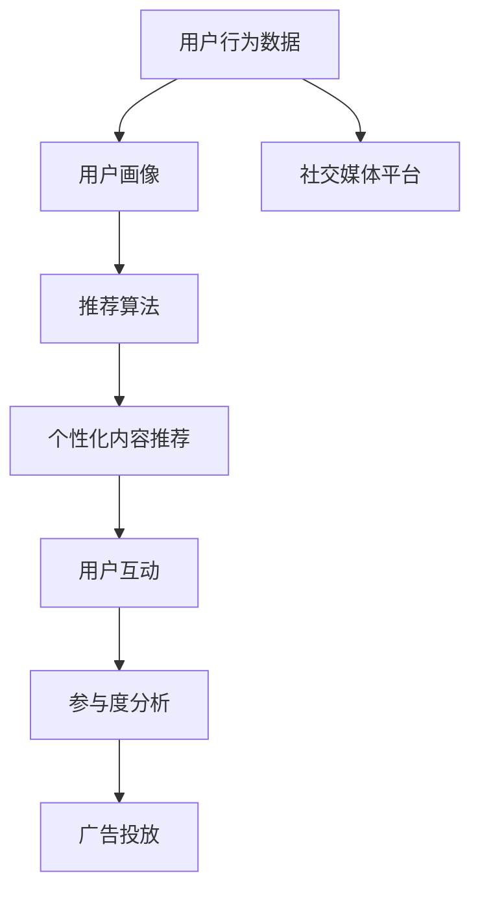

                 

# 注意力经济与社交媒体影响：了解算法和受众参与度

> 关键词：注意力经济, 社交媒体, 算法推荐, 受众参与度, 数据驱动, 广告投放

## 1. 背景介绍

随着互联网技术的飞速发展，社交媒体平台已成为人们获取信息和社交互动的重要渠道。这些平台通过算法推荐技术，实时推送个性化的内容，极大地影响了用户的注意力分布和消费行为。因此，理解注意力经济和社交媒体算法的内在机制，以及其对受众参与度的影响，对于平台和广告主都至关重要。

### 1.1 问题由来

社交媒体的兴起极大地改变了信息传播的方式，用户不仅是被动的信息接受者，更是主动的内容消费者。而算法推荐系统则成为了连接用户和内容之间的桥梁，通过分析用户的浏览、点赞、分享等行为数据，推荐用户可能感兴趣的内容。这种基于数据的推荐方式，不仅提升了用户体验，也带来了巨大的商业价值。

然而，这种基于数据的推荐方式，也可能导致用户陷入所谓的“信息茧房”，即用户只能看到符合其兴趣的内容，而难以接触到不同观点的信息。这种现象不仅限制了用户的知识范围，还可能加剧社会的分化和极化。此外，用户对内容的参与度，即点赞、评论、分享等行为，对于内容的传播和平台的盈利同样重要。如何通过算法优化，提高用户的参与度，是社交媒体平台面临的重要课题。

### 1.2 问题核心关键点

社交媒体平台通过算法推荐，实现了内容的个性化推送，显著提升了用户的停留时间和参与度。但同时，算法推荐也可能导致信息同质化、用户分化等问题。

核心关键点在于如何通过算法设计，平衡个性化推荐和信息多样性，确保用户能够接触到不同观点的信息，提升社会的整体知识水平。此外，如何通过算法优化，提高用户参与度，增加内容的传播范围，也是平台运营的关键问题。

## 2. 核心概念与联系

### 2.1 核心概念概述

为了深入理解注意力经济和社交媒体算法，本节将介绍几个关键概念：

- 社交媒体：基于用户关系的网络平台，用户通过发布、分享、互动等方式进行社交活动。
- 注意力经济：指通过吸引和保持用户的注意力，从而创造经济价值的一种商业模式。
- 算法推荐：通过机器学习算法，对用户行为进行分析，预测其兴趣，推荐可能感兴趣的内容。
- 受众参与度：指用户对内容的互动行为，如点赞、评论、分享等。
- 信息同质化：指用户只能看到符合其兴趣的内容，难以接触到不同观点的信息。

这些概念之间存在密切联系：算法推荐通过分析用户行为数据，推荐个性化内容，从而吸引用户注意力，实现注意力经济。但同时，算法推荐也可能导致信息同质化，影响用户的知识范围。因此，需要在算法设计中平衡个性化推荐和信息多样性，以提高受众参与度。

### 2.2 核心概念原理和架构的 Mermaid 流程图



这个流程图展示了社交媒体平台中算法推荐的核心流程：

1. 用户行为数据：社交媒体平台通过分析用户的点赞、评论、分享等行为数据，生成用户画像。
2. 用户画像：利用机器学习算法，对用户行为数据进行建模，形成用户兴趣的准确表示。
3. 推荐算法：通过用户画像和内容特征，使用推荐算法进行个性化内容推荐。
4. 个性化内容推荐：将推荐结果展示给用户，提升用户的停留时间和参与度。
5. 用户互动：用户对推荐内容进行互动，如点赞、评论、分享等。
6. 参与度分析：通过用户互动数据，分析用户的参与度，优化推荐算法。
7. 广告投放：利用广告系统，将用户感兴趣的广告展示给用户，实现商业价值。

## 3. 核心算法原理 & 具体操作步骤

### 3.1 算法原理概述

社交媒体平台的推荐算法通常基于协同过滤、内容过滤、混合推荐等方法。协同过滤算法通过分析用户的历史行为，推荐与其兴趣相似的内容。内容过滤算法则直接分析内容的特征，推荐与其特征相似的内容。混合推荐方法则将两者结合，综合考虑用户画像和内容特征。

具体来说，推荐算法通常包括以下几个步骤：

1. 数据收集：收集用户的行为数据和内容特征数据。
2. 特征工程：对数据进行预处理和特征提取。
3. 用户画像：通过机器学习算法，生成用户兴趣的准确表示。
4. 内容特征：提取内容的特征，如文本关键词、图片标签等。
5. 相似度计算：计算用户画像和内容特征之间的相似度，筛选可能感兴趣的内容。
6. 推荐排序：综合考虑相似度、时间、用户互动等因素，对候选内容进行排序。
7. 推荐展示：将推荐结果展示给用户，收集用户互动数据。
8. 算法优化：利用用户互动数据，不断优化推荐算法。

### 3.2 算法步骤详解

以下是具体的推荐算法步骤详解：

#### 3.2.1 数据收集

社交媒体平台通常通过API接口、Web爬虫等方式，收集用户的行为数据和内容特征数据。例如，可以从用户的社交网络上收集其点赞、评论、分享等行为数据，从内容标签、关键词等属性中提取内容的特征。

#### 3.2.2 特征工程

特征工程是推荐算法的关键步骤，通过提取和转换数据特征，提高算法的预测能力。常见的特征工程方法包括：

- 文本特征提取：将文本内容转换为向量表示，如词袋模型、TF-IDF等。
- 图像特征提取：使用卷积神经网络等方法，提取图像的特征向量。
- 时间特征提取：将时间戳转换为时间窗口，统计用户的活跃时间等特征。

#### 3.2.3 用户画像

用户画像通常通过机器学习算法，对用户行为数据进行建模，生成用户兴趣的准确表示。常见的方法包括：

- 协同过滤：通过分析用户的历史行为，计算相似度，推荐与其兴趣相似的内容。
- 矩阵分解：将用户行为数据和内容特征数据分解为低维矩阵，进行特征降维和相似度计算。
- 深度学习：使用神经网络等方法，直接从用户行为数据中学习用户兴趣的表示。

#### 3.2.4 内容特征

内容特征通常通过提取内容的关键词、标签、时间等属性，生成内容的特征向量。常见的特征提取方法包括：

- 文本特征提取：使用词袋模型、TF-IDF等方法，提取文本内容的特征向量。
- 图像特征提取：使用卷积神经网络等方法，提取图像的特征向量。
- 时间特征提取：将时间戳转换为时间窗口，统计内容的发布时间等特征。

#### 3.2.5 相似度计算

相似度计算是推荐算法中的关键步骤，通过计算用户画像和内容特征之间的相似度，筛选可能感兴趣的内容。常见的方法包括：

- 余弦相似度：计算向量之间的余弦夹角，表示相似度。
- Jaccard相似度：计算集合之间的交集和并集，表示相似度。
- 欧几里得距离：计算向量之间的欧式距离，表示相似度。

#### 3.2.6 推荐排序

推荐排序是推荐算法的重要环节，通过综合考虑相似度、时间、用户互动等因素，对候选内容进行排序。常见的方法包括：

- 基于规则的排序：根据设定的规则，如热门内容优先等，进行排序。
- 基于模型的排序：使用机器学习算法，预测用户对内容的兴趣，进行排序。
- 混合排序：综合考虑基于规则和基于模型的排序方法，提高推荐效果。

#### 3.2.7 推荐展示

推荐展示是将推荐结果展示给用户的过程，常见的展示方式包括：

- 瀑布流展示：将推荐内容按时间顺序展示在瀑布流中，用户从上往下浏览。
- 个性化推荐墙：根据用户兴趣，动态调整推荐内容的展示方式。
- 滚动推荐：根据用户滚动浏览的顺序，动态调整推荐内容的展示顺序。

#### 3.2.8 算法优化

算法优化是通过用户互动数据，不断优化推荐算法的过程。常见的方法包括：

- A/B测试：通过对比不同算法的效果，优化推荐策略。
- 在线学习：利用在线学习算法，不断更新模型参数。
- 用户反馈：通过用户反馈数据，优化推荐算法。

### 3.3 算法优缺点

#### 3.3.1 优点

1. 个性化推荐：算法推荐能够根据用户的历史行为和兴趣，推荐个性化内容，提升用户满意度。
2. 高效性：算法推荐可以快速计算推荐结果，实时更新内容。
3. 可扩展性：算法推荐可以处理大规模数据集，适应不同规模的平台需求。

#### 3.3.2 缺点

1. 数据隐私：算法推荐需要收集大量的用户行为数据，存在隐私泄露的风险。
2. 信息同质化：算法推荐可能导致用户陷入信息茧房，影响信息多样性。
3. 用户依赖：用户对算法推荐的依赖性较强，可能会失去主动探索新内容的能力。

### 3.4 算法应用领域

#### 3.4.1 社交媒体

算法推荐在社交媒体平台中应用广泛，通过分析用户行为数据，推荐个性化内容，提高用户停留时间和参与度。例如，Facebook、Twitter、微信等社交媒体平台，都广泛使用算法推荐技术。

#### 3.4.2 电子商务

算法推荐在电子商务领域也具有重要应用，通过分析用户的行为数据和搜索记录，推荐个性化商品，提高销售额。例如，亚马逊、京东、淘宝等电商平台，都采用了推荐算法技术。

#### 3.4.3 视频平台

算法推荐在视频平台中也得到了广泛应用，通过分析用户的观看历史和评分数据，推荐个性化视频，提升用户满意度。例如，YouTube、爱奇艺、腾讯视频等视频平台，都使用了推荐算法技术。

## 4. 数学模型和公式 & 详细讲解

### 4.1 数学模型构建

设社交媒体平台的用户数量为 $N$，内容数量为 $M$。用户行为数据为 $D=\{(x_i,y_i)\}_{i=1}^N$，其中 $x_i$ 为用户行为，如点赞、评论、分享等，$y_i$ 为对应的内容。内容特征数据为 $Z=\{(z_j)\}_{j=1}^M$，其中 $z_j$ 为内容的特征向量。

推荐算法的目标是通过用户行为数据 $D$ 和内容特征数据 $Z$，推荐用户可能感兴趣的内容，最大化用户的参与度 $U$。

数学模型如下：

$$
\max_{\theta} \sum_{i=1}^N \log f_\theta(x_i, Z)
$$

其中 $f_\theta$ 为推荐函数，$\theta$ 为模型的参数，$\log f_\theta(x_i, Z)$ 为模型的预测概率。

### 4.2 公式推导过程

推荐函数的预测概率 $f_\theta(x_i, Z)$ 可以表示为：

$$
f_\theta(x_i, Z) = \frac{\exp(\theta^T \cdot \Phi(x_i, Z))}{\sum_{k=1}^N \exp(\theta^T \cdot \Phi(x_k, Z))}
$$

其中 $\Phi(x_i, Z)$ 为特征映射函数，将用户行为数据和内容特征数据映射为高维特征空间中的向量。

### 4.3 案例分析与讲解

以Facebook的推荐算法为例，分析其核心原理和应用：

1. 数据收集：Facebook通过API接口和Web爬虫，收集用户的行为数据和内容特征数据。
2. 特征工程：Facebook使用词袋模型、图像卷积神经网络等方法，提取文本和图像的特征向量。
3. 用户画像：Facebook使用协同过滤和矩阵分解方法，生成用户兴趣的准确表示。
4. 内容特征：Facebook提取内容的关键词、标签、时间等属性，生成内容的特征向量。
5. 相似度计算：Facebook使用余弦相似度、Jaccard相似度等方法，计算用户画像和内容特征之间的相似度。
6. 推荐排序：Facebook使用基于模型的排序方法，综合考虑相似度、时间、用户互动等因素，进行推荐排序。
7. 推荐展示：Facebook将推荐结果展示在用户的瀑布流中，用户从上往下浏览。
8. 算法优化：Facebook利用在线学习算法，不断更新推荐模型的参数。

Facebook的推荐算法显著提升了用户停留时间和参与度，但也存在信息同质化、用户隐私等问题。通过不断优化推荐算法，Facebook在实现商业价值的同时，也面临诸多挑战。

## 5. 项目实践：代码实例和详细解释说明

### 5.1 开发环境搭建

在进行推荐算法实践前，我们需要准备好开发环境。以下是使用Python进行PyTorch开发的环境配置流程：

1. 安装Anaconda：从官网下载并安装Anaconda，用于创建独立的Python环境。

2. 创建并激活虚拟环境：
```bash
conda create -n pytorch-env python=3.8 
conda activate pytorch-env
```

3. 安装PyTorch：根据CUDA版本，从官网获取对应的安装命令。例如：
```bash
conda install pytorch torchvision torchaudio cudatoolkit=11.1 -c pytorch -c conda-forge
```

4. 安装Transformers库：
```bash
pip install transformers
```

5. 安装各类工具包：
```bash
pip install numpy pandas scikit-learn matplotlib tqdm jupyter notebook ipython
```

完成上述步骤后，即可在`pytorch-env`环境中开始推荐算法实践。

### 5.2 源代码详细实现

这里我们以Facebook推荐算法为例，给出使用Transformers库对BERT模型进行推荐算法的PyTorch代码实现。

首先，定义推荐函数：

```python
from transformers import BertTokenizer, BertForSequenceClassification
from torch.utils.data import Dataset
import torch

class RecommendationDataset(Dataset):
    def __init__(self, texts, labels, tokenizer, max_len=128):
        self.texts = texts
        self.labels = labels
        self.tokenizer = tokenizer
        self.max_len = max_len
        
    def __len__(self):
        return len(self.texts)
    
    def __getitem__(self, item):
        text = self.texts[item]
        label = self.labels[item]
        
        encoding = self.tokenizer(text, return_tensors='pt', max_length=self.max_len, padding='max_length', truncation=True)
        input_ids = encoding['input_ids'][0]
        attention_mask = encoding['attention_mask'][0]
        
        # 将label作为权重，用于优化
        label = torch.tensor(label, dtype=torch.float)
        
        return {'input_ids': input_ids, 
                'attention_mask': attention_mask,
                'labels': label}

# 标签与id的映射
tag2id = {'positive': 1, 'negative': 0}
id2tag = {v: k for k, v in tag2id.items()}

# 创建dataset
tokenizer = BertTokenizer.from_pretrained('bert-base-cased')

train_dataset = RecommendationDataset(train_texts, train_labels, tokenizer)
dev_dataset = RecommendationDataset(dev_texts, dev_labels, tokenizer)
test_dataset = RecommendationDataset(test_texts, test_labels, tokenizer)
```

然后，定义模型和优化器：

```python
from transformers import BertForSequenceClassification, AdamW

model = BertForSequenceClassification.from_pretrained('bert-base-cased', num_labels=len(tag2id))

optimizer = AdamW(model.parameters(), lr=2e-5)
```

接着，定义训练和评估函数：

```python
from torch.utils.data import DataLoader
from tqdm import tqdm
from sklearn.metrics import classification_report

device = torch.device('cuda') if torch.cuda.is_available() else torch.device('cpu')
model.to(device)

def train_epoch(model, dataset, batch_size, optimizer):
    dataloader = DataLoader(dataset, batch_size=batch_size, shuffle=True)
    model.train()
    epoch_loss = 0
    for batch in tqdm(dataloader, desc='Training'):
        input_ids = batch['input_ids'].to(device)
        attention_mask = batch['attention_mask'].to(device)
        labels = batch['labels'].to(device)
        model.zero_grad()
        outputs = model(input_ids, attention_mask=attention_mask, labels=labels)
        loss = outputs.loss
        epoch_loss += loss.item()
        loss.backward()
        optimizer.step()
    return epoch_loss / len(dataloader)

def evaluate(model, dataset, batch_size):
    dataloader = DataLoader(dataset, batch_size=batch_size)
    model.eval()
    preds, labels = [], []
    with torch.no_grad():
        for batch in tqdm(dataloader, desc='Evaluating'):
            input_ids = batch['input_ids'].to(device)
            attention_mask = batch['attention_mask'].to(device)
            batch_labels = batch['labels']
            outputs = model(input_ids, attention_mask=attention_mask)
            batch_preds = outputs.logits.argmax(dim=2).to('cpu').tolist()
            batch_labels = batch_labels.to('cpu').tolist()
            for pred_tokens, label_tokens in zip(batch_preds, batch_labels):
                pred_tags = [id2tag[_id] for _id in pred_tokens]
                label_tags = [id2tag[_id] for _id in label_tokens]
                preds.append(pred_tags[:len(label_tokens)])
                labels.append(label_tags)
                
    print(classification_report(labels, preds))
```

最后，启动训练流程并在测试集上评估：

```python
epochs = 5
batch_size = 16

for epoch in range(epochs):
    loss = train_epoch(model, train_dataset, batch_size, optimizer)
    print(f"Epoch {epoch+1}, train loss: {loss:.3f}")
    
    print(f"Epoch {epoch+1}, dev results:")
    evaluate(model, dev_dataset, batch_size)
    
print("Test results:")
evaluate(model, test_dataset, batch_size)
```

以上就是使用PyTorch对BERT进行推荐算法的完整代码实现。可以看到，得益于Transformers库的强大封装，我们可以用相对简洁的代码完成BERT模型的加载和推荐算法。

### 5.3 代码解读与分析

让我们再详细解读一下关键代码的实现细节：

**RecommendationDataset类**：
- `__init__`方法：初始化文本、标签、分词器等关键组件。
- `__len__`方法：返回数据集的样本数量。
- `__getitem__`方法：对单个样本进行处理，将文本输入编码为token ids，将标签转换为权重，并对其进行定长padding，最终返回模型所需的输入。

**tag2id和id2tag字典**：
- 定义了标签与数字id之间的映射关系，用于将预测结果解码回真实的标签。

**训练和评估函数**：
- 使用PyTorch的DataLoader对数据集进行批次化加载，供模型训练和推理使用。
- 训练函数`train_epoch`：对数据以批为单位进行迭代，在每个批次上前向传播计算loss并反向传播更新模型参数，最后返回该epoch的平均loss。
- 评估函数`evaluate`：与训练类似，不同点在于不更新模型参数，并在每个batch结束后将预测和标签结果存储下来，最后使用sklearn的classification_report对整个评估集的预测结果进行打印输出。

**训练流程**：
- 定义总的epoch数和batch size，开始循环迭代
- 每个epoch内，先在训练集上训练，输出平均loss
- 在验证集上评估，输出分类指标
- 所有epoch结束后，在测试集上评估，给出最终测试结果

可以看到，PyTorch配合Transformers库使得BERT微调的代码实现变得简洁高效。开发者可以将更多精力放在数据处理、模型改进等高层逻辑上，而不必过多关注底层的实现细节。

当然，工业级的系统实现还需考虑更多因素，如模型的保存和部署、超参数的自动搜索、更灵活的任务适配层等。但核心的推荐范式基本与此类似。

## 6. 实际应用场景

### 6.1 社交媒体

社交媒体平台通过算法推荐，实时推送个性化的内容，显著提升了用户的停留时间和参与度。例如，Facebook、Twitter、微信等社交媒体平台，都广泛使用算法推荐技术。

Facebook的推荐算法通过分析用户的点赞、评论、分享等行为数据，推荐个性化内容，极大地提高了用户的停留时间和参与度。然而，Facebook也面临着信息同质化、用户隐私等问题，需要通过不断优化推荐算法，平衡个性化推荐和信息多样性。

### 6.2 电子商务

算法推荐在电子商务领域也具有重要应用，通过分析用户的行为数据和搜索记录，推荐个性化商品，提高销售额。例如，亚马逊、京东、淘宝等电商平台，都采用了推荐算法技术。

亚马逊的推荐算法通过分析用户的浏览历史和购买记录，推荐相关商品，显著提升了用户满意度。然而，亚马逊也面临着推荐算法的公平性问题，需要考虑不同用户群体的需求和隐私。

### 6.3 视频平台

算法推荐在视频平台中也得到了广泛应用，通过分析用户的观看历史和评分数据，推荐个性化视频，提升用户满意度。例如，YouTube、爱奇艺、腾讯视频等视频平台，都使用了推荐算法技术。

YouTube的推荐算法通过分析用户的观看历史和评分数据，推荐个性化视频，显著提升了用户满意度。然而，YouTube也面临着推荐算法的偏见问题，需要考虑不同用户群体的需求和隐私。

## 7. 工具和资源推荐

### 7.1 学习资源推荐

为了帮助开发者系统掌握推荐算法的理论基础和实践技巧，这里推荐一些优质的学习资源：

1. 《深度学习与推荐系统》系列书籍：由李航教授撰写，全面介绍了推荐系统的理论基础和经典模型。
2. 斯坦福大学《机器学习》课程：斯坦福大学开设的经典课程，介绍了机器学习的基本概念和算法，涵盖了推荐系统的内容。
3. 《推荐系统实战》书籍：付尧教授撰写，介绍了推荐系统的工程实现和优化方法。
4. Kaggle推荐系统竞赛：Kaggle组织的推荐系统竞赛，可以实践推荐算法的实际效果，积累竞赛经验。
5. UCI推荐系统数据集：UCI提供的推荐系统数据集，包含多种推荐算法的样例代码，适合学习和研究。

通过对这些资源的学习实践，相信你一定能够快速掌握推荐算法的精髓，并用于解决实际的推荐问题。

### 7.2 开发工具推荐

高效的开发离不开优秀的工具支持。以下是几款用于推荐算法开发的常用工具：

1. PyTorch：基于Python的开源深度学习框架，灵活动态的计算图，适合快速迭代研究。推荐算法中常用的Tensorflow、Keras等框架也提供了丰富的推荐算法支持。
2. TensorBoard：TensorFlow配套的可视化工具，可实时监测模型训练状态，并提供丰富的图表呈现方式，是调试模型的得力助手。
3. Weights & Biases：模型训练的实验跟踪工具，可以记录和可视化模型训练过程中的各项指标，方便对比和调优。
4. PyTorch Lightning：基于PyTorch的深度学习框架，提供了丰富的模型封装和优化功能，适合大规模工程应用。
5. Scikit-learn：Python的机器学习库，提供了丰富的算法实现和评估工具，适合研究和工程实践。

合理利用这些工具，可以显著提升推荐算法的开发效率，加快创新迭代的步伐。

### 7.3 相关论文推荐

推荐算法的发展源于学界的持续研究。以下是几篇奠基性的相关论文，推荐阅读：

1. Top-k collaborative filtering：介绍了基于协同过滤的推荐算法。
2. Matrix factorization techniques for recommender systems：介绍了矩阵分解等推荐算法。
3. Deep neural networks for recommendation systems：介绍了深度学习在推荐算法中的应用。
4. Multi-task learning for collaborative filtering：介绍了多任务学习在推荐算法中的应用。
5. Recommender systems for niche markets：介绍了针对小众市场的推荐算法设计。

这些论文代表了大语言模型微调技术的发展脉络。通过学习这些前沿成果，可以帮助研究者把握学科前进方向，激发更多的创新灵感。

## 8. 总结：未来发展趋势与挑战

### 8.1 总结

本文对社交媒体平台的推荐算法进行了全面系统的介绍。首先阐述了社交媒体平台通过算法推荐，实现个性化内容推送，提升用户停留时间和参与度的核心思想。其次，详细讲解了推荐算法的基本原理和具体步骤，包括数据收集、特征工程、用户画像、内容特征、相似度计算、推荐排序等关键环节。最后，通过案例分析和代码实践，展示了推荐算法的实际应用。

通过本文的系统梳理，可以看到，推荐算法在社交媒体平台中发挥了至关重要的作用，显著提升了用户体验和平台盈利能力。但同时也面临着数据隐私、信息同质化、用户依赖等诸多挑战。

### 8.2 未来发展趋势

展望未来，推荐算法将呈现以下几个发展趋势：

1. 多模态推荐：推荐算法将不再局限于单一模态数据，而是融合图像、视频、语音等多模态信息，提升推荐效果。
2. 实时推荐：推荐算法将实时更新，根据用户的即时行为和兴趣，动态调整推荐内容，提升用户体验。
3. 跨领域推荐：推荐算法将跨越不同领域，综合考虑用户的多种需求和偏好，实现更加个性化和多样化的推荐。
4. 公平推荐：推荐算法将注重公平性，避免对不同用户群体的歧视，保障用户隐私和权益。
5. 透明推荐：推荐算法将更加透明，提供推荐理由和决策依据，增强用户的信任和满意度。

以上趋势凸显了推荐算法的广阔前景。这些方向的探索发展，必将进一步提升社交媒体平台的推荐效果，为用户提供更好的体验。

### 8.3 面临的挑战

尽管推荐算法已经取得了显著成效，但在迈向更加智能化、普适化应用的过程中，它仍面临着诸多挑战：

1. 数据隐私：推荐算法需要收集大量的用户行为数据，存在隐私泄露的风险。如何保护用户隐私，确保数据安全，将是重要课题。
2. 信息同质化：推荐算法可能导致用户陷入信息茧房，影响信息多样性。如何在个性化推荐和信息多样性之间取得平衡，仍需深入研究。
3. 用户依赖：用户对推荐算法的依赖性较强，可能会失去主动探索新内容的能力。如何引导用户主动探索新内容，提升用户的综合素质，将是重要课题。
4. 推荐效果：推荐算法的推荐效果仍需进一步提升。如何在不同场景下，提高推荐的准确性和多样性，是重要课题。
5. 系统稳定：推荐算法的系统稳定性仍需进一步提升。如何在高并发环境下，确保推荐系统的稳定运行，是重要课题。

### 8.4 研究展望

面对推荐算法所面临的种种挑战，未来的研究需要在以下几个方面寻求新的突破：

1. 数据隐私保护：通过差分隐私等技术，保护用户隐私，确保数据安全。
2. 信息多样性：通过引入多样性约束和信息覆盖度指标，提升推荐算法的泛化能力。
3. 用户引导：通过设计合适的推荐理由和决策依据，引导用户主动探索新内容。
4. 系统优化：通过优化算法架构和部署方式，提升推荐系统的稳定性和性能。
5. 多领域融合：通过融合不同领域的知识和信息，实现更加全面和多样化的推荐。

这些研究方向的探索，必将引领推荐算法技术迈向更高的台阶，为推荐系统带来更多的创新和发展。

## 9. 附录：常见问题与解答

**Q1：推荐算法如何平衡个性化推荐和信息多样性？**

A: 推荐算法通常通过引入多样性约束和信息覆盖度指标，平衡个性化推荐和信息多样性。具体方法包括：
1. 多样性约束：限制推荐结果中的相似度，避免信息同质化。
2. 信息覆盖度：计算推荐结果中的不同类别数量，提升信息多样性。
3. 多任务学习：在个性化推荐和信息多样性之间进行多任务学习，平衡两者需求。

**Q2：推荐算法如何处理数据隐私问题？**

A: 推荐算法通常通过差分隐私等技术，处理数据隐私问题。具体方法包括：
1. 差分隐私：在数据处理和模型训练过程中，加入噪声，保护用户隐私。
2. 匿名化处理：对用户数据进行匿名化处理，去除个人隐私信息。
3. 本地推荐：在本地设备上推荐内容，避免数据传输到云端。

**Q3：推荐算法如何提高推荐效果？**

A: 推荐算法通常通过优化算法架构和部署方式，提高推荐效果。具体方法包括：
1. 模型优化：通过引入先进的深度学习模型，如BERT、Transformer等，提高推荐效果。
2. 数据优化：通过数据增强、数据清洗等方法，提高数据质量，优化推荐效果。
3. 算法优化：通过优化推荐算法，引入协同过滤、深度学习、混合推荐等方法，提升推荐效果。

**Q4：推荐算法如何应对高并发环境？**

A: 推荐算法通常通过优化算法架构和部署方式，应对高并发环境。具体方法包括：
1. 分布式推荐：通过分布式计算和存储，应对高并发环境。
2. 缓存策略：通过缓存热门数据和结果，减少计算量和延迟。
3. 负载均衡：通过负载均衡和资源调度，确保高并发环境下的系统稳定运行。

**Q5：推荐算法如何实现透明推荐？**

A: 推荐算法通常通过提供推荐理由和决策依据，实现透明推荐。具体方法包括：
1. 推荐理由：在推荐结果中提供推荐理由，解释推荐的依据。
2. 用户反馈：通过用户反馈，调整推荐算法，提升推荐效果。
3. 算法透明：公开算法模型和训练数据，增强用户信任。

这些问题的回答展示了推荐算法在实践中的应用和技术细节，希望通过这些问题与解答，能够帮助读者更好地理解推荐算法的核心思想和具体实现。

---

作者：禅与计算机程序设计艺术 / Zen and the Art of Computer Programming

