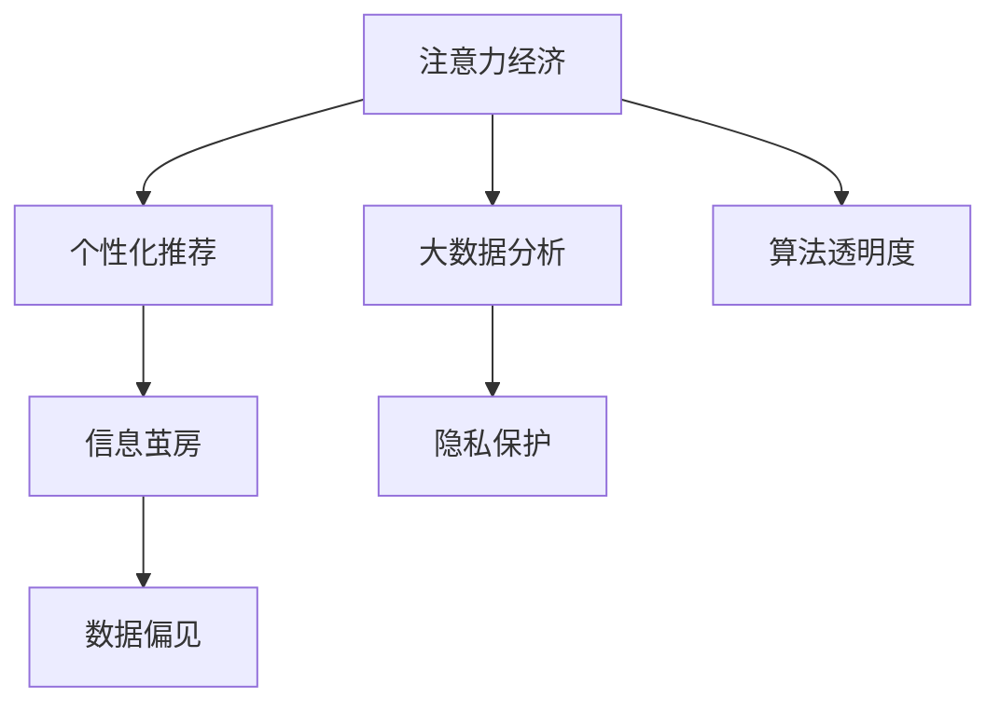

                 

# 注意力经济与社交媒体影响：谁在控制你看什么

> 关键词：注意力经济, 社交媒体, 个性化推荐, 大数据, 隐私保护, 算法透明度, 数据偏见

## 1. 背景介绍

### 1.1 问题由来
随着互联网的普及和社交媒体的兴起，注意力经济（Attention Economy）已成为当代经济的重要组成部分。社交媒体平台利用算法技术，根据用户的互动数据，推荐内容，引导用户注意力。这种通过算法抓取、分配、利用用户注意力的经济活动，被称为注意力经济。

随着技术的发展，社交媒体平台逐渐成为信息传播的主要渠道，对公众的认知和行为产生深远影响。用户对内容的消费越来越依赖推荐系统，而这些推荐系统往往基于用户的兴趣和行为，形成所谓的“信息茧房”，导致用户只接触到他们习惯性或偏好的信息，从而可能产生偏见、缩小视野、甚至影响政治和社会观点。

### 1.2 问题核心关键点
1. **算法驱动的个性化推荐**：社交媒体平台通过算法对用户行为数据进行深度分析，预测其兴趣和偏好，进而推送符合用户期望的内容。
2. **信息茧房效应**：算法推荐系统可能只呈现符合用户过去喜好的内容，导致信息泡泡，限制用户的视野。
3. **数据隐私问题**：社交媒体平台收集大量用户数据，涉及隐私和数据安全问题，需要加以规范和保护。
4. **算法透明度和偏见**：算法推荐系统的决策过程复杂，缺乏透明性，可能导致算法偏见和歧视。

## 2. 核心概念与联系

### 2.1 核心概念概述

为更好地理解注意力经济和社交媒体对信息获取的影响，本节将介绍几个密切相关的核心概念：

- **注意力经济（Attention Economy）**：一种新型的经济模式，基于数字技术，通过注意力资源进行价值创造和分配，典型的代表是社交媒体推荐系统。
- **个性化推荐系统（Personalized Recommendation System）**：基于用户行为数据和偏好，推荐个性化的内容，广泛应用于电子商务、视频平台、新闻媒体等。
- **信息茧房（Information Bubble）**：由算法推荐导致的用户只接触到他们习惯性或偏好的信息，形成的信息泡泡，可能限制用户的视野和认知。
- **大数据分析（Big Data Analysis）**：利用大规模数据集进行深度分析，挖掘用户行为和偏好，预测用户行为，实现个性化推荐。
- **隐私保护（Privacy Protection）**：在数据收集和分析过程中，保护用户的隐私权利，避免敏感信息泄露。
- **算法透明度（Algorithmic Transparency）**：推荐系统的决策过程透明化，使用户能够理解系统推荐内容的依据。
- **数据偏见（Data Bias）**：算法推荐系统可能因为数据偏见，导致不公平或歧视性的内容推荐。

这些核心概念之间的逻辑关系可以通过以下Mermaid流程图来展示：



这个流程图展示了几大核心概念之间的关联：

1. 注意力经济依赖个性化推荐系统，通过数据分析和算法推荐吸引用户注意。
2. 个性化推荐可能导致信息茧房，限制用户的视野。
3. 算法推荐系统的数据偏见可能影响用户的认知和行为。
4. 大数据分析需要保护用户隐私，避免数据滥用。
5. 推荐系统的决策过程需要透明，让用户能够理解推荐依据。

这些概念共同构成了社交媒体推荐系统的核心要素，帮助理解其工作机制和潜在问题。

## 3. 核心算法原理 & 具体操作步骤
### 3.1 算法原理概述

社交媒体平台上的个性化推荐系统，通常基于用户行为数据，构建用户兴趣模型，进行个性化内容推荐。其核心算法主要包括协同过滤、内容推荐、混合推荐等。

协同过滤算法通过分析用户行为和历史数据，发现相似用户群体，从而为用户推荐类似用户喜欢的内容。内容推荐算法则直接根据内容特征，如关键词、主题、用户偏好等，进行推荐。混合推荐系统则综合多种算法，提升推荐效果。

### 3.2 算法步骤详解

以下我们将详细介绍个性化推荐系统的基本步骤：

**Step 1: 数据收集与处理**
- 收集用户行为数据，如浏览、点击、收藏、评论等行为记录。
- 对原始数据进行清洗、过滤和预处理，形成干净、格式统一的数据集。
- 划分训练集、验证集和测试集，用于模型的训练、验证和评估。

**Step 2: 特征工程**
- 提取特征向量，如用户ID、内容ID、时间戳、位置等，用于模型训练。
- 对特征进行编码和归一化，便于模型处理。
- 引入交叉特征，如用户活跃时间、设备类型、浏览器类型等，提升模型效果。

**Step 3: 模型训练**
- 选择合适的算法，如协同过滤、内容推荐、混合推荐等，进行模型训练。
- 调整超参数，如学习率、正则化系数等，优化模型性能。
- 使用交叉验证等技术，防止过拟合和欠拟合。

**Step 4: 模型评估**
- 在测试集上评估模型的推荐效果，常用的指标包括准确率、召回率、F1分数等。
- 分析模型在特定群体、场景下的表现，发现潜在问题。
- 根据评估结果，迭代优化模型，提升推荐质量。

**Step 5: 推荐策略调整**
- 基于模型评估结果，调整推荐策略，如增加负样本推荐、引入多样性约束等。
- 动态更新模型，根据新数据和用户行为变化进行调整。
- 结合人工审核和用户反馈，优化推荐内容。

### 3.3 算法优缺点

个性化推荐系统具有以下优点：
1. 高效精准：通过分析用户行为数据，能够精准推荐符合用户兴趣的内容。
2. 提升用户体验：个性化推荐能够显著提升用户体验，提高用户粘性。
3. 减少信息过载：推荐系统能够帮助用户过滤无关信息，减少信息过载。

同时，该系统也存在一些局限：
1. 数据依赖：推荐系统的性能高度依赖用户数据，缺乏多样性数据可能导致性能下降。
2. 用户隐私：收集和处理大量用户数据可能引发隐私问题，需要加以保护。
3. 算法透明：推荐系统的决策过程复杂，缺乏透明性，可能导致用户不信任。
4. 数据偏见：基于历史数据进行推荐可能导致数据偏见，影响公平性。

尽管存在这些局限，但个性化推荐系统依然广泛应用在社交媒体平台，成为吸引用户注意力的重要手段。

### 3.4 算法应用领域

个性化推荐系统在社交媒体平台中应用广泛，以下是几个典型场景：

- **新闻推荐**：根据用户阅读历史、点赞、评论等行为，推荐相关新闻内容。
- **视频推荐**：根据用户观看历史、评分、订阅等行为，推荐视频内容。
- **商品推荐**：根据用户浏览历史、购买记录、收藏等行为，推荐商品信息。
- **音乐推荐**：根据用户听歌历史、评分、收藏等行为，推荐音乐内容。
- **社交网络**：根据用户互动行为，推荐可能感兴趣的朋友、群组等社交对象。

除了上述这些经典应用，个性化推荐系统还在智能家居、在线教育、金融服务等众多领域得到应用，为用户的日常生活带来便利和高效。

## 4. 数学模型和公式 & 详细讲解 & 举例说明
### 4.1 数学模型构建

我们以协同过滤算法为例，介绍推荐系统中的基本数学模型。

设用户集合为 $U$，物品集合为 $I$，用户对物品的评分矩阵为 $R \in \mathbb{R}^{m \times n}$，其中 $m$ 为物品数量，$n$ 为用户数量。协同过滤的目标是通过用户间的相似性，推断用户对物品的评分。

设用户 $u$ 对物品 $i$ 的评分为 $r_{ui}$，用户间的相似度矩阵为 $S \in \mathbb{R}^{n \times n}$，则协同过滤模型的目标是最小化均方误差：

$$
\min_{S} \sum_{i=1}^m \sum_{j=1}^n (r_{ij} - \alpha_{i}S_{ij})^2
$$

其中 $\alpha_i$ 为用户 $i$ 的评分向量，$S_{ij}$ 为相似度矩阵中的元素，$\alpha_i$ 和 $S_{ij}$ 通过用户行为数据进行计算。

### 4.2 公式推导过程

假设用户 $u$ 和 $v$ 之间的相似度为 $S_{uv}$，用户 $v$ 对物品 $i$ 的评分为 $r_{vi}$，则协同过滤算法的基本思想是通过用户 $v$ 的评分向量，推断用户 $u$ 对物品 $i$ 的评分，即：

$$
\alpha_u = \sum_{v \in U} S_{uv} \alpha_v
$$

将 $\alpha_u$ 代入评分预测公式，得：

$$
\hat{r}_{ui} = \alpha_u^T S_i
$$

其中 $S_i = [S_{ij}]_{j=1}^n$ 为用户 $i$ 的评分向量。

最终，协同过滤算法通过用户间相似度的计算，将用户 $u$ 对物品 $i$ 的评分预测为：

$$
\hat{r}_{ui} = \alpha_u^T S_i = (\sum_{v \in U} S_{uv} \alpha_v)^T S_i
$$

### 4.3 案例分析与讲解

以Netflix推荐系统为例，分析协同过滤算法的应用和效果。

Netflix通过收集用户观看历史数据，构建用户间的相似度矩阵。设用户 $u$ 和 $v$ 的相似度为 $S_{uv}$，用户 $v$ 对电影 $i$ 的评分为 $r_{vi}$，则协同过滤的目标是最小化预测评分与真实评分之间的误差。

通过协同过滤算法，Netflix能够为每个用户推荐与其相似度高的电影，提升用户满意度。同时，Netflix还引入了内容推荐算法，结合用户行为和电影特征，提升推荐质量。

Netflix的推荐系统在提升用户留存和满意度方面取得了显著效果，其推荐算法已成业界标杆。

## 5. 项目实践：代码实例和详细解释说明
### 5.1 开发环境搭建

在进行推荐系统开发前，我们需要准备好开发环境。以下是使用Python进行PyTorch开发的环境配置流程：

1. 安装Anaconda：从官网下载并安装Anaconda，用于创建独立的Python环境。

2. 创建并激活虚拟环境：
```bash
conda create -n recsys-env python=3.8 
conda activate recsys-env
```

3. 安装PyTorch：根据CUDA版本，从官网获取对应的安装命令。例如：
```bash
conda install pytorch torchvision torchaudio cudatoolkit=11.1 -c pytorch -c conda-forge
```

4. 安装Transformers库：
```bash
pip install transformers
```

5. 安装各类工具包：
```bash
pip install numpy pandas scikit-learn matplotlib tqdm jupyter notebook ipython
```

完成上述步骤后，即可在`recsys-env`环境中开始推荐系统开发。

### 5.2 源代码详细实现

下面我们以协同过滤算法为例，给出使用PyTorch实现个性化推荐系统的代码实现。

首先，定义协同过滤算法的基本模块：

```python
import torch
import torch.nn as nn
import torch.nn.functional as F
from sklearn.metrics import mean_squared_error

class CollaborativeFiltering(nn.Module):
    def __init__(self, num_users, num_items, hidden_size=100):
        super(CollaborativeFiltering, self).__init__()
        self.num_users = num_users
        self.num_items = num_items
        self.hidden_size = hidden_size
        
        self.user_embeddings = nn.Embedding(num_users, hidden_size)
        self.item_embeddings = nn.Embedding(num_items, hidden_size)
        self.sigmoid = nn.Sigmoid()
        
    def forward(self, user_idx, item_idx):
        user_embeddings = self.user_embeddings(user_idx)
        item_embeddings = self.item_embeddings(item_idx)
        dot_product = torch.sum(user_embeddings * item_embeddings, dim=1)
        prediction = self.sigmoid(dot_product)
        return prediction
```

然后，定义数据处理函数：

```python
from sklearn.datasets import fetch_openml
from sklearn.model_selection import train_test_split

def load_movielens_data():
    data = fetch_openml('movielens-100k', version=1, as_frame=True)
    df = data.frame.data
    
    train_df, test_df = train_test_split(df, test_size=0.2, random_state=42)
    train_data = train_df.drop(['user_id', 'item_id', 'rating'], axis=1)
    test_data = test_df.drop(['user_id', 'item_id', 'rating'], axis=1)
    
    train_user_idx, train_item_idx, train_ratings = train_data['user_id'].values, train_data['item_id'].values, train_data['rating'].values
    test_user_idx, test_item_idx, test_ratings = test_data['user_id'].values, test_data['item_id'].values, test_data['rating'].values
    
    return train_user_idx, train_item_idx, train_ratings, test_user_idx, test_item_idx, test_ratings
```

最后，启动训练流程并在测试集上评估：

```python
train_user_idx, train_item_idx, train_ratings, test_user_idx, test_item_idx, test_ratings = load_movielens_data()

num_users = len(train_user_idx.unique())
num_items = len(train_item_idx.unique())

model = CollaborativeFiltering(num_users, num_items)
optimizer = torch.optim.Adam(model.parameters(), lr=0.001)
criterion = nn.BCELoss()

for epoch in range(10):
    model.train()
    for user_idx, item_idx in zip(train_user_idx, train_item_idx):
        prediction = model(user_idx, item_idx)
        loss = criterion(prediction, train_ratings)
        optimizer.zero_grad()
        loss.backward()
        optimizer.step()
    
    model.eval()
    with torch.no_grad():
        test_preds = []
        for user_idx, item_idx in zip(test_user_idx, test_item_idx):
            prediction = model(user_idx, item_idx)
            test_preds.append(prediction.item())
        test_preds = torch.tensor(test_preds, dtype=torch.float)
        mse = mean_squared_error(test_preds, test_ratings)
        print(f"Epoch {epoch+1}, Test MSE: {mse:.4f}")
```

以上就是使用PyTorch实现协同过滤算法的完整代码实现。可以看到，借助PyTorch的高级API，我们能够便捷地构建和训练协同过滤模型。

### 5.3 代码解读与分析

让我们再详细解读一下关键代码的实现细节：

**CollaborativeFiltering类**：
- `__init__`方法：初始化协同过滤模型的超参数和网络结构。
- `forward`方法：定义前向传播过程，计算预测评分。

**load_movielens_data函数**：
- 从OpenML加载数据集，进行数据清洗和划分。
- 将用户ID和物品ID作为模型输入，将评分作为监督信号。

**训练流程**：
- 定义训练集和测试集的用户ID和物品ID，模型参数，优化器和损失函数。
- 循环迭代模型训练，每次计算预测评分并优化模型参数。
- 在测试集上评估模型性能，计算平均绝对误差(MSE)。

**注意点**：
- 实际应用中，数据预处理、特征工程和模型评估环节需要根据具体情况进一步优化。
- 可以使用更复杂的模型结构和优化器，如深度神经网络、深度矩阵分解等，提升推荐效果。
- 需要对用户隐私和数据安全进行保护，防止数据滥用。

## 6. 实际应用场景
### 6.1 智能推荐系统

基于协同过滤和内容推荐算法，智能推荐系统可以在电商、视频、音乐等多个领域得到应用。用户通过浏览、评分、订阅等行为，生成推荐模型所需的数据，系统根据用户行为和兴趣，动态推荐商品、视频、音乐等内容。

智能推荐系统不仅能够提高用户体验，还能显著提升用户转化率和留存率。Netflix、Amazon等平台通过推荐系统，实现了用户的个性化体验，提升了用户粘性，从而增加收益。

### 6.2 新闻推荐系统

新闻推荐系统通过分析用户的阅读历史、点赞、评论等行为，为用户推荐相关新闻内容。这种基于用户兴趣的推荐，能够显著提高新闻平台的点击率和用户留存率。

Google News和BBC News等新闻平台，通过个性化推荐，帮助用户发现更多感兴趣的新闻，提升用户体验。推荐系统的引入，改变了传统新闻平台的分发方式，提高了新闻的传播效率。

### 6.3 社交网络推荐

社交网络平台通过分析用户互动数据，为用户推荐可能感兴趣的朋友、群组等社交对象。这种基于用户社交关系的推荐，能够显著提高用户粘性和平台活跃度。

Facebook和LinkedIn等社交平台，通过推荐系统，帮助用户发现更多有趣的社交对象，提升用户互动和平台粘性。推荐系统不仅能够提高用户满意度，还能增加平台流量，带来更多的商业机会。

### 6.4 未来应用展望

未来，随着个性化推荐技术的进一步发展，社交媒体推荐系统将在更多领域得到应用，提升用户体验和平台价值。

在智慧医疗领域，个性化推荐系统可以用于推荐医生、药品、治疗方案等，提升医疗服务质量。

在智慧教育领域，推荐系统可以推荐适合学生的学习内容和资源，提升学习效果。

在智能家居领域，推荐系统可以推荐合适的家电产品和服务，提升用户生活品质。

此外，在企业培训、金融理财、智能客服等多个领域，个性化推荐系统都有广阔的应用前景。

## 7. 工具和资源推荐
### 7.1 学习资源推荐

为了帮助开发者系统掌握个性化推荐技术，这里推荐一些优质的学习资源：

1. 《推荐系统实战》系列博文：由推荐系统专家撰写，深入浅出地介绍了推荐系统的理论基础和实际应用。

2. CS260《大规模在线机器学习》课程：斯坦福大学开设的推荐系统课程，涵盖推荐系统原理、算法、应用等多个方面。

3. 《推荐系统》书籍：推荐系统领域的经典教材，详细介绍了推荐算法、数据处理、系统设计等。

4. Kaggle推荐系统竞赛：参与推荐系统竞赛，通过实战经验提升推荐系统开发能力。

5. Arxiv推荐系统论文库：最新最前沿的推荐系统论文，提供丰富的研究资料和灵感。

通过对这些资源的学习实践，相信你一定能够快速掌握个性化推荐技术的精髓，并用于解决实际的推荐问题。

### 7.2 开发工具推荐

高效的开发离不开优秀的工具支持。以下是几款用于推荐系统开发的常用工具：

1. PyTorch：基于Python的开源深度学习框架，灵活动态的计算图，适合快速迭代研究。推荐系统中的深度神经网络模型多使用PyTorch实现。

2. TensorFlow：由Google主导开发的开源深度学习框架，生产部署方便，适合大规模工程应用。推荐系统中深度矩阵分解等模型也常使用TensorFlow实现。

3. Scikit-learn：Python的科学计算库，提供多种机器学习算法，适合数据预处理和特征工程。推荐系统中的协同过滤等算法常用Scikit-learn实现。

4. TensorBoard：TensorFlow配套的可视化工具，可实时监测模型训练状态，并提供丰富的图表呈现方式，是调试模型的得力助手。

5. Weights & Biases：模型训练的实验跟踪工具，可以记录和可视化模型训练过程中的各项指标，方便对比和调优。

6. Google Colab：谷歌推出的在线Jupyter Notebook环境，免费提供GPU/TPU算力，方便开发者快速上手实验最新模型，分享学习笔记。

合理利用这些工具，可以显著提升推荐系统的开发效率，加快创新迭代的步伐。

### 7.3 相关论文推荐

个性化推荐技术的发展源于学界的持续研究。以下是几篇奠基性的相关论文，推荐阅读：

1. Matrix Factorization Techniques for Recommender Systems：提出矩阵分解算法，为协同过滤推荐系统提供了数学基础。

2. Item-based Collaborative Filtering for Recommendation Engines：提出基于物品的协同过滤算法，进一步提升了推荐系统的效果。

3. Deep Collaborative Filtering for Recommender Systems：提出深度神经网络用于推荐系统，提升了模型的预测能力和鲁棒性。

4. Multi-task Learning for Recommendation Systems：提出多任务学习算法，提升了推荐系统的跨领域泛化能力。

5. Top-K Randomized Matrix Factorization：提出随机矩阵分解算法，提升推荐系统的可解释性和效率。

这些论文代表了个性化推荐技术的发展脉络。通过学习这些前沿成果，可以帮助研究者把握学科前进方向，激发更多的创新灵感。

## 8. 总结：未来发展趋势与挑战
### 8.1 总结

本文对基于协同过滤和内容推荐算法的个性化推荐系统进行了全面系统的介绍。首先阐述了个性化推荐系统在社交媒体平台中的应用背景和重要性，明确了其在提升用户体验、提高平台价值方面的独特价值。其次，从原理到实践，详细讲解了协同过滤和内容推荐的基本步骤，给出了推荐系统开发的完整代码实例。同时，本文还广泛探讨了推荐系统在电商、视频、新闻等多个行业领域的应用前景，展示了个性化推荐技术的巨大潜力。

通过本文的系统梳理，可以看到，基于协同过滤和内容推荐的个性化推荐系统正在成为社交媒体平台的重要范式，极大地拓展了用户关注内容的边界，为用户带来了更个性化的体验。未来，伴随推荐技术的不断进步，个性化推荐系统将在更多领域得到应用，为经济社会发展注入新的动力。

### 8.2 未来发展趋势

展望未来，个性化推荐技术将呈现以下几个发展趋势：

1. 跨领域推荐：推荐系统将不仅基于用户行为数据，还引入外部知识、规则等，进行跨领域推荐，提升推荐效果。
2. 实时推荐：推荐系统将实时更新，动态调整推荐策略，根据用户实时行为进行推荐，提升推荐效果和用户体验。
3. 个性化推荐算法将更多引入人工智能技术，如深度学习、生成对抗网络等，提升推荐模型的预测能力和泛化能力。
4. 推荐系统将更多关注用户隐私和数据安全，通过差分隐私等技术保护用户数据，防止数据滥用。
5. 推荐系统的决策过程将更加透明，使用户能够理解推荐依据，提升用户信任。

以上趋势凸显了个性化推荐技术的广阔前景。这些方向的探索发展，必将进一步提升推荐系统的性能和应用范围，为智能经济时代的到来提供有力支持。

### 8.3 面临的挑战

尽管个性化推荐技术已经取得了瞩目成就，但在迈向更加智能化、普适化应用的过程中，它仍面临着诸多挑战：

1. 数据依赖：推荐系统的性能高度依赖用户行为数据，缺乏多样性数据可能导致性能下降。
2. 用户隐私：收集和处理大量用户数据可能引发隐私问题，需要加以保护。
3. 算法透明：推荐系统的决策过程复杂，缺乏透明性，可能导致用户不信任。
4. 数据偏见：基于历史数据进行推荐可能导致数据偏见，影响公平性。

尽管存在这些局限，但个性化推荐系统依然广泛应用在社交媒体平台，成为吸引用户注意力的重要手段。

### 8.4 研究展望

面对个性化推荐技术面临的挑战，未来的研究需要在以下几个方面寻求新的突破：

1. 探索无监督和半监督推荐方法。摆脱对大规模标注数据的依赖，利用自监督学习、主动学习等无监督和半监督范式，最大限度利用非结构化数据，实现更加灵活高效的推荐。

2. 研究参数高效和计算高效的推荐范式。开发更加参数高效的推荐方法，在固定大部分预训练参数的同时，只更新极少量的任务相关参数。同时优化推荐模型的计算图，减少前向传播和反向传播的资源消耗，实现更加轻量级、实时性的部署。

3. 融合因果和对比学习范式。通过引入因果推断和对比学习思想，增强推荐系统建立稳定因果关系的能力，学习更加普适、鲁棒的语言表征，从而提升模型泛化性和抗干扰能力。

4. 引入更多先验知识。将符号化的先验知识，如知识图谱、逻辑规则等，与神经网络模型进行巧妙融合，引导推荐过程学习更准确、合理的语言模型。同时加强不同模态数据的整合，实现视觉、语音等多模态信息与文本信息的协同建模。

5. 结合因果分析和博弈论工具。将因果分析方法引入推荐系统，识别出推荐决策的关键特征，增强输出解释的因果性和逻辑性。借助博弈论工具刻画人机交互过程，主动探索并规避推荐系统的脆弱点，提高系统稳定性。

6. 纳入伦理道德约束。在推荐目标中引入伦理导向的评估指标，过滤和惩罚有偏见、有害的输出倾向。同时加强人工干预和审核，建立推荐系统的监管机制，确保输出的安全性。

这些研究方向的探索，必将引领个性化推荐技术迈向更高的台阶，为构建安全、可靠、可解释、可控的智能系统铺平道路。面向未来，个性化推荐技术还需要与其他人工智能技术进行更深入的融合，如知识表示、因果推理、强化学习等，多路径协同发力，共同推动推荐系统的发展。只有勇于创新、敢于突破，才能不断拓展推荐系统的边界，让智能技术更好地造福人类社会。

## 9. 附录：常见问题与解答

**Q1：个性化推荐系统是否适用于所有推荐场景？**

A: 个性化推荐系统在大多数推荐场景中都能取得不错的效果，特别是对于数据量较小的场景。但对于一些需要时效性、个性化很强的场景，如实时推荐、跨领域推荐等，推荐系统需要更多的优化和改进。

**Q2：推荐系统如何平衡推荐效果和个性化？**

A: 推荐系统需要平衡推荐效果和个性化，可以通过以下方式：
1. 引入多样性约束：在推荐模型中加入多样性惩罚，避免推荐单一内容。
2. 调整推荐策略：根据用户偏好和行为变化，动态调整推荐策略，提升用户体验。
3. 结合用户反馈：根据用户反馈，优化推荐模型，提升推荐质量。

**Q3：推荐系统如何避免信息过载？**

A: 推荐系统需要避免信息过载，可以通过以下方式：
1. 限制推荐数量：设定推荐上限，避免推荐过多内容。
2. 引入上下文信息：结合用户行为和场景信息，进行个性化推荐。
3. 动态调整推荐策略：根据用户反馈，动态调整推荐策略，避免推荐无关内容。

**Q4：推荐系统如何保护用户隐私？**

A: 推荐系统需要保护用户隐私，可以通过以下方式：
1. 匿名化处理：对用户数据进行匿名化处理，防止数据泄露。
2. 差分隐私：使用差分隐私技术，保护用户隐私，防止数据滥用。
3. 访问控制：对用户数据进行访问控制，防止数据滥用。

**Q5：推荐系统的推荐结果如何解释？**

A: 推荐系统的推荐结果可以通过以下方式进行解释：
1. 引入因果分析：通过因果分析方法，解释推荐结果的因果关系。
2. 结合知识图谱：引入知识图谱等外部知识，解释推荐结果的依据。
3. 使用可视化和分析工具：使用可视化和分析工具，帮助用户理解推荐结果。

通过对这些问题的详细解答，相信你一定能够全面了解个性化推荐系统的核心要素和应用策略，为推荐系统的开发和优化提供有力支持。

---

作者：禅与计算机程序设计艺术 / Zen and the Art of Computer Programming

