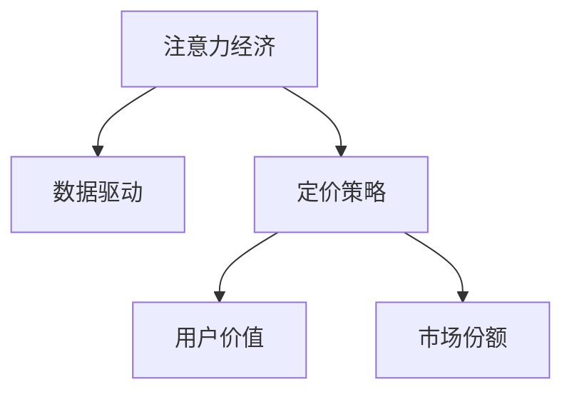

                 

## 1. 背景介绍

随着互联网和数字技术的迅猛发展，我们进入了一个全新的经济时代——注意力经济（Attention Economy）。注意力经济时代，信息过载、注意力稀缺，如何在海量信息中脱颖而出，吸引用户的关注，成为企业产品定价和营销的重要课题。本文将探讨注意力经济对企业产品定价的新要求，并提出一些基于数据驱动的定价策略和案例分析。

### 1.1 注意力经济概述

注意力经济是指在信息过载的互联网时代，注意力成为一种稀缺资源，企业和个人需要通过争夺注意力来获取商业价值和社会影响力。这一现象最早由杰里米·里夫金（Jeremy Rifkin）在《注意力经济》一书中提出。在注意力经济中，用户的时间、兴趣和注意力成为一种宝贵资源，企业需要通过吸引用户注意力来实现商业目标。

### 1.2 注意力经济对产品定价的影响

在注意力经济时代，产品的价值不仅取决于其使用价值，还取决于其吸引用户注意力的能力。价格不再是唯一的竞争因素，用户对品牌、信誉、服务质量等方面的认知也对产品定价产生重要影响。企业需要重新审视其定价策略，通过精细化定价，提高产品竞争力。

## 2. 核心概念与联系

### 2.1 核心概念概述

为更好地理解注意力经济对产品定价的影响，本节将介绍几个密切相关的核心概念：

- 注意力经济（Attention Economy）：信息过载时代，注意力成为一种稀缺资源，企业和个人需要通过争夺注意力来获取商业价值和社会影响力。
- 数据驱动（Data-Driven）：利用数据分析和挖掘，发现用户行为和偏好的规律，为产品定价提供数据支持。
- 定价策略（Pricing Strategy）：企业制定和调整价格的方法，旨在最大化利润和市场份额。
- 用户价值（User Value）：用户对产品的感知价值，包括价格、质量、品牌等综合因素。
- 市场份额（Market Share）：企业在特定市场中的销售额占总销售额的比例，反映了其竞争力。

这些核心概念之间的逻辑关系可以通过以下Mermaid流程图来展示：



这个流程图展示了几大核心概念之间的联系：注意力经济驱动企业采用数据驱动的定价策略，通过精准定位用户价值，最终提升市场份额。

## 3. 核心算法原理 & 具体操作步骤
### 3.1 算法原理概述

基于数据驱动的产品定价策略，本质上是利用数据分析和建模技术，挖掘用户行为和偏好的规律，预测市场反应，优化产品定价。其核心思想是通过构建用户价值模型和市场需求模型，制定动态定价策略，提升用户满意度和企业收益。

具体来说，企业首先需要收集和分析用户行为数据，包括购买记录、点击率、评价反馈等，构建用户价值模型，评估不同用户对价格的敏感度。然后，根据市场需求模型，预测市场对不同价格策略的反应，进行动态定价调整。

### 3.2 算法步骤详解

基于数据驱动的产品定价策略，一般包括以下几个关键步骤：

**Step 1: 数据收集与预处理**
- 收集用户行为数据，包括购买记录、点击率、评价反馈等。
- 对数据进行清洗、去重、归一化等预处理操作，去除噪声和异常值。

**Step 2: 构建用户价值模型**
- 利用机器学习模型，如回归分析、决策树、神经网络等，构建用户价值模型。
- 模型输入包括用户特征（如年龄、性别、地区等）、购买行为（如频率、金额等），输出为用户对价格的感知价值。

**Step 3: 构建市场需求模型**
- 分析市场需求曲线，预测市场对不同价格策略的反应。
- 根据历史销售数据和市场趋势，构建市场需求模型。
- 模型输入包括价格、促销策略、市场环境等，输出为销售量预测值。

**Step 4: 制定定价策略**
- 根据用户价值模型和市场需求模型，制定动态定价策略。
- 利用优化算法，如线性规划、整数规划等，求解最优价格。
- 结合市场需求曲线和用户价值模型，进行价格调整。

**Step 5: 测试与优化**
- 在实验环境中测试定价策略的效果。
- 收集用户反馈和市场数据，评估定价策略的实际表现。
- 根据反馈和数据，不断优化定价策略，提升用户满意度和企业收益。

以上是基于数据驱动的产品定价策略的一般流程。在实际应用中，还需要针对具体业务场景，对定价策略进行优化设计，如引入推荐系统、动态定价机制、优惠券等手段。

### 3.3 算法优缺点

基于数据驱动的产品定价策略具有以下优点：
1. 数据驱动：通过大量数据分析，发现用户行为和偏好的规律，提供数据支持的定价决策。
2. 精准定位：能够精准评估用户价值，避免盲目定价。
3. 动态调整：根据市场需求变化，动态调整价格，提升市场响应。
4. 提高效率：减少人工干预，优化决策过程，提高定价效率。

同时，该策略也存在一定的局限性：
1. 数据依赖：依赖高质量、丰富的用户数据，数据获取成本较高。
2. 模型复杂：需要构建复杂的用户价值和市场需求模型，对技术要求较高。
3. 动态调整难度：市场变化复杂，动态调整需要快速响应，实施难度较大。
4. 过度依赖算法：过度依赖算法模型，可能忽视用户情感和心理因素。

尽管存在这些局限性，但就目前而言，基于数据驱动的定价策略仍是主流且高效的定价方式。未来相关研究的重点在于如何进一步降低数据获取成本，提高模型的精度和鲁棒性，同时兼顾用户情感和心理因素。

### 3.4 算法应用领域

基于数据驱动的产品定价策略，已经在电子商务、金融服务、旅游行业等多个领域得到了广泛应用，成为企业竞争力的重要组成部分。以下是几个典型应用场景：

- 电子商务：基于用户行为数据和市场分析，制定动态定价策略，优化价格促销，提升销售量。
- 金融服务：根据用户风险偏好和市场需求，动态调整贷款利率和保险费率，优化收益结构。
- 旅游行业：分析用户偏好和市场需求，制定动态定价策略，优化旅游产品定价，提高用户体验。
- 在线教育：根据用户学习行为和市场趋势，制定动态定价策略，优化课程价格，提升课程购买率。
- 新能源汽车：根据市场供需关系和用户偏好，动态调整售价和优惠策略，优化市场布局。

这些应用场景展示了基于数据驱动的产品定价策略的广泛适用性，体现了其在提升企业市场竞争力和用户满意度的重要性。

## 4. 数学模型和公式 & 详细讲解 & 举例说明

### 4.1 数学模型构建

基于数据驱动的产品定价策略，可以构建以下数学模型：

设用户价值模型为 $V(x)$，其中 $x$ 为产品价格， $V(x)$ 为用户对价格的感知价值。市场需求模型为 $Q(x)$，其中 $x$ 为产品价格， $Q(x)$ 为市场需求量。企业目标为最大化利润，即 $\max\limits_{x} P(x)Q(x) - C(x)$，其中 $P(x)$ 为产品价格， $C(x)$ 为产品成本。

### 4.2 公式推导过程

为了求解最优价格 $x^*$，我们需要对利润函数进行最大化：

$$
\max\limits_{x} P(x)Q(x) - C(x)
$$

令 $L(x) = P(x)Q(x) - C(x)$，则优化问题转化为求解 $L(x)$ 的最大值。利用一阶导数求解：

$$
\frac{\partial L(x)}{\partial x} = \frac{\partial}{\partial x}(P(x)Q(x) - C(x)) = P'(x)Q(x) + P(x)Q'(x) - C'(x) = 0
$$

其中 $P'(x)$ 和 $C'(x)$ 分别为价格函数和成本函数的导数， $Q(x)$ 为市场需求函数。求解上述方程，得到最优价格 $x^*$。

### 4.3 案例分析与讲解

以下通过一个简化的案例来进一步解释上述模型和推导过程：

假设某电商平台销售一款电子产品，用户价值模型为 $V(x) = \exp(-k(x - p))$，其中 $k$ 为敏感度系数， $p$ 为理想价格， $x$ 为实际价格。市场需求模型为 $Q(x) = A - Bx$，其中 $A$ 和 $B$ 为市场参数。假设产品成本为 $C(x) = c + \frac{x}{2}$，其中 $c$ 为固定成本。

利用上述公式，求解最优价格 $x^*$：

$$
\max\limits_{x} \exp(-k(x - p))(A - Bx) - (c + \frac{x}{2})
$$

求导并令导数为零：

$$
-k\exp(-k(x - p))(A - Bx) + \exp(-k(x - p))(-B) - \frac{1}{2} = 0
$$

解方程得 $x^*$，即最优价格。

## 5. 项目实践：代码实例和详细解释说明
### 5.1 开发环境搭建

在进行定价策略开发前，我们需要准备好开发环境。以下是使用Python进行Scikit-learn和TensorFlow开发的环境配置流程：

1. 安装Anaconda：从官网下载并安装Anaconda，用于创建独立的Python环境。

2. 创建并激活虚拟环境：
```bash
conda create -n pricing-env python=3.8 
conda activate pricing-env
```

3. 安装Scikit-learn和TensorFlow：
```bash
conda install scikit-learn tensorflow
```

4. 安装各类工具包：
```bash
pip install numpy pandas scikit-learn matplotlib tqdm jupyter notebook ipython
```

完成上述步骤后，即可在`pricing-env`环境中开始定价策略开发。

### 5.2 源代码详细实现

下面我们以电商平台动态定价为例，给出使用Scikit-learn和TensorFlow进行产品定价的Python代码实现。

首先，定义用户价值模型和市场需求模型：

```python
import numpy as np
from sklearn.linear_model import LinearRegression

# 定义用户价值模型
def user_value_model(x):
    p = 50  # 理想价格
    k = 0.5  # 敏感度系数
    return np.exp(-k * (x - p))

# 定义市场需求模型
def market_demand_model(x):
    A = 1000  # 市场参数
    B = -0.1  # 市场参数
    return A - B * x

# 定义成本函数
def cost_function(x):
    c = 10  # 固定成本
    return c + x / 2
```

然后，构建优化问题并求解：

```python
from scipy.optimize import minimize

# 定义优化目标函数
def objective_function(x):
    x = np.array([x])
    return -(user_value_model(x) * market_demand_model(x) - cost_function(x))

# 求解最优价格
x0 = np.array([50])  # 初始价格
result = minimize(objective_function, x0, bounds=[(0, 100)])
optimal_price = result.x[0]
print(f"最优价格：{optimal_price}")
```

最后，将结果应用到实际场景中：

```python
# 应用最优价格
new_price = optimal_price
print(f"电商平台调整价格为：{new_price}")
```

以上就是使用Scikit-learn和TensorFlow对电商平台进行动态定价的完整代码实现。可以看到，通过构建数学模型和优化算法，可以求解最优价格，并应用于实际业务场景。

### 5.3 代码解读与分析

让我们再详细解读一下关键代码的实现细节：

**user_value_model函数**：
- 定义了用户价值模型，利用指数函数模拟用户对价格的敏感度， $p$ 为理想价格， $k$ 为敏感度系数。

**market_demand_model函数**：
- 定义了市场需求模型，利用线性函数模拟市场需求随价格的下降而增加。

**cost_function函数**：
- 定义了成本函数，利用一次函数模拟固定成本和变动成本。

**objective_function函数**：
- 构建了优化目标函数，利用最大化利润的形式表达，包含了用户价值、市场需求和成本等变量。

**minimize函数**：
- 求解优化问题，利用scipy库的minimize函数求解目标函数的最大值。

**应用最优价格**：
- 将最优价格应用到电商平台，调整产品价格，提升市场竞争力。

可以看到，Scikit-learn和TensorFlow的结合，使得动态定价的实现变得高效便捷。开发者可以将更多精力放在业务逻辑的实现和优化上，而不必过多关注底层的算法细节。

当然，工业级的系统实现还需考虑更多因素，如模型的实时更新、价格动态调整等，需要构建更加灵活和可扩展的定价系统。但核心的动态定价原理基本与此类似。

## 6. 实际应用场景
### 6.1 电商平台动态定价

电商平台作为注意力经济的重要代表，动态定价对其业务发展至关重要。传统电商平台往往采用固定价格策略，难以应对市场变化。而通过数据驱动的动态定价，电商平台可以实时调整价格，提升销售量和用户满意度。

具体而言，电商平台可以利用用户的购买记录、点击率、评价反馈等数据，构建用户价值模型和市场需求模型。根据用户行为和市场趋势，动态调整价格。对于促销活动，可以根据市场需求模型预测效果，实时调整促销力度，提升活动效果。

### 6.2 金融服务产品定价

金融服务行业同样面临复杂多变的市场环境，需要通过动态定价提升产品竞争力。例如，贷款利率和保险费率需要根据市场需求、用户风险偏好等进行调整。

在贷款定价中，金融机构可以利用用户的信用记录、收入水平、贷款用途等数据，构建用户价值模型。结合市场需求模型，动态调整贷款利率，平衡风险和收益。对于短期贷款，可以根据市场需求变化，快速调整利率，提升市场响应。

### 6.3 旅游行业动态定价

旅游行业的价格波动受到季节性因素、竞争对手定价等多种因素影响。动态定价可以有效应对这些变化，提升用户满意度和市场份额。

例如，航空公司可以利用用户的预订记录、历史价格、季节性因素等数据，构建用户价值模型和市场需求模型。根据市场需求变化，动态调整票价，提升用户体验。对于节假日等高需求时段，可以采取高价策略，平衡收益和资源。

### 6.4 在线教育动态定价

在线教育行业的价格竞争激烈，需要通过动态定价提升课程吸引力和收益。例如，某在线教育平台可以依据用户学习行为、课程质量、市场需求等数据，构建用户价值模型。根据市场需求变化，动态调整课程价格，提升课程购买率。

## 7. 工具和资源推荐
### 7.1 学习资源推荐

为了帮助开发者系统掌握数据驱动的产品定价理论基础和实践技巧，这里推荐一些优质的学习资源：

1. 《数据驱动的产品定价》系列博文：由大模型技术专家撰写，深入浅出地介绍了数据驱动的产品定价原理和实现方法。

2. 《机器学习与大数据》课程：斯坦福大学开设的机器学习课程，有Lecture视频和配套作业，带你入门机器学习和数据分析。

3. 《数据科学实战》书籍：实战型数据科学教程，涵盖数据预处理、数据分析、模型构建等实用技能，是掌握数据驱动产品的必备资料。

4. Kaggle数据竞赛平台：全球最大的数据竞赛平台，提供丰富的数据集和模型评估工具，助力数据科学实践。

5. Coursera《数据科学与机器学习》专业课程：由顶尖大学和专家共同开设，涵盖数据科学和机器学习领域的理论知识和实践技巧。

通过对这些资源的学习实践，相信你一定能够快速掌握数据驱动的产品定价的精髓，并用于解决实际的定价问题。

### 7.2 开发工具推荐

高效的开发离不开优秀的工具支持。以下是几款用于数据驱动产品定价开发的常用工具：

1. Python：作为数据科学和机器学习的主流语言，Python具有强大的数据分析和建模能力，适合进行数据驱动的产品定价开发。

2. Scikit-learn：Python的机器学习库，提供丰富的模型选择和优化算法，适用于构建用户价值模型和市场需求模型。

3. TensorFlow：Google主导的开源机器学习框架，支持分布式计算和深度学习模型，适用于处理大规模数据和复杂模型。

4. Jupyter Notebook：交互式编程环境，支持代码编写、数据可视化、结果展示等，方便进行数据分析和模型验证。

5. Tableau：数据可视化工具，支持复杂的数据分析和交互式报表制作，适用于数据驱动的定价策略分析和展示。

6. Excel：广泛使用的电子表格工具，支持基本的数据分析和统计计算，适用于快速原型开发和业务决策支持。

合理利用这些工具，可以显著提升数据驱动产品定价任务的开发效率，加快创新迭代的步伐。

### 7.3 相关论文推荐

数据驱动的产品定价研究源于学界的持续研究。以下是几篇奠基性的相关论文，推荐阅读：

1. The Impact of Big Data on New Product Development: A Review（大数据对新产品开发的影响综述）：提出大数据时代新产品定价的新方法，强调数据驱动的价值。

2. A Data-Driven Approach to Pricing Optimization in E-commerce（电子商务中定价优化的数据驱动方法）：详细探讨了数据驱动定价在电子商务中的应用，介绍了多种定价策略和案例分析。

3. Dynamic Pricing in Service Industries（服务行业中的动态定价）：分析了服务行业的定价特点和挑战，提出了数据驱动的定价优化方法。

4. Pricing Optimization via Deep Reinforcement Learning（深度强化学习在定价优化中的应用）：利用深度强化学习技术，优化产品定价，提高市场响应。

5. Dynamic Pricing in Perishable Products（易腐产品的动态定价）：研究了易腐产品的定价策略，介绍了多种动态定价模型和实证分析。

这些论文代表了大数据驱动定价技术的发展脉络。通过学习这些前沿成果，可以帮助研究者把握学科前进方向，激发更多的创新灵感。

## 8. 总结：未来发展趋势与挑战

### 8.1 总结

本文对基于数据驱动的产品定价策略进行了全面系统的介绍。首先阐述了注意力经济对企业产品定价的影响，明确了数据驱动定价策略在提高企业竞争力和用户满意度方面的独特价值。其次，从原理到实践，详细讲解了数据驱动定价的数学模型和优化过程，给出了定价策略开发的完整代码实例。同时，本文还广泛探讨了数据驱动定价策略在电商平台、金融服务、旅游行业等多个领域的应用前景，展示了数据驱动定价策略的广泛适用性。最后，本文精选了数据驱动定价的各类学习资源，力求为读者提供全方位的技术指引。

通过本文的系统梳理，可以看到，基于数据驱动的产品定价策略在注意力经济时代具有重要的应用价值。企业需要不断探索和优化定价策略，充分利用数据资源，提升产品竞争力，实现可持续发展。

### 8.2 未来发展趋势

展望未来，数据驱动的产品定价策略将呈现以下几个发展趋势：

1. 数据融合与集成：未来的定价策略需要更多地融合和集成多种数据源，如交易数据、社交媒体数据、地理数据等，构建更加全面、多维的用户价值和市场需求模型。

2. 实时动态定价：随着实时数据采集和分析技术的进步，动态定价将更加实时和精准，能够快速响应市场变化，提升用户满意度和企业收益。

3. 个性化定价：基于用户画像和行为数据，实现个性化定价，提升用户粘性和忠诚度，提高市场竞争力。

4. 智能推荐系统：引入推荐系统算法，提升用户发现新产品的机会，提高定价策略的精准度。

5. 多渠道整合：不同渠道的价格策略需要进行协同优化，实现跨渠道的定价一致性和市场统一性。

6. 道德合规考量：在定价过程中引入道德和合规标准，避免恶性竞争，保护用户权益。

以上趋势凸显了数据驱动的产品定价策略的广阔前景。这些方向的探索发展，必将进一步提升企业定价的精确性和灵活性，为市场竞争提供有力支撑。

### 8.3 面临的挑战

尽管数据驱动的产品定价策略已经取得了显著成效，但在迈向更加智能化、普适化应用的过程中，它仍面临着诸多挑战：

1. 数据隐私与安全：大量用户数据的收集和分析可能涉及隐私问题，需要制定严格的隐私保护政策。

2. 数据质量和完整性：数据质量差或不完整将影响定价模型的准确性，需要在数据收集和处理过程中进行严格的质量控制。

3. 算法复杂性：复杂定价模型需要更高的技术要求，模型的理解和应用难度较大，需要持续优化和改进。

4. 市场波动：市场变化复杂，定价策略需要快速响应，难度较大。

5. 多目标平衡：定价策略需要兼顾收益和市场份额，平衡不同目标间的冲突，需要进行精细化管理和优化。

6. 伦理与社会影响：定价策略可能对社会公平和伦理产生影响，需要进行科学评估和合理引导。

正视数据驱动产品定价所面临的这些挑战，积极应对并寻求突破，将是大数据驱动定价策略走向成熟的必由之路。相信随着数据驱动定价技术的持续演进，企业定价的精确性和灵活性将进一步提升，为市场竞争提供有力支撑。

### 8.4 研究展望

面向未来，数据驱动的产品定价策略需要在以下几个方面寻求新的突破：

1. 提升数据质量和隐私保护：通过更好的数据采集、清洗和分析技术，提高数据质量和完整性，同时制定严格的数据隐私保护政策。

2. 降低算法复杂度：简化定价模型的构建和应用过程，开发更易于理解和应用的定价算法。

3. 引入先进技术：结合深度学习、强化学习、推荐系统等技术，提升定价策略的复杂度和精度。

4. 实现多目标优化：在定价策略中引入多目标优化算法，综合考虑收益、市场份额、用户满意度等多个目标。

5. 优化市场响应：建立市场反馈机制，实时监控市场变化，动态调整定价策略，提高市场响应速度。

6. 增强社会责任：在定价策略中引入社会责任考量，保障用户权益，促进社会公平。

这些研究方向的研究突破，将进一步提升数据驱动定价策略的效果和可靠性，为企业的可持续发展提供有力支撑。总之，数据驱动的定价策略需要持续优化和改进，才能更好地适应市场变化，实现企业的长期发展。

## 9. 附录：常见问题与解答

**Q1：如何构建用户价值模型？**

A: 用户价值模型的构建需要收集和分析用户行为数据，包括购买记录、点击率、评价反馈等。常用的建模方法包括回归分析、决策树、神经网络等。在构建模型时，需要选择合适的特征，如用户特征、购买行为、点击行为等。同时，需要进行特征工程，去除噪声和异常值，并进行归一化等预处理操作。

**Q2：如何评估数据驱动定价策略的效果？**

A: 数据驱动定价策略的效果评估可以从多个维度进行，包括销售量、利润、市场份额、用户满意度等。常用的评估方法包括A/B测试、因果分析、回归分析等。在评估定价策略时，需要设置对照组和实验组，控制其他变量，确保实验结果的可靠性。

**Q3：如何应对市场波动？**

A: 市场波动是数据驱动定价策略面临的重要挑战。应对市场波动的方法包括：
1. 实时监控市场变化，及时调整定价策略。
2. 引入预测模型，预测市场趋势，提前调整定价策略。
3. 设置价格弹性区间，根据市场情况灵活调整价格。
4. 制定应急预案，快速应对市场突变。

**Q4：如何平衡多目标优化？**

A: 在定价策略中，常常需要兼顾收益、市场份额、用户满意度等多个目标。平衡多目标优化的方法包括：
1. 设置优先级，确定不同目标的重要程度。
2. 引入多目标优化算法，如Pareto优化、层次分析法等。
3. 进行A/B测试，评估不同目标组合的效果。
4. 引入反馈机制，动态调整定价策略，确保目标平衡。

**Q5：如何保障数据安全和隐私？**

A: 保障数据安全和隐私是数据驱动定价策略的重要保障。保障数据安全和隐私的方法包括：
1. 制定严格的数据隐私保护政策，确保用户数据的安全。
2. 采用加密技术，保护数据的传输和存储安全。
3. 设置数据访问权限，限制数据的访问和使用范围。
4. 进行定期审计和监控，防止数据泄露和滥用。

以上是数据驱动产品定价过程中常见问题的解答。通过对这些问题的深入理解，相信你能够更好地应对实际中的挑战，提升定价策略的效果。

---

作者：禅与计算机程序设计艺术 / Zen and the Art of Computer Programming

