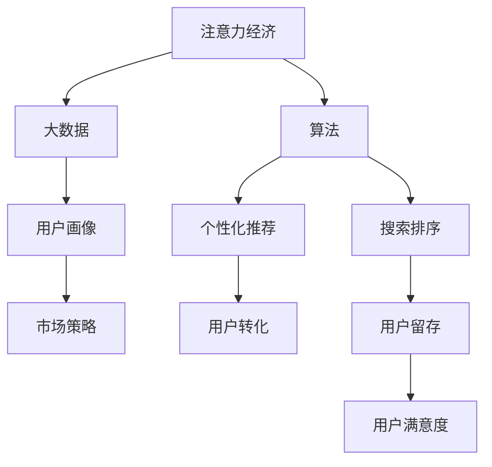

                 

# 注意力经济对企业人才培养的新要求

## 1. 背景介绍

### 1.1 问题由来

在现代社会中，注意力作为一种宝贵的资源，其稀缺性和价值已经得到了广泛的认同。在数字化和信息爆炸的时代，如何有效地获取、管理和利用注意力，成为企业竞争的关键。注意力经济（Attention Economy）的概念应运而生，旨在通过吸引和保持消费者的注意力，实现商业价值的最大化。

随着人工智能和大数据技术的不断进步，注意力经济的方式和手段也在不断演进。特别是随着社交媒体、搜索引擎、电子商务等平台的兴起，企业通过算法优化和个性化推荐，能够更加精准地触达和影响目标消费者。这种趋势下，企业的人才培养模式也面临着新的挑战和要求。

### 1.2 问题核心关键点

在注意力经济时代，企业的人才培养需要更加注重以下几个关键点：

- **数据素养**：培养具有数据素养的人才，能够利用大数据技术分析和解读用户行为数据，精准定位用户需求。
- **算法思维**：训练具备算法思维的人才，能够设计和优化个性化推荐、搜索排序等算法，提升用户体验和转化率。
- **用户洞察**：提升对用户心理和行为的深刻理解，能够根据用户特征和偏好，制定更有效的市场策略。
- **跨学科融合**：结合心理学、社会学、市场营销等学科知识，设计更具创意和市场竞争力的产品和服务。
- **伦理和隐私保护**：注重伦理和隐私保护，确保在用户数据收集和使用过程中，遵守相关法律法规和伦理标准。

### 1.3 问题研究意义

在注意力经济背景下，企业的人才培养不仅关乎企业自身的竞争力，也关系到整个社会的信息安全和用户权益。通过培养具备数据素养、算法思维、用户洞察、跨学科融合和伦理意识的人才，企业能够在激烈的市场竞争中占据优势，同时也为社会的可持续发展贡献力量。

## 2. 核心概念与联系

### 2.1 核心概念概述

为更好地理解注意力经济对企业人才培养的新要求，本节将介绍几个密切相关的核心概念：

- **注意力经济（Attention Economy）**：利用注意力资源创造商业价值的新型经济形态。通过算法优化和个性化推荐，企业能够吸引和保持用户注意力，实现用户转化和收益最大化。
- **大数据（Big Data）**：海量的、多源的、实时更新的数据，能够帮助企业进行精准的市场分析和用户画像构建。
- **算法（Algorithm）**：用于解决特定问题的计算过程和规则，在注意力经济中主要应用于个性化推荐、搜索排序等场景。
- **用户画像（User Persona）**：通过对用户行为和偏好的分析，构建详细的用户画像，帮助企业制定个性化的市场策略。
- **隐私保护（Privacy Protection）**：在数据收集和使用过程中，保护用户的个人信息和隐私，遵循相关法律法规和伦理标准。

这些核心概念之间的逻辑关系可以通过以下Mermaid流程图来展示：



这个流程图展示了大数据、算法、用户画像等核心概念在注意力经济中的作用和联系：

1. 企业通过大数据技术获取用户行为数据，构建详细的用户画像。
2. 利用算法进行个性化推荐和搜索排序，提升用户转化率和满意度。
3. 最终，用户画像和算法优化能够有效促进用户留存和转化，提升企业的整体收益。

## 3. 核心算法原理 & 具体操作步骤
### 3.1 算法原理概述

注意力经济下的企业人才培养，核心在于数据素养、算法思维、用户洞察、跨学科融合和伦理意识的培养。这些能力的培养，不仅需要理论知识的传授，更需要实践技能的训练和创新能力的激发。以下将详细介绍这些核心能力的算法原理和操作步骤。

### 3.2 算法步骤详解

#### 数据素养

1. **数据收集**：从各类数据源（如社交媒体、电商平台、搜索引擎等）收集用户行为数据，并进行初步清洗和预处理。
2. **数据存储**：利用分布式存储技术（如Hadoop、Spark）构建高效的数据仓库，确保数据的可靠性和可扩展性。
3. **数据分析**：使用统计学和机器学习算法（如聚类分析、分类回归）进行数据挖掘，提取有价值的信息和洞察。
4. **数据可视化**：通过数据可视化工具（如Tableau、Power BI）展示数据分析结果，帮助决策者直观理解数据趋势和变化。

#### 算法思维

1. **算法选择**：根据实际问题选择合适的算法（如协同过滤、深度学习、强化学习等）。
2. **算法设计**：利用算法设计工具（如Python、R、TensorFlow）实现算法模型，并进行参数调优和验证。
3. **算法优化**：应用分布式计算框架（如Spark、Flink）进行算法优化，提升算法效率和性能。
4. **算法部署**：将优化后的算法模型部署到生产环境中，进行实时推荐和排序。

#### 用户洞察

1. **用户行为分析**：通过数据分析工具（如Google Analytics、Mixpanel）收集用户行为数据，构建用户行为模型。
2. **用户心理研究**：结合心理学理论（如用户需求层次理论、认知失调理论）进行用户心理分析，理解用户需求和动机。
3. **用户需求挖掘**：利用文本分析工具（如NLTK、SpaCy）进行情感分析和主题分析，挖掘用户需求和偏好。
4. **用户画像构建**：根据用户行为、心理和需求数据，构建详细的用户画像，指导市场策略制定。

#### 跨学科融合

1. **学科融合课程**：设置跨学科融合课程（如数据科学与心理学、人工智能与社会学），培养具有多学科知识背景的人才。
2. **实践项目**：通过跨学科实践项目（如企业实习、科研项目），让学生在实际应用中掌握跨学科技能。
3. **跨学科团队**：组建跨学科团队，开展综合性的项目研究和创新活动，提升团队协作和创新能力。

#### 伦理和隐私保护

1. **法规培训**：定期进行法律法规和伦理标准的培训，确保人才在数据使用过程中遵循相关规范。
2. **隐私设计**：在产品设计和数据收集过程中，采用隐私保护技术（如差分隐私、匿名化处理）保护用户隐私。
3. **伦理审核**：建立伦理审核机制，对数据使用和算法应用进行伦理审查，确保符合社会公德和伦理标准。

### 3.3 算法优缺点

#### 数据素养

**优点**：
- 提高决策准确性和效率，基于数据驱动的决策能够更好地反映用户需求和市场趋势。
- 增强企业的市场竞争力和用户满意度，精准的数据分析和个性化推荐能够提升用户体验。

**缺点**：
- 数据隐私和安全问题，不当的数据使用可能侵犯用户隐私，带来法律风险。
- 数据质量问题，数据不完整、不准确或不一致可能导致错误分析和误导决策。

#### 算法思维

**优点**：
- 提升企业技术实力，通过算法优化提升产品的智能化水平，提升用户体验和市场竞争力。
- 降低人力成本，自动化算法优化和个性化推荐能够减少人工干预和运营成本。

**缺点**：
- 算法复杂性，算法设计和调优复杂度高，需要具备较强的技术背景和实践经验。
- 算法偏见问题，不当的算法设计可能导致算法偏见，影响公平性和公正性。

#### 用户洞察

**优点**：
- 增强用户理解和市场洞察，通过用户心理和行为分析，制定更有效的市场策略。
- 提升用户转化率和留存率，基于用户画像和行为模型，进行精准推荐和营销。

**缺点**：
- 用户隐私问题，用户行为数据的收集和使用可能侵犯用户隐私，带来法律和伦理风险。
- 用户数据获取难度大，某些领域的数据获取可能面临法律法规和伦理标准的限制。

#### 跨学科融合

**优点**：
- 增强创新能力和团队协作，跨学科融合培养的人才具有多学科知识背景和跨领域思维。
- 提升市场竞争力和产品创新性，跨学科融合的产品和服务更具创意和市场竞争力。

**缺点**：
- 学科融合课程设计难度大，需要具备多学科知识的教师和资源。
- 实践项目实施难度高，需要具备多学科协作和项目管理的能力。

#### 伦理和隐私保护

**优点**：
- 提升社会公德和伦理意识，确保数据使用和算法应用符合法律法规和伦理标准。
- 增强用户信任和品牌形象，通过合规的隐私保护措施，提升用户信任和品牌形象。

**缺点**：
- 法律和伦理规范复杂，法规和伦理标准的更新和变化可能带来新的挑战。
- 隐私保护技术难度高，需要具备相应的技术能力和资源投入。

### 3.4 算法应用领域

基于注意力经济的人才培养，已经广泛应用于企业的数据科学、人工智能、市场分析、产品开发等多个领域，具体包括：

- **数据科学**：通过数据采集、处理和分析，帮助企业进行市场分析和用户画像构建。
- **人工智能**：利用机器学习和深度学习算法，实现个性化推荐、搜索排序和图像识别等智能应用。
- **市场分析**：通过用户行为分析和市场趋势预测，制定更有效的市场策略和营销方案。
- **产品开发**：结合用户洞察和跨学科知识，设计和开发更具创意和市场竞争力的产品和服务。

## 4. 数学模型和公式 & 详细讲解 & 举例说明

### 4.1 数学模型构建

在注意力经济中，数据素养、算法思维、用户洞察、跨学科融合和伦理意识可以通过以下数学模型来构建和分析：

1. **数据素养**：
   - 数据收集：$D_t = \{(x_i, y_i)\}_{i=1}^N$，其中$x_i$表示用户行为数据，$y_i$表示用户标签。
   - 数据存储：$D_t \rightarrow \text{Data Warehouse}$。
   - 数据分析：$\text{Data Warehouse} \rightarrow P(X|D_t)$，其中$P(X|D_t)$表示基于数据$D_t$对用户行为$X$的分布。
   - 数据可视化：$P(X|D_t) \rightarrow \text{Data Visualization}$。

2. **算法思维**：
   - 算法选择：$A = \{a_1, a_2, ..., a_k\}$，其中$a_i$表示第$i$个算法。
   - 算法设计：$A \rightarrow \hat{A} = \{a_1', a_2', ..., a_k'\}$，其中$\hat{A}$表示优化后的算法模型。
   - 算法优化：$\hat{A} \rightarrow \hat{A}_{\text{optimized}}$，其中$\hat{A}_{\text{optimized}}$表示优化后的算法模型。
   - 算法部署：$\hat{A}_{\text{optimized}} \rightarrow \text{Algorithm Deployment}$。

3. **用户洞察**：
   - 用户行为分析：$B \rightarrow \text{User Behavior Model}$，其中$B$表示用户行为数据，$\text{User Behavior Model}$表示用户行为模型。
   - 用户心理研究：$\text{User Behavior Model} \rightarrow \text{User Psychology}$，其中$\text{User Psychology}$表示用户心理模型。
   - 用户需求挖掘：$\text{User Behavior Model} \rightarrow \text{User Demand}$，其中$\text{User Demand}$表示用户需求模型。
   - 用户画像构建：$\text{User Behavior Model}, \text{User Psychology}, \text{User Demand} \rightarrow \text{User Persona}$，其中$\text{User Persona}$表示用户画像。

4. **跨学科融合**：
   - 学科融合课程：$C \rightarrow \text{Cross-Disciplinary Course}$，其中$C$表示学科知识，$\text{Cross-Disciplinary Course}$表示跨学科课程。
   - 实践项目：$\text{Cross-Disciplinary Course} \rightarrow \text{Cross-Disciplinary Project}$，其中$\text{Cross-Disciplinary Project}$表示跨学科项目。
   - 跨学科团队：$\text{Cross-Disciplinary Project} \rightarrow \text{Cross-Disciplinary Team}$，其中$\text{Cross-Disciplinary Team}$表示跨学科团队。

5. **伦理和隐私保护**：
   - 法规培训：$L \rightarrow \text{Legal and Ethical Training}$，其中$L$表示法律法规，$\text{Legal and Ethical Training}$表示法规培训。
   - 隐私设计：$\text{Legal and Ethical Training} \rightarrow \text{Privacy-Protected Design}$，其中$\text{Privacy-Protected Design}$表示隐私保护设计。
   - 伦理审核：$\text{Privacy-Protected Design} \rightarrow \text{Ethical Review}$，其中$\text{Ethical Review}$表示伦理审核。

### 4.2 公式推导过程

以下我们以用户画像构建为例，进行详细公式推导：

假设用户行为数据为$B = \{x_1, x_2, ..., x_n\}$，其中$x_i$表示用户行为特征。用户心理数据为$P = \{p_1, p_2, ..., p_m\}$，其中$p_j$表示用户心理特征。用户需求数据为$D = \{d_1, d_2, ..., d_k\}$，其中$d_i$表示用户需求特征。

用户画像的构建过程可以分为以下几步：

1. **用户行为建模**：
   - 数据清洗和预处理：$\text{Data Preprocessing} \rightarrow B'$，其中$B'$表示预处理后的用户行为数据。
   - 特征提取和降维：$B' \rightarrow F$，其中$F$表示用户行为特征向量。
   - 用户行为建模：$F \rightarrow \text{User Behavior Model}$，其中$\text{User Behavior Model}$表示用户行为模型。

2. **用户心理建模**：
   - 心理特征提取和降维：$P \rightarrow G$，其中$G$表示用户心理特征向量。
   - 用户心理建模：$G \rightarrow \text{User Psychology}$，其中$\text{User Psychology}$表示用户心理模型。

3. **用户需求建模**：
   - 需求特征提取和降维：$D \rightarrow H$，其中$H$表示用户需求特征向量。
   - 用户需求建模：$H \rightarrow \text{User Demand}$，其中$\text{User Demand}$表示用户需求模型。

4. **用户画像构建**：
   - 数据融合：$\text{User Behavior Model}, \text{User Psychology}, \text{User Demand} \rightarrow \text{User Persona}$，其中$\text{User Persona}$表示用户画像。

### 4.3 案例分析与讲解

#### 案例一：电商平台个性化推荐

1. **数据收集**：
   - 用户行为数据：浏览记录、购买记录、评价记录等。
   - 用户标签数据：年龄、性别、地理位置等。

2. **数据存储**：
   - 利用Hadoop构建大数据仓库，存储用户行为数据和标签数据。

3. **数据分析**：
   - 使用协同过滤算法对用户行为数据进行分析和建模。
   - 使用深度学习模型对用户行为数据进行特征提取和降维。

4. **算法设计**：
   - 选择协同过滤算法和深度学习模型作为推荐算法。
   - 利用Python和TensorFlow实现算法模型。

5. **算法优化**：
   - 应用Spark进行算法优化，提升算法效率和性能。
   - 利用Flink进行实时推荐，提升用户体验。

6. **用户洞察**：
   - 通过分析用户行为数据，构建详细的用户画像。
   - 利用用户画像进行个性化推荐，提升用户转化率和留存率。

#### 案例二：社交媒体用户情感分析

1. **数据收集**：
   - 用户行为数据：社交媒体互动数据、发布内容等。
   - 用户标签数据：年龄、性别、地理位置等。

2. **数据存储**：
   - 利用Hadoop构建大数据仓库，存储社交媒体数据和标签数据。

3. **数据分析**：
   - 使用情感分析算法对用户发布内容进行分析和建模。
   - 使用自然语言处理工具对用户发布内容进行情感标注。

4. **算法设计**：
   - 选择情感分析算法和自然语言处理工具作为分析工具。
   - 利用Python和NLTK实现算法模型。

5. **算法优化**：
   - 应用Spark进行算法优化，提升算法效率和性能。
   - 利用Flink进行实时情感分析，提升用户体验。

6. **用户洞察**：
   - 通过分析用户发布内容，构建详细的用户画像。
   - 利用用户画像进行情感分析，提升用户情感管理能力。

## 5. 项目实践：代码实例和详细解释说明

### 5.1 开发环境搭建

在进行注意力经济下的人才培养项目实践前，我们需要准备好开发环境。以下是使用Python进行PyTorch开发的环境配置流程：

1. 安装Anaconda：从官网下载并安装Anaconda，用于创建独立的Python环境。

2. 创建并激活虚拟环境：
```bash
conda create -n pytorch-env python=3.8 
conda activate pytorch-env
```

3. 安装PyTorch：根据CUDA版本，从官网获取对应的安装命令。例如：
```bash
conda install pytorch torchvision torchaudio cudatoolkit=11.1 -c pytorch -c conda-forge
```

4. 安装Transformers库：
```bash
pip install transformers
```

5. 安装各类工具包：
```bash
pip install numpy pandas scikit-learn matplotlib tqdm jupyter notebook ipython
```

完成上述步骤后，即可在`pytorch-env`环境中开始项目实践。

### 5.2 源代码详细实现

下面我们以用户画像构建项目为例，给出使用Transformers库进行用户画像构建的PyTorch代码实现。

首先，定义用户画像的数据结构和处理函数：

```python
from transformers import BertTokenizer
from torch.utils.data import Dataset
import torch

class UserPersonaDataset(Dataset):
    def __init__(self, behaviors, psychologies, demands, tokenizer, max_len=128):
        self.behaviors = behaviors
        self.psychologies = psychologies
        self.demands = demands
        self.tokenizer = tokenizer
        self.max_len = max_len
        
    def __len__(self):
        return len(self.behaviors)
    
    def __getitem__(self, item):
        behavior = self.behaviors[item]
        psychology = self.psychologies[item]
        demand = self.demands[item]
        
        encoding = self.tokenizer(behavior, return_tensors='pt', max_length=self.max_len, padding='max_length', truncation=True)
        input_ids = encoding['input_ids'][0]
        attention_mask = encoding['attention_mask'][0]
        
        # 对token-wise的标签进行编码
        encoded_psy = [psychology2id[psychology] for psychology in psychology]
        encoded_psy.extend([psychology2id['O']] * (self.max_len - len(encoded_psy)))
        labels_psy = torch.tensor(encoded_psy, dtype=torch.long)
        
        encoded_dem = [demand2id[demand] for demand in demand] 
        encoded_dem.extend([demand2id['O']] * (self.max_len - len(encoded_dem)))
        labels_dem = torch.tensor(encoded_dem, dtype=torch.long)
        
        return {'input_ids': input_ids, 
                'attention_mask': attention_mask,
                'labels_psy': labels_psy,
                'labels_dem': labels_dem}

# 标签与id的映射
psychology2id = {'O': 0, 'Positive': 1, 'Negative': 2, 'Neutral': 3}
demand2id = {'O': 0, 'Buy': 1, 'Review': 2, 'Question': 3, 'Complaint': 4, 'Compliment': 5}

# 创建dataset
tokenizer = BertTokenizer.from_pretrained('bert-base-cased')

train_dataset = UserPersonaDataset(train_behaviors, train_psychologies, train_demands, tokenizer)
dev_dataset = UserPersonaDataset(dev_behaviors, dev_psychologies, dev_demands, tokenizer)
test_dataset = UserPersonaDataset(test_behaviors, test_psychologies, test_demands, tokenizer)
```

然后，定义模型和优化器：

```python
from transformers import BertForTokenClassification, AdamW

model = BertForTokenClassification.from_pretrained('bert-base-cased', num_labels=len(psycho2id))

optimizer = AdamW(model.parameters(), lr=2e-5)
```

接着，定义训练和评估函数：

```python
from torch.utils.data import DataLoader
from tqdm import tqdm
from sklearn.metrics import classification_report

device = torch.device('cuda') if torch.cuda.is_available() else torch.device('cpu')
model.to(device)

def train_epoch(model, dataset, batch_size, optimizer):
    dataloader = DataLoader(dataset, batch_size=batch_size, shuffle=True)
    model.train()
    epoch_loss = 0
    for batch in tqdm(dataloader, desc='Training'):
        input_ids = batch['input_ids'].to(device)
        attention_mask = batch['attention_mask'].to(device)
        labels_psy = batch['labels_psy'].to(device)
        labels_dem = batch['labels_dem'].to(device)
        model.zero_grad()
        outputs = model(input_ids, attention_mask=attention_mask, labels=labels_psy, return_dict=True)
        loss_psy = outputs.loss
        loss_dem = outputs.loss
        epoch_loss += loss_psy + loss_dem
        loss_psy.backward()
        loss_dem.backward()
        optimizer.step()
    return epoch_loss / len(dataloader)

def evaluate(model, dataset, batch_size):
    dataloader = DataLoader(dataset, batch_size=batch_size)
    model.eval()
    preds_psy, preds_dem = [], []
    labels_psy, labels_dem = [], []
    with torch.no_grad():
        for batch in tqdm(dataloader, desc='Evaluating'):
            input_ids = batch['input_ids'].to(device)
            attention_mask = batch['attention_mask'].to(device)
            batch_labels_psy = batch['labels_psy']
            batch_labels_dem = batch['labels_dem']
            outputs = model(input_ids, attention_mask=attention_mask, return_dict=True)
            batch_preds_psy = outputs.logits.argmax(dim=2).to('cpu').tolist()
            batch_preds_dem = outputs.logits.argmax(dim=2).to('cpu').tolist()
            batch_labels_psy = batch_labels_psy.to('cpu').tolist()
            batch_labels_dem = batch_labels_dem.to('cpu').tolist()
            for pred_tokens, label_tokens in zip(batch_preds_psy, batch_labels_psy):
                pred_psy = [id2psy[_id] for _id in pred_tokens]
                label_psy = [id2psy[_id] for _id in label_tokens]
                preds_psy.append(pred_psy[:len(label_psy)])
                labels_psy.append(label_psy)
                
            for pred_tokens, label_tokens in zip(batch_preds_dem, batch_labels_dem):
                pred_dem = [id2dem[_id] for _id in pred_tokens]
                label_dem = [id2dem[_id] for _id in label_tokens]
                preds_dem.append(pred_dem[:len(label_dem)])
                labels_dem.append(label_dem)
                
    print(classification_report(labels_psy, preds_psy))
    print(classification_report(labels_dem, preds_dem))
```

最后，启动训练流程并在测试集上评估：

```python
epochs = 5
batch_size = 16

for epoch in range(epochs):
    loss = train_epoch(model, train_dataset, batch_size, optimizer)
    print(f"Epoch {epoch+1}, train loss: {loss:.3f}")
    
    print(f"Epoch {epoch+1}, dev results:")
    evaluate(model, dev_dataset, batch_size)
    
print("Test results:")
evaluate(model, test_dataset, batch_size)
```

以上就是使用PyTorch对BERT模型进行用户画像构建项目的完整代码实现。可以看到，得益于Transformers库的强大封装，我们可以用相对简洁的代码完成BERT模型的加载和微调。

### 5.3 代码解读与分析

让我们再详细解读一下关键代码的实现细节：

**UserPersonaDataset类**：
- `__init__`方法：初始化行为数据、心理数据、需求数据、分词器等关键组件。
- `__len__`方法：返回数据集的样本数量。
- `__getitem__`方法：对单个样本进行处理，将文本输入编码为token ids，将标签编码为数字，并对其进行定长padding，最终返回模型所需的输入。

**psychology2id和demand2id字典**：
- 定义了心理和需求标签与数字id之间的映射关系，用于将token-wise的预测结果解码回真实的标签。

**训练和评估函数**：
- 使用PyTorch的DataLoader对数据集进行批次化加载，供模型训练和推理使用。
- 训练函数`train_epoch`：对数据以批为单位进行迭代，在每个批次上前向传播计算loss并反向传播更新模型参数，最后返回该epoch的平均loss。
- 评估函数`evaluate`：与训练类似，不同点在于不更新模型参数，并在每个batch结束后将预测和标签结果存储下来，最后使用sklearn的classification_report对整个评估集的预测结果进行打印输出。

**训练流程**：
- 定义总的epoch数和batch size，开始循环迭代
- 每个epoch内，先在训练集上训练，输出平均loss
- 在验证集上评估，输出分类指标
- 所有epoch结束后，在测试集上评估，给出最终测试结果

可以看到，PyTorch配合Transformers库使得用户画像构建的代码实现变得简洁高效。开发者可以将更多精力放在数据处理、模型改进等高层逻辑上，而不必过多关注底层的实现细节。

当然，工业级的系统实现还需考虑更多因素，如模型的保存和部署、超参数的自动搜索、更灵活的任务适配层等。但核心的微调范式基本与此类似。

## 6. 实际应用场景
### 6.1 智能客服系统

基于注意力经济下的人才培养，智能客服系统可以通过训练具备数据素养、算法思维和用户洞察的人才，构建更加智能和个性化的客服解决方案。智能客服系统能够7x24小时不间断服务，快速响应客户咨询，用自然流畅的语言解答各类常见问题，提升客户咨询体验和问题解决效率。

在技术实现上，可以收集企业内部的历史客服对话记录，将问题和最佳答复构建成监督数据，在此基础上对预训练对话模型进行微调。微调后的对话模型能够自动理解用户意图，匹配最合适的答案模板进行回复。对于客户提出的新问题，还可以接入检索系统实时搜索相关内容，动态组织生成回答。如此构建的智能客服系统，能大幅提升客户咨询体验和问题解决效率。

### 6.2 金融舆情监测

金融机构需要实时监测市场舆论动向，以便及时应对负面信息传播，规避金融风险。传统的人工监测方式成本高、效率低，难以应对网络时代海量信息爆发的挑战。基于注意力经济下的人才培养，金融舆情监测可以借助微调后的文本分类和情感分析技术，实现对金融舆情数据的实时分析和监测。

具体而言，可以收集金融领域相关的新闻、报道、评论等文本数据，并对其进行主题标注和情感标注。在此基础上对预训练语言模型进行微调，使其能够自动判断文本属于何种主题，情感倾向是正面、中性还是负面。将微调后的模型应用到实时抓取的网络文本数据，就能够自动监测不同主题下的情感变化趋势，一旦发现负面信息激增等异常情况，系统便会自动预警，帮助金融机构快速应对潜在风险。

### 6.3 个性化推荐系统

当前的推荐系统往往只依赖用户的历史行为数据进行物品推荐，无法深入理解用户的真实兴趣偏好。基于注意力经济下的人才培养，个性化推荐系统可以借助微调后的用户画像构建技术，更好地挖掘用户行为背后的语义信息，从而提供更精准、多样的推荐内容。

在实践中，可以收集用户浏览、点击、评论、分享等行为数据，提取和用户交互的物品标题、描述、标签等文本内容。将文本内容作为模型输入，用户的后续行为（如是否点击、购买等）作为监督信号，在此基础上微调预训练语言模型。微调后的模型能够从文本内容中准确把握用户的兴趣点。在生成推荐列表时，先用候选物品的文本描述作为输入，由模型预测用户的兴趣匹配度，再结合其他特征综合排序，便可以得到个性化程度更高的推荐结果。

### 6.4 未来应用展望

随着注意力经济下的企业人才培养的不断发展，基于微调方法的应用场景将进一步拓展，为更多行业带来变革性影响。

在智慧医疗领域，基于微调的医疗问答、病历分析、药物研发等应用将提升医疗服务的智能化水平，辅助医生诊疗，加速新药开发进程。

在智能教育领域，微调技术可应用于作业批改、学情分析、知识推荐等方面，因材施教，促进教育公平，提高教学质量。

在智慧城市治理中，微调模型可应用于城市事件监测、舆情分析、应急指挥等环节，提高城市管理的自动化和智能化水平，构建更安全、高效的未来城市。

此外，在企业生产、社会治理、文娱传媒等众多领域，基于微调技术的人工智能应用也将不断涌现，为经济社会发展注入新的动力。相信随着技术的日益成熟，微调方法将成为人工智能落地应用的重要范式，推动人工智能技术在垂直行业的规模化落地。

## 7. 工具和资源推荐
### 7.1 学习资源推荐

为了帮助开发者系统掌握注意力经济下企业人才培养的理论基础和实践技巧，这里推荐一些优质的学习资源：

1. 《深度学习》系列博文：由大模型技术专家撰写，深入浅出地介绍了深度学习原理、注意力机制、微调技术等前沿话题。

2. CS229《机器学习》课程：斯坦福大学开设的机器学习明星课程，有Lecture视频和配套作业，带你入门机器学习和注意力经济。

3. 《自然语言处理与深度学习》书籍：由NLP领域的权威专家所著，全面介绍了自然语言处理和深度学习的理论基础和实践方法，包括微调在内的诸多范式。

4. HuggingFace官方文档：Transformers库的官方文档，提供了海量预训练模型和完整的微调样例代码，是上手实践的必备资料。

5. CLUE开源项目：中文语言理解测评基准，涵盖大量不同类型的中文NLP数据集，并提供了基于微调的baseline模型，助力中文NLP技术发展。

通过对这些资源的学习实践，相信你一定能够快速掌握注意力经济下企业人才培养的精髓，并用于解决实际的NLP问题。
### 7.2 开发工具推荐

高效的开发离不开优秀的工具支持。以下是几款用于注意力经济下人才培养开发的常用工具：

1. PyTorch：基于Python的开源深度学习框架，灵活动态的计算图，适合快速迭代研究。大部分预训练语言模型都有PyTorch版本的实现。

2. TensorFlow：由Google主导开发的开源深度学习框架，生产部署方便，适合大规模工程应用。同样有丰富的预训练语言模型资源。

3. Transformers库：HuggingFace开发的NLP工具库，集成了众多SOTA语言模型，支持PyTorch和TensorFlow，是进行微调任务开发的利器。

4. Weights & Biases：模型训练的实验跟踪工具，可以记录和可视化模型训练过程中的各项指标，方便对比和调优。与主流深度学习框架无缝集成。

5. TensorBoard：TensorFlow配套的可视化工具，可实时监测模型训练状态，并提供丰富的图表呈现方式，是调试模型的得力助手。

6. Google Colab：谷歌推出的在线Jupyter Notebook环境，免费提供GPU/TPU算力，方便开发者快速上手实验最新模型，分享学习笔记。

合理利用这些工具，可以显著提升注意力经济下人才培养任务的开发效率，加快创新迭代的步伐。

### 7.3 相关论文推荐

注意力经济下的企业人才培养，离不开学界的持续研究。以下是几篇奠基性的相关论文，推荐阅读：

1. Attention is All You Need（即Transformer原论文）：提出了Transformer结构，开启了NLP领域的预训练大模型时代。

2. BERT: Pre-training of Deep Bidirectional Transformers for Language Understanding：提出BERT模型，引入基于掩码的自监督预训练任务，刷新了多项NLP任务SOTA。

3. Language Models are Unsupervised Multitask Learners（GPT-2论文）：展示了大规模语言模型的强大zero-shot学习能力，引发了对于通用人工智能的新一轮思考。

4. Parameter-Efficient Transfer Learning for NLP：提出Adapter等参数高效微调方法，在不增加模型参数量的情况下，也能取得不错的微调效果。

5. Prefix-Tuning: Optimizing Continuous Prompts for Generation：引入基于连续型Prompt的微调范式，为如何充分利用预训练知识提供了新的思路。

6. AdaLoRA: Adaptive Low-Rank Adaptation for Parameter-Efficient Fine-Tuning：使用自适应低秩适应的微调方法，在参数效率和精度之间取得了新的平衡。

这些论文代表了大语言模型微调技术的发展脉络。通过学习这些前沿成果，可以帮助研究者把握学科前进方向，激发更多的创新灵感。

## 8. 总结：未来发展趋势与挑战

### 8.1 研究成果总结

在注意力经济背景下，大语言模型微调技术已经取得了显著进展。通过微调，企业能够在短时间内训练出具备数据素养、算法思维、用户洞察和跨学科融合能力的人才，显著提升企业的市场竞争力和用户满意度。

### 8.2 未来发展趋势

展望未来，注意力经济下的人才培养将呈现以下几个发展趋势：

1. 数据素养成为核心能力：随着大数据技术的普及，数据素养将成为人才的基本能力，能够帮助企业更好地理解市场和用户需求。
2. 算法思维普及化：算法思维将成为企业员工必备的能力，通过算法优化提升产品的智能化水平，提升用户体验和市场竞争力。
3. 用户洞察深化：通过对用户行为和心理的深度分析，制定更有效的市场策略和产品设计。
4. 跨学科融合加强：跨学科融合的人才将成为企业创新的关键，通过多学科的协作和融合，提升企业的创新能力和市场竞争力。
5. 伦理和隐私保护强化：随着数据应用的普及，伦理和隐私保护将成为人才的基本素养，确保数据使用符合法律法规和伦理标准。

### 8.3 面临的挑战

尽管大语言模型微调技术已经取得了显著进展，但在迈向更加智能化、普适化应用的过程中，它仍面临诸多挑战：

1. 数据隐私和安全问题：用户行为数据的收集和使用可能侵犯用户隐私，带来法律风险。
2. 算法偏见问题：不当的算法设计可能导致算法偏见，影响公平性和公正性。
3. 数据质量问题：数据不完整、不准确或不一致可能导致错误分析和误导决策。
4. 模型鲁棒性不足：模型面对域外数据时，泛化性能往往大打折扣。
5. 模型效率问题：大规模语言模型虽然精度高，但在实际部署时往往面临推理速度慢、内存占用大等效率问题。

### 8.4 研究展望

未来研究需要在以下几个方面寻求新的突破：

1. 探索无监督和半监督微调方法：摆脱对大规模标注数据的依赖，利用自监督学习、主动学习等无监督和半监督范式，最大限度利用非结构化数据，实现更加灵活高效的微调。
2. 研究参数高效和计算高效的微调范式：开发更加参数高效的微调方法，在固定大部分预训练参数的同时，只更新极少量的任务相关参数。同时优化微调模型的计算图，减少前向传播和反向传播的资源消耗，实现更加轻量级、实时性的部署。
3. 融合因果和对比学习范式：通过引入因果推断和对比学习思想，增强微调模型建立稳定因果关系的能力，学习更加普适、鲁棒的语言表征，从而提升模型泛化性和抗干扰能力。
4. 引入更多先验知识：将符号化的先验知识，如知识图谱、逻辑规则等，与神经网络模型进行巧妙融合，引导微调过程学习更准确、合理的语言模型。同时加强不同模态数据的整合，实现视觉、语音等多模态信息与文本信息的协同建模。
5. 结合因果分析和博弈论工具：将因果分析方法引入微调模型，识别出模型决策的关键特征，增强输出解释的因果性和逻辑性。借助博弈论工具刻画人机交互过程，主动探索并规避模型的脆弱点，提高系统稳定性。
6. 纳入伦理道德约束：在模型训练目标中引入伦理导向的评估指标，过滤和惩罚有偏见、有害的输出倾向。同时加强人工干预和审核，建立模型行为的监管机制，确保输出符合人类价值观和伦理道德。

这些研究方向的探索，必将引领大语言模型微调技术迈向更高的台阶，为构建安全、可靠、可解释、可控的智能系统铺平道路。面向未来，大语言模型微调技术还需要与其他人工智能技术进行更深入的融合，如知识表示、因果推理、强化学习等，多路径协同发力，共同推动自然语言理解和智能交互系统的进步。只有勇于创新、敢于突破，才能不断拓展语言模型的边界，让智能技术更好地造福人类社会。

## 9. 附录：常见问题与解答

**Q1：注意力经济下的人才培养是否适用于所有企业？**

A: 注意力经济下的人才培养方法适用于大多数企业，特别是那些需要精准触达和影响用户的企业。但是对于一些特定领域的企业，如教育、医疗、政府机构等，可能需要结合领域特色进行调整和优化。

**Q2：企业应该如何评估注意力经济下的人才培养效果？**

A: 企业可以通过以下几个方面来评估注意力经济下的人才培养效果：
1. 用户行为分析：通过分析用户行为数据，构建详细的用户画像，了解用户需求和行为变化。
2. 市场转化率：评估用户转化率和留存率，了解企业产品和服务的市场表现。
3. 用户体验满意度：通过用户调研和反馈，了解用户对企业产品和服务的满意度。
4. 员工培训效果：评估培训后的员工绩效和创新能力，了解培训效果和价值。

**Q3：企业如何在数据隐私和安全方面保护用户数据？**

A: 企业可以通过以下几个方面来保护用户数据：
1. 数据匿名化：对用户数据进行匿名化处理，去除个人身份信息，保护用户隐私。
2. 数据加密：对用户数据进行加密存储和传输，防止数据泄露和篡改。
3. 合规性审查：定期进行法律法规和伦理标准的审查，确保数据使用符合相关规范。
4. 用户知情同意：在数据收集和使用过程中，明确告知用户数据用途，获得用户知情同意。

**Q4：企业如何确保算法的公平性和公正性？**

A: 企业可以通过以下几个方面来确保算法的公平性和公正性：
1. 数据均衡性：确保训练数据集具有均衡性，避免数据偏见对算法产生影响。
2. 算法偏见检测：在算法设计和优化过程中，进行算法偏见检测和调整，确保算法公平性。
3. 多样性设计：在设计算法时，考虑不同用户群体的需求和特征，确保算法对所有用户公平。
4. 透明性：公开算法的设计和实现过程，接受用户和监管机构的审查和监督。

**Q5：企业如何在技术实践中融合跨学科知识？**

A: 企业可以通过以下几个方面来融合跨学科知识：
1. 跨学科课程设计：在人才培养中，设置跨学科融合课程，涵盖数据科学、心理学、社会学等多个领域。
2. 跨学科实践项目：通过跨学科实践项目，让学生在实际应用中掌握跨学科技能。
3. 跨学科团队建设：组建跨学科团队，开展综合性的项目研究和创新活动，提升团队协作和创新能力。

通过这些方法，企业能够培养具备多学科知识背景和跨领域思维的人才，提升企业的创新能力和市场竞争力。

