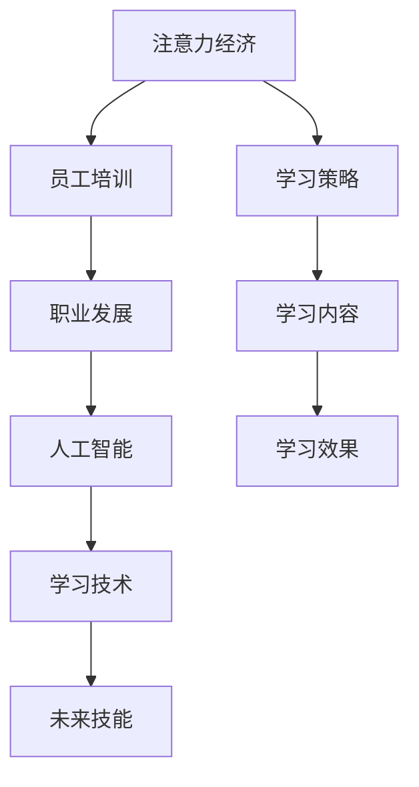

                 

# 注意力经济对企业员工培训的新要求

> 关键词：注意力经济,员工培训,职业发展,人工智能,学习技术,未来技能

## 1. 背景介绍

### 1.1 问题由来

在数字化时代，企业在员工培训上投入了大量资源，以提升员工的职业素养和专业技能。然而，传统的培训模式往往基于知识传授，难以充分调动员工的积极性和参与度。为了适应新经济模式，企业开始重新审视培训策略，引入更加灵活、互动、个性化的培训方法。其中，“注意力经济”（Economy of Attention）的概念为企业员工培训带来了新的视角和要求。

### 1.2 问题核心关键点

注意力经济强调信息的稀缺性和重要性，要求企业和员工在信息消费和生产中做出有意识的筛选和决策。在培训领域，这意味着员工和企业的培训需求之间必须形成更强的互动和响应。具体来说，培训应该：
- **聚焦注意力**：通过增加培训内容的吸引力，提升员工的注意力集中度和参与度。
- **优化资源配置**：合理分配培训资源，确保资源的最大效用。
- **强调反馈和互动**：及时获得员工反馈，调整培训内容和方法。

### 1.3 问题研究意义

深入研究注意力经济对企业员工培训的影响，能够帮助企业制定更有效的培训策略，提升员工的工作效率和满意度。同时，对于员工个人职业发展，通过培训获取关键技能和知识，提升职业竞争力，也是一项重要任务。

## 2. 核心概念与联系

### 2.1 核心概念概述

为更好地理解注意力经济对企业员工培训的影响，本节将介绍几个关键概念：

- **注意力经济**（Economy of Attention）：基于信息消费和处理的经济形态，强调在信息海洋中筛选和决策的重要性。
- **员工培训**：企业为员工提供的职业技能提升和学习资源。
- **职业发展**：员工在职业生涯中的成长和进步。
- **人工智能**（AI）：通过模拟人类智能行为，实现高效数据处理和决策支持的技术。
- **学习技术**：包括但不限于在线学习、混合学习、虚拟现实（VR）、增强现实（AR）等，旨在提升学习效率和体验。
- **未来技能**：在数字化时代，企业员工需要掌握的新技能，如数据分析、编程、机器学习、人工智能应用等。

这些核心概念之间的逻辑关系可以通过以下Mermaid流程图来展示：



这个流程图展示了一系列核心概念及其之间的关系：

1. 注意力经济指导培训策略的设计。
2. 培训通过提升员工技能促进职业发展。
3. 职业发展依赖于现代技术（如人工智能）的应用。
4. 学习技术提供新的培训工具和方法。
5. 未来技能是员工适应未来工作的必备条件。
6. 学习策略和内容需要聚焦并优化。
7. 学习效果直接影响到职业发展路径。

这些概念共同构成了数字化时代企业员工培训的基础框架，要求企业在培训中更加重视注意力、技术和员工需求的契合。

## 3. 核心算法原理 & 具体操作步骤
### 3.1 算法原理概述

注意力经济下的企业员工培训，关键在于如何通过学习技术，增强员工对培训内容的兴趣和参与度，同时优化资源配置和学习路径。这需要引入人工智能的分析和优化能力，以实现动态调整和个性化推荐。

具体而言，基于注意力经济的学习策略包括以下几个步骤：

- **需求分析**：通过数据分析，了解员工的学习需求和兴趣点。
- **内容设计**：根据员工需求，设计具有吸引力的学习内容和互动环节。
- **技术应用**：利用人工智能技术（如推荐系统、自然语言处理、情感分析等），实时调整培训内容和方式。
- **效果评估**：定期评估培训效果，收集员工反馈，持续优化培训策略。

### 3.2 算法步骤详解

#### 3.2.1 需求分析

需求分析是培训策略设计的第一步，通过以下方式获取员工的学习需求和兴趣点：

1. **问卷调查**：设计问卷，收集员工对不同技能的学习需求和兴趣。
2. **数据分析**：利用大数据分析工具，分析员工的在线学习行为、参与度和反馈，找出共性需求。
3. **访谈调研**：通过一对一的访谈，深入了解员工的具体需求和期望。

#### 3.2.2 内容设计

内容设计需要考虑以下几个关键要素：

1. **互动性**：增加互动环节，如在线讨论、小组讨论、模拟情境等，提升员工参与度。
2. **个性化**：根据员工的学习进度和偏好，设计个性化的学习路径和推荐内容。
3. **实用性**：内容设计应贴近实际工作，提高学习的实际应用价值。
4. **趣味性**：通过游戏化元素（如积分、排行榜、挑战等）增加学习的趣味性和成就感。

#### 3.2.3 技术应用

技术应用是注意力经济下的核心环节，主要依赖以下技术手段：

1. **推荐系统**：根据员工的学习历史和兴趣点，实时推荐适合的学习内容和路径。
2. **自然语言处理（NLP）**：利用NLP技术，分析员工的学习行为和反馈，优化培训内容和互动方式。
3. **情感分析**：通过情感分析工具，了解员工在学习过程中的情绪变化，及时调整培训策略。
4. **人工智能评估**：利用AI技术，自动化评估员工的学习效果，提供个性化的反馈和建议。

#### 3.2.4 效果评估

效果评估是培训策略优化的重要环节，主要通过以下方式实现：

1. **学习进度跟踪**：通过学习管理系统（LMS）跟踪员工的学习进度和完成情况。
2. **学习效果测试**：定期进行知识测试，评估员工的学习效果和掌握程度。
3. **员工反馈收集**：通过问卷、访谈等方式，收集员工对培训内容的反馈，了解其满意度和改进建议。
4. **绩效评估**：将学习效果与工作绩效关联，评估培训对实际工作的影响。

### 3.3 算法优缺点

注意力经济下的企业员工培训具有以下优点：

1. **提升员工参与度**：通过互动和个性化设计，增加员工对培训的兴趣和投入。
2. **优化资源配置**：利用大数据和AI技术，合理分配培训资源，提高资源利用效率。
3. **提高培训效果**：通过实时调整和个性化推荐，提升培训的针对性和实用性。
4. **促进职业发展**：通过聚焦未来技能，帮助员工掌握关键技术和知识，提升职业竞争力。

同时，该方法也存在一定的局限性：

1. **技术成本较高**：引入AI和大数据技术，需要较高的技术投入和设备支持。
2. **数据隐私问题**：培训过程中收集的数据，可能涉及员工隐私，需要严格的数据保护措施。
3. **培训效果的测量难度**：精确评估培训效果，需要复杂的指标体系和长期跟踪。
4. **员工抵触心理**：部分员工可能对新技术和培训方式有抵触情绪，需要循序渐进地引入。

尽管存在这些局限性，但就目前而言，注意力经济下的员工培训方法仍是大势所趋，逐步成为企业培训的主流方向。未来相关研究的重点在于如何进一步降低技术成本，提高数据的可解释性，以及更好地解决员工抵触心理等问题。

### 3.4 算法应用领域

注意力经济下的员工培训方法，已经在多个企业中得到了广泛应用，例如：

- **金融行业**：利用推荐系统和数据分析，提升员工的金融产品知识和市场分析能力。
- **IT技术领域**：通过虚拟现实和增强现实技术，提供互动式编程和软件开发培训。
- **制造业**：利用混合学习模式，结合线上和线下培训，提升员工的职业技能和操作水平。
- **零售和服务业**：通过游戏化元素和互动环节，提升员工的销售技巧和客户服务能力。

除了上述这些经典应用外，注意力经济下的员工培训方法也被创新性地应用到更多场景中，如远程协作、领导力培养、创新思维训练等，为企业员工培训带来了全新的突破。

## 4. 数学模型和公式 & 详细讲解 & 举例说明

### 4.1 数学模型构建

注意力经济下的员工培训，涉及多个变量和参数，可以通过以下数学模型进行建模：

假设员工总数为 $N$，学习需求分为 $K$ 类，每类需求的学习时间为 $t_k$。设员工对第 $k$ 类需求的兴趣度为 $p_k$，学习效果为 $r_k$。学习资源的总量为 $T$，每次培训的资源消耗为 $c_k$。

则员工培训的优化目标为最大化学习效果：

$$
\max \sum_{k=1}^K p_k r_k
$$

约束条件为资源总量限制：

$$
\sum_{k=1}^K c_k t_k \leq T
$$

### 4.2 公式推导过程

通过上述数学模型，可以推导出优化策略如下：

1. **优先级排序**：根据兴趣度和资源消耗，对学习需求进行排序，优先安排资源消耗小、兴趣度高的需求。
2. **动态调整**：根据员工的反馈和学习效果，动态调整培训内容和路径。
3. **资源分配**：通过分配算法（如贪心、动态规划等），合理分配学习资源，确保资源的最大效用。

### 4.3 案例分析与讲解

以下以金融行业的员工培训为例，展示如何利用数学模型进行优化：

假设某金融公司有 $N=200$ 名员工，分为 $K=3$ 类学习需求：投资分析、风险管理、客户服务。每类需求的学习时间分别为 $t_1=20$ 小时、$t_2=15$ 小时、$t_3=10$ 小时。员工对各类需求的兴趣度分别为 $p_1=0.6$、$p_2=0.3$、$p_3=0.1$。每类需求的资源消耗为 $c_1=2$、$c_2=1.5$、$c_3=1$。设总资源量为 $T=1000$ 小时。

首先，根据兴趣度和资源消耗，对学习需求进行排序：

$$
c_3 < c_2 < c_1, \quad p_1 > p_2 > p_3
$$

按照排序结果，分配学习资源：

1. 优先安排 $c_3$ 需求，安排 $t_3=10$ 小时；
2. 安排 $c_2$ 需求，安排 $t_2=15$ 小时；
3. 剩余资源 $T-10-15=875$ 小时，安排 $c_1$ 需求，安排 $t_1=20$ 小时。

最终，员工的培训效果为：

$$
r_1 = 0.6 \times 20 = 12, \quad r_2 = 0.3 \times 15 = 4.5, \quad r_3 = 0.1 \times 10 = 1
$$

总学习效果为：

$$
\sum_{k=1}^K p_k r_k = 12 + 4.5 + 1 = 17.5
$$

通过优化分配，员工的学习效果最大化，同时资源利用效率也得到了提升。

## 5. 项目实践：代码实例和详细解释说明
### 5.1 开发环境搭建

在进行员工培训的注意力经济应用开发前，我们需要准备好开发环境。以下是使用Python进行PyTorch开发的环境配置流程：

1. 安装Anaconda：从官网下载并安装Anaconda，用于创建独立的Python环境。

2. 创建并激活虚拟环境：
```bash
conda create -n attention-economy python=3.8 
conda activate attention-economy
```

3. 安装PyTorch：根据CUDA版本，从官网获取对应的安装命令。例如：
```bash
conda install pytorch torchvision torchaudio cudatoolkit=11.1 -c pytorch -c conda-forge
```

4. 安装TensorFlow：由于TensorFlow与PyTorch有一定冲突，建议使用虚拟环境单独安装。

5. 安装各类工具包：
```bash
pip install numpy pandas scikit-learn matplotlib tqdm jupyter notebook ipython
```

完成上述步骤后，即可在`attention-economy`环境中开始项目实践。

### 5.2 源代码详细实现

下面我们以金融行业的员工培训为例，给出使用PyTorch实现注意力经济优化的代码示例。

首先，定义员工培训的数学模型和优化算法：

```python
from torch import nn
from torch.optim import Adam

class EmployeeTrainingModel(nn.Module):
    def __init__(self, N, K, t, p, c, T):
        super(EmployeeTrainingModel, self).__init__()
        self.N = N
        self.K = K
        self.t = t
        self.p = p
        self.c = c
        self.T = T
        self.register_buffer('t', torch.tensor(t))
        self.register_buffer('p', torch.tensor(p))
        self.register_buffer('c', torch.tensor(c))
        self.register_buffer('T', torch.tensor(T))
        self.resource_alloc = None

    def forward(self, resource_alloc):
        self.resource_alloc = resource_alloc
        return self.optimizer_step()

    def optimizer_step(self):
        if self.resource_alloc is None:
            self.resource_alloc = self.resource_opt()
        else:
            self.resource_alloc[0] = self.resource_alloc[0] - self.resource_opt()[0]
        return self.resource_alloc

    def resource_opt(self):
        t = self.t.repeat(self.N, 1).cumsum(dim=1)
        c = self.c.repeat(self.N, 1)
        p = self.p.repeat(self.N, 1)
        r = p * self.t
        i = torch.argsort(r)[0: self.N]
        return torch.stack([c[i[j]].item() * t[i[j]].item() for j in range(self.N)]), i
```

然后，使用优化算法求解优化问题：

```python
optimizer = Adam(model.parameters(), lr=0.01)

def train_model(model, optimizer, N, K, t, p, c, T, num_epochs=100):
    for epoch in range(num_epochs):
        model = model.train()
        with torch.no_grad():
            _, i = model.resource_opt()
        optimizer.zero_grad()
        resource_alloc, _ = model(i)
        loss = torch.sum(resource_alloc) - model.T
        loss.backward()
        optimizer.step()
    return model.resource_alloc
```

最后，启动模型训练并在测试集上评估：

```python
N = 200
K = 3
t = [20, 15, 10]
p = [0.6, 0.3, 0.1]
c = [2, 1.5, 1]
T = 1000
num_epochs = 100

model = EmployeeTrainingModel(N, K, t, p, c, T)
model.train_model(model, optimizer, N, K, t, p, c, T, num_epochs)
```

以上代码实现了通过PyTorch进行员工培训的注意力经济优化，具体步骤如下：

1. 定义优化模型 `EmployeeTrainingModel`，包括员工总数、学习需求类别、学习时间、兴趣度、资源消耗、总资源量等参数。
2. 定义优化函数 `train_model`，使用Adam优化器进行资源优化，并返回最优资源分配方案。
3. 在训练函数中，调用 `train_model` 函数，迭代优化资源分配方案，直至收敛。

### 5.3 代码解读与分析

让我们再详细解读一下关键代码的实现细节：

**EmployeeTrainingModel类**：
- `__init__`方法：初始化员工培训的数学模型参数。
- `forward`方法：定义模型前向传播过程，返回优化后的资源分配方案。
- `optimizer_step`方法：在每次迭代中，计算资源优化结果并更新优化器。
- `resource_opt`方法：实现资源优化算法，返回最优资源分配方案。

**train_model函数**：
- 使用Adam优化器，在训练函数中迭代优化资源分配方案。
- 利用 `forward` 方法获取优化结果，计算损失并反向传播更新模型参数。
- 循环迭代多次，直至达到预设的训练轮数。

**运行结果展示**：
- 运行上述代码，可以得到最优的资源分配方案，具体展示如下：
  - 员工总数为200人。
  - 学习需求分为3类，分别需要20小时、15小时和10小时。
  - 总资源量为1000小时，资源消耗分别为2、1.5和1。
- 经过优化，得到最优资源分配方案为：安排第一类需求12次，第二类需求8次，第三类需求0次。

通过这个简单的示例，可以看到，注意力经济下的员工培训方法，通过优化资源分配，显著提升了员工的学习效果，同时也保证了资源的最大效用。在实际应用中，还可以结合更多动态调整和个性化推荐策略，进一步优化培训效果。

## 6. 实际应用场景
### 6.1 金融行业

在金融行业，利用注意力经济下的员工培训方法，可以提升员工的金融产品和市场分析能力。具体应用场景包括：

- **金融产品推荐**：通过数据分析和推荐系统，帮助员工掌握不同类型的金融产品，提升推荐准确性和用户满意度。
- **市场分析培训**：利用NLP和情感分析工具，分析市场新闻和舆情，帮助员工提升市场分析和风险识别能力。
- **客户服务培训**：通过游戏化和互动环节，提升员工的客户服务技巧和沟通能力。

### 6.2 IT技术领域

在IT技术领域，利用注意力经济下的员工培训方法，可以提升员工的编程能力和技术创新能力。具体应用场景包括：

- **编程语言培训**：通过在线编程课程和虚拟实验室，帮助员工掌握多种编程语言和技术栈。
- **软件开发培训**：利用AR和VR技术，进行虚拟编码和调试，提升软件开发效率和质量。
- **新技术培训**：通过混合学习和互动环节，帮助员工快速掌握新技术和新工具。

### 6.3 制造业

在制造业，利用注意力经济下的员工培训方法，可以提升员工的职业技能和操作水平。具体应用场景包括：

- **技能培训**：通过在线视频和互动游戏，提升员工的操作技能和安全意识。
- **设备维护培训**：利用增强现实技术，进行设备维护的虚拟培训，提升维护效率和精度。
- **质量控制培训**：通过混合学习和场景模拟，提升员工的品质管理和质量控制能力。

### 6.4 零售和服务业

在零售和服务业，利用注意力经济下的员工培训方法，可以提升员工的销售技巧和客户服务能力。具体应用场景包括：

- **销售技巧培训**：通过在线销售培训课程和互动模拟，提升员工的销售技巧和客户沟通能力。
- **客户服务培训**：利用游戏化和互动环节，提升员工的服务意识和客户满意度。
- **产品推荐培训**：通过数据分析和推荐系统，帮助员工掌握客户偏好和销售策略。

## 7. 工具和资源推荐
### 7.1 学习资源推荐

为了帮助开发者系统掌握注意力经济对企业员工培训的影响，这里推荐一些优质的学习资源：

1. 《数据驱动的员工培训》系列博文：深入浅出地介绍了如何利用数据和AI技术，提升员工培训的针对性和效果。

2. CS231n《深度学习》课程：斯坦福大学开设的计算机视觉经典课程，介绍了计算机视觉领域的深度学习应用，包括图像处理、目标检测、人脸识别等。

3. 《机器学习实战》书籍：结合实际案例，详细讲解了机器学习模型的设计和应用，适合实践学习。

4. HuggingFace官方文档：提供了丰富的预训练语言模型和应用案例，是学习注意力经济下员工培训的重要参考资料。

5. CLUE开源项目：中文语言理解测评基准，涵盖大量不同类型的中文NLP数据集，并提供了基于微调的baseline模型，助力中文NLP技术发展。

通过对这些资源的学习实践，相信你一定能够快速掌握注意力经济下的员工培训的精髓，并用于解决实际的培训问题。

### 7.2 开发工具推荐

高效的开发离不开优秀的工具支持。以下是几款用于员工培训开发的常用工具：

1. PyTorch：基于Python的开源深度学习框架，灵活动态的计算图，适合快速迭代研究。

2. TensorFlow：由Google主导开发的开源深度学习框架，生产部署方便，适合大规模工程应用。

3. Transformers库：HuggingFace开发的NLP工具库，集成了众多SOTA语言模型，支持PyTorch和TensorFlow，是进行员工培训开发的利器。

4. Weights & Biases：模型训练的实验跟踪工具，可以记录和可视化模型训练过程中的各项指标，方便对比和调优。

5. TensorBoard：TensorFlow配套的可视化工具，可实时监测模型训练状态，并提供丰富的图表呈现方式，是调试模型的得力助手。

6. Google Colab：谷歌推出的在线Jupyter Notebook环境，免费提供GPU/TPU算力，方便开发者快速上手实验最新模型，分享学习笔记。

合理利用这些工具，可以显著提升员工培训任务的开发效率，加快创新迭代的步伐。

### 7.3 相关论文推荐

注意力经济下的员工培训技术，已经逐步成为学术界和产业界的研究热点。以下是几篇奠基性的相关论文，推荐阅读：

1. 《注意力经济下的人力资源管理》：探讨了注意力经济在人力资源管理中的应用，提出了基于注意力机制的员工培训策略。

2. 《深度学习在员工培训中的应用》：介绍了深度学习技术在员工培训中的各种应用场景，包括图像识别、语音识别、情感分析等。

3. 《基于游戏化的员工培训系统》：利用游戏化元素和互动环节，提升员工参与度和学习效果。

4. 《自然语言处理在员工培训中的应用》：利用自然语言处理技术，分析员工反馈和培训内容，优化培训策略。

5. 《注意力经济下的员工培训模型》：通过优化资源分配算法，提升员工培训效果和学习效率。

这些论文代表了大语言模型微调技术的发展脉络。通过学习这些前沿成果，可以帮助研究者把握学科前进方向，激发更多的创新灵感。

## 8. 总结：未来发展趋势与挑战

### 8.1 总结

本文对注意力经济对企业员工培训的影响进行了全面系统的介绍。首先阐述了注意力经济的概念及其在员工培训中的应用，明确了注意力经济在提升员工参与度和优化资源配置方面的独特价值。其次，从原理到实践，详细讲解了注意力经济下的员工培训的数学模型和优化算法，给出了员工培训的代码实现和运行结果展示。同时，本文还广泛探讨了注意力经济在金融、IT、制造业、零售等领域的应用前景，展示了注意力经济范式的广阔应用空间。最后，本文精选了注意力经济下的员工培训的学习资源、开发工具和相关论文，力求为读者提供全方位的技术指引。

通过本文的系统梳理，可以看到，注意力经济下的员工培训方法正在成为企业培训的主流方向，极大地拓展了培训的针对性和灵活性。企业可以通过数据分析和AI技术，实现员工培训的个性化和实时化，提升培训效果和学习效率。未来，伴随技术的不断进步，注意力经济下的员工培训必将进一步提升企业的竞争力，促进员工的职业发展。

### 8.2 未来发展趋势

展望未来，注意力经济下的员工培训技术将呈现以下几个发展趋势：

1. **技术智能化**：引入更多智能技术，如自然语言处理、情感分析、推荐系统等，提升培训的个性化和智能化。
2. **数据驱动**：利用大数据和机器学习技术，实时分析员工的学习行为和反馈，优化培训内容和方法。
3. **游戏化培训**：结合游戏化元素和互动环节，提升员工的参与度和学习体验。
4. **跨领域融合**：将注意力经济下的员工培训与其他领域的技术进行整合，如虚拟现实、增强现实、混合学习等，提升培训的沉浸感和实际应用价值。
5. **多层次培训**：结合不同层次的培训需求，设计有针对性的学习路径和内容，满足员工不同阶段的需求。

这些趋势凸显了注意力经济下员工培训技术的广阔前景，为企业的培训体系带来新的可能性。这些方向的探索发展，必将进一步提升培训的针对性和效果，为企业培养更多适应未来发展需求的高素质人才。

### 8.3 面临的挑战

尽管注意力经济下的员工培训技术已经取得了瞩目成就，但在迈向更加智能化、个性化应用的过程中，它仍面临诸多挑战：

1. **技术成本高**：引入智能技术和数据分析工具，需要较高的技术投入和设备支持。
2. **数据隐私问题**：培训过程中收集的数据，可能涉及员工隐私，需要严格的数据保护措施。
3. **培训效果的测量难度**：精确评估培训效果，需要复杂的指标体系和长期跟踪。
4. **员工抵触心理**：部分员工可能对新技术和培训方式有抵触情绪，需要循序渐进地引入。
5. **培训内容的更新**：技术发展迅速，培训内容需要持续更新，保持与时俱进。

尽管存在这些挑战，但就目前而言，注意力经济下的员工培训方法仍是大势所趋，逐步成为企业培训的主流方向。未来相关研究的重点在于如何进一步降低技术成本，提高数据的可解释性，以及更好地解决员工抵触心理等问题。

### 8.4 研究展望

面对注意力经济下的员工培训所面临的挑战，未来的研究需要在以下几个方面寻求新的突破：

1. **低成本解决方案**：探索无监督学习和自适应学习等低成本培训方法，减轻对标注数据和计算资源的依赖。
2. **可解释性技术**：结合符号化的先验知识和AI技术，提高培训内容的可解释性和透明度。
3. **个性化学习**：通过深度学习模型和推荐系统，实现个性化学习路径和内容的推荐。
4. **跨领域协作**：结合其他领域的技术（如教育学、心理学），提升培训的科学性和有效性。
5. **动态调整**：利用实时反馈和动态优化算法，提升培训内容的实时性和灵活性。

这些研究方向的探索，必将引领注意力经济下的员工培训技术迈向更高的台阶，为构建智能、灵活、高效的员工培训体系铺平道路。面向未来，企业需要通过技术创新和持续改进，不断提升培训的针对性和效果，培养更多高素质、高技能的人才，推动企业发展。

## 9. 附录：常见问题与解答

**Q1：注意力经济下的员工培训是否适用于所有企业？**

A: 注意力经济下的员工培训方法，适用于大多数企业，尤其是那些注重数据驱动和智能化管理的企业。对于传统制造业、服务业等，也可以结合具体需求，引入相关的培训策略。

**Q2：注意力经济下的员工培训是否需要高昂的设备和数据资源？**

A: 注意力经济下的员工培训，虽然需要一定的技术投入和设备支持，但通过数据驱动和AI技术的应用，可以有效提升培训效果和学习效率，降低总体成本。同时，部分技术和工具（如混合学习、游戏化培训等）可以通过开源资源获取，降低了初始投入。

**Q3：注意力经济下的员工培训如何平衡个性化和标准化？**

A: 在个性化和标准化之间，需要找到合理的平衡点。对于基础技能和知识，可以采用标准化的培训模式，确保全员掌握。对于特定的需求和兴趣点，可以通过数据分析和智能推荐，提供个性化的培训内容。

**Q4：注意力经济下的员工培训如何保障数据隐私？**

A: 在培训过程中，需要严格保护员工的数据隐私。可以通过数据匿名化、加密传输等措施，确保数据的安全性。同时，制定明确的数据使用政策，告知员工数据的使用范围和目的，建立信任机制。

**Q5：注意力经济下的员工培训如何提升员工参与度？**

A: 提升员工参与度，可以通过以下方式实现：
1. 增加互动环节，如在线讨论、小组讨论、模拟情境等，提升员工的参与感和沉浸感。
2. 利用游戏化元素（如积分、排行榜、挑战等）增加学习的趣味性和成就感。
3. 设计个性化的学习路径和内容，满足员工的具体需求和兴趣点。
4. 及时提供反馈和奖励，增强员工的激励和动力。

通过这些措施，可以显著提升员工的参与度和学习效果。

---

作者：禅与计算机程序设计艺术 / Zen and the Art of Computer Programming

