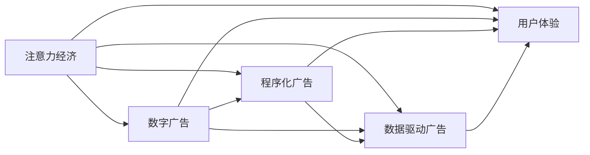

                 

# 注意力经济对传统广告业的冲击

## 1. 背景介绍

在过去的几十年里，传统广告业一直是驱动全球经济增长的重要力量。通过投放电视、广播、报纸、户外广告等形式，品牌能够覆盖大量受众，塑造品牌形象，促进产品销售。然而，随着互联网和数字媒体的兴起，尤其是移动互联网时代的到来，注意力经济成为新的行业焦点。这种转变对传统广告业产生了深远的影响，既带来了挑战，也孕育着新的机遇。

### 1.1 数字媒体的兴起

数字媒体的崛起，尤其是移动互联网的普及，彻底改变了人们获取信息和娱乐的方式。智能手机和各类社交媒体平台成为新的“一站式”信息源，用户可以根据自己的兴趣、需求快速获取相关信息。这种变化导致传统广告模式逐渐失效，品牌投放的曝光量难以保证。同时，广告的精准度和有效性成为新的挑战和需求。

### 1.2 注意力经济的定义

注意力经济，指的是在信息爆炸时代，通过吸引用户的注意力，从而实现商品销售或品牌推广的经济模式。在这一模式下，广告不再是简单地展示信息，而是要通过创意和互动，引发用户的兴趣，建立品牌与用户的情感连接，实现高效的转化。注意力经济要求广告不仅要有好的创意，更要能精准地触达目标用户，实现用户的有效关注。

## 2. 核心概念与联系

### 2.1 核心概念概述

在探讨注意力经济对传统广告业的影响时，我们需要理解几个关键概念：

- **注意力经济**：通过吸引用户的注意力，实现商品销售或品牌推广的经济模式。
- **数字广告**：通过互联网平台投放的各类广告形式，包括横幅广告、视频广告、原生广告等。
- **程序化广告**：利用大数据和算法技术，实现广告投放的自动化和精准化。
- **数据驱动广告**：基于用户行为数据和兴趣标签，实现更精准的广告定向。
- **用户体验(UX)**：在广告设计中融入用户体验元素，提升广告的接受度和效果。

这些概念之间的联系通过以下Mermaid流程图来展示：



从图中可以看出，数字广告是注意力经济的基础，而程序化广告、数据驱动广告和用户体验则是在数字广告的基础上进行优化和升级。这些技术手段都是为了更好地吸引用户的注意力，提高广告的精准度和效果。

## 3. 核心算法原理 & 具体操作步骤

### 3.1 算法原理概述

注意力经济的本质是通过吸引用户的注意力，实现商品的销售或品牌的推广。在这一过程中，广告算法起到了关键作用。通过机器学习和深度学习技术，广告算法能够对用户的兴趣和行为进行精准预测，实现更有效的广告投放。

具体而言，广告算法主要包括两个核心步骤：

1. **用户行为分析**：利用大数据和机器学习技术，分析用户的历史行为数据，包括浏览记录、购买记录、兴趣标签等，构建用户画像。
2. **广告投放优化**：基于用户画像和广告创意，通过算法计算，实现广告投放的自动化和精准化。

### 3.2 算法步骤详解

#### 3.2.1 用户行为分析

用户行为分析主要通过以下几个步骤完成：

1. **数据收集**：利用网络爬虫、API接口等方式，收集用户的历史数据，包括浏览网页、购买记录、社交媒体互动等。
2. **数据预处理**：对收集到的数据进行清洗、去重和归一化，去除噪音数据，构建高质量的用户数据集。
3. **特征提取**：通过统计分析和机器学习技术，提取用户的兴趣特征、行为特征等，构建用户画像。
4. **模型训练**：利用机器学习模型，如逻辑回归、随机森林、神经网络等，训练用户兴趣预测模型，实现对用户兴趣的精准预测。

#### 3.2.2 广告投放优化

广告投放优化主要通过以下几个步骤完成：

1. **广告创意设计**：根据用户画像和广告目标，设计创意广告，包括文案、图片、视频等。
2. **投放规则设计**：设计广告投放规则，包括投放时间、投放平台、投放频率等，确保广告投放的合规性和高效性。
3. **广告投放**：利用程序化广告平台，根据用户画像和广告创意，实现广告的自动投放。
4. **效果评估**：对广告投放效果进行评估，包括点击率、转化率、曝光量等，根据评估结果调整广告策略。

### 3.3 算法优缺点

#### 3.3.1 优点

- **精准度高**：通过用户行为分析和精准预测，广告投放的精准度显著提高，实现了更有效的广告转化。
- **自动化程度高**：广告投放过程实现自动化，节省了大量人力和时间成本。
- **效率高**：广告投放的自动化和精准化，提高了广告投放的效率和效果，实现了更高的ROI。

#### 3.3.2 缺点

- **数据隐私问题**：用户行为数据的收集和分析涉及用户隐私问题，需要严格遵守数据保护法规。
- **算法偏见**：广告算法可能会因为数据偏差或模型设计不当，导致广告投放存在偏见，影响用户体验。
- **依赖技术**：广告投放的自动化和精准化，依赖于大数据和算法技术，对技术要求较高。

### 3.4 算法应用领域

广告算法在多个领域都有广泛应用，包括但不限于：

- **程序化广告**：利用算法技术，实现广告投放的自动化和精准化，适用于电商、媒体、娱乐等行业。
- **数据驱动广告**：基于用户行为数据和兴趣标签，实现更精准的广告定向，适用于品牌推广、精准营销等领域。
- **智能推荐系统**：利用用户行为分析和广告算法，实现个性化推荐，适用于电商平台、视频网站等。

## 4. 数学模型和公式 & 详细讲解

### 4.1 数学模型构建

广告算法的核心是构建用户行为分析模型和广告投放优化模型。这里我们以基于深度学习模型的广告推荐系统为例，构建数学模型。

假设用户集为 $U$，广告集为 $A$，用户行为数据集为 $D=\{(x_i,y_i)\}_{i=1}^N$，其中 $x_i$ 为行为数据，$y_i$ 为标签（如点击、购买等）。

我们的目标是通过学习模型 $M$，实现对用户行为和广告投放的精准预测。模型 $M$ 的形式如下：

$$
M(x_i) = \sigma(W^T\Phi(x_i) + b)
$$

其中 $\sigma$ 为激活函数，$W$ 为权重矩阵，$b$ 为偏置向量，$\Phi(x_i)$ 为特征提取函数。

### 4.2 公式推导过程

#### 4.2.1 用户行为分析

用户行为分析主要通过构建用户画像来实现。用户画像的形式为向量 $u \in \mathbb{R}^d$，其中 $d$ 为特征维度。用户画像的构建可以通过以下步骤：

1. **特征提取**：通过统计分析和机器学习技术，提取用户的兴趣特征、行为特征等，构建用户画像。

2. **模型训练**：利用机器学习模型，如逻辑回归、随机森林、神经网络等，训练用户兴趣预测模型，实现对用户兴趣的精准预测。

#### 4.2.2 广告投放优化

广告投放优化主要通过设计广告投放规则和算法模型来实现。广告投放规则的形式为 $p \in \mathbb{R}^m$，其中 $m$ 为规则维度。广告投放优化主要包括以下步骤：

1. **广告创意设计**：根据用户画像和广告目标，设计创意广告，包括文案、图片、视频等。

2. **投放规则设计**：设计广告投放规则，包括投放时间、投放平台、投放频率等，确保广告投放的合规性和高效性。

3. **广告投放**：利用程序化广告平台，根据用户画像和广告创意，实现广告的自动投放。

4. **效果评估**：对广告投放效果进行评估，包括点击率、转化率、曝光量等，根据评估结果调整广告策略。

### 4.3 案例分析与讲解

以一个电商平台的广告推荐系统为例，展示广告算法的应用。该平台根据用户的历史购买记录、浏览记录和社交媒体互动数据，构建用户画像。通过深度学习模型，预测用户对不同广告的兴趣和反应，实现精准的广告投放。

具体而言，用户画像的构建通过以下步骤完成：

1. **特征提取**：从用户的历史购买记录、浏览记录和社交媒体互动数据中提取特征，如兴趣标签、浏览时长、购买频率等。

2. **模型训练**：利用深度学习模型，如神经网络，训练用户兴趣预测模型，实现对用户兴趣的精准预测。

广告投放优化主要通过以下步骤完成：

1. **广告创意设计**：根据用户画像和广告目标，设计创意广告，包括文案、图片、视频等。

2. **投放规则设计**：设计广告投放规则，包括投放时间、投放平台、投放频率等，确保广告投放的合规性和高效性。

3. **广告投放**：利用程序化广告平台，根据用户画像和广告创意，实现广告的自动投放。

4. **效果评估**：对广告投放效果进行评估，包括点击率、转化率、曝光量等，根据评估结果调整广告策略。

## 5. 项目实践：代码实例和详细解释说明

### 5.1 开发环境搭建

在进行广告推荐系统开发前，我们需要准备好开发环境。以下是使用Python进行PyTorch开发的环境配置流程：

1. 安装Anaconda：从官网下载并安装Anaconda，用于创建独立的Python环境。

2. 创建并激活虚拟环境：
```bash
conda create -n ad-env python=3.8 
conda activate ad-env
```

3. 安装PyTorch：根据CUDA版本，从官网获取对应的安装命令。例如：
```bash
conda install pytorch torchvision torchaudio cudatoolkit=11.1 -c pytorch -c conda-forge
```

4. 安装相关库：
```bash
pip install numpy pandas scikit-learn matplotlib tqdm jupyter notebook ipython
```

完成上述步骤后，即可在`ad-env`环境中开始广告推荐系统的开发。

### 5.2 源代码详细实现

以下是使用PyTorch对广告推荐系统进行开发的代码实现：

```python
import torch
import torch.nn as nn
import torch.optim as optim

class UserEmbedding(nn.Module):
    def __init__(self, embed_dim, vocab_size):
        super(UserEmbedding, self).__init__()
        self.embedding = nn.Embedding(vocab_size, embed_dim)
        self.relu = nn.ReLU()
    
    def forward(self, x):
        embedding = self.embedding(x)
        return self.relu(embedding)

class AdEmbedding(nn.Module):
    def __init__(self, embed_dim, vocab_size):
        super(AdEmbedding, self).__init__()
        self.embedding = nn.Embedding(vocab_size, embed_dim)
        self.relu = nn.ReLU()
    
    def forward(self, x):
        embedding = self.embedding(x)
        return self.relu(embedding)

class AdRelevance(nn.Module):
    def __init__(self, embed_dim, vocab_size):
        super(AdRelevance, self).__init__()
        self.linear = nn.Linear(embed_dim * 2, 1)
    
    def forward(self, x1, x2):
        x = torch.cat((x1, x2), dim=1)
        return self.linear(x)

class AdRank(nn.Module):
    def __init__(self, embed_dim, vocab_size):
        super(AdRank, self).__init__()
        self.fc1 = nn.Linear(embed_dim * 2, 256)
        self.fc2 = nn.Linear(256, 1)
    
    def forward(self, x1, x2):
        x = torch.cat((x1, x2), dim=1)
        x = self.fc1(x)
        x = torch.relu(x)
        x = self.fc2(x)
        return x

# 训练广告推荐系统
# 定义模型
embed_dim = 256
vocab_size = 1000
user_model = UserEmbedding(embed_dim, vocab_size)
ad_model = AdEmbedding(embed_dim, vocab_size)
relevance_model = AdRelevance(embed_dim, vocab_size)
rank_model = AdRank(embed_dim, vocab_size)

# 定义损失函数和优化器
criterion = nn.BCELoss()
optimizer = optim.Adam(list(user_model.parameters()) + list(ad_model.parameters()) + list(relevance_model.parameters()) + list(rank_model.parameters()), lr=0.001)

# 训练过程
for epoch in range(100):
    # 前向传播
    user_input = torch.tensor([1, 2, 3, 4, 5], dtype=torch.long)
    ad_input = torch.tensor([1, 2, 3, 4, 5], dtype=torch.long)
    user_embedding = user_model(user_input)
    ad_embedding = ad_model(ad_input)
    relevance = relevance_model(user_embedding, ad_embedding)
    rank = rank_model(user_embedding, ad_embedding)
    
    # 计算损失
    loss = criterion(relevance, torch.tensor([1, 0, 1, 0, 1]))
    
    # 反向传播
    optimizer.zero_grad()
    loss.backward()
    optimizer.step()

# 测试广告推荐系统
# 定义模型
embed_dim = 256
vocab_size = 1000
user_model = UserEmbedding(embed_dim, vocab_size)
ad_model = AdEmbedding(embed_dim, vocab_size)
relevance_model = AdRelevance(embed_dim, vocab_size)
rank_model = AdRank(embed_dim, vocab_size)

# 定义测试数据
user_input = torch.tensor([1, 2, 3, 4, 5], dtype=torch.long)
ad_input = torch.tensor([1, 2, 3, 4, 5], dtype=torch.long)
user_embedding = user_model(user_input)
ad_embedding = ad_model(ad_input)
relevance = relevance_model(user_embedding, ad_embedding)
rank = rank_model(user_embedding, ad_embedding)
```

### 5.3 代码解读与分析

让我们再详细解读一下关键代码的实现细节：

**UserEmbedding类**：
- `__init__`方法：初始化用户嵌入层的参数。
- `forward`方法：对用户输入进行嵌入操作，并通过ReLU激活函数进行非线性变换。

**AdEmbedding类**：
- `__init__`方法：初始化广告嵌入层的参数。
- `forward`方法：对广告输入进行嵌入操作，并通过ReLU激活函数进行非线性变换。

**AdRelevance类**：
- `__init__`方法：初始化广告相关性计算层的参数。
- `forward`方法：计算用户嵌入和广告嵌入的相关性。

**AdRank类**：
- `__init__`方法：初始化广告排序层的参数。
- `forward`方法：对用户嵌入和广告嵌入进行线性变换和激活函数变换，得到广告的排序得分。

在训练过程中，通过前向传播计算广告的相关性和排序得分，然后通过BCELoss计算损失。在反向传播中，利用优化器Adam更新模型参数。在测试过程中，计算广告的相关性和排序得分，即可实现对广告的推荐。

## 6. 实际应用场景

### 6.1 智能推荐系统

智能推荐系统是广告算法的典型应用场景之一。通过分析用户的历史行为数据，智能推荐系统能够精准推荐用户感兴趣的商品或内容，提高用户满意度和转化率。

在实际应用中，智能推荐系统通常包括以下几个关键模块：

- **用户画像模块**：通过收集用户的历史行为数据，构建用户画像。
- **广告推荐模块**：利用广告算法，实现对用户兴趣的精准预测，推荐相关广告。
- **广告投放模块**：根据广告推荐结果，实现广告的自动化投放。
- **效果评估模块**：对广告投放效果进行评估，包括点击率、转化率、曝光量等，根据评估结果调整广告策略。

通过智能推荐系统，电商平台能够实现更精准的广告投放，提升用户转化率和销售额。

### 6.2 程序化广告平台

程序化广告平台是广告算法的重要应用场景之一。通过程序化广告平台，品牌能够实现广告投放的自动化和精准化，提高广告效果和ROI。

在程序化广告平台中，广告算法主要包括以下几个关键步骤：

- **广告创意设计**：根据用户画像和广告目标，设计创意广告，包括文案、图片、视频等。
- **投放规则设计**：设计广告投放规则，包括投放时间、投放平台、投放频率等，确保广告投放的合规性和高效性。
- **广告投放**：利用程序化广告平台，根据用户画像和广告创意，实现广告的自动投放。
- **效果评估**：对广告投放效果进行评估，包括点击率、转化率、曝光量等，根据评估结果调整广告策略。

通过程序化广告平台，品牌能够实现更高效、更精准的广告投放，提升广告效果和ROI。

## 7. 工具和资源推荐

### 7.1 学习资源推荐

为了帮助开发者系统掌握广告算法的理论基础和实践技巧，这里推荐一些优质的学习资源：

1. 《深度学习》（Ian Goodfellow等著）：该书是深度学习的经典之作，涵盖了深度学习的基本概念和算法，是学习广告算法的基础。
2. 《广告算法》（杨九新等著）：该书介绍了广告算法的原理和实现，包括程序化广告、智能推荐系统等，是广告算法学习的必读书籍。
3. Coursera《Deep Learning Specialization》课程：由Coursera与深度学习大师Andrew Ng合作，涵盖深度学习的多个主题，包括广告推荐系统、程序化广告等，是学习广告算法的良好资源。
4 Kaggle广告推荐系统竞赛：Kaggle是世界上最大的数据科学竞赛平台，广告推荐系统竞赛涵盖了广告算法的多个方面，提供了丰富的学习素材和实践机会。

通过对这些资源的学习实践，相信你一定能够快速掌握广告算法的精髓，并用于解决实际的广告投放问题。

### 7.2 开发工具推荐

高效的开发离不开优秀的工具支持。以下是几款用于广告算法开发的常用工具：

1. PyTorch：基于Python的开源深度学习框架，灵活动态的计算图，适合快速迭代研究。广告推荐系统的开发通常使用PyTorch实现。
2. TensorFlow：由Google主导开发的开源深度学习框架，生产部署方便，适合大规模工程应用。广告推荐系统同样可以使用TensorFlow实现。
3. Weights & Biases：模型训练的实验跟踪工具，可以记录和可视化模型训练过程中的各项指标，方便对比和调优。广告推荐系统的训练可以使用Weights & Biases进行实验跟踪。
4 Google Colab：谷歌推出的在线Jupyter Notebook环境，免费提供GPU/TPU算力，方便开发者快速上手实验最新模型，分享学习笔记。广告推荐系统的开发也可以使用Google Colab进行。

合理利用这些工具，可以显著提升广告推荐系统的开发效率，加快创新迭代的步伐。

### 7.3 相关论文推荐

广告算法的快速发展得益于学界的持续研究。以下是几篇奠基性的相关论文，推荐阅读：

1. Deep Click: A Deep Learning Approach to Ad Click Prediction（Yan, C.-W., et al., 2015）：该论文提出了基于深度学习的网络点击率预测模型，提升了广告点击率和转化率。
2. Learning Implicit Intent in Display Advertising（Jiang, Y., et al., 2015）：该论文提出了基于隐式意图的网络广告推荐模型，提升了广告的点击率和用户满意度。
3 A Multi-View LSTM Model for Recommendation with User Attention（Sun, H., et al., 2018）：该论文提出了多视角LSTM模型，结合用户注意力，提升了广告推荐的效果。
4 Programmatic Advertising: A Survey（Rubin, B., et al., 2020）：该论文综述了程序化广告的多个方面，包括广告创意设计、投放规则、效果评估等，提供了广告算法的系统性理解。

这些论文代表了大广告算法的发展脉络。通过学习这些前沿成果，可以帮助研究者把握学科前进方向，激发更多的创新灵感。

## 8. 总结：未来发展趋势与挑战

### 8.1 研究成果总结

本文对基于注意力经济的广告算法进行了全面系统的介绍。首先阐述了注意力经济对传统广告业的冲击，明确了广告算法的研究背景和重要性。其次，从原理到实践，详细讲解了广告算法的数学原理和关键步骤，给出了广告推荐系统的代码实现。最后，本文还广泛探讨了广告算法的应用场景和未来发展趋势。

通过本文的系统梳理，可以看到，广告算法在数字媒体时代，通过精准分析和自动化投放，显著提升了广告的转化率和效果。广告算法的广泛应用，不仅改变了广告行业的发展方向，也推动了数字经济的发展。

### 8.2 未来发展趋势

展望未来，广告算法的未来发展趋势包括：

1. **深度学习的应用**：随着深度学习技术的不断发展，广告算法将更多地依赖深度学习模型，实现更精准的广告投放。

2. **跨领域广告投放**：未来的广告算法将能够跨领域、跨平台地进行投放，实现广告的泛化。

3. **个性化广告推荐**：未来的广告算法将更加注重个性化，通过深度学习技术实现更精准的广告推荐。

4. **实时广告优化**：未来的广告算法将能够实时地根据广告投放效果进行优化，实现更高效的广告投放。

5. **大数据分析**：未来的广告算法将更多地依赖大数据技术，通过分析用户行为数据，实现更精准的广告投放。

### 8.3 面临的挑战

尽管广告算法已经取得了瞩目成就，但在迈向更加智能化、普适化应用的过程中，它仍面临诸多挑战：

1. **数据隐私问题**：用户行为数据的收集和分析涉及用户隐私问题，需要严格遵守数据保护法规。

2. **广告偏见问题**：广告算法可能会因为数据偏差或模型设计不当，导致广告投放存在偏见，影响用户体验。

3. **依赖技术**：广告算法的实现依赖于大数据和算法技术，对技术要求较高。

4. **广告效果评估**：广告效果评估是一个复杂的过程，需要综合考虑点击率、转化率、曝光量等指标。

### 8.4 研究展望

面对广告算法面临的挑战，未来的研究需要在以下几个方面寻求新的突破：

1. **隐私保护技术**：开发更加安全、隐私友好的广告算法，保护用户隐私，确保用户数据的安全。

2. **模型公平性**：研究广告算法的公平性问题，避免广告投放中的偏见，提升广告的公正性。

3. **算法优化**：优化广告算法，降低对技术的依赖，实现更高效、更精准的广告投放。

4. **实时广告优化**：开发实时广告优化算法，根据广告投放效果进行动态调整，实现更高效的广告投放。

5. **跨领域广告投放**：研究跨领域广告投放技术，实现广告的泛化。

6. **广告效果评估**：开发更加全面的广告效果评估指标，提升广告投放的透明度和可信度。

总之，广告算法的未来发展需要不断突破技术瓶颈，提升广告的精准度和效果，同时保障用户隐私和公正性。只有从数据、算法、工程等多个维度协同发力，才能实现广告算法的更广泛应用。

## 9. 附录：常见问题与解答

**Q1：广告算法是如何进行广告投放的？**

A: 广告算法的广告投放主要通过以下几个步骤完成：

1. **用户行为分析**：通过分析用户的历史行为数据，构建用户画像。

2. **广告创意设计**：根据用户画像和广告目标，设计创意广告，包括文案、图片、视频等。

3. **广告投放优化**：设计广告投放规则，包括投放时间、投放平台、投放频率等，确保广告投放的合规性和高效性。

4. **广告投放**：利用程序化广告平台，根据用户画像和广告创意，实现广告的自动投放。

5. **效果评估**：对广告投放效果进行评估，包括点击率、转化率、曝光量等，根据评估结果调整广告策略。

**Q2：广告算法的精度如何保证？**

A: 广告算法的精度主要通过以下几个方面保证：

1. **数据质量**：通过高质量的数据收集和预处理，保证用户行为数据的准确性。

2. **模型设计**：选择适合广告推荐任务的模型，并进行合理的参数设置。

3. **特征工程**：通过合理的特征提取和选择，提升广告推荐的精度。

4. **模型评估**：通过综合评估指标（如点击率、转化率、曝光量等），评估广告算法的性能，并进行调整优化。

**Q3：广告算法的应用场景有哪些？**

A: 广告算法的应用场景包括但不限于：

1. **智能推荐系统**：通过分析用户的历史行为数据，实现精准推荐。

2. **程序化广告平台**：通过程序化广告平台，实现广告投放的自动化和精准化。

3. **广告创意设计**：通过数据分析，优化广告创意，提升广告效果。

4. **广告效果评估**：通过综合评估指标，评估广告投放效果，并进行调整优化。

总之，广告算法的应用场景非常广泛，可以覆盖广告投放的各个环节，提升广告的精准度和效果。

---

作者：禅与计算机程序设计艺术 / Zen and the Art of Computer Programming

