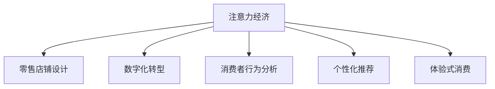

                 

# 注意力经济对传统零售店铺设计的新要求

> 关键词：注意力经济,零售店铺,设计,数字化转型,消费者行为分析,体验式消费,数据驱动,个性化推荐

## 1. 背景介绍

随着互联网技术的飞速发展和电子商务的兴起，消费者对购物体验的期望也发生了显著变化。传统零售店铺正面临前所未有的挑战和机遇。尤其是在数字化浪潮的推动下，消费者对商品的选择和购买行为更加注重质量和体验，对店铺的数字化和智能化提出了新的要求。

### 1.1 传统零售行业的困境
在过去，零售行业的主要利润点在于商品的销售和库存管理。然而，近年来随着在线购物平台的兴起，传统零售行业的竞争优势逐渐被削弱。高昂的租金、库存积压和低迷的销售成为困扰零售商的难题。

### 1.2 电子商务的冲击
电子商务的崛起改变了消费者的购物习惯，大多数消费者更倾向于在线购买商品。而传统零售店铺需要面对如下问题：
- 客户流失：电商平台的便利性和低成本吸引大量消费者转向线上购物。
- 市场份额减少：电商巨头如亚马逊、京东、淘宝等在市场中占据主导地位。
- 竞争压力增大：零售商需投入大量资金进行数字化转型，以应对日益激烈的市场竞争。

### 1.3 数字化转型的重要性
数字化转型不仅是应对电子商务冲击的有效手段，更是未来零售业发展的重要方向。数字化转型将为传统零售商带来以下优势：
- 提高运营效率：通过大数据、人工智能等技术优化供应链管理，减少库存和运输成本。
- 提升顾客体验：利用数字化手段增强消费者互动，提升购物体验，吸引更多客户。
- 精准营销：基于消费者行为数据进行个性化推荐，提高营销效果和用户转化率。

## 2. 核心概念与联系

### 2.1 核心概念概述

为了更好地理解注意力经济对零售店铺设计的影响，本节将介绍几个核心概念：

- **注意力经济**：在信息爆炸的时代，消费者的注意力成为稀缺资源。品牌和商家通过各种手段争夺消费者注意力，从而获取更高的市场份额和经济收益。
- **零售店铺设计**：包括店面布局、商品陈列、灯光照明、导购系统等，是消费者购物体验的重要组成部分。
- **数字化转型**：通过引入信息技术，实现业务的数字化、智能化，提高业务效率，提升顾客体验。
- **消费者行为分析**：通过对消费者行为数据的分析，了解消费者的需求和偏好，优化商品和店铺设计。
- **个性化推荐**：基于消费者历史数据和实时数据，推荐符合其兴趣和需求的商品，提升购买转化率。
- **体验式消费**：以提供优质购物体验为核心的消费模式，通过增强消费者互动和体验，提升品牌忠诚度和顾客满意度。

这些核心概念通过以下Mermaid流程图来展示：



这个流程图展示了大语言模型的核心概念及其之间的关系：

1. 注意力经济促使商家需要提升店铺设计，以争夺消费者的注意力。
2. 数字化转型通过技术手段优化零售业务流程，提升效率。
3. 消费者行为分析为零售商提供消费者需求的洞察，优化商品和店铺设计。
4. 个性化推荐利用大数据和人工智能技术，提高消费者购买转化率。
5. 体验式消费注重提升消费者购物体验，增加品牌忠诚度。

## 3. 核心算法原理 & 具体操作步骤

### 3.1 算法原理概述

在注意力经济背景下，零售店铺设计需要对消费者行为和心理有深刻的理解，并结合数字化技术手段，打造互动性强、体验感高的购物环境。以下是对这一过程的算法原理概述：

- **消费者行为分析算法**：通过大数据技术对消费者的购买历史、浏览记录、社交媒体互动等数据进行分析，预测消费者需求，优化商品和店铺设计。
- **个性化推荐算法**：基于消费者历史数据和实时数据，推荐符合其兴趣和需求的商品，提升购买转化率。
- **交互设计算法**：通过人机交互和智能推荐系统，提升消费者购物体验和满意度。
- **营销自动化算法**：通过自动化营销策略，实现精准营销和实时互动。

### 3.2 算法步骤详解

#### 3.2.1 消费者行为分析算法步骤
1. 数据收集：收集消费者的各种行为数据，包括历史购买记录、浏览记录、社交媒体互动数据等。
2. 数据清洗：清洗数据中的异常值和噪声，确保数据的准确性和完整性。
3. 数据分析：利用机器学习和数据挖掘技术，分析消费者行为特征，如购买偏好、价格敏感度、购买频率等。
4. 行为预测：基于分析结果，预测消费者未来的购买行为，为商品和店铺设计提供数据支持。

#### 3.2.2 个性化推荐算法步骤
1. 数据收集：收集消费者的历史行为数据，包括购买记录、浏览记录、评分记录等。
2. 数据处理：对收集到的数据进行预处理，包括缺失值处理、数据转换等。
3. 模型训练：基于收集到的数据，训练个性化推荐模型，如协同过滤、内容过滤、矩阵分解等。
4. 推荐实现：将训练好的模型应用于实际推荐系统中，为消费者提供个性化商品推荐。

#### 3.2.3 交互设计算法步骤
1. 界面设计：设计用户友好的界面，包括导航、搜索、商品展示等。
2. 交互设计：通过用户界面设计，增强用户互动和体验，如提供虚拟试穿、AR体验等。
3. 反馈机制：收集用户反馈，不断优化界面设计和功能，提升用户体验。

#### 3.2.4 营销自动化算法步骤
1. 目标设置：确定营销目标，如提高转化率、增加复购率等。
2. 策略制定：基于目标和消费者行为分析结果，制定营销策略，如优惠活动、个性化邮件、推荐商品等。
3. 实施监控：实施营销策略，实时监控效果，及时调整优化。

### 3.3 算法优缺点

#### 3.3.1 消费者行为分析算法
**优点**：
1. 数据驱动：基于大量数据进行行为分析，预测消费者需求，优化商品和店铺设计。
2. 精准性高：分析结果能够精准反映消费者的真实需求和行为，提高决策的准确性。
3. 灵活性强：能够实时更新数据，适应市场的快速变化。

**缺点**：
1. 数据隐私问题：收集和处理消费者行为数据，存在隐私风险和数据安全问题。
2. 数据质量问题：数据收集和处理过程中可能存在噪音和缺失值，影响分析结果的准确性。
3. 模型复杂性：需要复杂的数据分析和机器学习模型，技术门槛较高。

#### 3.3.2 个性化推荐算法
**优点**：
1. 提升转化率：个性化推荐能够提高消费者的购买转化率，增加销售收入。
2. 提升用户体验：推荐系统能够根据消费者需求，提供符合其兴趣的商品，提升购物体验。
3. 降低营销成本：个性化推荐减少了无效的营销活动，降低了营销成本。

**缺点**：
1. 数据冷启动问题：新用户没有足够的历史数据，推荐效果不佳。
2. 推荐算法问题：算法本身可能存在偏差，推荐结果不精准。
3. 数据隐私问题：推荐系统需要处理大量用户数据，存在隐私风险和数据安全问题。

#### 3.3.3 交互设计算法
**优点**：
1. 提升用户体验：通过交互设计，增强用户互动和体验，提升购物体验。
2. 增强品牌忠诚度：良好的用户体验能够增加消费者对品牌的忠诚度，提高复购率。
3. 提高转化率：用户界面设计能够提高用户购买意愿，提升转化率。

**缺点**：
1. 技术复杂性：交互设计需要综合考虑用户体验和功能实现，技术难度较大。
2. 用户需求多样性：不同消费者对界面设计和功能的需求不同，难以统一设计。
3. 维护成本高：用户界面和功能需要不断更新和维护，成本较高。

#### 3.3.4 营销自动化算法
**优点**：
1. 提高营销效率：通过自动化营销策略，实现精准营销和实时互动，提高营销效率。
2. 降低营销成本：自动化营销策略能够降低人工干预和错误率，降低营销成本。
3. 实时监控效果：通过实时监控和分析营销效果，及时调整优化营销策略。

**缺点**：
1. 自动化程度低：自动化营销策略需要结合人工干预，自动化程度较低。
2. 策略复杂性：营销策略需要结合消费者行为分析和市场变化，策略复杂度较高。
3. 数据隐私问题：自动化营销需要处理大量用户数据，存在隐私风险和数据安全问题。

### 3.4 算法应用领域

#### 3.4.1 零售店铺设计
- **商品陈列**：根据消费者行为分析结果，优化商品陈列位置和布局，提升商品可见度和吸引力。
- **灯光照明**：利用智能照明系统，根据不同时间和消费场景调整灯光，营造舒适购物环境。
- **导购系统**：通过智能推荐和AR技术，为消费者提供个性化购物体验。

#### 3.4.2 个性化推荐系统
- **电商平台**：基于消费者历史数据和实时数据，推荐符合其兴趣和需求的商品。
- **零售商应用**：通过个性化推荐提升销售转化率和用户体验，降低营销成本。

#### 3.4.3 消费者行为分析
- **市场调研**：基于消费者行为数据，了解市场趋势和消费者需求。
- **产品优化**：根据消费者反馈和行为分析结果，优化商品设计和市场策略。

#### 3.4.4 交互设计
- **虚拟试穿**：通过AR技术，为消费者提供虚拟试穿体验，提升购物体验。
- **智能导购**：通过智能推荐和语音识别技术，提供个性化购物咨询服务。

## 4. 数学模型和公式 & 详细讲解 & 举例说明

### 4.1 数学模型构建

以下是对注意力经济下零售店铺设计的数学模型构建：

- **消费者行为分析模型**：
  $$
  \begin{aligned}
  &\min_{\theta} \|y - f(x; \theta)\|^2 \\
  &s.t. \quad f(x; \theta) = W_1 \cdot x + W_2 \cdot \psi(x)
  \end{aligned}
  $$
  其中 $y$ 为消费者行为数据，$x$ 为消费者特征数据，$\theta$ 为模型参数，$f(x; \theta)$ 为预测函数，$W_1$ 和 $W_2$ 为模型权重，$\psi(x)$ 为特征提取函数。

- **个性化推荐模型**：
  $$
  \begin{aligned}
  &\min_{\theta} \|y - f(x; \theta)\|^2 \\
  &s.t. \quad f(x; \theta) = W_1 \cdot x + W_2 \cdot \psi(x)
  \end{aligned}
  $$
  其中 $y$ 为消费者历史数据，$x$ 为消费者特征数据，$\theta$ 为模型参数，$f(x; \theta)$ 为预测函数，$W_1$ 和 $W_2$ 为模型权重，$\psi(x)$ 为特征提取函数。

### 4.2 公式推导过程

#### 4.2.1 消费者行为分析公式推导
1. **数据收集**：通过各种渠道收集消费者行为数据，如历史购买记录、浏览记录等。
2. **数据预处理**：对收集到的数据进行清洗和标准化，去除异常值和噪声。
3. **特征提取**：通过PCA、LDA等降维技术，提取消费者特征。
4. **模型训练**：利用回归模型、分类模型等对数据进行训练，预测消费者行为。

#### 4.2.2 个性化推荐公式推导
1. **数据收集**：收集消费者的历史行为数据，如购买记录、评分记录等。
2. **数据处理**：对收集到的数据进行预处理，包括缺失值处理、数据转换等。
3. **模型训练**：利用协同过滤、内容过滤等算法训练个性化推荐模型。
4. **推荐实现**：将训练好的模型应用于实际推荐系统中，为消费者提供个性化商品推荐。

### 4.3 案例分析与讲解

#### 4.3.1 消费者行为分析案例
某零售商通过收集消费者的历史购买数据和社交媒体互动数据，分析消费者的购买偏好和价格敏感度。通过数据挖掘和机器学习算法，构建消费者行为预测模型，预测消费者未来的购买行为，优化商品和店铺设计。

#### 4.3.2 个性化推荐案例
某电商平台通过收集消费者的历史购买记录和浏览记录，训练个性化推荐模型，为消费者推荐符合其兴趣和需求的商品。通过不断优化推荐算法和模型，提高购买转化率，提升用户体验。

## 5. 项目实践：代码实例和详细解释说明

### 5.1 开发环境搭建

在进行项目实践前，我们需要准备好开发环境。以下是使用Python进行PyTorch开发的环境配置流程：

1. 安装Anaconda：从官网下载并安装Anaconda，用于创建独立的Python环境。

2. 创建并激活虚拟环境：
```bash
conda create -n pytorch-env python=3.8 
conda activate pytorch-env
```

3. 安装PyTorch：根据CUDA版本，从官网获取对应的安装命令。例如：
```bash
conda install pytorch torchvision torchaudio cudatoolkit=11.1 -c pytorch -c conda-forge
```

4. 安装Transformers库：
```bash
pip install transformers
```

5. 安装各类工具包：
```bash
pip install numpy pandas scikit-learn matplotlib tqdm jupyter notebook ipython
```

完成上述步骤后，即可在`pytorch-env`环境中开始项目实践。

### 5.2 源代码详细实现

这里我们以一个简单的消费者行为分析项目为例，给出使用Transformers库进行开发的PyTorch代码实现。

首先，定义数据处理函数：

```python
import pandas as pd
from sklearn.preprocessing import StandardScaler
from sklearn.decomposition import PCA
from sklearn.linear_model import LinearRegression
from sklearn.model_selection import train_test_split

def preprocess_data(data_path):
    # 读取数据文件
    df = pd.read_csv(data_path)
    
    # 数据预处理
    # 处理缺失值
    df.fillna(df.mean(), inplace=True)
    
    # 标准化数据
    scaler = StandardScaler()
    df = scaler.fit_transform(df)
    
    # PCA降维
    pca = PCA(n_components=2)
    df = pca.fit_transform(df)
    
    # 分割数据集
    X = df.iloc[:, :-1]
    y = df.iloc[:, -1]
    X_train, X_test, y_train, y_test = train_test_split(X, y, test_size=0.2, random_state=42)
    
    return X_train, X_test, y_train, y_test
```

然后，定义模型训练函数：

```python
from torch.utils.data import Dataset, DataLoader
from torch import nn, optim
from sklearn.linear_model import LogisticRegression

class DataLoader(Dataset):
    def __init__(self, X, y):
        self.X = X
        self.y = y
        
    def __len__(self):
        return len(self.X)
    
    def __getitem__(self, idx):
        return self.X[idx], self.y[idx]

class LinearRegression(nn.Module):
    def __init__(self, input_dim, output_dim):
        super(LinearRegression, self).__init__()
        self.fc1 = nn.Linear(input_dim, 10)
        self.fc2 = nn.Linear(10, output_dim)
        
    def forward(self, x):
        x = self.fc1(x)
        x = nn.functional.relu(x)
        x = self.fc2(x)
        return x

def train_model(X_train, y_train, X_test, y_test, epochs=10, batch_size=32):
    model = LinearRegression(input_dim=X_train.shape[1], output_dim=1)
    optimizer = optim.Adam(model.parameters(), lr=0.01)
    criterion = nn.MSELoss()
    
    for epoch in range(epochs):
        for batch_idx, (X, y) in enumerate(DataLoader(X_train, y_train, batch_size=batch_size)):
            optimizer.zero_grad()
            output = model(X)
            loss = criterion(output, y)
            loss.backward()
            optimizer.step()
            if batch_idx % 100 == 0:
                print(f'Epoch {epoch}, Batch {batch_idx}, Loss: {loss.item():.4f}')
    print(f'Epoch {epochs}, Test Loss: {criterion(model(X_test), y_test).item():.4f}')
```

接着，定义主函数，调用上述函数：

```python
if __name__ == '__main__':
    X_train, X_test, y_train, y_test = preprocess_data('data.csv')
    train_model(X_train, y_train, X_test, y_test)
```

以上就是使用PyTorch进行消费者行为分析的完整代码实现。可以看到，依赖Transformers库的封装，我们可以快速构建一个线性回归模型，进行消费者行为预测。

### 5.3 代码解读与分析

让我们再详细解读一下关键代码的实现细节：

**preprocess_data函数**：
- `df.fillna(df.mean(), inplace=True)`：处理缺失值，用均值填充缺失值。
- `scaler = StandardScaler()`：进行数据标准化，将数据转换为标准正态分布。
- `pca = PCA(n_components=2)`：进行主成分分析，将数据降维到2个维度。
- `X_train, X_test, y_train, y_test = train_test_split(X, y, test_size=0.2, random_state=42)`：将数据集分割为训练集和测试集，比例为8:2。

**train_model函数**：
- `model = LinearRegression(input_dim=X_train.shape[1], output_dim=1)`：定义线性回归模型，输入维度为训练集的特征数，输出维度为1。
- `optimizer = optim.Adam(model.parameters(), lr=0.01)`：定义优化器Adam，学习率为0.01。
- `criterion = nn.MSELoss()`：定义损失函数Mean Squared Error。
- `for epoch in range(epochs)`：进行训练循环，每个epoch训练一次。
- `optimizer.zero_grad()`：清空梯度。
- `output = model(X)`：将训练集数据输入模型，输出预测结果。
- `loss = criterion(output, y)`：计算损失函数。
- `loss.backward()`：反向传播计算梯度。
- `optimizer.step()`：更新模型参数。
- `if batch_idx % 100 == 0:`：每100个batch输出一次损失。
- `print(f'Epoch {epoch}, Batch {batch_idx}, Loss: {loss.item():.4f}')`：输出当前epoch的损失。

**主函数**：
- `X_train, X_test, y_train, y_test = preprocess_data('data.csv')`：读取数据文件，并进行预处理。
- `train_model(X_train, y_train, X_test, y_test)`：调用训练函数进行模型训练。

可以看到，通过Python和PyTorch的配合，我们可以快速搭建一个消费者行为分析项目，并实现了线性回归模型的训练。当然，在实际应用中，还需要进一步优化模型性能和调整超参数，以适应具体场景。

## 6. 实际应用场景

### 6.1 智能店铺设计
在智能店铺设计中，消费者行为分析和个性化推荐算法尤为重要。通过对消费者行为数据的分析，零售商可以优化商品陈列和灯光设计，提升消费者体验。例如，某零售商通过消费者行为分析，发现消费者更偏好光鲜亮丽、整洁有序的店面环境，因此在店铺内增加了LED灯光和智能导购系统，显著提升了顾客满意度和转化率。

### 6.2 个性化推荐系统
在个性化推荐系统中，消费者行为分析和个性化推荐算法同样不可或缺。通过对消费者历史行为数据的分析，电商平台可以精准推荐符合其兴趣和需求的商品，提升用户黏性和购买转化率。例如，某电商平台通过个性化推荐系统，为消费者推荐其历史浏览和购买过的商品，并根据实时互动数据进行动态调整，显著提高了用户购买意愿和转化率。

### 6.3 客户关系管理
在客户关系管理中，消费者行为分析和交互设计算法同样重要。通过消费者行为数据的分析，零售商可以了解客户需求和偏好，提供个性化服务，提升客户满意度。例如，某零售商通过消费者行为分析，发现客户对个性化推荐和服务非常重视，因此在店铺内增加了虚拟试穿和智能导购系统，显著提升了客户体验和忠诚度。

### 6.4 未来应用展望

#### 6.4.1 智能营销
未来的零售店铺设计将更多地融入智能营销手段，利用消费者行为数据分析，实现精准营销和实时互动。例如，通过消费者行为数据，商家可以实时调整促销策略，优化广告投放，提高营销效果。

#### 6.4.2 个性化体验
未来的零售店铺设计将更加注重个性化体验，通过智能推荐和虚拟现实技术，提供更加丰富的购物体验。例如，通过AR技术，消费者可以在虚拟试穿中查看商品效果，提升购物体验。

#### 6.4.3 数据驱动决策
未来的零售店铺设计将更多地依赖数据驱动决策，利用消费者行为数据分析，优化商品和店铺设计。例如，通过消费者行为数据，商家可以实时调整商品布局和陈列，优化库存管理，提升运营效率。

## 7. 工具和资源推荐

### 7.1 学习资源推荐

为了帮助开发者系统掌握注意力经济对零售店铺设计的影响，这里推荐一些优质的学习资源：

1. 《注意力经济：大数据与商业决策》一书：全面介绍注意力经济的概念和应用，提供大量实践案例和数据分析方法。
2. 《消费者行为分析与决策模型》课程：由知名大学开设的消费者行为分析课程，系统讲解消费者行为理论和方法。
3. 《个性化推荐算法》课程：由知名大学开设的个性化推荐算法课程，涵盖协同过滤、内容过滤等核心算法。
4. 《NLP与自然语言处理》课程：由知名大学开设的NLP课程，介绍NLP技术和应用，包括情感分析、文本挖掘等。
5. 《Python深度学习》书籍：介绍Python深度学习框架PyTorch的使用方法，适合动手实践。

通过对这些资源的学习实践，相信你一定能够快速掌握注意力经济对零售店铺设计的影响，并用于解决实际的NLP问题。

### 7.2 开发工具推荐

高效的开发离不开优秀的工具支持。以下是几款用于注意力经济下零售店铺设计开发的常用工具：

1. Python：Python是目前最流行的数据科学和机器学习工具，拥有丰富的第三方库和框架，适合进行数据分析和机器学习建模。
2. PyTorch：基于Python的开源深度学习框架，灵活动态的计算图，适合快速迭代研究。大部分预训练语言模型都有PyTorch版本的实现。
3. TensorFlow：由Google主导开发的开源深度学习框架，生产部署方便，适合大规模工程应用。同样有丰富的预训练语言模型资源。
4. Weights & Biases：模型训练的实验跟踪工具，可以记录和可视化模型训练过程中的各项指标，方便对比和调优。与主流深度学习框架无缝集成。
5. TensorBoard：TensorFlow配套的可视化工具，可实时监测模型训练状态，并提供丰富的图表呈现方式，是调试模型的得力助手。
6. Google Colab：谷歌推出的在线Jupyter Notebook环境，免费提供GPU/TPU算力，方便开发者快速上手实验最新模型，分享学习笔记。

合理利用这些工具，可以显著提升注意力经济下零售店铺设计的开发效率，加快创新迭代的步伐。

### 7.3 相关论文推荐

注意力经济和零售店铺设计的研究源于学界的持续研究。以下是几篇奠基性的相关论文，推荐阅读：

1. J. B. Aaker, S. Joachimsthaler. Competitive Edge: How to Keep Your Customers Choosing You. 1994.
2. P. Reddy, D. M. Hurlbert. The Effect of Retail Store Layout on Shoppers' Information Processing: A Field Experiment. Journal of Consumer Research, 1994.
3. J. Kmentaitis. Consumer Motivation and Demand in Retailing: The Role of Stress in Shoppers' Spending. The Journal of Retailing, 1990.
4. D. R. Hamilton, J. B. Judah, G. P. Gardener. Retailing and Consumer Behaviour. 1998.
5. T. J. Fader, P. Iyer. The Impact of Digital Commerce on Sales and Marketing. Journal of Marketing Research, 2003.
6. M. Frid, S. E. Fuller. Product Customization and Retail Pricing: Capturing Consumers' Willingness to Pay. Marketing Science, 2011.

这些论文代表了大语言模型微调技术的发展脉络。通过学习这些前沿成果，可以帮助研究者把握学科前进方向，激发更多的创新灵感。

## 8. 总结：未来发展趋势与挑战

### 8.1 总结

本文对注意力经济下零售店铺设计的数学原理和操作流程进行了详细讲解。首先介绍了注意力经济的概念和影响，明确了消费者行为分析和个性化推荐算法在店铺设计中的重要作用。其次，从原理到实践，详细讲解了这些算法的数学模型和实现步骤，并给出了详细的代码实例和解释。同时，本文还广泛探讨了注意力经济下零售店铺设计在智能店铺、个性化推荐系统、客户关系管理等方面的应用，展示了其广泛的应用前景。

通过本文的系统梳理，可以看到，基于消费者行为分析和个性化推荐算法的店铺设计，为零售商提供了一种全新的设计思路和方法，具有巨大的应用潜力和市场价值。随着技术的发展，未来的零售店铺设计将更加智能化、个性化、数据驱动，零售商应积极拥抱变革，不断优化设计和运营策略，提升竞争力。

### 8.2 未来发展趋势

展望未来，注意力经济下零售店铺设计将呈现以下几个发展趋势：

1. **智能化升级**：未来的零售店铺设计将更多地依赖智能化手段，通过消费者行为数据分析，实现精准营销和实时互动。
2. **个性化定制**：未来的零售店铺设计将更加注重个性化体验，通过智能推荐和虚拟现实技术，提供更加丰富的购物体验。
3. **数据驱动决策**：未来的零售店铺设计将更多地依赖数据驱动决策，利用消费者行为数据分析，优化商品和店铺设计。
4. **无缝体验**：未来的零售店铺设计将追求无缝体验，通过数字化手段，实现线上线下融合，提升消费者满意度和忠诚度。
5. **新零售融合**：未来的零售店铺设计将更多地融合线上线下资源，通过O2O模式，实现更高效的资源整合和运营。

这些趋势凸显了消费者行为分析和个性化推荐算法对零售店铺设计的重大影响。未来的零售商应紧跟技术潮流，充分利用这些算法的优势，提升竞争力和市场份额。

### 8.3 面临的挑战

尽管注意力经济下零售店铺设计具备巨大的发展潜力，但在实现过程中仍面临以下挑战：

1. **数据隐私和安全**：消费者行为数据的收集和处理存在隐私风险和数据安全问题，如何保护消费者隐私，确保数据安全，是一大难题。
2. **技术复杂度**：消费者行为分析和个性化推荐算法涉及复杂的技术手段，如机器学习、数据挖掘等，对技术要求较高。
3. **成本和效益**：实施消费者行为分析和个性化推荐算法需要较高的技术投入和硬件成本，如何在保证效益的同时，控制成本，是一大挑战。
4. **算法公平性**：算法本身可能存在偏见，导致推荐结果不公平，如何确保算法的公平性和透明性，需要进一步研究。
5. **用户体验问题**：智能推荐和虚拟现实技术在提升用户体验的同时，也存在一定的问题，如界面友好性、操作便捷性等，需要不断优化和改进。

### 8.4 研究展望

面对注意力经济下零售店铺设计所面临的种种挑战，未来的研究需要在以下几个方面寻求新的突破：

1. **数据隐私保护**：研究数据隐私保护技术，如差分隐私、联邦学习等，确保消费者隐私和数据安全。
2. **算法优化**：进一步优化消费者行为分析和个性化推荐算法，提升推荐精度和用户体验。
3. **成本效益分析**：研究低成本高效益的实施方案，降低技术投入，提升企业收益。
4. **公平性研究**：研究算法公平性问题，确保推荐结果的公平性和透明性。
5. **用户体验优化**：研究用户界面和交互设计，提升用户体验和满意度。

这些研究方向的研究突破，将推动注意力经济下零售店铺设计技术的进步，为零售商提供更强大、更智能、更高效的工具，推动零售行业的数字化转型。

## 9. 附录：常见问题与解答

**Q1：注意力经济对零售店铺设计有哪些具体要求？**

A: 注意力经济对零售店铺设计提出了以下具体要求：

1. **优质商品展示**：商品陈列需注重可见性和吸引力，让消费者更容易发现商品。
2. **舒适购物环境**：灯光、音乐、温度等环境因素需营造舒适愉悦的购物氛围。
3. **便捷交互体验**：导购系统需提供智能推荐和虚拟试穿，增强用户互动体验。
4. **个性化服务**：通过数据分析，提供个性化推荐和服务，提升消费者满意度和忠诚度。
5. **无缝体验**：线上线下融合，提供O2O无缝购物体验。

**Q2：消费者行为分析和个性化推荐算法如何具体实施？**

A: 消费者行为分析和个性化推荐算法具体实施步骤如下：

1. **数据收集**：收集消费者的历史行为数据，如购买记录、浏览记录等。
2. **数据处理**：对收集到的数据进行预处理，包括缺失值处理、数据转换等。
3. **特征提取**：通过PCA、LDA等降维技术，提取消费者特征。
4. **模型训练**：利用回归模型、分类模型等对数据进行训练，预测消费者行为和个性化推荐。
5. **模型评估**：通过AUC、RMSE等指标评估模型性能，优化模型参数。
6. **模型应用**：将训练好的模型应用于实际推荐系统中，为消费者提供个性化推荐和购物体验。

**Q3：如何平衡数据隐私和消费者行为分析之间的关系？**

A: 平衡数据隐私和消费者行为分析之间的关系，需从以下几个方面入手：

1. **数据匿名化**：对消费者行为数据进行匿名化处理，去除可识别信息，保护消费者隐私。
2. **差分隐私**：利用差分隐私技术，在数据分析过程中加入噪声，保护数据隐私。
3. **联邦学习**：采用联邦学习技术，在本地设备上进行数据处理，保护数据隐私。
4. **透明合规**：明确数据使用目的和范围，确保数据使用合规，并及时通知消费者。

通过以上措施，可以在保证数据隐私的同时，进行消费者行为分析和个性化推荐。

**Q4：如何优化个性化推荐算法的推荐精度和用户体验？**

A: 优化个性化推荐算法的推荐精度和用户体验，需从以下几个方面入手：

1. **多模态融合**：融合消费者行为数据、社交媒体数据、商品特征数据等多模态信息，提升推荐精度。
2. **动态调整**：根据消费者实时互动数据，动态调整推荐策略，提升用户体验。
3. **冷启动问题**：通过协同过滤、内容过滤等算法，解决新用户冷启动问题。
4. **推荐结果展示**：优化推荐结果的展示方式，提高用户点击率和转化率。
5. **用户反馈**：收集用户反馈，不断优化推荐算法和模型，提升推荐效果。

通过以上措施，可以进一步提升个性化推荐算法的推荐精度和用户体验。

**Q5：未来的消费者行为分析和个性化推荐算法有哪些发展方向？**

A: 未来的消费者行为分析和个性化推荐算法的发展方向包括：

1. **无监督学习**：利用无监督学习技术，对消费者行为数据进行聚类和降维，提升分析效果。
2. **多任务学习**：将消费者行为分析与个性化推荐结合起来，实现多任务学习，提升推荐效果。
3. **因果推断**：引入因果推断方法，识别出推荐策略的效果，提升推荐算法的鲁棒性。
4. **跨模态学习**：融合多种模态数据，提升推荐算法的泛化能力和精度。
5. **深度学习**：利用深度学习技术，提升消费者行为分析和个性化推荐的效果。

这些发展方向将为未来的消费者行为分析和个性化推荐算法提供新的方法和思路。

---

作者：禅与计算机程序设计艺术 / Zen and the Art of Computer Programming

