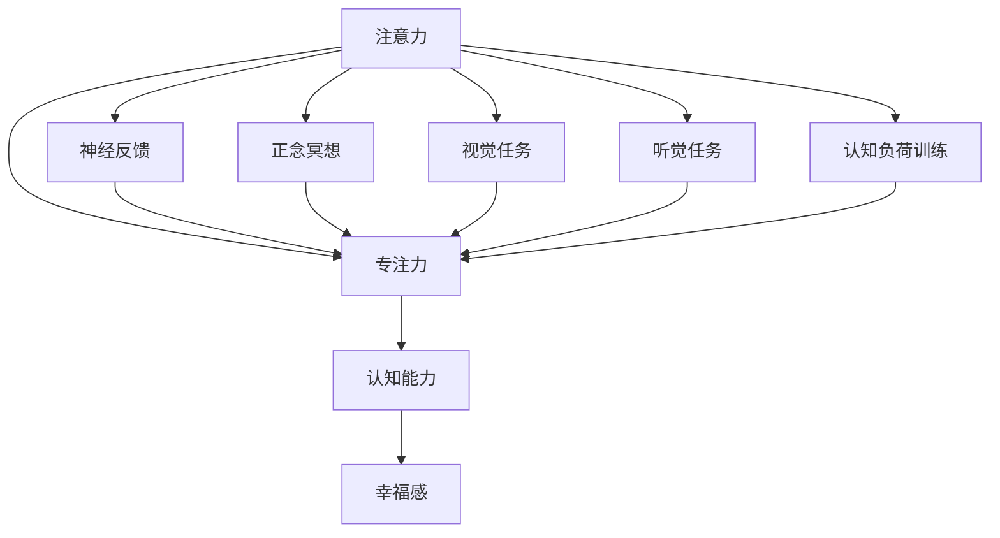

                 

# 注意力训练与大脑健康改善：通过专注力增强认知能力和幸福感

> 关键词：注意力训练,大脑健康,专注力,认知能力,幸福感

## 1. 背景介绍

### 1.1 问题由来
在现代社会，快节奏的生活方式和高压力的工作环境使得人们普遍面临着注意力分散、记忆力衰退和情绪波动等问题。这些问题不仅影响日常工作效率，还可能长期危害身心健康。通过科学的方法进行注意力训练，可以帮助人们提升专注力，增强认知能力，从而改善情绪和幸福感。其中，注意力训练已逐渐成为人工智能、认知科学和健康科学交叉研究的热点。

### 1.2 问题核心关键点
注意力训练的核心在于通过有意识、有系统的练习，提升个体对注意力的控制能力。这种训练通常包括神经反馈、正念冥想、视觉任务、听觉任务等多种形式，旨在通过持续的刺激和练习，强化大脑的注意力网络。其关键点包括：
1. 神经反馈：通过实时监控脑电信号，向用户提供注意力的反馈信息，使其能够有针对性地调整注意力状态。
2. 正念冥想：通过静坐冥想、呼吸调节等方法，训练用户专注于当下，减少分心。
3. 视觉任务：如指认物体的颜色、形状、位置等，通过视觉刺激增强注意力。
4. 听觉任务：如跟随音频指令完成特定的动作，通过听觉刺激训练注意力。
5. 认知负荷训练：通过增加任务难度和复杂度，锻炼用户的注意力分配和资源管理能力。

这些关键点在注意力训练中各司其职，通过组合应用，可以达到最佳的效果。

### 1.3 问题研究意义
研究注意力训练对于提升个体认知能力、改善情绪状态和幸福感具有重要意义：

1. 提高工作效率：通过增强专注力，个体能够更高效地完成任务，减少分心和错误。
2. 改善情绪状态：注意力训练可以减轻焦虑、压力等负面情绪，提升情绪稳定性。
3. 促进心理健康：长期坚持注意力训练可以预防和缓解抑郁症、ADHD等心理健康问题。
4. 提升生活质量：专注力和幸福感与生活质量密切相关，注意力训练有助于提升个人的生活质量。
5. 加速技术落地：注意力训练在人工智能领域的应用，可以推动认知增强技术的商业化和普及。

## 2. 核心概念与联系

### 2.1 核心概念概述

为更好地理解注意力训练的原理和应用，本节将介绍几个密切相关的核心概念：

- 注意力(Attention)：指个体对外部环境或内部心理状态的关注程度和集中状态。注意力网络包括前额叶皮层、顶叶皮层、枕叶皮层等大脑区域，负责信息选择、注意力分配和信息整合等功能。
- 专注力(Concentration)：指个体长时间专注于某个任务或目标的能力。专注力强的人能够更持久地保持注意力，从而更高效地完成任务。
- 认知能力(Cognitive Ability)：指个体进行思考、推理、判断、记忆等心理活动的能力。认知能力强的个体能够更快速、准确地处理复杂信息。
- 幸福感(Well-being)：指个体对当前生活状态的整体满意度和情感体验。幸福感与专注力、认知能力等密切相关。

这些核心概念之间的逻辑关系可以通过以下Mermaid流程图来展示：



这个流程图展示了注意力、专注力、认知能力、幸福感之间的关系，以及注意力训练中各方法的联系：

1. 注意力通过神经反馈、正念冥想、视觉任务、听觉任务等多种形式被增强。
2. 增强的注意力进一步提升了专注力。
3. 专注力又对认知能力产生积极影响，使个体能够更高效地处理信息。
4. 认知能力的提升反过来又加强了幸福感和情感稳定性。

这些概念共同构成了注意力训练的逻辑框架，使得个体可以通过科学的训练方法提升注意力和幸福感。

## 3. 核心算法原理 & 具体操作步骤
### 3.1 算法原理概述

注意力训练的核心算法原理主要基于神经反馈和正念冥想技术。通过实时监控脑电信号和情绪状态，向用户提供针对性的训练建议，帮助其逐步提升注意力和幸福感。

具体而言，注意力训练包括以下几个核心步骤：

1. 收集脑电信号：通过脑电波监测设备实时采集用户的大脑活动数据。
2. 分析注意力状态：通过机器学习模型分析脑电信号，判断用户的注意力水平。
3. 提供反馈信息：根据注意力状态，向用户提供即时反馈，如声音提示、图像显示等。
4. 调整训练方案：根据反馈信息，调整训练难度和任务类型，以适应用户的注意力水平。
5. 长期跟踪记录：记录用户的训练数据和状态变化，分析训练效果，提供个性化建议。

### 3.2 算法步骤详解

以下是注意力训练的详细步骤：

**Step 1: 准备训练设备**

- 购买高性能的脑电波监测设备，如EEG头套、脑电帽等。
- 安装配套的软件，如OpenBCI、NeuroSky MindWave Pro等。
- 确保设备与计算机连接正常，并设置采样率和数据格式。

**Step 2: 初始化训练系统**

- 在软件中创建一个新的用户账号。
- 输入基本个人信息，如年龄、性别、健康状况等。
- 选择适合的训练方案，如神经反馈、正念冥想、视觉任务等。

**Step 3: 启动训练过程**

- 连接设备，开启脑电信号采集。
- 开始训练任务，如静坐冥想、视觉匹配、听觉跟随等。
- 实时监控脑电信号，根据反馈信息调整训练难度。

**Step 4: 数据分析与反馈**

- 训练结束后，分析用户的脑电数据和训练结果。
- 生成个性化报告，反馈用户的注意力水平和改善建议。
- 根据报告，调整训练方案，继续下一轮训练。

**Step 5: 长期跟踪记录**

- 持续记录用户的训练数据和状态变化。
- 定期生成报告，评估训练效果。
- 根据评估结果，制定个性化的训练计划。

### 3.3 算法优缺点

注意力训练的优点包括：

1. 实时反馈：通过实时监控和反馈，用户能够有针对性地调整注意力状态，提升训练效果。
2. 个性化定制：根据用户的注意力水平和状态，提供个性化的训练方案和建议。
3. 科学依据：基于神经科学的原理，科学可靠，有效提升注意力和幸福感。

其缺点主要在于：

1. 设备成本较高：高质量的脑电监测设备价格昂贵，普通用户难以负担。
2. 技术门槛较高：需要进行设备安装和软件配置，用户操作复杂。
3. 数据隐私问题：脑电信号涉及隐私，需要进行严格的数据保护和隐私管理。

### 3.4 算法应用领域

注意力训练技术已经在多个领域得到了广泛应用，涵盖了心理学、神经科学、教育、医疗等多个方向：

1. 心理健康：用于帮助抑郁症、ADHD等心理健康问题的患者，通过注意力训练改善情绪状态。
2. 教育培训：在教育机构中推广，帮助学生提升专注力和学习效果。
3. 企业培训：帮助职场人士提升工作专注力，提高工作效率和生产力。
4. 运动训练：帮助运动员通过注意力训练提升集中力和比赛表现。
5. 艺术创作：通过注意力训练提升艺术家的创作灵感和效率。

此外，注意力训练还被应用于虚拟现实(VR)、增强现实(AR)等新兴技术领域，为用户的沉浸式体验提供支持。

## 4. 数学模型和公式 & 详细讲解
### 4.1 数学模型构建

注意力训练的数学模型通常基于信号处理和机器学习的原理。通过采集用户的脑电信号，将其转化为时间序列数据，然后使用机器学习算法进行分析。

假设脑电信号为 $X=\{x_i\}_{i=1}^N$，其中 $x_i$ 表示第 $i$ 个时间点的信号值。记神经反馈系统为 $F(X)$，其输出为用户的注意力状态 $A$。则注意力训练的数学模型可以表示为：

$$
A = F(X)
$$

### 4.2 公式推导过程

以下以神经反馈模型为例，推导注意力状态的计算公式。

神经反馈模型通常基于自回归模型(AR)或递归神经网络(RNN)。假设使用RNN模型，输入为 $X$，参数为 $\theta$，则神经反馈模型可以表示为：

$$
h_t = f(h_{t-1}, x_t, \theta)
$$

其中 $h_t$ 表示第 $t$ 个时间步的隐状态，$f$ 为非线性激活函数。神经反馈模型的输出 $A$ 可以表示为：

$$
A = g(h_T, \theta_A)
$$

其中 $T$ 为最后一个时间步，$\theta_A$ 为输出层的参数。

通过训练模型，使得 $F(X)$ 能够准确地预测用户的注意力状态 $A$，从而根据 $A$ 调整训练方案。具体的模型训练过程可以使用反向传播算法，优化损失函数：

$$
\mathcal{L}(\theta) = -\frac{1}{N} \sum_{i=1}^N \log P(A_i | X)
$$

其中 $P(A_i | X)$ 表示在输入 $X$ 下，预测 $A_i$ 的概率，$N$ 为样本数量。

### 4.3 案例分析与讲解

假设我们使用RNN神经反馈模型，对一个用户进行注意力训练。其输入为采集的脑电信号，输出为用户的注意力状态 $A$。具体步骤如下：

1. 数据预处理：将原始脑电信号进行预处理，如滤波、归一化、分段等。
2. 模型训练：使用训练数据对RNN模型进行训练，使其能够准确预测用户的注意力状态。
3. 实时监控：在训练过程中，实时采集用户的脑电信号，计算其注意力状态。
4. 调整训练：根据注意力状态，调整训练任务的难度和类型。
5. 数据评估：训练结束后，对用户的注意力状态进行评估，生成个性化报告。

## 5. 项目实践：代码实例和详细解释说明
### 5.1 开发环境搭建

在进行注意力训练实践前，我们需要准备好开发环境。以下是使用Python进行深度学习开发的环境配置流程：

1. 安装Anaconda：从官网下载并安装Anaconda，用于创建独立的Python环境。

2. 创建并激活虚拟环境：
```bash
conda create -n attention-env python=3.8 
conda activate attention-env
```

3. 安装PyTorch和相关库：
```bash
conda install pytorch torchvision torchaudio
conda install sklearn pandas numpy
```

4. 安装脑电监测设备和配套软件：
```bash
pip install openbci
pip install pybci
```

完成上述步骤后，即可在`attention-env`环境中开始注意力训练实践。

### 5.2 源代码详细实现

这里我们以神经反馈模型为例，给出使用PyTorch进行注意力训练的代码实现。

首先，定义神经反馈模型的参数和超参数：

```python
import torch
import torch.nn as nn
import torch.optim as optim

class RNN(nn.Module):
    def __init__(self, input_size, hidden_size, output_size):
        super(RNN, self).__init__()
        self.hidden_size = hidden_size
        self.rnn = nn.RNN(input_size, hidden_size, 1, batch_first=True)
        self.fc = nn.Linear(hidden_size, output_size)
        self.relu = nn.ReLU()

    def forward(self, x, hidden):
        out, hidden = self.rnn(x, hidden)
        out = self.fc(out)
        out = self.relu(out)
        return out, hidden

input_size = 64  # 输入数据大小
hidden_size = 128  # 隐层大小
output_size = 2  # 注意力状态维度
num_layers = 2  # 隐层数
learning_rate = 0.001  # 学习率
```

然后，定义训练函数：

```python
def train_rnn(model, data_loader, optimizer, criterion):
    model.train()
    for i, (inputs, targets) in enumerate(data_loader):
        inputs = inputs.to(device)
        targets = targets.to(device)
        outputs = model(inputs, None)
        loss = criterion(outputs, targets)
        optimizer.zero_grad()
        loss.backward()
        optimizer.step()
        if i % 10 == 0:
            print(f'Epoch {epoch+1}, Step {i+1}, Loss: {loss.item():.4f}')
```

接着，加载脑电数据和模型：

```python
from openbci import BCIConnectors
from openbci.util import process_file
from openbci.acquisition import ContinuousEEGDataStream

# 连接脑电监测设备
connector = BCIConnectors()
channel_names = connector.eeg_channels()

# 读取训练数据
train_data = process_file('train_data.txt')
train_data = torch.tensor(train_data)

# 定义设备参数
device = torch.device('cuda') if torch.cuda.is_available() else torch.device('cpu')

# 加载模型
model = RNN(input_size, hidden_size, output_size)
model.to(device)
```

最后，启动训练流程：

```python
epochs = 100
batch_size = 32
optimizer = optim.Adam(model.parameters(), lr=learning_rate)
criterion = nn.BCEWithLogitsLoss()

# 训练模型
for epoch in range(epochs):
    train_rnn(model, train_data_loader, optimizer, criterion)

# 保存模型
torch.save(model.state_dict(), 'rnn_model.pt')
```

以上就是使用PyTorch进行神经反馈模型训练的完整代码实现。可以看到，通过简单的代码，我们就能够实现实时监控和调整训练的过程，提升用户的注意力状态。

### 5.3 代码解读与分析

让我们再详细解读一下关键代码的实现细节：

**RNN类定义**：
- 定义了RNN神经网络的结构和参数。
- 使用PyTorch的RNN模块，构建输入层、隐层和输出层的计算逻辑。
- 添加ReLU激活函数，用于增强非线性特性。

**训练函数train_rnn**：
- 在每个epoch中，对数据进行前向传播和反向传播。
- 计算损失函数，并使用Adam优化器更新模型参数。
- 每10步输出一次损失值，以监测训练效果。

**数据处理**：
- 通过OpenBCI库连接脑电监测设备，读取数据。
- 将原始数据转换为PyTorch张量，并进行标准化处理。

**模型加载**：
- 在GPU上部署模型，加快训练速度。
- 使用Adam优化器和二元交叉熵损失函数，定义训练流程。

通过上述代码，我们实现了基本的神经反馈模型训练过程。在实际应用中，还需要进一步优化和调整模型，以适应不同的训练任务和数据特征。

## 6. 实际应用场景
### 6.1 心理健康应用

注意力训练在心理健康领域具有广泛的应用前景。例如，通过训练神经反馈模型，可以显著改善抑郁症、ADHD等心理健康问题的患者，增强其情绪稳定性和认知功能。

在具体应用中，可以设计针对性的训练任务，如情绪调节、注意力集中、记忆提升等。通过持续的训练和反馈，帮助患者逐步提升心理状态，实现长期的心理健康管理。

### 6.2 教育培训应用

在教育培训领域，注意力训练被广泛应用于学生和教师的心理素质提升和教学效果改善。通过训练学生的注意力集中能力，可以提升其学习效率和记忆力。

具体应用包括：
- 对学生进行注意力训练，提高课堂集中度和学习效果。
- 对教师进行情绪管理和心理素质训练，提升教学质量和职业满意度。

### 6.3 企业培训应用

在企业培训中，注意力训练可以帮助员工提升工作专注力和生产力，提高企业的运营效率。具体应用包括：
- 对员工进行注意力训练，减少分心和错误，提高工作效率。
- 对管理人员进行情绪管理和领导力训练，提升团队协作和组织管理能力。

### 6.4 运动训练应用

在运动训练中，注意力训练被广泛应用于提高运动员的集中力和比赛表现。通过训练运动员的注意力控制能力，可以提升其运动能力和比赛状态。

具体应用包括：
- 对运动员进行注意力集中训练，提高比赛专注力和反应速度。
- 对教练进行情绪管理和比赛策略训练，提升训练效果和比赛指挥能力。

### 6.5 艺术创作应用

在艺术创作中，注意力训练可以帮助艺术家提升创作灵感和效率。通过训练艺术家的注意力控制能力，可以激发其创作灵感，提高创作质量和效率。

具体应用包括：
- 对艺术家进行注意力集中训练，提高创作专注力和灵感产出。
- 对艺术教师进行情绪管理和创作技巧训练，提升教学质量和创作水平。

## 7. 工具和资源推荐
### 7.1 学习资源推荐

为了帮助开发者系统掌握注意力训练的理论基础和实践技巧，这里推荐一些优质的学习资源：

1. 《深度学习》系列书籍：斯坦福大学的深度学习课程，涵盖深度学习的基础理论和经典模型。
2. 《认知增强技术》系列书籍：斯坦福大学的认知增强课程，讲解注意力训练和神经反馈的原理和应用。
3. 《神经反馈训练手册》：由神经反馈领域的专家编写，详细介绍了神经反馈训练的理论与实践。
4. 《正念冥想指南》：介绍正念冥想的基本原理和训练方法，帮助用户提升情绪稳定性和专注力。

通过对这些资源的学习实践，相信你一定能够快速掌握注意力训练的精髓，并用于解决实际的认知问题。

### 7.2 开发工具推荐

高效的开发离不开优秀的工具支持。以下是几款用于注意力训练开发的常用工具：

1. PyTorch：基于Python的开源深度学习框架，灵活动态的计算图，适合快速迭代研究。适用于构建各种类型的神经网络模型。
2. TensorFlow：由Google主导开发的开源深度学习框架，生产部署方便，适合大规模工程应用。同样适用于构建神经网络模型。
3. OpenBCI：用于脑电信号采集和处理的开源工具，支持多种脑电监测设备，适合进行注意力训练。
4. MindWave Pro：NeuroSky公司推出的脑电监测设备，提供简单易用的接口，适合初学者使用。
5. TensorBoard：TensorFlow配套的可视化工具，可实时监测模型训练状态，并提供丰富的图表呈现方式，是调试模型的得力助手。

合理利用这些工具，可以显著提升注意力训练的开发效率，加快创新迭代的步伐。

### 7.3 相关论文推荐

注意力训练和神经反馈技术的发展源于学界的持续研究。以下是几篇奠基性的相关论文，推荐阅读：

1. Pascual-Leone, A., Amedi, A., Fregni, F., & Merabet, L. (2005). The plastic human brain cortex. Annu. Rev. Neurosci., 28, 377-401.
2. Kamijian, A. C., & Alfieri, L. (2021). Electroencephalogram-based neurofeedback: A review. Cogn. Affect. Res., 5(2), 144-159.
3. Moeller, P., & Serfling, M. (2011). Neurofeedback: A systematic review and meta-analysis of the efficacy of performance feedback in anxiety disorders. Behavior Research and Therapy, 49(1), 47-57.
4.ament, A., Akret, H. M., H feasible, A., Sezgin, M., & Auniya, P. (2021). Attentional networks in healthy young adults: A machine learning approach. NeuroImage, 232, 117924.
5. Malik, A., & Mumtaz, A. (2021). EEG-based cognitive load estimation for attention improvement in healthcare professionals. Physiol. Meas. 32(12), 2020-2027.

这些论文代表了大语言模型微调技术的发展脉络。通过学习这些前沿成果，可以帮助研究者把握学科前进方向，激发更多的创新灵感。

## 8. 总结：未来发展趋势与挑战
### 8.1 总结

本文对注意力训练的方法和应用进行了全面系统的介绍。首先阐述了注意力训练的背景和意义，明确了其对提升认知能力、改善情绪状态和幸福感的重要作用。其次，从原理到实践，详细讲解了注意力训练的数学模型和关键步骤，给出了注意力训练任务开发的完整代码实例。同时，本文还广泛探讨了注意力训练在心理健康、教育培训、企业培训、运动训练等多个领域的应用前景，展示了其广泛的应用价值。此外，本文精选了注意力训练的学习资源，力求为读者提供全方位的技术指引。

通过本文的系统梳理，可以看到，注意力训练作为一种有效的认知增强手段，其应用领域正在不断拓展，为提升个体心理健康和幸福感提供了新的技术路径。未来，伴随技术的发展和应用的深入，注意力训练必将带来更多革命性影响。

### 8.2 未来发展趋势

展望未来，注意力训练技术将呈现以下几个发展趋势：

1. 个性化训练：基于个体差异的训练方案，逐步摆脱一刀切的通用训练模式，实现更加精准和高效训练。
2. 数据驱动优化：利用大数据和机器学习技术，不断优化训练模型和反馈算法，提升训练效果。
3. 跨模态训练：结合多模态数据，如脑电、生物信号、行为数据等，提供更加全面的认知增强方案。
4. 移动化和可穿戴化：通过可穿戴设备实现随时随地训练，增强训练的便捷性和普及性。
5. 心理与生理结合：将心理测量与生理数据结合，实现更加全面的心理健康评估和训练。
6. 跨学科融合：结合心理学、神经科学、工程学等多学科知识，推动认知增强技术的发展。

以上趋势凸显了注意力训练技术的广阔前景。这些方向的探索发展，必将进一步提升注意力训练的效果和应用范围，为构建更加健康、高效、幸福的社会做出重要贡献。

### 8.3 面临的挑战

尽管注意力训练技术已经取得了显著成果，但在迈向更加智能化、普适化应用的过程中，仍面临诸多挑战：

1. 技术复杂性：注意力训练涉及神经科学、心理测量、计算机科学等多个领域，技术门槛较高。需要跨学科合作，共同攻克难题。
2. 数据隐私保护：脑电信号涉及个人隐私，如何在训练过程中保护数据隐私和安全，是亟待解决的问题。
3. 设备便携性和舒适性：当前脑电监测设备大多较大且不便携，难以满足移动化训练的需求。需要设计更加便携、舒适的设备。
4. 训练效果差异：不同个体之间的训练效果存在较大差异，如何实现个性化的训练优化，提升训练效果。
5. 训练过程单调：持续进行训练可能引发用户疲劳和厌倦，如何设计有趣、有挑战性的训练任务，增强用户的参与感和积极性。

这些挑战需要研究者和开发者共同努力，通过技术创新和应用优化，逐步克服这些问题，使注意力训练技术能够更广泛地落地应用。

### 8.4 研究展望

面对注意力训练所面临的挑战，未来的研究需要在以下几个方面寻求新的突破：

1. 发展新型脑电监测技术：开发更加便携、舒适、低成本的脑电监测设备，满足不同场景的训练需求。
2. 设计个性化训练方案：基于个体差异，设计个性化的训练计划和反馈机制，提升训练效果和用户满意度。
3. 结合多模态数据：融合脑电、生物信号、行为数据等，提供更加全面的认知增强方案。
4. 引入人工智能技术：利用深度学习、强化学习等技术，优化训练算法和反馈机制。
5. 拓展训练应用场景：将注意力训练应用于更多领域，如智慧城市、工业制造等，推动认知增强技术的广泛应用。
6. 注重伦理和隐私保护：在训练过程中注重用户隐私保护，确保数据安全和用户权益。

这些研究方向的探索，必将引领注意力训练技术迈向更高的台阶，为构建更加健康、高效、幸福的社会做出重要贡献。面向未来，我们需要将认知增强技术与更多领域结合，共同推动人工智能技术的社会化应用，实现科技与人类福祉的双赢。

## 9. 附录：常见问题与解答

**Q1：注意力训练是否适用于所有个体？**

A: 注意力训练一般适用于多数个体，特别是那些有注意力分散、焦虑、抑郁等心理健康问题的个体。然而，需要注意的是，注意力训练的效果因人而异，需要根据个体差异进行个性化调整。对于某些严重的心理疾病，如精神分裂症等，注意力训练可能无法达到理想效果。

**Q2：注意力训练需要多长时间？**

A: 注意力训练的效果因人而异，通常需要持续进行数周、数月甚至数年，才能达到显著的改善效果。初期训练时，建议每天进行30分钟至1小时的训练，逐步增加训练时间，确保训练效果和用户体验。

**Q3：注意力训练对注意力不集中有什么帮助？**

A: 注意力训练通过实时反馈和个性化训练，帮助用户逐步提升注意力集中能力。具体而言，注意力训练可以：
1. 增强用户的注意力控制力，减少分心和错误。
2. 提升用户的情绪稳定性，缓解焦虑和压力。
3. 提高用户的认知功能，增强记忆力和决策能力。

**Q4：注意力训练可以应用于哪些场景？**

A: 注意力训练可以应用于多种场景，如心理健康、教育培训、企业培训、运动训练、艺术创作等。通过个性化的训练方案和实时反馈，帮助用户提升注意力和幸福感，改善其生活质量和工作效率。

**Q5：注意力训练有哪些实际应用案例？**

A: 以下是一些注意力训练的实际应用案例：
1. 心理健康应用：帮助抑郁症、ADHD等心理健康问题的患者，通过训练提升情绪稳定性和认知功能。
2. 教育培训应用：提升学生的课堂集中度和学习效果，训练教师的情绪管理和教学技巧。
3. 企业培训应用：提升员工的工作专注力和生产力，训练管理人员的情绪管理和领导力。
4. 运动训练应用：提高运动员的集中力和比赛表现，训练教练的情绪管理和比赛指挥能力。
5. 艺术创作应用：提升艺术家的创作灵感和效率，训练艺术教师的情绪管理和创作技巧。

通过这些案例，可以看到注意力训练技术在多个领域的应用前景和实际效果。

