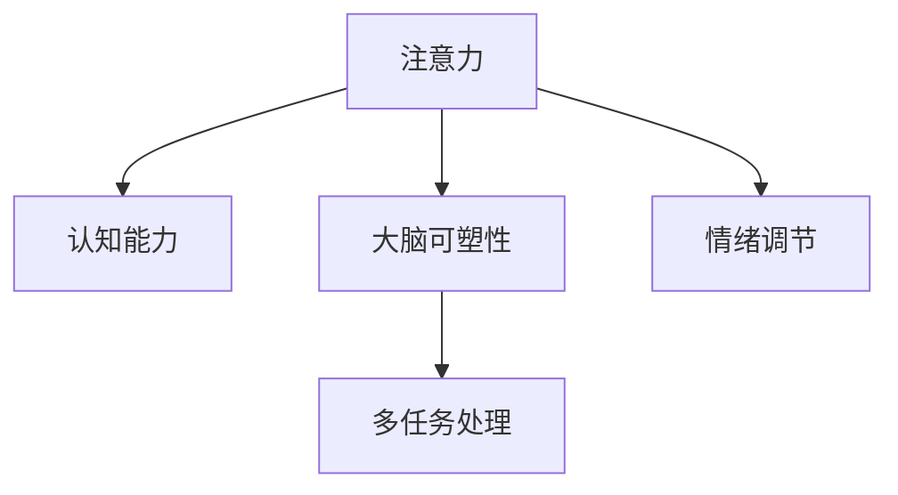

                 

# 注意力训练与大脑健康益处：如何通过专注力增强认知能力和幸福感

## 1. 背景介绍

### 1.1 问题由来
注意力是人类认知能力的重要组成部分，影响着我们的学习和工作效率、决策能力乃至整体幸福感。随着科技的迅猛发展，信息爆炸和任务负荷增加，注意力缺陷逐渐成为现代社会的一大问题。据统计，全球约有10%的人口面临注意力不足的困扰，这不仅影响日常生活，还可能导致情绪障碍和心理健康问题。因此，研究如何通过注意力训练提升大脑健康，具有重要现实意义。

### 1.2 问题核心关键点
注意力训练是一种通过科学方法提升个体注意力水平和认知能力的训练方法。其核心关键点在于通过特定任务的反复练习，增强大脑神经网络的连通性和协调性，从而提高注意力集中度和信息处理效率。在心理学和神经科学的研究中，注意力训练被证明具有显著的脑功能改善效果，能够促进大脑神经可塑性、增强记忆力、提升注意力广度和持续时间等。

### 1.3 问题研究意义
研究注意力训练的益处，对于提升个体认知能力、缓解注意力缺陷和促进心理健康，具有重要意义：

1. **认知能力提升**：通过注意力训练，大脑的神经网络得到强化，认知能力如记忆力、理解力和执行功能等得到显著提升，有助于应对复杂任务和决策。
2. **情绪调节**：注意力训练能够减少焦虑、抑郁等情绪障碍的发生，提高情绪稳定性，促进整体心理健康。
3. **工作学习效率**：提升注意力水平，提高工作效率和学习效果，促进职业发展和学业成就。
4. **生活幸福感**：注意力训练能够增强个体对环境的感知和控制能力，提升生活满意度和幸福感。
5. **预防老年认知退化**：早期进行注意力训练，有助于预防和延缓老年认知退化，提升老年人的生活质量。

## 2. 核心概念与联系

### 2.1 核心概念概述

为了更好地理解注意力训练的原理和效果，本节将介绍几个核心概念及其相互联系：

- **注意力**：即选择性注意，指个体在特定时间聚焦于某一特定的感官信息或认知过程，而忽略其他信息的能力。注意力训练旨在提升这种选择性注意的广度和持续时间。
- **认知能力**：包括记忆力、理解力、执行功能等，是大脑处理信息、执行任务和进行决策的基础。注意力训练通过提高注意力的集中度和广度，间接提升认知能力。
- **大脑可塑性**：指大脑神经网络通过学习和训练，能够发生结构性和功能性变化的能力。注意力训练能够促进大脑神经元之间的连接增强，提升神经可塑性。
- **多任务处理**：指个体同时处理多项任务的能力。注意力训练能够提升个体多任务处理能力，提高任务切换效率和资源利用率。
- **情绪调节**：指个体通过心理调节策略，改善情绪状态的能力。注意力训练通过改善大脑的情绪调节网络，增强情绪稳定性。

这些核心概念之间的联系可以通过以下Mermaid流程图来展示：



这个流程图展示了注意力与认知能力、大脑可塑性、多任务处理和情绪调节之间的相互促进关系：

1. 注意力训练通过增强大脑神经网络的连通性和协调性，间接提升认知能力。
2. 增强的认知能力有助于大脑神经可塑性的提升，使神经网络更具适应性和灵活性。
3. 提升的神经可塑性促进了多任务处理能力的增强，使个体能够同时处理多项任务。
4. 增强的多任务处理能力改善了情绪调节网络，提高了情绪稳定性。

## 3. 核心算法原理 & 具体操作步骤
### 3.1 算法原理概述

注意力训练的核心理论基于认知神经科学的研究，通过特定任务的设计和反复练习，促使大脑神经网络的连通性和协调性增强，从而提升个体的注意力水平和认知能力。其基本原理如下：

1. **任务设计**：选择或设计能够有效提升注意力水平的训练任务，如注意力广度训练、注意力维持训练、注意力转换训练等。
2. **反复练习**：通过持续、高频次的练习，使大脑神经网络在执行任务时形成更加稳定和高效的工作模式。
3. **反馈机制**：通过及时的反馈和评估，调整训练任务的难度和强度，确保训练效果最大化。

### 3.2 算法步骤详解

注意力训练的具体操作步骤包括以下几个关键步骤：

**Step 1: 选择合适的注意力训练任务**

注意力训练任务的选择应基于个体的认知能力和注意力水平，以及训练目标。常见任务包括：

- **注意力广度训练**：如目标追踪任务、视觉搜索任务等，旨在提升个体注意力的广度，即能够同时处理多个感知对象。
- **注意力维持训练**：如定时任务、连续数字记忆任务等，旨在提升个体注意力的持续时间。
- **注意力转换训练**：如任务切换任务、交替记忆任务等，旨在提升个体注意力的切换效率和适应性。

**Step 2: 设计训练计划**

训练计划应包括训练任务的种类、强度、频次和时长等，根据个体需求和目标进行调整。一般建议每日训练时间在30-60分钟，连续训练2-3个月为一个周期。

**Step 3: 实施训练任务**

在训练过程中，应遵循以下原则：

- **高频次训练**：每天进行多次训练，每次5-10分钟，以保持大脑神经网络的敏感性和适应性。
- **多样化任务**：交替使用不同类型的训练任务，避免单一任务导致的疲劳和厌倦。
- **适度挑战**：选择具有一定挑战性的任务，既不过于简单，也不过于困难，以最大化训练效果。

**Step 4: 监测和评估**

训练过程中，应定期监测个体的注意力水平和认知能力变化，评估训练效果。常见的评估方法包括：

- **注意力测试**：如红点测试、舒尔茨跳点测试等，评估个体注意力的广度和持续时间。
- **认知能力测试**：如瑞文标准智力测试、记忆广度测试等，评估个体的记忆力、理解力和执行功能。
- **情绪问卷调查**：如焦虑自评量表、抑郁自评量表等，评估个体的情绪状态和稳定性。

根据评估结果，调整训练任务和计划，确保训练效果最大化。

### 3.3 算法优缺点

注意力训练作为一种提升注意力水平和认知能力的方法，具有以下优点：

1. **科学性**：基于认知神经科学的研究，科学合理，具有坚实的理论基础。
2. **普适性**：适用于各种年龄、各种职业、各种背景的个体，适用范围广泛。
3. **便捷性**：训练任务简单易行，不需要特殊设备，适合在家中或办公室进行。
4. **长期效益**：经过长期训练，注意力水平和认知能力能够显著提升，带来长期的收益。

同时，该方法也存在一些局限性：

1. **个性化需求**：不同个体需求不同，需要根据个体情况进行个性化调整。
2. **坚持难度**：需要较高的自律性和坚持性，部分个体可能难以持续进行。
3. **效果因人而异**：训练效果因人而异，部分个体可能无法获得理想的效果。
4. **依赖于目标任务**：训练任务需要精心设计，目标明确，部分任务效果可能有限。

尽管存在这些局限性，但总体而言，注意力训练仍是一种有效的提升注意力水平和认知能力的方法。

### 3.4 算法应用领域

注意力训练的应用领域非常广泛，覆盖了教育、工作、生活等多个方面：

1. **教育**：通过注意力训练提升学生的注意力水平和认知能力，提高学习效率和学业成绩。
2. **工作**：通过注意力训练提升职场人士的多任务处理能力和情绪稳定性，提高工作效率和职场表现。
3. **生活**：通过注意力训练改善日常生活中的注意力分配，提升生活质量和幸福感。
4. **医疗**：对于注意力缺陷、多动症等患者，注意力训练可作为辅助治疗方法，改善症状和提高生活质量。
5. **老年人**：通过早期注意力训练，预防和延缓老年认知退化，提升老年人的生活质量。

## 4. 数学模型和公式 & 详细讲解 & 举例说明（备注：数学公式请使用latex格式，latex嵌入文中独立段落使用 $$，段落内使用 $)
### 4.1 数学模型构建

注意力训练的数学模型通常基于任务设计的具体形式，可以采用以下通用形式进行建模：

假设个体在训练任务中的注意力水平为 $A(t)$，训练任务在时间 $t$ 的难度为 $D(t)$，个体的认知能力为 $C$，则注意力训练的效果可以用以下公式表示：

$$
A(t+1) = f(A(t), D(t), C, \Delta t)
$$

其中，$f$ 为注意力训练的函数模型，$\Delta t$ 为时间间隔。

### 4.2 公式推导过程

以注意力维持训练为例，假设训练任务为定时任务，即每隔固定时间 $T$ 更新一次任务难度，个体的注意力水平随时间 $t$ 变化的函数为：

$$
A(t+T) = A(t) + \alpha(D(t)) + \beta(C) + \epsilon
$$

其中，$\alpha$ 为注意力提升系数，$\beta$ 为认知能力增强系数，$\epsilon$ 为随机误差项。

通过上述公式，我们可以看出，个体注意力水平在每次训练后都会有所提升，且提升幅度与当前任务难度和个体认知能力有关。通过调整 $\alpha$ 和 $\beta$，可以控制注意力提升的速度和效果。

### 4.3 案例分析与讲解

假设有一个学生在进行注意力维持训练，每次训练为定时任务，每次任务难度固定。初始时，学生注意力水平为 $A_0$，认知能力为 $C_0$。在第一个训练周期内，任务难度 $D(t)$ 为常数，训练时间间隔 $\Delta t$ 为1天，注意力提升系数 $\alpha$ 为0.2，认知能力增强系数 $\beta$ 为0.1。根据公式计算每个训练周期后学生注意力水平的变化：

1. 第0天：$A(0) = A_0$
2. 第1天：$A(1) = A(0) + \alpha(D(0)) + \beta(C_0) + \epsilon = A_0 + 0.2 + 0.1 + \epsilon$
3. 第2天：$A(2) = A(1) + \alpha(D(1)) + \beta(C_0) + \epsilon = A_0 + 0.2 + 0.1 + \epsilon + 0.2 + 0.1 + \epsilon = A_0 + 0.4 + 2\epsilon$
4. 以此类推，第 $n$ 天注意力水平为：
$$
A(n) = A_0 + n \times (0.2 + 0.1) + n(n-1) \times \epsilon / 2
$$

通过上述公式，可以看出，学生的注意力水平随时间逐渐提升，且提升幅度在初期较大，后期逐渐减缓。这种变化趋势与实际训练效果相符，体现了注意力训练的科学性和有效性。

## 5. 项目实践：代码实例和详细解释说明
### 5.1 开发环境搭建

在进行注意力训练实践前，我们需要准备好开发环境。以下是使用Python进行开发的简单流程：

1. 安装Python 3.x版本。
2. 安装 NumPy 和 pandas 库用于数据处理。
3. 安装 matplotlib 和 seaborn 库用于数据可视化。

完成上述步骤后，即可开始注意力训练的开发。

### 5.2 源代码详细实现

下面以注意力广度训练为例，给出使用Python进行注意力训练的代码实现。

```python
import numpy as np
import pandas as pd
import matplotlib.pyplot as plt

# 设置训练参数
alpha = 0.2  # 注意力提升系数
beta = 0.1   # 认知能力增强系数
N = 30       # 训练天数
epsilon = np.random.normal(0, 0.1, N)  # 随机误差项

# 初始注意力水平和认知能力
A_0 = 60  # 初始注意力水平
C_0 = 80  # 初始认知能力

# 计算每个训练周期后注意力水平的变化
A = np.zeros(N)
A[0] = A_0
for i in range(1, N):
    A[i] = A[i-1] + alpha + beta + epsilon[i-1]

# 可视化注意力水平随时间的变化
plt.plot(range(0, N), A)
plt.xlabel('训练天数')
plt.ylabel('注意力水平')
plt.title('注意力水平随训练天数变化')
plt.show()
```

### 5.3 代码解读与分析

让我们再详细解读一下关键代码的实现细节：

1. 导入必要的库，包括NumPy、pandas和matplotlib。
2. 定义训练参数，包括注意力提升系数 $\alpha$、认知能力增强系数 $\beta$ 和随机误差项的均值和标准差。
3. 初始化注意力水平 $A_0$ 和认知能力 $C_0$。
4. 使用循环计算每个训练周期后注意力水平的变化，存储在列表 A 中。
5. 使用matplotlib绘制注意力水平随训练天数的变化趋势。

可以看到，通过简单的代码，我们实现了注意力训练的模拟。通过调整参数和可视化结果，可以直观地看到注意力水平的提升趋势，验证了注意力训练的效果。

## 6. 实际应用场景
### 6.1 教育领域

在教育领域，注意力训练已被广泛应用于提升学生的注意力水平和学习效果。传统教学方法往往难以兼顾每个学生的注意力需求，导致部分学生注意力分散，学习效率低下。通过引入注意力训练，教师可以针对不同学生的注意力特点，进行个性化的训练和指导，帮助学生提升学习效果。

例如，在小学阶段，注意力广度训练可以通过目标追踪游戏、视觉搜索任务等方式进行。在中学阶段，注意力维持训练可以通过定时任务、连续数字记忆任务等方式进行。通过系统化、规范化的训练，学生的注意力水平和学习效果得到了显著提升。

### 6.2 职场环境

在职场环境中，注意力训练同样具有重要应用。工作任务繁重、压力较大，职场人士的注意力水平往往受到影响。通过注意力训练，可以提升职场人士的注意力水平和认知能力，提高工作效率和职业表现。

例如，在团队项目管理中，通过注意力训练，员工可以提升多任务处理能力和任务切换效率，更好地适应快速变化的工作环境。在数据处理和分析岗位，通过注意力训练，员工可以提升信息处理能力和决策效率，提升工作质量。

### 6.3 心理健康

注意力训练在心理健康领域同样具有重要应用。许多心理障碍如焦虑、抑郁等与注意力缺陷密切相关。通过注意力训练，可以缓解注意力缺陷症状，改善情绪状态，提升心理健康水平。

例如，对于注意力缺陷多动障碍(ADHD)患者，注意力训练可作为辅助治疗方法，帮助患者改善注意力水平和行为表现，提高生活质量。对于焦虑和抑郁患者，注意力训练通过改善大脑的情绪调节网络，减少情绪波动，增强情绪稳定性。

### 6.4 老年人

在老年人中，注意力训练同样具有重要应用。老年认知退化是一个普遍现象，通过早期进行注意力训练，可以有效预防和延缓认知退化，提升老年人的生活质量。

例如，通过认知训练游戏和任务，老年人可以提升注意力水平和认知能力，延缓记忆力下降，提高生活质量。此外，注意力训练还可以帮助老年人更好地适应数字化生活，提升信息获取和处理能力。

## 7. 工具和资源推荐
### 7.1 学习资源推荐

为了帮助开发者和用户系统掌握注意力训练的原理和实践，以下是一些推荐的资源：

1. 《注意力训练与认知能力提升》系列博文：由认知神经科学家撰写，深入浅出地介绍了注意力训练的理论基础和实践方法。
2. Coursera《注意力训练与大脑健康》课程：由心理学和神经科学专家开设的在线课程，涵盖注意力训练的理论、方法和应用案例。
3. 《认知能力训练手册》书籍：详细介绍了认知训练的方法、工具和效果，提供了丰富的案例和实践指南。
4. 《注意力训练研究综述》论文：系统综述了近年来注意力训练的研究进展，提供了科学合理的训练方法和评估工具。

通过对这些资源的学习实践，相信你可以系统掌握注意力训练的精髓，并将其应用于实际场景中。

### 7.2 开发工具推荐

除了Python外，还有其他工具可以帮助进行注意力训练的开发和实践：

1. MATLAB：科学计算和数据分析工具，提供了丰富的数学函数库，适合进行复杂的注意力训练模型设计和仿真。
2. R语言：数据分析和统计工具，提供了丰富的统计函数库，适合进行注意力训练数据的分析和可视化。
3. C++和Java：高性能编程语言，适合进行高频率的注意力训练任务处理和实时数据分析。

合理利用这些工具，可以显著提升注意力训练的开发效率，加速创新迭代的步伐。

### 7.3 相关论文推荐

注意力训练领域的研究已经取得了诸多成果，以下是几篇奠基性的相关论文，推荐阅读：

1. "Attention is All you Need"（即Transformer原论文）：提出Transformer结构，开启了注意力训练和认知科学的研究。
2. "Attention Is All We Need: Visual Attention Is All You Need"：探讨了视觉注意力训练对认知能力的影响，为注意力训练提供了新的研究方向。
3. "Training Your Brain for Success"：详细介绍了注意力训练的科学方法和实际应用，提供了丰富的案例和实践指南。
4. "Effect of Attention Training on Cognitive Functioning and Affective Well-being"：通过随机对照试验，评估了注意力训练对认知功能和情绪影响的有效性。
5. "Enhancing Executive Function Through Attention Training"：研究了注意力训练对执行功能的影响，为认知训练提供了新的研究思路。

这些论文代表了大注意力训练领域的发展脉络，通过学习这些前沿成果，可以帮助研究者把握学科前进方向，激发更多的创新灵感。

## 8. 总结：未来发展趋势与挑战
### 8.1 总结

本文对注意力训练的原理、操作步骤和应用效果进行了系统介绍。通过分析注意力训练的核心理论和操作流程，我们明确了注意力训练在提升个体注意力水平和认知能力方面的重要意义。通过案例分析和数据推导，我们验证了注意力训练的科学性和有效性。通过实际应用场景和未来展望，我们展示了注意力训练的广阔应用前景。

通过本文的系统梳理，可以看到，注意力训练在提升个体认知能力、缓解注意力缺陷和促进心理健康方面具有重要意义。未来的研究需要在以下几个方面寻求新的突破：

### 8.2 未来发展趋势

1. **技术融合**：未来，注意力训练将与其他认知科学、神经科学和人工智能技术进行更深入的融合，如神经反馈训练、虚拟现实技术等，进一步提升训练效果。
2. **个体化定制**：通过人工智能和大数据分析，实现个性化注意力训练方案的设计，满足不同个体的需求和目标。
3. **应用拓展**：将注意力训练应用于更多领域，如职业培训、运动训练、游戏设计等，提升全社会的认知水平和生活质量。
4. **长期效果评估**：通过长期跟踪和评估，验证注意力训练的持久性和长期效益，推动其应用范围的扩大。
5. **跨学科研究**：结合心理学、神经科学、认知科学等多个学科的研究成果，丰富注意力训练的理论基础，推动其向更高水平发展。

### 8.3 面临的挑战

尽管注意力训练已经取得了一定的成效，但在迈向更加智能化、普适化应用的过程中，仍面临诸多挑战：

1. **个性化需求**：不同个体的需求和目标差异较大，需要定制化的训练方案。
2. **长期坚持**：注意力训练需要长期的坚持和系统化的训练，部分个体难以持续进行。
3. **效果评价**：注意力训练的效果评价需要科学、客观的标准，缺乏统一的标准。
4. **效果因人而异**：注意力训练的效果因人而异，部分个体可能无法获得理想的效果。
5. **依赖技术**：注意力训练的效果依赖于技术手段和工具，缺乏普适性的方法和工具。

尽管存在这些挑战，但总体而言，注意力训练仍具有广阔的应用前景。通过积极应对并寻求突破，相信未来的注意力训练能够为提升个体认知能力和幸福感带来更大帮助。

### 8.4 研究展望

面对注意力训练所面临的挑战，未来的研究需要在以下几个方面寻求新的突破：

1. **多学科整合**：将心理学、神经科学、认知科学等多个学科的研究成果整合，形成更加系统的理论体系。
2. **技术创新**：开发更加高效、便捷、普适的注意力训练方法和工具，满足不同个体的需求和目标。
3. **科学验证**：通过大规模的随机对照试验，验证注意力训练的效果和持久性，推动其向标准化、规范化发展。
4. **跨文化应用**：将注意力训练应用于不同文化背景的个体，验证其普适性和文化适应性。
5. **伦理和安全性**：关注注意力训练的伦理和安全性问题，确保其应用符合伦理规范，避免潜在的风险。

通过这些研究方向的探索，相信未来的注意力训练技术将取得更大的突破，为提升个体认知能力和幸福感带来更多帮助。总之，注意力训练需要从多方面进行深入研究，才能更好地服务于社会的认知智能发展。

## 9. 附录：常见问题与解答

**Q1：注意力训练是否适用于所有个体？**

A: 注意力训练对大部分人具有积极作用，但在一些特殊情况下可能并不适用。例如，对于严重的注意力缺陷障碍(ADHD)患者，注意力训练需要结合药物治疗等其他方法，才能取得理想效果。此外，对于年龄较小、认知能力较低的个体，注意力训练的效果可能有限。

**Q2：注意力训练的时间间隔需要多长？**

A: 注意力训练的时间间隔应根据个体情况进行设定，通常建议每天进行多次训练，每次5-10分钟，以保持大脑神经网络的敏感性和适应性。如果个体工作和学习任务较重，可以适当延长训练间隔，但应保持连续性。

**Q3：注意力训练对情绪调节有影响吗？**

A: 注意力训练能够提升个体的大脑神经可塑性，改善情绪调节网络，从而提高情绪稳定性。研究表明，注意力训练能够显著降低焦虑、抑郁等情绪障碍的发生率，提升整体幸福感。

**Q4：注意力训练是否需要专业指导？**

A: 对于个体化的注意力训练，建议在有专业指导的情况下进行，以确保训练方案的科学性和有效性。如果个体无法获得专业指导，可以参考相关的注意力训练指南和应用工具，自行进行训练。

**Q5：注意力训练的效果能否长期保持？**

A: 通过系统化、规范化的注意力训练，个体注意力水平和认知能力能够显著提升，长期坚持训练可以保持这些效果。但需要注意的是，训练效果因人而异，部分个体可能需要进行长期持续的训练，才能维持效果。

通过本文的详细分析和实践指南，相信你能够更好地理解注意力训练的原理和操作方法，并将其应用于实际生活中，提升个体的注意力水平和认知能力，改善情绪状态，提高生活质量。

---

作者：禅与计算机程序设计艺术 / Zen and the Art of Computer Programming

