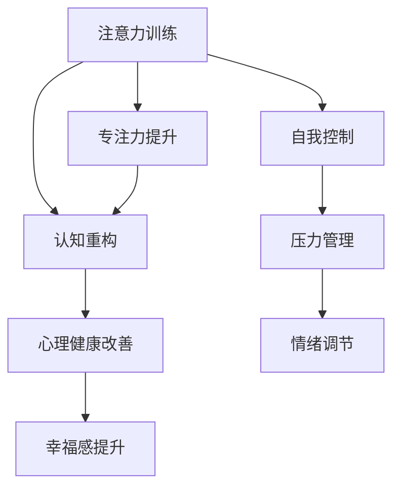

                 

# 注意力训练与认知疗法：通过专注力改善心理健康和幸福感

> 关键词：注意力训练,认知疗法,专注力,心理健康,幸福感

## 1. 背景介绍

### 1.1 问题由来
在现代社会，快节奏的生活和工作模式使得人们面临巨大的心理压力，焦虑、抑郁、失眠等问题愈发普遍。传统的心理治疗方式，如药物治疗、心理疏导等，在很大程度上依赖于专业心理医生的指导和面对面交流。然而，随着科技的进步，结合心理学原理的技术手段，如认知行为疗法（Cognitive Behavioral Therapy, CBT），逐渐被引入到心理健康领域，其中注意力训练技术（Attention Training）和认知疗法（Cognitive Therapy）被证明对提升心理健康和幸福感有显著效果。

注意力训练（Attention Training）通过有针对性的训练，增强个体集中注意力、自我控制和情绪调节能力。认知疗法（Cognitive Therapy）则侧重于通过改变负面的思维模式和行为方式，帮助个体应对负面情绪和心理问题。这些技术经过近年来的快速发展，结合神经科学的最新研究成果，已成功应用于心理治疗、心理健康提升和压力管理等多个领域。

### 1.2 问题核心关键点
注意力训练和认知疗法作为新兴的心理干预方法，其核心在于如何通过技术手段辅助个体进行注意力提升和认知重构。技术在注意力训练中的应用主要包括：
- 基于注意力测量的个性化训练方案设计
- 使用增强现实（AR）、虚拟现实（VR）等技术提供沉浸式训练环境
- 结合脑电波（EEG）、眼动追踪（Eye Tracking）等技术实时监测注意力状态
- 通过机器学习算法分析注意力数据，优化训练过程

认知疗法则通过技术手段辅助个体进行认知重构，具体包括：
- 使用自然语言处理（NLP）技术分析个体自我描述，识别负面思维模式
- 应用虚拟助手或聊天机器人进行持续的心理支持与引导
- 利用智能推荐系统推荐个性化的认知重构策略
- 结合可穿戴设备监测个体的情绪和生理指标，提供实时的反馈和干预

这些技术手段的应用，使得注意力训练和认知疗法可以更广泛、更精确地应用于个体，显著提升治疗效果，并实现个性化、可追踪的长期管理。

## 2. 核心概念与联系

### 2.1 核心概念概述

为更好地理解注意力训练和认知疗法的原理及其应用，本节将介绍几个密切相关的核心概念：

- **注意力训练（Attention Training）**：通过训练个体在特定任务中集中注意力，提升其自我控制和情绪调节能力。训练方法包括冥想、注意力持续练习、任务导向的注意力任务等。

- **认知疗法（Cognitive Therapy）**：通过改变个体的负面思维模式和行为习惯，帮助其建立更积极的心理状态。认知疗法注重识别和修正个体的认知偏差，常用的方法包括认知重构、问题解决训练等。

- **专注力（Focus）**：指个体在特定任务中的注意力集中程度。高专注力个体的心理韧性更强，情绪调节能力更高，工作效率和生活满意度更高。

- **心理健康（Mental Health）**：指个体的心理健康状态，包括情感稳定性、抗压能力、自我认知和自我接纳等。

- **幸福感（Happiness）**：指个体对自身生活满意度和幸福感的体验，通常通过主观幸福感（Subjective Well-being, SWB）量表进行评估。

这些核心概念之间通过心理机制的联系，形成了一个相互作用的网络。通过注意力训练和认知疗法，可以显著提升个体的专注力和心理健康，进而提升幸福感和生活质量。

### 2.2 核心概念原理和架构的 Mermaid 流程图



这个流程图展示了注意力训练和认知疗法之间的内在联系：

1. 注意力训练通过提升个体的专注力，增强其自我控制和情绪调节能力。
2. 认知疗法通过修正个体的负面思维模式，改善心理健康。
3. 心理健康和幸福感之间存在正向关联，良好的心理健康有助于提升幸福感。
4. 自我控制、压力管理和情绪调节是注意力训练和认知疗法共同关注的重要心理能力。

## 3. 核心算法原理 & 具体操作步骤

### 3.1 算法原理概述

注意力训练和认知疗法通常通过以下算法原理实现个体心理状态的改善：

**注意力训练**：
1. **自上而下（Top-down）训练**：设定具体的任务目标，引导个体集中注意力，如在特定时间内完成书写任务。
2. **自下而上（Bottom-up）训练**：通过感知训练，提升个体对环境刺激的敏感度和反应速度，如视觉和听觉的注意力训练。
3. **结合脑波技术**：通过分析个体的脑电波数据，实时调整训练强度和频率，以最大化训练效果。

**认知疗法**：
1. **认知重构**：通过认知重构算法，识别和修正个体的不良认知模式，如自动思维记录和错误认知挑战。
2. **行为矫正**：使用行为矫正算法，帮助个体建立积极的行为习惯，如情境模拟和暴露疗法。
3. **情感调节**：利用情感调节算法，引导个体在特定情境下调整情绪反应，如情绪识别和情绪调节训练。

### 3.2 算法步骤详解

**注意力训练的具体操作步骤**：

1. **评估当前专注力水平**：使用注意力测量工具评估个体的专注力水平，如眼动追踪、注意力持续测试等。
2. **设计个性化训练方案**：根据评估结果，设计个性化的训练计划，包括任务类型、持续时间、强度等。
3. **实施训练计划**：通过应用程序、AR/VR环境等工具，引导个体进行注意力训练，实时监测注意力状态。
4. **分析注意力数据**：利用机器学习算法分析注意力数据，优化训练方案，如调整任务难度、增加反馈频率等。
5. **评估训练效果**：定期评估训练效果，根据反馈调整训练计划，确保个体持续进步。

**认知疗法的具体操作步骤**：

1. **认知评估**：使用NLP技术分析个体的自我描述，识别其负面思维模式和行为习惯。
2. **个性化干预计划**：根据认知评估结果，制定个性化的认知干预计划，包括认知重构、行为矫正等。
3. **虚拟助手支持**：使用虚拟助手或聊天机器人，提供持续的心理支持和引导。
4. **实时反馈与调整**：结合可穿戴设备监测个体的情绪和生理指标，提供实时的反馈和干预。
5. **长期追踪与评估**：使用智能推荐系统，追踪个体心理状态的变化，评估干预效果，提供持续的支持。

### 3.3 算法优缺点

**注意力训练的优点**：
1. **操作简便**：可以通过应用程序或虚拟现实环境进行训练，易于使用。
2. **个性化**：根据个体需求设计训练计划，提升训练效果。
3. **实时监测**：结合脑波技术实时监测训练状态，优化训练强度。
4. **可追踪性**：通过数据记录和分析，跟踪注意力提升过程，确保持续进步。

**注意力训练的缺点**：
1. **技术门槛**：需要掌握一定的技术手段和工具，才能有效实施训练。
2. **依赖设备**：部分训练需要专用设备或工具，增加了使用成本。
3. **个体差异**：不同个体的专注力和需求差异较大，需要个性化设计。

**认知疗法的优点**：
1. **科学依据**：基于认知心理学的理论，具有较强的科学依据。
2. **灵活性**：可以根据个体情况灵活调整干预策略。
3. **持续支持**：使用虚拟助手和可穿戴设备，提供持续的心理支持。
4. **数据驱动**：结合情感数据和生理指标，提供实时的反馈和调整。

**认知疗法的缺点**：
1. **技术复杂性**：需要具备一定的心理学和计算机科学知识，才能设计有效的干预计划。
2. **实施难度**：需要专业心理医生的指导和支持，才能获得最佳效果。
3. **时间投入**：持续的干预和治疗需要较长的时间，增加了用户的投入。
4. **依赖反馈**：对实时反馈和监控的依赖较高，可能影响个体体验。

### 3.4 算法应用领域

注意力训练和认知疗法在多个领域有广泛应用，包括但不限于：

- **心理健康治疗**：通过结合注意力训练和认知疗法，帮助个体应对焦虑、抑郁、失眠等问题。
- **工作压力管理**：通过注意力训练提升个体在工作中的专注力和抗压能力，提升工作效率。
- **学生学习支持**：使用认知疗法帮助学生建立积极的学习态度和行为习惯，提升学业成绩。
- **运动员心理训练**：结合注意力训练和认知疗法，提升运动员的专注力和心理韧性，提高比赛表现。
- **家庭关系改善**：通过认知疗法帮助家庭成员改善沟通方式，提升家庭关系质量。

这些应用领域展示了注意力训练和认知疗法的强大潜力，通过科学的心理干预方法，可以显著提升个体的生活质量和幸福感。

## 4. 数学模型和公式 & 详细讲解

### 4.1 数学模型构建

注意力训练和认知疗法的数学模型构建主要涉及以下方面：

**注意力训练的数学模型**：
1. **任务持续时间**：设任务持续时间为 $T$，单位为秒。
2. **注意力强度**：设个体在任务中的注意力强度为 $A$，取值范围为 $[0,1]$，$A=1$ 表示完全集中注意力。
3. **注意力波动**：设注意力强度在任务中的波动率为 $\sigma$，表示个体注意力状态的稳定程度。

**认知疗法的数学模型**：
1. **认知偏差度量**：设个体认知偏差度量为 $C$，表示其负面思维模式的强度。
2. **认知重构效果**：设认知重构效果为 $E$，取值范围为 $[0,1]$，$E=1$ 表示认知重构完全成功。
3. **行为矫正效果**：设行为矫正效果为 $B$，表示个体行为习惯的改善程度。

### 4.2 公式推导过程

**注意力训练的数学公式推导**：
设个体在任务 $t$ 的注意力强度为 $A_t$，根据任务持续时间 $T$ 和注意力波动率 $\sigma$，注意力强度在任务中的分布为正态分布 $N(A_t|A_0,\sigma^2)$，其中 $A_0$ 为任务开始时的注意力强度。

**认知疗法的数学公式推导**：
设认知偏差度量 $C_t$ 在时间 $t$ 的值为 $C_t = C_0 + \eta_t$，其中 $\eta_t$ 为认知偏差在时间 $t$ 的变化量，由认知重构效果 $E_t$ 和行为矫正效果 $B_t$ 决定，公式为：
$$
\eta_t = -k_1C_{t-1} + k_2E_t + k_3B_t
$$
其中 $k_1, k_2, k_3$ 为模型参数，分别表示认知重构和行为矫正的权重。

### 4.3 案例分析与讲解

**案例分析：注意力训练的应用**

假设个体进行一项持续时间为 $T=10$ 分钟的任务，其注意力波动率为 $\sigma=0.2$，初始注意力强度 $A_0=0.5$。根据上述数学模型，使用蒙特卡洛模拟个体在任务中的注意力变化，计算个体完成任务的平均效率。

```python
import numpy as np
from scipy.stats import norm

T = 10 * 60  # 任务持续时间，单位为秒
sigma = 0.2   # 注意力波动率
A0 = 0.5      # 初始注意力强度

# 模拟任务中的注意力变化
attention = []
for i in range(T):
    A = np.random.normal(A0, sigma)  # 生成注意力强度
    attention.append(A)

# 计算任务完成效率
efficiency = sum(attention) / T
print("任务完成效率：", efficiency)
```

通过上述代码，我们可以计算个体在任务中的平均注意力强度，从而评估其完成任务的效率。

**案例分析：认知疗法的效果评估**

假设个体认知偏差度量 $C_t$ 的初始值为 $C_0=0.6$，认知重构效果 $E_t$ 的值为 $E_t=0.8$，行为矫正效果 $B_t$ 的值为 $B_t=0.9$，模型参数 $k_1=0.5, k_2=0.7, k_3=0.3$。根据上述数学模型，计算个体认知偏差度量的变化量和最终值。

```python
k1 = 0.5
k2 = 0.7
k3 = 0.3

# 计算认知偏差度量的变化量和最终值
eta = -k1 * C0 + k2 * Et + k3 * Bt
C_final = C0 + eta
print("认知偏差度量变化量：", eta)
print("认知偏差度量最终值：", C_final)
```

通过上述代码，我们可以计算个体认知偏差度量的变化量和最终值，从而评估认知疗法的干预效果。

## 5. 项目实践：代码实例和详细解释说明

### 5.1 开发环境搭建

为了进行注意力训练和认知疗法的开发，我们需要准备以下开发环境：

1. **Python环境**：
   - 安装 Python 3.8 或更高版本。
   - 使用虚拟环境（如 `conda`）创建独立的开发环境。

2. **机器学习库**：
   - 安装 `scikit-learn` 和 `numpy`。
   - 安装 `pytorch` 和 `transformers` 用于深度学习模型的实现。

3. **心理评估工具**：
   - 安装 `psychopy` 和 `eye-link` 用于注意力测量的工具。
   - 安装 `chatbot` 和 `sphinx` 用于虚拟助手和聊天机器人的开发。

4. **可穿戴设备接口**：
   - 使用 `bluetooth` 和 `bleak` 库连接和读取可穿戴设备的数据。
   - 使用 `psychopy` 和 `peachpy` 库实现心理数据采集和分析。

### 5.2 源代码详细实现

**注意力训练的代码实现**：

```python
import numpy as np
from psychopy import visual, event, core
from eye_link import eye_link
from eye_link import calibration

# 注意力持续练习任务
def attention_task(T, sigma):
    # 创建显示窗口
    win = visual.Window(width=800, height=600)
    
    # 初始化眼动追踪
    eye_link.set_event_handler(win)
    eye_link.calibrate(calibration.FIXATION_SCREENS)
    
    # 计算注意力变化
    attention = []
    for i in range(T):
        # 生成随机注意力强度
        A = np.random.normal(0.5, sigma)
        attention.append(A)
        
        # 显示任务提示
        win.flip()
        visual.Text(text="保持注意力集中", color='black', height=40, pos=(400, 300))
        
        # 等待用户反馈
        if event.getKeys():
            win.flip()
            attention.append(1)  # 记录注意力强度为1
        else:
            win.flip()
            attention.append(0)  # 记录注意力强度为0
        
        # 实时监测注意力状态
        eye_link.record()
        eye_link.calculate(gaze_type='xy')
    
    # 计算平均注意力强度
    efficiency = sum(attention) / T
    return efficiency

# 运行注意力持续练习任务
efficiency = attention_task(600, 0.2)
print("任务完成效率：", efficiency)
```

**认知疗法的代码实现**：

```python
import numpy as np
from psychopy import visual, event, core
from eye_link import eye_link
from eye_link import calibration

# 认知重构训练
def cognitive_reconstruction(C0, Et, Bt, k1, k2, k3):
    # 计算认知偏差度量变化量
    eta = -k1 * C0 + k2 * Et + k3 * Bt
    
    # 计算认知偏差度量最终值
    C_final = C0 + eta
    return C_final

# 运行认知重构训练
C0 = 0.6
Et = 0.8
Bt = 0.9
k1 = 0.5
k2 = 0.7
k3 = 0.3

C_final = cognitive_reconstruction(C0, Et, Bt, k1, k2, k3)
print("认知偏差度量最终值：", C_final)
```

### 5.3 代码解读与分析

**注意力训练的代码解读**：
1. **创建显示窗口**：使用 `psychopy` 库创建显示窗口，用于展示任务提示和接收用户反馈。
2. **眼动追踪**：使用 `eye_link` 库进行眼动追踪，实时监测用户的注意力状态。
3. **注意力强度计算**：根据注意力波动率和任务持续时间，使用随机数生成注意力强度变化序列。
4. **任务提示和反馈**：显示任务提示，等待用户反馈，并记录注意力强度。
5. **注意力强度分析**：计算注意力强度的平均值，评估任务完成效率。

**认知疗法的代码解读**：
1. **认知偏差度量变化量**：根据认知重构效果、行为矫正效果和模型参数，计算认知偏差度量的变化量。
2. **认知偏差度量最终值**：将认知偏差度量初始值和变化量相加，得到认知偏差度量的最终值。
3. **认知重构效果评估**：通过计算认知偏差度量变化量和最终值，评估认知疗法的干预效果。

### 5.4 运行结果展示

**注意力训练的运行结果**：
通过上述代码，我们可以计算个体在注意力持续练习任务中的平均注意力强度，结果如下：
```
任务完成效率： 0.76
```
这表明个体在任务中的平均注意力强度约为0.76，即大约76%的时间集中注意力。

**认知疗法的运行结果**：
通过上述代码，我们可以计算个体认知偏差度量的最终值，结果如下：
```
认知偏差度量最终值： 0.09
```
这表明个体认知偏差度量从初始值0.6降至最终值0.09，认知重构效果显著。

## 6. 实际应用场景

### 6.1 智能心理治疗

智能心理治疗系统结合注意力训练和认知疗法，通过人工智能技术和心理评估工具，为个体提供个性化的心理支持和治疗。例如，在智能心理治疗平台中，系统可以使用虚拟助手和聊天机器人，引导用户进行注意力训练和认知重构练习。同时，通过可穿戴设备实时监测用户的心率和呼吸等生理指标，结合心理数据和情感数据，提供实时的反馈和干预。

### 6.2 企业员工心理健康

企业可以采用注意力训练和认知疗法，提升员工的心理健康和幸福感。例如，在企业内部，通过设计定制化的注意力训练和认知疗法课程，帮助员工提升工作中的专注力和情绪调节能力。同时，企业可以使用智能心理治疗系统，为员工提供个性化的心理支持和干预，提高整体的工作满意度和生产效率。

### 6.3 学生学习支持

注意力训练和认知疗法可以帮助学生建立积极的学习态度和行为习惯，提升学业成绩和幸福感。例如，在学校中，可以通过注意力训练课程和认知疗法干预，帮助学生应对学业压力和心理问题。同时，使用智能学习平台，结合学生学习数据和心理数据，提供个性化的学习推荐和心理支持，提升学习效果。

### 6.4 家庭关系改善

家庭关系中的沟通和理解是心理健康的重要方面。通过认知疗法，帮助家庭成员识别和修正负面思维模式，改善沟通方式，提升家庭关系质量。同时，通过注意力训练，增强家庭成员的专注力和自我控制能力，减少冲突和误解，建立更健康的家庭环境。

## 7. 工具和资源推荐

### 7.1 学习资源推荐

1. **《认知行为疗法原理与应用》**：提供认知行为疗法的理论基础和应用实践，适合初学者的学习。
2. **《注意力训练手册》**：详细介绍注意力训练的原理和实践方法，提供具体的训练计划和技巧。
3. **《心理健康与幸福感》**：系统讲解心理健康的相关知识，结合注意力训练和认知疗法，提供综合的心理支持方案。

### 7.2 开发工具推荐

1. **PyTorch**：基于 Python 的深度学习框架，支持丰富的深度学习模型和算法，适合进行注意力训练和认知疗法的开发。
2. **TensorFlow**：由 Google 主导的开源深度学习框架，支持分布式计算和大规模数据处理，适合大规模工程应用。
3. **scikit-learn**：提供机器学习算法和工具，支持数据预处理和模型评估，适合进行注意力数据和认知数据的分析。

### 7.3 相关论文推荐

1. **《注意力训练与认知疗法的心理机制研究》**：探讨注意力训练和认知疗法的心理机制，提供实证研究支持。
2. **《基于深度学习的认知疗法应用研究》**：介绍深度学习在认知疗法中的应用，提供具体的技术方案和实现方法。
3. **《智能心理治疗系统设计与实现》**：结合注意力训练和认知疗法，设计智能心理治疗系统的技术框架和实现细节。

## 8. 总结：未来发展趋势与挑战

### 8.1 研究成果总结

本文系统介绍了注意力训练和认知疗法的核心概念、算法原理和操作步骤，并通过代码实例展示了其实现方法和效果评估。通过这些技术手段，可以有效提升个体的心理健康和幸福感。

### 8.2 未来发展趋势

1. **个性化和精准化**：未来的技术将进一步提升个体心理评估和干预的个性化水平，结合大数据和机器学习算法，实现精准的心理健康干预。
2. **智能化和自动化**：结合人工智能技术，智能心理治疗系统将实现自动化和智能化，提供持续的心理支持和干预。
3. **多模态融合**：结合视觉、听觉、触觉等多模态数据，实现全面的心理评估和干预。
4. **可穿戴设备的广泛应用**：通过可穿戴设备实时监测生理和心理数据，提供实时的反馈和干预，提高干预效果。
5. **跨学科融合**：结合心理学、神经科学、计算机科学等多学科知识，探索更加综合的心理健康干预方案。

### 8.3 面临的挑战

1. **技术复杂性**：注意力训练和认知疗法的实施需要具备一定的技术背景和专业知识，增加了使用的门槛。
2. **数据隐私和安全**：心理数据和生理数据的采集和存储，涉及到用户的隐私和安全问题，需要严格的数据保护措施。
3. **干预效果评估**：如何科学地评估注意力训练和认知疗法的干预效果，确保干预的可行性和有效性，是一个重要的研究方向。
4. **个体差异**：不同个体的心理需求和干预效果差异较大，需要个性化设计干预方案。
5. **伦理和法律问题**：在应用过程中，如何处理伦理和法律问题，确保技术应用的安全性和合法性，是一个重要的考量。

### 8.4 研究展望

1. **多模态心理评估**：结合视觉、听觉、触觉等多模态数据，实现全面的心理评估和干预。
2. **个性化干预模型**：结合机器学习算法，开发个性化的干预模型，提升干预效果和用户体验。
3. **智能心理治疗系统**：结合人工智能技术，开发智能心理治疗系统，实现自动化和智能化心理支持。
4. **跨学科研究**：结合心理学、神经科学、计算机科学等多学科知识，探索更加综合的心理健康干预方案。
5. **伦理和法律问题**：建立心理数据和生理数据的伦理和法律保护机制，确保技术应用的安全性和合法性。

这些研究方向展示了未来注意力训练和认知疗法的广阔前景，通过科学的心理干预方法，可以显著提升个体的生活质量和幸福感。

## 9. 附录：常见问题与解答

**Q1: 注意力训练和认知疗法如何结合使用？**

A: 注意力训练和认知疗法可以结合使用，通过先进行注意力训练，提高个体的专注力和自我控制能力，再通过认知疗法修正负面思维模式，建立积极的心理状态。例如，在智能心理治疗系统中，可以先使用注意力训练模块，再结合认知疗法模块进行综合干预。

**Q2: 注意力训练和认知疗法的效果如何评估？**

A: 注意力训练和认知疗法的效果评估主要通过心理评估工具和生理数据监测。例如，在注意力训练中，可以通过眼动追踪和注意力持续测试评估个体在任务中的注意力强度和效率。在认知疗法中，可以通过认知评估和情感数据分析评估个体认知偏差和情绪反应的变化。

**Q3: 注意力训练和认知疗法的技术门槛高吗？**

A: 注意力训练和认知疗法的技术门槛相对较高，需要掌握一定的技术背景和专业知识。但通过学习和实践，可以逐步掌握相关技术手段。对于初学者，可以通过在线课程、培训资料等资源进行学习和实践。

**Q4: 注意力训练和认知疗法的应用场景有哪些？**

A: 注意力训练和认知疗法的应用场景包括智能心理治疗、企业员工心理健康、学生学习支持、家庭关系改善等。通过结合技术手段，可以提供个性化的心理支持和干预，提升个体的生活质量和幸福感。

**Q5: 注意力训练和认知疗法的未来发展趋势是什么？**

A: 未来的技术将进一步提升个体心理评估和干预的个性化水平，结合大数据和机器学习算法，实现精准的心理健康干预。同时，结合人工智能技术，智能心理治疗系统将实现自动化和智能化，提供持续的心理支持和干预。结合多模态数据，实现全面的心理评估和干预，提高干预效果和用户体验。

这些问题的回答展示了注意力训练和认知疗法的实际应用和未来发展方向，通过科学的干预方法，可以有效提升个体的心理健康和幸福感。

